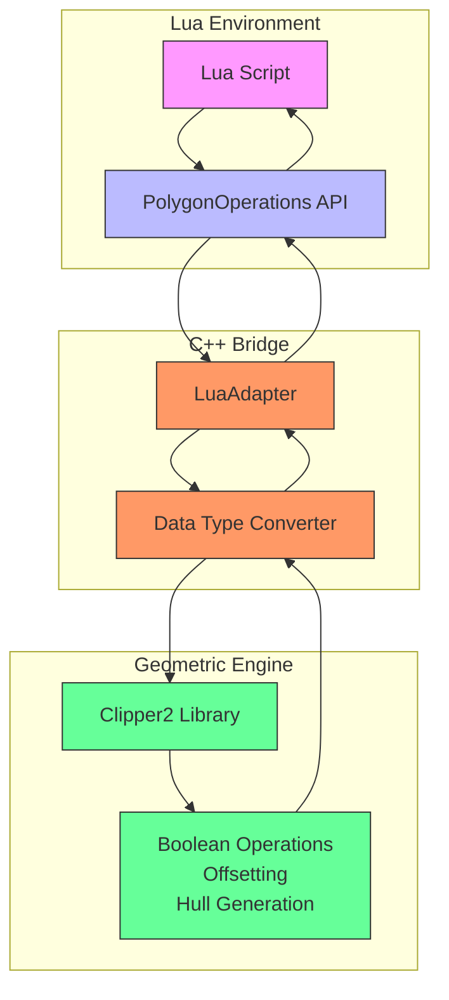
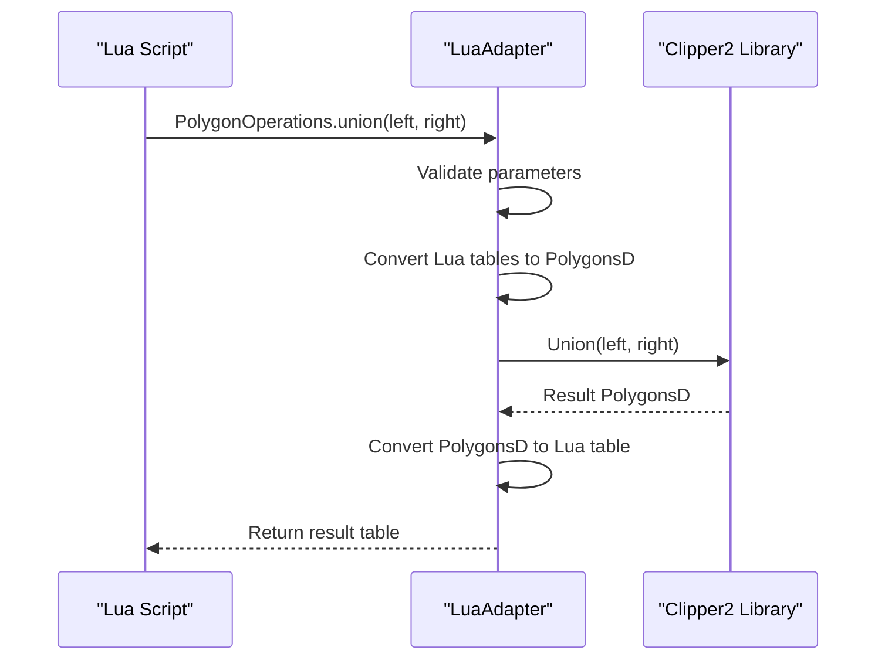
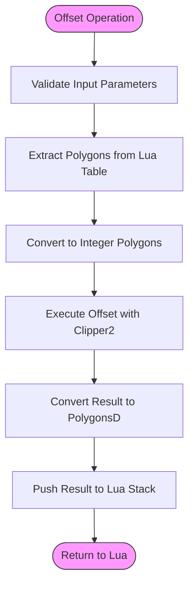
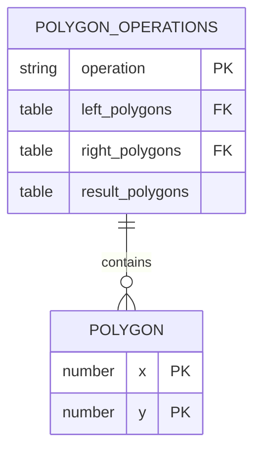
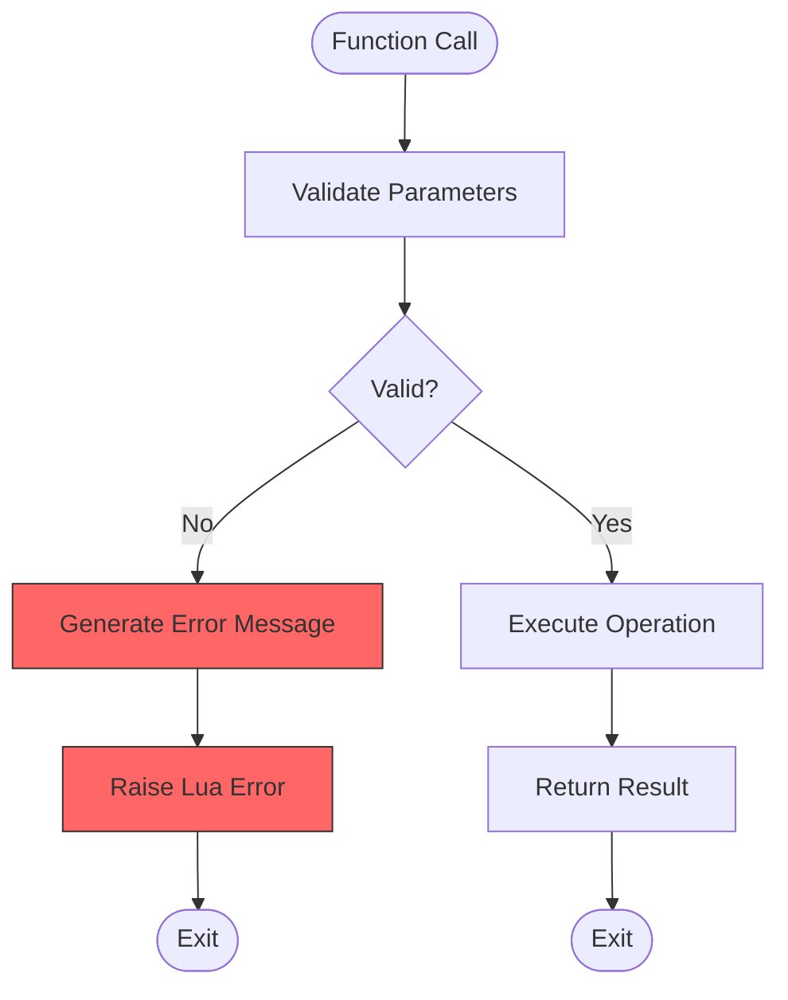

# 2D Geometry Operations

<cite>
**Referenced Files in This Document**   
- [LuaAdapter.cpp](file://2D/LuaAdapter.cpp)
- [LuaAdapter.hpp](file://2D/LuaAdapter.hpp)
- [FloatPolygons.hpp](file://2D/FloatPolygons.hpp)
- [IntPolygon.hpp](file://2D/IntPolygon.hpp)
- [2Dhull.hpp](file://2D/2Dhull.hpp)
- [2Dhull.cpp](file://2D/2Dhull.cpp)
- [FloatPolygons.cpp](file://2D/FloatPolygons.cpp)
- [IntPolygon.cpp](file://2D/IntPolygon.cpp)
- [custom_fill.lua](file://tests/PolygonFill/custom_fill.lua)
- [image_from_polygons.lua](file://tests/PolygonFill/image_from_polygons.lua)
</cite>

## Table of Contents
1. [Introduction](#introduction)
2. [Core Components](#core-components)
3. [Architecture Overview](#architecture-overview)
4. [Detailed Component Analysis](#detailed-component-analysis)
5. [Lua API Reference](#lua-api-reference)
6. [Performance Considerations](#performance-considerations)
7. [Usage Examples](#usage-examples)
8. [Error Handling](#error-handling)
9. [Conclusion](#conclusion)

## Introduction
The 2D Geometry Operations via Lua component provides a powerful scripting interface for performing complex polygon operations in the HsBaSlicer application. This system enables users to customize geometric computations through Lua scripts, offering flexibility for advanced slicing and path generation tasks. The architecture bridges C++ performance-critical geometric algorithms with Lua's scripting capabilities, allowing for dynamic manipulation of 2D polygons through boolean operations, offsetting, hull generation, and area calculations. This document details the implementation, API, and best practices for leveraging this hybrid system effectively.

## Core Components
The 2D Geometry Operations system consists of several interconnected components that enable Lua scripting of polygon operations. The core functionality is implemented in the 2D/LuaAdapter.cpp file, which provides the C++/Lua binding layer. This adapter translates between Lua tables and C++ polygon data structures (PolygonD, PolygonsD, Polygon, Polygons), exposing geometric operations from the Clipper2 library through a Lua interface. The system leverages two primary data representations: double-precision floating point polygons (PolygonD/PolygonsD) for high-precision calculations and integer-based polygons (Polygon/Polygons) for performance-critical operations. The 2Dhull component implements convex and concave hull generation algorithms, while FloatPolygons and IntPolygon provide the underlying geometric operation implementations.

**Section sources**
- [LuaAdapter.cpp](file://2D/LuaAdapter.cpp#L1-L287)
- [FloatPolygons.hpp](file://2D/FloatPolygons.hpp#L1-L72)
- [IntPolygon.hpp](file://2D/IntPolygon.hpp#L1-L75)
- [2Dhull.hpp](file://2D/2Dhull.hpp#L1-L21)

## Architecture Overview
The 2D Geometry Operations architecture follows a bridge pattern, connecting Lua scripting capabilities with high-performance C++ geometric algorithms. The system exposes a Lua API through the PolygonOperations namespace, which maps to C++ functions implemented in the 2D module. When a Lua script calls a geometric operation, the request travels through the Lua C API, where the LuaAdapter handles parameter validation, data type conversion, and function dispatch. The actual geometric computations are performed by the Clipper2 library, which provides robust implementations of boolean operations, offsetting, and other polygon algorithms. The results are then converted back to Lua tables and returned to the script. This architecture enables scriptable customization while maintaining the performance benefits of compiled C++ code for computationally intensive geometric operations.



**Diagram sources**
- [LuaAdapter.cpp](file://2D/LuaAdapter.cpp#L1-L287)
- [FloatPolygons.hpp](file://2D/FloatPolygons.hpp#L1-L72)
- [IntPolygon.hpp](file://2D/IntPolygon.hpp#L1-L75)

## Detailed Component Analysis

### C++/Lua Binding Mechanism
The C++/Lua binding mechanism in the 2D Geometry Operations system is implemented through the LuaAdapter component, which serves as the interface between Lua scripts and C++ geometric algorithms. The binding follows the standard Lua C API pattern, where C++ functions are registered as Lua functions with the lua_CFunction signature. The RegisterLuaPolygonOperations function creates a Lua library table named "PolygonOperations" and populates it with function pointers to the implementation functions. Each exported function follows a consistent pattern: parameter validation, data extraction from the Lua stack, type conversion, algorithm execution, result conversion, and return value pushing. This mechanism allows Lua scripts to call C++ functions as if they were native Lua functions, with seamless data exchange between the two environments.

**Section sources**
- [LuaAdapter.cpp](file://2D/LuaAdapter.cpp#L281-L286)
- [LuaAdapter.hpp](file://2D/LuaAdapter.hpp#L21-L22)

### Data Type Conversion System
The data type conversion system handles the translation between Lua tables and C++ polygon data structures. The system supports two primary conversion pathways: Lua tables to C++ polygons and C++ polygons to Lua tables. For input conversion, the LuaTableToPolygonsD and LuaTableToPolygonD functions recursively traverse Lua tables, extracting point coordinates with "x" and "y" fields and constructing PolygonD and PolygonsD objects. The reverse process is handled by PushPolygonsDToLua and PushPolygonDToLua, which create Lua tables with the same structure. A key aspect of the conversion system is the handling of precision: the system maintains double-precision floating point values in PolygonD/PolygonsD structures, while also supporting integer-based Polygon/Polygons structures through scaling by the integerization constant (1e6). This dual representation allows for both high-precision calculations and performance-optimized operations.

```mermaid
classDiagram
class LuaAdapter {
+PushPolygonDToLua(L, poly)
+PushPolygonsDToLua(L, poly)
+PushPolygonToLua(L, poly)
+PushPolygonsToLua(L, poly)
+LuaTableToPolygonD(L, index)
+LuaTableToPolygonsD(L, index)
+LuaTableToPolygon(L, index)
+LuaTableToPolygons(L, index)
+RegisterLuaPolygonOperations(L)
}
class PolygonData {
+Point2D{x,y}
+PolygonD[Point2D]
+PolygonsD[PolygonD]
+Point2{x,y}
+Polygon[Point2]
+Polygons[Polygon]
}
class Conversion {
+LuaTable → PolygonD
+PolygonD → LuaTable
+LuaTable → PolygonsD
+PolygonsD → LuaTable
+Double ↔ Integer
}
LuaAdapter --> Conversion : "uses"
Conversion --> PolygonData : "converts"
```

**Diagram sources**
- [LuaAdapter.cpp](file://2D/LuaAdapter.cpp#L149-L280)
- [FloatPolygons.hpp](file://2D/FloatPolygons.hpp#L13-L15)
- [IntPolygon.hpp](file://2D/IntPolygon.hpp#L12-L14)

### Boolean Operations Implementation
The boolean operations implementation provides union, intersection, difference, and exclusive-or (XOR) operations on 2D polygons. These operations are exposed through both specific functions (union, intersection, difference, xor) and a generic booleanOperation function that accepts the operation name as a parameter. The implementation leverages the Clipper2 library's robust boolean operation algorithms, which handle complex polygon topologies, self-intersections, and degenerate cases. The operations support different fill rules (EvenOdd, NonZero, Positive, Negative) to determine how overlapping regions are treated. The system operates on PolygonsD (PathsD) collections, which represent multiple polygons that may contain holes. The boolean operations are implemented as C++ functions that are exposed to Lua through the adapter layer, with proper error handling and type validation.



**Diagram sources**
- [LuaAdapter.cpp](file://2D/LuaAdapter.cpp#L18-L82)
- [FloatPolygons.cpp](file://2D/FloatPolygons.cpp#L16-L49)
- [FloatPolygons.hpp](file://2D/FloatPolygons.hpp#L20-L44)

### Offsetting and Hull Generation
The offsetting and hull generation components provide additional geometric operations beyond basic boolean operations. The offsetOperation function implements polygon offsetting (also known as buffering or contouring), which expands or contracts polygons by a specified distance. This operation uses the Clipper2 library's offsetting algorithm with configurable join types (Square, Round, Miter) and end types (Polygon, Joined, Butt, Square, Round). The hull generation functions include both convexHullOperation and concaveHullOperation, which compute the convex hull and a simulated concave hull of input polygons. The convex hull is computed using the Graham scan algorithm, while the concave hull is generated by adding intermediate points along the edges of the convex hull. These operations are particularly useful for path planning, collision detection, and shape simplification tasks in the slicing process.



**Diagram sources**
- [LuaAdapter.cpp](file://2D/LuaAdapter.cpp#L84-L122)
- [IntPolygon.cpp](file://2D/IntPolygon.cpp#L53-L68)
- [2Dhull.cpp](file://2D/2Dhull.cpp#L37-L187)

## Lua API Reference
The PolygonOperations namespace provides a comprehensive API for 2D geometric operations accessible from Lua scripts. The API includes functions for boolean operations, offsetting, hull generation, and area calculation. All functions follow a consistent parameter and return value pattern, accepting polygon data as Lua tables and returning results in the same format. The API is designed to be intuitive and easy to use, with clear function names and straightforward parameter requirements.

### Boolean Operations
The boolean operations API provides functions for combining polygons through set operations:



**Function Signatures:**
- `booleanOperation(left, right, operation)`: Generic boolean operation
  - Parameters: 
    - `left`: Polygon table (array of point tables)
    - `right`: Polygon table (array of point tables) 
    - `operation`: String ("union", "intersection", "difference", "xor")
  - Returns: Result polygon table

- `union(left, right)`: Computes the union of two polygons
- `intersection(left, right)`: Computes the intersection of two polygons
- `difference(left, right)`: Computes the difference (left - right)
- `xor(left, right)`: Computes the exclusive-or of two polygons

**Section sources**
- [LuaAdapter.cpp](file://2D/LuaAdapter.cpp#L18-L82)
- [FloatPolygons.hpp](file://2D/FloatPolygons.hpp#L20-L44)

### Offsetting and Hull Functions
The offsetting and hull generation API provides functions for modifying polygon shapes:

- `offsetOperation(polygons, delta)`: Offsets polygons by a specified distance
  - Parameters:
    - `polygons`: Input polygon table
    - `delta`: Offset distance (positive for expansion, negative for contraction)
  - Returns: Offset polygon table

- `convexHullOperation(polygons)`: Computes the convex hull of input polygons
  - Parameters:
    - `polygons`: Input polygon table
  - Returns: Convex hull polygon table

- `concaveHullOperation(polygons, numAdditionalPoints)`: Generates a concave hull simulation
  - Parameters:
    - `polygons`: Input polygon table
    - `numAdditionalPoints`: Number of additional points to add along hull edges
  - Returns: Concave hull polygon table

- `area(polygon)`: Calculates the area of a polygon
  - Parameters:
    - `polygon`: Input polygon table
  - Returns: Area as a number

**Section sources**
- [LuaAdapter.cpp](file://2D/LuaAdapter.cpp#L84-L132)
- [2Dhull.hpp](file://2D/2Dhull.hpp#L10-L18)

## Performance Considerations
The 2D Geometry Operations system involves frequent crossing of the C++/Lua boundary, which has performance implications that should be considered when designing scripts. Each function call requires data conversion between Lua tables and C++ data structures, which involves memory allocation and copying. For complex operations on large polygon sets, this overhead can become significant. To optimize performance, scripts should minimize the number of C++/Lua boundary crossings by batching operations and processing data in larger chunks rather than making numerous small calls. The system's use of double-precision floating point values (PolygonD) provides high accuracy but may be slower than integer-based operations (Polygon) for some use cases. The integerization constant (1e6) balances precision and performance by scaling floating point values to integers for certain operations. Scripts that require maximum performance should consider the trade-offs between precision and speed when choosing between different data representations and operation types.

**Section sources**
- [LuaAdapter.cpp](file://2D/LuaAdapter.cpp#L88-L91)
- [IntPolygon.hpp](file://2D/IntPolygon.hpp#L10-L11)
- [FloatPolygons.cpp](file://2D/FloatPolygons.cpp#L60-L97)

## Usage Examples
The following examples demonstrate how to use the PolygonOperations API in Lua scripts for various geometric operations:

### Basic Boolean Operations
```lua
-- Example of union operation
local left_poly = {
    {x = 0, y = 0}, {x = 10, y = 0}, {x = 10, y = 10}, {x = 0, y = 10}
}
local right_poly = {
    {x = 5, y = 5}, {x = 15, y = 5}, {x = 15, y = 15}, {x = 5, y = 15}
}
local result = PolygonOperations.union(left_poly, right_poly)
```

### Complex Polygon Processing
```lua
-- Example of chained operations
function process_polygons(input_polys)
    -- First, compute the union of all input polygons
    local union_result = input_polys[1]
    for i = 2, #input_polys do
        union_result = PolygonOperations.union(union_result, input_polys[i])
    end
    
    -- Then, offset the result
    local offset_result = PolygonOperations.offsetOperation(union_result, 2.0)
    
    -- Finally, compute the convex hull
    local hull_result = PolygonOperations.convexHullOperation(offset_result)
    
    return hull_result
end
```

### Area Calculation and Filtering
```lua
-- Example of area-based filtering
function filter_large_polygons(polys, min_area)
    local result = {}
    for i, poly in ipairs(polys) do
        local area = PolygonOperations.area(poly)
        if area >= min_area then
            table.insert(result, poly)
        end
    end
    return result
end
```

**Section sources**
- [custom_fill.lua](file://tests/PolygonFill/custom_fill.lua#L1-L16)
- [image_from_polygons.lua](file://tests/PolygonFill/image_from_polygons.lua#L1-L47)

## Error Handling
The 2D Geometry Operations system implements comprehensive error handling to ensure robust operation and provide meaningful feedback to script developers. All exported functions perform parameter validation before executing operations, checking for correct argument types, counts, and values. When invalid parameters are detected, the system uses the l_booleanError function to generate descriptive error messages that include the function name and specific error details. These errors are raised using luaL_error, which propagates them to the Lua runtime with proper stack trace information. The error handling system follows a consistent pattern across all functions, ensuring that scripts receive clear feedback when operations fail. Additionally, the underlying Clipper2 library provides its own error handling for geometric operations, catching and reporting issues such as invalid polygon topologies or numerical instability during computations.



**Diagram sources**
- [LuaAdapter.cpp](file://2D/LuaAdapter.cpp#L12-L15)
- [LuaAdapter.cpp](file://2D/LuaAdapter.cpp#L20-L21)

## Conclusion
The 2D Geometry Operations via Lua component provides a powerful and flexible system for customizing polygon operations in the HsBaSlicer application. By bridging Lua scripting capabilities with high-performance C++ geometric algorithms, the system enables users to implement complex slicing logic and path generation strategies. The well-designed API, comprehensive error handling, and efficient data conversion system make it accessible for script developers while maintaining the performance required for production use. Understanding the C++/Lua binding mechanisms, data type conversions, and performance implications is essential for creating efficient and reliable scripts. The system's modular design and clear separation of concerns make it maintainable and extensible, providing a solid foundation for future enhancements to the geometric processing capabilities of the application.