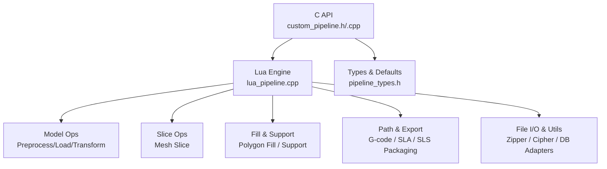
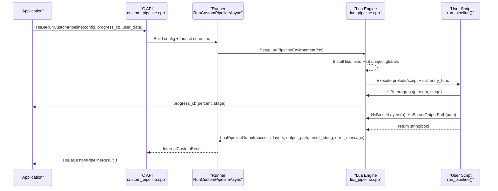
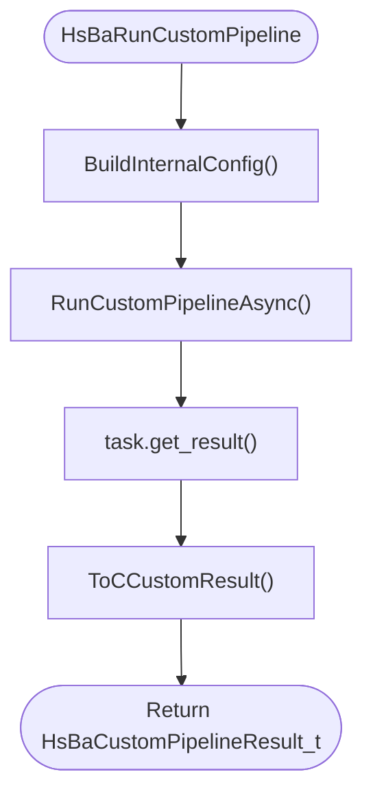
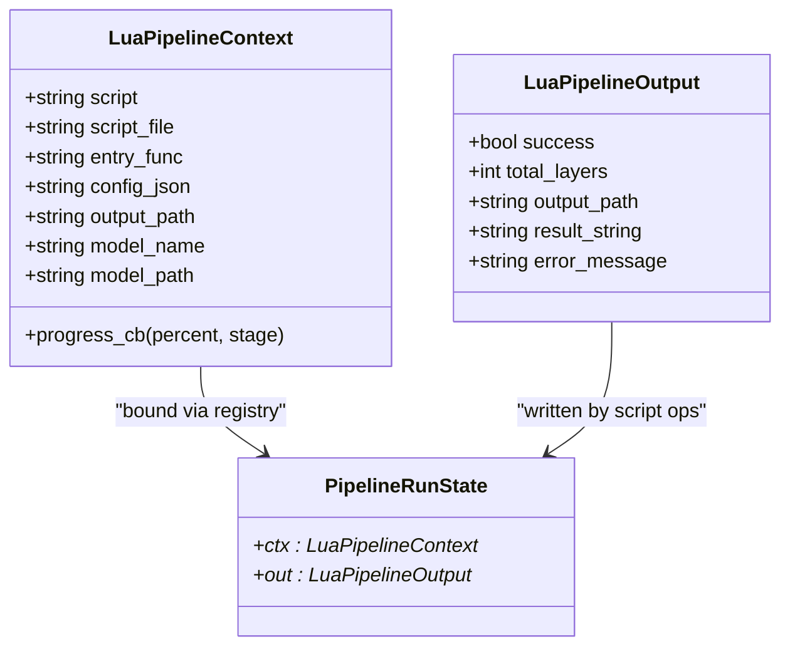
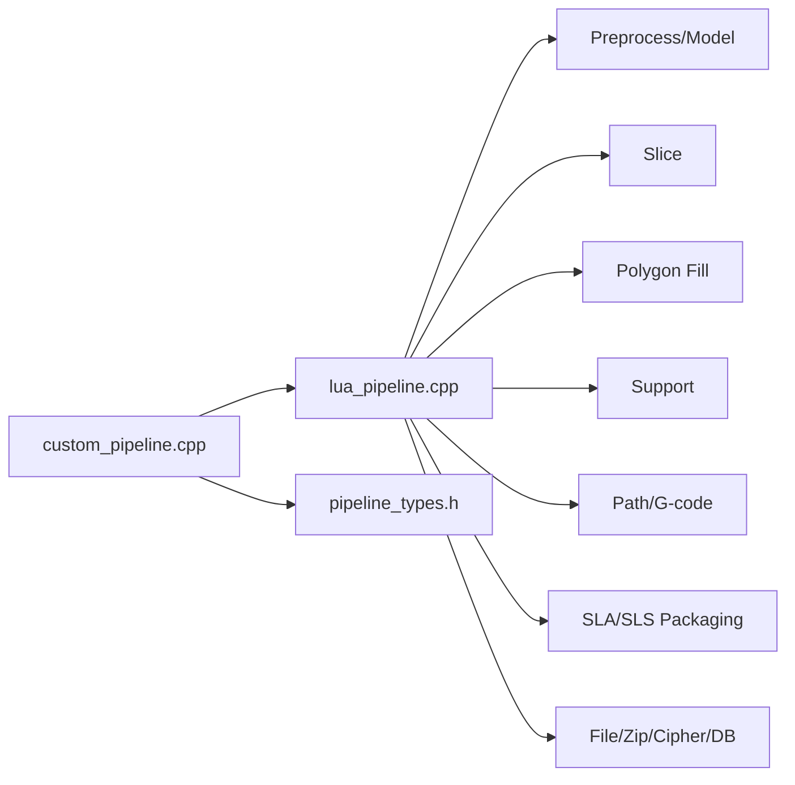

# Custom Lua Pipeline System

<cite>
**Referenced Files in This Document**
- [custom_pipeline.h](file://DllHsBaSlicer/custom_pipeline.h)
- [custom_pipeline.cpp](file://DllHsBaSlicer/custom_pipeline.cpp)
- [lua_pipeline.hpp](file://LibHsBaSlicer/Extends/lua_pipeline.hpp)
- [lua_pipeline.cpp](file://LibHsBaSlicer/Extends/lua_pipeline.cpp)
- [pipeline_types.h](file://pipelinetypes/pipeline_types.h)
- [my_fdm_pipeline.lua](file://samples/Custom/scripts/my_fdm_pipeline.lua)
- [my_sla_pipeline.lua](file://samples/Custom/scripts/my_sla_pipeline.lua)
- [main.cpp](file://samples/Custom/main.cpp)
</cite>

## Table of Contents
1. [Introduction](#introduction)
2. [Project Structure](#project-structure)
3. [Core Components](#core-components)
4. [Architecture Overview](#architecture-overview)
5. [Detailed Component Analysis](#detailed-component-analysis)
6. [Dependency Analysis](#dependency-analysis)
7. [Performance Considerations](#performance-considerations)
8. [Troubleshooting Guide](#troubleshooting-guide)
9. [Conclusion](#conclusion)
10. [Appendices](#appendices)

## Introduction
This document explains the Custom Lua Pipeline System in HsBaSlicer. Unlike built-in FDM/SLA/SLS pipelines whose stage order is fixed in C++, the Custom pipeline delegates the entire workflow to a Lua entry function. The C++ side provides a rich environment exposing model loading, slicing, support generation, fill, floor, G-code path output, packaging, and file utilities through a global `HsBa` table. Users write or supply a Lua script that orchestrates these building blocks in any order they choose.

The system supports:
- Synchronous and asynchronous execution
- Inline Lua source or external script files
- Progress callbacks from Lua into C++
- Reporting layer count and output path back to C++
- Cross-language invocation via Protobuf wire format (see sample)

## Project Structure
Key parts of the Custom Lua Pipeline are split across two main areas:
- DllHsBaSlicer: Public C API for creating configs, running pipelines synchronously/asynchronously, and freeing results.
- LibHsBaSlicer/Extends: Core Lua environment setup, operation bindings, and execution engine.

**Diagram sources**
- [custom_pipeline.h:13-59](file://DllHsBaSlicer/custom_pipeline.h#L13-L59)
- [custom_pipeline.cpp:112-154](file://DllHsBaSlicer/custom_pipeline.cpp#L112-L154)
- [lua_pipeline.hpp:15-79](file://LibHsBaSlicer/Extends/lua_pipeline.hpp#L15-L79)
- [lua_pipeline.cpp:658-776](file://LibHsBaSlicer/Extends/lua_pipeline.cpp#L658-L776)
- [pipeline_types.h:358-414](file://pipelinetypes/pipeline_types.h#L358-L414)

**Section sources**
- [custom_pipeline.h:13-59](file://DllHsBaSlicer/custom_pipeline.h#L13-L59)
- [custom_pipeline.cpp:112-154](file://DllHsBaSlicer/custom_pipeline.cpp#L112-L154)
- [lua_pipeline.hpp:15-79](file://LibHsBaSlicer/Extends/lua_pipeline.hpp#L15-L79)
- [pipeline_types.h:358-414](file://pipelinetypes/pipeline_types.h#L358-L414)

## Core Components
- C API surface:
  - Create default config
  - Run custom pipeline synchronously
  - Run custom pipeline asynchronously with completion callback
  - Free result memory
- Lua environment:
  - Global `HsBa` table with operations for model management, slicing, fill/support, path generation, packaging, and file I/O
  - Context injection: `model_name`, `model_path`, `output_path`, `pipeline_config`, `pipeline_entry`
  - Progress reporting hook from Lua to C++
- Types:
  - Config/result structs for custom pipeline
  - Default initializer helpers

**Section sources**
- [custom_pipeline.h:13-59](file://DllHsBaSlicer/custom_pipeline.h#L13-L59)
- [lua_pipeline.hpp:15-79](file://LibHsBaSlicer/Extends/lua_pipeline.hpp#L15-L79)
- [pipeline_types.h:358-414](file://pipelinetypes/pipeline_types.h#L358-L414)

## Architecture Overview
The runtime flow bridges C/C++ and Lua:
- C API builds an internal configuration and invokes the async runner.
- The runner creates a Lua state, installs libraries, binds the `HsBa` table, injects globals, executes optional inline source then script file, and calls the entry function.
- The entry function uses `HsBa.*` operations to implement its own workflow and can report progress, layers, and output path.

**Diagram sources**
- [custom_pipeline.cpp:165-189](file://DllHsBaSlicer/custom_pipeline.cpp#L165-L189)
- [lua_pipeline.cpp:728-851](file://LibHsBaSlicer/Extends/lua_pipeline.cpp#L728-L851)

## Detailed Component Analysis

### C API Layer (DllHsBaSlicer)
Responsibilities:
- Expose safe C functions for config creation, synchronous/asynchronous execution, and result cleanup.
- Convert between C types and internal C++ structures.
- Bridge progress callbacks and result callbacks.

Key behaviors:
- Validates that either script file or inline source is provided.
- Wraps the async runner using coroutines and converts results to C-compatible structs with owned strings.
- Provides a free function to release allocated strings in results.

**Diagram sources**
- [custom_pipeline.cpp:81-110](file://DllHsBaSlicer/custom_pipeline.cpp#L81-L110)
- [custom_pipeline.cpp:165-172](file://DllHsBaSlicer/custom_pipeline.cpp#L165-L172)

**Section sources**
- [custom_pipeline.h:13-59](file://DllHsBaSlicer/custom_pipeline.h#L13-L59)
- [custom_pipeline.cpp:81-110](file://DllHsBaSlicer/custom_pipeline.cpp#L81-L110)
- [custom_pipeline.cpp:165-189](file://DllHsBaSlicer/custom_pipeline.cpp#L165-L189)

### Lua Environment and Operations (LibHsBaSlicer/Extends)
Responsibilities:
- Initialize Lua state and register standard and domain-specific libraries.
- Bind the `HsBa` table with operations for model, slice, fill, support, floor, path, packaging, and file I/O.
- Manage run-time state via registry slots for context, layer count, and output path.
- Execute user scripts and handle errors.

Highlights:
- Registry keys store per-run state: context pointer, reported layers, reported output path.
- Helpers parse Lua tables into C++ types (e.g., polygons, support configs).
- Error handling captures Lua errors and exceptions into `error_message`.

**Diagram sources**
- [lua_pipeline.hpp:15-79](file://LibHsBaSlicer/Extends/lua_pipeline.hpp#L15-L79)
- [lua_pipeline.cpp:42-65](file://LibHsBaSlicer/Extends/lua_pipeline.cpp#L42-L65)

**Section sources**
- [lua_pipeline.cpp:205-231](file://LibHsBaSlicer/Extends/lua_pipeline.cpp#L205-L231)
- [lua_pipeline.cpp:658-776](file://LibHsBaSlicer/Extends/lua_pipeline.cpp#L658-L776)
- [lua_pipeline.cpp:778-851](file://LibHsBaSlicer/Extends/lua_pipeline.cpp#L778-L851)

### User Scripts (Samples)
- FDM example: Loads model, slices layers, fills each layer with rotating angles, optionally generates supports, builds path data, generates G-code, writes file, reports layers and output path.
- SLA example: Loads model, slices, generates supports, creates floor/raft, packages images and config into a zip, reports layers and output path.

These scripts demonstrate full control over stage ordering and parameters via the `HsBa` table and injected globals like `machine` and `pipeline_config`.

**Section sources**
- [my_fdm_pipeline.lua:52-171](file://samples/Custom/scripts/my_fdm_pipeline.lua#L52-L171)
- [my_sla_pipeline.lua:27-104](file://samples/Custom/scripts/my_sla_pipeline.lua#L27-L104)

### Sample Application
Demonstrates four usage patterns:
1. Script-file-driven FDM pipeline (sync)
2. Inline Lua source pipeline (no script file)
3. Async SLA packaging pipeline
4. Protobuf wire-format driven pipeline (serialization/deserialization of config and result)

**Section sources**
- [main.cpp:98-179](file://samples/Custom/main.cpp#L98-L179)
- [main.cpp:196-219](file://samples/Custom/main.cpp#L196-L219)
- [main.cpp:381-453](file://samples/Custom/main.cpp#L381-L453)

## Dependency Analysis
High-level dependencies:
- C API depends on internal runner and Lua engine.
- Lua engine depends on:
  - Model preprocessing and slicing modules
  - Polygon operations, fill, support generators
  - Path generation and export utilities
  - File I/O, compression, cipher, database adapters (optional)
- Types header defines shared C-compatible structs used by both API and converters.

**Diagram sources**
- [custom_pipeline.cpp:112-154](file://DllHsBaSlicer/custom_pipeline.cpp#L112-L154)
- [lua_pipeline.cpp:12-31](file://LibHsBaSlicer/Extends/lua_pipeline.cpp#L12-L31)
- [pipeline_types.h:358-414](file://pipelinetypes/pipeline_types.h#L358-L414)

**Section sources**
- [lua_pipeline.cpp:12-31](file://LibHsBaSlicer/Extends/lua_pipeline.cpp#L12-L31)
- [pipeline_types.h:358-414](file://pipelinetypes/pipeline_types.h#L358-L414)

## Performance Considerations
- Asynchronous execution: Use the async API to avoid blocking UI threads; progress callbacks keep users informed.
- Memory management: Always free results via the provided free function to avoid leaks of C-allocated strings.
- Script efficiency: Minimize repeated model loads; reuse models within a single run.
- Layer iteration: For large models, batch progress updates to reduce callback overhead.
- Output size: Choose appropriate image dimensions for SLA packaging to balance quality and performance.

[No sources needed since this section provides general guidance]

## Troubleshooting Guide
Common issues and remedies:
- Missing script or source: Ensure either `pipeline_lua_script` or `pipeline_lua_source` is set; otherwise the runner returns an error message.
- Entry function not found: Verify the script defines the configured `entry_func` (default `run_pipeline`).
- Lua errors: Errors during script execution are captured in `error_message`; inspect logs and script content.
- Invalid model or parameters: Functions like `layerCount` validate inputs; ensure model is loaded and layer heights are positive.
- Resource cleanup: Call `removeModel` after use to free model resources; always free results.

**Section sources**
- [custom_pipeline.cpp:120-126](file://DllHsBaSlicer/custom_pipeline.cpp#L120-L126)
- [lua_pipeline.cpp:814-827](file://LibHsBaSlicer/Extends/lua_pipeline.cpp#L814-L827)
- [lua_pipeline.cpp:369-387](file://LibHsBaSlicer/Extends/lua_pipeline.cpp#L369-L387)

## Conclusion
The Custom Lua Pipeline System offers maximum flexibility by letting users define the entire workflow in Lua while leveraging a robust C++ backend. It supports synchronous and asynchronous execution, progress reporting, and cross-language integration via Protobuf. With clear APIs, comprehensive operation bindings, and practical examples, it enables tailored slicing and packaging workflows for diverse manufacturing processes.

[No sources needed since this section summarizes without analyzing specific files]

## Appendices

### Lua Operation Reference (selected)
- Progress and reporting: `HsBa.progress(percent, stage)`, `HsBa.setLayers(n)`, `HsBa.setOutputPath(path)`
- Model management: `loadModel`, `modelInfo`, `translateModel`, `rotateModel`, `scaleModel`, `removeModel`, `modelNames`
- Slicing: `layerCount`, `layerZ`, `slice`, `sliceUnsafe`, `toInt`, `toDouble`
- Geometry processing: `fill`, `fdmSupport`, `slaSupport`, `floor`
- Output and packaging: `toGcode`, `saveSlaPackage`, `saveSlsPackage`, `renderImage`
- File I/O: `readFile`, `writeFile`

**Section sources**
- [lua_pipeline.cpp:205-231](file://LibHsBaSlicer/Extends/lua_pipeline.cpp#L205-L231)
- [lua_pipeline.cpp:265-364](file://LibHsBaSlicer/Extends/lua_pipeline.cpp#L265-L364)
- [lua_pipeline.cpp:369-422](file://LibHsBaSlicer/Extends/lua_pipeline.cpp#L369-L422)
- [lua_pipeline.cpp:443-511](file://LibHsBaSlicer/Extends/lua_pipeline.cpp#L443-L511)
- [lua_pipeline.cpp:515-656](file://LibHsBaSlicer/Extends/lua_pipeline.cpp#L515-L656)
- [lua_pipeline.cpp:658-686](file://LibHsBaSlicer/Extends/lua_pipeline.cpp#L658-L686)