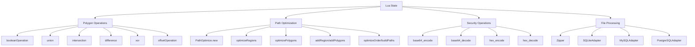
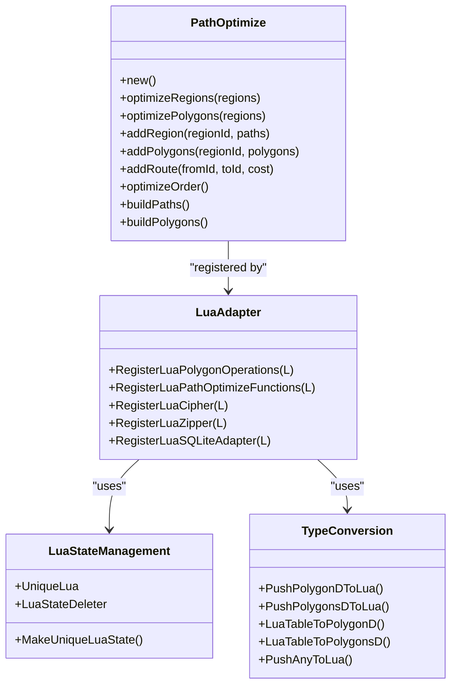
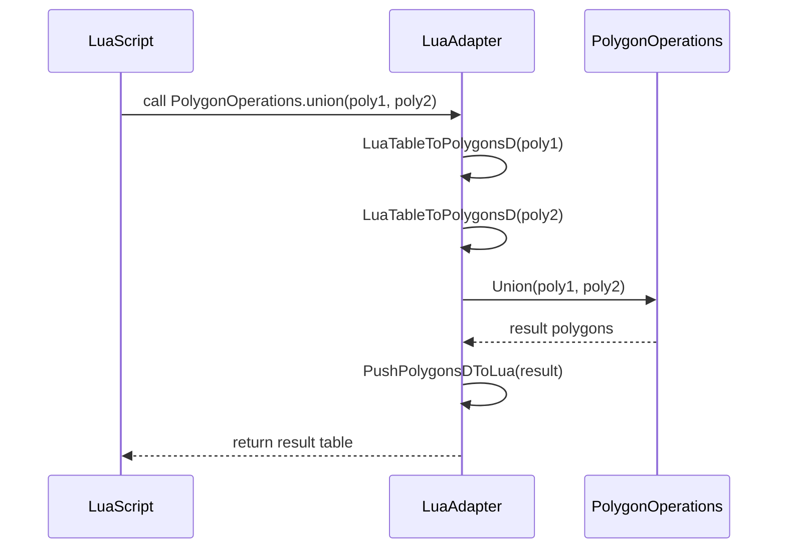
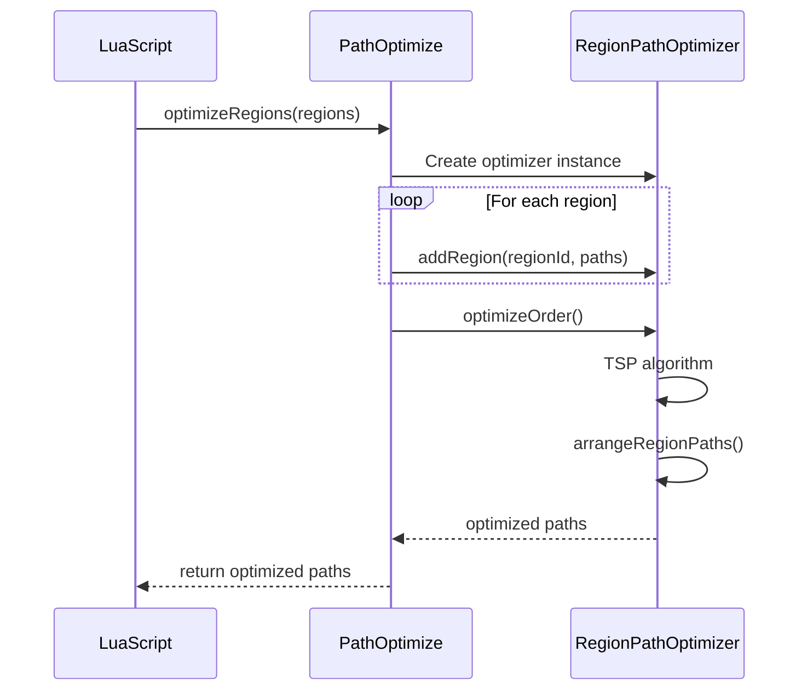
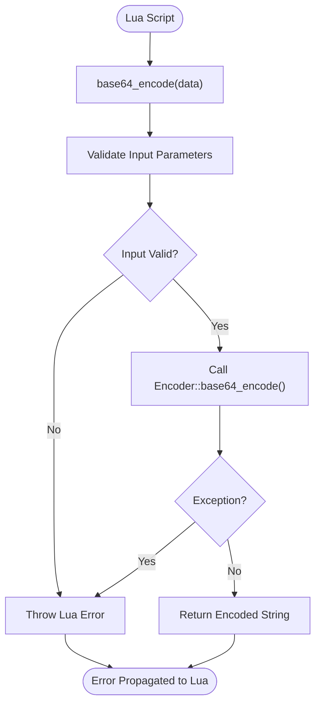
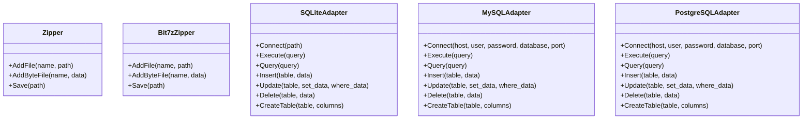
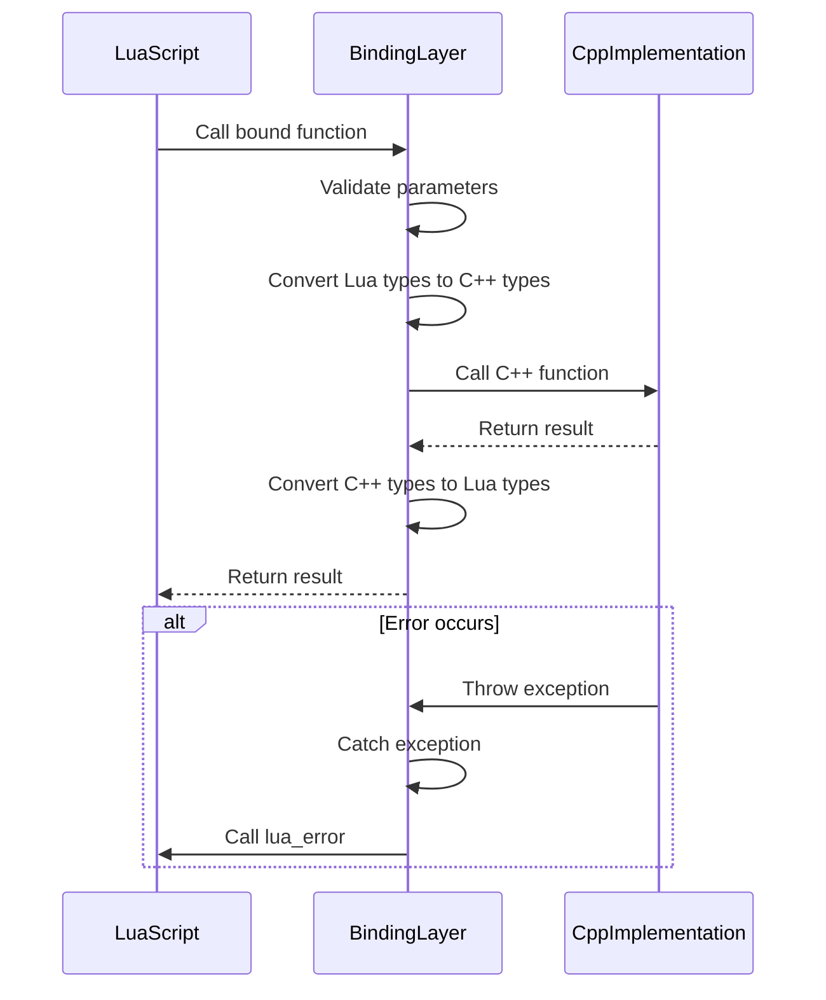
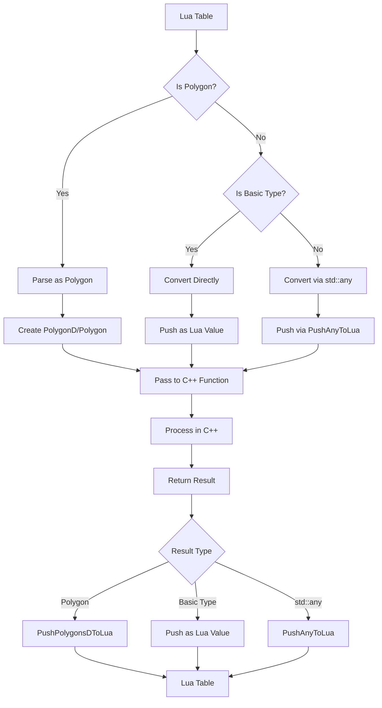

# Extensibility via Lua

<cite>
**Referenced Files in This Document**   
- [LuaAdapter.cpp](file://2D/LuaAdapter.cpp)
- [LuaAdapter.hpp](file://2D/LuaAdapter.hpp)
- [LuaAdapter.cpp](file://cipher/LuaAdapter.cpp)
- [LuaAdapter.hpp](file://cipher/LuaAdapter.hpp)
- [LuaAdapter.cpp](file://fileoperator/LuaAdapter.cpp)
- [LuaAdapter.hpp](file://fileoperator/LuaAdapter.hpp)
- [path_optimizer.cpp](file://LibHsBaSlicer/Path/path_optimizer.cpp)
- [path_optimizer.hpp](file://LibHsBaSlicer/Path/path_optimizer.hpp)
- [polygon_fill.cpp](file://LibHsBaSlicer/Fill/polygon_fill.cpp)
- [LuaNewObject.hpp](file://utils/LuaNewObject.hpp)
- [custom_fill.lua](file://tests/PolygonFill/custom_fill.lua)
- [image_from_polygons.lua](file://tests/PolygonFill/image_from_polygons.lua)
- [optimize_paths.lua](file://tests/PolygonFill/optimize_paths.lua)
</cite>

## Update Summary
**Changes Made**   
- Added comprehensive PathOptimize Lua API documentation with optimizeRegions() and optimizePolygons() methods
- Updated Lua API Reference section to include new PathOptimize namespace and object-oriented interface
- Added new Path Optimization section detailing the RegionPathOptimizer implementation
- Enhanced C++/Lua Binding Mechanisms section with PathOptimize-specific binding details
- Updated examples and usage patterns for path optimization workflows

## Table of Contents
1. [Introduction](#introduction)
2. [Lua Integration Architecture](#lua-integration-architecture)
3. [Core LuaAdapter Implementation](#core-luaadapter-implementation)
4. [Polygon Operations via Lua](#polygon-operations-via-lua)
5. [Path Optimization via Lua](#path-optimization-via-lua)
6. [Security Operations via Lua](#security-operations-via-lua)
7. [File Processing via Lua](#file-processing-via-lua)
8. [C++/Lua Binding Mechanisms](#c-lua-binding-mechanisms)
9. [Data Type Conversions](#data-type-conversions)
10. [Lua API Reference](#lua-api-reference)
11. [Security Considerations](#security-considerations)
12. [Performance Implications](#performance-implications)

## Introduction
The HsBaSlicer application implements a comprehensive Lua-based extensibility framework that enables customization of core functionality through scripting. This architecture allows users to extend the application's capabilities in four primary domains: fill pattern generation, path optimization, security operations, and file processing. The system is built around LuaAdapter classes that bridge the C++ core with Lua scripts, providing a safe and efficient interface for script execution. This document details the implementation of this extensibility framework, focusing on the Lua integration architecture across multiple modules.

**Section sources**
- [LuaAdapter.cpp:1-287](file://2D/LuaAdapter.cpp#L1-L287)
- [LuaAdapter.cpp:1-96](file://cipher/LuaAdapter.cpp#L1-L96)
- [LuaAdapter.cpp:1-1142](file://fileoperator/LuaAdapter.cpp#L1-L1142)
- [path_optimizer.cpp:410-662](file://LibHsBaSlicer/Path/path_optimizer.cpp#L410-L662)

## Lua Integration Architecture
The Lua integration architecture in HsBaSlicer follows a modular design pattern where each functional domain has its own LuaAdapter implementation. This approach provides domain-specific APIs while maintaining a consistent integration pattern across the application. The architecture consists of three main components: the Lua state management, the binding layer, and the exposed API surface.

The system uses a hierarchical registration model where each module registers its functionality with the Lua state through dedicated registration functions. These functions create metatables for C++ objects, define function bindings, and establish the global namespace for each module. The architecture supports both function-oriented APIs (for mathematical operations) and object-oriented APIs (for resource management).

**Diagram sources**
- [LuaAdapter.cpp:134-145](file://2D/LuaAdapter.cpp#L134-L145)
- [path_optimizer.cpp:553-556](file://LibHsBaSlicer/Path/path_optimizer.cpp#L553-L556)
- [LuaAdapter.cpp:81-87](file://cipher/LuaAdapter.cpp#L81-L87)
- [LuaAdapter.cpp:1002-1142](file://fileoperator/LuaAdapter.cpp#L1002-L1142)

**Section sources**
- [LuaAdapter.cpp:1-287](file://2D/LuaAdapter.cpp#L1-L287)
- [LuaAdapter.cpp:1-96](file://cipher/LuaAdapter.cpp#L1-L96)
- [LuaAdapter.cpp:1-1142](file://fileoperator/LuaAdapter.cpp#L1-L1142)
- [path_optimizer.cpp:410-662](file://LibHsBaSlicer/Path/path_optimizer.cpp#L410-L662)

## Core LuaAdapter Implementation
The core LuaAdapter implementation provides the foundation for C++/Lua integration across all modules. Each LuaAdapter.cpp file implements a consistent pattern of function registration, type conversion, and error handling. The implementation uses Lua's C API to create bindings between C++ functions and Lua callable functions, with careful attention to memory management and exception safety.

The adapters follow a namespace-based organization where related functions are grouped together and exposed under a common global table. For example, polygon operations are exposed under the "PolygonOperations" namespace, path optimization functions under "PathOptimize", security functions through the "Cipher" namespace, and file processing through various database adapter namespaces. This organization prevents naming conflicts and provides a logical grouping of related functionality.

**Diagram sources**
- [LuaAdapter.cpp:282-286](file://2D/LuaAdapter.cpp#L282-L286)
- [path_optimizer.cpp:619-629](file://LibHsBaSlicer/Path/path_optimizer.cpp#L619-L629)
- [cipher/LuaAdapter.cpp:90-94](file://cipher/LuaAdapter.cpp#L90-L94)
- [fileoperator/LuaAdapter.cpp:1002-1142](file://fileoperator/LuaAdapter.cpp#L1002-L1142)
- [utils/LuaNewObject.hpp:57-61](file://utils/LuaNewObject.hpp#L57-L61)

**Section sources**
- [LuaAdapter.cpp:1-287](file://2D/LuaAdapter.cpp#L1-L287)
- [LuaAdapter.cpp:1-96](file://cipher/LuaAdapter.cpp#L1-L96)
- [LuaAdapter.cpp:1-1142](file://fileoperator/LuaAdapter.cpp#L1-L1142)
- [path_optimizer.cpp:410-662](file://LibHsBaSlicer/Path/path_optimizer.cpp#L410-L662)
- [LuaNewObject.hpp:1-64](file://utils/LuaNewObject.hpp#L1-L64)

## Polygon Operations via Lua
The polygon operations module provides a comprehensive set of geometric functions that can be accessed from Lua scripts. These operations are implemented in the 2D module's LuaAdapter and expose functionality for boolean operations, offsetting, hull generation, and area calculation. The API is designed to work with polygon data structures that represent 2D shapes used in the slicing process.

The implementation converts between Lua tables and C++ polygon structures, allowing scripts to pass polygon data to C++ functions and receive processed results. Each polygon is represented as an array of points, with each point containing x and y coordinates. The system supports both integer and double precision polygon representations, with appropriate conversion functions provided.

**Diagram sources**
- [LuaAdapter.cpp:18-82](file://2D/LuaAdapter.cpp#L18-L82)
- [LuaAdapter.cpp:149-238](file://2D/LuaAdapter.cpp#L149-L238)
- [LuaAdapter.cpp:282-286](file://2D/LuaAdapter.cpp#L282-L286)

**Section sources**
- [LuaAdapter.cpp:1-287](file://2D/LuaAdapter.cpp#L1-L287)
- [custom_fill.lua:1-16](file://tests/PolygonFill/custom_fill.lua#L1-L16)
- [image_from_polygons.lua:1-47](file://tests/PolygonFill/image_from_polygons.lua#L1-L47)

## Path Optimization via Lua
The path optimization module provides advanced region ordering and path optimization capabilities through the PathOptimize namespace in Lua. Implemented in the LibHsBaSlicer Path module, this component exposes both one-shot optimization functions and an object-oriented interface for custom optimization logic.

The PathOptimize API supports two distinct modes:
- **Fill-result mode**: Optimizes complete fill paths after generation, supporting multi-point polylines
- **Polygon mode**: Optimizes polygon order before filling, returning optimized polygon sequences

The object-oriented interface provides fine-grained control over the optimization process through methods like `addRegion()`, `addPolygons()`, `addRoute()`, `optimizeOrder()`, `buildPaths()`, and `buildPolygons()`. This allows for sophisticated customization of optimization strategies, including manual route cost specification and complex region relationships.

**Diagram sources**
- [path_optimizer.cpp:500-524](file://LibHsBaSlicer/Path/path_optimizer.cpp#L500-L524)
- [path_optimizer.cpp:433-488](file://LibHsBaSlicer/Path/path_optimizer.cpp#L433-L488)

**Section sources**
- [path_optimizer.cpp:410-662](file://LibHsBaSlicer/Path/path_optimizer.cpp#L410-L662)
- [path_optimizer.hpp:86-166](file://LibHsBaSlicer/Path/path_optimizer.hpp#L86-L166)
- [optimize_paths.lua:1-34](file://tests/PolygonFill/optimize_paths.lua#L1-L34)

## Security Operations via Lua
The security operations module provides cryptographic functions through the Cipher namespace in Lua. Implemented in the cipher module's LuaAdapter, this component exposes encoding and decoding functions for base64 and hexadecimal formats. These operations are essential for handling encoded data in various file formats and communication protocols.

The implementation follows a simple function-oriented API where each operation takes input data and returns the processed result. Error handling is implemented through Lua's exception mechanism, with C++ exceptions being converted to Lua errors. This ensures that script errors are properly propagated and can be handled by Lua's error handling constructs.

**Diagram sources**
- [LuaAdapter.cpp:9-87](file://cipher/LuaAdapter.cpp#L9-L87)
- [LuaAdapter.cpp:90-94](file://cipher/LuaAdapter.cpp#L90-L94)

**Section sources**
- [LuaAdapter.cpp:1-96](file://cipher/LuaAdapter.cpp#L1-L96)
- [encoder.cpp](file://cipher/encoder.cpp)

## File Processing via Lua
The file processing module provides comprehensive file I/O and database operations through Lua scripting. Implemented in the fileoperator module's LuaAdapter, this component exposes classes for zip file manipulation and database access. The API follows an object-oriented pattern where scripts create instances of these classes and call methods on them.

The implementation supports multiple database backends (SQLite, MySQL, PostgreSQL) and multiple zip formats (standard zip, 7z, XZ, BZIP2, GZIP, TAR) through conditional compilation. Each class is exposed as a Lua userdata with methods bound to C++ member functions. The system handles object lifecycle management through Lua's garbage collection mechanism, with custom __gc metamethods that call the C++ destructor.

**Diagram sources**
- [LuaAdapter.cpp:42-131](file://fileoperator/LuaAdapter.cpp#L42-L131)
- [LuaAdapter.cpp:136-253](file://fileoperator/LuaAdapter.cpp#L136-L253)
- [LuaAdapter.cpp:258-498](file://fileoperator/LuaAdapter.cpp#L258-L498)
- [LuaAdapter.cpp:502-747](file://fileoperator/LuaAdapter.cpp#L502-L747)
- [LuaAdapter.cpp:752-997](file://fileoperator/LuaAdapter.cpp#L752-L997)

**Section sources**
- [LuaAdapter.cpp:1-1142](file://fileoperator/LuaAdapter.cpp#L1-L1142)
- [LuaAdapter.hpp:1-30](file://fileoperator/LuaAdapter.hpp#L1-L30)
- [zipper.cpp](file://fileoperator/zipper.cpp)
- [sql_adapter.cpp](file://fileoperator/sql_adapter.cpp)

## C++/Lua Binding Mechanisms
The C++/Lua binding mechanisms in HsBaSlicer are implemented using Lua's C API with a layer of C++ abstractions to simplify the binding process. The system uses a combination of function registration tables (luaL_Reg) and metatable-based object binding to expose C++ functionality to Lua scripts.

For function-oriented APIs, the implementation uses luaL_newlib to create a library table containing the bound functions. For object-oriented APIs, the system creates metatables that define the behavior of userdata objects, including method dispatch and garbage collection. The LuaNewObject.hpp utility provides templates for creating and destroying C++ objects from Lua, handling the memory allocation and constructor/destructor calls.

The binding layer also implements error propagation from C++ exceptions to Lua errors, ensuring that runtime issues in the C++ code are properly reported to the Lua environment. This is achieved through try-catch blocks in the binding functions that convert C++ exceptions to Lua errors using lua_error.

**Diagram sources**
- [LuaAdapter.cpp:12-37](file://2D/LuaAdapter.cpp#L12-L37)
- [LuaAdapter.cpp:9-24](file://cipher/LuaAdapter.cpp#L9-L24)
- [LuaAdapter.cpp:43-69](file://fileoperator/LuaAdapter.cpp#L43-L69)
- [path_optimizer.cpp:422-431](file://LibHsBaSlicer/Path/path_optimizer.cpp#L422-L431)
- [LuaNewObject.hpp:11-45](file://utils/LuaNewObject.hpp#L11-L45)

**Section sources**
- [LuaAdapter.cpp:1-287](file://2D/LuaAdapter.cpp#L1-L287)
- [LuaAdapter.cpp:1-96](file://cipher/LuaAdapter.cpp#L1-L96)
- [LuaAdapter.cpp:1-1142](file://fileoperator/LuaAdapter.cpp#L1-L1142)
- [path_optimizer.cpp:410-662](file://LibHsBaSlicer/Path/path_optimizer.cpp#L410-L662)
- [LuaNewObject.hpp:1-64](file://utils/LuaNewObject.hpp#L1-L64)

## Data Type Conversions
The data type conversion system in HsBaSlicer's Lua integration handles the translation between Lua's dynamic type system and C++'s static type system. The implementation provides specialized functions for converting between Lua tables and C++ polygon structures, as well as generic conversion for basic types through the PushAnyToLua function.

For polygon data, the system converts Lua tables of points (each with x and y fields) to C++ Polygon and Polygons containers. The conversion functions handle both double-precision (PolygonD) and integer-precision (Polygon) representations, with appropriate scaling applied for the integer version. The reverse conversion creates Lua tables from C++ polygon data, preserving the structure for use in scripts.

The PushAnyToLua function provides generic type conversion for std::any values, supporting int, int64_t, double, std::string, and std::vector<unsigned char> types. This function is used extensively in the database adapter to convert query results to Lua values, allowing scripts to work with database data seamlessly.

**Diagram sources**
- [LuaAdapter.cpp:149-280](file://2D/LuaAdapter.cpp#L149-L280)
- [LuaAdapter.cpp:6-38](file://fileoperator/LuaAdapter.cpp#L6-L38)
- [LuaAdapter.cpp:319-331](file://fileoperator/LuaAdapter.cpp#L319-L331)
- [LuaAdapter.cpp:574-585](file://fileoperator/LuaAdapter.cpp#L574-L585)
- [path_optimizer.cpp:559-567](file://LibHsBaSlicer/Path/path_optimizer.cpp#L559-L567)

**Section sources**
- [LuaAdapter.cpp:149-280](file://2D/LuaAdapter.cpp#L149-L280)
- [LuaAdapter.cpp:6-38](file://fileoperator/LuaAdapter.cpp#L6-L38)
- [LuaAdapter.hpp:12-19](file://2D/LuaAdapter.hpp#L12-L19)
- [path_optimizer.cpp:559-567](file://LibHsBaSlicer/Path/path_optimizer.cpp#L559-L567)

## Lua API Reference
The Lua API in HsBaSlicer is organized into four main namespaces, each providing functionality for a specific domain. The API is designed to be intuitive and consistent, with function names that clearly indicate their purpose and parameters that follow logical ordering.

### PolygonOperations API
- **booleanOperation(poly1, poly2, operation)**: Performs a boolean operation (union, intersection, difference, xor) on two polygon sets
- **union(poly1, poly2)**: Returns the union of two polygon sets
- **intersection(poly1, poly2)**: Returns the intersection of two polygon sets
- **difference(poly1, poly2)**: Returns the difference of two polygon sets
- **xor(poly1, poly2)**: Returns the exclusive or of two polygon sets
- **offsetOperation(poly, delta)**: Offsets a polygon set by a specified distance
- **convexHullOperation(poly)**: Computes the convex hull of each polygon
- **concaveHullOperation(poly, numAdditionalPoints)**: Simulates a concave hull with additional points
- **area(poly)**: Calculates the area of a polygon

### PathOptimize API
#### One-Shot Functions
- **PathOptimize.optimizeRegions(regions)**: Fill-result mode optimization, returns complete fill paths (multi-point polylines supported)
- **PathOptimize.optimizePolygons(regions)**: Polygon mode optimization, returns optimized polygon sequences

#### Object-Oriented Interface
- **PathOptimize.new()**: Creates a new RegionPathOptimizer instance
- **addRegion(regionId, paths)**: Adds a region based on fill results (paths)
- **addPolygons(regionId, polygons)**: Adds a region based on polygons (before fill)
- **addRoute(fromId, toId, cost)**: Manually specifies travel cost between regions
- **optimizeOrder()**: Solves TSP to determine optimal region visit order
- **buildPaths()**: Returns optimized complete fill paths (fill-result mode only)
- **buildPolygons()**: Returns optimized polygon sequences (polygon mode only)

### Cipher API
- **base64_encode(data)**: Encodes binary data as base64 string
- **base64_decode(data)**: Decodes base64 string to binary data
- **hex_encode(data)**: Encodes binary data as hexadecimal string
- **hex_decode(data)**: Decodes hexadecimal string to binary data

### File Processing API
#### Zipper
- **Zipper.new()**: Creates a new Zipper instance
- **AddFile(name, path)**: Adds a file from the filesystem to the archive
- **AddByteFile(name, data)**: Adds a file from memory to the archive
- **Save(path)**: Saves the archive to the specified path

#### Bit7zZipper
- **Bit7zZipper.new(format, dll_path, password)**: Creates a new Bit7zZipper instance with specified format
- **AddFile(name, path)**: Adds a file from the filesystem to the archive
- **AddByteFile(name, data)**: Adds a file from memory to the archive
- **Save(path)**: Saves the archive to the specified path

#### Database Adapters
All database adapters provide the same interface:
- **Connect(connection_params)**: Establishes a connection to the database
- **Execute(query)**: Executes a SQL statement
- **Query(query)**: Executes a SELECT query and returns results
- **Insert(table, data)**: Inserts a row into a table
- **Update(table, set_data, where_data)**: Updates rows matching criteria
- **Delete(table, data)**: Deletes rows matching criteria
- **CreateTable(table, columns)**: Creates a new table

**Section sources**
- [LuaAdapter.cpp:134-145](file://2D/LuaAdapter.cpp#L134-L145)
- [path_optimizer.cpp:553-556](file://LibHsBaSlicer/Path/path_optimizer.cpp#L553-L556)
- [LuaAdapter.cpp:81-87](file://cipher/LuaAdapter.cpp#L81-L87)
- [LuaAdapter.cpp:123-131](file://fileoperator/LuaAdapter.cpp#L123-L131)
- [LuaAdapter.cpp:245-253](file://fileoperator/LuaAdapter.cpp#L245-L253)
- [LuaAdapter.cpp:487-498](file://fileoperator/LuaAdapter.cpp#L487-L498)
- [LuaAdapter.cpp:736-747](file://fileoperator/LuaAdapter.cpp#L736-L747)
- [LuaAdapter.cpp:986-997](file://fileoperator/LuaAdapter.cpp#L986-L997)

## Security Considerations
The Lua integration in HsBaSlicer implements several security measures to prevent malicious script behavior and ensure system stability. The primary security mechanism is the isolation of script execution within a dedicated Lua state that has limited access to system resources.

The binding layer implements strict parameter validation for all exposed functions, checking both the type and number of arguments before proceeding with execution. This prevents buffer overflows and type confusion vulnerabilities that could arise from malformed input. Additionally, all C++ exceptions are caught and converted to Lua errors, preventing crashes from propagating to the host application.

For file operations, the system restricts access to files specified by the script, with no direct access to arbitrary system paths. Database connections require explicit connection parameters to be provided by the script, with no default or implicit connections established. The implementation also includes timeout mechanisms for long-running operations to prevent denial-of-service attacks.

The use of std::any for data passing provides type safety while allowing flexibility in data representation. All type conversions are checked at runtime, preventing invalid type casts that could lead to memory corruption. The object lifecycle management through Lua's garbage collector ensures that C++ objects are properly destroyed when no longer referenced, preventing memory leaks.

**Section sources**
- [LuaAdapter.cpp:20-35](file://2D/LuaAdapter.cpp#L20-L35)
- [LuaAdapter.cpp:11-24](file://cipher/LuaAdapter.cpp#L11-L24)
- [LuaAdapter.cpp:54-58](file://fileoperator/LuaAdapter.cpp#L54-L58)
- [LuaAdapter.cpp:271-273](file://fileoperator/LuaAdapter.cpp#L271-L273)
- [LuaAdapter.cpp:526-528](file://fileoperator/LuaAdapter.cpp#L526-L528)
- [path_optimizer.cpp:588-602](file://LibHsBaSlicer/Path/path_optimizer.cpp#L588-L602)

## Performance Implications
The Lua/C++ boundary crossing in HsBaSlicer has several performance implications that are mitigated through careful design and implementation. The primary performance cost occurs during data type conversion between Lua and C++ representations, particularly for complex data structures like polygons.

The system optimizes performance by minimizing the number of Lua API calls through batch operations. For example, polygon data is converted in bulk rather than point-by-point when possible. The implementation also uses Lua's raw access functions (lua_rawgeti, lua_rawseti) for array operations, avoiding the overhead of metamethod lookup.

Memory allocation is optimized through the use of placement new in the NewLuaObject template, which allocates C++ objects directly in Lua userdata memory. This eliminates the need for separate memory allocations and simplifies garbage collection. The PushAnyToLua function uses direct type comparisons rather than string lookups for type identification, improving conversion speed.

For database operations, the system batches multiple operations within a single transaction when possible, reducing the overhead of individual SQL statements. The implementation also caches prepared statements and connection objects to avoid the cost of repeated setup operations.

The use of conditional compilation (#ifdef) for optional features like MySQL and PostgreSQL support ensures that unused code paths do not impact performance. Similarly, the bit7z integration is conditionally compiled, allowing deployments to include only the required compression formats.

**Section sources**
- [LuaAdapter.cpp:150-159](file://2D/LuaAdapter.cpp#L150-L159)
- [LuaAdapter.cpp:164-170](file://2D/LuaAdapter.cpp#L164-L170)
- [LuaAdapter.cpp:320-324](file://fileoperator/LuaAdapter.cpp#L320-L324)
- [LuaAdapter.cpp:575-579](file://fileoperator/LuaAdapter.cpp#L575-L579)
- [path_optimizer.cpp:570-582](file://LibHsBaSlicer/Path/path_optimizer.cpp#L570-L582)
- [LuaNewObject.hpp:14-18](file://utils/LuaNewObject.hpp#L14-L18)
- [LuaAdapter.cpp:1004-1007](file://fileoperator/LuaAdapter.cpp#L1004-L1007)