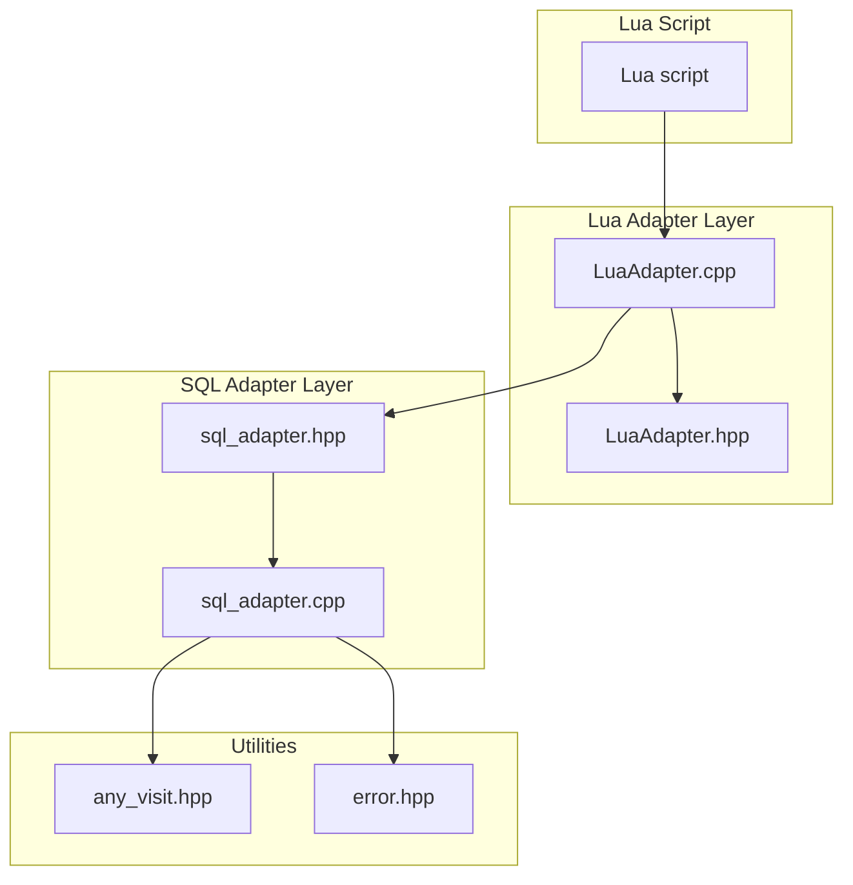
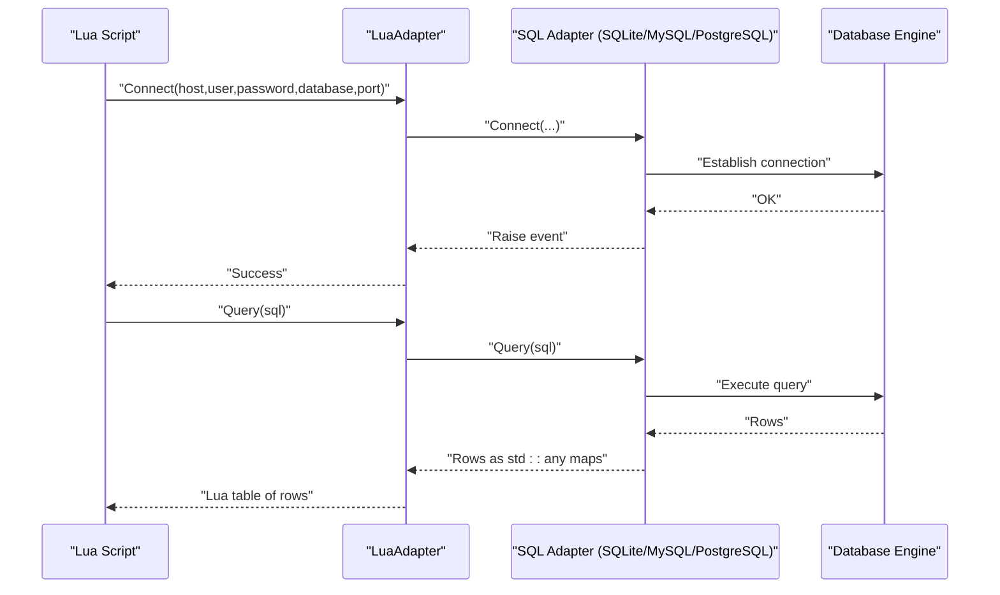
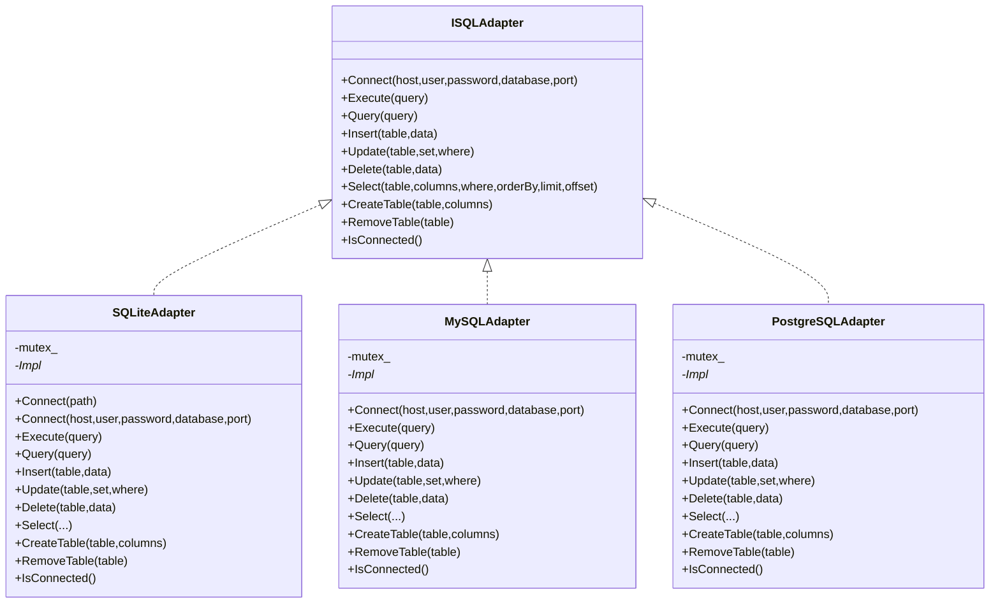
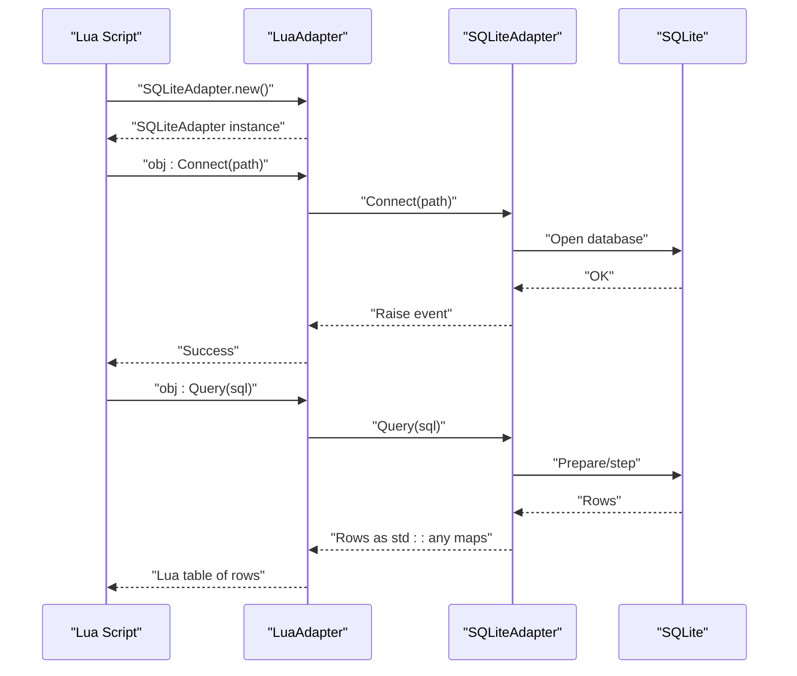
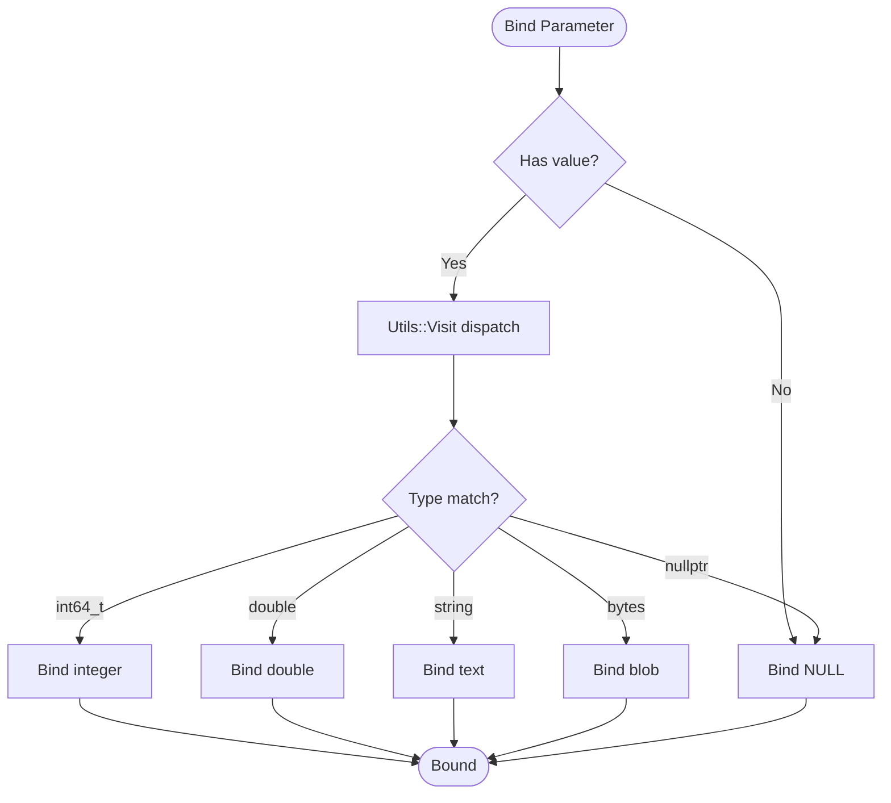
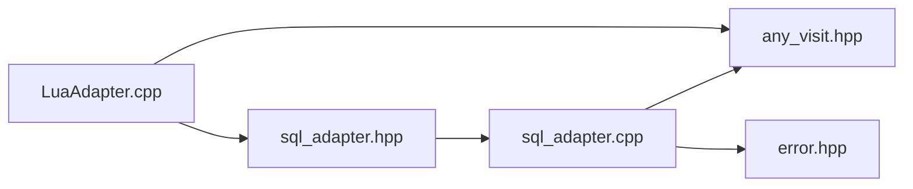

# Database Operations with Lua

<cite>
**Referenced Files in This Document**
- [sql_adapter.hpp](file://fileoperator/sql_adapter.hpp)
- [sql_adapter.cpp](file://fileoperator/sql_adapter.cpp)
- [LuaAdapter.hpp](file://fileoperator/LuaAdapter.hpp)
- [LuaAdapter.cpp](file://fileoperator/LuaAdapter.cpp)
- [any_visit.hpp](file://base/any_visit.hpp)
- [error.hpp](file://base/error.hpp)
</cite>

## Table of Contents
1. [Introduction](#introduction)
2. [Project Structure](#project-structure)
3. [Core Components](#core-components)
4. [Architecture Overview](#architecture-overview)
5. [Detailed Component Analysis](#detailed-component-analysis)
6. [Dependency Analysis](#dependency-analysis)
7. [Performance Considerations](#performance-considerations)
8. [Troubleshooting Guide](#troubleshooting-guide)
9. [Conclusion](#conclusion)

## Introduction
This document explains how Lua scripting integrates with database operations through the SQL adapters. It covers how SQLiteAdapter, MySQLAdapter, and PostgreSQLAdapter expose full CRUD capabilities to Lua, including connecting via file path (SQLite) or host/user/password/database/port (MySQL/PostgreSQL), executing raw queries, and performing structured operations like Insert, Update, Delete, and Select with parameterized inputs. It also documents type-safe value binding using std::any and Utils::Visit, result set conversion to Lua tables, thread-safe access via mutex, error handling strategies, and performance considerations for bulk operations.

## Project Structure
The database functionality is implemented in two primary areas:
- SQL adapter layer: Provides a unified interface and implementations for SQLite, MySQL, and PostgreSQL.
- Lua adapter layer: Exposes adapter instances and methods to Lua, converting between C++ types and Lua values.

**Diagram sources**
- [LuaAdapter.hpp](file://fileoperator/LuaAdapter.hpp#L1-L30)
- [LuaAdapter.cpp](file://fileoperator/LuaAdapter.cpp#L1-L120)
- [sql_adapter.hpp](file://fileoperator/sql_adapter.hpp#L1-L120)
- [sql_adapter.cpp](file://fileoperator/sql_adapter.cpp#L1-L120)
- [any_visit.hpp](file://base/any_visit.hpp#L1-L123)
- [error.hpp](file://base/error.hpp#L1-L139)

**Section sources**
- [LuaAdapter.hpp](file://fileoperator/LuaAdapter.hpp#L1-L30)
- [LuaAdapter.cpp](file://fileoperator/LuaAdapter.cpp#L1-L120)
- [sql_adapter.hpp](file://fileoperator/sql_adapter.hpp#L1-L120)
- [sql_adapter.cpp](file://fileoperator/sql_adapter.cpp#L1-L120)

## Core Components
- ISQLAdapter: Defines the contract for database adapters, including connection, execution, querying, CRUD operations, and schema operations.
- SQLiteAdapter: Implements SQLite-specific behavior, including file-based connections, prepared statements, and result conversion.
- MySQLAdapter: Implements MySQL-specific behavior, including prepared statements and bound parameters.
- PostgreSQLAdapter: Implements PostgreSQL-specific behavior, including literal escaping and result conversion.
- LuaAdapter: Exposes adapter instances and methods to Lua, parsing Lua tables into std::any maps and pushing std::any values back to Lua tables.

Key responsibilities:
- Type-safe binding: Uses Utils::Visit to dispatch on std::any payload types for binding parameters and converting results.
- Thread-safety: Guards adapter operations with a shared_mutex to ensure concurrent access safety.
- Error handling: Throws typed exceptions derived from a common base to propagate errors to Lua.
- Lua interop: Converts between C++ types and Lua types for seamless scripting.

**Section sources**
- [sql_adapter.hpp](file://fileoperator/sql_adapter.hpp#L1-L200)
- [sql_adapter.cpp](file://fileoperator/sql_adapter.cpp#L1-L200)
- [LuaAdapter.cpp](file://fileoperator/LuaAdapter.cpp#L1-L120)
- [any_visit.hpp](file://base/any_visit.hpp#L1-L123)
- [error.hpp](file://base/error.hpp#L1-L139)

## Architecture Overview
The Lua adapter wraps each SQL adapter and exposes a Lua API. Lua scripts call adapter methods, which internally use std::any and Utils::Visit for type-safe operations and convert results to Lua tables.

**Diagram sources**
- [LuaAdapter.cpp](file://fileoperator/LuaAdapter.cpp#L1049-L1142)
- [sql_adapter.cpp](file://fileoperator/sql_adapter.cpp#L1-L200)

## Detailed Component Analysis

### SQL Adapter Interface and Implementations
- ISQLAdapter defines the common API surface for all adapters, including connection, Execute, Query, CRUD, and schema operations.
- SQLiteAdapter:
  - Supports file-based connection and host/user/password/database/port overload for compatibility.
  - Uses sqlite3 prepared statements and binds values via Utils::Visit with supported types: int64_t, double, std::string, std::vector<unsigned char>, and std::nullptr_t.
  - Converts result sets to std::unordered_map<std::string, std::any>.
  - Thread-safety via shared_mutex.
- MySQLAdapter:
  - Uses mysql_stmt_init and MYSQL_BIND arrays for efficient parameter binding.
  - Supports std::string, int64_t, double, std::vector<unsigned char>, and std::nullptr_t via Utils::Visit.
  - Converts result sets to std::any maps.
- PostgreSQLAdapter:
  - Uses libpq for connection and query execution.
  - Provides a to_pg_literal helper to safely escape values for SQL construction.
  - Converts result sets to std::any maps.

**Diagram sources**
- [sql_adapter.hpp](file://fileoperator/sql_adapter.hpp#L1-L200)
- [sql_adapter.cpp](file://fileoperator/sql_adapter.cpp#L1-L200)

**Section sources**
- [sql_adapter.hpp](file://fileoperator/sql_adapter.hpp#L1-L200)
- [sql_adapter.cpp](file://fileoperator/sql_adapter.cpp#L1-L200)

### Lua API Exposure
The Lua adapter exposes constructors and methods for each adapter:
- SQLiteAdapter.new, Connect, Execute, Query, Insert, Update, Delete, CreateTable, __gc
- MySQLAdapter.new, Connect, Execute, Query, Insert, Update, Delete, CreateTable, __gc
- PostgreSQLAdapter.new, Connect, Execute, Query, Insert, Update, Delete, CreateTable, __gc

Lua scripts pass Lua tables to Insert/Update/Delete/CreateTable, which are parsed into std::unordered_map<std::string, std::any>. Query results are converted into Lua tables.

**Diagram sources**
- [LuaAdapter.cpp](file://fileoperator/LuaAdapter.cpp#L1049-L1142)
- [sql_adapter.cpp](file://fileoperator/sql_adapter.cpp#L1-L200)

**Section sources**
- [LuaAdapter.hpp](file://fileoperator/LuaAdapter.hpp#L1-L30)
- [LuaAdapter.cpp](file://fileoperator/LuaAdapter.cpp#L1049-L1142)

### Type-Safe Value Binding and Result Conversion
- Binding parameters:
  - SQLite: Uses sqlite3_bind_* functions with dispatch via Utils::Visit for supported types.
  - MySQL: Uses MYSQL_BIND arrays with Utils::Visit to populate buffers and lengths.
  - PostgreSQL: Uses a custom to_pg_literal helper to produce SQL literals for Insert/Update/Delete/Select.
- Result conversion:
  - SQLite: sqlite3_column_* types mapped to std::any variants (int64_t, double, std::string, std::vector<unsigned char>, std::nullptr_t).
  - MySQL: mysql_fetch_field_direct types mapped to std::any variants.
  - PostgreSQL: PQgetvalue/PQunescapeBytea mapped to std::any variants.
- Lua conversion:
  - PushAnyToLua converts std::any to Lua types (numbers, strings, booleans, binary blobs), with nil for unsupported types.

**Diagram sources**
- [sql_adapter.cpp](file://fileoperator/sql_adapter.cpp#L166-L236)
- [sql_adapter.cpp](file://fileoperator/sql_adapter.cpp#L880-L980)
- [sql_adapter.cpp](file://fileoperator/sql_adapter.cpp#L1445-L1550)
- [any_visit.hpp](file://base/any_visit.hpp#L1-L123)

**Section sources**
- [sql_adapter.cpp](file://fileoperator/sql_adapter.cpp#L166-L236)
- [sql_adapter.cpp](file://fileoperator/sql_adapter.cpp#L880-L980)
- [sql_adapter.cpp](file://fileoperator/sql_adapter.cpp#L1445-L1550)
- [any_visit.hpp](file://base/any_visit.hpp#L1-L123)
- [LuaAdapter.cpp](file://fileoperator/LuaAdapter.cpp#L1-L60)

### Thread-Safe Access and Concurrency
- Each adapter holds a shared_mutex to serialize operations. Methods acquire a lock_guard before accessing the underlying database handle.
- SQLiteAdapter and MySQLAdapter use std::shared_mutex; PostgreSQLAdapter uses the same pattern.

**Section sources**
- [sql_adapter.hpp](file://fileoperator/sql_adapter.hpp#L120-L180)
- [sql_adapter.cpp](file://fileoperator/sql_adapter.cpp#L1-L120)

### Error Handling Strategy
- Typed exceptions derived from a common base are thrown on connection/query failures.
- Lua wrappers catch exceptions and push error messages to Lua, returning lua_error to signal failure.
- Common error categories include connection errors, query errors, invalid arguments, and timeouts.

**Section sources**
- [error.hpp](file://base/error.hpp#L1-L139)
- [sql_adapter.cpp](file://fileoperator/sql_adapter.cpp#L1-L120)
- [LuaAdapter.cpp](file://fileoperator/LuaAdapter.cpp#L260-L340)

### Transaction Safety
- The adapters do not expose explicit transaction control (BEGIN/COMMIT/ROLLBACK). They execute commands directly.
- For transaction safety, wrap multiple operations in a single transaction at the SQL level from Lua scripts or use external transaction management.

[No sources needed since this section provides general guidance]

## Dependency Analysis
- LuaAdapter depends on sql_adapter.hpp for adapter types and on any_visit.hpp for type dispatch.
- SQL adapters depend on database client libraries (SQLite, MySQL, PostgreSQL) and on error.hpp for exception types.
- Utilities like shared_mutex and event sources are used for thread-safety and logging.

**Diagram sources**
- [LuaAdapter.cpp](file://fileoperator/LuaAdapter.cpp#L1-L120)
- [sql_adapter.hpp](file://fileoperator/sql_adapter.hpp#L1-L120)
- [sql_adapter.cpp](file://fileoperator/sql_adapter.cpp#L1-L120)
- [any_visit.hpp](file://base/any_visit.hpp#L1-L123)
- [error.hpp](file://base/error.hpp#L1-L139)

**Section sources**
- [LuaAdapter.cpp](file://fileoperator/LuaAdapter.cpp#L1-L120)
- [sql_adapter.hpp](file://fileoperator/sql_adapter.hpp#L1-L120)
- [sql_adapter.cpp](file://fileoperator/sql_adapter.cpp#L1-L120)

## Performance Considerations
- Prepared statements: SQLite and MySQL use prepared statements to reduce parsing overhead and improve safety.
- Bulk operations: For high-volume inserts/updates, prefer batching within a single prepared statement rather than repeated calls.
- Result set conversion: Converting large result sets to Lua tables incurs memory overhead; consider streaming or limiting result sizes.
- Parameter binding: Using bound parameters avoids string concatenation and reduces overhead compared to PostgreSQL’s to_pg_literal approach.

[No sources needed since this section provides general guidance]

## Troubleshooting Guide
Common issues and remedies:
- Connection failures: Verify host, user, password, database, and port. Check adapter-specific error messages.
- Query errors: Inspect SQL syntax and parameter types. Ensure std::any values are among supported types.
- Unsupported types: Only specific types are supported for binding and conversion. Add missing types if needed.
- Concurrency: If multiple threads access the same adapter instance, ensure serialized access via locks.

**Section sources**
- [sql_adapter.cpp](file://fileoperator/sql_adapter.cpp#L1-L200)
- [LuaAdapter.cpp](file://fileoperator/LuaAdapter.cpp#L260-L340)
- [error.hpp](file://base/error.hpp#L1-L139)

## Conclusion
The Lua database integration provides a robust, type-safe, and thread-safe bridge between Lua scripts and SQL databases. By leveraging std::any and Utils::Visit, the adapters support parameterized operations across SQLite, MySQL, and PostgreSQL. Lua wrappers convert between C++ and Lua types seamlessly, enabling flexible scripting workflows while maintaining strong error reporting and concurrency safeguards.