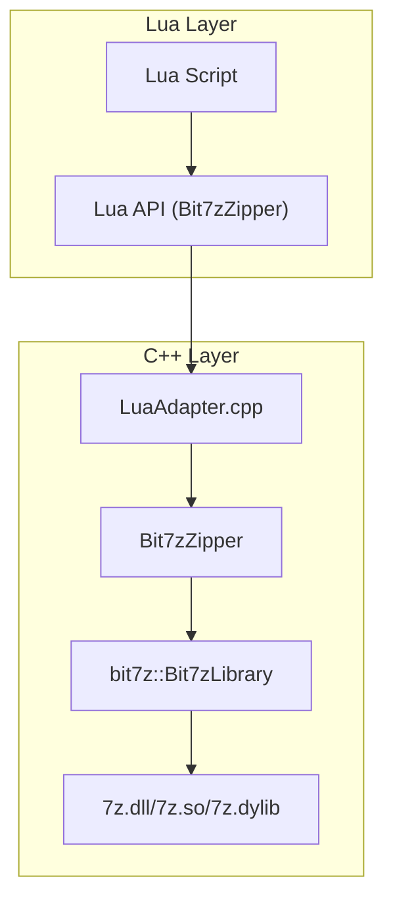
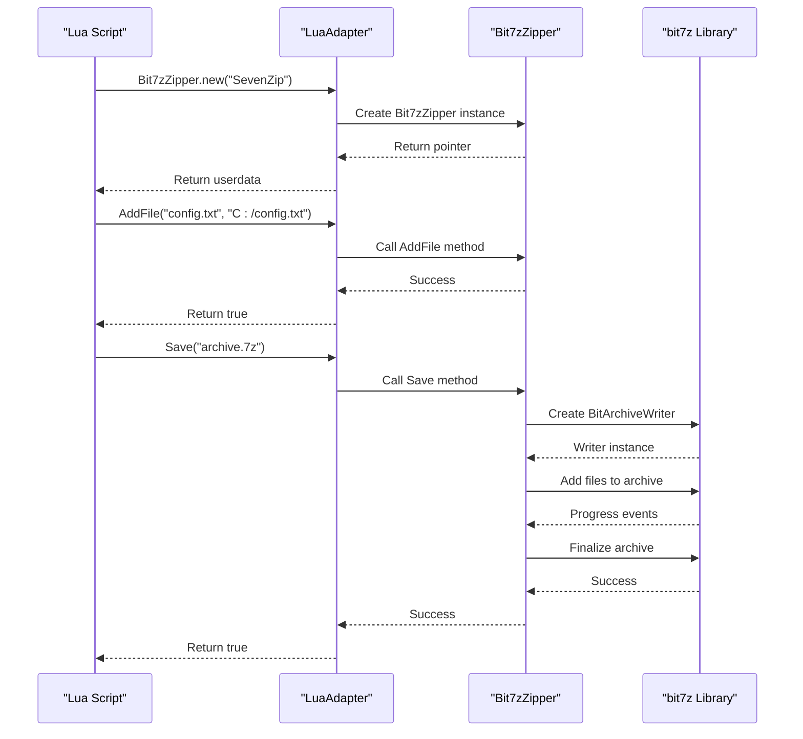
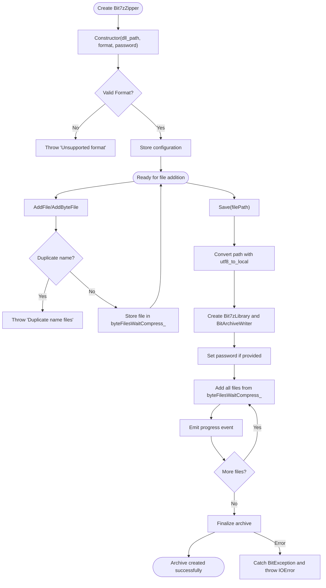
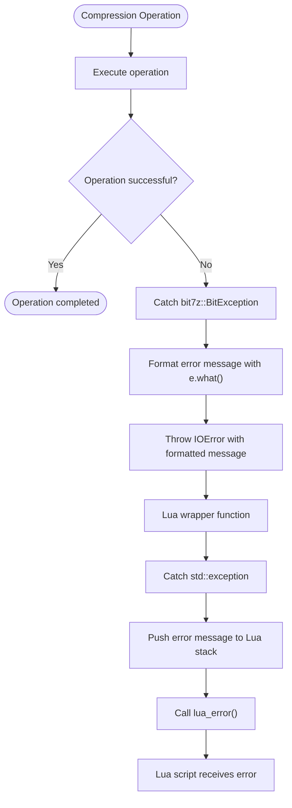
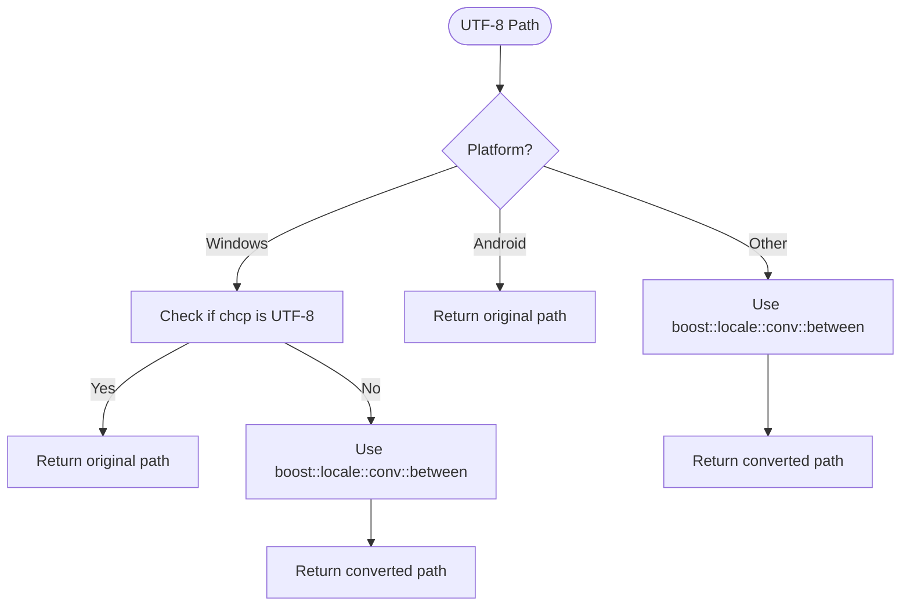

# File Compression with Lua

<cite>
**Referenced Files in This Document**   
- [bit7z_zipper.hpp](file://fileoperator/bit7z_zipper.hpp)
- [bit7z_zipper.cpp](file://fileoperator/bit7z_zipper.cpp)
- [LuaAdapter.cpp](file://fileoperator/LuaAdapter.cpp)
- [LuaAdapter.hpp](file://fileoperator/LuaAdapter.hpp)
- [bit7z_def.hpp](file://fileoperator/bit7z_def.hpp)
- [encoding_convert.cpp](file://base/encoding_convert.cpp)
- [encoding_convert.hpp](file://base/encoding_convert.hpp)
- [LuaNewObject.hpp](file://utils/LuaNewObject.hpp)
</cite>

## Table of Contents
1. [Introduction](#introduction)
2. [Architecture Overview](#architecture-overview)
3. [Core Components](#core-components)
4. [Lua API Reference](#lua-api-reference)
5. [Implementation Details](#implementation-details)
6. [Error Handling](#error-handling)
7. [Cross-Platform Path Handling](#cross-platform-path-handling)
8. [Usage Examples](#usage-examples)
9. [Conclusion](#conclusion)

## Introduction

The File Compression via Lua component provides a powerful interface for creating and manipulating compressed archives through Lua scripting. This system enables users to create compressed archives in multiple formats including Zip, SevenZip, XZ, BZIP2, GZIP, and TAR using the Bit7zZipper class. The implementation leverages the bit7z library as a C++ wrapper around 7-Zip's DLL, providing access to a wide range of compression formats through a clean Lua API. The component is designed to be accessible from Lua scripts while maintaining robust error handling and progress reporting capabilities.

**Section sources**
- [bit7z_zipper.hpp](file://fileoperator/bit7z_zipper.hpp#L1-L74)
- [bit7z_zipper.cpp](file://fileoperator/bit7z_zipper.cpp#L1-L187)

## Architecture Overview

The file compression system follows a layered architecture with clear separation between the C++ implementation and Lua interface. At the core is the Bit7zZipper class that implements the actual compression functionality using the bit7z library. This class inherits from IZipper interface and provides methods for adding files and saving archives. The Lua interface is exposed through wrapper functions in LuaAdapter.cpp that bridge between Lua and C++.



**Diagram sources**
- [bit7z_zipper.hpp](file://fileoperator/bit7z_zipper.hpp#L1-L74)
- [LuaAdapter.cpp](file://fileoperator/LuaAdapter.cpp#L1-L1142)

## Core Components

The core of the file compression system consists of the Bit7zZipper class which provides the main functionality for creating compressed archives. This class supports multiple compression formats through the ZipperFormat enum, including Zip, SevenZip, XZ, BZIP2, GZIP, and TAR. The implementation uses the bit7z library to interface with 7-Zip's DLL, allowing access to advanced compression algorithms.

The Bit7zZipper class maintains a collection of files to be compressed in its byteFilesWaitCompress_ member variable, which uses a map to store file names and their associated data (either as file paths or byte data). During the Save operation, the class creates a BitArchiveWriter from the bit7z library and adds all queued files to the archive.

```mermaid
classDiagram
class Bit7zZipper {
+AddByteFile(name, data)
+AddFile(name, path)
+Save(filePath)
-SaveAllFile(compress, path)
}
class IZipper {
+AddByteFile(name, data)
+AddFile(name, path)
+Save(filePath)
}
class EventSource {
+RaiseEvent(progress, filename)
+operator+=(handler)
}
Bit7zZipper --> IZipper : "implements"
Bit7zZipper --> EventSource : "inherits"
Bit7zZipper --> "bit7z : : BitArchiveWriter" : "uses"
```

**Diagram sources**
- [bit7z_zipper.hpp](file://fileoperator/bit7z_zipper.hpp#L46-L70)
- [bit7z_zipper.cpp](file://fileoperator/bit7z_zipper.cpp#L103-L183)

**Section sources**
- [bit7z_zipper.hpp](file://fileoperator/bit7z_zipper.hpp#L28-L44)
- [bit7z_zipper.cpp](file://fileoperator/bit7z_zipper.cpp#L103-L183)

## Lua API Reference

The Lua API for file compression is exposed through the Bit7zZipper class with a clean and intuitive interface. The API is registered in Lua through the RegisterLuaBit7zZipper function in LuaAdapter.cpp, which sets up the metatable and function bindings.

### Constructor

The 'new' constructor creates a new Bit7zZipper instance and accepts three parameters:
- format: String specifying the compression format ("Zip", "SevenZip", "XZ", "BZIP2", "GZIP", or "TAR")
- dll_path: Optional string specifying the path to the 7-Zip DLL (defaults to platform-specific path)
- password: Optional string for password protection of the archive

### Methods

The following methods are available on the Bit7zZipper object:

- **AddFile(name, path)**: Adds a file from the filesystem to the archive with the specified internal name
- **AddByteFile(name, data)**: Adds raw byte data to the archive with the specified internal name
- **Save(filePath)**: Saves the archive to the specified file path



**Diagram sources**
- [LuaAdapter.cpp](file://fileoperator/LuaAdapter.cpp#L137-L253)
- [bit7z_zipper.cpp](file://fileoperator/bit7z_zipper.cpp#L103-L183)

**Section sources**
- [LuaAdapter.cpp](file://fileoperator/LuaAdapter.cpp#L137-L253)
- [bit7z_zipper.hpp](file://fileoperator/bit7z_zipper.hpp#L49-L59)

## Implementation Details

The implementation of the Bit7zZipper class leverages the bit7z library to provide compression functionality. The class uses a variant type (BytesFileName) to store either file paths or byte data in the byteFilesWaitCompress_ map. When saving the archive, the SaveAllFile method iterates through this map and adds each file to the BitArchiveWriter.

The constructor accepts the compression format, DLL path, and optional password. The format is converted from a string to the ZipperFormat enum, with validation to ensure only supported formats are used. The DLL path defaults to platform-specific locations defined in bit7z_def.hpp, with different paths for Windows, macOS, and Linux.

During the Save operation, the file path is processed through utf8_to_local conversion to handle cross-platform path encoding issues. The method uses a try-catch block to handle bit7z::BitException exceptions, converting them to IOError exceptions with descriptive messages.



**Diagram sources**
- [bit7z_zipper.cpp](file://fileoperator/bit7z_zipper.cpp#L103-L183)
- [bit7z_def.hpp](file://fileoperator/bit7z_def.hpp#L7-L25)

**Section sources**
- [bit7z_zipper.cpp](file://fileoperator/bit7z_zipper.cpp#L103-L183)
- [bit7z_def.hpp](file://fileoperator/bit7z_def.hpp#L7-L25)

## Error Handling

The file compression system implements robust error handling through a combination of C++ exceptions and Lua error propagation. The Bit7zZipper class uses try-catch blocks to handle exceptions from the bit7z library, particularly bit7z::BitException which is thrown when compression operations fail.

When an exception occurs during the Save operation, it is caught and converted to an IOError exception with a descriptive message that includes the original exception message from bit7z. This ensures that users receive meaningful error information rather than generic failure messages.

In the Lua interface, all wrapper functions use try-catch blocks to catch std::exception and convert them to Lua errors using lua_error(). This ensures that any C++ exceptions are properly propagated to Lua scripts, allowing for error handling in the scripting layer.



**Diagram sources**
- [bit7z_zipper.cpp](file://fileoperator/bit7z_zipper.cpp#L153-L156)
- [LuaAdapter.cpp](file://fileoperator/LuaAdapter.cpp#L180-L190)

**Section sources**
- [bit7z_zipper.cpp](file://fileoperator/bit7z_zipper.cpp#L153-L156)
- [LuaAdapter.cpp](file://fileoperator/LuaAdapter.cpp#L180-L190)

## Cross-Platform Path Handling

The file compression system includes comprehensive cross-platform path handling through the utf8_to_local function. This function converts UTF-8 encoded paths to the local system encoding, ensuring proper handling of file paths across different operating systems.

The utf8_to_local function is implemented in encoding_convert.cpp and uses different approaches depending on the platform and available libraries. On Windows, it checks if the system code page is UTF-8 and uses boost::locale for conversion otherwise. On other platforms, it handles Android specially and uses boost::locale for other systems.

This conversion is critical for ensuring that file paths with non-ASCII characters are handled correctly when interfacing with the underlying operating system and file system. The conversion is applied to both the output archive path in the Save method and to file names in the Zipper class.



**Diagram sources**
- [encoding_convert.cpp](file://base/encoding_convert.cpp#L35-L52)
- [bit7z_zipper.cpp](file://fileoperator/bit7z_zipper.cpp#L106-L106)

**Section sources**
- [encoding_convert.cpp](file://base/encoding_convert.cpp#L35-L52)
- [bit7z_zipper.cpp](file://fileoperator/bit7z_zipper.cpp#L106-L106)

## Usage Examples

The Bit7zZipper class is integrated into the Lua environment through the RegisterLuaBit7zZipper function, which sets up the metatable and function bindings. This allows Lua scripts to create and use Bit7zZipper instances seamlessly.

The LuaNewObject utility in LuaNewObject.hpp provides the foundation for creating C++ objects from Lua, handling memory management through Lua's garbage collection. The NewLuaObject template function creates a new userdata in Lua and constructs the C++ object in place, while the LuaGC function handles proper destruction of the object when it is garbage collected.

In the LuaAdapter.cpp file, the bit7z_zipperLib array defines the function bindings that are registered with Lua, including the constructor, AddFile, AddByteFile, Save, and garbage collection function. These bindings are registered with the Lua state through the RegisterLuaBit7zZipper function, making the Bit7zZipper class available to Lua scripts.

```mermaid
classDiagram
class LuaNewObject {
+NewLuaObject(L, args)
+LuaGC(L)
}
class LuaAdapter {
+RegisterLuaBit7zZipper(L)
+lua_bit7z_zipper_new(L)
+lua_bit7z_zipper_add_file(L)
+lua_bit7z_zipper_save(L)
+lua_bit7z_zipper_gc(L)
}
class bit7z_zipperLib {
+{"new", lua_bit7z_zipper_new}
+{"AddFile", lua_bit7z_zipper_add_file}
+{"AddByteFile", lua_bit7z_zipper_add_byte_file}
+{"Save", lua_bit7z_zipper_save}
+{"__gc", lua_bit7z_zipper_gc}
}
LuaNewObject --> LuaAdapter : "used by"
LuaAdapter --> bit7z_zipperLib : "defines"
LuaAdapter --> Bit7zZipper : "wraps"
```

**Diagram sources**
- [LuaNewObject.hpp](file://utils/LuaNewObject.hpp#L11-L45)
- [LuaAdapter.cpp](file://fileoperator/LuaAdapter.cpp#L137-L253)

**Section sources**
- [LuaNewObject.hpp](file://utils/LuaNewObject.hpp#L11-L45)
- [LuaAdapter.cpp](file://fileoperator/LuaAdapter.cpp#L137-L253)

## Conclusion

The File Compression via Lua component provides a comprehensive solution for creating compressed archives through Lua scripting. By leveraging the bit7z library and 7-Zip's DLL, it supports multiple compression formats including Zip, SevenZip, XZ, BZIP2, GZIP, and TAR. The implementation features a clean Lua API with a constructor that accepts format, DLL path, and optional password parameters, along with methods for adding files and saving archives.

The system includes robust error handling that maps C++ exceptions to Lua errors, progress event emission during archive creation, and cross-platform path handling through utf8_to_local conversion. The integration with Lua is seamless, using metatable registration and proper garbage collection to manage object lifecycles. This component enables powerful file compression capabilities that can be easily accessed and controlled from Lua scripts, making it a valuable tool for applications that require programmatic archive creation and manipulation.