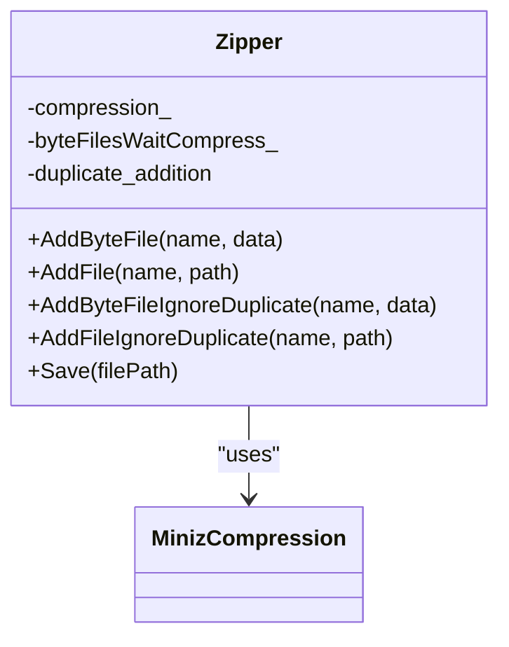
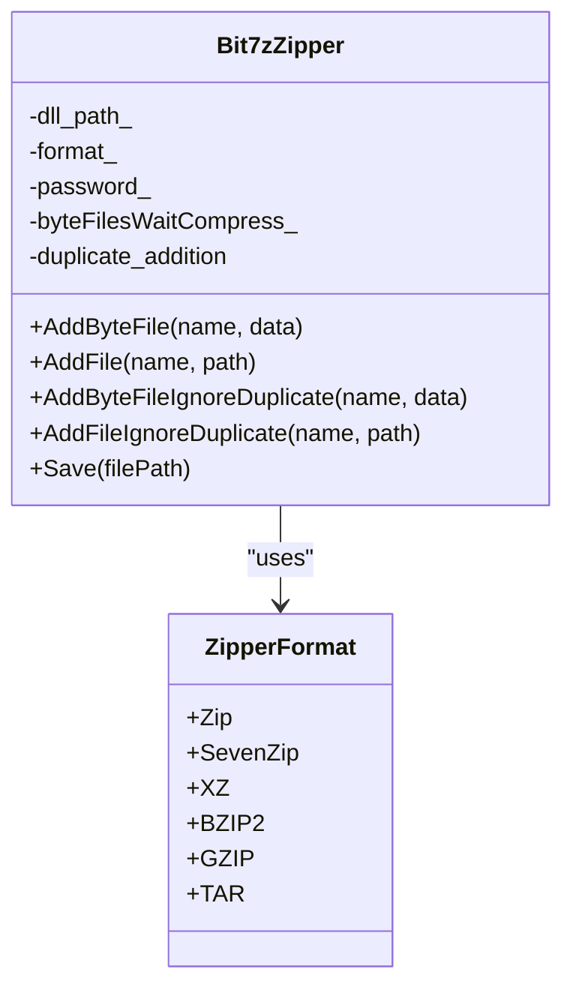
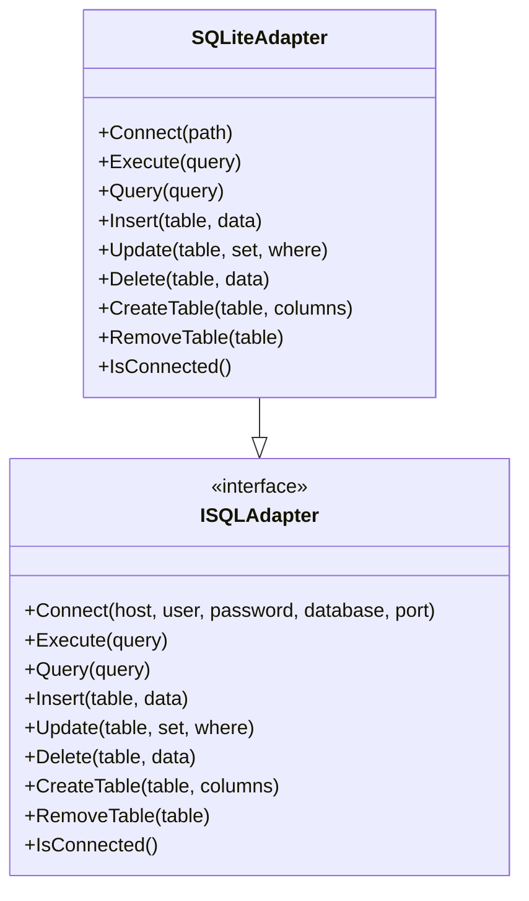
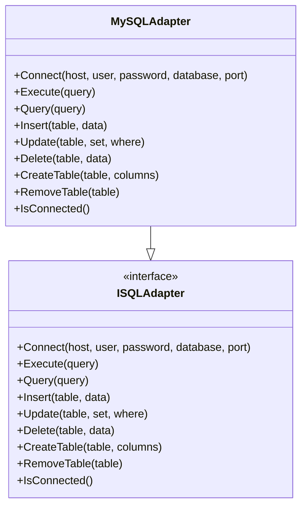
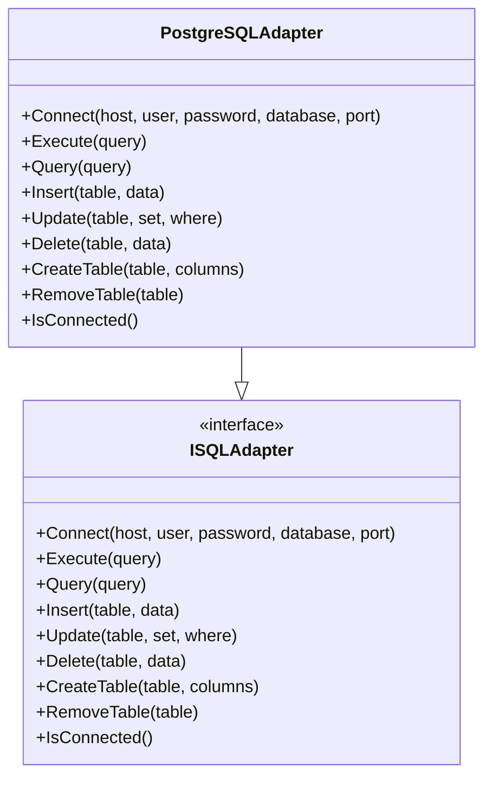
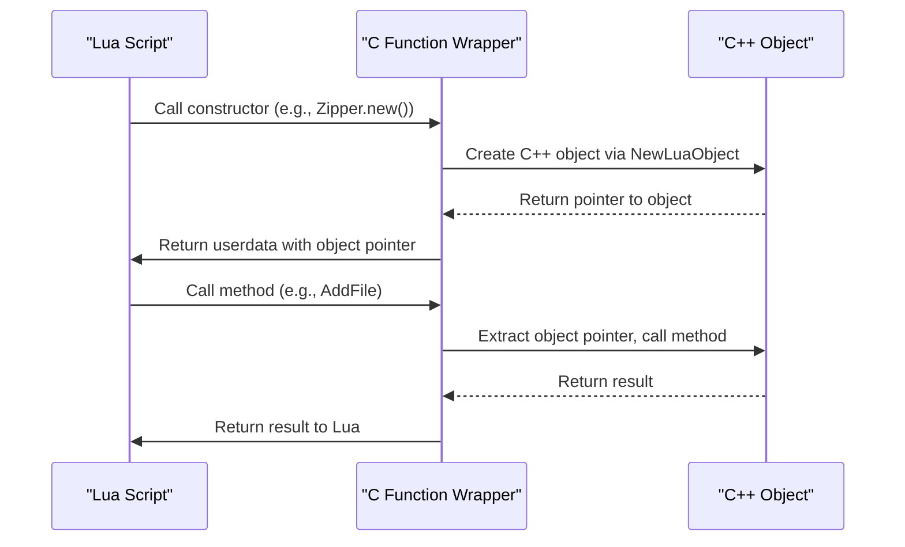
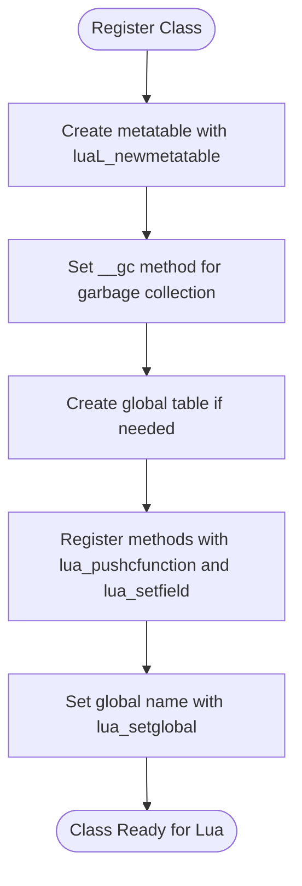
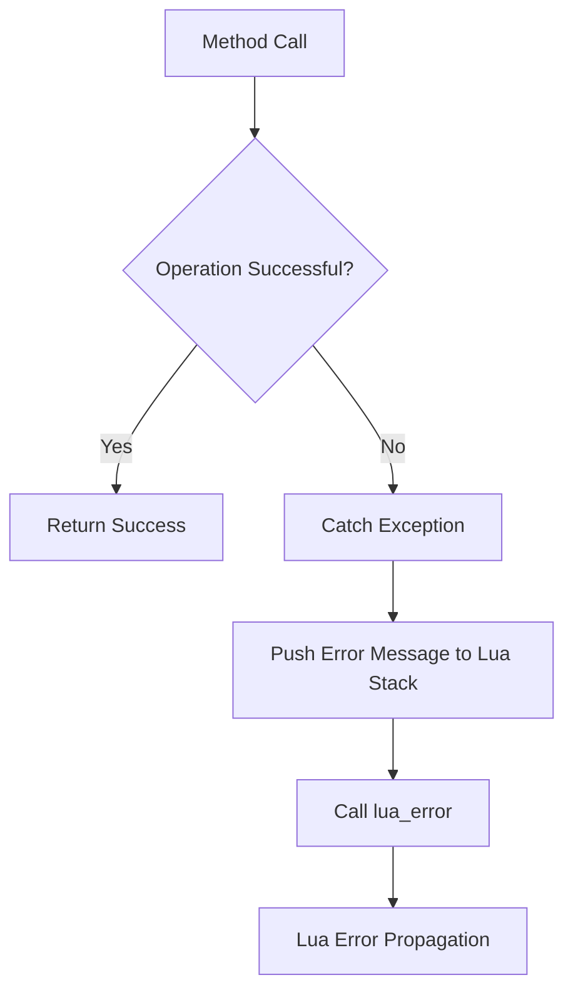
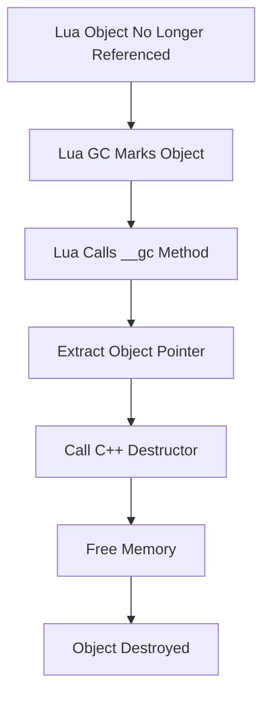

# File and Database Operations

<cite>
**Referenced Files in This Document**   
- [LuaAdapter.cpp](file://fileoperator/LuaAdapter.cpp)
- [LuaAdapter.hpp](file://fileoperator/LuaAdapter.hpp)
- [zipper.hpp](file://fileoperator/zipper.hpp)
- [zipper.cpp](file://fileoperator/zipper.cpp)
- [bit7z_zipper.hpp](file://fileoperator/bit7z_zipper.hpp)
- [bit7z_zipper.cpp](file://fileoperator/bit7z_zipper.cpp)
- [sql_adapter.hpp](file://fileoperator/sql_adapter.hpp)
- [sql_adapter.cpp](file://fileoperator/sql_adapter.cpp)
- [LuaNewObject.hpp](file://utils/LuaNewObject.hpp)
- [zipper_test.cpp](file://tests/FilesOperator/zipper_test.cpp)
- [sqlite_test.cpp](file://tests/FilesOperator/sqlite_test.cpp)
</cite>

## Table of Contents
1. [Introduction](#introduction)
2. [Core Components](#core-components)
3. [File Archive Operations](#file-archive-operations)
4. [Database Operations](#database-operations)
5. [Lua Integration Mechanism](#lua-integration-mechanism)
6. [Error Handling and Resource Management](#error-handling-and-resource-management)
7. [Usage Examples](#usage-examples)
8. [Conclusion](#conclusion)

## Introduction
The File and Database Operations component provides a comprehensive Lua interface for manipulating file archives and performing database operations through object-oriented C++ wrappers. This system enables script-level access to file compression/decompression functionality and database connectivity for SQLite, MySQL, and PostgreSQL databases. The implementation uses Lua metatables to expose C++ classes to Lua scripts, allowing for direct manipulation of Zip, SevenZip, and other archive formats, as well as full CRUD operations on database records. This documentation details the architecture, API, and implementation of these capabilities, focusing on how C++ objects are exposed to Lua and how the system handles error conditions and resource management in long-running scripts.

## Core Components
The File and Database Operations system consists of several key components that work together to provide Lua scripting capabilities for file and database manipulation. The core architecture is built around C++ classes that are exposed to Lua through metatables, with a helper system that manages object lifecycle and garbage collection. The primary components include file archive handlers (Zipper and Bit7zZipper) for creating and manipulating compressed archives, and database adapters (SQLiteAdapter, MySQLAdapter, and PostgreSQLAdapter) for database connectivity and operations. These components are exposed to Lua through a registration system that maps C++ methods to Lua-callable functions, with proper error handling and resource management. The system uses the NewLuaObject helper from LuaNewObject.hpp to create and manage Lua userdata objects, ensuring proper construction and destruction of C++ objects.

**Section sources**
- [LuaAdapter.cpp](file://fileoperator/LuaAdapter.cpp#L1-L1142)
- [LuaAdapter.hpp](file://fileoperator/LuaAdapter.hpp#L1-L30)
- [LuaNewObject.hpp](file://utils/LuaNewObject.hpp#L1-L64)

## File Archive Operations
The file archive operations are implemented through two main classes: Zipper and Bit7zZipper, which provide different capabilities for creating and manipulating compressed archives. The Zipper class uses the miniz library for basic ZIP format support, while the Bit7zZipper class leverages the Bit7z library for support of multiple archive formats including ZIP, SevenZip, XZ, BZIP2, GZIP, and TAR.

### Zipper Class
The Zipper class provides basic ZIP archive creation functionality using the miniz compression library. It supports adding files from disk paths or from in-memory byte arrays, with methods for both direct file addition and byte data addition. The class implements a fluent interface with methods for adding files and saving the archive. The Zipper supports different compression levels through the MinizCompression enum, allowing for trade-offs between compression ratio and speed.



**Diagram sources**
- [zipper.hpp](file://fileoperator/zipper.hpp#L28-L65)
- [zipper.cpp](file://fileoperator/zipper.cpp#L1-L219)

### Bit7zZipper Class
The Bit7zZipper class extends the file archive capabilities to support multiple compression formats through the Bit7z library. It supports a wider range of formats than the basic Zipper, including SevenZip, XZ, BZIP2, GZIP, and TAR. The class is constructed with parameters specifying the desired format, the path to the 7z DLL, and an optional password for encrypted archives. This allows for greater flexibility in archive creation and supports password-protected archives.



**Diagram sources**
- [bit7z_zipper.hpp](file://fileoperator/bit7z_zipper.hpp#L46-L74)
- [bit7z_zipper.cpp](file://fileoperator/bit7z_zipper.cpp#L1-L187)

## Database Operations
The database operations are implemented through a family of adapter classes that provide a consistent interface for different database systems. The system follows an abstract interface pattern with ISQLAdapter defining the contract that all database adapters must implement.

### SQLiteAdapter
The SQLiteAdapter provides connectivity to SQLite databases, which are file-based and do not require a separate database server. It supports all standard database operations including connection, CRUD operations, and schema management. The adapter uses sqlite3 for database operations and provides both direct SQL execution and higher-level methods for common operations like insert, update, delete, and select.



**Diagram sources**
- [sql_adapter.hpp](file://fileoperator/sql_adapter.hpp#L106-L135)
- [sql_adapter.cpp](file://fileoperator/sql_adapter.cpp#L23-L552)

### MySQLAdapter
The MySQLAdapter provides connectivity to MySQL database servers. It supports connection to remote MySQL servers with authentication and provides the same interface as the other database adapters. The adapter uses the MySQL C API for database operations and handles connection management, query execution, and result processing.



**Diagram sources**
- [sql_adapter.hpp](file://fileoperator/sql_adapter.hpp#L137-L167)
- [sql_adapter.cpp](file://fileoperator/sql_adapter.cpp#L554-L1254)

### PostgreSQLAdapter
The PostgreSQLAdapter provides connectivity to PostgreSQL database servers. Like the MySQLAdapter, it supports connection to remote PostgreSQL servers with authentication and provides the same consistent interface. The adapter uses the libpq library for PostgreSQL operations and handles connection management and query execution.



**Diagram sources**
- [sql_adapter.hpp](file://fileoperator/sql_adapter.hpp#L169-L198)
- [sql_adapter.cpp](file://fileoperator/sql_adapter.cpp#L1257-L1705)

## Lua Integration Mechanism
The Lua integration mechanism is implemented through a combination of C functions that serve as wrappers between Lua and C++ objects, and a helper system that manages object creation and garbage collection. The system uses Lua metatables to associate C++ objects with their methods, allowing for object-oriented programming patterns in Lua scripts.

### Object Exposure to Lua
C++ objects are exposed to Lua using userdata objects that contain pointers to the actual C++ objects. The NewLuaObject helper function from LuaNewObject.hpp is used to create these userdata objects and associate them with the appropriate metatable. This function handles the allocation of memory for the C++ object, construction of the object, and setting up the metatable that defines the object's methods.



**Diagram sources**
- [LuaAdapter.cpp](file://fileoperator/LuaAdapter.cpp#L43-L131)
- [LuaNewObject.hpp](file://utils/LuaNewObject.hpp#L11-L29)

### Method Registration
Methods are registered with Lua through luaL_Reg arrays that map method names to C function wrappers. These wrappers extract the object pointer from the userdata, call the appropriate C++ method, and return the result to Lua. The registration functions (RegisterLuaZipper, RegisterLuaSQLiteAdapter, etc.) set up the metatables and global tables that make the classes available in Lua.



**Diagram sources**
- [LuaAdapter.cpp](file://fileoperator/LuaAdapter.cpp#L1002-L1138)
- [LuaAdapter.hpp](file://fileoperator/LuaAdapter.hpp#L18-L28)

## Error Handling and Resource Management
The system implements comprehensive error handling and resource management strategies to ensure robust operation in long-running scripts and handle various error conditions gracefully.

### Error Handling
Error handling is implemented through exception translation from C++ exceptions to Lua errors. When a C++ method throws an exception, the wrapper function catches it and calls lua_error with the exception message. This ensures that errors in the C++ code are properly propagated to Lua scripts, where they can be handled with pcall or xpcall. The system defines a hierarchy of exception classes derived from SQLAdapterError for database operations, allowing for specific error handling based on error type.



**Diagram sources**
- [LuaAdapter.cpp](file://fileoperator/LuaAdapter.cpp#L55-L69)
- [sql_adapter.hpp](file://fileoperator/sql_adapter.hpp#L51-L104)

### Resource Management
Resource management is handled through Lua's garbage collection mechanism, with the __gc metamethod ensuring proper destruction of C++ objects when they are no longer referenced in Lua. The LuaGC helper function from LuaNewObject.hpp is used to implement the garbage collection method, which calls the C++ destructor on the object. This prevents memory leaks and ensures that database connections are properly closed and file handles are released.



**Diagram sources**
- [LuaAdapter.cpp](file://fileoperator/LuaAdapter.cpp#L117-L121)
- [LuaNewObject.hpp](file://utils/LuaNewObject.hpp#L31-L45)

## Usage Examples
The following examples demonstrate how to use the File and Database Operations components in Lua scripts.

### File Archive Example
```lua
-- Create a new Zipper instance
local zipper = Zipper.new()

-- Add files from memory
Zipper.AddByteFile(zipper, "config.txt", "setting1=value1\nsetting2=value2")
Zipper.AddByteFile(zipper, "data.json", '{"name": "test", "value": 42}')

-- Add a file from disk
Zipper.AddFile(zipper, "report.pdf", "/path/to/report.pdf")

-- Save the archive
Zipper.Save(zipper, "archive.zip")
```

### Bit7zZipper Example
```lua
-- Create a new Bit7zZipper for SevenZip format
local bit7z_zipper = Bit7zZipper.new("SevenZip", "path/to/7z.dll", "password123")

-- Add files
Bit7zZipper.AddByteFile(bit7z_zipper, "secret.txt", "confidential data")
Bit7zZipper.AddFile(bit7z_zipper, "document.docx", "/path/to/document.docx")

-- Save encrypted archive
Bit7zZipper.Save(bit7z_zipper, "encrypted.7z")
```

### Database Operations Example
```lua
-- Connect to SQLite database
local db = SQLiteAdapter.new()
db:Connect("application.db")

-- Create table
db:CreateTable("users", {
    id = "INTEGER PRIMARY KEY",
    name = "TEXT NOT NULL",
    email = "TEXT UNIQUE",
    created_at = "TIMESTAMP DEFAULT CURRENT_TIMESTAMP"
})

-- Insert data
db:Insert("users", {name = "Alice", email = "alice@example.com"})
db:Insert("users", {name = "Bob", email = "bob@example.com"})

-- Query data
local results = db:Query("SELECT * FROM users WHERE name = 'Alice'")
for i, row in ipairs(results) do
    print("User:", row.name, "Email:", row.email)
end

-- Update data
db:Update("users", {email = "alice.new@example.com"}, {name = "Alice"})

-- Delete data
db:Delete("users", {name = "Bob"})
```

**Section sources**
- [zipper_test.cpp](file://tests/FilesOperator/zipper_test.cpp#L103-L141)
- [sqlite_test.cpp](file://tests/FilesOperator/sqlite_test.cpp#L58-L120)

## Conclusion
The File and Database Operations component provides a robust and flexible system for performing file archive and database operations through Lua scripting. By exposing C++ classes through Lua metatables, the system enables script-level access to powerful file compression and database connectivity features. The implementation uses a consistent pattern across all components, with C function wrappers translating between Lua and C++ and proper error handling and resource management. The system supports multiple archive formats through the Bit7z library and provides adapters for SQLite, MySQL, and PostgreSQL databases, offering a comprehensive solution for data manipulation tasks. The use of the NewLuaObject helper ensures proper object lifecycle management, while the exception translation mechanism provides clear error reporting to Lua scripts. This architecture enables the creation of powerful scripts for data processing, configuration management, and application automation.