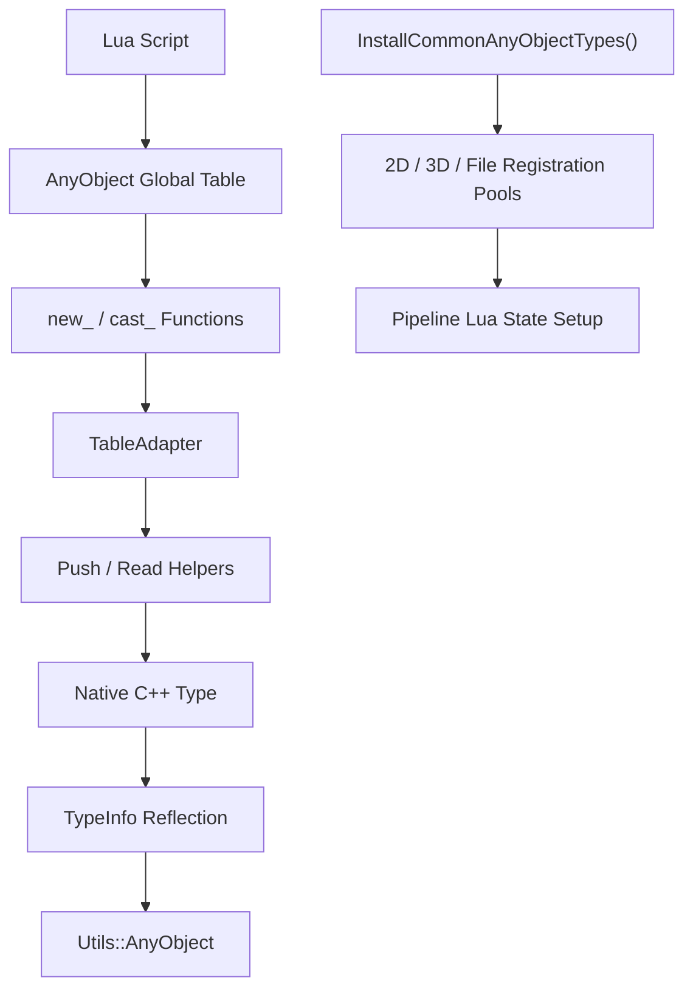
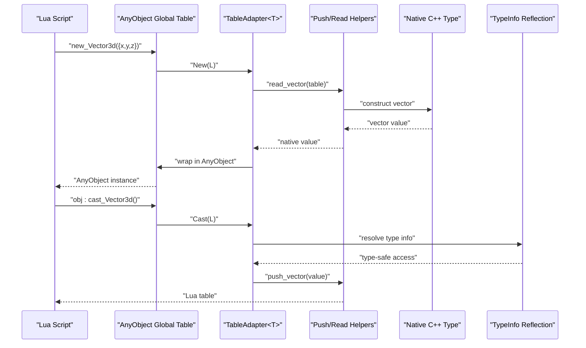
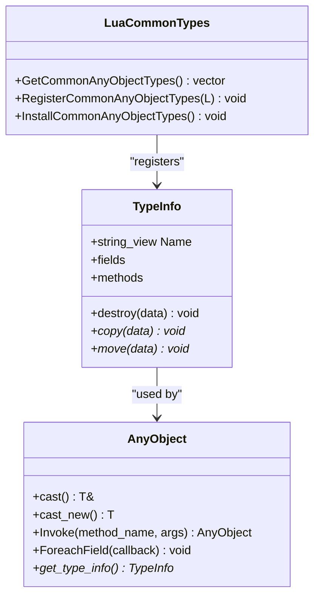
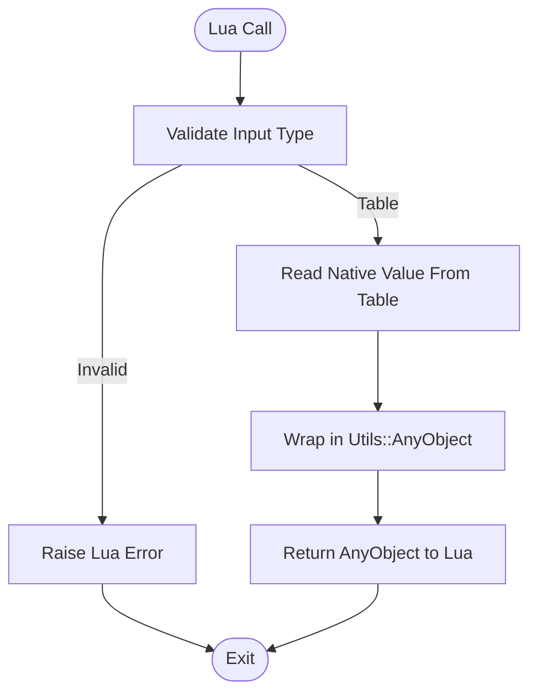
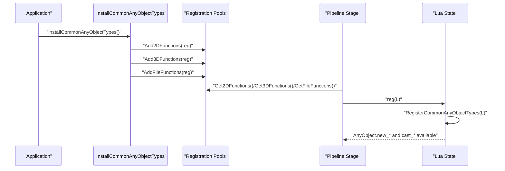
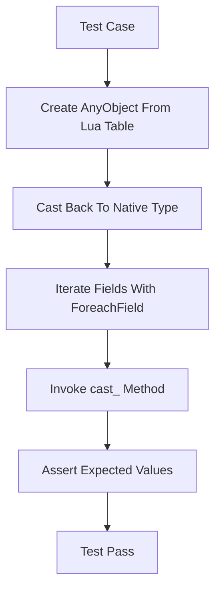
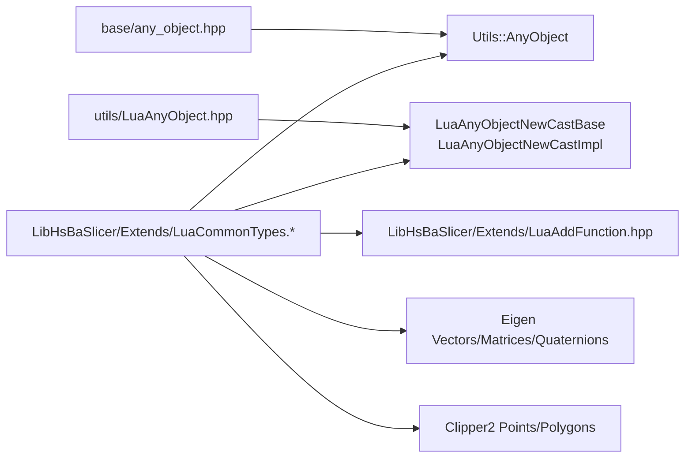

# Lua Common Types System

<cite>
**Referenced Files in This Document**
- [LuaCommonTypes.hpp](file://LibHsBaSlicer/Extends/LuaCommonTypes.hpp)
- [LuaCommonTypes.cpp](file://LibHsBaSlicer/Extends/LuaCommonTypes.cpp)
- [LuaAnyObject.hpp](file://utils/LuaAnyObject.hpp)
- [any_object.hpp](file://base/any_object.hpp)
- [LuaAddFunction.hpp](file://LibHsBaSlicer/Extends/LuaAddFunction.hpp)
- [lua_pipeline.cpp](file://LibHsBaSlicer/Extends/lua_pipeline.cpp)
- [lua_common_types_test.cpp](file://tests/LuaCommonTypes/lua_common_types_test.cpp)
</cite>

## Table of Contents
1. [Introduction](#introduction)
2. [Project Structure](#project-structure)
3. [Core Components](#core-components)
4. [Architecture Overview](#architecture-overview)
5. [Detailed Component Analysis](#detailed-component-analysis)
6. [Dependency Analysis](#dependency-analysis)
7. [Performance Considerations](#performance-considerations)
8. [Troubleshooting Guide](#troubleshooting-guide)
9. [Conclusion](#conclusion)

## Introduction
The Lua Common Types System provides a unified bridge between C++ geometry and math types and Lua scripts used by the slicing pipeline. It does two things:

- Reflects selected C++ types into the runtime type system so that `AnyObject` can inspect fields, invoke methods, and cast values safely.
- Exposes Lua-side constructors and cast functions for those types, allowing Lua code to create and consume native objects through plain Lua tables.

This document explains how the system is structured, which types are supported, how data flows between Lua and C++, and how to integrate it into your own pipeline stages.

## Project Structure
The Lua Common Types System lives primarily under `LibHsBaSlicer/Extends`, with supporting infrastructure in `utils` and `base`. The most important files are:

- `LibHsBaSlicer/Extends/LuaCommonTypes.hpp`: Declares reflected type metadata and public registration APIs.
- `LibHsBaSlicer/Extends/LuaCommonTypes.cpp`: Implements Lua table adapters and the registration/installation entry points.
- `utils/LuaAnyObject.hpp`: Defines the generic adapter base classes and built-in scalar adapters.
- `base/any_object.hpp`: Defines the core `AnyObject` runtime reflection and invocation model.
- `LibHsBaSlicer/Extends/LuaAddFunction.hpp`: Provides pipeline registration pools (2D, 3D, File).
- `LibHsBaSlicer/Extends/lua_pipeline.cpp`: Shows where common types are installed during pipeline setup.
- `tests/LuaCommonTypes/lua_common_types_test.cpp`: Demonstrates expected behavior and usage patterns.

**Diagram sources**
- [LuaCommonTypes.cpp:309-405](file://LibHsBaSlicer/Extends/LuaCommonTypes.cpp#L309-L405)
- [LuaCommonTypes.cpp:407-492](file://LibHsBaSlicer/Extends/LuaCommonTypes.cpp#L407-L492)
- [LuaAnyObject.hpp:32-127](file://utils/LuaAnyObject.hpp#L32-L127)
- [LuaAddFunction.hpp:17-29](file://LibHsBaSlicer/Extends/LuaAddFunction.hpp#L17-L29)
- [lua_pipeline.cpp:737-746](file://LibHsBaSlicer/Extends/lua_pipeline.cpp#L737-L746)

**Section sources**
- [LuaCommonTypes.hpp:20-45](file://LibHsBaSlicer/Extends/LuaCommonTypes.hpp#L20-L45)
- [LuaCommonTypes.cpp:1-10](file://LibHsBaSlicer/Extends/LuaCommonTypes.cpp#L1-L10)
- [LuaAnyObject.hpp:11-17](file://utils/LuaAnyObject.hpp#L11-L17)
- [LuaAddFunction.hpp:15-29](file://LibHsBaSlicer/Extends/LuaAddFunction.hpp#L15-L29)

## Core Components
The system has three main layers:

1. **Reflection layer**: Adds stable names, field descriptors, and cast methods for each registered C++ type.
2. **Lua adapter layer**: Converts between Lua tables and native types using `new_<Name>` and `cast_<Name>`.
3. **Registration layer**: Installs adapters into the global `AnyObject` table and into pipeline registration pools.

Supported types include:

- Eigen vectors: `Vector2f`, `Vector3f`, `Vector4f`, `Vector2d`, `Vector3d`, `Vector4d`, `Vector2i`, `Vector3i`, `Vector4i`.
- Eigen quaternions: `Quaternionf`, `Quaterniond`.
- Eigen matrices: `Matrix2d`, `Matrix3d`, `Matrix4d`, `MatrixXf`, `MatrixXi`.
- Clipper2 points: `Point2D`, `Point2`.
- Clipper2 polygons: `PolygonD`, `PolygonsD`, `Polygon`, `Polygons`.

Built-in scalar adapters are also included when registering common types: `int`, `long`, `long long`, `size_t`, `double`, `float`, `bool`, `string`, `cstring`.

**Section sources**
- [LuaCommonTypes.hpp:109-139](file://LibHsBaSlicer/Extends/LuaCommonTypes.hpp#L109-L139)
- [LuaCommonTypes.hpp:147-182](file://LibHsBaSlicer/Extends/LuaCommonTypes.hpp#L147-L182)
- [LuaCommonTypes.cpp:358-404](file://LibHsBaSlicer/Extends/LuaCommonTypes.cpp#L358-L404)
- [LuaCommonTypes.cpp:454-472](file://LibHsBaSlicer/Extends/LuaCommonTypes.cpp#L454-L472)

## Architecture Overview
At a high level, the flow is:

- A Lua script calls `AnyObject.new_<Type>(table)` or `obj:cast_<Type>()`.
- The corresponding adapter converts the Lua table to a native value or extracts a native value from an `AnyObject`.
- The native value is wrapped in `Utils::AnyObject` and exposed back to Lua.
- Reflection metadata allows field iteration and method invocation through `AnyObject`.

**Diagram sources**
- [LuaCommonTypes.cpp:309-356](file://LibHsBaSlicer/Extends/LuaCommonTypes.cpp#L309-L356)
- [LuaCommonTypes.cpp:74-112](file://LibHsBaSlicer/Extends/LuaCommonTypes.cpp#L74-L112)
- [LuaCommonTypes.hpp:83-107](file://LibHsBaSlicer/Extends/LuaCommonTypes.hpp#L83-L107)

## Detailed Component Analysis

### Reflection Metadata and Type Macros
The header defines macros that generate `GetTypeInfo<T>()` specializations for each registered type. There are two categories:

- Reflected types: expose scalar components as fields (`x`, `y`, optional `z`, optional `w`) and register a `cast_<Name>` method.
- Opaque types: only expose a stable name and a `cast_<Name>` method; they do not expose component fields because their internal layout is not treated as contiguous scalars.

**Diagram sources**
- [any_object.hpp:48-109](file://base/any_object.hpp#L48-L109)
- [LuaCommonTypes.hpp:83-107](file://LibHsBaSlicer/Extends/LuaCommonTypes.hpp#L83-L107)
- [LuaCommonTypes.hpp:147-182](file://LibHsBaSlicer/Extends/LuaCommonTypes.hpp#L147-L182)

**Section sources**
- [LuaCommonTypes.hpp:20-45](file://LibHsBaSlicer/Extends/LuaCommonTypes.hpp#L20-L45)
- [LuaCommonTypes.hpp:83-142](file://LibHsBaSlicer/Extends/LuaCommonTypes.hpp#L83-L142)
- [any_object.hpp:48-109](file://base/any_object.hpp#L48-L109)

### Lua Adapters and Table Encoding
Each type family has push/read helpers that define how Lua tables map to C++ values:

- Fixed vectors and quaternions use named-coordinate maps: `{x, y, z?, w?}`. Input also accepts sequence form `{v1, v2, ...}`.
- Matrices use nested row sequences: `{{r1c1, r1c2, ...}, {r2c1, r2c2, ...}}`.
- Clipper2 points use `{x, y}`.
- Polygons and polygon lists are sequences of points or sequences of polygons.

The adapter template `TableAdapter<T, Name, Push, Read>` generates:

- `new_<Name>(table)` → creates an `AnyObject` wrapping the native type.
- `cast_<Name>()` → converts an `AnyObject` back to a Lua table.

**Diagram sources**
- [LuaCommonTypes.cpp:309-356](file://LibHsBaSlicer/Extends/LuaCommonTypes.cpp#L309-L356)
- [LuaCommonTypes.cpp:74-175](file://LibHsBaSlicer/Extends/LuaCommonTypes.cpp#L74-L175)
- [LuaCommonTypes.cpp:180-304](file://LibHsBaSlicer/Extends/LuaCommonTypes.cpp#L180-L304)

**Section sources**
- [LuaCommonTypes.cpp:24-70](file://LibHsBaSlicer/Extends/LuaCommonTypes.cpp#L24-L70)
- [LuaCommonTypes.cpp:74-175](file://LibHsBaSlicer/Extends/LuaCommonTypes.cpp#L74-L175)
- [LuaCommonTypes.cpp:180-304](file://LibHsBaSlicer/Extends/LuaCommonTypes.cpp#L180-L304)
- [LuaCommonTypes.cpp:309-405](file://LibHsBaSlicer/Extends/LuaCommonTypes.cpp#L309-L405)

### Registration and Installation
There are two important registration concepts:

1. **Per-state registration**: `RegisterCommonAnyObjectTypes(L)` installs scalar adapters plus all common custom types into the given Lua state. It uses a registry key to ensure idempotency per `lua_State`.
2. **Pipeline pool installation**: `InstallCommonAnyObjectTypes()` registers one wrapper function into the 2D, 3D, and File registration pools. This makes common types available automatically to pipeline stages that build their Lua states from those pools.

**Diagram sources**
- [LuaCommonTypes.cpp:439-492](file://LibHsBaSlicer/Extends/LuaCommonTypes.cpp#L439-L492)
- [LuaAddFunction.hpp:17-29](file://LibHsBaSlicer/Extends/LuaAddFunction.hpp#L17-L29)
- [lua_pipeline.cpp:737-746](file://LibHsBaSlicer/Extends/lua_pipeline.cpp#L737-L746)

**Section sources**
- [LuaCommonTypes.cpp:407-492](file://LibHsBaSlicer/Extends/LuaCommonTypes.cpp#L407-L492)
- [LuaAnyObject.hpp:512-521](file://utils/LuaAnyObject.hpp#L512-L521)
- [lua_pipeline.cpp:737-746](file://LibHsBaSlicer/Extends/lua_pipeline.cpp#L737-L746)

### Usage Patterns from Tests
The test file demonstrates typical usage:

- Creating vectors, matrices, quaternions, and polygons from Lua tables.
- Casting `AnyObject` instances back to native types.
- Iterating fields via `foreach_field`.
- Invoking `cast_<Name>` through `AnyObject.invoke`.
- Verifying that pipeline pool installation is idempotent and that re-registration on the same Lua state is safe.

**Diagram sources**
- [lua_common_types_test.cpp:20-96](file://tests/LuaCommonTypes/lua_common_types_test.cpp#L20-L96)
- [lua_common_types_test.cpp:98-152](file://tests/LuaCommonTypes/lua_common_types_test.cpp#L98-L152)
- [lua_common_types_test.cpp:154-200](file://tests/LuaCommonTypes/lua_common_types_test.cpp#L154-L200)

**Section sources**
- [lua_common_types_test.cpp:20-96](file://tests/LuaCommonTypes/lua_common_types_test.cpp#L20-L96)
- [lua_common_types_test.cpp:98-152](file://tests/LuaCommonTypes/lua_common_types_test.cpp#L98-L152)
- [lua_common_types_test.cpp:154-200](file://tests/LuaCommonTypes/lua_common_types_test.cpp#L154-L200)
- [lua_common_types_test.cpp:202-217](file://tests/LuaCommonTypes/lua_common_types_test.cpp#L202-L217)

## Dependency Analysis
The Lua Common Types System depends on several layers:

- `base/any_object.hpp`: Provides `AnyObject` and `TypeInfo`.
- `utils/LuaAnyObject.hpp`: Provides adapter base classes and built-in scalar adapters.
- `LibHsBaSlicer/Extends/LuaAddFunction.hpp`: Provides pipeline registration pools.
- Geometry libraries: Eigen and Clipper2 types are used directly.

**Diagram sources**
- [LuaCommonTypes.hpp:11-18](file://LibHsBaSlicer/Extends/LuaCommonTypes.hpp#L11-L18)
- [LuaCommonTypes.cpp:18-19](file://LibHsBaSlicer/Extends/LuaCommonTypes.cpp#L18-L19)
- [LuaAnyObject.hpp:32-127](file://utils/LuaAnyObject.hpp#L32-L127)
- [LuaAddFunction.hpp:17-29](file://LibHsBaSlicer/Extends/LuaAddFunction.hpp#L17-L29)

**Section sources**
- [LuaCommonTypes.hpp:11-18](file://LibHsBaSlicer/Extends/LuaCommonTypes.hpp#L11-L18)
- [LuaCommonTypes.cpp:18-19](file://LibHsBaSlicer/Extends/LuaCommonTypes.cpp#L18-L19)
- [LuaAnyObject.hpp:32-127](file://utils/LuaAnyObject.hpp#L32-L127)
- [LuaAddFunction.hpp:17-29](file://LibHsBaSlicer/Extends/LuaAddFunction.hpp#L17-L29)

## Performance Considerations
- **Static adapter storage**: Adapter instances are declared as static variables inside `GetCommonAnyObjectTypes`, avoiding repeated allocation and ensuring process-lifetime validity.
- **Idempotent registration**: Per-state registry keys prevent duplicate registration on the same Lua state, which avoids rebuilding the global `AnyObject` table unnecessarily.
- **Thread-safe pool installation**: `InstallCommonAnyObjectTypes` uses `std::call_once` so registration into the 2D/3D/File pools happens exactly once.
- **Copy vs view**: The reflected `cast_<Name>` method returns a non-owning view through `AnyObject`, reducing copies when passing values around within C++. Lua-side conversions still copy values into Lua tables.
- **Sequence vs map input**: Accepting both named-coordinate maps and sequence forms adds small parsing overhead but improves usability for Lua scripts.

[No sources needed since this section provides general guidance]

## Troubleshooting Guide
Common issues and how to handle them:

- **Calling `new_<Type>` with a non-table argument**: The adapter validates the first argument and raises a Lua error if it is not a table.
- **Type mismatch when casting**: If an `AnyObject` does not wrap the requested type, casting throws an exception; Lua wrappers convert exceptions into Lua errors.
- **Re-registering the same Lua state multiple times**: Use `RegisterCommonAnyObjectTypes` only once per Lua state, or rely on its internal guard. Repeated calls return early after the first successful registration.
- **Pipeline stage runs multiple pools on one state**: Stages like Support may run 2D and 3D pools on the same Lua state. The per-state guard ensures the second execution does not overwrite existing globals.
- **Unknown method invocation**: Calling `AnyObject.invoke(obj, "unknown_method")` will fail through the metatable invoke path.

**Section sources**
- [LuaCommonTypes.cpp:323-355](file://LibHsBaSlicer/Extends/LuaCommonTypes.cpp#L323-L355)
- [LuaCommonTypes.cpp:439-476](file://LibHsBaSlicer/Extends/LuaCommonTypes.cpp#L439-L476)
- [lua_common_types_test.cpp:202-217](file://tests/LuaCommonTypes/lua_common_types_test.cpp#L202-L217)

## Conclusion
The Lua Common Types System is a focused bridge that makes C++ math and geometry types usable from Lua without manual glue code for every type. It combines reflection metadata, Lua table adapters, and pipeline-friendly registration so that slicing scripts can work with vectors, matrices, quaternions, and polygons naturally. For new types, you extend the system by adding reflection metadata and a table adapter, then include the adapter in the common types list. For pipeline integration, call `InstallCommonAnyObjectTypes` once at application startup so all pipeline stages receive the same consistent set of Lua bindings.

[No sources needed since this section summarizes without analyzing specific files]