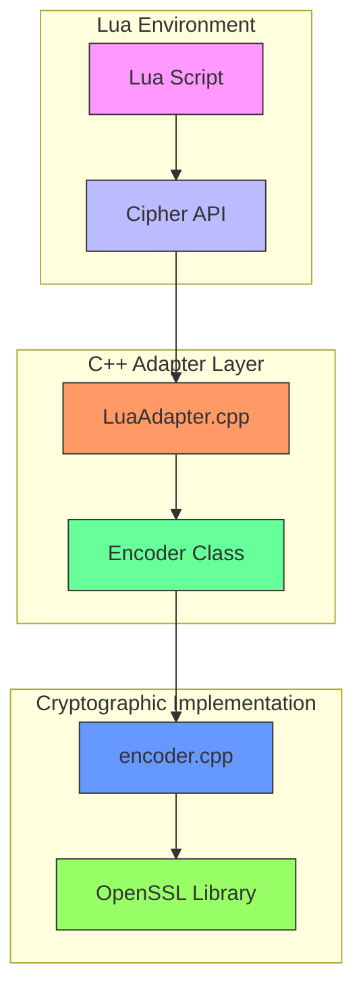
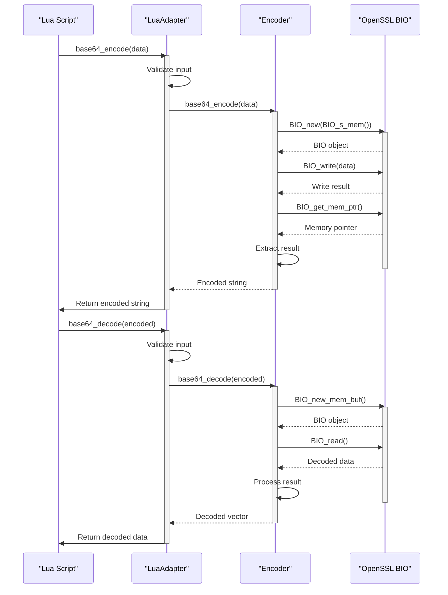
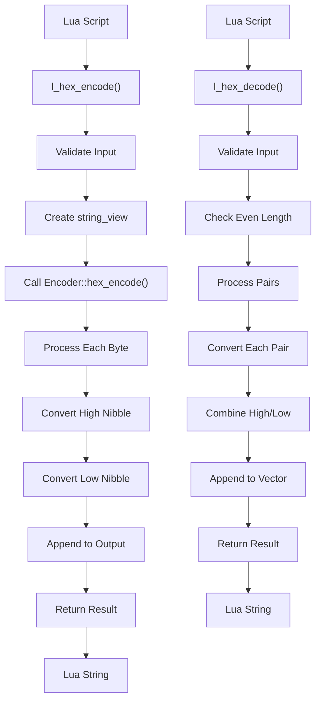
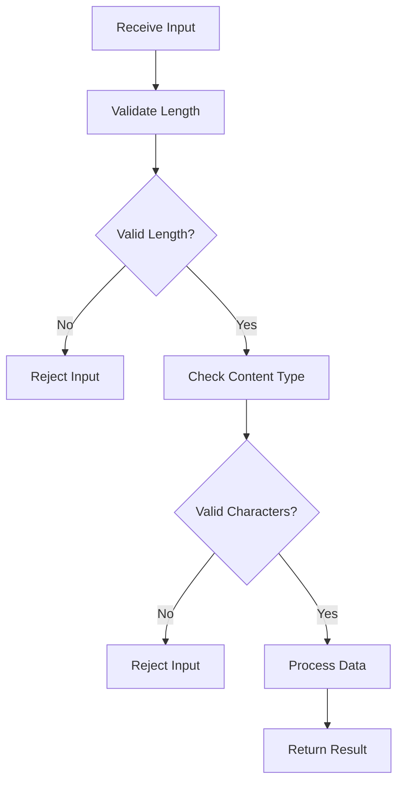
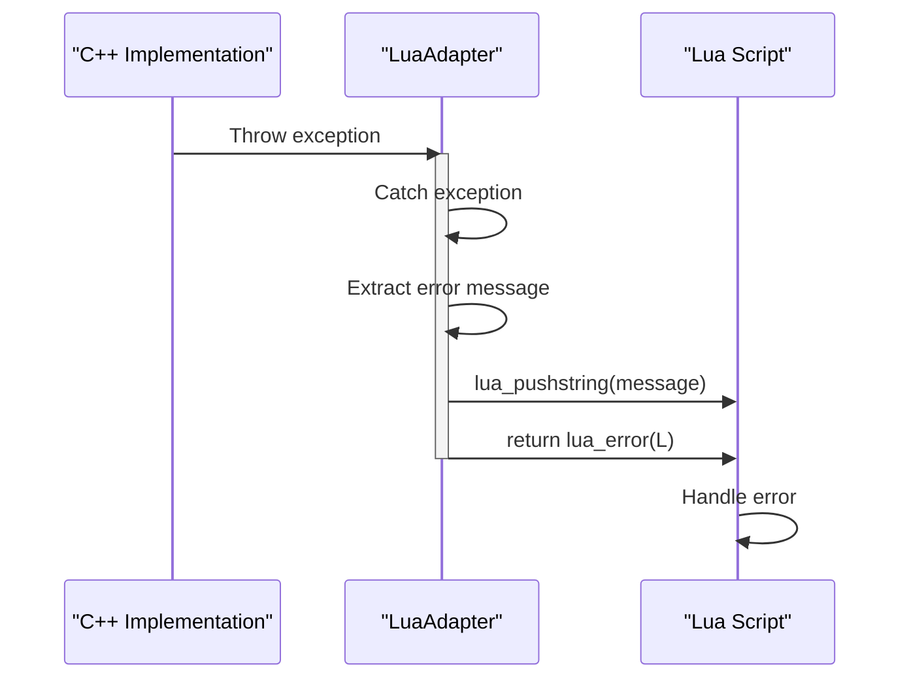

# Security and Encoding Operations

<cite>
**Referenced Files in This Document**   
- [LuaAdapter.cpp](file://cipher/LuaAdapter.cpp)
- [LuaAdapter.hpp](file://cipher/LuaAdapter.hpp)
- [encoder.cpp](file://cipher/encoder.cpp)
- [encoder.hpp](file://cipher/encoder.hpp)
- [encrypt.cpp](file://cipher/encrypt.cpp)
- [encrypt.hpp](file://cipher/encrypt.hpp)
- [hasher.cpp](file://cipher/hasher.cpp)
- [hasher.hpp](file://cipher/hasher.hpp)
- [error.hpp](file://base/error.hpp)
</cite>

## Table of Contents
1. [Introduction](#introduction)
2. [Architecture Overview](#architecture-overview)
3. [Core Components](#core-components)
4. [Lua API Functions](#lua-api-functions)
5. [Usage Examples](#usage-examples)
6. [Security Considerations](#security-considerations)
7. [Error Handling](#error-handling)
8. [Conclusion](#conclusion)

## Introduction

The Security and Encoding Operations component provides cryptographic and encoding functionality through Lua scripting in the HsBaSlicer application. This system enables secure data handling, encoding/decoding operations, and cryptographic functions via a dedicated Cipher library accessible from Lua scripts. The implementation bridges C++ cryptographic capabilities with Lua scripting through a well-defined adapter pattern, allowing script-based access to security operations while maintaining robust error handling and type safety.

The component is designed to support common encoding formats (Base64 and hexadecimal) and cryptographic operations including symmetric encryption (AES, 3DES) and asymmetric encryption (RSA). This documentation focuses on the encoding functionality exposed through the Cipher library, detailing the implementation, API usage, and security considerations for handling sensitive data in Lua scripts.

## Architecture Overview

The Security and Encoding architecture follows a layered design pattern with clear separation between the Lua interface layer, the C++ implementation layer, and the underlying OpenSSL cryptographic library. The system exposes encoding and cryptographic functions to Lua scripts through a carefully designed adapter that ensures type safety, proper memory management, and comprehensive error handling.



**Diagram sources**
- [cipher/LuaAdapter.cpp](file://cipher/LuaAdapter.cpp#L1-L96)
- [cipher/encoder.cpp](file://cipher/encoder.cpp#L1-L108)
- [cipher/encoder.hpp](file://cipher/encoder.hpp#L1-L35)

**Section sources**
- [cipher/LuaAdapter.cpp](file://cipher/LuaAdapter.cpp#L1-L96)
- [cipher/encoder.cpp](file://cipher/encoder.cpp#L1-L108)

## Core Components

The Security and Encoding system consists of several core components that work together to provide cryptographic functionality to Lua scripts. The primary components include the Lua adapter layer, the Encoder class implementation, and the underlying OpenSSL integration.

The Lua adapter (LuaAdapter.cpp) serves as the bridge between Lua scripts and C++ cryptographic functions. It implements the necessary Lua C API functions to expose encoding operations to scripts, handling parameter validation, type conversion, and error propagation. The adapter follows the RAII pattern for resource management and uses proper exception handling to ensure script safety.

The Encoder class provides the core implementation for base64 and hexadecimal encoding/decoding operations. It leverages OpenSSL's BIO (Basic Input/Output) functionality for base64 operations and implements custom hexadecimal encoding for efficiency. The class is designed as a static utility with both vector-based and string-view based interfaces to accommodate different usage patterns.

```mermaid
classDiagram
class Encoder {
+static string base64_encode(vector<unsigned char> data)
+static string base64_encode(string_view data)
+static vector<unsigned char> base64_decode(string_view b64)
+static string base64_decode_to_string(string_view b64)
+static string hex_encode(vector<unsigned char> data)
+static string hex_encode(string_view data)
+static vector<unsigned char> hex_decode(string_view hex)
+static string hex_decode_to_string(string_view hex)
}
class LuaAdapter {
+static int l_base64_encode(lua_State* L)
+static int l_base64_decode(lua_State* L)
+static int l_hex_encode(lua_State* L)
+static int l_hex_decode(lua_State* L)
+static void RegisterLuaCipher(lua_State* L)
}
Encoder <|-- LuaAdapter : "uses"
LuaAdapter --> "OpenSSL BIO" : "depends on"
note right of Encoder
Implements base64 and hex encoding/decoding
Uses OpenSSL for base64 operations
Custom implementation for hex encoding
end note
note right of LuaAdapter
Lua C API bindings
Parameter validation
Exception handling
Type conversion
end note
```

**Diagram sources**
- [cipher/encoder.hpp](file://cipher/encoder.hpp#L9-L32)
- [cipher/LuaAdapter.cpp](file://cipher/LuaAdapter.cpp#L9-L87)

**Section sources**
- [cipher/encoder.cpp](file://cipher/encoder.cpp#L25-L108)
- [cipher/encoder.hpp](file://cipher/encoder.hpp#L9-L32)
- [cipher/LuaAdapter.cpp](file://cipher/LuaAdapter.cpp#L9-L87)

## Lua API Functions

The Cipher library exposes four primary encoding functions to Lua scripts, providing bidirectional conversion between binary data and text representations. These functions follow a consistent naming convention and parameter pattern, making them intuitive to use while ensuring type safety and proper error handling.

### Base64 Encoding and Decoding

The base64 functions provide standard Base64 encoding and decoding capabilities, essential for transmitting binary data in text-based formats or storing binary data in configuration files.



**Diagram sources**
- [cipher/LuaAdapter.cpp](file://cipher/LuaAdapter.cpp#L9-L25)
- [cipher/encoder.cpp](file://cipher/encoder.cpp#L25-L57)

### Hexadecimal Encoding and Decoding

The hexadecimal functions provide hex encoding and decoding capabilities, commonly used for representing binary data in a human-readable format or for checksum representations.



**Diagram sources**
- [cipher/LuaAdapter.cpp](file://cipher/LuaAdapter.cpp#L45-L63)
- [cipher/encoder.cpp](file://cipher/encoder.cpp#L84-L108)

## Usage Examples

The Cipher library functions can be used in various scenarios for securing configuration data, encoding payloads, or handling sensitive information in Lua scripts. The following examples demonstrate practical applications of the encoding functions.

### Securing Configuration Data

When storing sensitive configuration data, base64 encoding can be used to obfuscate the information while maintaining readability for debugging purposes:

```lua
-- Example: Encoding configuration data
local config_data = "sensitive_api_key_12345"
local encoded_config = Cipher.base64_encode(config_data)
print("Encoded: " .. encoded_config)

-- Later, decode when needed
local decoded_config = Cipher.base64_decode(encoded_config)
print("Decoded: " .. decoded_config)
```

### Handling Encoded Payloads

For transmitting binary data through text-based protocols, hexadecimal encoding provides a compact representation:

```lua
-- Example: Processing hex-encoded data
local hex_payload = "48656c6c6f20576f726c64" -- "Hello World" in hex
local binary_data = Cipher.hex_decode(hex_payload)

-- Process the binary data
local processed_data = some_processing_function(binary_data)

-- Encode back to hex for transmission
local result_hex = Cipher.hex_encode(processed_data)
send_to_server(result_hex)
```

### Data Integrity Verification

Combining encoding with hashing functions allows for data integrity verification:

```lua
-- Example: Verify data integrity
local original_data = "important_configuration_data"
local hash_value = Hasher.sha256_hex(original_data)
local encoded_hash = Cipher.base64_encode(hash_value)

-- Store both data and encoded hash
save_data(original_data, encoded_hash)

-- Later, verify integrity
local stored_data = load_data()
local stored_encoded_hash = load_hash()
local stored_hash = Cipher.base64_decode(stored_encoded_hash)
local calculated_hash = Hasher.sha256_hex(stored_data)

if hash_equals(stored_hash, calculated_hash) then
    print("Data integrity verified")
else
    print("Data has been tampered with!")
end
```

**Section sources**
- [cipher/LuaAdapter.cpp](file://cipher/LuaAdapter.cpp#L9-L87)
- [cipher/encoder.cpp](file://cipher/encoder.cpp#L25-L108)
- [cipher/hasher.cpp](file://cipher/hasher.cpp#L57-L71)

## Security Considerations

When using the Cipher library functions in Lua scripts, several security considerations must be addressed to ensure the safe handling of sensitive data.

### Input Validation

All input data should be properly validated before processing. The library performs basic validation, but additional checks may be necessary depending on the use case:



**Diagram sources**
- [cipher/encoder.cpp](file://cipher/encoder.cpp#L98-L106)
- [cipher/LuaAdapter.cpp](file://cipher/LuaAdapter.cpp#L12-L13)

### Exception Safety

The implementation ensures exception safety through proper resource management and error propagation. All OpenSSL resources are properly freed even in error conditions, preventing memory leaks:

```mermaid
sequenceDiagram
participant Lua as "Lua Script"
participant Adapter as "LuaAdapter"
participant Encoder as "Encoder"
Lua->>Adapter : Call encoding function
activate Adapter
Adapter->>Encoder : Try operation
activate Encoder
Encoder->>Encoder : Allocate resources
alt Operation succeeds
Encoder-->>Adapter : Return result
deactivate Encoder
Adapter-->>Lua : Return success
deactivate Adapter
else Operation fails
Encoder->>Encoder : Clean up resources
Encoder-->>Adapter : Throw exception
deactivate Encoder
Adapter->>Adapter : Convert to Lua error
Adapter-->>Lua : Return error
deactivate Adapter
end
```

**Diagram sources**
- [cipher/encoder.cpp](file://cipher/encoder.cpp#L27-L56)
- [cipher/LuaAdapter.cpp](file://cipher/LuaAdapter.cpp#L14-L24)

### Sensitive Data Handling

When handling sensitive data such as passwords or API keys, additional precautions should be taken:

1. Minimize the lifetime of sensitive data in memory
2. Avoid logging or printing sensitive information
3. Use secure storage mechanisms when persisting sensitive data
4. Consider using more advanced cryptographic techniques for highly sensitive data

The current implementation properly handles errors without exposing sensitive information in error messages, but script authors should be cautious about how they use the returned data.

**Section sources**
- [cipher/LuaAdapter.cpp](file://cipher/LuaAdapter.cpp#L14-L24)
- [cipher/encoder.cpp](file://cipher/encoder.cpp#L27-L56)
- [base/error.hpp](file://base/error.hpp#L12-L37)

## Error Handling

The Security and Encoding system implements comprehensive error handling to ensure robust operation and provide meaningful feedback when issues occur. The error handling strategy follows a layered approach, with appropriate exception types and proper propagation to Lua scripts.

### Exception Types

The system uses a hierarchy of exception types defined in the base error system, allowing for precise error handling:

```mermaid
classDiagram
class std : : exception
class std : : runtime_error
class RuntimeError
class InvalidArgumentError
std : : exception <|-- std : : runtime_error
std : : runtime_error <|-- RuntimeError
RuntimeError <|-- InvalidArgumentError
note right of RuntimeError
Base class for runtime errors
Used for OpenSSL initialization failures
Used for BIO operations
end note
note right of InvalidArgumentError
Thrown for invalid input parameters
Used for hex string validation
Used for IV length validation
end note
```

**Diagram sources**
- [base/error.hpp](file://base/error.hpp#L12-L37)
- [cipher/encoder.cpp](file://cipher/encoder.cpp#L21-L22)

### Error Propagation

Errors are properly propagated from the C++ implementation to Lua scripts through the adapter layer:



The adapter ensures that all C++ exceptions are caught and converted to Lua errors, preventing crashes and providing meaningful error messages to script developers. This approach maintains the stability of the Lua environment while allowing for detailed error diagnosis.

**Diagram sources**
- [cipher/LuaAdapter.cpp](file://cipher/LuaAdapter.cpp#L14-L24)
- [cipher/LuaAdapter.cpp](file://cipher/LuaAdapter.cpp#L32-L42)

**Section sources**
- [cipher/LuaAdapter.cpp](file://cipher/LuaAdapter.cpp#L14-L43)
- [base/error.hpp](file://base/error.hpp#L12-L37)

## Conclusion

The Security and Encoding Operations component provides a robust and secure interface for cryptographic functions in Lua scripts through the Cipher library. By leveraging the LuaAdapter pattern, the system exposes essential encoding functionality (base64 and hexadecimal) while maintaining proper error handling, resource management, and type safety.

The implementation demonstrates several best practices in secure coding, including proper exception handling, resource cleanup, and input validation. The use of OpenSSL for cryptographic operations ensures industry-standard security, while the C++ to Lua bridge provides a safe and efficient interface for script-based access.

When using these functions, developers should be mindful of security considerations such as input validation, sensitive data handling, and proper error management. The provided examples illustrate common use cases for securing configuration data and handling encoded payloads, but the functions can be adapted to various security-related scenarios.

The architecture's clear separation of concerns and comprehensive error handling make it a reliable component for security-critical operations within the HsBaSlicer application.