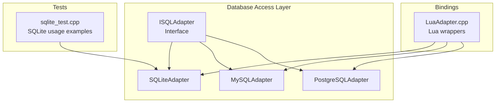
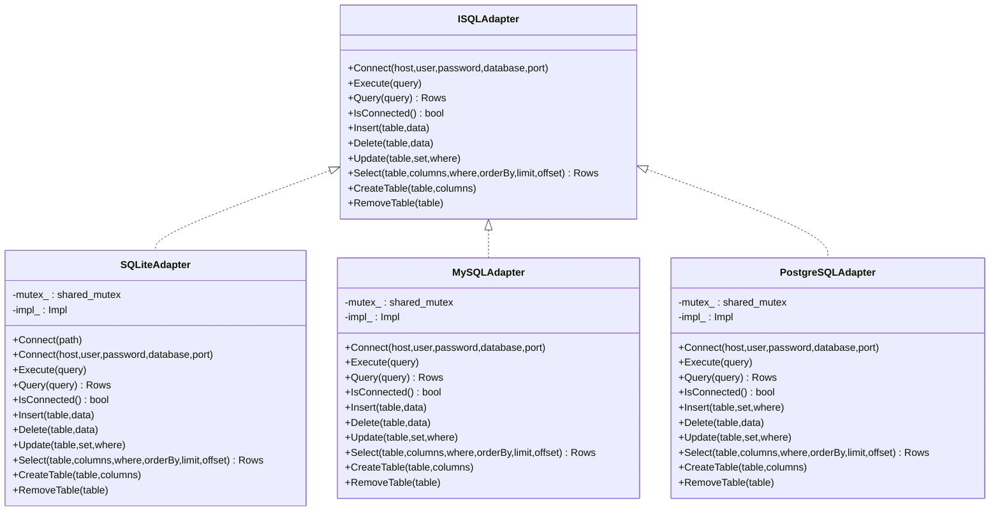
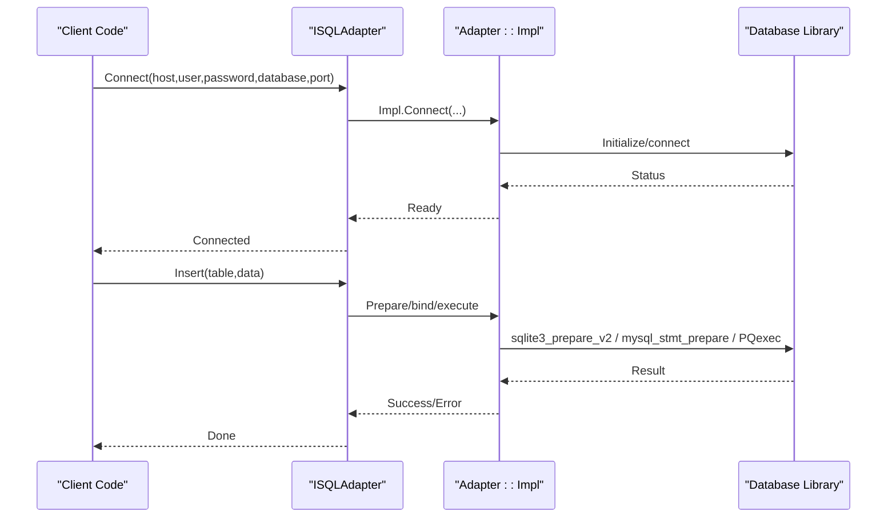
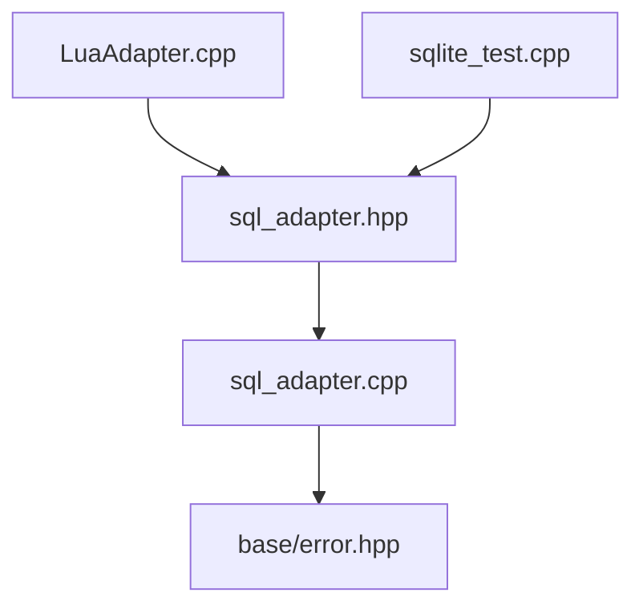

# Database Operations and Persistence

<cite>
**Referenced Files in This Document**
- [sql_adapter.hpp](file://fileoperator/sql_adapter.hpp)
- [sql_adapter.cpp](file://fileoperator/sql_adapter.cpp)
- [sqlite_test.cpp](file://tests/FilesOperator/sqlite_test.cpp)
- [LuaAdapter.cpp](file://fileoperator/LuaAdapter.cpp)
- [error.hpp](file://base/error.hpp)
- [CMakeLists.txt](file://CMakeLists.txt)
</cite>

## Table of Contents
1. [Introduction](#introduction)
2. [Project Structure](#project-structure)
3. [Core Components](#core-components)
4. [Architecture Overview](#architecture-overview)
5. [Detailed Component Analysis](#detailed-component-analysis)
6. [Dependency Analysis](#dependency-analysis)
7. [Performance Considerations](#performance-considerations)
8. [Troubleshooting Guide](#troubleshooting-guide)
9. [Conclusion](#conclusion)
10. [Appendices](#appendices)

## Introduction
This document explains the database access layer built around Sqlpp11-like patterns and implemented in C++. It focuses on the sql_adapter class design and its support for SQLite, MySQL, and PostgreSQL. The layer provides unified interfaces for connection management, transaction handling, and query execution, along with robust error handling and event-driven logging. Practical examples demonstrate creating tables, inserting records, and querying configuration or model metadata from the database. The document also covers type mapping between C++ types and SQL tables, prepared statement usage, thread safety, and error recovery strategies.

## Project Structure
The database access layer resides under fileoperator and integrates with Lua bindings for scripting environments. Tests exercise SQLite functionality and demonstrate usage patterns.

**Diagram sources**
- [sql_adapter.hpp](file://fileoperator/sql_adapter.hpp#L20-L205)
- [sql_adapter.cpp](file://fileoperator/sql_adapter.cpp#L1-L1705)
- [LuaAdapter.cpp](file://fileoperator/LuaAdapter.cpp#L484-L1138)
- [sqlite_test.cpp](file://tests/FilesOperator/sqlite_test.cpp#L1-L122)

**Section sources**
- [sql_adapter.hpp](file://fileoperator/sql_adapter.hpp#L20-L205)
- [sql_adapter.cpp](file://fileoperator/sql_adapter.cpp#L1-L1705)
- [sqlite_test.cpp](file://tests/FilesOperator/sqlite_test.cpp#L1-L122)
- [LuaAdapter.cpp](file://fileoperator/LuaAdapter.cpp#L484-L1138)

## Core Components
- ISQLAdapter: Defines the unified interface for database operations including connect, execute, query, CRUD operations, and table management.
- SQLiteAdapter: Implements SQLite connectivity and operations with prepared statements and type mapping.
- MySQLAdapter: Implements MySQL connectivity and operations with prepared statements and type mapping.
- PostgreSQLAdapter: Implements PostgreSQL connectivity and operations with prepared statements and type mapping.
- Event logging: Adapters raise events for connection and query execution, enabling external observers.

Key capabilities:
- Connection management: Connect with host/user/password/database/port or SQLite path.
- Transaction handling: Methods are provided for insert/update/delete/select; explicit transaction control is not exposed in the public API.
- Query execution: Supports raw SQL execution and structured operations via helper structs.
- Type mapping: Converts C++ std::any values to/from SQL types for prepared statements and result sets.
- Prepared statements: Used for insert/update/delete and select to prevent SQL injection and improve performance.
- Thread safety: Each adapter holds a shared_mutex protecting concurrent access to the underlying connection.

**Section sources**
- [sql_adapter.hpp](file://fileoperator/sql_adapter.hpp#L20-L205)
- [sql_adapter.cpp](file://fileoperator/sql_adapter.cpp#L1-L1705)

## Architecture Overview
The adapters implement a facade over native database libraries. They encapsulate connection state, prepare and execute statements, and map results to a generic row/column representation.

**Diagram sources**
- [sql_adapter.hpp](file://fileoperator/sql_adapter.hpp#L20-L205)
- [sql_adapter.cpp](file://fileoperator/sql_adapter.cpp#L1-L1705)

## Detailed Component Analysis

### ISQLAdapter Interface
Defines the contract for database operations:
- Connection: Connect(host,user,password,database,port) and IsConnected().
- Execution: Execute(query) and Query(query).
- CRUD: Insert/Delete/Update with table and data maps.
- Selection: Select(table, columns, where, orderBy, limit, offset).
- Schema: CreateTable(table, columns) and RemoveTable(table).

The interface uses std::any for flexible value passing and Rows as a vector of unordered_map<string, any> representing rows keyed by column names.

**Section sources**
- [sql_adapter.hpp](file://fileoperator/sql_adapter.hpp#L20-L49)

### SQLiteAdapter Implementation
- Connection: Supports connecting via path for SQLite and via host/user/password/database/port for compatibility with the interface. Internally uses sqlite3_open and sqlite3_close.
- Prepared statements: Uses sqlite3_prepare_v2 and sqlite3_step for all write operations and selects with bound parameters.
- Type mapping:
  - Integer: int64_t
  - Float: double
  - Text: string
  - Blob: vector<unsigned char>
  - Null: std::any{} placeholder
- Concurrency: Uses shared_mutex to serialize operations; RAII-style Impl manages connection lifecycle.
- Events: Raises events for connection and query execution.

Practical usage patterns:
- Creating a table: Use CreateTable(table, columns) where columns is a map of column_name -> SQL type string.
- Inserting records: Use Insert(table, data) where data maps column names to std::any values.
- Selecting records: Use Select(table, columns, where, orderBy, limit, offset) to build and execute parameterized queries.
- Deleting/Updating: Use Delete(table, where) and Update(table, set, where) with parameter maps.

**Section sources**
- [sql_adapter.cpp](file://fileoperator/sql_adapter.cpp#L1-L552)
- [sqlite_test.cpp](file://tests/FilesOperator/sqlite_test.cpp#L1-L122)

### MySQLAdapter Implementation
- Connection: Uses mysql_init and mysql_real_connect; manages connection state and closes on destruction.
- Prepared statements: Uses mysql_stmt_init, mysql_stmt_prepare, mysql_stmt_bind_param, and mysql_stmt_execute for insert/update/delete.
- Type mapping: Supports string, int64_t, double, vector<unsigned char> (BLOB), and null.
- Concurrency: Uses shared_mutex to serialize operations; RAII-style Impl manages connection lifecycle.
- Events: Raises events for connection and query execution.

Notes:
- The adapter compiles conditionally when USE_MYSQL is defined.
- The implementation uses boost::container::vector<bool> for is_null storage to avoid std::vector<bool> specialization pitfalls.

**Section sources**
- [sql_adapter.cpp](file://fileoperator/sql_adapter.cpp#L554-L1254)
- [CMakeLists.txt](file://CMakeLists.txt#L110-L111)

### PostgreSQLAdapter Implementation
- Connection: Uses PQsetdbLogin and checks PQstatus for connection readiness.
- Prepared statements: Uses PQexec for command execution and result processing for queries.
- Type mapping: Converts result fields to appropriate C++ types and stores them in std::any.
- Concurrency: Uses shared_mutex to serialize operations; RAII-style Impl manages connection lifecycle.
- Events: Raises events for connection and query execution.

Notes:
- The adapter compiles conditionally when USE_PGSQL is defined.
- The implementation includes helper logic to convert C++ values to PostgreSQL literal forms for dynamic WHERE clauses in Delete/Update.

**Section sources**
- [sql_adapter.cpp](file://fileoperator/sql_adapter.cpp#L1256-L1705)
- [CMakeLists.txt](file://CMakeLists.txt#L110-L111)

### Helper Structs and Fluent API
The adapter exposes helper structs and operators to compose queries in a fluent manner:
- SQLSelect: Holds table, columns, where conditions, order by, limit, and offset.
- SQLInsert: Holds table and data map.
- SQLDelete: Holds table and data map.
- SQLUpdate: Holds table, set map, and where map.
- SQLCreateTable: Holds table and columns map.
- SQLRemoveTable: Holds table name.

Operators:
- db | SQLSelect(...) returns Rows.
- db | SQLInsert(...) executes insertion.
- db | SQLDelete(...) executes deletion.
- db | SQLUpdate(...) executes update.
- db | SQLCreateTable(...) executes table creation.
- db | SQLRemoveTable(...) executes table removal.
- db | "SQL string" executes query and returns Rows.

These constructs simplify building parameterized queries and reduce boilerplate.

**Section sources**
- [sql_adapter.hpp](file://fileoperator/sql_adapter.hpp#L201-L334)

### Lua Bindings Integration
LuaAdapter.cpp registers C++ adapters for Lua consumption:
- SQLiteAdapter registration: Provides new, Connect, Execute, Query, Insert, Update, Delete, CreateTable, and __gc.
- MySQLAdapter registration: Similar methods when USE_MYSQL is enabled.
- PostgreSQLAdapter registration: Similar methods when USE_PGSQL is enabled.

This enables scripting environments to use the same adapter semantics from Lua scripts.

**Section sources**
- [LuaAdapter.cpp](file://fileoperator/LuaAdapter.cpp#L484-L1138)

## Architecture Overview

**Diagram sources**
- [sql_adapter.cpp](file://fileoperator/sql_adapter.cpp#L1-L1705)

## Detailed Component Analysis

### Type Mapping and Prepared Statements
- SQLiteAdapter:
  - Binds int64_t, double, string, vector<unsigned char>, and null to sqlite3_stmt.
  - Reads result types from sqlite3_column_type and converts to std::any.
- MySQLAdapter:
  - Binds string, int64_t, double, vector<unsigned char>, and null to MYSQL_BIND arrays.
  - Reads result fields and converts to std::any.
- PostgreSQLAdapter:
  - Executes PQexec and reads field types to populate std::any values.

Prepared statements are used for:
- Insert: INSERT INTO table (cols...) VALUES (? , ... )
- Update: UPDATE table SET col=? WHERE col2=?
- Delete: DELETE FROM table WHERE col=?
- Select: SELECT cols FROM table WHERE ... LIMIT ? OFFSET ?

This ensures parameterization and mitigates SQL injection risks.

**Section sources**
- [sql_adapter.cpp](file://fileoperator/sql_adapter.cpp#L151-L552)
- [sql_adapter.cpp](file://fileoperator/sql_adapter.cpp#L554-L1254)
- [sql_adapter.cpp](file://fileoperator/sql_adapter.cpp#L1256-L1705)

### Connection Management
- SQLiteAdapter: sqlite3_open/close; path-based connection.
- MySQLAdapter: mysql_init/mysql_real_connect/mysql_close; host/user/password/database/port-based.
- PostgreSQLAdapter: PQsetdbLogin/PQfinish; host/user/password/database/port-based.

All adapters guard against reconnection attempts while already connected and raise appropriate errors.

**Section sources**
- [sql_adapter.cpp](file://fileoperator/sql_adapter.cpp#L1-L552)
- [sql_adapter.cpp](file://fileoperator/sql_adapter.cpp#L554-L1254)
- [sql_adapter.cpp](file://fileoperator/sql_adapter.cpp#L1256-L1705)

### Transaction Handling
- The public API does not expose explicit transaction begin/commit/rollback methods.
- For atomicity, clients can group multiple operations within a single logical unit and rely on the underlying database’s transactional behavior. For example, batching inserts or wrapping multiple updates in a single operation can achieve desired isolation semantics.

[No sources needed since this section provides general guidance]

### Practical Examples

#### Creating Tables
- Use SQLCreateTable or CreateTable(table, columns) with a map of column_name -> SQL type string.
- Example paths:
  - [CreateTable (SQLite)](file://fileoperator/sql_adapter.cpp#L504-L552)
  - [CreateTable (MySQL)](file://fileoperator/sql_adapter.cpp#L1218-L1238)
  - [CreateTable (PostgreSQL)](file://fileoperator/sql_adapter.cpp#L1655-L1685)

#### Inserting Records
- Use SQLInsert or Insert(table, data) with a map of column_name -> std::any value.
- Example paths:
  - [Insert (SQLite)](file://fileoperator/sql_adapter.cpp#L166-L301)
  - [Insert (MySQL)](file://fileoperator/sql_adapter.cpp#L692-L791)
  - [Insert (PostgreSQL)](file://fileoperator/sql_adapter.cpp#L1435-L1476)

#### Querying Configuration or Model Metadata
- Use SQLSelect or Select(table, columns, where, orderBy, limit, offset) to retrieve rows.
- Example paths:
  - [Select (SQLite)](file://fileoperator/sql_adapter.cpp#L381-L502)
  - [Select (MySQL)](file://fileoperator/sql_adapter.cpp#L616-L658)
  - [Select (PostgreSQL)](file://fileoperator/sql_adapter.cpp#L1366-L1654)

#### Fluent API Usage
- Compose operations using helper structs and operators:
  - [Helper structs and operators](file://fileoperator/sql_adapter.hpp#L201-L334)
- Example usage in tests:
  - [SQLite adapter usage](file://tests/FilesOperator/sqlite_test.cpp#L25-L56)

**Section sources**
- [sql_adapter.hpp](file://fileoperator/sql_adapter.hpp#L201-L334)
- [sql_adapter.cpp](file://fileoperator/sql_adapter.cpp#L166-L552)
- [sqlite_test.cpp](file://tests/FilesOperator/sqlite_test.cpp#L25-L56)

### Thread Safety and Concurrency
- Each adapter instance holds a std::shared_mutex to serialize operations.
- Locking is applied at the adapter level for Connect, Execute, Query, and all CRUD operations.
- Shared mutex allows concurrent reads (via shared locks) while preventing concurrent writes or mixed operations.

Implications:
- Use separate adapter instances for independent concurrent tasks.
- Avoid sharing a single adapter instance across threads without external synchronization.

**Section sources**
- [sql_adapter.hpp](file://fileoperator/sql_adapter.hpp#L106-L205)
- [sql_adapter.cpp](file://fileoperator/sql_adapter.cpp#L120-L1705)

### Connection Pooling
- The adapters do not implement connection pooling.
- For pooling, consider integrating a third-party pool library or managing multiple adapter instances with a factory pattern.

[No sources needed since this section provides general guidance]

## Dependency Analysis

**Diagram sources**
- [sql_adapter.hpp](file://fileoperator/sql_adapter.hpp#L1-L205)
- [sql_adapter.cpp](file://fileoperator/sql_adapter.cpp#L1-L1705)
- [error.hpp](file://base/error.hpp#L1-L139)
- [LuaAdapter.cpp](file://fileoperator/LuaAdapter.cpp#L484-L1138)
- [sqlite_test.cpp](file://tests/FilesOperator/sqlite_test.cpp#L1-L122)

**Section sources**
- [sql_adapter.hpp](file://fileoperator/sql_adapter.hpp#L1-L205)
- [sql_adapter.cpp](file://fileoperator/sql_adapter.cpp#L1-L1705)
- [error.hpp](file://base/error.hpp#L1-L139)
- [LuaAdapter.cpp](file://fileoperator/LuaAdapter.cpp#L484-L1138)
- [sqlite_test.cpp](file://tests/FilesOperator/sqlite_test.cpp#L1-L122)

## Performance Considerations
- Prepared statements: All adapters use prepared statements for write operations and parameterized selects, reducing parsing overhead and improving throughput.
- Type conversion: Efficient mapping avoids unnecessary copies; SQLiteAdapter and MySQLAdapter use direct binding APIs.
- Result processing: SQLiteAdapter and MySQLAdapter iterate rows and map types in a single pass; PostgreSQLAdapter uses PQresult APIs.
- Concurrency: shared_mutex serialization prevents contention; consider splitting workload across multiple adapter instances for high concurrency.

[No sources needed since this section provides general guidance]

## Troubleshooting Guide

Common issues and resolutions:
- Not connected to the database:
  - Symptom: Exceptions indicating not connected.
  - Resolution: Ensure Connect() is called before Execute()/Query()/CRUD operations.
  - References:
    - [SQLiteAdapter::Execute/Query/Insert/Update/Delete/Select](file://fileoperator/sql_adapter.cpp#L151-L502)
    - [MySQLAdapter::Execute/Query/Insert/Update/Delete/Select](file://fileoperator/sql_adapter.cpp#L587-L1254)
    - [PostgreSQLAdapter::Execute/Query/Insert/Update/Delete/Select](file://fileoperator/sql_adapter.cpp#L1285-L1705)

- Connection errors:
  - Symptom: Connection failures during Connect().
  - Resolution: Verify host, user, password, database, and port; ensure the database service is reachable.
  - References:
    - [SQLiteAdapter::Connect](file://fileoperator/sql_adapter.cpp#L124-L149)
    - [MySQLAdapter::Connect](file://fileoperator/sql_adapter.cpp#L570-L586)
    - [PostgreSQLAdapter::Connect](file://fileoperator/sql_adapter.cpp#L1273-L1284)

- Query execution errors:
  - Symptom: Exceptions thrown from Execute()/Query() with error messages.
  - Resolution: Inspect SQL syntax and parameter types; ensure table/column names exist.
  - References:
    - [SQLiteAdapter::Execute/Query](file://fileoperator/sql_adapter.cpp#L50-L118)
    - [MySQLAdapter::Execute/Query](file://fileoperator/sql_adapter.cpp#L587-L658)
    - [PostgreSQLAdapter::Execute/Query](file://fileoperator/sql_adapter.cpp#L1285-L1313)

- Locked files (SQLite):
  - Symptom: Cannot delete database file after closing Lua state.
  - Resolution: Ensure the adapter is destroyed and the database connection is closed before attempting to remove the file. The test demonstrates a retry loop to handle file locking.
  - References:
    - [SQLite file locking test](file://tests/FilesOperator/sqlite_test.cpp#L65-L119)

- Schema mismatches:
  - Symptom: Errors when inserting/updating with mismatched types or missing columns.
  - Resolution: Verify CreateTable definitions and column types match Insert/Update data maps.
  - References:
    - [CreateTable (SQLite)](file://fileoperator/sql_adapter.cpp#L504-L552)
    - [CreateTable (MySQL)](file://fileoperator/sql_adapter.cpp#L1218-L1238)
    - [CreateTable (PostgreSQL)](file://fileoperator/sql_adapter.cpp#L1655-L1685)

- Network timeouts (remote databases):
  - Symptom: Connection/query failures for MySQL/PostgreSQL.
  - Resolution: Increase timeout settings on the server, adjust client-side timeouts, and verify firewall/network policies.
  - References:
    - [MySQLAdapter::Connect](file://fileoperator/sql_adapter.cpp#L570-L586)
    - [PostgreSQLAdapter::Connect](file://fileoperator/sql_adapter.cpp#L1273-L1284)

- Permission denied:
  - Symptom: Access denied errors during Connect/Query/CRUD.
  - Resolution: Verify credentials and privileges for the target database and user.
  - References:
    - [MySQLAdapter::Connect](file://fileoperator/sql_adapter.cpp#L579-L584)
    - [PostgreSQLAdapter::Connect](file://fileoperator/sql_adapter.cpp#L1276-L1281)

**Section sources**
- [sql_adapter.cpp](file://fileoperator/sql_adapter.cpp#L50-L1705)
- [sqlite_test.cpp](file://tests/FilesOperator/sqlite_test.cpp#L65-L119)

## Conclusion
The database access layer provides a clean, unified abstraction over SQLite, MySQL, and PostgreSQL with strong emphasis on prepared statements, type safety, and thread-safe operations. The fluent API simplifies common database tasks, while the event mechanism offers observability. For production deployments, consider adding explicit transaction control, connection pooling, and robust retry/backoff strategies for remote databases.

[No sources needed since this section summarizes without analyzing specific files]

## Appendices

### Build-time Feature Flags
- USE_MYSQL: Enables MySQLAdapter and Lua bindings for MySQL.
- USE_PGSQL: Enables PostgreSQLAdapter and Lua bindings for PostgreSQL.

These flags are defined in the build configuration.

**Section sources**
- [CMakeLists.txt](file://CMakeLists.txt#L110-L111)
- [LuaAdapter.cpp](file://fileoperator/LuaAdapter.cpp#L484-L1138)
- [sql_adapter.cpp](file://fileoperator/sql_adapter.cpp#L1-L1705)