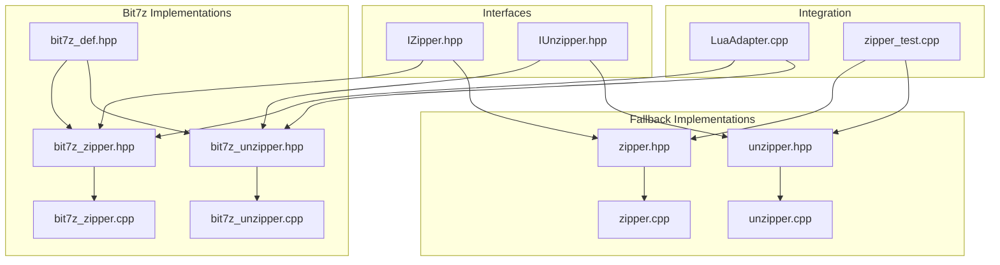
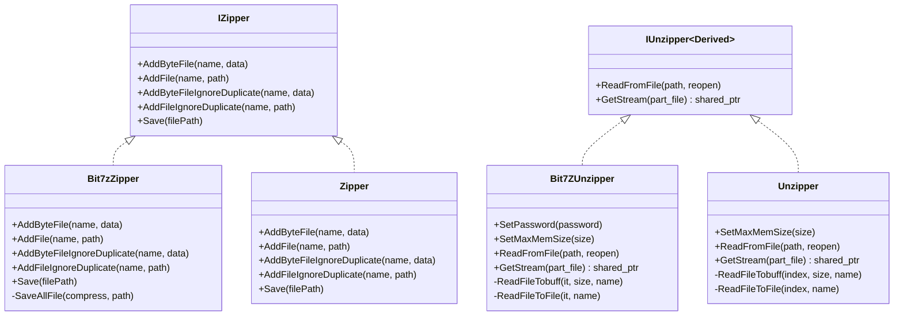
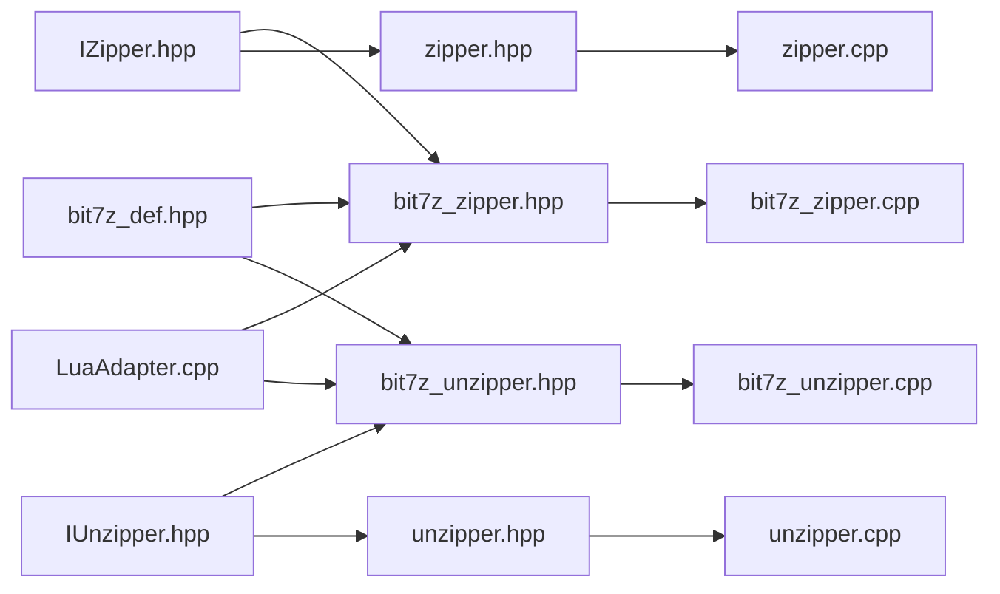

# File Compression and Archiving

<cite>
**Referenced Files in This Document**
- [IZipper.hpp](file://fileoperator/IZipper.hpp)
- [IUnzipper.hpp](file://fileoperator/IUnzipper.hpp)
- [bit7z_zipper.hpp](file://fileoperator/bit7z_zipper.hpp)
- [bit7z_zipper.cpp](file://fileoperator/bit7z_zipper.cpp)
- [bit7z_unzipper.hpp](file://fileoperator/bit7z_unzipper.hpp)
- [bit7z_unzipper.cpp](file://fileoperator/bit7z_unzipper.cpp)
- [bit7z_def.hpp](file://fileoperator/bit7z_def.hpp)
- [zipper.hpp](file://fileoperator/zipper.hpp)
- [zipper.cpp](file://fileoperator/zipper.cpp)
- [unzipper.hpp](file://fileoperator/unzipper.hpp)
- [unzipper.cpp](file://fileoperator/unzipper.cpp)
- [LuaAdapter.cpp](file://fileoperator/LuaAdapter.cpp)
- [zipper_test.cpp](file://tests/FilesOperator/zipper_test.cpp)
</cite>

## Table of Contents
1. [Introduction](#introduction)
2. [Project Structure](#project-structure)
3. [Core Components](#core-components)
4. [Architecture Overview](#architecture-overview)
5. [Detailed Component Analysis](#detailed-component-analysis)
6. [Dependency Analysis](#dependency-analysis)
7. [Performance Considerations](#performance-considerations)
8. [Troubleshooting Guide](#troubleshooting-guide)
9. [Conclusion](#conclusion)
10. [Appendices](#appendices)

## Introduction
This document explains the file compression and archiving subsystem built around the bit7z library. It focuses on the unified interfaces IZipper and IUnzipper and their implementations Bit7zZipper and Bit7ZUnzipper. It documents how to create ZIP archives from in-memory data or files, handle duplicates, and save archives. It also covers extraction workflows, error handling, memory management, cross-platform compatibility, and the use of Curiously Recurring Template Pattern (CRTP) in IUnzipper for static polymorphism. Finally, it highlights performance implications of different compression settings and file types.

## Project Structure
The compression subsystem resides under fileoperator and includes:
- Unified interfaces: IZipper.hpp, IUnzipper.hpp
- Bit7z implementations: bit7z_zipper.{hpp,cpp}, bit7z_unzipper.{hpp,cpp}
- Fallback implementations using miniz: zipper.{hpp,cpp}, unzipper.{hpp,cpp}
- Platform-specific DLL paths: bit7z_def.hpp
- Lua integration: LuaAdapter.cpp
- Tests: tests/FilesOperator/zipper_test.cpp

**Diagram sources**
- [IZipper.hpp](file://fileoperator/IZipper.hpp#L1-L27)
- [IUnzipper.hpp](file://fileoperator/IUnzipper.hpp#L1-L134)
- [bit7z_zipper.hpp](file://fileoperator/bit7z_zipper.hpp#L1-L74)
- [bit7z_zipper.cpp](file://fileoperator/bit7z_zipper.cpp#L1-L187)
- [bit7z_unzipper.hpp](file://fileoperator/bit7z_unzipper.hpp#L1-L72)
- [bit7z_unzipper.cpp](file://fileoperator/bit7z_unzipper.cpp#L1-L132)
- [bit7z_def.hpp](file://fileoperator/bit7z_def.hpp#L1-L31)
- [zipper.hpp](file://fileoperator/zipper.hpp#L1-L65)
- [zipper.cpp](file://fileoperator/zipper.cpp#L1-L219)
- [unzipper.hpp](file://fileoperator/unzipper.hpp#L1-L53)
- [unzipper.cpp](file://fileoperator/unzipper.cpp#L1-L146)
- [LuaAdapter.cpp](file://fileoperator/LuaAdapter.cpp#L140-L237)
- [zipper_test.cpp](file://tests/FilesOperator/zipper_test.cpp#L1-L143)

**Section sources**
- [IZipper.hpp](file://fileoperator/IZipper.hpp#L1-L27)
- [IUnzipper.hpp](file://fileoperator/IUnzipper.hpp#L1-L134)
- [bit7z_zipper.hpp](file://fileoperator/bit7z_zipper.hpp#L1-L74)
- [bit7z_zipper.cpp](file://fileoperator/bit7z_zipper.cpp#L1-L187)
- [bit7z_unzipper.hpp](file://fileoperator/bit7z_unzipper.hpp#L1-L72)
- [bit7z_unzipper.cpp](file://fileoperator/bit7z_unzipper.cpp#L1-L132)
- [bit7z_def.hpp](file://fileoperator/bit7z_def.hpp#L1-L31)
- [zipper.hpp](file://fileoperator/zipper.hpp#L1-L65)
- [zipper.cpp](file://fileoperator/zipper.cpp#L1-L219)
- [unzipper.hpp](file://fileoperator/unzipper.hpp#L1-L53)
- [unzipper.cpp](file://fileoperator/unzipper.cpp#L1-L146)
- [LuaAdapter.cpp](file://fileoperator/LuaAdapter.cpp#L140-L237)
- [zipper_test.cpp](file://tests/FilesOperator/zipper_test.cpp#L1-L143)

## Core Components
- IZipper: Pure virtual interface defining archive creation operations:
  - AddByteFile(name, data)
  - AddFile(name, path)
  - AddByteFileIgnoreDuplicate(name, data)
  - AddFileIgnoreDuplicate(name, path)
  - Save(filePath)
- IUnzipper: CRTP base for extraction with:
  - ReadFromFile(path, reopen)
  - GetStream(part_file) returning a stream abstraction
- Bit7zZipper: Implements IZipper using bit7z for multiple formats and passwords.
- Bit7ZUnzipper: Implements IUnzipper using bit7z with memory and file caching strategies.
- Fallback implementations (miniz): Zipper and Unzipper for ZIP archives without external dependencies.

Key responsibilities:
- Unified API surface for archive operations
- Cross-platform DLL resolution for bit7z
- Duplicate handling and naming strategies
- Memory vs file caching for extraction
- Event-driven progress reporting

**Section sources**
- [IZipper.hpp](file://fileoperator/IZipper.hpp#L1-L27)
- [IUnzipper.hpp](file://fileoperator/IUnzipper.hpp#L111-L131)
- [bit7z_zipper.hpp](file://fileoperator/bit7z_zipper.hpp#L28-L71)
- [bit7z_unzipper.hpp](file://fileoperator/bit7z_unzipper.hpp#L18-L69)
- [zipper.hpp](file://fileoperator/zipper.hpp#L18-L65)
- [unzipper.hpp](file://fileoperator/unzipper.hpp#L13-L53)

## Architecture Overview
The subsystem provides two parallel paths:
- Bit7z path: Uses bit7z library for a wide variety of formats and advanced features (passwords, streaming).
- Fallback path: Uses miniz for ZIP archives only, suitable when bit7z is disabled or unavailable.

Both paths implement the same interfaces, enabling seamless switching and testing.

**Diagram sources**
- [IZipper.hpp](file://fileoperator/IZipper.hpp#L1-L27)
- [IUnzipper.hpp](file://fileoperator/IUnzipper.hpp#L111-L131)
- [bit7z_zipper.hpp](file://fileoperator/bit7z_zipper.hpp#L28-L71)
- [bit7z_unzipper.hpp](file://fileoperator/bit7z_unzipper.hpp#L18-L69)
- [zipper.hpp](file://fileoperator/zipper.hpp#L18-L65)
- [unzipper.hpp](file://fileoperator/unzipper.hpp#L13-L53)

## Detailed Component Analysis

### IZipper and IUnzipper Interfaces
- IZipper defines the contract for creating archives, including:
  - Adding entries from memory or disk
  - Handling duplicates with explicit ignore methods
  - Saving the archive to a file path
- IUnzipper uses CRTP to defer implementation to derived classes while exposing a uniform extraction API:
  - ReadFromFile(path, reopen) opens an archive
  - GetStream(part_file) returns a stream abstraction for lazy reading

CRTP benefits:
- Static polymorphism avoids virtual dispatch overhead
- Compile-time binding ensures derived class methods are called directly
- Enables shared event signaling and common behaviors in the base

**Section sources**
- [IZipper.hpp](file://fileoperator/IZipper.hpp#L1-L27)
- [IUnzipper.hpp](file://fileoperator/IUnzipper.hpp#L111-L131)

### Bit7zZipper Implementation
Responsibilities:
- Maintains a collection of entries (either file paths or in-memory bytes) keyed by logical names
- Supports multiple archive formats via ZipperFormat enumeration
- Handles duplicates by throwing on Add* methods and appending a suffix for ignore-duplicate variants
- Compresses and writes the archive using bit7z::BitArchiveWriter
- Emits progress events during compression

Key methods and behaviors:
- AddByteFile(name, data) and AddFile(name, path): insert entries; throw on duplicates
- AddByteFileIgnoreDuplicate/AddFileIgnoreDuplicate: append a suffix to avoid collisions
- Save(filePath): select format, configure writer, iterate entries, emit progress, and finalize
- SaveAllFile: central loop that adds either file paths or in-memory bytes, then compresses to target

Error handling:
- Throws InvalidArgumentError for duplicate names
- Throws NotSupportedError for unsupported formats
- Wraps bit7z exceptions into IOError with contextual messages

Memory management:
- Stores entries in a variant map to avoid copying data unnecessarily
- Uses bit7z::byte_t vectors for binary data

Cross-platform:
- DLL path resolution via bit7z_def.hpp constants

**Section sources**
- [bit7z_zipper.hpp](file://fileoperator/bit7z_zipper.hpp#L28-L71)
- [bit7z_zipper.cpp](file://fileoperator/bit7z_zipper.cpp#L41-L184)
- [bit7z_def.hpp](file://fileoperator/bit7z_def.hpp#L1-L31)

### Bit7ZUnzipper Implementation
Responsibilities:
- Opens archives via bit7z::BitArchiveReader
- Provides streams for individual parts using UnzipperStream
- Implements memory vs file caching based on uncompressed size thresholds
- Supports setting passwords and controlling memory limits

Key methods and behaviors:
- ReadFromFileImpl(path, reopen): initializes reader, clears caches, manages reopen semantics
- GetStream(part_file): raises events, checks cache, locates entry, and returns a stream
- ReadFileTobuff: reads small entries into memory buffers
- ReadFileToFile: reads larger entries to temporary files and returns a file-backed stream
- CreateBuffDir: creates a temporary directory for cached files

Memory management:
- Memory cache stores either buffer or file path for each entry
- Temporary directories are cleaned up in destructor and when reopening
- Max memory size threshold controls switching between memory and file caching

Error handling:
- Throws IOError when archive is not opened or entry is missing
- Propagates bit7z errors as IO-related exceptions

CRTP usage:
- Inherits from IUnzipper<Bit7ZUnzipper>, enabling ReadFromFile and GetStream to call derived implementations indirectly

**Section sources**
- [bit7z_unzipper.hpp](file://fileoperator/bit7z_unzipper.hpp#L18-L69)
- [bit7z_unzipper.cpp](file://fileoperator/bit7z_unzipper.cpp#L1-L132)

### Fallback Implementations (miniz)
When USE_BIT7Z is not defined, the system falls back to miniz-based implementations:
- Zipper: Adds entries from memory or disk, supports compression levels, and writes ZIP archives
- Unzipper: Reads ZIP archives, supports memory/file caching, and exposes streams

These implementations mirror the bit7z counterparts and are useful for environments without bit7z.

**Section sources**
- [zipper.hpp](file://fileoperator/zipper.hpp#L18-L65)
- [zipper.cpp](file://fileoperator/zipper.cpp#L1-L219)
- [unzipper.hpp](file://fileoperator/unzipper.hpp#L13-L53)
- [unzipper.cpp](file://fileoperator/unzipper.cpp#L1-L146)

### Cross-Platform Compatibility
- DLL path constants are provided per platform for 7-Zip libraries
- Path normalization and encoding conversion helpers are used to ensure robust file operations
- Temporary directories are used for caching large entries when memory threshold is exceeded

**Section sources**
- [bit7z_def.hpp](file://fileoperator/bit7z_def.hpp#L1-L31)
- [bit7z_zipper.cpp](file://fileoperator/bit7z_zipper.cpp#L103-L157)
- [bit7z_unzipper.cpp](file://fileoperator/bit7z_unzipper.cpp#L47-L64)

### Lua Integration
The subsystem integrates with Lua for scripting:
- Bit7zZipper constructor accepts format string and optional DLL path/password
- Methods AddFile, AddByteFile, and Save are exposed to Lua
- LuaAdapter validates arguments, constructs objects, and forwards calls

This enables dynamic creation of ZIP archives with both byte data and file paths from scripts.

**Section sources**
- [LuaAdapter.cpp](file://fileoperator/LuaAdapter.cpp#L140-L237)

### Example Workflows

#### Creating ZIP Archives with Byte Data and File Paths
- Using Bit7zZipper:
  - Construct with desired format and optional password/DLL path
  - Call AddByteFile(name, data) for in-memory content
  - Call AddFile(name, path) for files on disk
  - Call Save(filePath) to write the archive
- Using Zipper (fallback):
  - Construct with compression level
  - Add entries similarly and Save

References:
- [bit7z_zipper.cpp](file://fileoperator/bit7z_zipper.cpp#L103-L184)
- [zipper.cpp](file://fileoperator/zipper.cpp#L76-L122)

#### Extraction Workflows
- Open archive via ReadFromFile(path)
- Retrieve a stream for a specific part via GetStream(part_file)
- Read from the stream; it will automatically cache small entries in memory or large ones to temporary files
- Optionally adjust SetMaxMemSize to control caching behavior

References:
- [bit7z_unzipper.cpp](file://fileoperator/bit7z_unzipper.cpp#L22-L98)
- [unzipper.cpp](file://fileoperator/unzipper.cpp#L25-L89)

## Dependency Analysis
- Bit7z implementations depend on bit7z library headers and bit7z_def.hpp for DLL paths
- Both Bit7zZipper and Bit7ZUnzipper inherit from IZipper and IUnzipper respectively
- Fallback implementations (Zipper, Unzipper) provide identical interfaces for ZIP archives
- LuaAdapter binds Bit7zZipper and Bit7ZUnzipper to Lua functions

**Diagram sources**
- [bit7z_def.hpp](file://fileoperator/bit7z_def.hpp#L1-L31)
- [bit7z_zipper.hpp](file://fileoperator/bit7z_zipper.hpp#L1-L74)
- [bit7z_unzipper.hpp](file://fileoperator/bit7z_unzipper.hpp#L1-L72)
- [zipper.hpp](file://fileoperator/zipper.hpp#L1-L65)
- [unzipper.hpp](file://fileoperator/unzipper.hpp#L1-L53)
- [bit7z_zipper.cpp](file://fileoperator/bit7z_zipper.cpp#L1-L187)
- [bit7z_unzipper.cpp](file://fileoperator/bit7z_unzipper.cpp#L1-L132)
- [zipper.cpp](file://fileoperator/zipper.cpp#L1-L219)
- [unzipper.cpp](file://fileoperator/unzipper.cpp#L1-L146)
- [LuaAdapter.cpp](file://fileoperator/LuaAdapter.cpp#L140-L237)

**Section sources**
- [bit7z_zipper.hpp](file://fileoperator/bit7z_zipper.hpp#L1-L74)
- [bit7z_unzipper.hpp](file://fileoperator/bit7z_unzipper.hpp#L1-L72)
- [zipper.hpp](file://fileoperator/zipper.hpp#L1-L65)
- [unzipper.hpp](file://fileoperator/unzipper.hpp#L1-L53)
- [LuaAdapter.cpp](file://fileoperator/LuaAdapter.cpp#L140-L237)

## Performance Considerations
- Compression formats and levels:
  - Bit7zZipper supports multiple formats (ZIP, 7-Zip, XZ, BZIP2, GZIP, TAR) and can set overwrite mode and password
  - Zipper supports miniz compression levels (no compression, fast, tight) affecting CPU and archive size trade-offs
- Memory vs file caching:
  - Bit7ZUnzipper and Unzipper switch between memory buffers and temporary files based on uncompressed size thresholds
  - Adjust SetMaxMemSize to balance memory usage and I/O throughput
- Progress reporting:
  - Bit7zZipper emits progress events during compression
  - Both Bit7ZUnzipper and Unzipper raise events on stream access
- File system operations:
  - Path normalization and encoding conversions add minimal overhead but improve reliability across platforms

[No sources needed since this section provides general guidance]

## Troubleshooting Guide
Common issues and resolutions:
- Duplicate entry names:
  - Use AddByteFileIgnoreDuplicate/AddFileIgnoreDuplicate to append a suffix and avoid exceptions
- Unsupported archive format:
  - Ensure the selected format is supported; otherwise NotSupportedError is thrown
- Archive not opened:
  - Call ReadFromFile(path) before GetStream(part_file); otherwise IOError is raised
- Entry not found:
  - Verify the part_file name; IOError is thrown if the entry does not exist
- Large entries exceeding memory limit:
  - Increase SetMaxMemSize or rely on automatic file caching; Bit7ZUnzipper and Unzipper manage temporary directories accordingly
- Bit7z DLL path issues:
  - Confirm platform-specific DLL paths; bit7z_def.hpp provides defaults per OS

**Section sources**
- [bit7z_zipper.cpp](file://fileoperator/bit7z_zipper.cpp#L41-L184)
- [bit7z_unzipper.cpp](file://fileoperator/bit7z_unzipper.cpp#L22-L98)
- [zipper.cpp](file://fileoperator/zipper.cpp#L33-L122)
- [unzipper.cpp](file://fileoperator/unzipper.cpp#L25-L89)
- [bit7z_def.hpp](file://fileoperator/bit7z_def.hpp#L1-L31)

## Conclusion
The compression subsystem offers a unified, cross-platform API for creating and extracting archives. Bit7zZipper and Bit7ZUnzipper provide robust support for multiple formats and advanced features, while fallback implementations ensure ZIP functionality remains available. CRTP in IUnzipper enables efficient, compile-time polymorphism. Proper error handling, memory management, and configurable caching deliver reliable performance across diverse scenarios.

[No sources needed since this section summarizes without analyzing specific files]

## Appendices

### API Reference Summary
- IZipper
  - AddByteFile(name, data)
  - AddFile(name, path)
  - AddByteFileIgnoreDuplicate(name, data)
  - AddFileIgnoreDuplicate(name, path)
  - Save(filePath)
- IUnzipper
  - ReadFromFile(path, reopen)
  - GetStream(part_file) -> UnzipperStream
- Bit7zZipper
  - Constructors with format and password/DLL path
  - AddByteFile/AddFile and ignore-duplicate variants
  - Save(filePath)
- Bit7ZUnzipper
  - SetPassword(password)
  - SetMaxMemSize(size)
  - ReadFromFile(path, reopen)
  - GetStream(part_file)
- Zipper (fallback)
  - Constructor with compression level
  - AddByteFile/AddFile and ignore-duplicate variants
  - Save(filePath)
- Unzipper (fallback)
  - SetMaxMemSize(size)
  - ReadFromFile(path, reopen)
  - GetStream(part_file)

**Section sources**
- [IZipper.hpp](file://fileoperator/IZipper.hpp#L1-L27)
- [IUnzipper.hpp](file://fileoperator/IUnzipper.hpp#L111-L131)
- [bit7z_zipper.hpp](file://fileoperator/bit7z_zipper.hpp#L28-L71)
- [bit7z_unzipper.hpp](file://fileoperator/bit7z_unzipper.hpp#L18-L69)
- [zipper.hpp](file://fileoperator/zipper.hpp#L18-L65)
- [unzipper.hpp](file://fileoperator/unzipper.hpp#L13-L53)

### Example Usage References
- Creating ZIP archives with byte data and file paths:
  - [bit7z_zipper.cpp](file://fileoperator/bit7z_zipper.cpp#L103-L184)
  - [zipper.cpp](file://fileoperator/zipper.cpp#L76-L122)
- Extraction workflows:
  - [bit7z_unzipper.cpp](file://fileoperator/bit7z_unzipper.cpp#L22-L98)
  - [unzipper.cpp](file://fileoperator/unzipper.cpp#L25-L89)
- Lua integration:
  - [LuaAdapter.cpp](file://fileoperator/LuaAdapter.cpp#L140-L237)
- Test coverage:
  - [zipper_test.cpp](file://tests/FilesOperator/zipper_test.cpp#L1-L143)