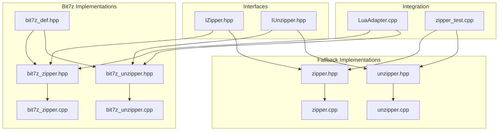
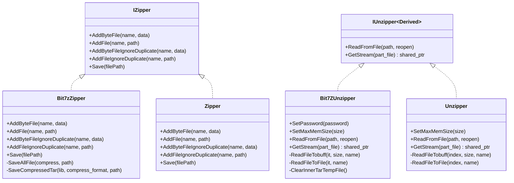
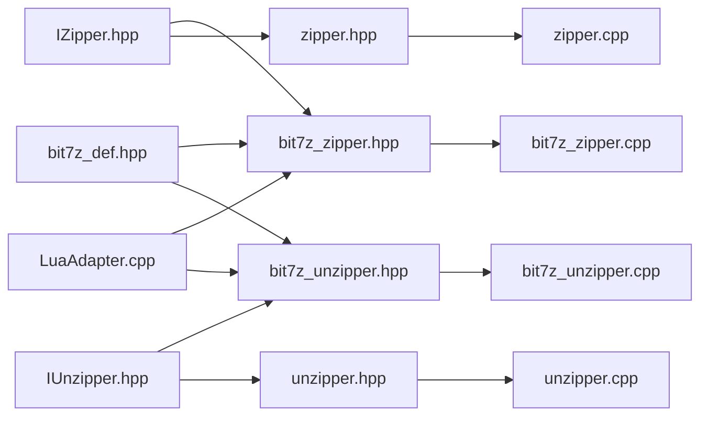

# File Compression and Archiving

<cite>
**Referenced Files in This Document**
- [IZipper.hpp](file://fileoperator/IZipper.hpp)
- [IUnzipper.hpp](file://fileoperator/IUnzipper.hpp)
- [bit7z_zipper.hpp](file://fileoperator/bit7z_zipper.hpp)
- [bit7z_zipper.cpp](file://fileoperator/bit7z_zipper.cpp)
- [bit7z_unzipper.hpp](file://fileoperator/bit7z_unzipper.hpp)
- [bit7z_unzipper.cpp](file://fileoperator/bit7z_unzipper.cpp)
- [bit7z_def.hpp](file://fileoperator/bit7z_def.hpp)
- [zipper.hpp](file://fileoperator/zipper.hpp)
- [zipper.cpp](file://fileoperator/zipper.cpp)
- [unzipper.hpp](file://fileoperator/unzipper.hpp)
- [unzipper.cpp](file://fileoperator/unzipper.cpp)
- [LuaAdapter.cpp](file://fileoperator/LuaAdapter.cpp)
- [zipper_test.cpp](file://tests/FilesOperator/zipper_test.cpp)
</cite>

## Update Summary
**Changes Made**
- Added comprehensive documentation for new tar.gz and tar.xz format support
- Updated Bit7zZipper implementation details with two-stage compression workflow
- Enhanced Bit7ZUnzipper documentation with transparent compressed tar handling
- Added detailed coverage of temporary file management improvements
- Updated API reference to include TarGz and TarXz formats
- Enhanced troubleshooting section with compressed tar-specific guidance

## Table of Contents
1. [Introduction](#introduction)
2. [Project Structure](#project-structure)
3. [Core Components](#core-components)
4. [Architecture Overview](#architecture-overview)
5. [Detailed Component Analysis](#detailed-component-analysis)
6. [Dependency Analysis](#dependency-analysis)
7. [Performance Considerations](#performance-considerations)
8. [Troubleshooting Guide](#troubleshooting-guide)
9. [Conclusion](#conclusion)
10. [Appendices](#appendices)

## Introduction
This document explains the file compression and archiving subsystem built around the bit7z library. It focuses on the unified interfaces IZipper and IUnzipper and their implementations Bit7zZipper and Bit7ZUnzipper. The system now provides comprehensive support for multiple archive formats including the new tar.gz and tar.xz formats, which are handled through a two-stage compression process. It documents how to create archives from in-memory data or files, handle duplicates, save archives, and extract content with automatic temporary file management. The subsystem also covers extraction workflows, error handling, memory management, cross-platform compatibility, and the use of Curiously Recurring Template Pattern (CRTP) in IUnzipper for static polymorphism. Finally, it highlights performance implications of different compression settings and file types, with special attention to the optimized handling of compressed tar archives.

## Project Structure
The compression subsystem resides under fileoperator and includes:
- Unified interfaces: IZipper.hpp, IUnzipper.hpp
- Bit7z implementations: bit7z_zipper.{hpp,cpp}, bit7z_unzipper.{hpp,cpp}
- Fallback implementations using miniz: zipper.{hpp,cpp}, unzipper.{hpp,cpp}
- Platform-specific DLL paths and compressed tar utilities: bit7z_def.hpp
- Lua integration: LuaAdapter.cpp
- Tests: tests/FilesOperator/zipper_test.cpp

```mermaid
graph TB
subgraph "Interfaces"
IZipper["IZipper.hpp"]
IUnzipper["IUnzipper.hpp"]
end
subgraph "Bit7z Implementations"
BZipperH["bit7z_zipper.hpp"]
BZipperC["bit7z_zipper.cpp"]
BUnzipperH["bit7z_unzipper.hpp"]
BUnzipperC["bit7z_unzipper.cpp"]
Def["bit7z_def.hpp"]
end
subgraph "Fallback Implementations"
ZipperH["zipper.hpp"]
ZipperC["zipper.cpp"]
UnzipperH["unzipper.hpp"]
UnzipperC["unzipper.cpp"]
end
subgraph "Integration"
Lua["LuaAdapter.cpp"]
Test["zipper_test.cpp"]
end
IZipper --> BZipperH
IZipper --> ZipperH
IUnzipper --> BUnzipperH
IUnzipper --> UnzipperH
BZipperH --> BZipperC
BUnzipperH --> BUnzipperC
Def --> BZipperH
Def --> BUnzipperH
ZipperH --> ZipperC
UnzipperH --> UnzipperC
Lua --> BZipperH
Lua --> BUnzipperH
Test --> ZipperH
Test --> UnzipperH
```

**Diagram sources**
- [IZipper.hpp:1-27](file://fileoperator/IZipper.hpp#L1-L27)
- [IUnzipper.hpp:1-134](file://fileoperator/IUnzipper.hpp#L1-L134)
- [bit7z_zipper.hpp:1-74](file://fileoperator/bit7z_zipper.hpp#L1-L74)
- [bit7z_zipper.cpp:1-303](file://fileoperator/bit7z_zipper.cpp#L1-L303)
- [bit7z_unzipper.hpp:1-72](file://fileoperator/bit7z_unzipper.hpp#L1-L72)
- [bit7z_unzipper.cpp:1-240](file://fileoperator/bit7z_unzipper.cpp#L1-L240)
- [bit7z_def.hpp:1-76](file://fileoperator/bit7z_def.hpp#L1-L76)
- [zipper.hpp:1-65](file://fileoperator/zipper.hpp#L1-L65)
- [zipper.cpp:1-219](file://fileoperator/zipper.cpp#L1-L219)
- [unzipper.hpp:1-53](file://fileoperator/unzipper.hpp#L1-L53)
- [unzipper.cpp:1-146](file://fileoperator/unzipper.cpp#L1-L146)
- [LuaAdapter.cpp:140-237](file://fileoperator/LuaAdapter.cpp#L140-L237)
- [zipper_test.cpp:1-229](file://tests/FilesOperator/zipper_test.cpp#L1-L229)

**Section sources**
- [IZipper.hpp:1-27](file://fileoperator/IZipper.hpp#L1-L27)
- [IUnzipper.hpp:1-134](file://fileoperator/IUnzipper.hpp#L1-L134)
- [bit7z_zipper.hpp:1-74](file://fileoperator/bit7z_zipper.hpp#L1-L74)
- [bit7z_zipper.cpp:1-303](file://fileoperator/bit7z_zipper.cpp#L1-L303)
- [bit7z_unzipper.hpp:1-72](file://fileoperator/bit7z_unzipper.hpp#L1-L72)
- [bit7z_unzipper.cpp:1-240](file://fileoperator/bit7z_unzipper.cpp#L1-L240)
- [bit7z_def.hpp:1-76](file://fileoperator/bit7z_def.hpp#L1-L76)
- [zipper.hpp:1-65](file://fileoperator/zipper.hpp#L1-L65)
- [zipper.cpp:1-219](file://fileoperator/zipper.cpp#L1-L219)
- [unzipper.hpp:1-53](file://fileoperator/unzipper.hpp#L1-L53)
- [unzipper.cpp:1-146](file://fileoperator/unzipper.cpp#L1-L146)
- [LuaAdapter.cpp:140-237](file://fileoperator/LuaAdapter.cpp#L140-L237)
- [zipper_test.cpp:1-229](file://tests/FilesOperator/zipper_test.cpp#L1-L229)

## Core Components
- IZipper: Pure virtual interface defining archive creation operations:
  - AddByteFile(name, data)
  - AddFile(name, path)
  - AddByteFileIgnoreDuplicate(name, data)
  - AddFileIgnoreDuplicate(name, path)
  - Save(filePath)
- IUnzipper: CRTP base for extraction with:
  - ReadFromFile(path, reopen)
  - GetStream(part_file) returning a stream abstraction
- Bit7zZipper: Implements IZipper using bit7z for multiple formats including new tar.gz and tar.xz support with two-stage compression.
- Bit7ZUnzipper: Implements IUnzipper using bit7z with transparent compressed tar handling and improved temporary file management.
- Fallback implementations (miniz): Zipper and Unzipper for ZIP archives without external dependencies.

Key responsibilities:
- Unified API surface for archive operations
- Cross-platform DLL resolution for bit7z
- Duplicate handling and naming strategies
- Memory vs file caching for extraction
- Event-driven progress reporting
- Transparent compressed tar archive handling

**Section sources**
- [IZipper.hpp:1-27](file://fileoperator/IZipper.hpp#L1-L27)
- [IUnzipper.hpp:111-131](file://fileoperator/IUnzipper.hpp#L111-L131)
- [bit7z_zipper.hpp:28-71](file://fileoperator/bit7z_zipper.hpp#L28-L71)
- [bit7z_unzipper.hpp:18-69](file://fileoperator/bit7z_unzipper.hpp#L18-L69)
- [zipper.hpp:18-65](file://fileoperator/zipper.hpp#L18-L65)
- [unzipper.hpp:13-53](file://fileoperator/unzipper.hpp#L13-L53)

## Architecture Overview
The subsystem provides two parallel paths:
- Bit7z path: Uses bit7z library for a wide variety of formats and advanced features (passwords, streaming), including native support for tar.gz and tar.xz formats.
- Fallback path: Uses miniz for ZIP archives only, suitable when bit7z is disabled or unavailable.

Both paths implement the same interfaces, enabling seamless switching and testing. The bit7z path now includes sophisticated handling for compressed tar archives, automatically detecting and processing .tar.gz/.tgz/.tar.xz/.txz files through transparent inner-tar extraction.

```mermaid
classDiagram
class IZipper {
+AddByteFile(name, data)
+AddFile(name, path)
+AddByteFileIgnoreDuplicate(name, data)
+AddFileIgnoreDuplicate(name, path)
+Save(filePath)
}
class IUnzipper~Derived~ {
+ReadFromFile(path, reopen)
+GetStream(part_file) shared_ptr<UnzipperStream>
}
class Bit7zZipper {
+AddByteFile(name, data)
+AddFile(name, path)
+AddByteFileIgnoreDuplicate(name, data)
+AddFileIgnoreDuplicate(name, path)
+Save(filePath)
-SaveAllFile(compress, path)
-SaveCompressedTar(lib, compress_format, path)
}
class Bit7ZUnzipper {
+SetPassword(password)
+SetMaxMemSize(size)
+ReadFromFile(path, reopen)
+GetStream(part_file) shared_ptr<UnzipperStream>
-ReadFileTobuff(it, size, name)
-ReadFileToFile(it, name)
-ClearInnerTarTempFile()
}
class Zipper {
+AddByteFile(name, data)
+AddFile(name, path)
+AddByteFileIgnoreDuplicate(name, data)
+AddFileIgnoreDuplicate(name, path)
+Save(filePath)
}
class Unzipper {
+SetMaxMemSize(size)
+ReadFromFile(path, reopen)
+GetStream(part_file) shared_ptr<UnzipperStream>
-ReadFileTobuff(index, size, name)
-ReadFileToFile(index, name)
}
IZipper <|.. Bit7zZipper
IZipper <|.. Zipper
IUnzipper <|.. Bit7ZUnzipper
IUnzipper <|.. Unzipper
```

**Diagram sources**
- [IZipper.hpp:1-27](file://fileoperator/IZipper.hpp#L1-L27)
- [IUnzipper.hpp:111-131](file://fileoperator/IUnzipper.hpp#L111-L131)
- [bit7z_zipper.hpp:28-71](file://fileoperator/bit7z_zipper.hpp#L28-L71)
- [bit7z_unzipper.hpp:18-69](file://fileoperator/bit7z_unzipper.hpp#L18-L69)
- [zipper.hpp:18-65](file://fileoperator/zipper.hpp#L18-L65)
- [unzipper.hpp:13-53](file://fileoperator/unzipper.hpp#L13-L53)

## Detailed Component Analysis

### IZipper and IUnzipper Interfaces
- IZipper defines the contract for creating archives, including:
  - Adding entries from memory or disk
  - Handling duplicates with explicit ignore methods
  - Saving the archive to a file path
- IUnzipper uses CRTP to defer implementation to derived classes while exposing a uniform extraction API:
  - ReadFromFile(path, reopen) opens an archive
  - GetStream(part_file) returns a stream abstraction for lazy reading

CRTP benefits:
- Static polymorphism avoids virtual dispatch overhead
- Compile-time binding ensures derived class methods are called directly
- Enables shared event signaling and common behaviors in the base

**Section sources**
- [IZipper.hpp:1-27](file://fileoperator/IZipper.hpp#L1-L27)
- [IUnzipper.hpp:111-131](file://fileoperator/IUnzipper.hpp#L111-L131)

### Bit7zZipper Implementation
Responsibilities:
- Maintains a collection of entries (either file paths or in-memory bytes) keyed by logical names
- Supports multiple archive formats via ZipperFormat enumeration, including new TarGz and TarXz formats
- Handles duplicates by throwing on Add* methods and appending a suffix for ignore-duplicate variants
- Compresses and writes the archive using bit7z::BitArchiveWriter
- Emits progress events during compression
- Implements two-stage compression for tar.gz and tar.xz formats

Key methods and behaviors:
- AddByteFile(name, data) and AddFile(name, path): insert entries; throw on duplicates
- AddByteFileIgnoreDuplicate/AddFileIgnoreDuplicate: append a suffix to avoid collisions
- Save(filePath): select format, configure writer, iterate entries, emit progress, and finalize
- SaveAllFile: central loop that adds either file paths or in-memory bytes, then compresses to target
- SaveCompressedTar: two-stage packaging where items are first packed into a tar in memory, then compressed to the final .tar.gz/.tar.xz file

New compressed tar support:
- TarGz format produces .tar.gz/.tgz files through gzip compression of an in-memory tar archive
- TarXz format produces .tar.xz/.txz files through xz compression of an in-memory tar archive
- Both formats use efficient two-stage in-memory processing without intermediate disk files

Error handling:
- Throws InvalidArgumentError for duplicate names
- Throws NotSupportedError for unsupported formats
- Wraps bit7z exceptions into IOError with contextual messages

Memory management:
- Stores entries in a variant map to avoid copying data unnecessarily
- Uses bit7z::byte_t vectors for binary data
- Two-stage tar compression performs all operations in memory for optimal performance

Cross-platform:
- DLL path resolution via bit7z_def.hpp constants

**Section sources**
- [bit7z_zipper.hpp:28-71](file://fileoperator/bit7z_zipper.hpp#L28-L71)
- [bit7z_zipper.cpp:129-300](file://fileoperator/bit7z_zipper.cpp#L129-L300)
- [bit7z_def.hpp:1-76](file://fileoperator/bit7z_def.hpp#L1-L76)

### Bit7ZUnzipper Implementation
Responsibilities:
- Opens archives via bit7z::BitArchiveReader
- Provides streams for individual parts using UnzipperStream
- Implements memory vs file caching based on uncompressed size thresholds
- Supports setting passwords and controlling memory limits
- Provides transparent handling of compressed tar archives (.tar.gz/.tgz/.tar.xz/.txz)

Key methods and behaviors:
- ReadFromFileImpl(path, reopen): initializes reader, clears caches, manages reopen semantics, and handles compressed tar detection
- GetStream(part_file): raises events, checks cache, locates entry, and returns a stream
- ReadFileTobuff: reads small entries into memory buffers
- ReadFileToFile: reads larger entries to temporary files and returns a file-backed stream
- CreateBuffDir: creates a deterministic temporary directory for cached files
- ClearInnerTarTempFile: safely removes temporary inner-tar files with proper resource cleanup

Enhanced compressed tar handling:
- Automatically detects compressed tar archives by extension (.tar.gz, .tgz, .tar.xz, .txz)
- Extracts the inner tar to a unique temporary file using high-resolution timestamps
- Re-opens the extracted tar as a standard tar archive for direct access to real files
- Falls back gracefully if the detected file is not actually a compressed tar
- Properly cleans up temporary files when reopening archives or destroying objects

Improved temporary file management:
- Uses MakeInnerTarTempPath for generating collision-free temporary file paths
- Ensures proper resource ordering: releases file handles before deletion (critical on Windows)
- Deterministic cache directory naming using UUIDs derived from archive paths
- Automatic cleanup of both inner-tar temporary files and cache directories

Error handling:
- Throws IOError when archive is not opened or entry is missing
- Propagates bit7z errors as IO-related exceptions
- Graceful fallback when compressed tar detection fails

CRTP usage:
- Inherits from IUnzipper<Bit7ZUnzipper>, enabling ReadFromFile and GetStream to call derived implementations indirectly

**Section sources**
- [bit7z_unzipper.hpp:18-69](file://fileoperator/bit7z_unzipper.hpp#L18-L69)
- [bit7z_unzipper.cpp:38-237](file://fileoperator/bit7z_unzipper.cpp#L38-L237)
- [bit7z_def.hpp:47-72](file://fileoperator/bit7z_def.hpp#L47-L72)

### Compressed Tar Utilities
New utility functions provide core functionality for compressed tar handling:

- IsCompressedTarPath: Detects whether a path refers to a compressed tar archive by checking extensions (.tar.gz, .tgz, .tar.xz, .txz)
- MakeInnerTarTempPath: Generates unique temporary file paths for inner tar extraction using high-resolution timestamps to prevent collisions between concurrent readers

These utilities are used throughout the bit7z implementations to provide transparent compressed tar support.

**Section sources**
- [bit7z_def.hpp:47-72](file://fileoperator/bit7z_def.hpp#L47-L72)

### Fallback Implementations (miniz)
When USE_BIT7Z is not defined, the system falls back to miniz-based implementations:
- Zipper: Adds entries from memory or disk, supports compression levels, and writes ZIP archives
- Unzipper: Reads ZIP archives, supports memory/file caching, and exposes streams

These implementations mirror the bit7z counterparts and are useful for environments without bit7z.

**Section sources**
- [zipper.hpp:18-65](file://fileoperator/zipper.hpp#L18-L65)
- [zipper.cpp:1-219](file://fileoperator/zipper.cpp#L1-L219)
- [unzipper.hpp:13-53](file://fileoperator/unzipper.hpp#L13-L53)
- [unzipper.cpp:1-146](file://fileoperator/unzipper.cpp#L1-L146)

### Cross-Platform Compatibility
- DLL path constants are provided per platform for 7-Zip libraries
- Path normalization and encoding conversion helpers are used to ensure robust file operations
- Temporary directories are used for caching large entries when memory threshold is exceeded
- Special handling for Windows file locking requirements in temporary file cleanup

**Section sources**
- [bit7z_def.hpp:1-76](file://fileoperator/bit7z_def.hpp#L1-L76)
- [bit7z_zipper.cpp:191-255](file://fileoperator/bit7z_zipper.cpp#L191-L255)
- [bit7z_unzipper.cpp:43-51](file://fileoperator/bit7z_unzipper.cpp#L43-L51)

### Lua Integration
The subsystem integrates with Lua for scripting:
- Bit7zZipper constructor accepts format string and optional DLL path/password
- Methods AddFile, AddByteFile, and Save are exposed to Lua
- LuaAdapter validates arguments, constructs objects, and forwards calls
- New TarGz and TarXz formats are available via string parameters ("TarGz", "TarXz")

This enables dynamic creation of archives with both byte data and file paths from scripts, including the new compressed tar formats.

**Section sources**
- [LuaAdapter.cpp:140-237](file://fileoperator/LuaAdapter.cpp#L140-L237)

### Example Workflows

#### Creating Archives with Byte Data and File Paths
- Using Bit7zZipper:
  - Construct with desired format and optional password/DLL path
  - Call AddByteFile(name, data) for in-memory content
  - Call AddFile(name, path) for files on disk
  - Call Save(filePath) to write the archive
- Using Zipper (fallback):
  - Construct with compression level
  - Add entries similarly and Save

New compressed tar workflows:
- For TarGz: Use ZipperFormat::TarGz to create .tar.gz/.tgz files
- For TarXz: Use ZipperFormat::TarXz to create .tar.xz/.txz files
- Both formats perform two-stage compression entirely in memory for optimal performance

References:
- [bit7z_zipper.cpp:191-300](file://fileoperator/bit7z_zipper.cpp#L191-L300)
- [zipper.cpp:76-122](file://fileoperator/zipper.cpp#L76-L122)

#### Extraction Workflows
- Open archive via ReadFromFile(path)
- Retrieve a stream for a specific part via GetStream(part_file)
- Read from the stream; it will automatically cache small entries in memory or large ones to temporary files
- Optionally adjust SetMaxMemSize to control caching behavior

Enhanced compressed tar extraction:
- Compressed tar archives are handled transparently - no special handling required
- The system automatically detects and processes .tar.gz/.tgz/.tar.xz/.txz files
- Real files inside the tar are accessible directly through GetStream

References:
- [bit7z_unzipper.cpp:67-119](file://fileoperator/bit7z_unzipper.cpp#L67-L119)
- [unzipper.cpp:25-89](file://fileoperator/unzipper.cpp#L25-L89)

## Dependency Analysis
- Bit7z implementations depend on bit7z library headers and bit7z_def.hpp for DLL paths and compressed tar utilities
- Both Bit7zZipper and Bit7ZUnzipper inherit from IZipper and IUnzipper respectively
- Fallback implementations (Zipper, Unzipper) provide identical interfaces for ZIP archives
- LuaAdapter binds Bit7zZipper and Bit7ZUnzipper to Lua functions

```mermaid
graph LR
Def["bit7z_def.hpp"] --> BZipperH["bit7z_zipper.hpp"]
Def --> BUnzipperH["bit7z_unzipper.hpp"]
IZipper["IZipper.hpp"] --> BZipperH
IZipper --> ZipperH["zipper.hpp"]
IUnzipper["IUnzipper.hpp"] --> BUnzipperH
IUnzipper --> UnzipperH["unzipper.hpp"]
BZipperH --> BZipperC["bit7z_zipper.cpp"]
BUnzipperH --> BUnzipperC["bit7z_unzipper.cpp"]
ZipperH --> ZipperC["zipper.cpp"]
UnzipperH --> UnzipperC["unzipper.cpp"]
Lua["LuaAdapter.cpp"] --> BZipperH
Lua --> BUnzipperH
```

**Diagram sources**
- [bit7z_def.hpp:1-76](file://fileoperator/bit7z_def.hpp#L1-L76)
- [bit7z_zipper.hpp:1-74](file://fileoperator/bit7z_zipper.hpp#L1-L74)
- [bit7z_unzipper.hpp:1-72](file://fileoperator/bit7z_unzipper.hpp#L1-L72)
- [zipper.hpp:1-65](file://fileoperator/zipper.hpp#L1-L65)
- [unzipper.hpp:1-53](file://fileoperator/unzipper.hpp#L1-L53)
- [bit7z_zipper.cpp:1-303](file://fileoperator/bit7z_zipper.cpp#L1-L303)
- [bit7z_unzipper.cpp:1-240](file://fileoperator/bit7z_unzipper.cpp#L1-L240)
- [zipper.cpp:1-219](file://fileoperator/zipper.cpp#L1-L219)
- [unzipper.cpp:1-146](file://fileoperator/unzipper.cpp#L1-L146)
- [LuaAdapter.cpp:140-237](file://fileoperator/LuaAdapter.cpp#L140-L237)

**Section sources**
- [bit7z_zipper.hpp:1-74](file://fileoperator/bit7z_zipper.hpp#L1-L74)
- [bit7z_unzipper.hpp:1-72](file://fileoperator/bit7z_unzipper.hpp#L1-L72)
- [zipper.hpp:1-65](file://fileoperator/zipper.hpp#L1-L65)
- [unzipper.hpp:1-53](file://fileoperator/unzipper.hpp#L1-L53)
- [LuaAdapter.cpp:140-237](file://fileoperator/LuaAdapter.cpp#L140-L237)

## Performance Considerations
- Compression formats and levels:
  - Bit7zZipper supports multiple formats (ZIP, 7-Zip, XZ, BZIP2, GZIP, TAR, TarGz, TarXz) and can set overwrite mode and password
  - TarGz and TarXz formats use efficient two-stage in-memory compression without intermediate disk files
  - Zipper supports miniz compression levels (no compression, fast, tight) affecting CPU and archive size trade-offs
- Memory vs file caching:
  - Bit7ZUnzipper and Unzipper switch between memory buffers and temporary files based on uncompressed size thresholds
  - Adjust SetMaxMemSize to balance memory usage and I/O throughput
  - Deterministic cache directory naming improves performance by reusing existing directories
- Progress reporting:
  - Bit7zZipper emits progress events during compression
  - Both Bit7ZUnzipper and Unzipper raise events on stream access
- File system operations:
  - Path normalization and encoding conversions add minimal overhead but improve reliability across platforms
  - Optimized temporary file management reduces disk I/O and improves cleanup efficiency
- Compressed tar optimization:
  - Transparent handling eliminates manual steps for compressed tar archives
  - High-resolution timestamp-based temporary file generation prevents collisions in concurrent scenarios
  - Efficient inner-tar extraction minimizes memory footprint during decompression

[No sources needed since this section provides general guidance]

## Troubleshooting Guide
Common issues and resolutions:
- Duplicate entry names:
  - Use AddByteFileIgnoreDuplicate/AddFileIgnoreDuplicate to append a suffix and avoid exceptions
- Unsupported archive format:
  - Ensure the selected format is supported; otherwise NotSupportedError is thrown
- Archive not opened:
  - Call ReadFromFile(path) before GetStream(part_file); otherwise IOError is raised
- Entry not found:
  - Verify the part_file name; IOError is thrown if the entry does not exist
- Large entries exceeding memory limit:
  - Increase SetMaxMemSize or rely on automatic file caching; Bit7ZUnzipper and Unzipper manage temporary directories accordingly
- Bit7z DLL path issues:
  - Confirm platform-specific DLL paths; bit7z_def.hpp provides defaults per OS
- Compressed tar archive issues:
  - Verify file extensions match expected patterns (.tar.gz, .tgz, .tar.xz, .txz)
  - If compressed tar detection fails, the system falls back to treating the file as a regular archive
  - Temporary inner-tar files are automatically cleaned up; check system temp directory if manually investigating
- Temporary file cleanup problems:
  - Ensure proper object lifecycle management; temporary files are cleaned when objects are destroyed
  - On Windows, file handles must be released before deletion; the implementation handles this automatically

**Section sources**
- [bit7z_zipper.cpp:129-300](file://fileoperator/bit7z_zipper.cpp#L129-L300)
- [bit7z_unzipper.cpp:67-237](file://fileoperator/bit7z_unzipper.cpp#L67-L237)
- [zipper.cpp:33-122](file://fileoperator/zipper.cpp#L33-L122)
- [unzipper.cpp:25-89](file://fileoperator/unzipper.cpp#L25-L89)
- [bit7z_def.hpp:47-72](file://fileoperator/bit7z_def.hpp#L47-L72)

## Conclusion
The compression subsystem offers a unified, cross-platform API for creating and extracting archives with enhanced support for modern archive formats. Bit7zZipper and Bit7ZUnzipper provide robust support for multiple formats including the new tar.gz and tar.xz formats, which are handled through efficient two-stage compression and transparent decompression. The improved temporary file management system ensures reliable cleanup and optimal performance across different platforms. CRTP in IUnzipper enables efficient, compile-time polymorphism. Proper error handling, memory management, and configurable caching deliver reliable performance across diverse scenarios, with special optimizations for compressed tar archives.

[No sources needed since this section summarizes without analyzing specific files]

## Appendices

### API Reference Summary
- IZipper
  - AddByteFile(name, data)
  - AddFile(name, path)
  - AddByteFileIgnoreDuplicate(name, data)
  -AddFileIgnoreDuplicate(name, path)
  - Save(filePath)
- IUnzipper
  - ReadFromFile(path, reopen)
  - GetStream(part_file) -> UnzipperStream
- Bit7zZipper
  - Constructors with format and password/DLL path
  - AddByteFile/AddFile and ignore-duplicate variants
  - Save(filePath) supporting TarGz and TarXz formats
  - SaveCompressedTar for two-stage tar compression
- Bit7ZUnzipper
  - SetPassword(password)
  - SetMaxMemSize(size)
  - ReadFromFile(path, reopen) with transparent compressed tar handling
  - GetStream(part_file)
  - ClearInnerTarTempFile for manual cleanup
- Utility Functions
  - IsCompressedTarPath: Detect compressed tar archives by extension
  - MakeInnerTarTempPath: Generate unique temporary file paths
- Zipper (fallback)
  - Constructor with compression level
  - AddByteFile/AddFile and ignore-duplicate variants
  - Save(filePath)
- Unzipper (fallback)
  - SetMaxMemSize(size)
  - ReadFromFile(path, reopen)
  - GetStream(part_file)

**Section sources**
- [IZipper.hpp:1-27](file://fileoperator/IZipper.hpp#L1-L27)
- [IUnzipper.hpp:111-131](file://fileoperator/IUnzipper.hpp#L111-L131)
- [bit7z_zipper.hpp:28-71](file://fileoperator/bit7z_zipper.hpp#L28-L71)
- [bit7z_unzipper.hpp:18-69](file://fileoperator/bit7z_unzipper.hpp#L18-L69)
- [bit7z_def.hpp:47-72](file://fileoperator/bit7z_def.hpp#L47-L72)
- [zipper.hpp:18-65](file://fileoperator/zipper.hpp#L18-L65)
- [unzipper.hpp:13-53](file://fileoperator/unzipper.hpp#L13-L53)

### Supported Formats
- Bit7zZipper formats:
  - Zip: Standard ZIP archives
  - SevenZip: 7-Zip archives
  - XZ: XZ compression
  - BZIP2: BZIP2 compression
  - GZIP: GZIP compression
  - TAR: Uncompressed TAR archives
  - TarGz: TAR archives compressed with GZIP (.tar.gz/.tgz)
  - TarXz: TAR archives compressed with XZ (.tar.xz/.txz)
  - RAR, ISO, Z: Extraction-only formats

**Section sources**
- [bit7z_zipper.hpp:54-72](file://fileoperator/bit7z_zipper.hpp#L54-L72)

### Example Usage References
- Creating archives with byte data and file paths:
  - [bit7z_zipper.cpp:191-300](file://fileoperator/bit7z_zipper.cpp#L191-L300)
  - [zipper.cpp:76-122](file://fileoperator/zipper.cpp#L76-L122)
- Extraction workflows:
  - [bit7z_unzipper.cpp:67-237](file://fileoperator/bit7z_unzipper.cpp#L67-L237)
  - [unzipper.cpp:25-89](file://fileoperator/unzipper.cpp#L25-L89)
- Compressed tar handling:
  - [bit7z_zipper.cpp:286-300](file://fileoperator/bit7z_zipper.cpp#L286-L300)
  - [bit7z_unzipper.cpp:81-101](file://fileoperator/bit7z_unzipper.cpp#L81-L101)
- Lua integration:
  - [LuaAdapter.cpp:140-237](file://fileoperator/LuaAdapter.cpp#L140-L237)
- Test coverage:
  - [zipper_test.cpp:1-229](file://tests/FilesOperator/zipper_test.cpp#L1-L229)