# File I/O and Compression

<cite>
**Referenced Files in This Document**   
- [fileoperator/IZipper.hpp](file://fileoperator/IZipper.hpp)
- [fileoperator/bit7z_zipper.hpp](file://fileoperator/bit7z_zipper.hpp)
- [fileoperator/bit7z_zipper.cpp](file://fileoperator/bit7z_zipper.cpp)
- [fileoperator/IUnzipper.hpp](file://fileoperator/IUnzipper.hpp)
- [fileoperator/bit7z_unzipper.hpp](file://fileoperator/bit7z_unzipper.hpp)
- [fileoperator/bit7z_unzipper.cpp](file://fileoperator/bit7z_unzipper.cpp)
- [fileoperator/sql_adapter.hpp](file://fileoperator/sql_adapter.hpp)
- [fileoperator/sql_adapter.cpp](file://fileoperator/sql_adapter.cpp)
- [fileoperator/rw_ptree.hpp](file://fileoperator/rw_ptree.hpp)
- [fileoperator/rw_ptree.cpp](file://fileoperator/rw_ptree.cpp)
- [fileoperator/bit7z_def.hpp](file://fileoperator/bit7z_def.hpp)
- [fileoperator/zipper.hpp](file://fileoperator/zipper.hpp)
- [fileoperator/zipper.cpp](file://fileoperator/zipper.cpp)
- [fileoperator/unzipper.hpp](file://fileoperator/unzipper.hpp)
- [fileoperator/unzipper.cpp](file://fileoperator/unzipper.cpp)
- [tests/FilesOperator/zipper_test.cpp](file://tests/FilesOperator/zipper_test.cpp)
- [tests/FilesOperator/sqlite_test.cpp](file://tests/FilesOperator/sqlite_test.cpp)
</cite>

## Table of Contents
1. [Introduction](#introduction)
2. [File I/O and Compression Architecture](#file-io-and-compression-architecture)
3. [File Compression and Extraction with bit7z](#file-compression-and-extraction-with-bit7z)
4. [Database Access Layer with Sqlpp11](#database-access-layer-with-sqlpp11)
5. [Property Tree for Hierarchical Configuration](#property-tree-for-hierarchical-configuration)
6. [Cross-Platform File System Considerations](#cross-platform-file-system-considerations)
7. [Error Handling in I/O Operations](#error-handling-in-i-o-operations)
8. [Usage Examples](#usage-examples)
9. [Conclusion](#conclusion)

## Introduction
The File I/O and Compression component in the HsBaSlicer project provides a comprehensive solution for handling file operations, data compression, database interactions, and configuration management. This document details the implementation of these core functionalities, focusing on the integration of the bit7z library for ZIP compression and extraction, the Sqlpp11-based database access layer for SQLite, MySQL, and PostgreSQL operations, and the property tree system for hierarchical configuration storage. The component is designed with cross-platform compatibility and robust error handling in mind, ensuring reliable operation across different operating systems and environments.

## File I/O and Compression Architecture
The File I/O and Compression component is structured around several key interfaces and implementations that provide a cohesive system for handling various file operations. The architecture is organized into three main subsystems: file compression and extraction, database access, and configuration management.

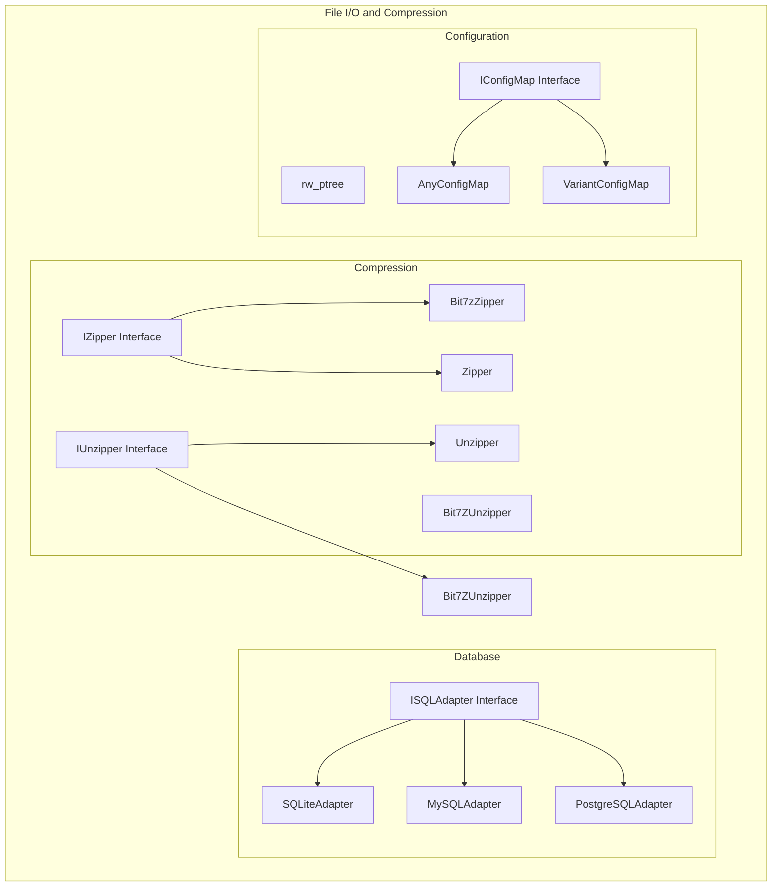

**Diagram sources**
- [fileoperator/IZipper.hpp](file://fileoperator/IZipper.hpp)
- [fileoperator/bit7z_zipper.hpp](file://fileoperator/bit7z_zipper.hpp)
- [fileoperator/IUnzipper.hpp](file://fileoperator/IUnzipper.hpp)
- [fileoperator/bit7z_unzipper.hpp](file://fileoperator/bit7z_unzipper.hpp)
- [fileoperator/sql_adapter.hpp](file://fileoperator/sql_adapter.hpp)
- [fileoperator/rw_ptree.hpp](file://fileoperator/rw_ptree.hpp)

## File Compression and Extraction with bit7z
The file compression and extraction functionality is implemented through a dual-layer architecture that supports both the bit7z library and miniz library for different compression needs. The system provides a clean interface abstraction through the IZipper and IUnzipper interfaces, allowing for consistent usage patterns regardless of the underlying compression library.

### IZipper Interface and Implementation
The IZipper interface defines the contract for adding files to an archive and saving the archive to a file. It provides methods for adding both byte data and files from the filesystem, with options to handle duplicate file names.

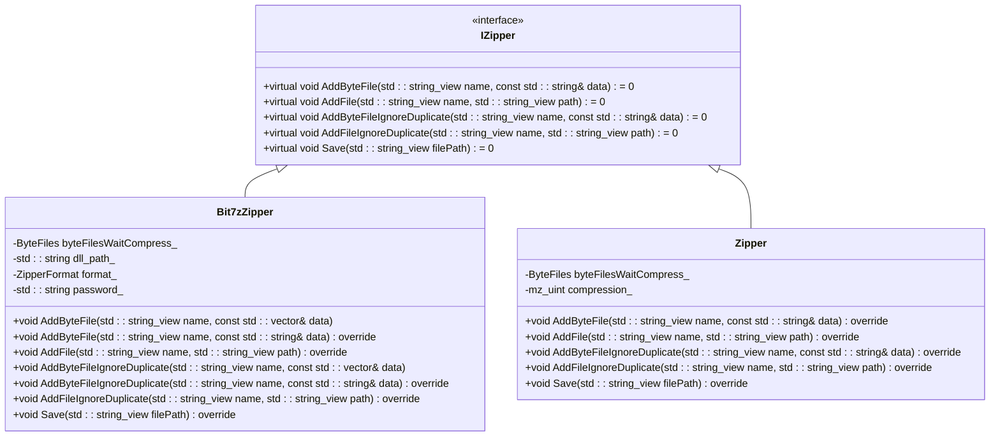

**Diagram sources**
- [fileoperator/IZipper.hpp](file://fileoperator/IZipper.hpp#L10-L24)
- [fileoperator/bit7z_zipper.hpp](file://fileoperator/bit7z_zipper.hpp#L46-L70)
- [fileoperator/zipper.hpp](file://fileoperator/zipper.hpp#L28-L57)

### bit7z Implementation Details
The Bit7zZipper class implements the IZipper interface using the bit7z library, providing support for multiple archive formats including ZIP, 7Z, XZ, BZIP2, GZIP, TAR, RAR, ISO, and Z. The implementation uses a variant-based storage system to handle both in-memory byte data and file paths, allowing for efficient memory management when dealing with large files.

The compression process is event-driven, with progress notifications sent through the EventSource mechanism. When saving an archive, the implementation iterates through all added files, using std::visit to handle both byte data and file paths appropriately. The Save method handles cross-platform path conversion and encoding, ensuring compatibility across different operating systems.

```mermaid
sequenceDiagram
participant Client
participant Bit7zZipper
participant bit7z : : BitArchiveWriter
participant Filesystem
Client->>Bit7zZipper : AddByteFile("data.txt", content)
Bit7zZipper->>Bit7zZipper : Store in byteFilesWaitCompress_
Client->>Bit7zZipper : AddFile("config.xml", "path/to/config.xml")
Bit7zZipper->>Bit7zZipper : Store in byteFilesWaitCompress_
Client->>Bit7zZipper : Save("archive.7z")
Bit7zZipper->>Bit7zZipper : Convert path encoding
Bit7zZipper->>bit7z : : BitArchiveWriter : Create with format
loop For each file in archive
Bit7zZipper->>Bit7zZipper : Use std : : visit to handle variant
alt Byte data
Bit7zZipper->>bit7z : : BitArchiveWriter : addFile(bytes, name)
else File path
Bit7zZipper->>bit7z : : BitArchiveWriter : addFile(path, name)
end
Bit7zZipper->>Client : RaiseEvent(progress, name)
end
bit7z : : BitArchiveWriter->>Filesystem : compressTo("archive.7z")
Bit7zZipper->>Client : Return success or throw IOError
```

**Diagram sources**
- [fileoperator/bit7z_zipper.cpp](file://fileoperator/bit7z_zipper.cpp#L103-L157)
- [fileoperator/bit7z_zipper.cpp](file://fileoperator/bit7z_zipper.cpp#L159-L183)

### IUnzipper Interface and Implementation
The IUnzipper interface provides a template-based approach to file extraction, with the UnzipperStream class serving as a wrapper around standard input streams. This design allows for flexible access to extracted data, whether from memory or temporary files.

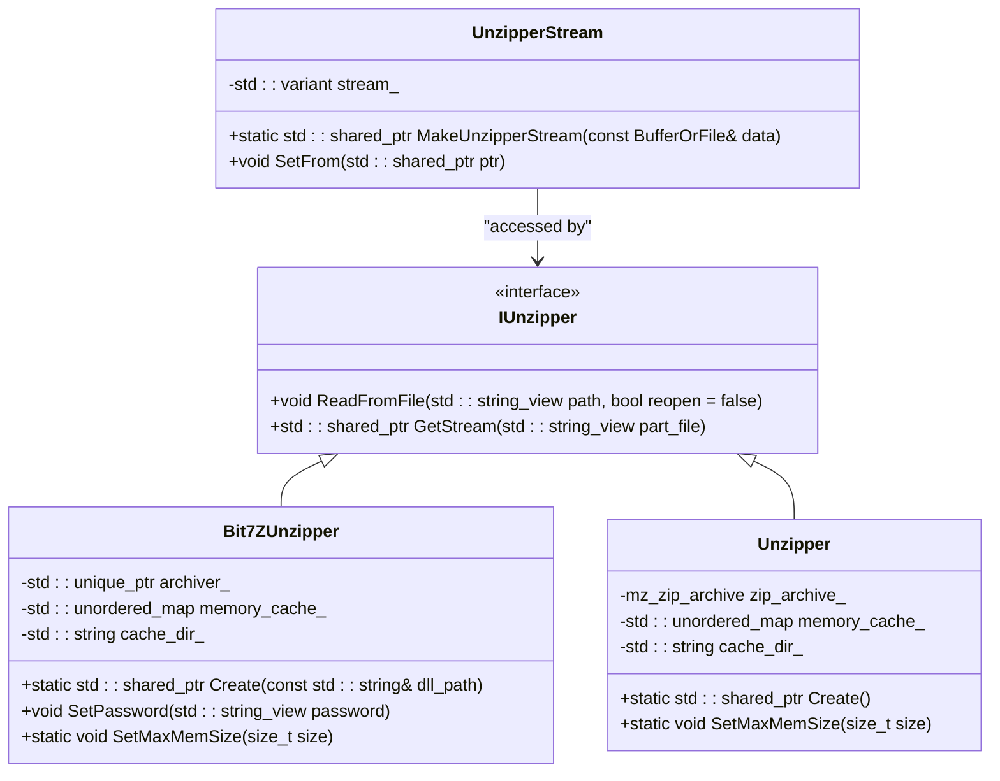

**Diagram sources**
- [fileoperator/IUnzipper.hpp](file://fileoperator/IUnzipper.hpp#L111-L130)
- [fileoperator/bit7z_unzipper.hpp](file://fileoperator/bit7z_unzipper.hpp#L20-L68)
- [fileoperator/unzipper.hpp](file://fileoperator/unzipper.hpp#L15-L50)

### bit7z Unzipper Implementation
The Bit7ZUnzipper implementation uses a hybrid caching strategy to efficiently handle both small and large files. Files smaller than a configurable threshold (default 1GB) are loaded entirely into memory, while larger files are extracted to temporary files in a cache directory. This approach balances memory usage with performance, ensuring that the system can handle archives of any size.

The implementation uses boost::uuid to generate unique cache directory names, preventing conflicts when multiple instances are running simultaneously. When the Unzipper is destroyed, it automatically cleans up any temporary files and directories it created.

```mermaid
flowchart TD
Start([Read Archive]) --> CheckOpen{"Archive Open?"}
CheckOpen --> |No| OpenArchive[Open Archive with bit7z::BitArchiveReader]
CheckOpen --> |Yes| CheckPath{"Same Path & !reopen?"}
CheckPath --> |Yes| Return[Return Existing Archive]
CheckPath --> |No| CloseExisting[Close Existing Archive]
CloseExisting --> OpenArchive
OpenArchive --> SetPassword{Password Set?}
SetPassword --> |Yes| SetPasswordInReader[Set Password in Reader]
SetPassword --> |No| Continue
SetPasswordInReader --> Continue
Continue --> ResetCache[Reset Cache and Directory]
ResetCache --> Ready[Archive Ready for Extraction]
Ready --> GetStream[GetStreamImpl(part_file)]
GetStream --> CheckCache{"In Memory Cache?"}
CheckCache --> |Yes| ReturnFromCache[Return Stream from Cache]
CheckCache --> |No| FindFile[Find File in Archive]
FindFile --> CheckExists{"File Exists?"}
CheckExists --> |No| ThrowError[Throw IOError]
CheckExists --> |Yes| GetSize[Get Uncompressed Size]
GetSize --> CheckSize{"Size <= max_mem_size_?"}
CheckSize --> |Yes| ExtractToMemory[Extract to Memory Buffer]
CheckSize --> |No| CheckCacheDir{"Using Cache Directory?"}
CheckCacheDir --> |No| CreateCacheDir[Create Cache Directory]
CheckCacheDir --> |Yes| UseExistingDir[Use Existing Directory]
CreateCacheDir --> UseExistingDir
UseExistingDir --> ExtractToFile[Extract to Temporary File]
ExtractToFile --> StoreInCache[Store File Path in Cache]
ExtractToFile --> ReturnStream[Return Stream from File]
ExtractToMemory --> StoreInCacheMem[Store Buffer in Cache]
StoreInCacheMem --> ReturnStreamMem[Return Stream from Memory]
ReturnFromCache --> End([Return Stream])
ReturnStream --> End
ReturnStreamMem --> End
ThrowError --> End
```

**Diagram sources**
- [fileoperator/bit7z_unzipper.cpp](file://fileoperator/bit7z_unzipper.cpp#L22-L131)
- [fileoperator/unzipper.cpp](file://fileoperator/unzipper.cpp#L25-L146)

## Database Access Layer with Sqlpp11
The database access layer provides a unified interface for interacting with SQLite, MySQL, and PostgreSQL databases through the ISQLAdapter interface. The implementation follows a consistent pattern across all database types, with each adapter handling the specific details of its underlying database library.

### ISQLAdapter Interface
The ISQLAdapter interface defines a comprehensive set of methods for database operations, including connection management, query execution, and CRUD operations. The interface is designed to be intuitive and type-safe, using std::any to handle different data types in a flexible manner.

```mermaid
classDiagram
class ISQLAdapter {
<<interface>>
+virtual void Connect(std : : string_view host, std : : string_view user, std : : string_view password, std : : string_view database, unsigned int port = 3306) = 0
+virtual void Execute(const std : : string& query) = 0
+virtual Rows Query(const std : : string& query) = 0
+virtual bool IsConnected() const noexcept = 0
+virtual void Insert(const std : : string& table, const std : : unordered_map<std : : string, std : : any>& data) = 0
+virtual void Delete(const std : : string& table, const std : : unordered_map<std : : string, std : : any>& data) = 0
+virtual void Update(const std : : string& table, const std : : unordered_map<std : : string, std : : any>& set, const std : : unordered_map<std : : string, std : : any>& where) = 0
+virtual Rows Select(const std : : string& table, const std : : vector<std : : string>& columns, const std : : unordered_map<std : : string, std : : any>& where, const std : : optional<std : : string>& orderBy, int64_t limit, int64_t offset) = 0
+virtual void CreateTable(const std : : string& table, const std : : unordered_map<std : : string, std : : string>& columns) = 0
+virtual void RemoveTable(const std : : string& table) = 0
}
class SQLiteAdapter {
-std : : shared_mutex mutex_
-std : : unique_ptr<Impl> impl_
+SQLiteAdapter()
+void Connect(std : : string_view path)
+void Connect(std : : string_view host, std : : string_view user, std : : string_view password, std : : string_view database, unsigned int port = 3306) override
+void Execute(const std : : string& query) override
+Rows Query(const std : : string& query) override
+bool IsConnected() const noexcept override
+void Insert(const std : : string& table, const std : : unordered_map<std : : string, std : : any>& data) override
+void Delete(const std : : string& table, const std : : unordered_map<std : : string, std : : any>& data) override
+void Update(const std : : string& table, const std : : unordered_map<std : : string, std : : any>& set, const std : : unordered_map<std : : string, std : : any>& where) override
+Rows Select(const std : : string& table, const std : : vector<std : : string>& columns, const std : : unordered_map<std : : string, std : : any>& where, const std : : optional<std : : string>& orderBy, int64_t limit, int64_t offset) override
+void CreateTable(const std : : string& table, const std : : unordered_map<std : : string, std : : string>& columns) override
+void RemoveTable(const std : : string& table) override
+~SQLiteAdapter() override
}
class MySQLAdapter {
-std : : shared_mutex mutex_
-std : : unique_ptr<Impl> impl_
+MySQLAdapter()
+void Connect(std : : string_view host, std : : string_view user, std : : string_view password, std : : string_view database, unsigned int port = 3306) override
+void Execute(const std : : string& query) override
+Rows Query(const std : : string& query) override
+bool IsConnected() const noexcept override
+void Insert(const std : : string& table, const std : : unordered_map<std : : string, std : : any>& data) override
+void Delete(const std : : string& table, const std : : unordered_map<std : : string, std : : any>& data) override
+void Update(const std : : string& table, const std : : unordered_map<std : : string, std : : any>& set, const std : : unordered_map<std : : string, std : : any>& where) override
+Rows Select(const std : : string& table, const std : : vector<std : : string>& columns, const std : : unordered_map<std : : string, std : : any>& where, const std : : optional<std : : string>& orderBy, int64_t limit, int64_t offset) override
+void CreateTable(const std : : string& table, const std : : unordered_map<std : : string, std : : string>& columns) override
+void RemoveTable(const std : : string& table) override
+~MySQLAdapter() override
}
class PostgreSQLAdapter {
-std : : shared_mutex mutex_
-std : : unique_ptr<Impl> impl_
+PostgreSQLAdapter()
+void Connect(std : : string_view host, std : : string_view user, std : : string_view password, std : : string_view database, unsigned int port = 5432) override
+void Execute(const std : : string& query) override
+Rows Query(const std : : string& query) override
+bool IsConnected() const noexcept override
+void Insert(const std : : string& table, const std : : unordered_map<std : : string, std : : any>& data) override
+void Delete(const std : : string& table, const std : : unordered_map<std : : string, std : : any>& data) override
+void Update(const std : : string& table, const std : : unordered_map<std : : string, std : : any>& set, const std : : unordered_map<std : : string, std : : any>& where) override
+Rows Select(const std : : string& table, const std : : vector<std : : string>& columns, const std : : unordered_map<std : : string, std : : any>& where, const std : : optional<std : : string>& orderBy, int64_t limit, int64_t offset) override
+void CreateTable(const std : : string& table, const std : : unordered_map<std : : string, std : : string>& columns) override
+void RemoveTable(const std : : string& table) override
+~PostgreSQLAdapter() override
}
ISQLAdapter <|-- SQLiteAdapter
ISQLAdapter <|-- MySQLAdapter
ISQLAdapter <|-- PostgreSQLAdapter
```

**Diagram sources**
- [fileoperator/sql_adapter.hpp](file://fileoperator/sql_adapter.hpp#L20-L48)
- [fileoperator/sql_adapter.hpp](file://fileoperator/sql_adapter.hpp#L106-L130)
- [fileoperator/sql_adapter.hpp](file://fileoperator/sql_adapter.hpp#L137-L161)
- [fileoperator/sql_adapter.hpp](file://fileoperator/sql_adapter.hpp#L169-L193)

### SQLiteAdapter Implementation
The SQLiteAdapter implementation uses the sqlite3 C API to provide a robust interface for SQLite database operations. The implementation follows a pimpl (pointer to implementation) pattern, with the Impl class containing the actual sqlite3 database connection and related state.

The adapter supports both file-based and in-memory databases, with connection methods that accept either a file path or connection parameters. All database operations are thread-safe, using a shared mutex to protect access to the database connection.

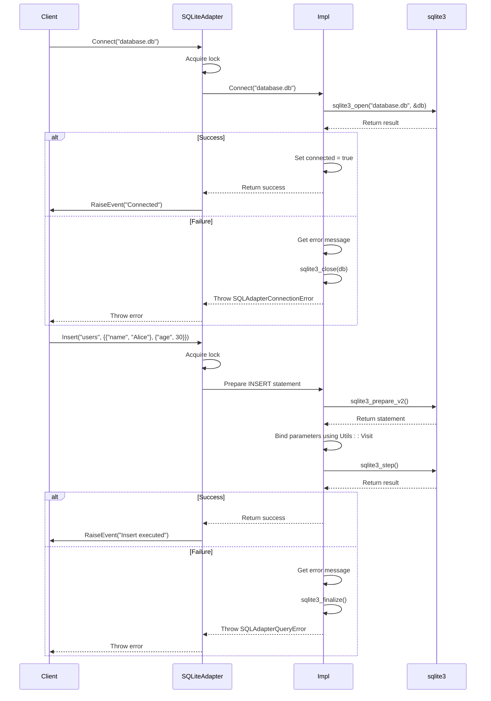

**Diagram sources**
- [fileoperator/sql_adapter.cpp](file://fileoperator/sql_adapter.cpp#L23-L235)
- [fileoperator/sql_adapter.cpp](file://fileoperator/sql_adapter.cpp#L120-L157)

### MySQLAdapter Implementation
The MySQLAdapter implementation uses the MySQL C API to provide connectivity to MySQL databases. Similar to the SQLiteAdapter, it follows the pimpl pattern and provides thread-safe operations through a shared mutex.

The implementation uses prepared statements with parameter binding for all data modification operations, which helps prevent SQL injection attacks and improves performance for repeated operations. The adapter supports all standard MySQL data types, converting them to and from std::any objects as needed.

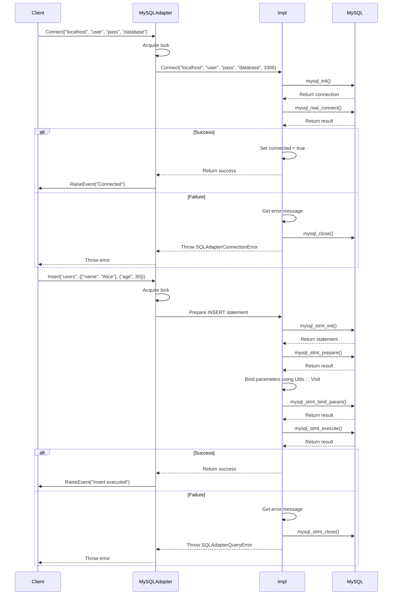

**Diagram sources**
- [fileoperator/sql_adapter.cpp](file://fileoperator/sql_adapter.cpp#L554-L821)
- [fileoperator/sql_adapter.cpp](file://fileoperator/sql_adapter.cpp#L883-L992)

### PostgreSQLAdapter Implementation
The PostgreSQLAdapter implementation uses the libpq library to provide connectivity to PostgreSQL databases. The implementation follows the same pimpl pattern and thread-safety approach as the other adapters.

One notable feature of the PostgreSQLAdapter is its use of direct SQL string construction for data modification operations, rather than prepared statements. This is due to the complexity of PostgreSQL's parameter binding system and the desire to maintain consistency with the other adapters. The adapter includes a to_pg_literal function that safely escapes values to prevent SQL injection attacks.

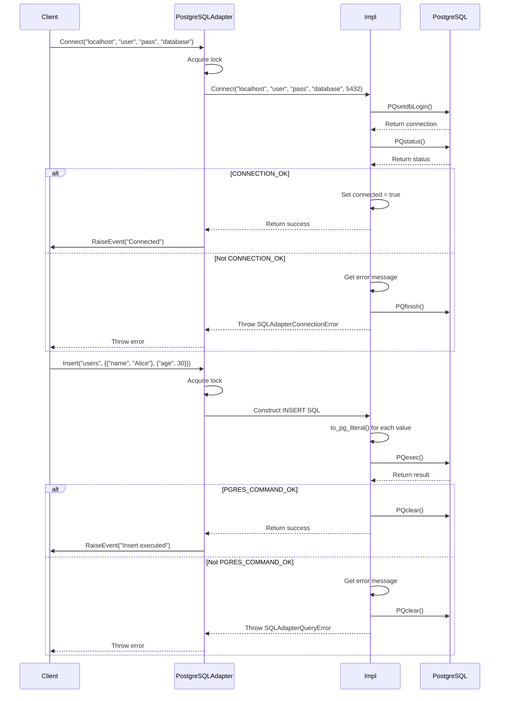

**Diagram sources**
- [fileoperator/sql_adapter.cpp](file://fileoperator/sql_adapter.cpp#L1257-L1550)
- [fileoperator/sql_adapter.cpp](file://fileoperator/sql_adapter.cpp#L1551-L1705)

### Query Builder Pattern
The database access layer includes a fluent interface for building SQL queries using operator overloading. This allows for more readable and type-safe query construction, reducing the risk of SQL syntax errors.

```mermaid
flowchart TD
Start([Start Query]) --> Select[Select: SQLSelect]
Start --> Insert[Insert: SQLInsert]
Start --> Delete[Delete: SQLDelete]
Start --> Update[Update: SQLUpdate]
Start --> CreateTable[CreateTable: SQLCreateTable]
Start --> RemoveTable[RemoveTable: SQLRemoveTable]
Select --> Columns[Specify Columns]
Columns --> Where[Add WHERE clause]
Where --> OrderBy[Add ORDER BY]
OrderBy --> Limit[Add LIMIT]
Limit --> Offset[Add OFFSET]
Offset --> Execute[Execute with | operator]
Insert --> Table[Specify Table]
Table --> Data[Add Data]
Data --> Execute
Delete --> Table2[Specify Table]
Table2 --> Condition[Add WHERE condition]
Condition --> Execute
Update --> Table3[Specify Table]
Table3 --> Set[Add SET clause]
Set --> Where2[Add WHERE clause]
Where2 --> Execute
CreateTable --> Table4[Specify Table]
Table4 --> Columns2[Add Columns]
Columns2 --> Execute
RemoveTable --> Table5[Specify Table]
Table5 --> Execute
Execute --> Result[Return Result]
```

**Diagram sources**
- [fileoperator/sql_adapter.hpp](file://fileoperator/sql_adapter.hpp#L216-L333)

## Property Tree for Hierarchical Configuration
The property tree system provides a flexible mechanism for storing and retrieving hierarchical configuration data in various formats, including INI, XML, and JSON. The implementation is built on top of the Boost.PropertyTree library, with additional functionality for type-safe access and conversion.

### rw_ptree Implementation
The rw_ptree module provides functions for reading and writing property trees from and to files in different formats. The implementation handles cross-platform path encoding conversion, ensuring that file paths are correctly interpreted on different operating systems.

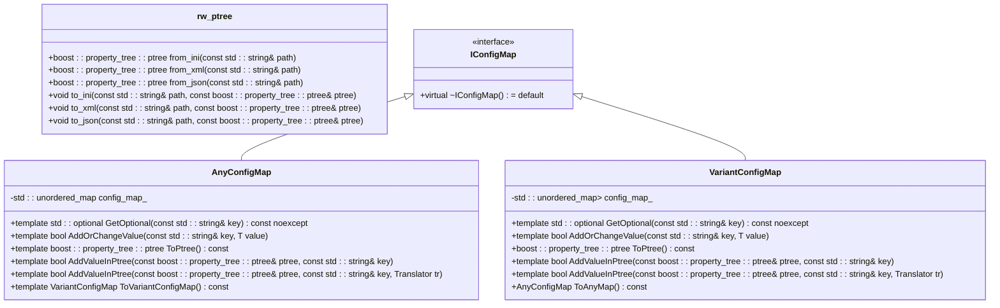

**Diagram sources**
- [fileoperator/rw_ptree.cpp](file://fileoperator/rw_ptree.cpp#L11-L50)
- [fileoperator/rw_ptree.hpp](file://fileoperator/rw_ptree.hpp#L31-L181)

### Configuration Data Flow
The configuration system follows a clear data flow pattern, starting with reading a file into a property tree, converting it to a configuration map, and then accessing the data in a type-safe manner.

```mermaid
flowchart TD
Start([Read Configuration File]) --> Format{"File Format?"}
Format --> |INI| ReadINI[boost::property_tree::read_ini()]
Format --> |XML| ReadXML[boost::property_tree::read_xml()]
Format --> |JSON| ReadJSON[boost::property_tree::read_json()]
ReadINI --> ConvertToMap[Convert to ConfigMap]
ReadXML --> ConvertToMap
ReadJSON --> ConvertToMap
ConvertToMap --> AnyConfigMap[Create AnyConfigMap]
ConvertToMap --> VariantConfigMap[Create VariantConfigMap]
AnyConfigMap --> GetOptional[GetOptional<T>(key)]
AnyConfigMap --> AddOrChangeValue[AddOrChangeValue(key, value)]
AnyConfigMap --> ToPtree[ToPtree<Args...>()]
VariantConfigMap --> GetOptional2[GetOptional<T>(key)]
VariantConfigMap --> AddOrChangeValue2[AddOrChangeValue(key, value)]
VariantConfigMap --> ToPtree2[ToPtree()]
GetOptional --> TypeCheck{Type Match?}
TypeCheck --> |Yes| ReturnValue[Return std::optional<T>]
TypeCheck --> |No| ReturnEmpty[Return std::nullopt]
AddOrChangeValue --> KeyExists{Key Exists?}
KeyExists --> |Yes| TypeMatch{Type Match?}
TypeMatch --> |Yes| UpdateValue[Update Value]
TypeMatch --> |No| ReturnFalse[Return false]
KeyExists --> |No| AddValue[Add New Value]
AddValue --> ReturnTrue[Return true]
ToPtree --> CreatePTree[Create boost::property_tree::ptree]
CreatePTree --> AddValues[Add All Values]
AddValues --> ReturnPTree[Return ptree]
UpdateValue --> ReturnTrue
```

**Diagram sources**
- [fileoperator/rw_ptree.cpp](file://fileoperator/rw_ptree.cpp#L11-L50)
- [fileoperator/rw_ptree.hpp](file://fileoperator/rw_ptree.hpp#L31-L181)

## Cross-Platform File System Considerations
The File I/O and Compression component includes several features designed to ensure cross-platform compatibility, particularly in handling file paths and character encoding.

### Path Handling
The implementation uses std::filesystem::path to handle file paths in a platform-independent manner. When saving archives or accessing files, paths are converted to the platform's preferred format using make_preferred(). This ensures that paths use the correct directory separators (forward slash on Unix-like systems, backslash on Windows).

```mermaid
flowchart TD
Start([File Path]) --> Platform{"Platform?"}
Platform --> |Windows| WindowsPath[Replace / with \\]
Platform --> |Unix| UnixPath[Ensure / separators]
Platform --> |macOS| UnixPath
WindowsPath --> Preferred[Use make_preferred()]
UnixPath --> Preferred
Preferred --> Encoding[Convert to Local Encoding]
Encoding --> Operation[File Operation]
```

**Diagram sources**
- [fileoperator/bit7z_zipper.cpp](file://fileoperator/bit7z_zipper.cpp#L105)
- [fileoperator/zipper.cpp](file://fileoperator/zipper.cpp#L78)

### Character Encoding
The component includes functions for converting between UTF-8 and the system's local encoding, which is particularly important on Windows systems where the default encoding may not be UTF-8. This ensures that file names and paths with non-ASCII characters are handled correctly.

The utf8_to_local function is used when interacting with the file system, while local_to_utf8 is used when returning file names to the application. This two-way conversion ensures that the internal representation remains in UTF-8 while the external interface adapts to the platform's requirements.


**Diagram sources**
- [fileoperator/bit7z_zipper.cpp](file://fileoperator/bit7z_zipper.cpp#L106)
- [fileoperator/zipper.cpp](file://fileoperator/zipper.cpp#L79)
- [fileoperator/rw_ptree.cpp](file://fileoperator/rw_ptree.cpp#L13)

## Error Handling in I/O Operations
The component implements a comprehensive error handling system that provides meaningful error messages and appropriate exception types for different failure scenarios.

### Exception Hierarchy
The error handling system is built on a hierarchy of exception classes that derive from the base IOError class. This allows for fine-grained error handling while maintaining a consistent interface.

```mermaid
classDiagram
class std : : exception {
<<abstract>>
}
class HsBa : : Slicer : : IOError {
+IOError(const std : : string& message)
+IOError(std : : string&& message)
}
class SQLAdapterError {
+SQLAdapterError(const std : : string& message)
+SQLAdapterError(std : : string&& message)
}
class SQLAdapterNotConnectedError {
+SQLAdapterNotConnectedError(const std : : string& message)
+SQLAdapterNotConnectedError(std : : string&& message)
}
class SQLAdapterQueryError {
+SQLAdapterQueryError(const std : : string& message)
+SQLAdapterQueryError(std : : string&& message)
}
class SQLAdapterConnectionError {
+SQLAdapterConnectionError(const std : : string& message)
+SQLAdapterConnectionError(std : : string&& message)
}
class SQLAdapterTimeoutError {
+SQLAdapterTimeoutError(const std : : string& message)
+SQLAdapterTimeoutError(std : : string&& message)
}
class SQLAdapterPermissionDeniedError {
+SQLAdapterPermissionDeniedError(const std : : string& message)
+SQLAdapterPermissionDeniedError(std : : string&& message)
}
class SQLAdapterInvalidArgumentError {
+SQLAdapterInvalidArgumentError(const std : : string& message)
+SQLAdapterInvalidArgumentError(std : : string&& message)
}
class InvalidArgumentError {
+InvalidArgumentError(const std : : string& message)
+InvalidArgumentError(std : : string&& message)
}
class NotSupportedError {
+NotSupportedError(const std : : string& message)
+NotSupportedError(std : : string&& message)
}
std : : exception <|-- HsBa : : Slicer : : IOError
std : : exception <|-- SQLAdapterError
HsBa : : Slicer : : IOError <|-- InvalidArgumentError
HsBa : : Slicer : : IOError <|-- NotSupportedError
SQLAdapterError <|-- SQLAdapterNotConnectedError
SQLAdapterError <|-- SQLAdapterQueryError
SQLAdapterError <|-- SQLAdapterConnectionError
SQLAdapterError <|-- SQLAdapterTimeoutError
SQLAdapterError <|-- SQLAdapterPermissionDeniedError
SQLAdapterError <|-- SQLAdapterInvalidArgumentError
```

**Diagram sources**
- [fileoperator/bit7z_zipper.cpp](file://fileoperator/bit7z_zipper.cpp#L46)
- [fileoperator/bit7z_zipper.cpp](file://fileoperator/bit7z_zipper.cpp#L155)
- [fileoperator/sql_adapter.hpp](file://fileoperator/sql_adapter.hpp#L51-L104)

### Error Propagation
Errors are propagated through the system with appropriate context, ensuring that callers receive meaningful error messages that can aid in debugging. When interfacing with external libraries like bit7z, SQLite, MySQL, or PostgreSQL, low-level error messages are captured and incorporated into higher-level exceptions.

```mermaid
flowchart TD
Start([Operation]) --> Success{Success?}
Success --> |Yes| Return[Return Result]
Success --> |No| CaptureError[Capture Library Error]
CaptureError --> ConstructException[Construct Appropriate Exception]
ConstructException --> AddContext[Add Operation Context]
AddContext --> Throw[Throw Exception]
subgraph "Example: SQLite Insert"
SQLiteInsert[sqlite3_step()]
SQLiteInsert --> Error{Error?}
Error --> |Yes| GetErrorMsg[sqlite3_errmsg()]
GetErrorMsg --> CreateException[Create SQLAdapterQueryError]
CreateException --> AddContext2[Add "execute failed: " + message]
AddContext2 --> Throw2[Throw Exception]
end
```

**Diagram sources**
- [fileoperator/sql_adapter.cpp](file://fileoperator/sql_adapter.cpp#L58-L62)
- [fileoperator/sql_adapter.cpp](file://fileoperator/sql_adapter.cpp#L229-L232)

## Usage Examples
The following examples demonstrate how to use the various components of the File I/O and Compression system.

### File Archiving Example
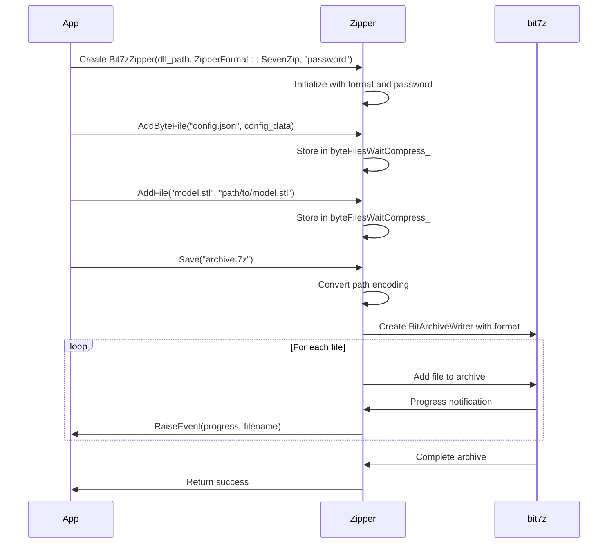

**Diagram sources**
- [fileoperator/bit7z_zipper.cpp](file://fileoperator/bit7z_zipper.cpp#L103-L157)
- [tests/FilesOperator/zipper_test.cpp](file://tests/FilesOperator/zipper_test.cpp#L24-L55)

### Database Persistence Example
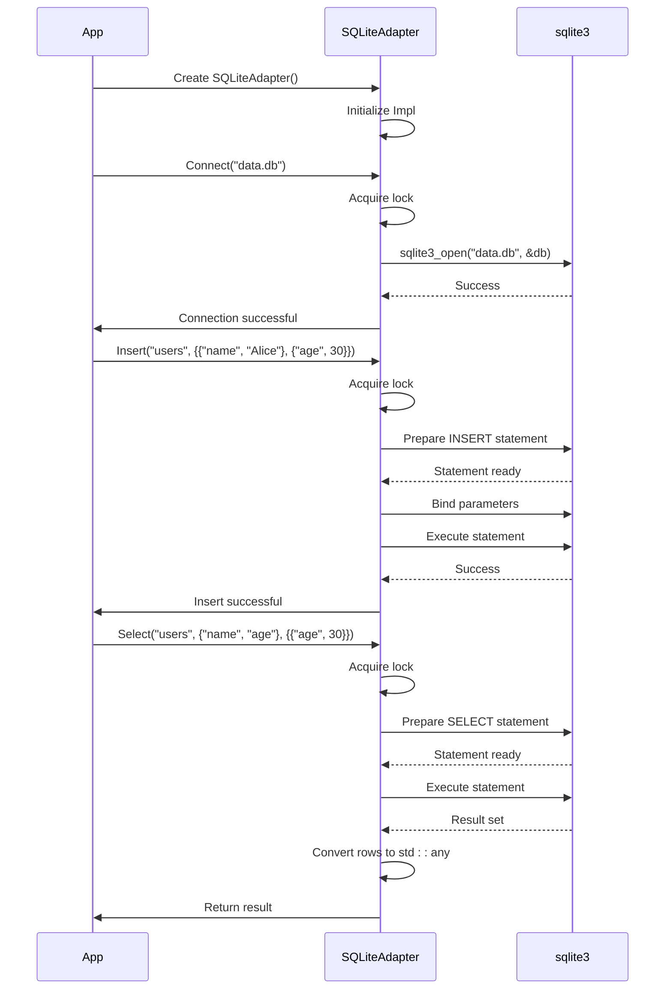

**Diagram sources**
- [fileoperator/sql_adapter.cpp](file://fileoperator/sql_adapter.cpp#L124-L164)
- [fileoperator/sql_adapter.cpp](file://fileoperator/sql_adapter.cpp#L166-L236)
- [tests/FilesOperator/sqlite_test.cpp](file://tests/FilesOperator/sqlite_test.cpp#L25-L56)

### Structured Data Reading/Writing Example
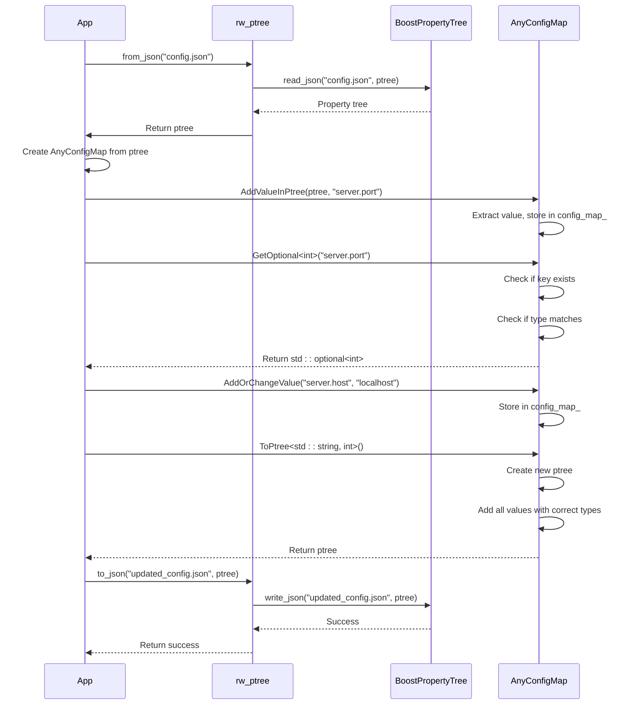

**Diagram sources**
- [fileoperator/rw_ptree.cpp](file://fileoperator/rw_ptree.cpp#L25-L30)
- [fileoperator/rw_ptree.cpp](file://fileoperator/rw_ptree.cpp#L44-L48)
- [fileoperator/rw_ptree.hpp](file://fileoperator/rw_ptree.hpp#L107-L181)

## Conclusion
The File I/O and Compression component in the HsBaSlicer project provides a robust and flexible system for handling file operations, data compression, database interactions, and configuration management. The architecture is well-designed with clear separation of concerns, allowing for easy maintenance and extension.

Key strengths of the implementation include:
- Support for multiple compression formats through the bit7z library
- Unified database access interface for SQLite, MySQL, and PostgreSQL
- Flexible configuration system with support for INI, XML, and JSON formats
- Comprehensive error handling with meaningful exception types
- Cross-platform compatibility with proper path and encoding handling

The component demonstrates good software engineering practices, including the use of interfaces for abstraction, RAII for resource management, and template-based generic programming for type safety. The inclusion of Lua integration in the test cases suggests that the system is designed to be accessible from scripting languages, enhancing its usability in different contexts.

Overall, the File I/O and Compression component provides a solid foundation for the HsBaSlicer application, enabling reliable and efficient handling of various data storage and retrieval scenarios.