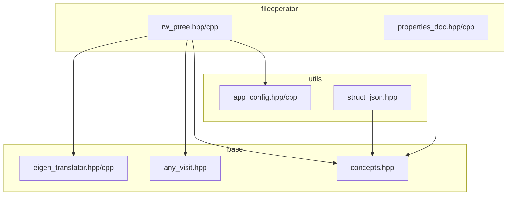
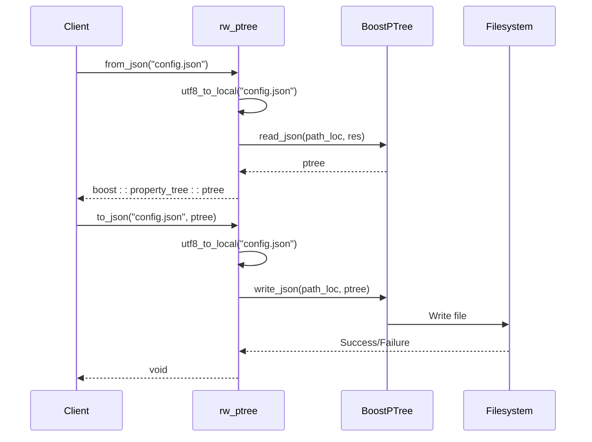
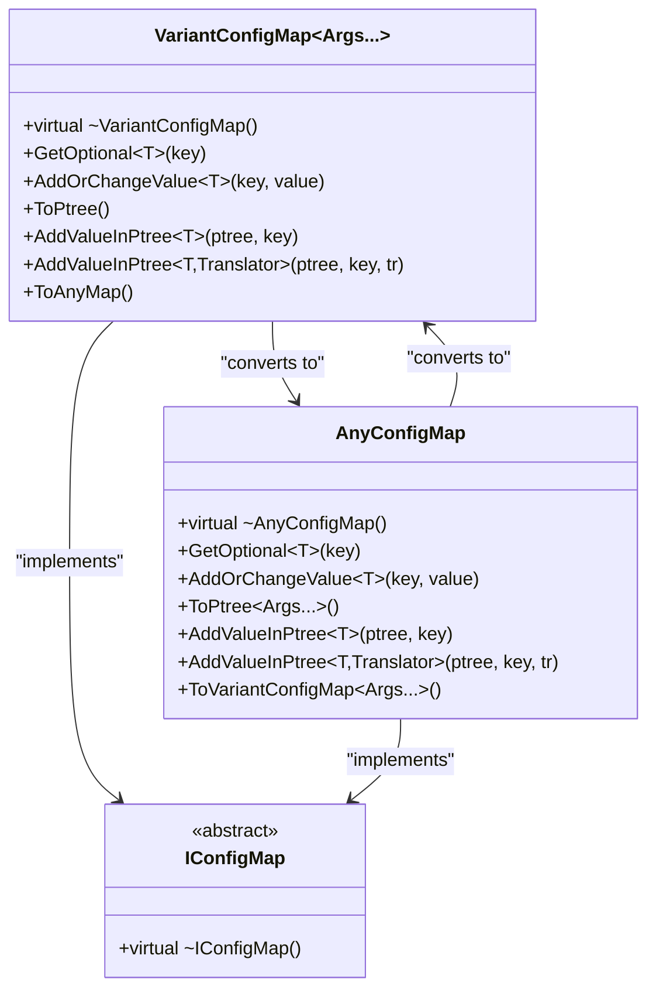
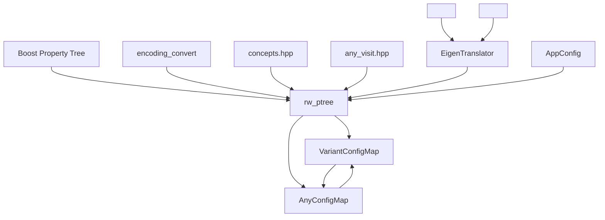

# Hierarchical Configuration Storage

<cite>
**Referenced Files in This Document**   
- [rw_ptree.hpp](file://fileoperator/rw_ptree.hpp)
- [rw_ptree.cpp](file://fileoperator/rw_ptree.cpp)
- [app_config.hpp](file://utils/app_config.hpp)
- [app_config.cpp](file://utils/app_config.cpp)
- [properties_doc.hpp](file://fileoperator/properties_doc.hpp)
- [properties_doc.cpp](file://fileoperator/properties_doc.cpp)
- [struct_json.hpp](file://utils/struct_json.hpp)
- [eigen_translator.hpp](file://base/eigen_translator.hpp)
- [eigen_translator.cpp](file://base/eigen_translator.cpp)
- [any_visit.hpp](file://base/any_visit.hpp)
- [concepts.hpp](file://base/concepts.hpp)
</cite>

## Table of Contents
1. [Introduction](#introduction)
2. [Project Structure](#project-structure)
3. [Core Components](#core-components)
4. [Architecture Overview](#architecture-overview)
5. [Detailed Component Analysis](#detailed-component-analysis)
6. [Dependency Analysis](#dependency-analysis)
7. [Performance Considerations](#performance-considerations)
8. [Troubleshooting Guide](#troubleshooting-guide)
9. [Conclusion](#conclusion)

## Introduction
The Hierarchical Configuration Storage system in HsBaSlicer provides a robust framework for managing application settings, model metadata, and user preferences through structured data formats. Built on top of Boost's property_tree library, this system enables flexible hierarchical data storage and retrieval in multiple formats including JSON, XML, and INI. The implementation supports type-safe configuration management through specialized containers like VariantConfigMap and AnyConfigMap, which provide compile-time and runtime type safety respectively. The system integrates with the application's configuration singleton (AppConfigSingletone) to provide global access to configuration data while ensuring thread-safe operations through shared mutex protection. Specialized translators enable serialization of complex data types such as Eigen vectors, allowing geometric and mathematical data to be persisted in human-readable formats.

## Project Structure
The property tree system is organized across multiple directories with clear separation of concerns. The core implementation resides in the `fileoperator` directory with `rw_ptree.hpp` and `rw_ptree.cpp` providing the primary interface for reading and writing hierarchical data. Configuration-related utilities are located in the `utils` directory, including the `app_config.hpp` and `app_config.cpp` files that implement the singleton pattern for global configuration access. The `base` directory contains fundamental components like `eigen_translator.hpp` which provides serialization support for mathematical data types, and `any_visit.hpp` which enables type-safe operations on heterogeneous data containers. Additional JSON processing capabilities are provided by `properties_doc.hpp` and `struct_json.hpp`, offering alternative approaches to structured data handling.



**Diagram sources **
- [rw_ptree.hpp](file://fileoperator/rw_ptree.hpp#L1-L217)
- [app_config.hpp](file://utils/app_config.hpp#L1-L24)
- [eigen_translator.hpp](file://base/eigen_translator.hpp#L1-L106)
- [any_visit.hpp](file://base/any_visit.hpp#L1-L123)
- [concepts.hpp](file://base/concepts.hpp#L1-L198)
- [struct_json.hpp](file://utils/struct_json.hpp#L1-L476)

**Section sources**
- [rw_ptree.hpp](file://fileoperator/rw_ptree.hpp#L1-L217)
- [app_config.hpp](file://utils/app_config.hpp#L1-L24)

## Core Components
The core components of the hierarchical configuration system include the rw_ptree module for format-agnostic property tree operations, the VariantConfigMap and AnyConfigMap classes for type-safe configuration storage, and the AppConfigSingletone for global configuration access. The system leverages Boost's property_tree library to provide unified read/write operations for INI, XML, and JSON formats, with automatic UTF-8 to local encoding conversion for cross-platform compatibility. The VariantConfigMap template class enables compile-time type checking for configuration values, while AnyConfigMap provides runtime type safety through std::any. Specialized translator classes facilitate the serialization of complex data types like Eigen vectors into string representations that can be stored in property trees. The AppConfigSingletone implements a thread-safe singleton pattern using std::shared_mutex to protect configuration data during concurrent access.

**Section sources**
- [rw_ptree.hpp](file://fileoperator/rw_ptree.hpp#L1-L217)
- [rw_ptree.cpp](file://fileoperator/rw_ptree.cpp#L1-L51)
- [app_config.hpp](file://utils/app_config.hpp#L1-L24)
- [app_config.cpp](file://utils/app_config.cpp#L1-L37)

## Architecture Overview
The hierarchical configuration architecture follows a layered design pattern with clear separation between data storage, type safety, and application integration layers. At the foundation, Boost's property_tree library provides the basic tree structure and format serialization capabilities. The middle layer consists of specialized configuration containers (VariantConfigMap and AnyConfigMap) that add type safety and validation to the raw property tree data. The top layer integrates with the application through the AppConfigSingletone, providing global access to configuration data. Data flow typically follows a pattern where configuration files are read into a property tree, converted to a type-safe configuration map, modified as needed, and then serialized back to persistent storage. The system supports bidirectional conversion between different configuration representations, allowing data to be loaded from one format and saved to another.

```mermaid
graph TD
A[Configuration File] --> |Read| B(Boost Property Tree)
B --> |Convert| C[VariantConfigMap<AnyConfigMap>]
C --> |Modify| D[Application Logic]
D --> |Update| C
C --> |Serialize| B
B --> |Write| E[Configuration File]
F[AppConfigSingletone] < --> C
G[Eigen Translators] --> B
H[Encoding Converter] --> A
H --> E
```

**Diagram sources **
- [rw_ptree.hpp](file://fileoperator/rw_ptree.hpp#L1-L217)
- [rw_ptree.cpp](file://fileoperator/rw_ptree.cpp#L1-L51)
- [app_config.hpp](file://utils/app_config.hpp#L1-L24)

## Detailed Component Analysis

### rw_ptree Implementation Analysis
The rw_ptree component provides format-agnostic read/write operations for hierarchical configuration data. It supports three primary formats: INI, XML, and JSON, with consistent interfaces for loading and saving property trees. The implementation handles cross-platform file path encoding through the utf8_to_local utility function, ensuring compatibility across different operating systems. Error handling follows Boost's exception model, with file parser errors propagated to calling code. The component serves as a bridge between raw file data and the type-safe configuration containers, providing the foundation for structured data management.

#### For API/Service Components:


**Diagram sources **
- [rw_ptree.hpp](file://fileoperator/rw_ptree.hpp#L20-L29)
- [rw_ptree.cpp](file://fileoperator/rw_ptree.cpp#L11-L49)

**Section sources**
- [rw_ptree.hpp](file://fileoperator/rw_ptree.hpp#L1-L217)
- [rw_ptree.cpp](file://fileoperator/rw_ptree.cpp#L1-L51)

### Configuration Map Analysis
The configuration map system provides type-safe storage for application settings through two complementary classes: VariantConfigMap and AnyConfigMap. VariantConfigMap uses C++ templates to enforce compile-time type safety, restricting stored values to a predefined set of types. AnyConfigMap uses std::any for runtime type safety, allowing dynamic type checking during value retrieval. Both classes implement the IConfigMap interface and provide methods for adding, retrieving, and modifying configuration values with proper error handling for type mismatches. The system supports conversion between these representations, enabling interoperability between compile-time and runtime type safety approaches.

#### For Object-Oriented Components:


**Diagram sources **
- [rw_ptree.hpp](file://fileoperator/rw_ptree.hpp#L31-L181)

**Section sources**
- [rw_ptree.hpp](file://fileoperator/rw_ptree.hpp#L31-L181)

### Eigen Data Type Integration
The system provides specialized support for Eigen library data types through translator classes that convert mathematical vectors to and from string representations suitable for property tree storage. Each supported Eigen vector type (2D, 3D, and 4D vectors of float, int, and double types) has a corresponding translator class that implements the StrTranslator concept. These translators use regular expressions to parse string representations of vectors and format them in a human-readable form with parentheses and commas. This enables complex geometric data to be stored in configuration files while maintaining readability and editability.

#### For Complex Logic Components:
```mermaid
flowchart TD
Start([String: "(1.0, 2.0, 3.0)"]) --> Parse["Parse with regex_pattern"]
Parse --> Extract["Extract numeric values"]
Extract --> Convert["Convert to double/float/int"]
Convert --> Create["Create Eigen::Vector3d"]
Create --> End([Eigen Vector])
Begin([Eigen::Vector3d]) --> Format["Format as (x, y, z)"]
Format --> String["Create string representation"]
String --> EndString([String: "(1.0, 2.0, 3.0)"])
```

**Diagram sources **
- [eigen_translator.hpp](file://base/eigen_translator.hpp#L1-L106)
- [eigen_translator.cpp](file://base/eigen_translator.cpp#L1-L224)

**Section sources**
- [eigen_translator.hpp](file://base/eigen_translator.hpp#L1-L106)
- [eigen_translator.cpp](file://base/eigen_translator.cpp#L1-L224)

## Dependency Analysis
The hierarchical configuration system has a well-defined dependency structure with minimal circular dependencies. The core rw_ptree component depends on Boost's property_tree library for basic tree operations and format serialization, and on the base utilities for encoding conversion and type checking. The configuration map classes depend on C++ standard library components like std::variant and std::any, as well as the any_visit utility for type-safe operations on heterogeneous data. The eigen_translator component depends on the Eigen linear algebra library and uses regular expressions for parsing vector string representations. The AppConfigSingletone has no external dependencies beyond the C++ standard library, making it a stable anchor point for configuration access throughout the application.



**Diagram sources **
- [rw_ptree.hpp](file://fileoperator/rw_ptree.hpp#L1-L217)
- [eigen_translator.hpp](file://base/eigen_translator.hpp#L1-L106)
- [any_visit.hpp](file://base/any_visit.hpp#L1-L123)
- [concepts.hpp](file://base/concepts.hpp#L1-L198)
- [app_config.hpp](file://utils/app_config.hpp#L1-L24)

**Section sources**
- [rw_ptree.hpp](file://fileoperator/rw_ptree.hpp#L1-L217)
- [eigen_translator.hpp](file://base/eigen_translator.hpp#L1-L106)
- [any_visit.hpp](file://base/any_visit.hpp#L1-L123)
- [concepts.hpp](file://base/concepts.hpp#L1-L198)

## Performance Considerations
The hierarchical configuration system demonstrates good performance characteristics for typical use cases. File I/O operations are optimized through direct Boost library calls with minimal intermediate buffering. The type-safe configuration maps provide O(1) average-case lookup performance through hash table storage, with minimal overhead for type checking during value retrieval. Memory usage is efficient, with configuration data stored only once in the property tree or configuration map structures. For large configuration files, the system may experience increased memory consumption due to the in-memory representation of the entire property tree, but this is mitigated by the ability to process configuration data in sections rather than loading entire files at once. The use of std::any in AnyConfigMap incurs a small runtime overhead for type checking, while VariantConfigMap provides zero-cost abstractions at compile time. Thread safety is ensured through the use of shared mutexes in the AppConfigSingletone, allowing concurrent read operations while protecting against race conditions during configuration updates.

## Troubleshooting Guide
Common issues with the hierarchical configuration system typically involve file access permissions, encoding problems, or type mismatches during configuration value retrieval. When encountering file read/write errors, verify that the application has appropriate permissions for the configuration directory and that file paths are correctly specified. Encoding issues may occur when configuration files contain non-ASCII characters; ensure that files are saved in UTF-8 format and that the system locale is properly configured. Type mismatch errors during GetOptional calls indicate that the requested type does not match the stored value type; use the appropriate type parameter or check the configuration file to verify the stored value format. For Eigen vector serialization issues, ensure that string representations match the expected format of "(x, y, z)" with appropriate numeric values. When debugging configuration problems, use the property tree's built-in output capabilities to inspect the loaded data structure and verify that values are being read correctly from the source file.

**Section sources**
- [rw_ptree.hpp](file://fileoperator/rw_ptree.hpp#L1-L217)
- [rw_ptree.cpp](file://fileoperator/rw_ptree.cpp#L1-L51)
- [eigen_translator.cpp](file://base/eigen_translator.cpp#L1-L224)

## Conclusion
The hierarchical configuration storage system in HsBaSlicer provides a comprehensive solution for managing structured application data across multiple formats. By combining Boost's property_tree library with custom type-safe containers and specialized data type support, the system offers both flexibility and reliability for configuration management. The architecture supports various use cases including application settings, model metadata storage, and user preference persistence, with robust error handling and type safety features. Integration with the AppConfigSingletone ensures consistent access to configuration data throughout the application, while the modular design allows for easy extension and maintenance. The system's support for complex data types like Eigen vectors makes it particularly well-suited for applications with mathematical or geometric components, providing a seamless bridge between in-memory data structures and persistent storage.