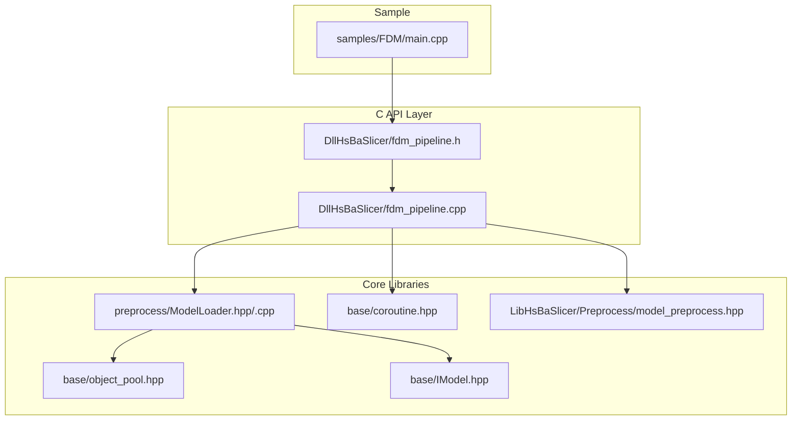
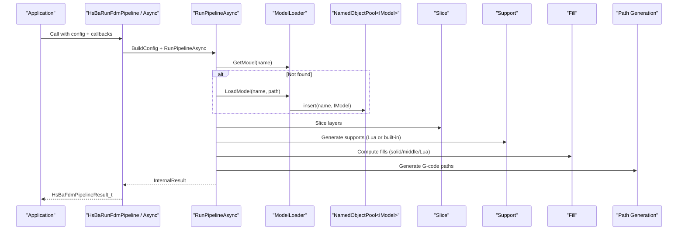
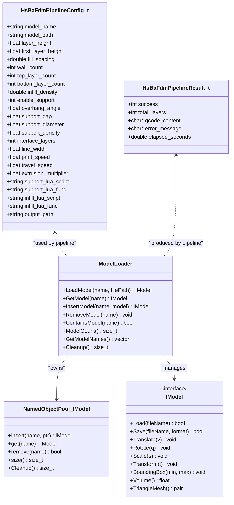
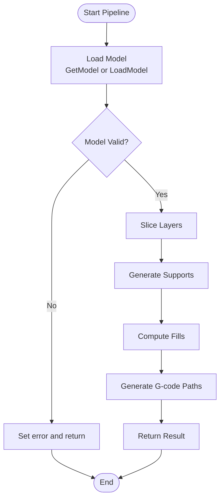

# FDM Sample Integration

<cite>
**Referenced Files in This Document**
- [fdm_pipeline.cpp](file://DllHsBaSlicer/fdm_pipeline.cpp)
- [fdm_pipeline.h](file://DllHsBaSlicer/fdm_pipeline.h)
- [ModelLoader.hpp](file://preprocess/ModelLoader.hpp)
- [ModelLoader.cpp](file://preprocess/ModelLoader.cpp)
- [object_pool.hpp](file://base/object_pool.hpp)
- [IModel.hpp](file://base/IModel.hpp)
- [coroutine.hpp](file://base/coroutine.hpp)
- [model_preprocess.hpp](file://LibHsBaSlicer/Preprocess/model_preprocess.hpp)
- [main.cpp](file://samples/FDM/main.cpp)
- [CMakeLists.txt](file://samples/FDM/CMakeLists.txt)
</cite>

## Table of Contents
1. [Introduction](#introduction)
2. [Project Structure](#project-structure)
3. [Core Components](#core-components)
4. [Architecture Overview](#architecture-overview)
5. [Detailed Component Analysis](#detailed-component-analysis)
6. [Dependency Analysis](#dependency-analysis)
7. [Performance Considerations](#performance-considerations)
8. [Troubleshooting Guide](#troubleshooting-guide)
9. [Conclusion](#conclusion)
10. [Appendices](#appendices)

## Introduction
This document explains the FDM Sample Integration for HsBaSlicer, focusing on how the FDM pipeline is exposed via a C API and how model loading is isolated per pipeline execution to avoid global state conflicts. It covers:
- The end-to-end FDM pipeline flow (load, slice, support, fill, path generation).
- The new design where each pipeline instance owns its own model pool, eliminating cross-run name collisions.
- How the sample program demonstrates synchronous and asynchronous usage.
- Key data structures, error handling, and performance characteristics.

## Project Structure
The FDM integration spans several modules:
- DllHsBaSlicer: C API entry points and coroutine-based pipeline orchestration.
- preprocess: ModelLoader class that manages per-instance model pools.
- base: Core interfaces (IModel), object pooling primitives, and coroutine utilities.
- LibHsBaSlicer: Preprocess free functions (kept for backward compatibility).
- samples/FDM: Example application demonstrating usage.

**Diagram sources**
- [fdm_pipeline.h:1-156](file://DllHsBaSlicer/fdm_pipeline.h#L1-L156)
- [fdm_pipeline.cpp:1-440](file://DllHsBaSlicer/fdm_pipeline.cpp#L1-L440)
- [ModelLoader.hpp:1-131](file://preprocess/ModelLoader.hpp#L1-L131)
- [ModelLoader.cpp:1-291](file://preprocess/ModelLoader.cpp#L1-L291)
- [object_pool.hpp:1-281](file://base/object_pool.hpp#L1-L281)
- [IModel.hpp:1-148](file://base/IModel.hpp#L1-L148)
- [coroutine.hpp:1-800](file://base/coroutine.hpp#L1-L800)
- [model_preprocess.hpp:1-88](file://LibHsBaSlicer/Preprocess/model_preprocess.hpp#L1-L88)

**Section sources**
- [fdm_pipeline.h:1-156](file://DllHsBaSlicer/fdm_pipeline.h#L1-L156)
- [fdm_pipeline.cpp:1-440](file://DllHsBaSlicer/fdm_pipeline.cpp#L1-L440)
- [ModelLoader.hpp:1-131](file://preprocess/ModelLoader.hpp#L1-L131)
- [ModelLoader.cpp:1-291](file://preprocess/ModelLoader.cpp#L1-L291)
- [object_pool.hpp:1-281](file://base/object_pool.hpp#L1-L281)
- [IModel.hpp:1-148](file://base/IModel.hpp#L1-L148)
- [coroutine.hpp:1-800](file://base/coroutine.hpp#L1-L800)
- [model_preprocess.hpp:1-88](file://LibHsBaSlicer/Preprocess/model_preprocess.hpp#L1-L88)
- [main.cpp:1-255](file://samples/FDM/main.cpp#L1-L255)
- [CMakeLists.txt:1-72](file://samples/FDM/CMakeLists.txt#L1-L72)

## Core Components
- C API structs and callbacks define configuration and results for the FDM pipeline.
- Pipeline orchestrator uses coroutines to run stages with progress reporting.
- ModelLoader encapsulates a per-instance NamedObjectPool<IModel>, isolating models per pipeline run.
- IModel abstracts 3D model operations (bounding box, volume, mesh export).
- Coroutine Task framework powers async execution and completion callbacks.

Key responsibilities:
- Configuration mapping from C struct to internal config.
- Stage orchestration: load, slice, support, fill, path generation.
- Memory-safe result marshaling between C++ and C.

**Section sources**
- [fdm_pipeline.h:35-149](file://DllHsBaSlicer/fdm_pipeline.h#L35-L149)
- [fdm_pipeline.cpp:144-197](file://DllHsBaSlicer/fdm_pipeline.cpp#L144-L197)
- [ModelLoader.hpp:26-127](file://preprocess/ModelLoader.hpp#L26-L127)
- [IModel.hpp:108-136](file://base/IModel.hpp#L108-L136)
- [coroutine.hpp:200-377](file://base/coroutine.hpp#L200-L377)

## Architecture Overview
The FDM pipeline integrates multiple subsystems through a clear separation of concerns:
- C API layer exposes simple, portable functions.
- Internal pipeline orchestrates steps using coroutines.
- ModelLoader provides an isolated model cache per pipeline instance.
- Underlying libraries perform slicing, support generation, filling, and G-code path creation.

**Diagram sources**
- [fdm_pipeline.cpp:203-367](file://DllHsBaSlicer/fdm_pipeline.cpp#L203-L367)
- [ModelLoader.cpp:14-49](file://preprocess/ModelLoader.cpp#L14-L49)
- [object_pool.hpp:98-114](file://base/object_pool.hpp#L98-L114)

## Detailed Component Analysis

### C API and Result Management
- Configuration struct defines all parameters for slicing, support, fill, and path generation.
- Result struct contains success flag, total layers, G-code content, error message, and elapsed time.
- Free function releases memory allocated by the pipeline.

Usage patterns:
- Synchronous call returns immediately after completion.
- Asynchronous call invokes a completion callback when done.

**Section sources**
- [fdm_pipeline.h:35-149](file://DllHsBaSlicer/fdm_pipeline.h#L35-L149)
- [fdm_pipeline.cpp:373-439](file://DllHsBaSlicer/fdm_pipeline.cpp#L373-L439)

### Pipeline Orchestration (Coroutines)
- InternalConfig aggregates all parameters and callbacks.
- RunPipelineAsync executes five stages with progress updates.
- Uses OwnedCString RAII to safely manage C string lifetimes across exceptions and early returns.

Stages:
1. Preprocess: Load model into local ModelLoader; compute bounding box and volume; calculate total layers.
2. Slice: Iterate layers and generate outlines.
3. Support: Built-in or Lua-driven support generation.
4. Fill: Solid top/bottom layers, middle layers with density-adjusted spacing, optional Lua custom fill.
5. Path Generation: Convert layer data to G-code paths.

Error handling:
- Exceptions are caught and converted into failure results with descriptive messages.
- Progress callbacks report stage names and percentages.

**Section sources**
- [fdm_pipeline.cpp:27-61](file://DllHsBaSlicer/fdm_pipeline.cpp#L27-L61)
- [fdm_pipeline.cpp:66-100](file://DllHsBaSlicer/fdm_pipeline.cpp#L66-L100)
- [fdm_pipeline.cpp:203-367](file://DllHsBaSlicer/fdm_pipeline.cpp#L203-L367)

### ModelLoader and Per-Instance Model Pool
- ModelLoader wraps NamedObjectPool<IModel, HSBA_MODEL_POOL_SIZE>.
- Each pipeline instance creates its own ModelLoader, ensuring isolation.
- LoadModel selects backend based on file extension (mesh vs BRep), constructs appropriate model, and inserts into pool.
- GetModel retrieves existing models without side effects.

Design benefits:
- Avoids global thread_local singletons for model caching within pipeline runs.
- Prevents name collision errors when running multiple pipelines sequentially.
- Move semantics allow safe transfer of ModelLoader into coroutine contexts.

Complexity considerations:
- Pool insertion checks capacity and cleans up inactive objects when full.
- Thread-safety provided by shared_mutex inside NamedObjectPool.

**Section sources**
- [ModelLoader.hpp:26-127](file://preprocess/ModelLoader.hpp#L26-L127)
- [ModelLoader.cpp:14-49](file://preprocess/ModelLoader.cpp#L14-L49)
- [object_pool.hpp:22-114](file://base/object_pool.hpp#L22-L114)
- [object_pool.hpp:256-274](file://base/object_pool.hpp#L256-L274)

### IModel Interface
- Abstract interface for 3D models providing transformations, bounding box, volume, and triangle mesh extraction.
- Used uniformly by ModelLoader backends (e.g., IglModel, OcctModel).

**Section sources**
- [IModel.hpp:108-136](file://base/IModel.hpp#L108-L136)

### Coroutine Task Framework
- Task<T, Executor> provides a promise-based abstraction over C++20 coroutines.
- Supports then(), catching(), finally() chaining and get_result() blocking retrieval.
- Enables non-blocking pipeline execution with completion callbacks.

**Section sources**
- [coroutine.hpp:200-377](file://base/coroutine.hpp#L200-L377)
- [coroutine.hpp:383-550](file://base/coroutine.hpp#L383-L550)

### Backward-Compatible Preprocess Free Functions
- model_preprocess.hpp declares free functions like LoadModel/GetModel/GetModelInfo that delegate to a global thread_local ModelLoader.
- These remain unchanged to preserve external APIs; only the FDM pipeline now uses per-instance ModelLoader internally.

**Section sources**
- [model_preprocess.hpp:27-83](file://LibHsBaSlicer/Preprocess/model_preprocess.hpp#L27-L83)

### Sample Application
- Demonstrates basic usage, custom parameters, Lua customization, and asynchronous execution.
- Downloads Stanford Bunny STL at build time if missing and copies resources next to the executable.

**Section sources**
- [main.cpp:1-255](file://samples/FDM/main.cpp#L1-L255)
- [CMakeLists.txt:1-72](file://samples/FDM/CMakeLists.txt#L1-L72)

## Dependency Analysis
High-level dependencies:
- C API depends on internal pipeline implementation.
- Pipeline depends on ModelLoader, slicing/support/fill/path libraries, and coroutine utilities.
- ModelLoader depends on IModel and NamedObjectPool.
- Sample links against the C API library.

**Diagram sources**
- [fdm_pipeline.h:35-149](file://DllHsBaSlicer/fdm_pipeline.h#L35-L149)
- [ModelLoader.hpp:26-127](file://preprocess/ModelLoader.hpp#L26-L127)
- [object_pool.hpp:22-114](file://base/object_pool.hpp#L22-L114)
- [IModel.hpp:108-136](file://base/IModel.hpp#L108-L136)

**Section sources**
- [fdm_pipeline.h:35-149](file://DllHsBaSlicer/fdm_pipeline.h#L35-L149)
- [ModelLoader.hpp:26-127](file://preprocess/ModelLoader.hpp#L26-L127)
- [object_pool.hpp:22-114](file://base/object_pool.hpp#L22-L114)
- [IModel.hpp:108-136](file://base/IModel.hpp#L108-L136)

## Performance Considerations
- Per-instance model pool avoids contention and eliminates global state overhead during repeated pipeline runs.
- NamedObjectPool performs lazy cleanup only when capacity is reached, reducing unnecessary work.
- Coroutines provide efficient scheduling and minimal overhead compared to manual threading.
- Solid layers use denser fills; middle layers adjust spacing based on infill density to balance quality and speed.
- Progress callbacks allow UI responsiveness without blocking the pipeline.

[No sources needed since this section provides general guidance]

## Troubleshooting Guide
Common issues and resolutions:
- Model name already exists: Occurs when trying to insert a duplicate name into the pool. Ensure unique names per pipeline run or remove prior models before reuse.
- Unsupported model format: File extension not recognized. Use supported formats (STL/OBJ/PLY/OFF for mesh; STEP/IGES/VRML/BREP for BRep if OCCT enabled).
- BRep unsupported on platform: OCCT not available. Either disable BRep usage or enable OCCT in build configuration.
- Pool full: Too many models cached without releasing references. Reduce HSBA_MODEL_POOL_SIZE or ensure external shared_ptr references are dropped to allow cleanup.
- Invalid model height: Model has zero or negative height; verify input geometry.
- Failed to generate G-code path: Check layer data validity and path generator configuration.

Operational tips:
- Always call HsBaFreePipelineResult to release strings returned by the C API.
- For asynchronous calls, ensure the result callback is invoked and frees the result.
- Provide meaningful progress callbacks to diagnose long-running stages.

**Section sources**
- [ModelLoader.cpp:14-49](file://preprocess/ModelLoader.cpp#L14-L49)
- [object_pool.hpp:70-114](file://base/object_pool.hpp#L70-L114)
- [fdm_pipeline.cpp:357-367](file://DllHsBaSlicer/fdm_pipeline.cpp#L357-L367)
- [fdm_pipeline.h:141-149](file://DllHsBaSlicer/fdm_pipeline.h#L141-L149)

## Conclusion
The FDM Sample Integration demonstrates a robust, modular approach to 3D printing slicing:
- A clean C API enables easy integration across platforms and languages.
- Per-instance model pooling prevents cross-run interference and improves reliability.
- Coroutine-based orchestration offers both synchronous and asynchronous execution modes.
- The sample app showcases practical usage patterns, including Lua customization and resource management.

[No sources needed since this section summarizes without analyzing specific files]

## Appendices

### Data Flow Diagram

**Diagram sources**
- [fdm_pipeline.cpp:203-367](file://DllHsBaSlicer/fdm_pipeline.cpp#L203-L367)