# Multi-Platform Build System

<cite>
**Referenced Files in This Document**
- [CMakeLists.txt](file://CMakeLists.txt)
- [CMakePresets.json](file://CMakePresets.json)
- [vcpkg.json](file://vcpkg.json)
- [vcpkg-configuration.json](file://vcpkg-configuration.json)
- [README.md](file://README.md)
- [LibHsBaSlicer/CMakeLists.txt](file://LibHsBaSlicer/CMakeLists.txt)
- [DllHsBaSlicer/CMakeLists.txt](file://DllHsBaSlicer/CMakeLists.txt)
- [ModuleHsBaSlicer/CMakeLists.txt](file://ModuleHsBaSlicer/CMakeLists.txt)
- [ModuleHsBaSlicer/hsba_slicer.cppm](file://ModuleHsBaSlicer/hsba_slicer.cppm)
- [ModuleHsBaSlicer/module_anchor.cpp](file://ModuleHsBaSlicer/module_anchor.cpp)
- [base/CMakeLists.txt](file://base/CMakeLists.txt)
- [cmake/HsBaSlicerConfig.cmake.in](file://cmake/HsBaSlicerConfig.cmake.in)
- [cmake/deploy_dlls.cmake](file://cmake/deploy_dlls.cmake)
- [android/build.gradle](file://android/build.gradle)
- [android/app/build.gradle](file://android/app/build.gradle)
- [android/settings.gradle](file://android/settings.gradle)
- [android/gradle.properties](file://android/gradle.properties)
- [android/gradle/wrapper/gradle-wrapper.properties](file://android/gradle/wrapper/gradle-wrapper.properties)
- [static_check/feature_check.cmake](file://static_check/feature_check.cmake)
- [pointcloud/CMakeLists.txt](file://pointcloud/CMakeLists.txt)
- [pointcloud/OpenVdbModel.hpp](file://pointcloud/OpenVdbModel.hpp)
- [pointcloud/OpenVdbModel_analysis.cpp](file://pointcloud/OpenVdbModel_analysis.cpp)
- [preprocess/ModelLoader.hpp](file://preprocess/ModelLoader.hpp)
- [version/Generator_Version.ps1](file://version/Generator_Version.ps1)
- [LICENSE.txt](file://LICENSE.txt)
- [docs/en/vcpkg-dependencies.md](file://docs/en/vcpkg-dependencies.md)
</cite>

## Update Summary
**Changes Made**
- Added comprehensive OpenVDB dependency support for point cloud processing capabilities
- Implemented conditional compilation flags (USE_OPENVDB) for point cloud features across desktop platforms
- Enhanced vcpkg configuration with dual licensing strategy supporting both MIT and GPL-3.0-or-later licenses
- Integrated OpenVDB as a platform-specific dependency with proper conditional linking
- Updated version generation system to track OpenVDB licensing information
- Added point cloud model implementation with advanced spatial operations and mesh reconstruction

## Table of Contents
1. [Introduction](#introduction)
2. [Project Structure](#project-structure)
3. [Core Components](#core-components)
4. [Architecture Overview](#architecture-overview)
5. [Detailed Component Analysis](#detailed-component-analysis)
6. [Dependency Analysis](#dependency-analysis)
7. [Performance Considerations](#performance-considerations)
8. [Troubleshooting Guide](#troubleshooting-guide)
9. [Conclusion](#conclusion)
10. [Appendices](#appendices)

## Introduction
This document explains the multi-platform build system for HsBaSlicer, focusing on how CMake 3.28+, vcpkg, and platform-specific presets orchestrate a consistent build across Windows, Linux, macOS, Android, iOS, and game consoles. The system has been significantly enhanced with C++20 module support, comprehensive installation capabilities, improved cross-platform compatibility, optimized Android builds with clang-scan-deps for superior incremental build performance, and **newly added OpenVDB-based point cloud processing capabilities**. It documents the modernized module layout, dependency management, shared vs static library configuration, dual licensing strategy, and the integration points that enable the FDM pipeline (preprocess, slice, support, fill, path generation) to be built and linked uniformly using both traditional headers and C++20 modules.

## Project Structure
The repository is organized into feature-based modules with a top-level CMake orchestrating subprojects. Key aspects:
- Top-level CMake configures compiler standards, feature detection, platform flags, and third-party dependencies via vcpkg/pkg-config.
- Subdirectories define libraries and executables (e.g., base, 2D, paths, preprocess, support, meshmodel, convert, LibHsBaSlicer, DllHsBaSlicer, HsBaSlicer).
- **New**: ModuleHsBaSlicer provides C++20 module interface for modern consumers.
- **New**: PointCloud module provides OpenVDB-based point cloud processing capabilities.
- CMake presets standardize cross-platform builds using Ninja or Xcode generators and integrate vcpkg toolchains.
- Unified output directories place all artifacts under `bin/<configuration>` for consistent deployment.
- Android project uses Gradle to consume prebuilt native artifacts; iOS/macOS use Xcode generator presets.
- **Enhanced**: Android builds now leverage clang-scan-deps for significantly improved incremental compilation performance.

```mermaid
graph TB
Root["Top-level CMake 3.28+<br/>Feature checks, options, deps"] --> Base["base (HsBaSlicerBase)"]
Root --> Utils["utils (HsBaSlicerUtils)"]
Root --> TwoD["2D (HsBaSlicer2D)"]
Root --> Paths["paths (HsBaPaths)"]
Root --> Preprocess["preprocess (HsBaPreprocess)"]
Root --> Support["support (HsBaSupport)"]
Root --> Mesh["meshmodel (HsBaSlicerMesh)"]
Root --> Convert["convert"]
Root --> CAD["cadmodel (HsBaSlicerCADModel)"]
Root --> PointCloud["pointcloud (HsBaSlicerPointCloud)"]
Root --> Lib["LibHsBaSlicer (static/shared)"]
Root --> Module["ModuleHsBaSlicer (C++20 module)"]
Root --> Dll["DllHsBaSlicer (shared)"]
Root --> App["HsBaSlicer (app)"]
Root --> Tests["tests / static_tests"]
Root --> Docs["docs"]
Root --> Install["Installation & Export<br/>CMake Package Config + FILE_SET"]
AndroidCI[".github/workflows/build-android.yml<br/>clang-scan-deps enabled"] --> Root
MultiPlatform[".github/workflows/cmake-multi-platform.yml<br/>clang-scan-deps enabled"] --> Root
```

**Diagram sources**
- [CMakeLists.txt:304-328](file://CMakeLists.txt#L304-L328)
- [CMakeLists.txt:345-457](file://CMakeLists.txt#L345-L457)
- [ModuleHsBaSlicer/CMakeLists.txt:1-46](file://ModuleHsBaSlicer/CMakeLists.txt#L1-L46)
- [pointcloud/CMakeLists.txt:1-58](file://pointcloud/CMakeLists.txt#L1-L58)
- [.github/workflows/build-android.yml:87-95](file://.github/workflows/build-android.yml#L87-L95)
- [.github/workflows/cmake-multi-platform.yml:268-276](file://.github/workflows/cmake-multi-platform.yml#L268-L276)

**Section sources**
- [CMakeLists.txt:1-107](file://CMakeLists.txt#L1-L107)
- [CMakeLists.txt:304-328](file://CMakeLists.txt#L304-L328)
- [README.md:41-194](file://README.md#L41-L194)

## Core Components
- **Enhanced CMake Requirements**: Minimum CMake 3.28 for C++20 module support and FILE_SET functionality.
- Compiler and language standards: Enforces C++20 and conditional C23 where supported.
- **Advanced Feature Detection**: Concepts, ranges, source_location, NTTP, template-template matching, coroutines, explicit this, and C++20 modules.
- Platform detection: Desktop vs mobile vs game console toggles features like logging, dynamic loader, CGAL, OpenCASCADE, SQL backends, and **OpenVDB point cloud processing**.
- Dependency resolution: vcpkg-managed packages with platform-scoped features (e.g., sqlpp11 SQLite-only on mobile) and **conditional OpenVDB support**.
- Library type control: Shared vs static based on VCPKG_TARGET_TRIPLET or user option.
- Unified output directories: All binaries placed in `bin/<configuration>` for consistent deployment.
- **Comprehensive Installation Support**: Full CMake package configuration with export targets, header installation, and FILE_SET for C++20 modules.
- **Optimized Android Builds**: Enhanced with clang-scan-deps for superior incremental compilation performance.
- **Dual Licensing Strategy**: Conditional license switching between MIT and GPL-3.0-or-later based on copyleft kernel usage.

Key behaviors:
- HSBA_DESKTOP, HSBA_MOBILE, HSBA_GAME_CONSOLE flags gate optional subsystems including **OpenVDB point cloud processing**.
- Optional bit7z compression and dynamic loader disabled on non-desktop platforms.
- Boolean operations disabled in Debug due to performance/memory constraints.
- Game console detection via VCPKG_TARGET_TRIPLET patterns (xbox, switch, playstation, stadia).
- **C++20 Modules**: Optional module building with automatic compiler capability detection.
- **OpenVDB Integration**: Conditional compilation with USE_OPENVDB flag for point cloud features on desktop platforms only.
- **Android Optimization**: clang-scan-deps integration enables faster rebuilds by tracking precise file dependencies.

**Updated** Enhanced with CMake 3.28 minimum requirement, optional C++20 module support, OpenVDB point cloud processing, and Android clang-scan-deps optimization.

**Section sources**
- [CMakeLists.txt:17-38](file://CMakeLists.txt#L17-L38)
- [CMakeLists.txt:48-104](file://CMakeLists.txt#L48-L104)
- [CMakeLists.txt:108-136](file://CMakeLists.txt#L108-L136)
- [CMakeLists.txt:160-194](file://CMakeLists.txt#L160-L194)
- [CMakeLists.txt:226-237](file://CMakeLists.txt#L226-L237)
- [CMakeLists.txt:280-302](file://CMakeLists.txt#L280-L302)
- [CMakeLists.txt:108-119](file://CMakeLists.txt#L108-L119)
- [CMakeLists.txt:263-270](file://CMakeLists.txt#L263-L270)
- [static_check/feature_check.cmake:96-111](file://static_check/feature_check.cmake#L96-L111)

## Architecture Overview
The build architecture integrates four layers:
- Configuration layer: CMake 3.28+ + CMakePresets + vcpkg configuration with **dual licensing support**.
- Module layer: Feature-based libraries and executables with optional C++20 modules and **OpenVDB point cloud processing**.
- Platform layer: OS-specific toolchains, generators, and ABI settings.
- Installation layer: CMake package configuration, target export system, and FILE_SET support.
- **Enhanced CI layer**: Optimized workflows with clang-scan-deps for Android builds.

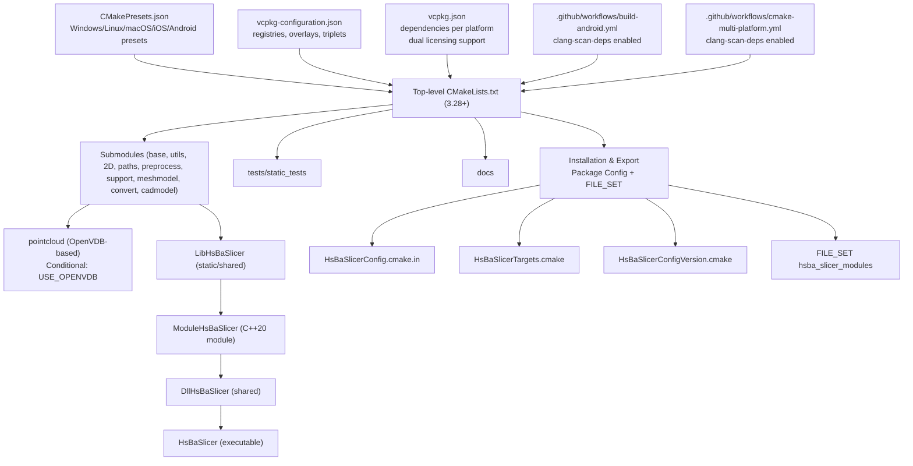

**Diagram sources**
- [CMakePresets.json:1-179](file://CMakePresets.json#L1-L179)
- [vcpkg-configuration.json:1-21](file://vcpkg-configuration.json#L1-L21)
- [vcpkg.json:1-110](file://vcpkg.json#L1-L110)
- [CMakeLists.txt:304-328](file://CMakeLists.txt#L304-L328)
- [CMakeLists.txt:263-270](file://CMakeLists.txt#L263-L270)
- [cmake/HsBaSlicerConfig.cmake.in:1-16](file://cmake/HsBaSlicerConfig.cmake.in#L1-L16)
- [ModuleHsBaSlicer/CMakeLists.txt:17-20](file://ModuleHsBaSlicer/CMakeLists.txt#L17-20)
- [.github/workflows/build-android.yml:87-95](file://.github/workflows/build-android.yml#L87-L95)
- [.github/workflows/cmake-multi-platform.yml:268-276](file://.github/workflows/cmake-multi-platform.yml#L268-L276)

## Detailed Component Analysis

### Top-level CMake Configuration
Responsibilities:
- Set minimum CMake version to 3.28 for C++20 module support.
- Configure C++20 and conditional C23.
- Run static feature checks including C++20 modules capability detection.
- Detect platform family and set desktop/mobile/console flags.
- Resolve third-party libraries via pkg-config and find_package.
- Toggle optional features (bit7z, dynamic loader, boolean ops, CAD kernel, SQL backends, **OpenVDB point cloud processing**).
- Control BUILD_SHARED_LIBS based on VCPKG_TARGET_TRIPLET.
- Include subdirectories for all modules and optional tests/docs.
- **Unified output directories**: All binaries placed in `bin/<configuration>`.
- **Comprehensive installation**: Full CMake package configuration with export targets and FILE_SET support.

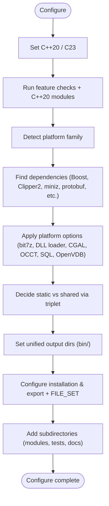

**Diagram sources**
- [CMakeLists.txt:1-107](file://CMakeLists.txt#L1-L107)
- [CMakeLists.txt:108-136](file://CMakeLists.txt#L108-L136)
- [CMakeLists.txt:138-237](file://CMakeLists.txt#L138-L237)
- [CMakeLists.txt:280-302](file://CMakeLists.txt#L280-L302)
- [CMakeLists.txt:304-328](file://CMakeLists.txt#L304-L328)
- [CMakeLists.txt:277-286](file://CMakeLists.txt#L277-L286)
- [CMakeLists.txt:345-457](file://CMakeLists.txt#L345-L457)

**Updated** Enhanced with CMake 3.28 minimum requirement, C++20 modules support, and OpenVDB point cloud processing integration.

**Section sources**
- [CMakeLists.txt:1-107](file://CMakeLists.txt#L1-L107)
- [CMakeLists.txt:108-136](file://CMakeLists.txt#L108-L136)
- [CMakeLists.txt:138-237](file://CMakeLists.txt#L138-L237)
- [CMakeLists.txt:280-302](file://CMakeLists.txt#L280-L302)
- [CMakeLists.txt:304-328](file://CMakeLists.txt#L304-L328)
- [CMakeLists.txt:277-286](file://CMakeLists.txt#L277-L286)
- [CMakeLists.txt:345-457](file://CMakeLists.txt#L345-L457)

### OpenVDB Point Cloud Processing Module
**New** Comprehensive OpenVDB-based point cloud processing capabilities:
- **Conditional Compilation**: Only available on desktop platforms (Windows, Linux, macOS) with USE_OPENVDB flag.
- **Advanced Operations**: Spatial queries, downsampling, normal computation, statistical filtering, and mesh reconstruction.
- **TBB Integration**: Parallel processing support for large point clouds using Intel TBB.
- **Imath Math Library**: High-performance mathematical operations for 3D geometry processing.
- **Blosc Compression**: Efficient storage and transfer of point cloud data.
- **MSVC Optimization**: Special handling for large object files with /bigobj flag.

```mermaid
classDiagram
class OpenVdbModel {
+Point cloud operations
+Spatial queries (RadiusSearch, KNN)
+Downsampling and filtering
+Normal computation
+Mesh reconstruction
+Statistical outlier removal
}
class HsBaSlicerPointCloud {
+Static library
+OpenVDB integration
+TBB parallel processing
+Imath math operations
+Blosc compression support
}
OpenVdbModel --> HsBaSlicerPointCloud : "implemented in"
HsBaSlicerPointCloud --> OpenVDB : : openvdb : "links"
HsBaSlicerPointCloud --> TBB : : tbb : "links"
HsBaSlicerPointCloud --> Imath : : Imath : "links"
HsBaSlicerPointCloud --> blosc : "links"
HsBaSlicerPointCloud --> ZLIB : : ZLIB : "links"
```

**Diagram sources**
- [pointcloud/CMakeLists.txt:1-58](file://pointcloud/CMakeLists.txt#L1-L58)
- [pointcloud/OpenVdbModel.hpp:1-92](file://pointcloud/OpenVdbModel.hpp#L1-L92)
- [pointcloud/OpenVdbModel_analysis.cpp:1-47](file://pointcloud/OpenVdbModel_analysis.cpp#L1-L47)

**Section sources**
- [pointcloud/CMakeLists.txt:1-58](file://pointcloud/CMakeLists.txt#L1-L58)
- [pointcloud/OpenVdbModel.hpp:1-92](file://pointcloud/OpenVdbModel.hpp#L1-L92)
- [pointcloud/OpenVdbModel_analysis.cpp:1-47](file://pointcloud/OpenVdbModel_analysis.cpp#L1-L47)
- [CMakeLists.txt:263-270](file://CMakeLists.txt#L263-L270)

### C++20 Module System (ModuleHsBaSlicer)
**New** Comprehensive C++20 module support with class-based API:
- **Module Interface**: Single-file module (`hsba_slicer.cppm`) providing modern C++ API.
- **Automatic Detection**: Compiler capability detection for MSVC 19.34+, GCC 14+, Clang 16+.
- **Conditional Building**: Optional module building controlled by `HSBA_SLICER_MODULE` option.
- **Modern API Design**: Class-based RAII interfaces replacing free functions.
- **FILE_SET Integration**: Proper installation of module interface files.

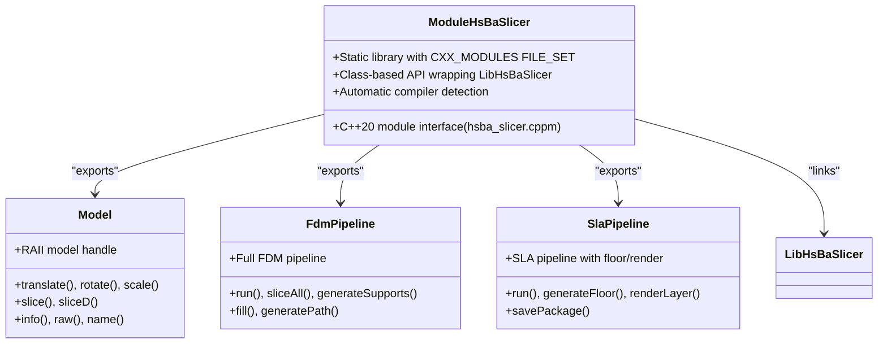

**Diagram sources**
- [ModuleHsBaSlicer/CMakeLists.txt:1-46](file://ModuleHsBaSlicer/CMakeLists.txt#L1-L46)
- [ModuleHsBaSlicer/hsba_slicer.cppm:114-276](file://ModuleHsBaSlicer/hsba_slicer.cppm#L114-L276)

**Section sources**
- [ModuleHsBaSlicer/CMakeLists.txt:1-46](file://ModuleHsBaSlicer/CMakeLists.txt#L1-L46)
- [ModuleHsBaSlicer/hsba_slicer.cppm:1-642](file://ModuleHsBaSlicer/hsba_slicer.cppm#L1-642)
- [ModuleHsBaSlicer/module_anchor.cpp:1-13](file://ModuleHsBaSlicer/module_anchor.cpp#L1-13)
- [CMakeLists.txt:108-119](file://CMakeLists.txt#L108-L119)
- [static_check/feature_check.cmake:96-111](file://static_check/feature_check.cmake#L96-L111)

### CMake Presets and Toolchains
- Provides named presets for Windows, Linux, macOS, iOS, and Android.
- Uses Ninja as primary generator; Xcode for iOS.
- Integrates vcpkg toolchain file and sets binary/install directories under out/.
- Android preset configures NDK, ABI, API level, and CMAKE_SYSTEM_NAME.
- iOS preset targets arm64 with deployment target 16.3.
- **Consistent build directory structure**: All presets use `${sourceDir}/out/build/${presetName}`.

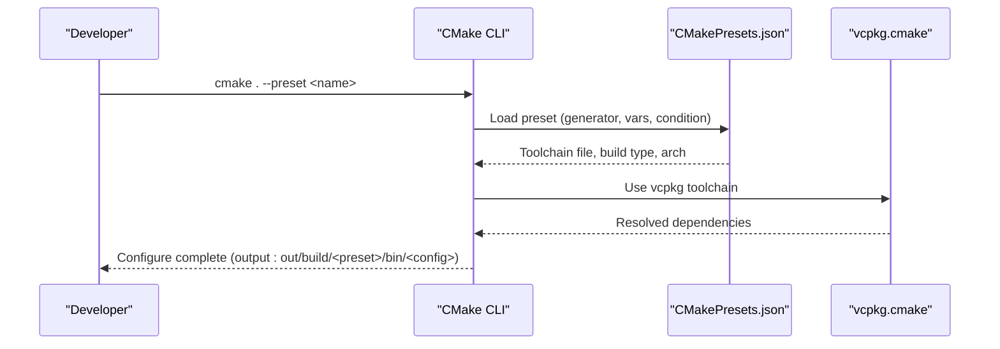

**Diagram sources**
- [CMakePresets.json:1-179](file://CMakePresets.json#L1-L179)

**Section sources**
- [CMakePresets.json:1-179](file://CMakePresets.json#L1-L179)

### Enhanced vcpkg Integration and Dual Licensing Strategy
**Updated** Comprehensive vcpkg integration with dual licensing support:
- **Centralized dependency list** with platform scoping and features.
- **Dual licensing strategy**: MIT license by default, switches to GPL-3.0-or-later when copyleft kernels are used.
- **Registries include** default git baseline and Microsoft artifact registry.
- **Overlay ports and triplets** allow local overrides.
- **Platform-specific dependencies**: Different dependency sets for desktop, mobile, and game console targets.
- **OpenVDB integration**: Apache-2.0 licensed dependency for point cloud processing.

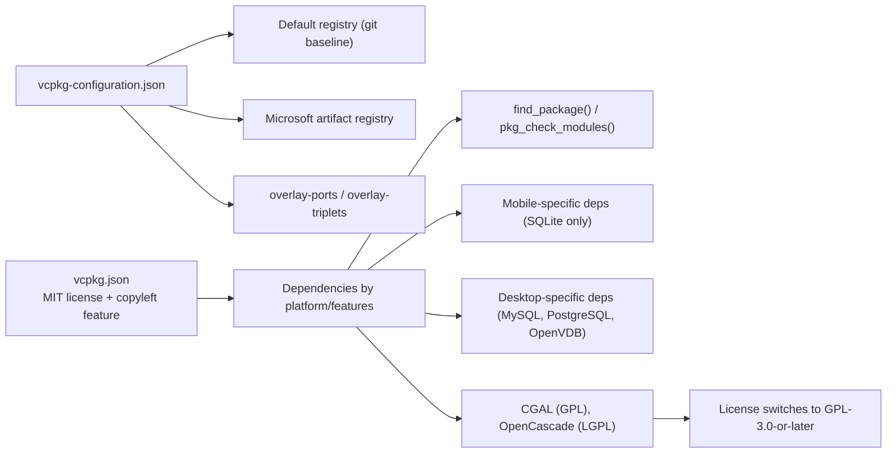

**Diagram sources**
- [vcpkg-configuration.json:1-21](file://vcpkg-configuration.json#L1-L21)
- [vcpkg.json:1-110](file://vcpkg.json#L1-L110)
- [version/Generator_Version.ps1:142-170](file://version/Generator_Version.ps1#L142-L170)

**Updated** Enhanced platform-specific dependency management with mobile vs desktop configurations and dual licensing support.

**Section sources**
- [vcpkg-configuration.json:1-21](file://vcpkg-configuration.json#L1-L21)
- [vcpkg.json:1-110](file://vcpkg.json#L1-L110)
- [version/Generator_Version.ps1:142-170](file://version/Generator_Version.ps1#L142-L170)
- [docs/en/vcpkg-dependencies.md:1-62](file://docs/en/vcpkg-dependencies.md#L1-L62)

### Installation and Package Configuration
**Enhanced** Comprehensive installation support with CMake package configuration:
- **Target export**: All libraries exported with `HsBaSlicer::` namespace.
- **Header installation**: Public headers installed to structured include directories.
- **FILE_SET support**: C++20 module interface files properly installed.
- **Package config files**: Generated `HsBaSlicerConfig.cmake` and version files.
- **Dependency management**: Automatic dependency resolution via `find_dependency()`.
- **Cross-platform compatibility**: Proper handling of runtime/library/archive destinations.

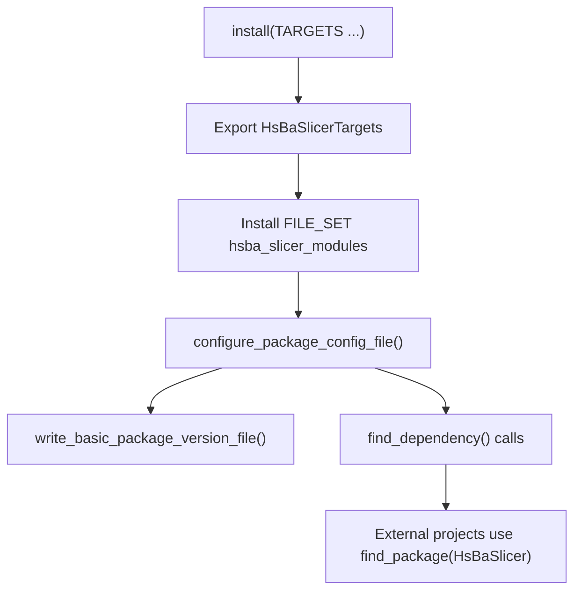

**Diagram sources**
- [CMakeLists.txt:345-457](file://CMakeLists.txt#L345-L457)
- [cmake/HsBaSlicerConfig.cmake.in:1-16](file://cmake/HsBaSlicerConfig.cmake.in#L1-L16)
- [ModuleHsBaSlicer/CMakeLists.txt:17-20](file://ModuleHsBaSlicer/CMakeLists.txt#L17-20)

**Section sources**
- [CMakeLists.txt:345-457](file://CMakeLists.txt#L345-L457)
- [cmake/HsBaSlicerConfig.cmake.in:1-16](file://cmake/HsBaSlicerConfig.cmake.in#L1-L16)

### Deployment Utilities
**Enhanced** Enhanced deployment support with specialized tools:
- **DLL deployment script**: `deploy_dlls.cmake` for copying PDB debug symbols.
- **Configuration-aware copying**: Automatically copies logcfg.ini to correct build configuration directory.
- **Conditional execution**: Skips missing files gracefully (Release mode may not generate PDBs).

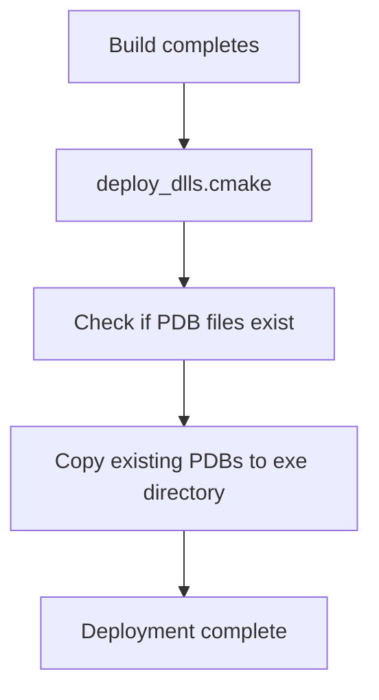

**Diagram sources**
- [cmake/deploy_dlls.cmake:1-27](file://cmake/deploy_dlls.cmake#L1-L27)

**Section sources**
- [cmake/deploy_dlls.cmake:1-27](file://cmake/deploy_dlls.cmake#L1-L27)
- [CMakeLists.txt:277-286](file://CMakeLists.txt#L277-L286)

### Enhanced Android Build System with Modern Toolchain
**Updated** Significantly upgraded Android build system with latest toolchain versions:
- **Java JDK 21**: Upgraded from JDK 11 to JDK 21 for improved performance and security.
- **Android SDK 34**: Updated from SDK 31 to SDK 34 with latest APIs and platform support.
- **Gradle 8.7**: Upgraded from Gradle 7.5.1 to 8.7 for enhanced build performance.
- **Android Gradle Plugin 8.3.2**: Updated from 7.4.2 to 8.3.2 with modern build features.
- **NDK r27d**: Latest Android NDK with improved clang-scan-deps integration.
- **Enhanced CI/CD**: Both workflow files now include comprehensive Android SDK and NDK setup.

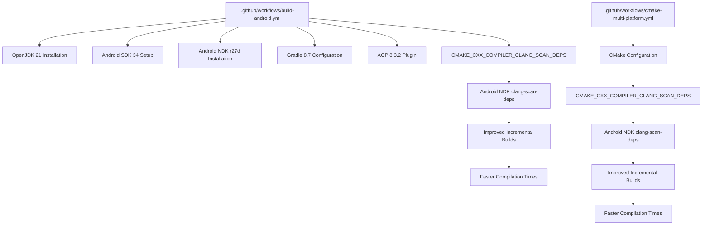

**Diagram sources**
- [.github/workflows/build-android.yml:16](file://.github/workflows/build-android.yml#L16)
- [.github/workflows/build-android.yml:37](file://.github/workflows/build-android.yml#L37)
- [.github/workflows/build-android.yml:46](file://.github/workflows/build-android.yml#L46)
- [.github/workflows/build-android.yml:95](file://.github/workflows/build-android.yml#L95)
- [.github/workflows/cmake-multi-platform.yml:203](file://.github/workflows/cmake-multi-platform.yml#L203)
- [.github/workflows/cmake-multi-platform.yml:217](file://.github/workflows/cmake-multi-platform.yml#L217)
- [.github/workflows/cmake-multi-platform.yml:227](file://.github/workflows/cmake-multi-platform.yml#L227)
- [.github/workflows/cmake-multi-platform.yml:276](file://.github/workflows/cmake-multi-platform.yml#L276)

**Section sources**
- [.github/workflows/build-android.yml:16](file://.github/workflows/build-android.yml#L16)
- [.github/workflows/build-android.yml:37](file://.github/workflows/build-android.yml#L37)
- [.github/workflows/build-android.yml:46](file://.github/workflows/build-android.yml#L46)
- [.github/workflows/build-android.yml:95](file://.github/workflows/build-android.yml#L95)
- [.github/workflows/cmake-multi-platform.yml:203](file://.github/workflows/cmake-multi-platform.yml#L203)
- [.github/workflows/cmake-multi-platform.yml:217](file://.github/workflows/cmake-multi-platform.yml#L217)
- [.github/workflows/cmake-multi-platform.yml:227](file://.github/workflows/cmake-multi-platform.yml#L227)
- [.github/workflows/cmake-multi-platform.yml:276](file://.github/workflows/cmake-multi-platform.yml#L276)

### Module: base (HsBaSlicerBase)
- Static library providing core utilities, coroutine primitives, object pools, thread pool, units, reflection helpers.
- Links Eigen3 and Boost; locale/nowide excluded on mobile/console.
- Exposes magic_enum.
- **Platform-specific linking**: Conditional linking based on target platform capabilities.

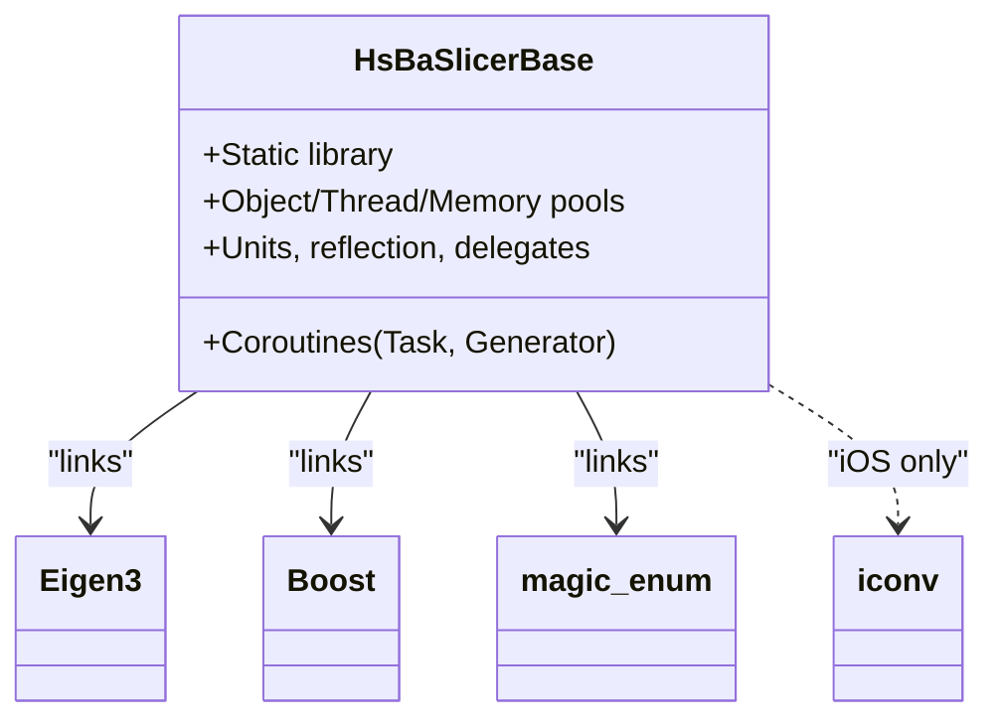

**Diagram sources**
- [base/CMakeLists.txt:1-49](file://base/CMakeLists.txt#L1-L49)

**Updated** Enhanced platform-specific linking with iOS iconv support.

**Section sources**
- [base/CMakeLists.txt:1-49](file://base/CMakeLists.txt#L1-L49)

### Module: LibHsBaSlicer (Public API surface)
- Builds as static or shared depending on global BUILD_SHARED_LIBS.
- Includes Slice, Preprocess, Support, Fill, Path modules.
- Links against base, utils, mesh, 2D, preprocess, support, paths, and optionally CAD model.
- Applies precompiled headers and export macros when shared.
- **Conditional CAD model linking**: Only links CAD model on desktop platforms.

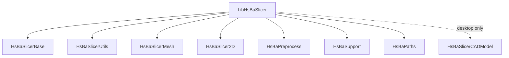

**Diagram sources**
- [LibHsBaSlicer/CMakeLists.txt:1-59](file://LibHsBaSlicer/CMakeLists.txt#L1-L59)

**Section sources**
- [LibHsBaSlicer/CMakeLists.txt:1-59](file://LibHsBaSlicer/CMakeLists.txt#L1-L59)

### Module: DllHsBaSlicer (System API)
- Shared library exposing C-compatible API for FDM pipeline.
- Links LibHsBaSlicer and underlying modules.
- Defines enums, structs, and functions for synchronous/asynchronous execution and progress callbacks.
- **Export macro configuration**: Properly configured for both static and shared builds.

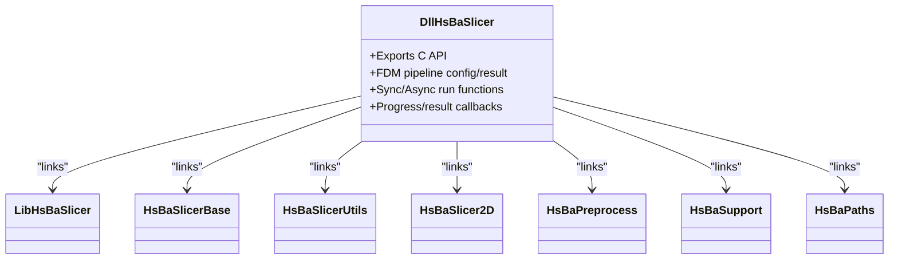

**Diagram sources**
- [DllHsBaSlicer/CMakeLists.txt:1-20](file://DllHsBaSlicer/CMakeLists.txt#L1-L20)
- [DllHsBaSlicer/fdm_pipeline.h:1-147](file://DllHsBaSlicer/fdm_pipeline.h#L1-L147)

**Section sources**
- [DllHsBaSlicer/CMakeLists.txt:1-20](file://DllHsBaSlicer/CMakeLists.txt#L1-L20)
- [DllHsBaSlicer/fdm_pipeline.h:1-147](file://DllHsBaSlicer/fdm_pipeline.h#L1-L147)

### Coroutines Foundation (Task/Generator)
- Provides Task<T>, Task<void>, CustomAllocatorTask, IExecutor, AsyncExecutor, NoopExecutor, DispatchAwaiter, and Generator<T>.
- Enables asynchronous pipelines with co_await semantics and completion callbacks.

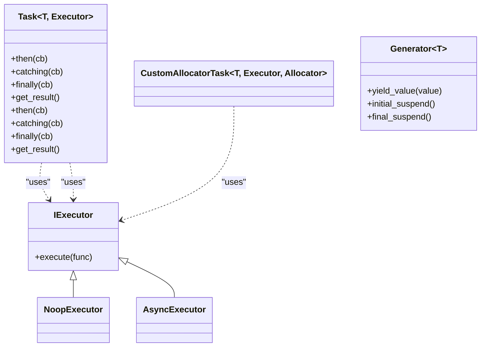

**Diagram sources**
- [base/coroutine.hpp:1-800](file://base/coroutine.hpp#L1-L800)

**Section sources**
- [base/coroutine.hpp:1-800](file://base/coroutine.hpp#L1-L800)

### Slice Interface (Existing)
- Exposes safe and unsafe slicing APIs returning polygonal layers at a given height.
- Also provides Lua-scripted variants.

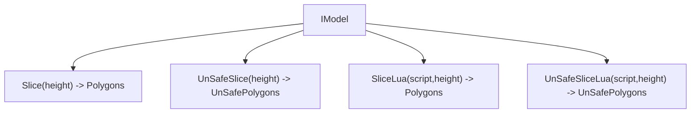

**Diagram sources**
- [LibHsBaSlicer/Slice/mesh_slice.hpp:1-28](file://LibHsBaSlicer/Slice/mesh_slice.hpp#L1-L28)

**Section sources**
- [LibHsBaSlicer/Slice/mesh_slice.hpp:1-28](file://LibHsBaSlicer/Slice/mesh_slice.hpp#L1-L28)

### FDM Pipeline API (C-compatible)
- Defines configuration struct, result struct, progress callback, and sync/async entry points.
- Intended to orchestrate preprocess -> slice -> support -> fill -> path generation internally.

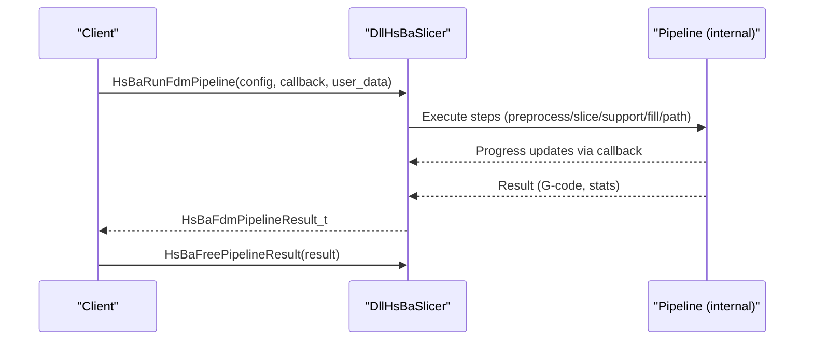

**Diagram sources**
- [DllHsBaSlicer/fdm_pipeline.h:1-147](file://DllHsBaSlicer/fdm_pipeline.h#L1-L147)

**Section sources**
- [DllHsBaSlicer/fdm_pipeline.h:1-147](file://DllHsBaSlicer/fdm_pipeline.h#L1-L147)

### Preprocessing and Support Primitives
- ModelLoader manages named models with automatic format selection and optional CGAL boolean/shell operations.
- FDM support implementations provide plane, tree, and honeycomb strategies.
- **Enhanced with OpenVDB**: Point cloud operations available when USE_OPENVDB is defined.

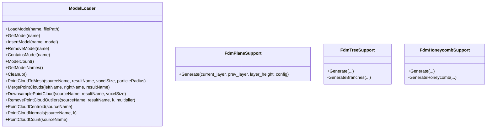

**Diagram sources**
- [preprocess/ModelLoader.hpp:1-195](file://preprocess/ModelLoader.hpp#L1-L195)
- [support/FdmSupport.hpp:1-63](file://support/FdmSupport.hpp#L1-L63)

**Updated** Enhanced with OpenVDB-based point cloud operations when USE_OPENVDB is defined.

**Section sources**
- [preprocess/ModelLoader.hpp:1-195](file://preprocess/ModelLoader.hpp#L1-L195)
- [support/FdmSupport.hpp:1-63](file://support/FdmSupport.hpp#L1-L63)

### Enhanced Android Integration with Modern Toolchain
**Updated** Modernized Android build system with latest toolchain versions:
- **Gradle Wrapper**: Configured with Gradle 8.7 for optimal build performance.
- **Android Gradle Plugin 8.3.2**: Latest plugin with enhanced build features and optimizations.
- **Android SDK 34**: Target SDK updated to latest with modern APIs and security patches.
- **Java JDK 21**: Upgraded from JDK 11 for improved performance and security.
- **NDK r27d**: Latest NDK with enhanced clang-scan-deps support for faster builds.
- **Enhanced CI Integration**: Both workflow files now include comprehensive Android SDK and NDK setup with proper caching.

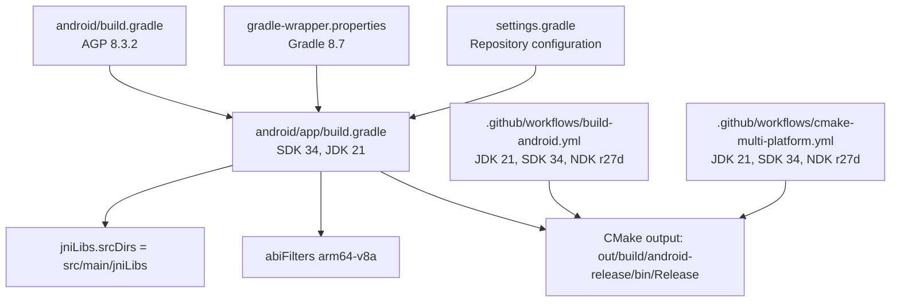

**Diagram sources**
- [android/build.gradle:2](file://android/build.gradle#L2)
- [android/app/build.gradle:7](file://android/app/build.gradle#L7)
- [android/app/build.gradle:12](file://android/app/build.gradle#L12)
- [android/gradle/wrapper/gradle-wrapper.properties:3](file://android/gradle/wrapper/gradle-wrapper.properties#L3)
- [android/settings.gradle:17](file://android/settings.gradle#L17)
- [.github/workflows/build-android.yml:16](file://.github/workflows/build-android.yml#L16)
- [.github/workflows/build-android.yml:37](file://.github/workflows/build-android.yml#L37)
- [.github/workflows/build-android.yml:46](file://.github/workflows/build-android.yml#L46)
- [.github/workflows/cmake-multi-platform.yml:203](file://.github/workflows/cmake-multi-platform.yml#L203)
- [.github/workflows/cmake-multi-platform.yml:217](file://.github/workflows/cmake-multi-platform.yml#L217)
- [.github/workflows/cmake-multi-platform.yml:227](file://.github/workflows/cmake-multi-platform.yml#L227)

**Section sources**
- [android/build.gradle:2](file://android/build.gradle#L2)
- [android/app/build.gradle:7](file://android/app/build.gradle#L7)
- [android/app/build.gradle:12](file://android/app/build.gradle#L12)
- [android/gradle/wrapper/gradle-wrapper.properties:3](file://android/gradle/wrapper/gradle-wrapper.properties#L3)
- [android/settings.gradle:17](file://android/settings.gradle#L17)
- [.github/workflows/build-android.yml:16](file://.github/workflows/build-android.yml#L16)
- [.github/workflows/build-android.yml:37](file://.github/workflows/build-android.yml#L37)
- [.github/workflows/build-android.yml:46](file://.github/workflows/build-android.yml#L46)
- [.github/workflows/cmake-multi-platform.yml:203](file://.github/workflows/cmake-multi-platform.yml#L203)
- [.github/workflows/cmake-multi-platform.yml:217](file://.github/workflows/cmake-multi-platform.yml#L217)
- [.github/workflows/cmake-multi-platform.yml:227](file://.github/workflows/cmake-multi-platform.yml#L227)

## Dependency Analysis
High-level linkage between major components:

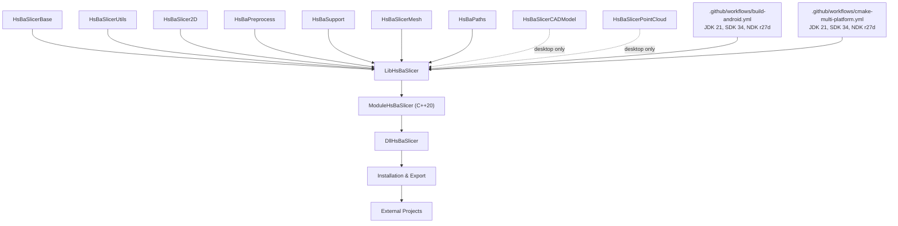

**Diagram sources**
- [LibHsBaSlicer/CMakeLists.txt:37-50](file://LibHsBaSlicer/CMakeLists.txt#L37-L50)
- [ModuleHsBaSlicer/CMakeLists.txt:23-29](file://ModuleHsBaSlicer/CMakeLists.txt#L23-L29)
- [DllHsBaSlicer/CMakeLists.txt:12-20](file://DllHsBaSlicer/CMakeLists.txt#L12-L20)
- [CMakeLists.txt:345-457](file://CMakeLists.txt#L345-L457)
- [pointcloud/CMakeLists.txt:1-58](file://pointcloud/CMakeLists.txt#L1-L58)
- [.github/workflows/build-android.yml:16](file://.github/workflows/build-android.yml#L16)
- [.github/workflows/build-android.yml:37](file://.github/workflows/build-android.yml#L37)
- [.github/workflows/build-android.yml:46](file://.github/workflows/build-android.yml#L46)
- [.github/workflows/cmake-multi-platform.yml:203](file://.github/workflows/cmake-multi-platform.yml#L203)
- [.github/workflows/cmake-multi-platform.yml:217](file://.github/workflows/cmake-multi-platform.yml#L217)
- [.github/workflows/cmake-multi-platform.yml:227](file://.github/workflows/cmake-multi-platform.yml#L227)

**Updated** Added C++20 module layer, enhanced installation/export layer for external project usage, OpenVDB point cloud processing module, and modernized Android toolchain with JDK 21, SDK 34, and NDK r27d.

**Section sources**
- [LibHsBaSlicer/CMakeLists.txt:37-50](file://LibHsBaSlicer/CMakeLists.txt#L37-L50)
- [ModuleHsBaSlicer/CMakeLists.txt:23-29](file://ModuleHsBaSlicer/CMakeLists.txt#L23-L29)
- [DllHsBaSlicer/CMakeLists.txt:12-20](file://DllHsBaSlicer/CMakeLists.txt#L12-L20)
- [CMakeLists.txt:345-457](file://CMakeLists.txt#L345-L457)
- [pointcloud/CMakeLists.txt:1-58](file://pointcloud/CMakeLists.txt#L1-L58)

## Performance Considerations
- Boolean operations disabled in Debug builds to avoid high memory usage and slow CGAL/IGL performance.
- Model pool size reduced on constrained platforms (mobile/console) to limit memory footprint.
- Dynamic loader and bit7z disabled on non-desktop platforms to reduce runtime overhead and complexity.
- Prefer Release builds for production to optimize slicing and path generation throughput.
- **Game console optimizations**: Specific feature gating for console platforms to minimize resource usage.
- **C++20 modules benefits**: Faster compile times and improved build performance for module consumers.
- **Android clang-scan-deps optimization**: Significantly improved incremental build performance through precise dependency tracking, reducing unnecessary recompilation during development and CI/CD processes.
- **Modern toolchain benefits**: JDK 21 provides better garbage collection and performance improvements over JDK 11.
- **Gradle 8.7 enhancements**: Improved build cache, parallel execution, and dependency resolution performance.
- **OpenVDB performance**: TBB integration enables parallel processing of large point clouds; Blosc compression reduces memory footprint.

**Updated** Added modern toolchain performance benefits including JDK 21 improvements, Gradle 8.7 enhancements, Android SDK 34 optimizations, and OpenVDB parallel processing capabilities.

## Troubleshooting Guide
Common issues and resolutions:
- Missing C++20 support: Ensure compiler meets requirements; CMake enforces C++20 and will fail early if concepts/ranges/source_location are unavailable.
- **CMake 3.28 requirement**: Upgrade CMake to 3.28+ for C++20 module support and FILE_SET functionality.
- vcpkg not found: Provide VCPKG_ROOT environment variable or pass -DCMAKE_TOOLCHAIN_FILE explicitly; verify vcpkg-configuration.json registries and baselines.
- **Android build fails**: Confirm ANDROID_NDK_HOME is set; use android-release preset; ensure ABI matches app module abiFilters.
- **Android SDK issues**: Verify Android SDK 34 is installed; check sdkmanager configuration; ensure platform-tools are up to date.
- **Java JDK 21 problems**: Ensure JDK 21 is properly installed and JAVA_HOME is set correctly; verify gradle.properties JVM args.
- **Gradle 8.7 compatibility**: Check that all plugins are compatible with Gradle 8.7; update deprecated configurations.
- iOS build fails: Verify Xcode generator preset and deployment target >= 16.3; confirm arm64 architecture.
- Debug slowdowns: Switch to Release; boolean operations are intentionally disabled in Debug.
- **Installation issues**: Ensure proper CMake package configuration files are installed; check namespace usage (`HsBaSlicer::`).
- **Game console builds**: Verify VCPKG_TARGET_TRIPLET matches expected patterns (xbox, switch, playstation, stadia).
- **DLL deployment**: Use deploy_dlls.cmake script for PDB copying; ensure TARGET_BIN and PDB_FILES variables are set correctly.
- **C++20 modules not building**: Check compiler version (MSVC 19.34+, GCC 14+, Clang 16+) and HSBA_SLICER_MODULE option.
- **Module import errors**: Ensure consumer project also uses CMake 3.28+ and supports C++20 modules.
- **Android clang-scan-deps issues**: Verify Android NDK r27d+ is installed; ensure clang-scan-deps path is accessible; check that CMAKE_CXX_COMPILER_CLANG_SCAN_DEPS points to correct NDK toolchain location.
- **NDK r27d configuration**: Verify NDK path is correctly set; check that clang-scan-deps binary exists at expected location.
- **OpenVDB build failures**: Ensure desktop platform (not Android/iOS/game console); verify OpenVDB dependencies (TBB, Imath, Blosc, ZLIB) are available.
- **USE_OPENVDB compilation errors**: Check that USE_OPENVDB is defined; verify OpenVDB is found during configuration; ensure pointcloud module is included in build.
- **Dual licensing issues**: Verify copyleft kernel detection; check generated version.cpp for correct license determination.

**Updated** Added troubleshooting for Android SDK 34, Java JDK 21, Gradle 8.7 compatibility, NDK r27d configuration, OpenVDB integration, and dual licensing issues.

**Section sources**
- [CMakeLists.txt:17-38](file://CMakeLists.txt#L17-38)
- [CMakeLists.txt:226-237](file://CMakeLists.txt#L226-L237)
- [CMakeLists.txt:108-119](file://CMakeLists.txt#L108-L119)
- [CMakePresets.json:84-109](file://CMakePresets.json#L84-L109)
- [CMakePresets.json:153-176](file://CMakePresets.json#L153-L176)
- [android/app/build.gradle:39-41](file://android/app/build.gradle#L39-L41)
- [CMakeLists.txt:110-126](file://CMakeLists.txt#L110-L126)
- [cmake/deploy_dlls.cmake:1-27](file://cmake/deploy_dlls.cmake#L1-L27)
- [static_check/feature_check.cmake:96-111](file://static_check/feature_check.cmake#L96-L111)
- [.github/workflows/build-android.yml:16](file://.github/workflows/build-android.yml#L16)
- [.github/workflows/build-android.yml:37](file://.github/workflows/build-android.yml#L37)
- [.github/workflows/build-android.yml:46](file://.github/workflows/build-android.yml#L46)
- [.github/workflows/cmake-multi-platform.yml:203](file://.github/workflows/cmake-multi-platform.yml#L203)
- [.github/workflows/cmake-multi-platform.yml:217](file://.github/workflows/cmake-multi-platform.yml#L217)
- [.github/workflows/cmake-multi-platform.yml:227](file://.github/workflows/cmake-multi-platform.yml#L227)
- [CMakeLists.txt:263-270](file://CMakeLists.txt#L263-L270)
- [pointcloud/CMakeLists.txt:1-58](file://pointcloud/CMakeLists.txt#L1-L58)

## Conclusion
The HsBaSlicer build system leverages modern CMake 3.28+ practices, vcpkg for dependency management, and platform presets to deliver a consistent, extensible, and efficient build across desktop and mobile environments. The recent enhancements introduce C++20 module support through ModuleHsBaSlicer, comprehensive installation capabilities with FILE_SET support, improved cross-platform compatibility including game console targets, significantly optimized Android builds with clang-scan-deps for superior incremental compilation performance, and **newly integrated OpenVDB-based point cloud processing capabilities**. The modular design cleanly separates core utilities, geometry kernels, and pipeline stages, while the dual API approach (traditional C ABI in DllHsBaSlicer and modern C++20 modules in ModuleHsBaSlicer) exposes ergonomic interfaces for both legacy and modern applications. The enhanced CMake package configuration enables seamless integration into external projects with proper dependency resolution and module support. The new Android build optimizations through clang-scan-deps integration provide substantial performance improvements in both development and continuous integration environments. The modernized Android toolchain with JDK 21, SDK 34, Gradle 8.7, and AGP 8.3.2 ensures cutting-edge performance, security, and compatibility with the latest Android ecosystem features. **The addition of OpenVDB support enables advanced point cloud processing with spatial queries, mesh reconstruction, and parallel processing capabilities**, while the dual licensing strategy ensures compliance with various open-source licensing requirements.

## Appendices

### Quick Build Commands
- Windows (Release): Select windows-release preset and build.
- Linux (Release): cmake . --preset linux-release && cd out/build/linux-release && cmake --build .
- Android (arm64): cmake . --preset android-release && cd out/build/android-release && cmake ..
- iOS (arm64): cmake . --preset ios-release
- **Installation**: cmake --install out/build/windows-release --prefix ./install
- **External project usage**: find_package(HsBaSlicer REQUIRED) in consumer CMakeLists.txt
- **C++20 modules**: Enable HSBA_SLICER_MODULE=ON for module support (requires CMake 3.28+)
- **Android with modern toolchain**: Ensure JDK 21, Android SDK 34, and NDK r27d are installed; workflows automatically configure clang-scan-deps.
- **OpenVDB point cloud processing**: Available automatically on desktop platforms; USE_OPENVDB flag enables point cloud operations.

**Updated** Added modern Android toolchain build instructions with JDK 21, SDK 34, and NDK r27d configuration guidance, plus OpenVDB point cloud processing availability.

**Section sources**
- [README.md:47-194](file://README.md#L47-L194)
- [CMakePresets.json:1-179](file://CMakePresets.json#L1-L179)
- [CMakeLists.txt:345-457](file://CMakeLists.txt#L345-L457)
- [CMakeLists.txt:108-119](file://CMakeLists.txt#L108-L119)
- [CMakeLists.txt:263-270](file://CMakeLists.txt#L263-L270)

### CMake Package Configuration
**Enhanced** External projects can now easily integrate HsBaSlicer with full C++20 module support:

```cmake
# In your project's CMakeLists.txt (requires CMake 3.28+)
find_package(HsBaSlicer REQUIRED)

# Traditional C API usage
target_link_libraries(your_app PRIVATE HsBaSlicer::DllHsBaSlicer)

# Modern C++20 modules usage (if available)
# target_link_libraries(your_app PRIVATE HsBaSlicer::ModuleHsBaSlicer)
```

The package configuration automatically handles:
- Dependency resolution (Eigen3, magic_enum, Clipper2, Lua, Protobuf, OpenSSL)
- Target namespace (`HsBaSlicer::`)
- Cross-platform compatibility
- Version checking and compatibility
- **C++20 module FILE_SET installation**
- **OpenVDB point cloud processing** (when available)

**Section sources**
- [cmake/HsBaSlicerConfig.cmake.in:1-16](file://cmake/HsBaSlicerConfig.cmake.in#L1-L16)
- [CMakeLists.txt:441-457](file://CMakeLists.txt#L441-L457)
- [ModuleHsBaSlicer/CMakeLists.txt:17-20](file://ModuleHsBaSlicer/CMakeLists.txt#L17-20)

### C++20 Module Usage Example
**New** Modern C++20 module consumer example:

```cpp
// Consumer application using C++20 modules
import hsba.slicer;

int main() {
    try {
        // Create model with RAII
        HsBa::Slicer::Model model("test", "model.stl");
        
        // Use FDM pipeline
        HsBa::Slicer::FdmPipeline pipeline;
        auto result = pipeline.run(model);
        
        std::cout << "Generated " << result.total_layers << " layers\n";
    } catch (const HsBa::Slicer::SlicerError& e) {
        std::cerr << "Error: " << e.what() << "\n";
        return 1;
    }
    
    return 0;
}
```

**Section sources**
- [ModuleHsBaSlicer/hsba_slicer.cppm:114-276](file://ModuleHsBaSlicer/hsba_slicer.cppm#L114-L276)
- [ModuleHsBaSlicer/CMakeLists.txt:1-46](file://ModuleHsBaSlicer/CMakeLists.txt#L1-L46)

### Android Modern Toolchain Configuration Details
**Updated** Technical details for Android build system upgrades:

The Android build system has been comprehensively upgraded with the following versions:

- **Java JDK 21**: Upgraded from JDK 11 for improved performance, security, and modern Java features.
- **Android SDK 34**: Updated from SDK 31 with latest APIs, security patches, and platform support.
- **Gradle 8.7**: Upgraded from Gradle 7.5.1 with enhanced build performance and caching.
- **Android Gradle Plugin 8.3.2**: Updated from 7.4.2 with modern build features and optimizations.
- **Android NDK r27d**: Latest NDK with enhanced clang-scan-deps support and improved toolchain.

Both workflow files have been updated to include comprehensive setup:
- **.github/workflows/build-android.yml**: Lines 16, 37, 46, 95
- **.github/workflows/cmake-multi-platform.yml**: Lines 203, 217, 227, 276

**Key Configuration Parameters**:
- **CMAKE_CXX_COMPILER_CLANG_SCAN_DEPS**: Points to `$ANDROID_NDK/toolchains/llvm/prebuilt/linux-x86_64/bin/clang-scan-deps`
- **ANDROID_PLATFORM**: Set to android-28 for compatibility
- **ABI Filters**: arm64-v8a for 64-bit ARM devices
- **JVM Args**: `-Xmx2048m -Dfile.encoding=UTF-8` in gradle.properties

**Benefits**:
- **Performance**: JDK 21 provides better garbage collection and JIT compilation
- **Security**: Latest SDK and NDK include critical security patches
- **Compatibility**: Support for latest Android APIs and device features
- **Build Speed**: Gradle 8.7 with improved caching and parallel execution
- **Incremental Builds**: clang-scan-deps enables precise dependency tracking

**Section sources**
- [.github/workflows/build-android.yml:16](file://.github/workflows/build-android.yml#L16)
- [.github/workflows/build-android.yml:37](file://.github/workflows/build-android.yml#L37)
- [.github/workflows/build-android.yml:46](file://.github/workflows/build-android.yml#L46)
- [.github/workflows/build-android.yml:95](file://.github/workflows/build-android.yml#L95)
- [.github/workflows/cmake-multi-platform.yml:203](file://.github/workflows/cmake-multi-platform.yml#L203)
- [.github/workflows/cmake-multi-platform.yml:217](file://.github/workflows/cmake-multi-platform.yml#L217)
- [.github/workflows/cmake-multi-platform.yml:227](file://.github/workflows/cmake-multi-platform.yml#L227)
- [.github/workflows/cmake-multi-platform.yml:276](file://.github/workflows/cmake-multi-platform.yml#L276)
- [android/gradle.properties:1](file://android/gradle.properties#L1)

### OpenVDB Point Cloud Processing Details
**New** Technical details for OpenVDB integration:

The OpenVDB point cloud processing module provides advanced 3D point cloud operations:

**Available Platforms**: Desktop only (Windows, Linux, macOS) - disabled on Android, iOS, and game consoles.

**Key Dependencies**:
- **OpenVDB**: Core point cloud and volumetric data library
- **Intel TBB**: Parallel processing framework for large datasets
- **Imath**: High-performance mathematical operations
- **Blosc**: Data compression for efficient storage
- **ZLIB**: Additional compression support
- **Boost iostreams**: File I/O operations

**Capabilities**:
- **Spatial Queries**: Radius search, K-nearest neighbors, nearest neighbor finding
- **Point Cloud Operations**: Downsampling, filtering, statistical outlier removal
- **Geometry Processing**: Normal computation, centroid calculation, merging
- **Mesh Reconstruction**: Level set-based triangle mesh generation
- **Data Management**: Voxelization, point storage, serialization

**Compilation Flags**:
- **USE_OPENVDB**: Defined when OpenVDB is available
- **/bigobj**: MSVC-specific flag for large object files
- **Parallel Processing**: TBB-enabled for performance optimization

**Integration Points**:
- **ModelLoader**: Point cloud operations exposed through preprocessing API
- **Conditional Compilation**: All point cloud features guarded by USE_OPENVDB
- **Platform Detection**: Automatic disablement on unsupported platforms

**Section sources**
- [pointcloud/CMakeLists.txt:1-58](file://pointcloud/CMakeLists.txt#L1-L58)
- [pointcloud/OpenVdbModel.hpp:1-92](file://pointcloud/OpenVdbModel.hpp#L1-L92)
- [pointcloud/OpenVdbModel_analysis.cpp:1-47](file://pointcloud/OpenVdbModel_analysis.cpp#L1-L47)
- [CMakeLists.txt:263-270](file://CMakeLists.txt#L263-L270)
- [preprocess/ModelLoader.hpp:125-188](file://preprocess/ModelLoader.hpp#L125-L188)

### Dual Licensing Strategy Details
**New** Technical details for conditional licensing:

The project implements a sophisticated dual licensing system:

**License Determination**:
- **Default**: MIT License for builds without copyleft dependencies
- **Conditional**: GPL-3.0-or-later when CGAL or OpenCascade are used
- **Runtime Detection**: License reported via GetVersionInfo() and HsBaGetVersionJson()

**Copyleft Dependencies**:
- **CGAL**: GPL-3.0-or-later (computational geometry algorithms)
- **OpenCascade**: LGPL-2.1-only (CAD modeling kernel)
- **OpenVDB**: Apache-2.0 (no impact on licensing)

**Platform-Specific Behavior**:
- **Desktop (Windows/Linux/macOS)**: May include copyleft kernels → GPL license
- **Mobile (Android/iOS)**: Excludes copyleft kernels → MIT license  
- **Game Consoles**: Excludes copyleft kernels → MIT license

**Implementation**:
- **vcpkg.json**: Defines "copyleft" feature with GPL-3.0-or-later license
- **Generator_Version.ps1**: Parses vcpkg.json to determine effective license
- **Runtime API**: License information available through version queries

**Benefits**:
- **Flexibility**: Users can choose appropriate license based on their needs
- **Compliance**: Automatic license determination prevents legal issues
- **Transparency**: Runtime license reporting ensures clarity

**Section sources**
- [vcpkg.json:1-110](file://vcpkg.json#L1-L110)
- [version/Generator_Version.ps1:142-170](file://version/Generator_Version.ps1#L142-L170)
- [LICENSE.txt:1-32](file://LICENSE.txt#L1-L32)
- [docs/en/vcpkg-dependencies.md:1-62](file://docs/en/vcpkg-dependencies.md#L1-L62)
- [README.md:205-211](file://README.md#L205-L211)