# Multi-Platform Build System

<cite>
**Referenced Files in This Document**
- [CMakeLists.txt](file://CMakeLists.txt)
- [CMakePresets.json](file://CMakePresets.json)
- [vcpkg.json](file://vcpkg.json)
- [vcpkg-configuration.json](file://vcpkg-configuration.json)
- [README.md](file://README.md)
- [LibHsBaSlicer/CMakeLists.txt](file://LibHsBaSlicer/CMakeLists.txt)
- [DllHsBaSlicer/CMakeLists.txt](file://DllHsBaSlicer/CMakeLists.txt)
- [base/CMakeLists.txt](file://base/CMakeLists.txt)
- [cmake/HsBaSlicerConfig.cmake.in](file://cmake/HsBaSlicerConfig.cmake.in)
- [cmake/deploy_dlls.cmake](file://cmake/deploy_dlls.cmake)
- [android/build.gradle](file://android/build.gradle)
- [android/app/build.gradle](file://android/app/build.gradle)
- [base/coroutine.hpp](file://base/coroutine.hpp)
- [LibHsBaSlicer/Slice/mesh_slice.hpp](file://LibHsBaSlicer/Slice/mesh_slice.hpp)
- [DllHsBaSlicer/fdm_pipeline.h](file://DllHsBaSlicer/fdm_pipeline.h)
- [preprocess/ModelLoader.hpp](file://preprocess/ModelLoader.hpp)
- [support/FdmSupport.hpp](file://support/FdmSupport.hpp)
</cite>

## Update Summary
**Changes Made**
- Updated unified output directory structure from traditional CMake layout to `bin/<configuration>` organization
- Added comprehensive installation support with CMake package configuration files
- Enhanced conditional compilation for Android/iOS/game console platforms
- Introduced new deployment utilities for DLL/PDB management
- Improved platform detection and feature gating mechanisms

## Table of Contents
1. [Introduction](#introduction)
2. [Project Structure](#project-structure)
3. [Core Components](#core-components)
4. [Architecture Overview](#architecture-overview)
5. [Detailed Component Analysis](#detailed-component-analysis)
6. [Dependency Analysis](#dependency-analysis)
7. [Performance Considerations](#performance-considerations)
8. [Troubleshooting Guide](#troubleshooting-guide)
9. [Conclusion](#conclusion)
10. [Appendices](#appendices)

## Introduction
This document explains the multi-platform build system for HsBaSlicer, focusing on how CMake, vcpkg, and platform-specific presets orchestrate a consistent build across Windows, Linux, macOS, Android, and iOS. The system has been completely overhauled with unified output directories, comprehensive installation support, and enhanced platform detection for mobile and game console targets. It documents the module layout, dependency management, shared vs static library configuration, and the integration points that enable the FDM pipeline (preprocess, slice, support, fill, path generation) to be built and linked uniformly.

## Project Structure
The repository is organized into feature-based modules with a top-level CMake orchestrating subprojects. Key aspects:
- Top-level CMake configures compiler standards, feature detection, platform flags, and third-party dependencies via vcpkg/pkg-config.
- Subdirectories define libraries and executables (e.g., base, 2D, paths, preprocess, support, meshmodel, convert, LibHsBaSlicer, DllHsBaSlicer, HsBaSlicer).
- CMake presets standardize cross-platform builds using Ninja or Xcode generators and integrate vcpkg toolchains.
- Unified output directories place all artifacts under `bin/<configuration>` for consistent deployment.
- Android project uses Gradle to consume prebuilt native artifacts; iOS/macOS use Xcode generator presets.

```mermaid
graph TB
Root["Top-level CMake<br/>Feature checks, options, deps"] --> Base["base (HsBaSlicerBase)"]
Root --> Utils["utils (HsBaSlicerUtils)"]
Root --> TwoD["2D (HsBaSlicer2D)"]
Root --> Paths["paths (HsBaPaths)"]
Root --> Preprocess["preprocess (HsBaPreprocess)"]
Root --> Support["support (HsBaSupport)"]
Root --> Mesh["meshmodel (HsBaSlicerMesh)"]
Root --> Convert["convert"]
Root --> CAD["cadmodel (HsBaSlicerCADModel)"]
Root --> Lib["LibHsBaSlicer (static/shared)"]
Root --> Dll["DllHsBaSlicer (shared)"]
Root --> App["HsBaSlicer (app)"]
Root --> Tests["tests / static_tests"]
Root --> Docs["docs"]
Root --> Install["Installation & Export<br/>CMake Package Config"]
```

**Diagram sources**
- [CMakeLists.txt:304-328](file://CMakeLists.txt#L304-L328)
- [CMakeLists.txt:345-457](file://CMakeLists.txt#L345-L457)

**Section sources**
- [CMakeLists.txt:1-107](file://CMakeLists.txt#L1-L107)
- [CMakeLists.txt:304-328](file://CMakeLists.txt#L304-L328)
- [README.md:41-194](file://README.md#L41-L194)

## Core Components
- Compiler and language standards: Enforces C++20 and conditional C23 where supported.
- Feature detection: Concepts, ranges, source_location, NTTP, template-template matching, coroutines, explicit this.
- Platform detection: Desktop vs mobile vs game console toggles features like logging, dynamic loader, CGAL, OpenCASCADE, SQL backends.
- Dependency resolution: vcpkg-managed packages with platform-scoped features (e.g., sqlpp11 SQLite-only on mobile).
- Library type control: Shared vs static based on VCPKG_TARGET_TRIPLET or user option.
- Unified output directories: All binaries placed in `bin/<configuration>` for consistent deployment.
- Comprehensive installation support: Full CMake package configuration with export targets and header installation.

Key behaviors:
- HSBA_DESKTOP, HSBA_MOBILE, HSBA_GAME_CONSOLE flags gate optional subsystems.
- Optional bit7z compression and dynamic loader disabled on non-desktop platforms.
- Boolean operations disabled in Debug due to performance/memory constraints.
- Game console detection via VCPKG_TARGET_TRIPLET patterns (xbox, switch, playstation, stadia).

**Updated** Enhanced platform detection now includes game console support with specific triplet pattern matching.

**Section sources**
- [CMakeLists.txt:17-38](file://CMakeLists.txt#L17-L38)
- [CMakeLists.txt:48-104](file://CMakeLists.txt#L48-L104)
- [CMakeLists.txt:108-136](file://CMakeLists.txt#L108-L136)
- [CMakeLists.txt:160-194](file://CMakeLists.txt#L160-L194)
- [CMakeLists.txt:226-237](file://CMakeLists.txt#L226-L237)
- [CMakeLists.txt:280-302](file://CMakeLists.txt#L280-L302)
- [CMakeLists.txt:110-126](file://CMakeLists.txt#L110-L126)

## Architecture Overview
The build architecture integrates three layers:
- Configuration layer: CMake + CMakePresets + vcpkg configuration.
- Module layer: Feature-based libraries and executables.
- Platform layer: OS-specific toolchains, generators, and ABI settings.
- Installation layer: CMake package configuration and target export system.

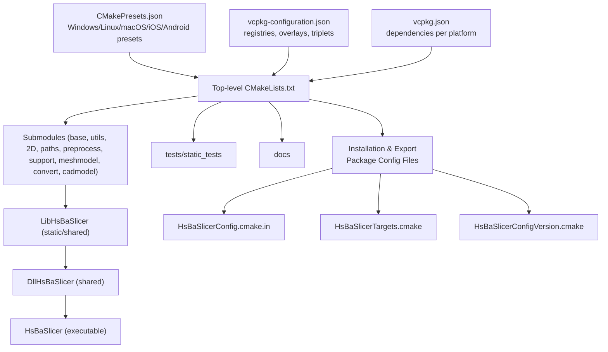

**Diagram sources**
- [CMakePresets.json:1-179](file://CMakePresets.json#L1-L179)
- [vcpkg-configuration.json:1-21](file://vcpkg-configuration.json#L1-L21)
- [vcpkg.json:1-93](file://vcpkg.json#L1-L93)
- [CMakeLists.txt:304-328](file://CMakeLists.txt#L304-L328)
- [cmake/HsBaSlicerConfig.cmake.in:1-16](file://cmake/HsBaSlicerConfig.cmake.in#L1-L16)

## Detailed Component Analysis

### Top-level CMake Configuration
Responsibilities:
- Set minimum CMake version, position-independent code, UTF-8 on MSVC.
- Configure C++20 and conditional C23.
- Run static feature checks and set compile definitions accordingly.
- Detect platform family and set desktop/mobile/console flags.
- Resolve third-party libraries via pkg-config and find_package.
- Toggle optional features (bit7z, dynamic loader, boolean ops, CAD kernel, SQL backends).
- Control BUILD_SHARED_LIBS based on VCPKG_TARGET_TRIPLET.
- Include subdirectories for all modules and optional tests/docs.
- **Unified output directories**: All binaries placed in `bin/<configuration>`.
- **Comprehensive installation**: Full CMake package configuration with export targets.

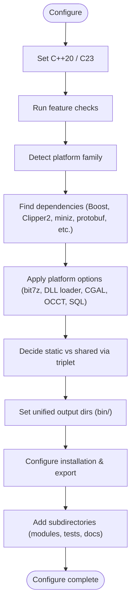

**Diagram sources**
- [CMakeLists.txt:1-107](file://CMakeLists.txt#L1-L107)
- [CMakeLists.txt:108-136](file://CMakeLists.txt#L108-L136)
- [CMakeLists.txt:138-237](file://CMakeLists.txt#L138-L237)
- [CMakeLists.txt:280-302](file://CMakeLists.txt#L280-L302)
- [CMakeLists.txt:304-328](file://CMakeLists.txt#L304-L328)
- [CMakeLists.txt:277-286](file://CMakeLists.txt#L277-L286)
- [CMakeLists.txt:345-457](file://CMakeLists.txt#L345-L457)

**Updated** Added unified output directory configuration and comprehensive installation support.

**Section sources**
- [CMakeLists.txt:1-107](file://CMakeLists.txt#L1-L107)
- [CMakeLists.txt:108-136](file://CMakeLists.txt#L108-L136)
- [CMakeLists.txt:138-237](file://CMakeLists.txt#L138-L237)
- [CMakeLists.txt:280-302](file://CMakeLists.txt#L280-L302)
- [CMakeLists.txt:304-328](file://CMakeLists.txt#L304-L328)
- [CMakeLists.txt:277-286](file://CMakeLists.txt#L277-L286)
- [CMakeLists.txt:345-457](file://CMakeLists.txt#L345-L457)

### CMake Presets and Toolchains
- Provides named presets for Windows, Linux, macOS, iOS, and Android.
- Uses Ninja as primary generator; Xcode for iOS.
- Integrates vcpkg toolchain file and sets binary/install directories under out/.
- Android preset configures NDK, ABI, API level, and CMAKE_SYSTEM_NAME.
- iOS preset targets arm64 with deployment target 16.3.
- **Consistent build directory structure**: All presets use `${sourceDir}/out/build/${presetName}`.

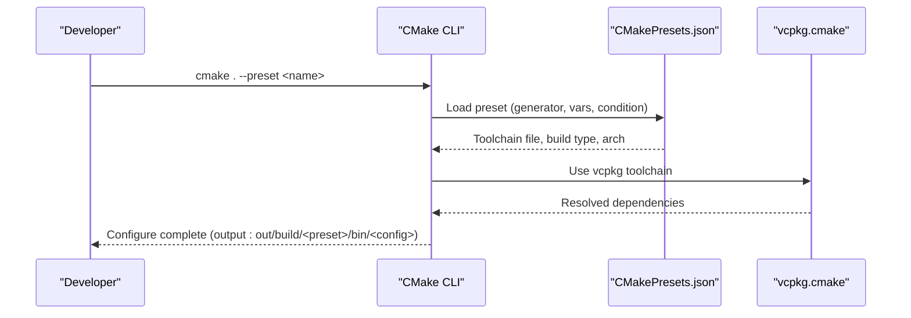

**Diagram sources**
- [CMakePresets.json:1-179](file://CMakePresets.json#L1-L179)

**Section sources**
- [CMakePresets.json:1-179](file://CMakePresets.json#L1-L179)

### vcpkg Integration and Dependencies
- Centralized dependency list with platform scoping and features.
- Registries include default git baseline and Microsoft artifact registry.
- Overlay ports and triplets allow local overrides.
- **Platform-specific dependencies**: Different dependency sets for desktop, mobile, and game console targets.

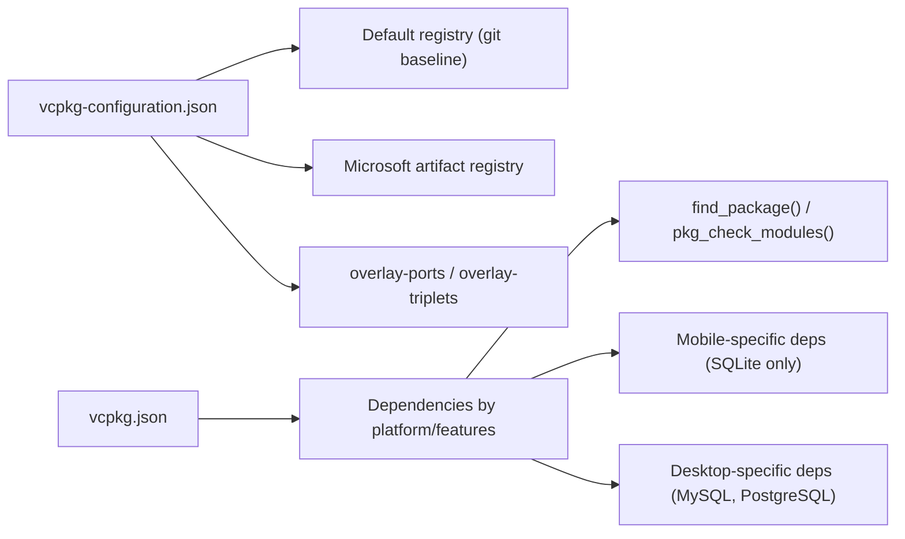

**Diagram sources**
- [vcpkg-configuration.json:1-21](file://vcpkg-configuration.json#L1-L21)
- [vcpkg.json:1-93](file://vcpkg.json#L1-L93)

**Updated** Enhanced platform-specific dependency management with mobile vs desktop configurations.

**Section sources**
- [vcpkg-configuration.json:1-21](file://vcpkg-configuration.json#L1-L21)
- [vcpkg.json:1-93](file://vcpkg.json#L1-L93)

### Installation and Package Configuration
**New** Comprehensive installation support with CMake package configuration:
- **Target export**: All libraries exported with `HsBaSlicer::` namespace.
- **Header installation**: Public headers installed to structured include directories.
- **Package config files**: Generated `HsBaSlicerConfig.cmake` and version files.
- **Dependency management**: Automatic dependency resolution via `find_dependency()`.
- **Cross-platform compatibility**: Proper handling of runtime/library/archive destinations.

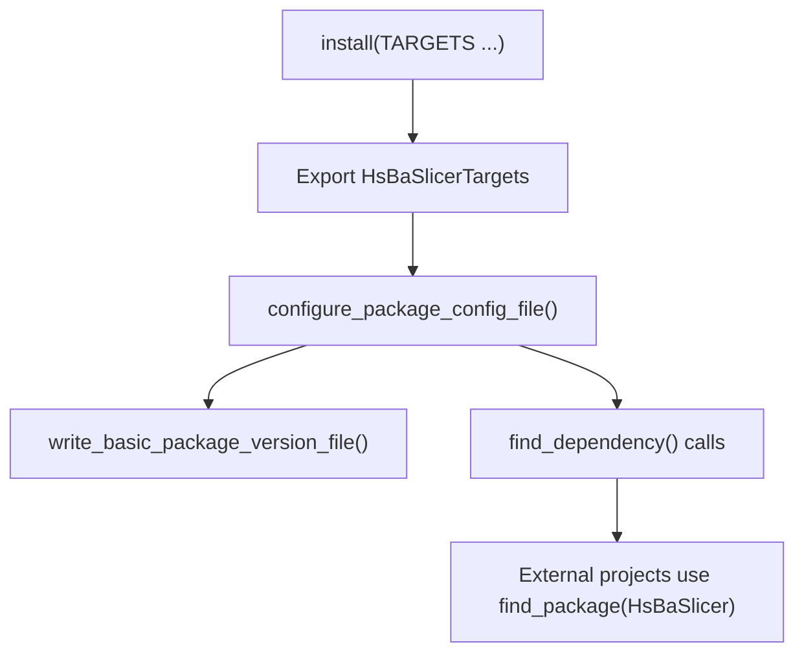

**Diagram sources**
- [CMakeLists.txt:345-457](file://CMakeLists.txt#L345-L457)
- [cmake/HsBaSlicerConfig.cmake.in:1-16](file://cmake/HsBaSlicerConfig.cmake.in#L1-L16)

**Section sources**
- [CMakeLists.txt:345-457](file://CMakeLists.txt#L345-L457)
- [cmake/HsBaSlicerConfig.cmake.in:1-16](file://cmake/HsBaSlicerConfig.cmake.in#L1-L16)

### Deployment Utilities
**New** Enhanced deployment support with specialized tools:
- **DLL deployment script**: `deploy_dlls.cmake` for copying PDB debug symbols.
- **Configuration-aware copying**: Automatically copies logcfg.ini to correct build configuration directory.
- **Conditional execution**: Skips missing files gracefully (Release mode may not generate PDBs).

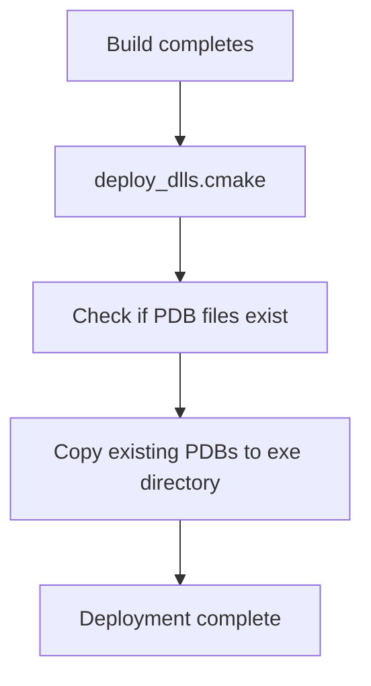

**Diagram sources**
- [cmake/deploy_dlls.cmake:1-27](file://cmake/deploy_dlls.cmake#L1-L27)

**Section sources**
- [cmake/deploy_dlls.cmake:1-27](file://cmake/deploy_dlls.cmake#L1-L27)
- [CMakeLists.txt:277-286](file://CMakeLists.txt#L277-L286)

### Module: base (HsBaSlicerBase)
- Static library providing core utilities, coroutine primitives, object pools, thread pool, units, reflection helpers.
- Links Eigen3 and Boost; locale/nowide excluded on mobile/console.
- Exposes magic_enum.
- **Platform-specific linking**: Conditional linking based on target platform capabilities.

```mermaid
classDiagram
class HsBaSlicerBase {
+Static library
+Coroutines (Task, Generator)
+Object/Thread/Memory pools
+Units, reflection, delegates
}
HsBaSlicerBase --> Eigen3 : : Eigen : "links"
HsBaSlicerBase --> Boost : : boost : "links"
HsBaSlicerBase --> magic_enum : : magic_enum : "links"
HsBaSlicerBase -. mobile .-> iconv : "iOS only"
```

**Diagram sources**
- [base/CMakeLists.txt:1-49](file://base/CMakeLists.txt#L1-L49)

**Updated** Enhanced platform-specific linking with iOS iconv support.

**Section sources**
- [base/CMakeLists.txt:1-49](file://base/CMakeLists.txt#L1-L49)

### Module: LibHsBaSlicer (Public API surface)
- Builds as static or shared depending on global BUILD_SHARED_LIBS.
- Includes Slice, Preprocess, Support, Fill, Path modules.
- Links against base, utils, mesh, 2D, preprocess, support, paths, and optionally CAD model.
- Applies precompiled headers and export macros when shared.
- **Conditional CAD model linking**: Only links CAD model on desktop platforms.

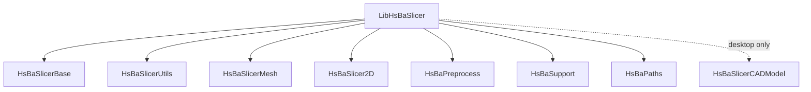

**Diagram sources**
- [LibHsBaSlicer/CMakeLists.txt:1-59](file://LibHsBaSlicer/CMakeLists.txt#L1-L59)

**Section sources**
- [LibHsBaSlicer/CMakeLists.txt:1-59](file://LibHsBaSlicer/CMakeLists.txt#L1-L59)

### Module: DllHsBaSlicer (System API)
- Shared library exposing C-compatible API for FDM pipeline.
- Links LibHsBaSlicer and underlying modules.
- Defines enums, structs, and functions for synchronous/asynchronous execution and progress callbacks.
- **Export macro configuration**: Properly configured for both static and shared builds.

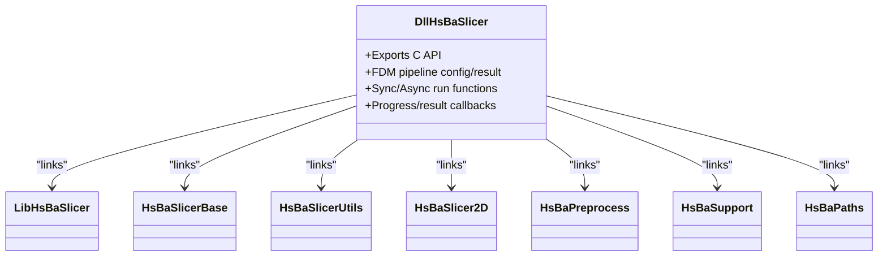

**Diagram sources**
- [DllHsBaSlicer/CMakeLists.txt:1-20](file://DllHsBaSlicer/CMakeLists.txt#L1-L20)
- [DllHsBaSlicer/fdm_pipeline.h:1-147](file://DllHsBaSlicer/fdm_pipeline.h#L1-L147)

**Section sources**
- [DllHsBaSlicer/CMakeLists.txt:1-20](file://DllHsBaSlicer/CMakeLists.txt#L1-L20)
- [DllHsBaSlicer/fdm_pipeline.h:1-147](file://DllHsBaSlicer/fdm_pipeline.h#L1-L147)

### Coroutines Foundation (Task/Generator)
- Provides Task<T>, Task<void>, CustomAllocatorTask, IExecutor, AsyncExecutor, NoopExecutor, DispatchAwaiter, and Generator<T>.
- Enables asynchronous pipelines with co_await semantics and completion callbacks.

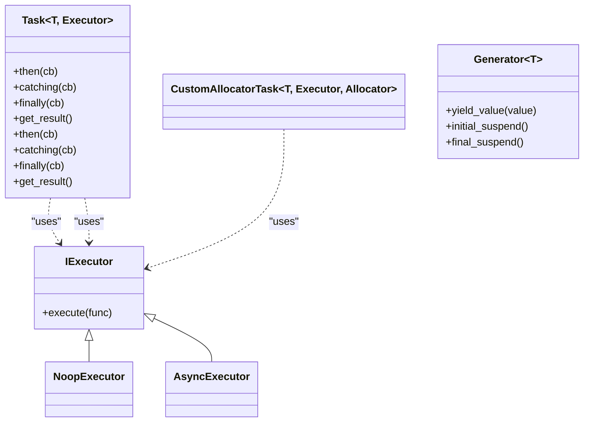

**Diagram sources**
- [base/coroutine.hpp:1-800](file://base/coroutine.hpp#L1-L800)

**Section sources**
- [base/coroutine.hpp:1-800](file://base/coroutine.hpp#L1-L800)

### Slice Interface (Existing)
- Exposes safe and unsafe slicing APIs returning polygonal layers at a given height.
- Also provides Lua-scripted variants.

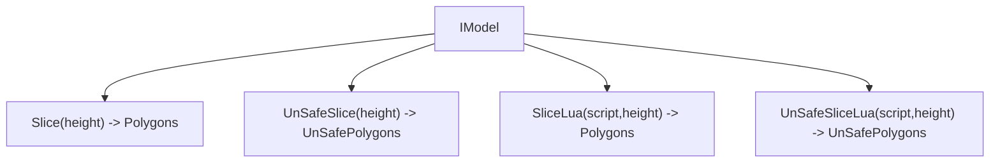

**Diagram sources**
- [LibHsBaSlicer/Slice/mesh_slice.hpp:1-28](file://LibHsBaSlicer/Slice/mesh_slice.hpp#L1-L28)

**Section sources**
- [LibHsBaSlicer/Slice/mesh_slice.hpp:1-28](file://LibHsBaSlicer/Slice/mesh_slice.hpp#L1-L28)

### FDM Pipeline API (C-compatible)
- Defines configuration struct, result struct, progress callback, and sync/async entry points.
- Intended to orchestrate preprocess -> slice -> support -> fill -> path generation internally.

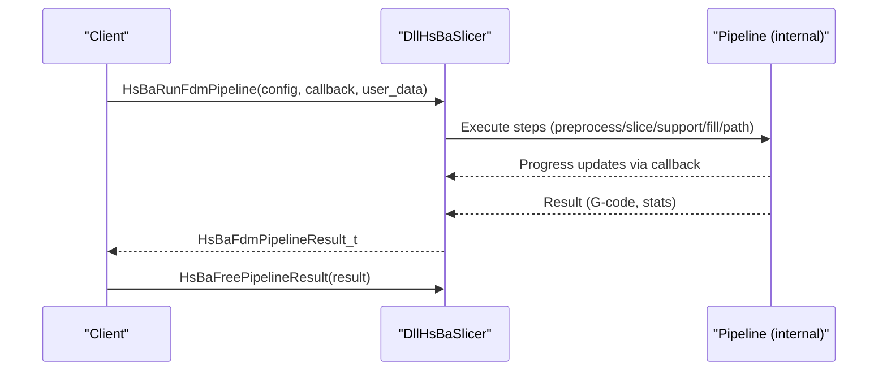

**Diagram sources**
- [DllHsBaSlicer/fdm_pipeline.h:1-147](file://DllHsBaSlicer/fdm_pipeline.h#L1-L147)

**Section sources**
- [DllHsBaSlicer/fdm_pipeline.h:1-147](file://DllHsBaSlicer/fdm_pipeline.h#L1-L147)

### Preprocessing and Support Primitives
- ModelLoader manages named models with automatic format selection and optional CGAL boolean/shell operations.
- FDM support implementations provide plane, tree, and honeycomb strategies.

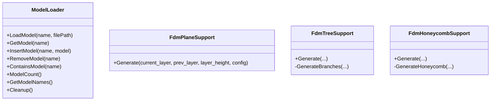

**Diagram sources**
- [preprocess/ModelLoader.hpp:1-131](file://preprocess/ModelLoader.hpp#L1-L131)
- [support/FdmSupport.hpp:1-63](file://support/FdmSupport.hpp#L1-L63)

**Section sources**
- [preprocess/ModelLoader.hpp:1-131](file://preprocess/ModelLoader.hpp#L1-L131)
- [support/FdmSupport.hpp:1-63](file://support/FdmSupport.hpp#L1-L63)

### Android Integration
- Gradle wrapper and app module configure namespace, SDK versions, ABI filters, and jniLibs directory.
- Native libraries are consumed from prebuilt artifacts produced by CMake presets.
- **Unified output consumption**: Gradle expects artifacts in standardized locations.

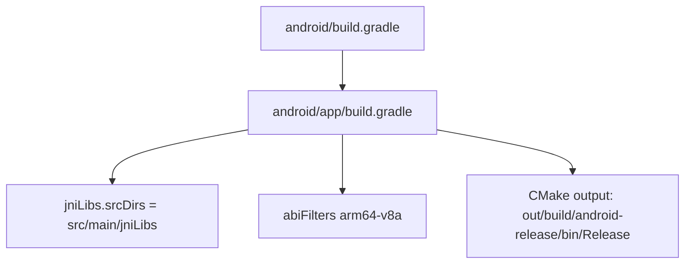

**Diagram sources**
- [android/build.gradle:1-17](file://android/build.gradle#L1-L17)
- [android/app/build.gradle:1-45](file://android/app/build.gradle#L1-L45)

**Section sources**
- [android/build.gradle:1-17](file://android/build.gradle#L1-L17)
- [android/app/build.gradle:1-45](file://android/app/build.gradle#L1-L45)

## Dependency Analysis
High-level linkage between major components:

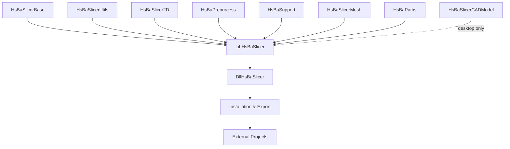

**Diagram sources**
- [LibHsBaSlicer/CMakeLists.txt:37-50](file://LibHsBaSlicer/CMakeLists.txt#L37-L50)
- [DllHsBaSlicer/CMakeLists.txt:12-20](file://DllHsBaSlicer/CMakeLists.txt#L12-L20)
- [CMakeLists.txt:345-457](file://CMakeLists.txt#L345-L457)

**Updated** Added installation and export layer for external project usage.

**Section sources**
- [LibHsBaSlicer/CMakeLists.txt:37-50](file://LibHsBaSlicer/CMakeLists.txt#L37-L50)
- [DllHsBaSlicer/CMakeLists.txt:12-20](file://DllHsBaSlicer/CMakeLists.txt#L12-L20)
- [CMakeLists.txt:345-457](file://CMakeLists.txt#L345-L457)

## Performance Considerations
- Boolean operations disabled in Debug builds to avoid high memory usage and slow CGAL/IGL performance.
- Model pool size reduced on constrained platforms (mobile/console) to limit memory footprint.
- Dynamic loader and bit7z disabled on non-desktop platforms to reduce runtime overhead and complexity.
- Prefer Release builds for production to optimize slicing and path generation throughput.
- **Game console optimizations**: Specific feature gating for console platforms to minimize resource usage.

**Updated** Added game console optimization considerations.

## Troubleshooting Guide
Common issues and resolutions:
- Missing C++20 support: Ensure compiler meets requirements; CMake enforces C++20 and will fail early if concepts/ranges/source_location are unavailable.
- vcpkg not found: Provide VCPKG_ROOT environment variable or pass -DCMAKE_TOOLCHAIN_FILE explicitly; verify vcpkg-configuration.json registries and baselines.
- Android build fails: Confirm ANDROID_NDK_HOME is set; use android-release preset; ensure ABI matches app module abiFilters.
- iOS build fails: Verify Xcode generator preset and deployment target >= 16.3; confirm arm64 architecture.
- Debug slowdowns: Switch to Release; boolean operations are intentionally disabled in Debug.
- **Installation issues**: Ensure proper CMake package configuration files are installed; check namespace usage (`HsBaSlicer::`).
- **Game console builds**: Verify VCPKG_TARGET_TRIPLET matches expected patterns (xbox, switch, playstation, stadia).
- **DLL deployment**: Use deploy_dlls.cmake script for PDB copying; ensure TARGET_BIN and PDB_FILES variables are set correctly.

**Updated** Added troubleshooting for installation, game console builds, and DLL deployment.

**Section sources**
- [CMakeLists.txt:17-38](file://CMakeLists.txt#L17-L38)
- [CMakeLists.txt:226-237](file://CMakeLists.txt#L226-L237)
- [CMakePresets.json:84-109](file://CMakePresets.json#L84-L109)
- [CMakePresets.json:153-176](file://CMakePresets.json#L153-L176)
- [android/app/build.gradle:39-41](file://android/app/build.gradle#L39-L41)
- [CMakeLists.txt:110-126](file://CMakeLists.txt#L110-L126)
- [cmake/deploy_dlls.cmake:1-27](file://cmake/deploy_dlls.cmake#L1-L27)

## Conclusion
The HsBaSlicer build system leverages modern CMake practices, vcpkg for dependency management, and platform presets to deliver a consistent, extensible, and efficient build across desktop and mobile environments. The recent overhaul introduces unified output directories, comprehensive installation support, and enhanced platform detection including game console targets. The modular design cleanly separates core utilities, geometry kernels, and pipeline stages, while the C-compatible API in DllHsBaSlicer exposes an ergonomic interface for higher-level applications. The new CMake package configuration enables seamless integration into external projects with proper dependency resolution.

## Appendices

### Quick Build Commands
- Windows (Release): Select windows-release preset and build.
- Linux (Release): cmake . --preset linux-release && cd out/build/linux-release && cmake --build .
- Android (arm64): cmake . --preset android-release && cd out/build/android-release && cmake ..
- iOS (arm64): cmake . --preset ios-release
- **Installation**: cmake --install out/build/windows-release --prefix ./install
- **External project usage**: find_package(HsBaSlicer REQUIRED) in consumer CMakeLists.txt

**Updated** Added installation and external project usage examples.

**Section sources**
- [README.md:47-194](file://README.md#L47-L194)
- [CMakePresets.json:1-179](file://CMakePresets.json#L1-L179)
- [CMakeLists.txt:345-457](file://CMakeLists.txt#L345-L457)

### CMake Package Configuration
**New** External projects can now easily integrate HsBaSlicer:

```cmake
# In your project's CMakeLists.txt
find_package(HsBaSlicer REQUIRED)

# Link against the exported targets
target_link_libraries(your_app PRIVATE HsBaSlicer::DllHsBaSlicer)

# Headers are automatically included via the package configuration
```

The package configuration automatically handles:
- Dependency resolution (Eigen3, magic_enum, Clipper2, Lua, Protobuf, OpenSSL)
- Target namespace (`HsBaSlicer::`)
- Cross-platform compatibility
- Version checking and compatibility

**Section sources**
- [cmake/HsBaSlicerConfig.cmake.in:1-16](file://cmake/HsBaSlicerConfig.cmake.in#L1-L16)
- [CMakeLists.txt:441-457](file://CMakeLists.txt#L441-L457)