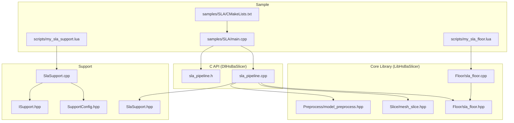
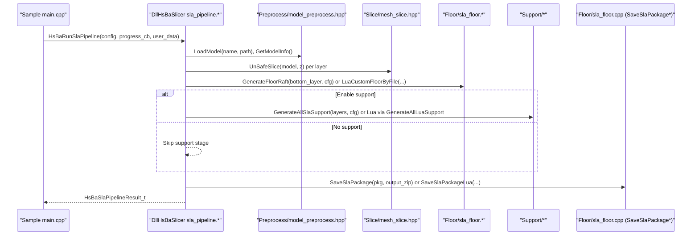
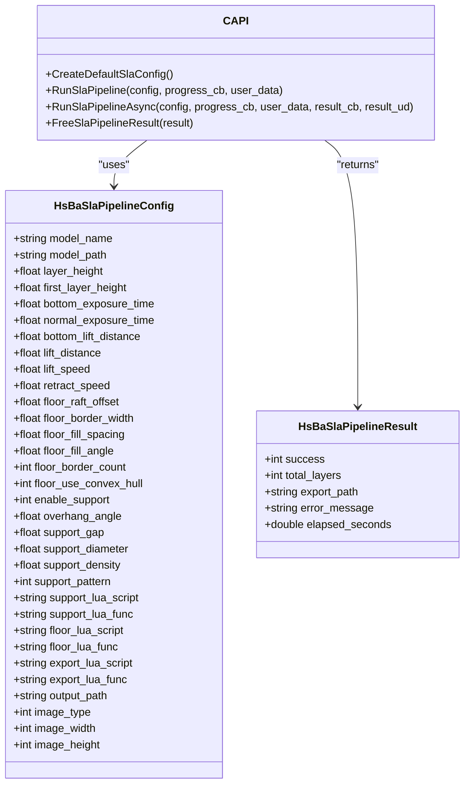
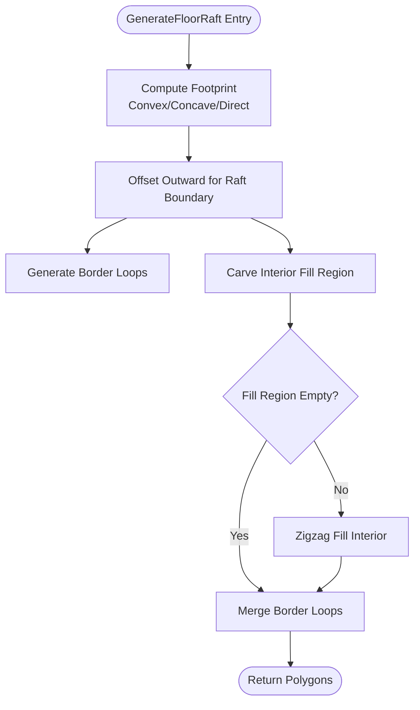
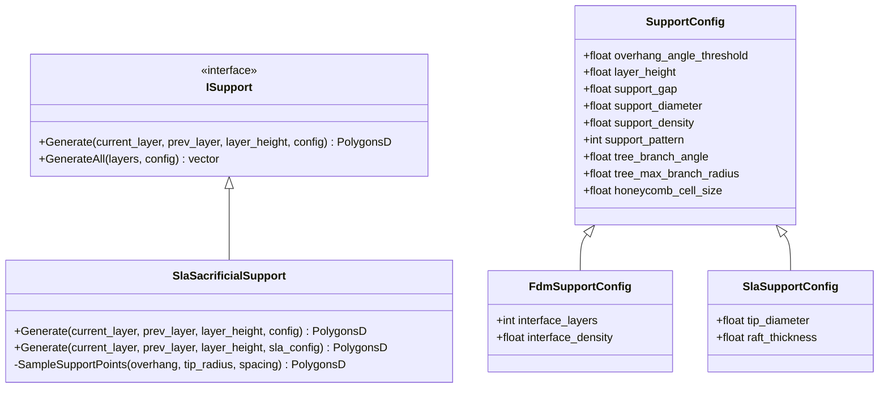
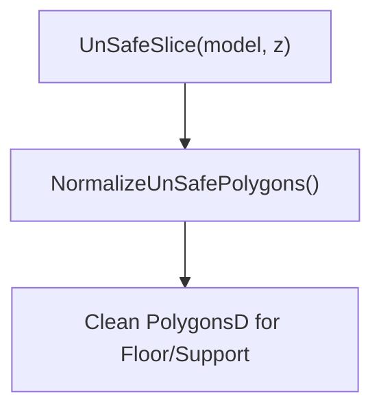
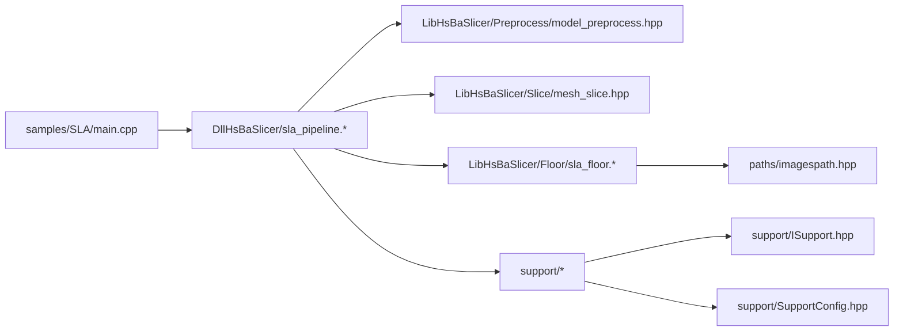

# SLA Sample Integration

<cite>
**Referenced Files in This Document**
- [samples/SLA/main.cpp](file://samples/SLA/main.cpp)
- [samples/SLA/CMakeLists.txt](file://samples/SLA/CMakeLists.txt)
- [samples/SLA/scripts/my_sla_floor.lua](file://samples/SLA/scripts/my_sla_floor.lua)
- [samples/SLA/scripts/my_sla_support.lua](file://samples/SLA/scripts/my_sla_support.lua)
- [DllHsBaSlicer/sla_pipeline.h](file://DllHsBaSlicer/sla_pipeline.h)
- [DllHsBaSlicer/sla_pipeline.cpp](file://DllHsBaSlicer/sla_pipeline.cpp)
- [LibHsBaSlicer/Floor/sla_floor.hpp](file://LibHsBaSlicer/Floor/sla_floor.hpp)
- [LibHsBaSlicer/Floor/sla_floor.cpp](file://LibHsBaSlicer/Floor/sla_floor.cpp)
- [support/SlaSupport.hpp](file://support/SlaSupport.hpp)
- [support/SlaSupport.cpp](file://support/SlaSupport.cpp)
- [support/ISupport.hpp](file://support/ISupport.hpp)
- [support/SupportConfig.hpp](file://support/SupportConfig.hpp)
- [LibHsBaSlicer/Slice/mesh_slice.hpp](file://LibHsBaSlicer/Slice/mesh_slice.hpp)
- [LibHsBaSlicer/Preprocess/model_preprocess.hpp](file://LibHsBaSlicer/Preprocess/model_preprocess.hpp)
</cite>

## Table of Contents
1. [Introduction](#introduction)
2. [Project Structure](#project-structure)
3. [Core Components](#core-components)
4. [Architecture Overview](#architecture-overview)
5. [Detailed Component Analysis](#detailed-component-analysis)
6. [Dependency Analysis](#dependency-analysis)
7. [Performance Considerations](#performance-considerations)
8. [Troubleshooting Guide](#troubleshooting-guide)
9. [Conclusion](#conclusion)
10. [Appendices](#appendices)

## Introduction
This document explains the SLA sample integration for HsBaSlicer, focusing on how to configure and run the SLA slicing pipeline via the C API, including synchronous and asynchronous execution, floor/raft generation, support generation, Lua customization, and zip export (config JSON + layer images). It also details the internal architecture from the C ABI down to LibHsBaSlicer modules and support generators.

## Project Structure
The SLA sample is a small executable that demonstrates usage of the DllHsBaSlicer C API. The runtime pipeline composes several LibHsBaSlicer components: model preprocessing, mesh slicing, floor/raft generation, support generation, and package export.

**Diagram sources**
- [samples/SLA/main.cpp](file://samples/SLA/main.cpp)
- [samples/SLA/CMakeLists.txt](file://samples/SLA/CMakeLists.txt)
- [samples/SLA/scripts/my_sla_floor.lua](file://samples/SLA/scripts/my_sla_floor.lua)
- [samples/SLA/scripts/my_sla_support.lua](file://samples/SLA/scripts/my_sla_support.lua)
- [DllHsBaSlicer/sla_pipeline.h](file://DllHsBaSlicer/sla_pipeline.h)
- [DllHsBaSlicer/sla_pipeline.cpp](file://DllHsBaSlicer/sla_pipeline.cpp)
- [LibHsBaSlicer/Floor/sla_floor.hpp](file://LibHsBaSlicer/Floor/sla_floor.hpp)
- [LibHsBaSlicer/Floor/sla_floor.cpp](file://LibHsBaSlicer/Floor/sla_floor.cpp)
- [support/SlaSupport.hpp](file://support/SlaSupport.hpp)
- [support/SlaSupport.cpp](file://support/SlaSupport.cpp)
- [support/ISupport.hpp](file://support/ISupport.hpp)
- [support/SupportConfig.hpp](file://support/SupportConfig.hpp)
- [LibHsBaSlicer/Slice/mesh_slice.hpp](file://LibHsBaSlicer/Slice/mesh_slice.hpp)
- [LibHsBaSlicer/Preprocess/model_preprocess.hpp](file://LibHsBaSlicer/Preprocess/model_preprocess.hpp)

**Section sources**
- [samples/SLA/main.cpp](file://samples/SLA/main.cpp)
- [samples/SLA/CMakeLists.txt](file://samples/SLA/CMakeLists.txt)

## Core Components
- C API entry points:
  - Create default configuration
  - Run synchronous pipeline with progress callback
  - Run asynchronous pipeline with completion callback
  - Free result memory
- Internal pipeline stages:
  - Model loading and info extraction
  - Layer slicing and normalization
  - Floor/raft generation (built-in or Lua)
  - Support generation (built-in or Lua)
  - Export to zip (config.json + images)
- Floor module:
  - Contact area, border, fill, raft generation
  - Lua-based custom floor generation
  - Image rendering and package export
- Support module:
  - Abstract interface for support generators
  - SLA sacrificial support generator
  - Configuration structures for FDM/SLA

**Section sources**
- [DllHsBaSlicer/sla_pipeline.h](file://DllHsBaSlicer/sla_pipeline.h)
- [DllHsBaSlicer/sla_pipeline.cpp](file://DllHsBaSlicer/sla_pipeline.cpp)
- [LibHsBaSlicer/Floor/sla_floor.hpp](file://LibHsBaSlicer/Floor/sla_floor.hpp)
- [LibHsBaSlicer/Floor/sla_floor.cpp](file://LibHsBaSlicer/Floor/sla_floor.cpp)
- [support/ISupport.hpp](file://support/ISupport.hpp)
- [support/SupportConfig.hpp](file://support/SupportConfig.hpp)
- [support/SlaSupport.hpp](file://support/SlaSupport.hpp)
- [support/SlaSupport.cpp](file://support/SlaSupport.cpp)

## Architecture Overview
The SLA sample integrates the C API with the core library to provide a complete workflow from model input to packaged output.

**Diagram sources**
- [samples/SLA/main.cpp](file://samples/SLA/main.cpp)
- [DllHsBaSlicer/sla_pipeline.cpp](file://DllHsBaSlicer/sla_pipeline.cpp)
- [LibHsBaSlicer/Preprocess/model_preprocess.hpp](file://LibHsBaSlicer/Preprocess/model_preprocess.hpp)
- [LibHsBaSlicer/Slice/mesh_slice.hpp](file://LibHsBaSlicer/Slice/mesh_slice.hpp)
- [LibHsBaSlicer/Floor/sla_floor.hpp](file://LibHsBaSlicer/Floor/sla_floor.hpp)
- [LibHsBaSlicer/Floor/sla_floor.cpp](file://LibHsBaSlicer/Floor/sla_floor.cpp)
- [support/SlaSupport.hpp](file://support/SlaSupport.hpp)
- [support/SlaSupport.cpp](file://support/SlaSupport.cpp)

## Detailed Component Analysis

### C API and Pipeline Orchestration
- Configuration struct defines all parameters for slicing, exposure, floor/raft, support, Lua hooks, and image export options.
- Result struct carries success flag, total layers, exported zip path, error message, and elapsed time; caller must free strings via provided free function.
- Synchronous API wraps an internal coroutine-based async task and blocks until completion.
- Asynchronous API returns immediately and invokes a result callback when done.

**Diagram sources**
- [DllHsBaSlicer/sla_pipeline.h](file://DllHsBaSlicer/sla_pipeline.h)
- [DllHsBaSlicer/sla_pipeline.cpp](file://DllHsBaSlicer/sla_pipeline.cpp)

**Section sources**
- [DllHsBaSlicer/sla_pipeline.h](file://DllHsBaSlicer/sla_pipeline.h)
- [DllHsBaSlicer/sla_pipeline.cpp](file://DllHsBaSlicer/sla_pipeline.cpp)

### Floor and Raft Generation
- Built-in functions compute contact footprint, borders, fills, and full raft using polygon offsetting and zigzag infill.
- Lua customization allows replacing floor logic by providing a script file and function name; the environment exposes polygon operations and fill utilities.
- Package export renders polygons to images and packages them into a zip with config.json.

**Diagram sources**
- [LibHsBaSlicer/Floor/sla_floor.cpp](file://LibHsBaSlicer/Floor/sla_floor.cpp)
- [LibHsBaSlicer/Floor/sla_floor.hpp](file://LibHsBaSlicer/Floor/sla_floor.hpp)

**Section sources**
- [LibHsBaSlicer/Floor/sla_floor.hpp](file://LibHsBaSlicer/Floor/sla_floor.hpp)
- [LibHsBaSlicer/Floor/sla_floor.cpp](file://LibHsBaSlicer/Floor/sla_floor.cpp)

### Support Generation (SLA Sacrificial)
- Abstract interface ISupport defines a common Generate method across implementations.
- SLA sacrificial support detects overhang regions between current and previous layers, applies gap, samples support points, and unions circles to form cross-sections.
- Configuration distinguishes general, FDM-specific, and SLA-specific fields.

**Diagram sources**
- [support/ISupport.hpp](file://support/ISupport.hpp)
- [support/SupportConfig.hpp](file://support/SupportConfig.hpp)
- [support/SlaSupport.hpp](file://support/SlaSupport.hpp)
- [support/SlaSupport.cpp](file://support/SlaSupport.cpp)

**Section sources**
- [support/ISupport.hpp](file://support/ISupport.hpp)
- [support/SupportConfig.hpp](file://support/SupportConfig.hpp)
- [support/SlaSupport.hpp](file://support/SlaSupport.hpp)
- [support/SlaSupport.cpp](file://support/SlaSupport.cpp)

### Mesh Slicing and Normalization
- Unsafe slice returns raw contours (may include open polylines); normalization filters invalid geometry and converts to double precision for downstream processing.

**Diagram sources**
- [LibHsBaSlicer/Slice/mesh_slice.hpp](file://LibHsBaSlicer/Slice/mesh_slice.hpp)

**Section sources**
- [LibHsBaSlicer/Slice/mesh_slice.hpp](file://LibHsBaSlicer/Slice/mesh_slice.hpp)

### Model Preprocessing
- Provides model loading into an internal pool, retrieval, transforms, and queries for bounding box and volume used to compute layer counts and Z offsets.

**Section sources**
- [LibHsBaSlicer/Preprocess/model_preprocess.hpp](file://LibHsBaSlicer/Preprocess/model_preprocess.hpp)

### Sample Usage and Build
- The sample demonstrates four scenarios: basic pipeline, custom parameters, Lua customization, and asynchronous execution.
- CMake builds an executable on desktop platforms and a static library on mobile; it copies required resources (model and scripts) next to the binary.

**Section sources**
- [samples/SLA/main.cpp](file://samples/SLA/main.cpp)
- [samples/SLA/CMakeLists.txt](file://samples/SLA/CMakeLists.txt)

### Lua Customization
- Floor script example shows convex hull selection, raft offset, border generation, and zigzag fill.
- Support script example demonstrates overhang detection, built-in SLA support generator, and optional filtering by area.

**Section sources**
- [samples/SLA/scripts/my_sla_floor.lua](file://samples/SLA/scripts/my_sla_floor.lua)
- [samples/SLA/scripts/my_sla_support.lua](file://samples/SLA/scripts/my_sla_support.lua)

## Dependency Analysis
The SLA pipeline depends on multiple modules. The following diagram highlights key relationships.

**Diagram sources**
- [samples/SLA/main.cpp](file://samples/SLA/main.cpp)
- [DllHsBaSlicer/sla_pipeline.cpp](file://DllHsBaSlicer/sla_pipeline.cpp)
- [LibHsBaSlicer/Preprocess/model_preprocess.hpp](file://LibHsBaSlicer/Preprocess/model_preprocess.hpp)
- [LibHsBaSlicer/Slice/mesh_slice.hpp](file://LibHsBaSlicer/Slice/mesh_slice.hpp)
- [LibHsBaSlicer/Floor/sla_floor.hpp](file://LibHsBaSlicer/Floor/sla_floor.hpp)
- [LibHsBaSlicer/Floor/sla_floor.cpp](file://LibHsBaSlicer/Floor/sla_floor.cpp)
- [support/ISupport.hpp](file://support/ISupport.hpp)
- [support/SupportConfig.hpp](file://support/SupportConfig.hpp)

**Section sources**
- [DllHsBaSlicer/sla_pipeline.cpp](file://DllHsBaSlicer/sla_pipeline.cpp)
- [LibHsBaSlicer/Floor/sla_floor.cpp](file://LibHsBaSlicer/Floor/sla_floor.cpp)

## Performance Considerations
- Prefer unsafe slicing followed by normalization for robustness when generating SLA layers.
- Use appropriate layer height and first layer height to balance quality and speed.
- Disable support if not needed to reduce computation.
- Choose PNG for lossless quality or JPEG for smaller files; SVG is scalable but may be larger.
- For large models, consider reducing image resolution or enabling only necessary outputs (floor/support images).

## Troubleshooting Guide
Common issues and remedies:
- Model load failures: verify model path and format; ensure the model exists at runtime.
- Invalid model height: check model orientation and bounds; adjust first layer height relative to model size.
- Export failures: confirm write permissions and valid output path; ensure temporary directory access for image rendering.
- Lua errors: validate script paths and function names; ensure required libraries are available in the Lua environment.
- Memory leaks: always call the free function for pipeline results after use.

**Section sources**
- [DllHsBaSlicer/sla_pipeline.cpp](file://DllHsBaSlicer/sla_pipeline.cpp)
- [LibHsBaSlicer/Floor/sla_floor.cpp](file://LibHsBaSlicer/Floor/sla_floor.cpp)

## Conclusion
The SLA sample provides a clear, extensible integration path for resin printing workflows. By leveraging the C API and modular LibHsBaSlicer components, users can customize floor and support generation via Lua, control image formats, and choose synchronous or asynchronous execution modes. The design emphasizes clarity, configurability, and performance while maintaining cross-platform compatibility.

## Appendices

### Example Workflows
- Basic pipeline: create default config, set model and output, run synchronously, handle result.
- Custom parameters: tune layer heights, exposure times, lift/retract speeds, floor/raft dimensions, and support density/pattern.
- Lua customization: supply floor and support scripts with specific function names; rely on built-in export otherwise.
- Async pipeline: start non-blocking run, poll completion flag or integrate event loop, then process result.

**Section sources**
- [samples/SLA/main.cpp](file://samples/SLA/main.cpp)