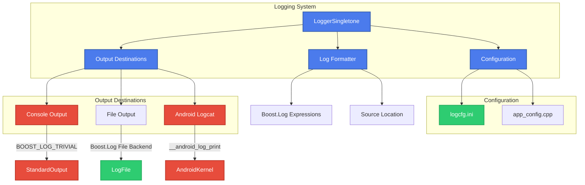
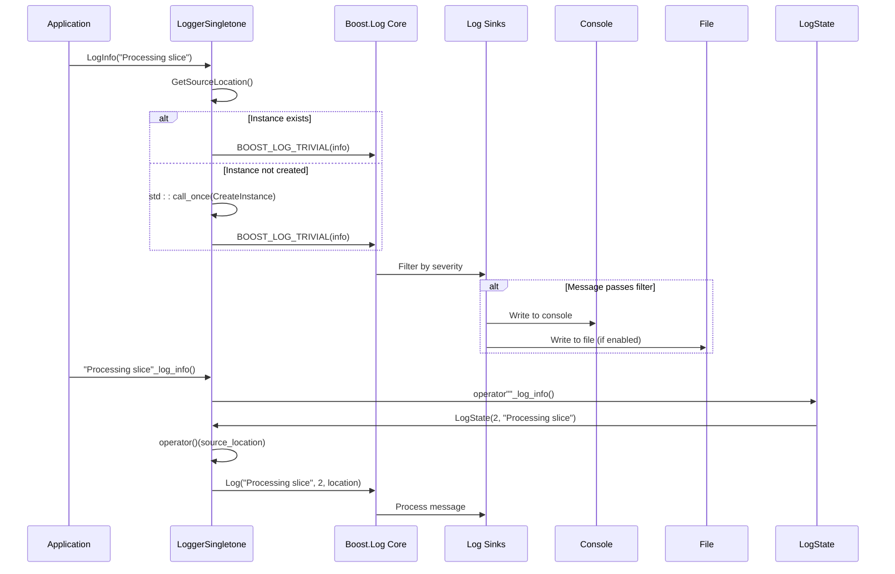
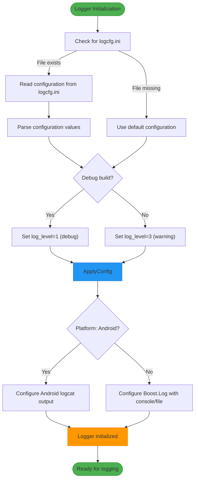
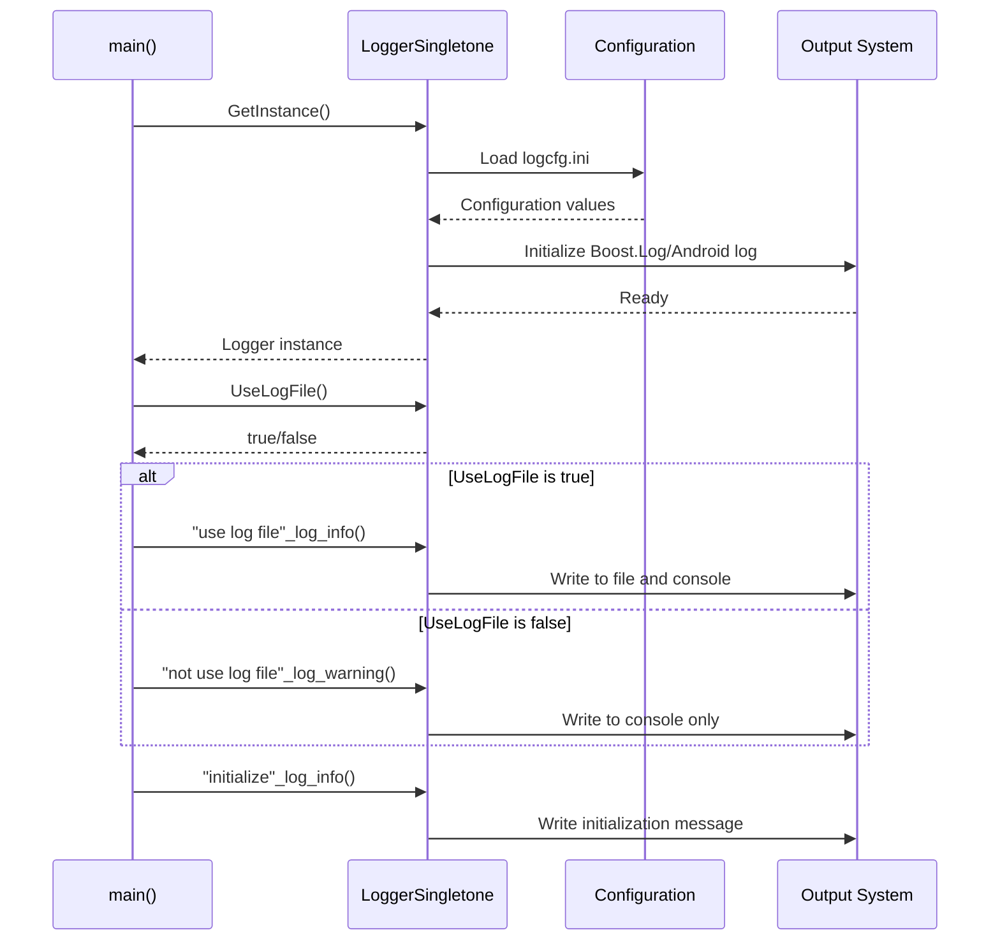
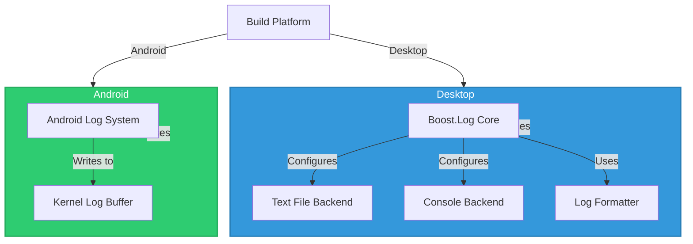

# Logging System

<cite>
**Referenced Files in This Document**   
- [logger.cpp](file://logger/logger.cpp)
- [logger.hpp](file://logger/logger.hpp)
- [logcfg.ini](file://utils/logcfg.ini)
- [app_config.cpp](file://utils/app_config.cpp)
- [singleton.hpp](file://base/singleton.hpp)
- [HsBaSlicer.cpp](file://HsBaSlicer/HsBaSlicer.cpp)
- [CMakeLists.txt](file://logger/CMakeLists.txt)
</cite>

## Table of Contents
1. [Introduction](#introduction)
2. [Core Components](#core-components)
3. [Architecture Overview](#architecture-overview)
4. [Detailed Component Analysis](#detailed-component-analysis)
5. [Configuration System](#configuration-system)
6. [Usage Patterns](#usage-patterns)
7. [Platform-Specific Adaptations](#platform-specific-adaptations)
8. [Performance Considerations](#performance-considerations)
9. [Integration with Slicing Operations](#integration-with-slicing-operations)
10. [Best Practices](#best-practices)

## Introduction
The Logging System in HsBaSlicer provides a comprehensive solution for application monitoring, debugging, and operational visibility. Built on Boost.Log with platform-specific adaptations for Android, the system offers flexible log output destinations, configurable log levels, and automatic source location tracking. The implementation follows the singleton pattern for global access while maintaining thread safety through shared mutexes. This documentation details the architecture, configuration, and usage patterns of the logging system, with emphasis on its role in monitoring slicing operations and supporting cross-platform deployment.

## Core Components

The logging system consists of several key components that work together to provide a robust logging solution. The core functionality is implemented in the LoggerSingletone class, which manages log configuration, formatting, and output. The system supports multiple log levels (trace, debug, info, warning, error, fatal) with configurable filtering based on severity. Log messages are automatically enriched with source location information including file name, line number, and function name. The implementation provides both traditional function-based logging and C++14 user-defined literals for more concise log message generation.

**Section sources**
- [logger.cpp](file://logger/logger.cpp#L23-L325)
- [logger.hpp](file://logger/logger.hpp#L17-L69)

## Architecture Overview



**Diagram sources**
- [logger.cpp](file://logger/logger.cpp#L5-L139)
- [logger.hpp](file://logger/logger.hpp#L17-L47)

## Detailed Component Analysis

### LoggerSingletone Implementation
The LoggerSingletone class implements the singleton pattern to provide global access to the logging system while ensuring thread-safe initialization. The implementation uses std::call_once with std::once_flag to guarantee that the logger is initialized exactly once, even in multi-threaded environments. The logger instance is stored as a static shared_ptr, allowing for shared ownership and automatic cleanup. The class provides both static methods for direct logging and instance methods for configuration queries.

```mermaid
classDiagram
class LoggerSingletone {
+static std : : shared_ptr~LoggerSingletone~ instance_
+static std : : shared_mutex mutex_
+static std : : once_flag instance_flag_
+static std : : shared_ptr~LoggerSingletone~ GetInstance()
+static std : : shared_ptr~LoggerSingletone~ CreateInstance()
+bool UseLogFile()
+static void Log(string_view, int, source_location)
+static void LogDebug(string_view, source_location)
+static void LogInfo(string_view, source_location)
+static void LogWarning(string_view, source_location)
+static void LogError(string_view, source_location)
}
class LogState {
+int log_lv_
+string message_
+LogState(int, string_view)
+~LogState()
+void operator()(source_location)
}
class Private {
}
LoggerSingletone : Private Private Constructor
LoggerSingletone : LoggerSingletone(Private) Constructor
LoggerSingletone : LoggerSingletone(const LoggerSingletone&) = delete
LoggerSingletone : LoggerSingletone& operator=(const LoggerSingletone&) = delete
LoggerSingletone : LoggerSingletone(LoggerSingletone&&) = delete
LoggerSingletone : LoggerSingletone& operator=(LoggerSingletone&&) = delete
LoggerSingletone --> Private : Private Constructor
LoggerSingletone "1" --> "1" LogState : Uses
namespace LogLiterals {
LogState operator""_log_debug(char*, size_t)
LogState operator""_log_info(char*, size_t)
LogState operator""_log_warning(char*, size_t)
LogState operator""_log_error(char*, size_t)
}
classDef classType fill : #4B7BEC,stroke : #3860B0,stroke-width : 2px,color : white;
classDef method fill : #3498DB,stroke : #2980B9,stroke-width : 1px,color : white;
classDef property fill : #2ECC71,stroke : #27AE60,stroke-width : 1px,color : white;
class LoggerSingletone,LogState,Private classType
```

**Diagram sources**
- [logger.cpp](file://logger/logger.cpp#L73-L325)
- [logger.hpp](file://logger/logger.hpp#L17-L69)

**Section sources**
- [logger.cpp](file://logger/logger.cpp#L73-L325)
- [logger.hpp](file://logger/logger.hpp#L17-L69)

### Log Message Generation and Filtering
The logging system provides multiple mechanisms for generating log messages with automatic source location capture. The primary interface consists of static methods (LogDebug, LogInfo, LogWarning, LogError) that accept message strings and optional source_location parameters. Additionally, the system implements C++14 user-defined literals through the LogLiterals inline namespace, allowing for concise log statements like "message"_log_info(). Log filtering is implemented at the Boost.Log core level, where messages below the configured severity threshold are automatically discarded before processing.



**Diagram sources**
- [logger.cpp](file://logger/logger.cpp#L163-L282)
- [logger.hpp](file://logger/logger.hpp#L48-L68)

**Section sources**
- [logger.cpp](file://logger/logger.cpp#L163-L312)
- [logger.hpp](file://logger/logger.hpp#L48-L68)

## Configuration System

The logging system's behavior is controlled through a hierarchical configuration system that combines compile-time defaults, runtime configuration files, and platform-specific settings. The primary configuration file logcfg.ini contains key parameters such as log level, file output settings, and timestamp formatting. During initialization, the logger attempts to load this configuration from the current working directory. If the file is not found, default values are used based on the build configuration (debug vs. release).



**Diagram sources**
- [logger.cpp](file://logger/logger.cpp#L74-L143)
- [logcfg.ini](file://utils/logcfg.ini#L1-L8)

**Section sources**
- [logger.cpp](file://logger/logger.cpp#L74-L143)
- [logcfg.ini](file://utils/logcfg.ini#L1-L8)

### Configuration Parameters
The following table outlines the key configuration parameters used by the logging system:

| Parameter | Path in logcfg.ini | Default (Debug) | Default (Release) | Description |
|---------|-------------------|----------------|------------------|------------|
| Log Level | log.log_level_debug | 1 (debug) | N/A | Severity threshold for debug builds |
| Log Level | log.log_level | N/A | 3 (warning) | Severity threshold for release builds |
| Use Log File | log.use_log_file | false | false | Enable file output |
| Log File Path | log.log_file | /log/log.txt | /log/log.txt | Relative path for log file |
| Datetime Format | log_format.log_datatime_format | %Y-%m-%d %H:%M:%S | %Y-%m-%d %H:%M:%S | Timestamp format string |

**Section sources**
- [logger.cpp](file://logger/logger.cpp#L89-L112)
- [logcfg.ini](file://utils/logcfg.ini#L1-L8)

## Usage Patterns

The logging system is designed to be used throughout the application for monitoring, debugging, and error reporting. The main application entry point demonstrates the typical usage pattern, where the logger instance is obtained and basic status messages are logged during initialization. The system supports both explicit method calls and the more concise user-defined literal syntax, providing flexibility for different use cases.



**Diagram sources**
- [HsBaSlicer.cpp](file://HsBaSlicer/HsBaSlicer.cpp#L10-L22)
- [logger.cpp](file://logger/logger.cpp#L156-L162)

**Section sources**
- [HsBaSlicer.cpp](file://HsBaSlicer/HsBaSlicer.cpp#L1-L25)

## Platform-Specific Adaptations

The logging system implements platform-specific adaptations to ensure optimal performance and integration on different target platforms. The primary distinction is between desktop platforms (Windows, Linux, macOS) and Android, with conditional compilation directives controlling the implementation path. On desktop platforms, the system leverages Boost.Log for comprehensive logging capabilities, while on Android it uses the native __android_log_print function to integrate with the Android logging system.



**Diagram sources**
- [logger.cpp](file://logger/logger.cpp#L5-L17)
- [logger.cpp](file://logger/logger.cpp#L139-L143)
- [CMakeLists.txt](file://logger/CMakeLists.txt#L35-L48)

**Section sources**
- [logger.cpp](file://logger/logger.cpp#L5-L17)
- [logger.cpp](file://logger/logger.cpp#L139-L143)
- [CMakeLists.txt](file://logger/CMakeLists.txt#L35-L48)

### Android Integration Details
When building for Android, the logging system adapts to use the Android logging framework through the __android_log_print function. This integration provides several advantages:

1. **System Integration**: Log messages appear in the Android logcat system, making them accessible through standard Android development tools.
2. **Performance**: Direct kernel log access provides low-overhead logging suitable for mobile devices.
3. **Filtering**: Android's built-in log filtering capabilities can be used to manage log output.
4. **Battery Efficiency**: The system-level logging service manages log buffering and flushing to optimize battery usage.

The implementation maps the internal log levels to Android's priority levels (VERBOSE, DEBUG, INFO, WARN, ERROR, FATAL) and automatically includes the application tag "HsBaSlicer" in all log messages for easy filtering.

**Section sources**
- [logger.cpp](file://logger/logger.cpp#L16-L17)
- [logger.cpp](file://logger/logger.cpp#L53-L70)
- [logger.cpp](file://logger/logger.cpp#L139-L143)

## Performance Considerations

The logging system has been designed with performance in mind, particularly for use in compute-intensive slicing operations. Several optimization strategies are employed to minimize the overhead of logging while maintaining functionality:

1. **Lazy Initialization**: The logger instance is created only when first accessed, reducing startup overhead.
2. **Compile-Time Filtering**: Log messages below the configured severity level are filtered out at the Boost.Log core level, avoiding string formatting for discarded messages.
3. **Conditional Compilation**: Platform-specific code paths eliminate unnecessary dependencies and function calls.
4. **Asynchronous Considerations**: While the current implementation is synchronous, the Boost.Log framework supports asynchronous sinks which could be leveraged for further performance improvements.

The use of std::string_view for message parameters avoids unnecessary string copying, and the source_location feature (available in C++20) provides automatic location information without runtime overhead beyond what would be needed for manual specification.

**Section sources**
- [logger.cpp](file://logger/logger.cpp#L137-L138)
- [logger.cpp](file://logger/logger.cpp#L166-L171)
- [logger.hpp](file://logger/logger.hpp#L21-L25)

## Integration with Slicing Operations

While the current codebase shows limited direct logging within the slicing operations themselves, the architecture is designed to support comprehensive monitoring of the slicing process. The global accessibility of the LoggerSingletone enables logging from any component involved in slicing, including mesh processing, path generation, and file output operations.

Potential integration points for logging in slicing operations include:
- **Slice Start/End**: Log the beginning and completion of slicing operations with timing information
- **Layer Processing**: Log progress through individual layers, including height and processing time
- **Error Conditions**: Log mesh validation failures, self-intersections, or other geometric issues
- **Performance Metrics**: Log memory usage, computation time, and other performance indicators
- **Configuration Changes**: Log changes to slicing parameters or algorithm selections

The user-defined literal syntax ("message"_log_info()) provides a concise way to add logging statements during development and debugging, which can be easily removed or disabled in production builds by adjusting the log level threshold.

**Section sources**
- [mesh_slice.cpp](file://LibHsBaSlicer/Slice/mesh_slice.cpp#L1-L27)
- [logger.cpp](file://logger/logger.cpp#L240-L282)
- [HsBaSlicer.cpp](file://HsBaSlicer/HsBaSlicer.cpp#L10-L22)

## Best Practices

To effectively use the logging system in HsBaSlicer, the following best practices are recommended:

1. **Use Appropriate Log Levels**: Reserve trace and debug levels for detailed debugging information, info for normal operational messages, warning for recoverable issues, and error/fatal for critical problems.
2. **Include Contextual Information**: When logging messages, include sufficient context to understand the situation without needing to consult other logs.
3. **Avoid Sensitive Information**: Never log passwords, API keys, or other sensitive data.
4. **Use Consistent Formatting**: Follow a consistent format for similar types of messages to make logs easier to parse and analyze.
5. **Consider Performance**: In performance-critical sections, avoid expensive operations in log message construction when the message will be filtered out.
6. **Use User-Defined Literals for Simple Messages**: For simple, static messages, use the "_log_info() syntax for cleaner code.
7. **Test Configuration Changes**: Verify that log configuration changes work as expected across different build configurations and platforms.

The logging system's configuration file (logcfg.ini) should be version-controlled to ensure consistent behavior across development and deployment environments, with sensitive information excluded or parameterized as needed.

**Section sources**
- [logcfg.ini](file://utils/logcfg.ini#L1-L8)
- [logger.cpp](file://logger/logger.cpp#L34-L49)
- [logger.cpp](file://logger/logger.cpp#L53-L68)
- [HsBaSlicer.cpp](file://HsBaSlicer/HsBaSlicer.cpp#L13-L22)