# CAD Model Processing

<cite>
**Referenced Files in This Document**   
- [OcctModel.hpp](file://cadmodel/OcctModel.hpp)
- [OcctModel.cpp](file://cadmodel/OcctModel.cpp)
- [IModel.hpp](file://base/IModel.hpp)
- [ModelFormat.hpp](file://base/ModelFormat.hpp)
- [ModelFormat.cpp](file://base/ModelFormat.cpp)
- [mesh_slice.hpp](file://LibHsBaSlicer/Slice/mesh_slice.hpp)
- [mesh_slice.cpp](file://LibHsBaSlicer/Slice/mesh_slice.cpp)
- [FullTopoModel.hpp](file://meshmodel/FullTopoModel.hpp)
- [IglModel.hpp](file://meshmodel/IglModel.hpp)
- [CMakeLists.txt](file://CMakeLists.txt)
- [cadmodel/CMakeLists.txt](file://cadmodel/CMakeLists.txt)
- [tests/Models/occt_model_test.cpp](file://tests/Models/occt_model_test.cpp)
</cite>

## Update Summary
**Changes Made**   
- Added VRML and BRep format support with ReadVRML/WriteVRML and ReadBRep/WriteBRep methods
- Implemented new static creation methods for primitive shapes (CreateBox, CreateSphere, CreateCylinder, CreateCone, CreateTorus)
- Added prime surface creation from input polygons via CreatePrime methods
- Enhanced model format detection and handling in Load/Save operations
- Updated boolean operations and thick solid functionality

## Table of Contents
1. [Introduction](#introduction)
2. [Architecture Overview](#architecture-overview)
3. [Core Components](#core-components)
4. [Detailed Component Analysis](#detailed-component-analysis)
5. [Integration with Slicing Engine](#integration-with-slicing-engine)
6. [Performance Characteristics](#performance-characteristics)
7. [Usage Examples](#usage-examples)
8. [Conclusion](#conclusion)

## Introduction
The CAD Model Processing sub-component in HsBaSlicer provides robust handling of parametric CAD data through the OcctModel class, which implements the IModel interface using OpenCASCADE Technology (OCCT). This implementation enables high-precision processing of B-rep geometry from industry-standard formats like STEP, IGES, VRML, and BRep, offering significant advantages over mesh-based representations for manufacturing applications. The system supports complex CAD operations while maintaining compatibility with the core slicing engine through mesh conversion capabilities.

## Architecture Overview
The CAD Model Processing architecture is built around the OcctModel class, which serves as the OpenCASCADE-based implementation of the IModel interface. This design enables parametric CAD data handling while maintaining compatibility with the broader slicing system that primarily operates on mesh representations.

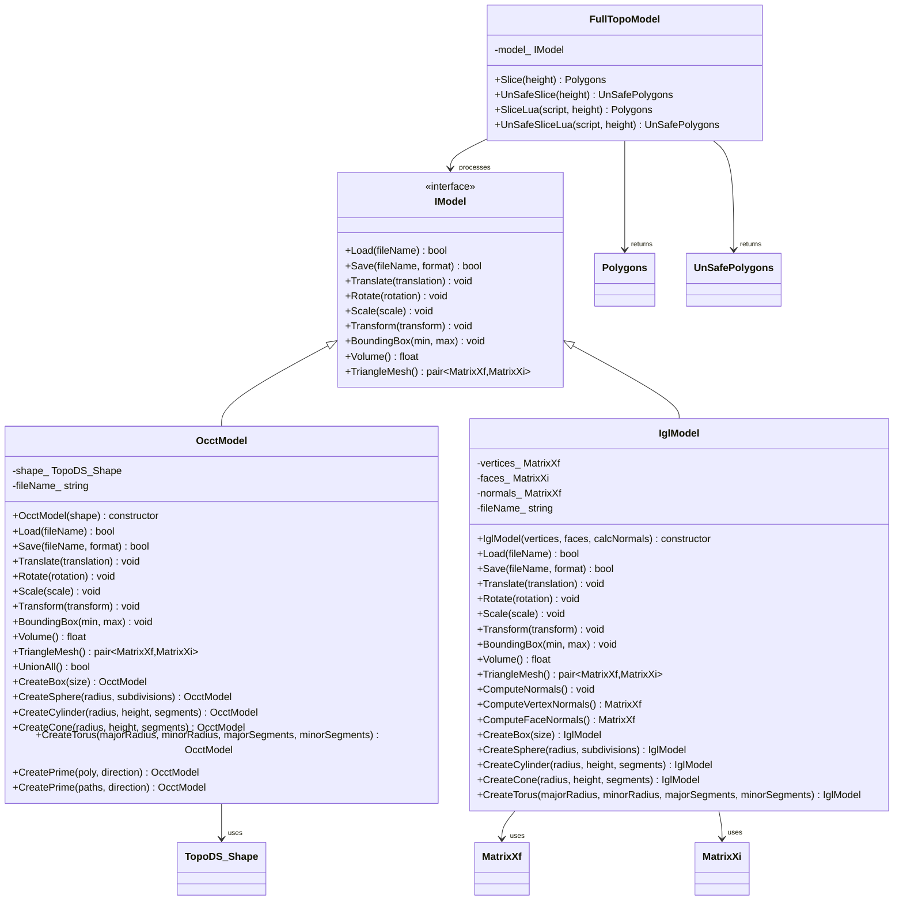

**Diagram sources**
- [IModel.hpp:108-136](file://base/IModel.hpp#L108-L136)
- [OcctModel.hpp:18-84](file://cadmodel/OcctModel.hpp#L18-L84)
- [IglModel.hpp:12-63](file://meshmodel/IglModel.hpp#L12-L63)
- [FullTopoModel.hpp](file://meshmodel/FullTopoModel.hpp)

**Section sources**
- [OcctModel.hpp:1-92](file://cadmodel/OcctModel.hpp#L1-L92)
- [OcctModel.cpp:1-664](file://cadmodel/OcctModel.cpp#L1-L664)
- [IModel.hpp:108-136](file://base/IModel.hpp#L108-L136)

## Core Components
The CAD Model Processing sub-component centers around the OcctModel class, which provides a comprehensive implementation of the IModel interface using OpenCASCADE Technology. This component handles parametric CAD data with high precision, supporting industry-standard formats like STEP, IGES, VRML, and BRep through native OCCT import/export functionality. The implementation leverages TopoDS_Shape to represent complex B-rep geometry, enabling accurate representation of curved surfaces and precise volumetric calculations.

The OcctModel class exposes high-level CAD operations through friend functions that implement boolean operations (Union, Difference, Intersection, Xor) and shelling (ThickSolid). These operations maintain parametric accuracy throughout the processing pipeline, unlike mesh-based approaches that accumulate discretization errors. For compatibility with the slicing engine, the component provides a TriangleMesh() method that converts the B-rep geometry to a triangle mesh representation.

**Updated** The component now includes expanded format support with VRML and BRep formats, along with new static creation methods for primitive shapes and polygon-based extrusion capabilities.

**Section sources**
- [OcctModel.hpp:18-84](file://cadmodel/OcctModel.hpp#L18-L84)
- [OcctModel.cpp:71-185](file://cadmodel/OcctModel.cpp#L71-L185)

## Detailed Component Analysis

### OcctModel Implementation
The OcctModel class implements the IModel interface with OpenCASCADE-based functionality for handling parametric CAD data. It uses TopoDS_Shape as the fundamental data structure for representing B-rep geometry, which enables precise representation of complex surfaces and accurate volumetric calculations.

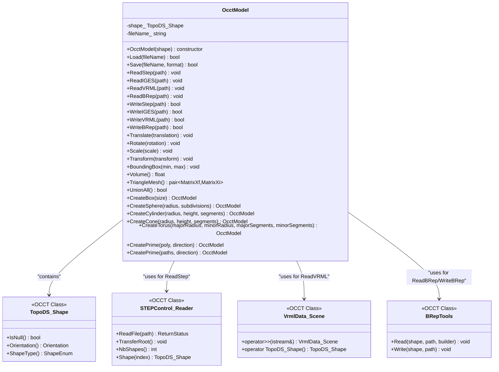

**Diagram sources**
- [OcctModel.hpp:18-84](file://cadmodel/OcctModel.hpp#L18-L84)
- [OcctModel.cpp:71-185](file://cadmodel/OcctModel.cpp#L71-L185)

**Section sources**
- [OcctModel.hpp:18-84](file://cadmodel/OcctModel.hpp#L18-L84)
- [OcctModel.cpp:71-185](file://cadmodel/OcctModel.cpp#L71-L185)

### Expanded Format Support
The OcctModel implementation has been significantly enhanced with support for additional CAD formats beyond the original STEP and IGES support. The new format support includes VRML (Virtual Reality Modeling Language) and BRep (OpenCASCADE native format), providing greater flexibility in CAD data interchange.

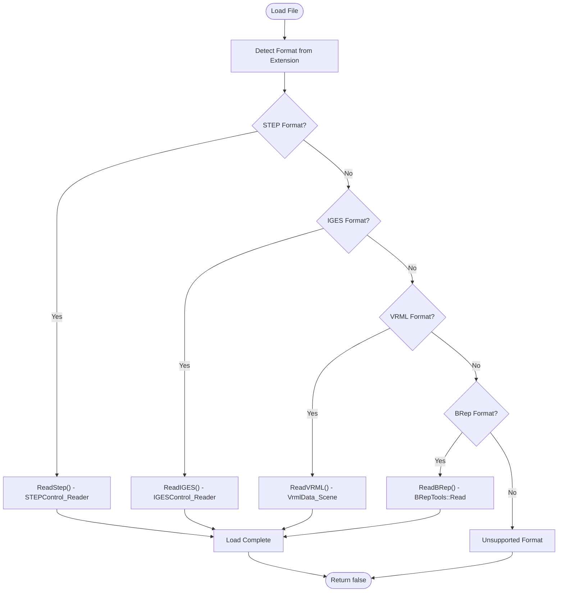

**Diagram sources**
- [OcctModel.cpp:208-232](file://cadmodel/OcctModel.cpp#L208-L232)
- [ModelFormat.cpp:40-82](file://base/ModelFormat.cpp#L40-L82)

**Section sources**
- [OcctModel.cpp:105-142](file://cadmodel/OcctModel.cpp#L105-L142)
- [ModelFormat.cpp:20-28](file://base/ModelFormat.cpp#L20-L28)

### Static Primitive Creation Methods
The OcctModel class now provides comprehensive static factory methods for creating common geometric primitives. These methods enable programmatic generation of basic shapes without requiring external CAD files, facilitating rapid prototyping and testing workflows.

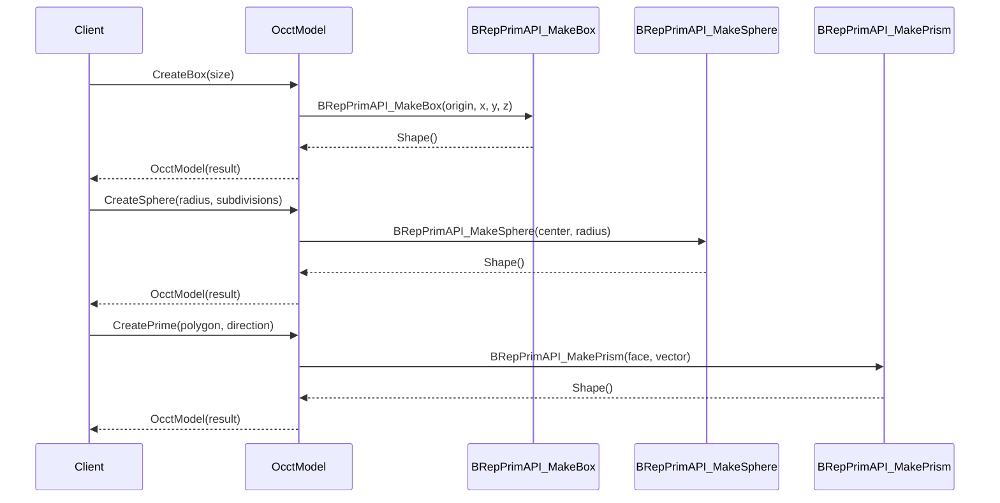

**Diagram sources**
- [OcctModel.cpp:417-444](file://cadmodel/OcctModel.cpp#L417-L444)
- [OcctModel.cpp:537-578](file://cadmodel/OcctModel.cpp#L537-L578)

**Section sources**
- [OcctModel.cpp:417-444](file://cadmodel/OcctModel.cpp#L417-L444)

### Prime Surface Creation from Input Polygons
A significant new feature is the ability to create 3D solids from 2D polygon inputs through the CreatePrime methods. This functionality enables direct conversion of 2D CAD drawings or generated paths into 3D prismatic solids by extruding along specified directions.

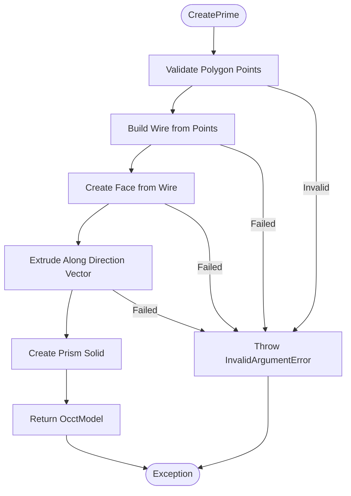

**Diagram sources**
- [OcctModel.cpp:537-578](file://cadmodel/OcctModel.cpp#L537-L578)
- [OcctModel.cpp:581-658](file://cadmodel/OcctModel.cpp#L581-L658)

**Section sources**
- [OcctModel.cpp:537-658](file://cadmodel/OcctModel.cpp#L537-L658)

### High-Level CAD Operations
The OcctModel implementation exposes high-level CAD operations through friend functions that leverage OpenCASCADE's robust algorithms for boolean operations and shelling. These operations are implemented as non-member functions to maintain a clean interface while providing powerful geometric processing capabilities.

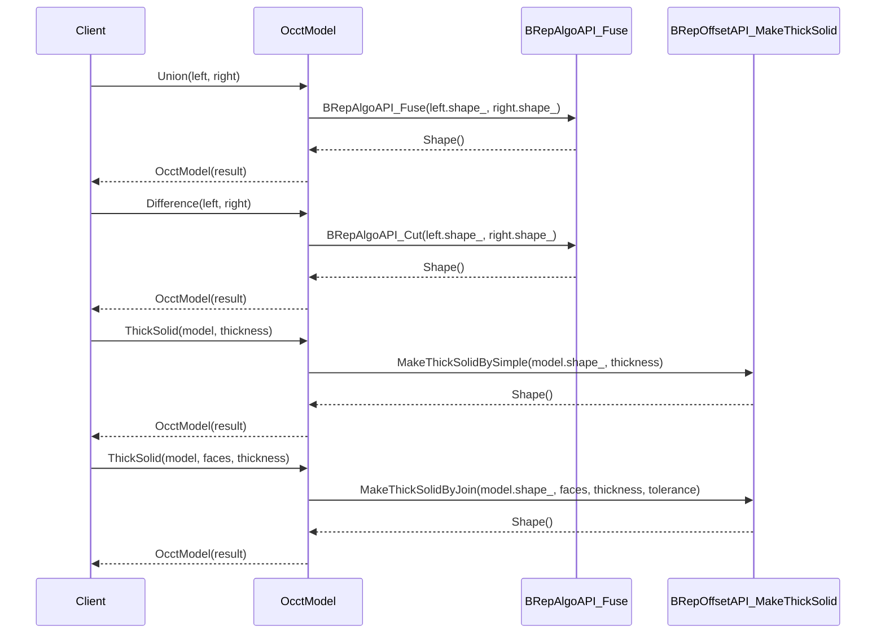

**Diagram sources**
- [OcctModel.hpp:53-60](file://cadmodel/OcctModel.hpp#L53-L60)
- [OcctModel.cpp:446-535](file://cadmodel/OcctModel.cpp#L446-L535)

**Section sources**
- [OcctModel.hpp:53-60](file://cadmodel/OcctModel.hpp#L53-L60)
- [OcctModel.cpp:446-535](file://cadmodel/OcctModel.cpp#L446-L535)

### Mesh Conversion Process
The TriangleMesh() method provides a critical bridge between the parametric CAD representation and the mesh-based slicing engine. This conversion process extracts triangulated representations of the B-rep geometry's faces, handling transformations and orientation correctly to ensure accurate mesh generation.

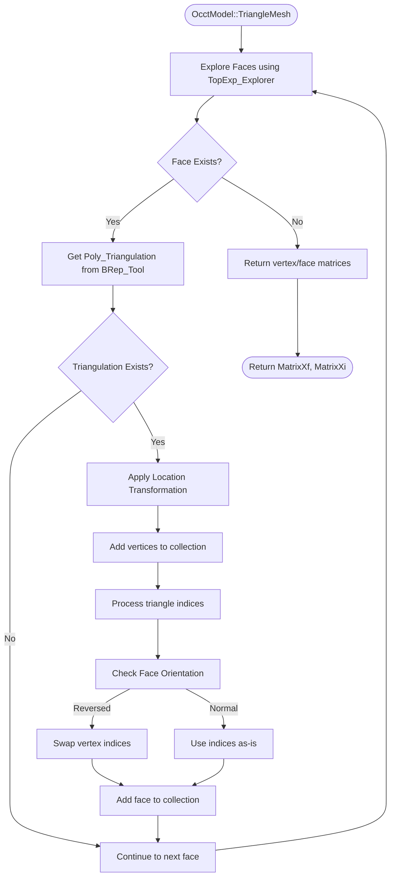

**Diagram sources**
- [OcctModel.cpp:348-395](file://cadmodel/OcctModel.cpp#L348-L395)

**Section sources**
- [OcctModel.cpp:348-395](file://cadmodel/OcctModel.cpp#L348-L395)

## Integration with Slicing Engine
The CAD Model Processing component integrates with the core slicing engine through the FullTopoModel class, which acts as an adapter between the parametric CAD representation and the polygon-based slicing algorithms. This integration enables the use of high-precision CAD models in the slicing pipeline while maintaining compatibility with existing mesh processing workflows.

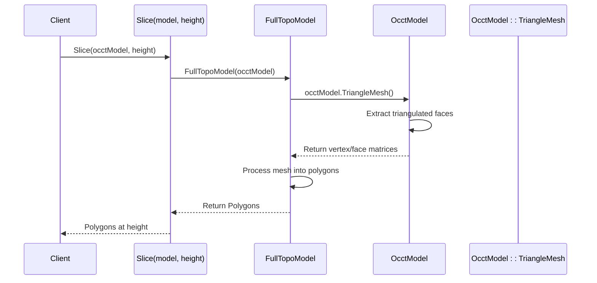

**Diagram sources**
- [mesh_slice.hpp:12-15](file://LibHsBaSlicer/Slice/mesh_slice.hpp#L12-L15)
- [mesh_slice.cpp:5-13](file://LibHsBaSlicer/Slice/mesh_slice.cpp#L5-L13)
- [FullTopoModel.hpp](file://meshmodel/FullTopoModel.hpp)

**Section sources**
- [mesh_slice.hpp:12-15](file://LibHsBaSlicer/Slice/mesh_slice.hpp#L12-L15)
- [mesh_slice.cpp:5-13](file://LibHsBaSlicer/Slice/mesh_slice.cpp#L5-L13)

## Performance Characteristics
The OcctModel implementation offers significant precision advantages over mesh-based models due to its use of parametric B-rep geometry. This approach maintains exact representations of curved surfaces and enables accurate volumetric calculations, which is critical for manufacturing applications. However, these benefits come with increased memory overhead and computational requirements compared to mesh representations.

The expanded format support including VRML and BRep adds additional processing overhead during file I/O operations. VRML loading requires scene parsing and shape conversion, while BRep operations provide native OpenCASCADE performance but may have compatibility considerations across different platforms.

The boolean operations and shelling algorithms provided by OpenCASCADE are robust and handle complex geometries reliably, but they can be computationally intensive, particularly for models with high complexity. The real-time performance is limited by the computational demands of B-rep operations, making the component more suitable for offline processing rather than interactive applications.

When saving to mesh formats, the implementation automatically converts the B-rep geometry to a triangle mesh using the TriangleMesh() method, ensuring compatibility with downstream processes that require mesh inputs.

**Updated** The addition of VRML and BRep format support introduces new performance characteristics, with VRML potentially being slower for large scenes due to parsing overhead, while BRep provides optimal performance for OpenCASCADE-native workflows.

**Section sources**
- [OcctModel.hpp](file://cadmodel/OcctModel.hpp)
- [OcctModel.cpp](file://cadmodel/OcctModel.cpp)
- [mesh_slice.cpp](file://LibHsBaSlicer/Slice/mesh_slice.cpp)

## Usage Examples
The OcctModel class provides a comprehensive API for working with parametric CAD data in the HsBaSlicer system. The following examples demonstrate common usage patterns for loading, transforming, and processing CAD models with the expanded format support and new creation methods.

### Loading Multiple Format Files
The OcctModel class now supports loading from multiple CAD formats including STEP, IGES, VRML, and BRep files through automatic format detection.

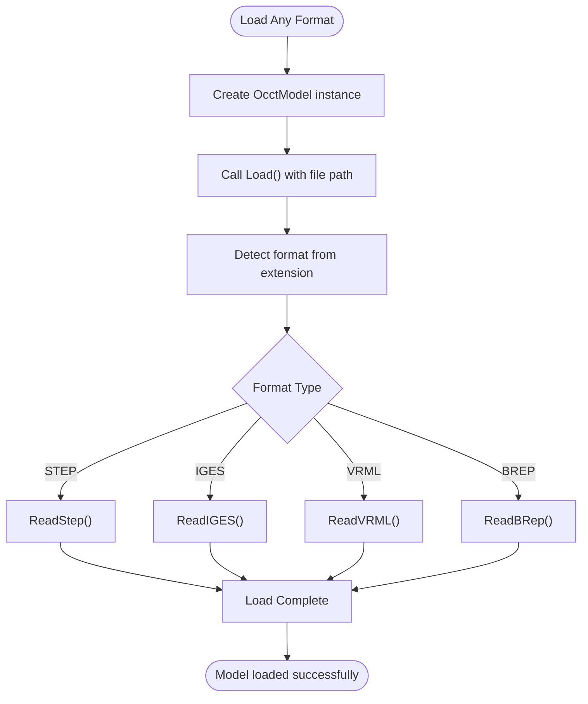

**Diagram sources**
- [OcctModel.cpp:208-232](file://cadmodel/OcctModel.cpp#L208-L232)

**Section sources**
- [OcctModel.cpp:208-232](file://cadmodel/OcctModel.cpp#L208-L232)

### Creating Primitives and Performing Operations
The new static creation methods enable programmatic generation of geometric primitives and complex operations.

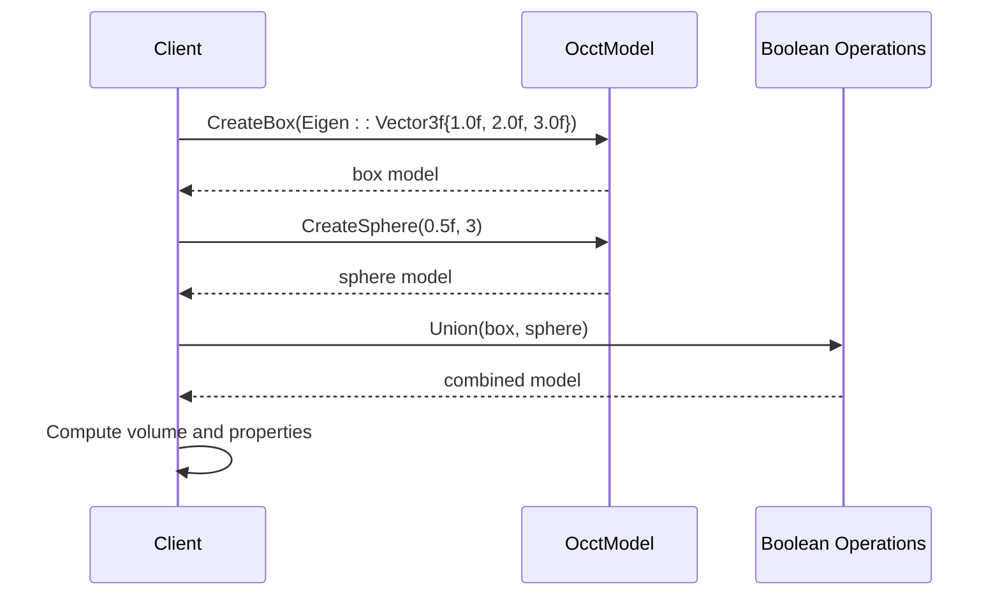

**Diagram sources**
- [OcctModel.cpp:417-444](file://cadmodel/OcctModel.cpp#L417-L444)
- [OcctModel.cpp:446-464](file://cadmodel/OcctModel.cpp#L446-L464)

**Section sources**
- [OcctModel.cpp:417-464](file://cadmodel/OcctModel.cpp#L417-L464)

### Creating Prisms from 2D Polygons
The CreatePrime methods enable direct conversion of 2D polygonal data into 3D prismatic solids.

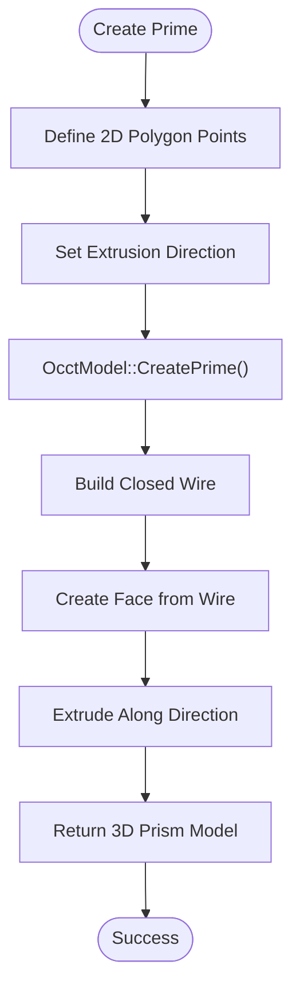

**Diagram sources**
- [OcctModel.cpp:537-578](file://cadmodel/OcctModel.cpp#L537-L578)

**Section sources**
- [OcctModel.cpp:537-578](file://cadmodel/OcctModel.cpp#L537-L578)

### Applying Transformations and Computing Volume
The OcctModel class supports various transformation operations and geometric queries, enabling comprehensive manipulation and analysis of CAD models.

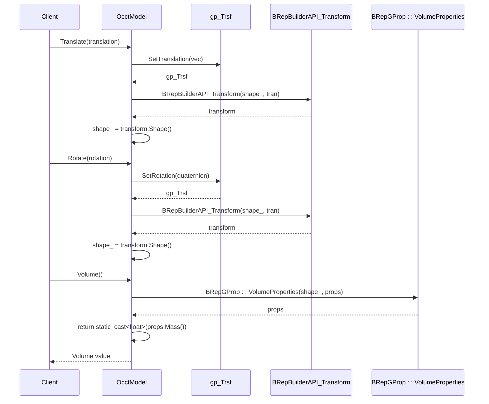

**Diagram sources**
- [OcctModel.cpp:267-324](file://cadmodel/OcctModel.cpp#L267-L324)
- [OcctModel.cpp:397-402](file://cadmodel/OcctModel.cpp#L397-L402)

**Section sources**
- [OcctModel.cpp:267-324](file://cadmodel/OcctModel.cpp#L267-L324)
- [OcctModel.cpp:397-402](file://cadmodel/OcctModel.cpp#L397-L402)

## Conclusion
The CAD Model Processing sub-component in HsBaSlicer provides a robust foundation for handling parametric CAD data through its OpenCASCADE-based OcctModel implementation. By leveraging B-rep geometry with TopoDS_Shape, the system maintains high precision in geometric representations and calculations, offering significant advantages over mesh-based approaches for manufacturing applications. 

**Updated** The recent enhancements significantly expand the component's capabilities with support for VRML and BRep formats, comprehensive primitive creation methods, and polygon-based extrusion functionality. These additions provide greater flexibility in CAD data handling and enable more sophisticated modeling workflows.

The component supports industry-standard formats like STEP, IGES, VRML, and BRep through native OCCT import/export functionality, and exposes powerful CAD operations such as boolean operations and shelling through friend functions. The integration with the core slicing engine is achieved through the TriangleMesh() conversion method, which enables compatibility with mesh-based processing pipelines while preserving the benefits of parametric modeling.

Although the implementation has higher memory overhead and computational requirements compared to pure mesh approaches, the precision advantages make it well-suited for applications where geometric accuracy is paramount. The modular design with the IModel interface ensures flexibility and extensibility, allowing the system to support multiple geometric kernels while maintaining a consistent API for downstream components. The expanded format support and new creation methods further enhance the component's versatility for diverse CAD processing scenarios.