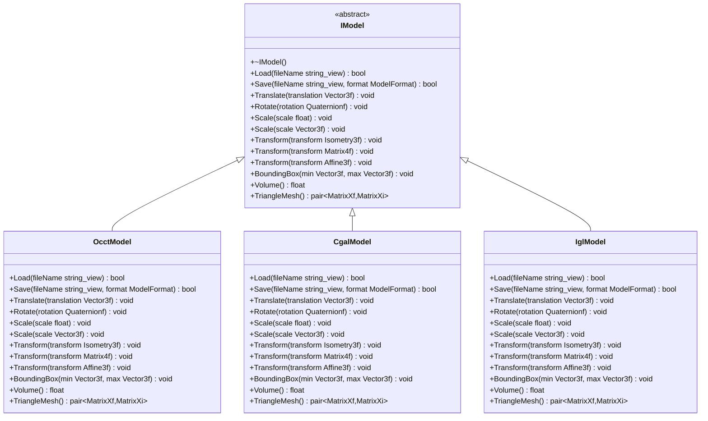
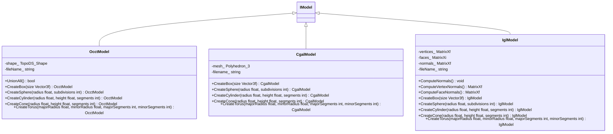
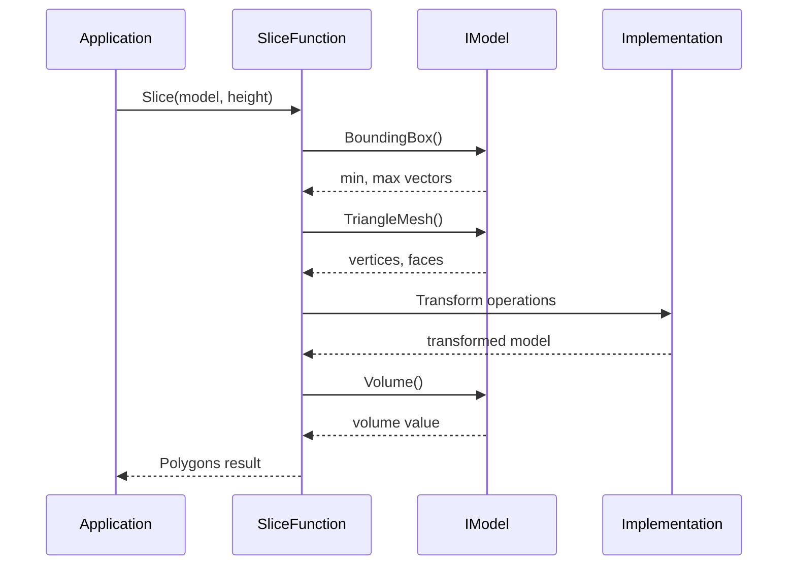

# IModel Interface Abstraction

<cite>
**Referenced Files in This Document**   
- [base/IModel.hpp](file://base/IModel.hpp)
- [cadmodel/OcctModel.hpp](file://cadmodel/OcctModel.hpp)
- [cadmodel/OcctModel.cpp](file://cadmodel/OcctModel.cpp)
- [meshmodel/CgalModel.hpp](file://meshmodel/CgalModel.hpp)
- [meshmodel/CgalModel.cpp](file://meshmodel/CgalModel.cpp)
- [meshmodel/IglModel.hpp](file://meshmodel/IglModel.hpp)
- [meshmodel/IglModel.cpp](file://meshmodel/IglModel.cpp)
- [meshmodel/FullTopoModel.hpp](file://meshmodel/FullTopoModel.hpp)
- [LibHsBaSlicer/Slice/mesh_slice.hpp](file://LibHsBaSlicer/Slice/mesh_slice.hpp)
- [base/ModelFormat.hpp](file://base/ModelFormat.hpp)
- [base/error.hpp](file://base/error.hpp)
</cite>

## Table of Contents
1. [Introduction](#introduction)
2. [IModel Interface Definition](#imodel-interface-definition)
3. [Core Methods Documentation](#core-methods-documentation)
4. [Implementation Hierarchy](#implementation-hierarchy)
5. [Slicing Engine Integration](#slicing-engine-integration)
6. [Design Trade-offs and Considerations](#design-trade-offs-and-considerations)
7. [Error Handling Mechanisms](#error-handling-mechanisms)
8. [Thread Safety Analysis](#thread-safety-analysis)
9. [Conclusion](#conclusion)

## Introduction
The IModel interface serves as the foundational abstraction layer in the HsBaSlicer system, providing a unified API for handling diverse 3D model types. This interface enables polymorphic behavior across different geometry kernels, allowing the slicing engine to process both mesh-based and CAD-based models through a consistent interface. By abstracting the underlying geometry representation, IModel decouples the slicing logic from specific modeling kernels, promoting flexibility and maintainability in the codebase. The interface leverages Eigen types for consistent vector and matrix operations across all implementations, ensuring mathematical operations are handled uniformly regardless of the backend geometry kernel.

**Section sources**
- [base/IModel.hpp](file://base/IModel.hpp#L1-L37)

## IModel Interface Definition
The IModel interface is defined as a pure virtual base class that establishes a contract for all 3D model implementations within the system. It provides methods for file I/O operations, geometric transformations, property queries, and mesh extraction. The interface is designed to be implemented by various backend geometry kernels, including mesh-based systems (CGAL, libigl) and CAD kernels (OpenCASCADE). This abstraction allows higher-level components, particularly the slicing engine, to interact with 3D models without knowledge of their specific implementation details.



**Diagram sources**
- [base/IModel.hpp](file://base/IModel.hpp#L14-L34)
- [cadmodel/OcctModel.hpp](file://cadmodel/OcctModel.hpp#L16-L47)
- [meshmodel/CgalModel.hpp](file://meshmodel/CgalModel.hpp#L20-L53)
- [meshmodel/IglModel.hpp](file://meshmodel/IglModel.hpp#L12-L39)

**Section sources**
- [base/IModel.hpp](file://base/IModel.hpp#L1-L37)

## Core Methods Documentation
The IModel interface defines several categories of methods that provide comprehensive functionality for 3D model manipulation and interrogation. These methods are implemented consistently across all derived classes, ensuring uniform behavior regardless of the underlying geometry kernel.

### File I/O Operations
The Load and Save methods provide standardized file operations for model persistence. The Load method accepts a file path and attempts to load the model data, returning a boolean indicating success or failure. The Save method supports multiple formats through the ModelFormat enum and handles both mesh and CAD formats appropriately. For CAD models that need to be saved in mesh formats, the implementation automatically converts through the TriangleMesh representation.

### Transformation Methods
The interface provides a comprehensive set of transformation methods that support various mathematical representations. These include basic operations like Translate, Rotate, and Scale, as well as more complex Transform methods that accept different types of transformation matrices (Isometry3f, Matrix4f, and Affine3f). This flexibility allows callers to use the most appropriate mathematical representation for their use case without requiring conversion.

### Geometric Queries
The BoundingBox method returns the axis-aligned bounding box of the model by populating minimum and maximum corner vectors. The Volume method calculates and returns the model's volume, which is essential for material estimation and process planning. These queries provide essential geometric information for downstream processing.

### Mesh Extraction
The TriangleMesh method returns the model's surface representation as a pair of matrices in the libigl format (vertices and faces), enabling interoperability with mesh processing algorithms. This method serves as the bridge between different geometry representations, allowing CAD models to be converted to mesh representations when needed.

**Section sources**
- [base/IModel.hpp](file://base/IModel.hpp#L19-L33)

## Implementation Hierarchy
The IModel interface is implemented by three primary classes representing different geometry kernels: OcctModel for CAD operations, CgalModel for computational geometry, and IglModel for mesh processing. Each implementation adapts the interface methods to the specific capabilities and data structures of its underlying library.



**Diagram sources**
- [cadmodel/OcctModel.hpp](file://cadmodel/OcctModel.hpp#L16-L63)
- [meshmodel/CgalModel.hpp](file://meshmodel/CgalModel.hpp#L20-L64)
- [meshmodel/IglModel.hpp](file://meshmodel/IglModel.hpp#L12-L54)

**Section sources**
- [cadmodel/OcctModel.hpp](file://cadmodel/OcctModel.hpp#L16-L80)
- [meshmodel/CgalModel.hpp](file://meshmodel/CgalModel.hpp#L20-L82)
- [meshmodel/IglModel.hpp](file://meshmodel/IglModel.hpp#L12-L66)

## Slicing Engine Integration
The IModel interface plays a crucial role in the slicing engine by providing a uniform interface for model processing. The slicing functions accept IModel references, enabling polymorphic handling of different model types without requiring knowledge of their specific implementations.



The slicing functions in mesh_slice.hpp demonstrate this integration pattern, accepting const references to IModel objects and performing operations through the virtual interface. This design allows the same slicing algorithm to work with CAD models, CGAL meshes, or libigl meshes interchangeably. The FullTopoModel class further extends this capability by providing complete topological reconstruction for slicing operations, using the IModel interface as its input source.

**Diagram sources**
- [LibHsBaSlicer/Slice/mesh_slice.hpp](file://LibHsBaSlicer/Slice/mesh_slice.hpp#L12-L18)
- [meshmodel/FullTopoModel.hpp](file://meshmodel/FullTopoModel.hpp#L63-L95)

**Section sources**
- [LibHsBaSlicer/Slice/mesh_slice.hpp](file://LibHsBaSlicer/Slice/mesh_slice.hpp#L1-L22)
- [meshmodel/FullTopoModel.hpp](file://meshmodel/FullTopoModel.hpp#L1-L119)

## Design Trade-offs and Considerations
The IModel interface represents a careful balance between flexibility and performance, with several important design trade-offs that impact system behavior.

### Virtual Call Overhead
The use of virtual methods introduces a performance overhead compared to direct function calls. Each method invocation requires an additional indirection through the vtable, which can impact performance in tight loops. However, this cost is generally acceptable given the benefits of polymorphism and the fact that most operations involve significant computational work that dwarfs the virtual call overhead.

### Eigen Type Consistency
The interface uses Eigen types (Vector3f, Matrix4f, etc.) for all geometric operations, ensuring consistent mathematical behavior across implementations. This choice simplifies integration with other components that also use Eigen and provides optimized linear algebra operations. The trade-off is that each implementation must convert between its native data structures and Eigen types, potentially introducing conversion overhead.

### Memory Management
The interface design favors value semantics for geometric data (returning copies of matrices and vectors) rather than references or pointers. This approach simplifies memory management and prevents dangling references but may incur copy costs for large datasets. The implementations optimize this by using Eigen's expression templates and copy elision where possible.

### Extensibility vs. Complexity
The interface provides multiple overloads for transformation methods to accommodate different mathematical representations. While this enhances usability, it increases the interface surface area. The design prioritizes ease of use for client code over minimalism, recognizing that 3D geometry operations often involve different transformation representations.

**Section sources**
- [base/IModel.hpp](file://base/IModel.hpp#L7-L8)
- [cadmodel/OcctModel.cpp](file://cadmodel/OcctModel.cpp#L184-L200)
- [meshmodel/CgalModel.cpp](file://meshmodel/CgalModel.cpp#L68-L123)
- [meshmodel/IglModel.cpp](file://meshmodel/IglModel.cpp#L91-L135)

## Error Handling Mechanisms
The IModel interface and its implementations employ a comprehensive error handling strategy using a custom exception hierarchy derived from std::runtime_error. This approach provides meaningful error information while maintaining compatibility with standard C++ exception handling.

```mermaid
classDiagram
class RuntimeError {
+RuntimeError(msg string)
+what() const char*
}
class IOError {
+IOError(msg string)
+what() const char*
}
class NotSupportedError {
+NotSupportedError(msg string)
+what() const char*
}
class InvalidArgumentError {
+InvalidArgumentError(msg string)
+what() const char*
}
RuntimeError <|-- IOError
RuntimeError <|-- NotSupportedError
RuntimeError <|-- InvalidArgumentError
class IModel {
+Load(fileName string_view) bool
+Save(fileName string_view, format ModelFormat) bool
}
class OcctModel {
+Load(fileName string_view) bool
+Save(fileName string_view, format ModelFormat) bool
}
IModel <|-- OcctModel
OcctModel -> IOError : throws on file read error
OcctModel -> NotSupportedError : throws on unsupported format
```

The Load and Save methods throw specific exceptions for different error conditions: IOError for file system issues, NotSupportedError for unsupported formats, and InvalidArgumentError for invalid parameters. This granular exception hierarchy allows calling code to handle different error types appropriately. The boolean return value indicates overall success or failure, while exceptions provide detailed error information for debugging and user feedback.

**Diagram sources**
- [base/error.hpp](file://base/error.hpp#L12-L73)
- [cadmodel/OcctModel.cpp](file://cadmodel/OcctModel.cpp#L71-L72)
- [cadmodel/OcctModel.cpp](file://cadmodel/OcctModel.cpp#L151-L152)

**Section sources**
- [base/error.hpp](file://base/error.hpp#L1-L139)
- [cadmodel/OcctModel.cpp](file://cadmodel/OcctModel.cpp#L1-L458)

## Thread Safety Analysis
The thread safety characteristics of the IModel interface and its implementations vary depending on the specific class and operation. Understanding these characteristics is crucial for concurrent applications.

### IModel Interface Thread Safety
The IModel interface itself does not provide thread safety guarantees. Implementations are responsible for their own thread safety, and the interface does not include synchronization primitives. This design allows implementations to optimize for their specific use cases rather than imposing a one-size-fits-all synchronization strategy.

### Implementation-Specific Behavior
- **OcctModel**: OpenCASCADE operations are generally not thread-safe, so OcctModel instances should not be shared across threads without external synchronization.
- **CgalModel**: CGAL operations are typically thread-safe for const operations, but mutable operations require external synchronization.
- **IglModel**: libigl operations are generally thread-safe for const operations, but mesh modifications require synchronization.

### Recommended Usage Patterns
For multi-threaded applications, the recommended pattern is to use one IModel instance per thread or to protect shared instances with appropriate mutexes. The slicing engine can safely process multiple models in parallel as long as each thread operates on a separate model instance. The interface design supports this pattern by not requiring shared mutable state between operations.

**Section sources**
- [cadmodel/OcctModel.hpp](file://cadmodel/OcctModel.hpp#L16-L80)
- [meshmodel/CgalModel.hpp](file://meshmodel/CgalModel.hpp#L20-L82)
- [meshmodel/IglModel.hpp](file://meshmodel/IglModel.hpp#L12-L66)

## Conclusion
The IModel interface abstraction provides a robust foundation for handling diverse 3D model types within the HsBaSlicer system. By defining a comprehensive contract for model operations, it enables polymorphic behavior across different geometry kernels while maintaining a clean separation between interface and implementation. The interface successfully balances flexibility and performance, allowing the slicing engine to process both mesh and CAD models through a unified API. The use of Eigen types ensures consistent mathematical operations, while the virtual method design enables extensibility to new geometry kernels. Although virtual calls introduce some performance overhead, this cost is generally outweighed by the benefits of abstraction and maintainability. The error handling strategy provides meaningful feedback for debugging and user interaction, and the thread safety characteristics support concurrent processing patterns when used appropriately. Overall, the IModel interface represents a well-designed abstraction that effectively decouples the slicing logic from specific geometry kernels, promoting a modular and maintainable architecture.