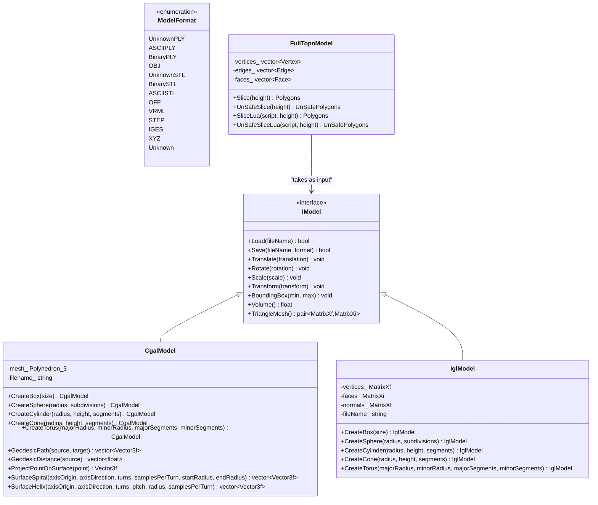
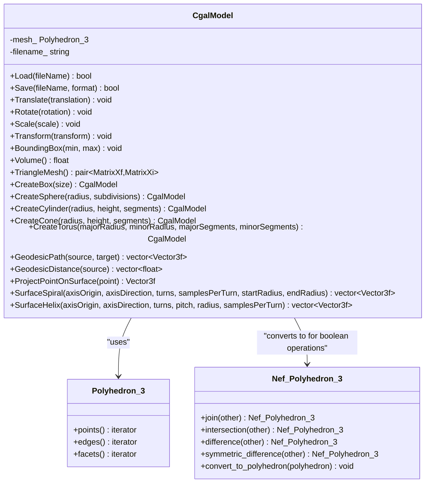
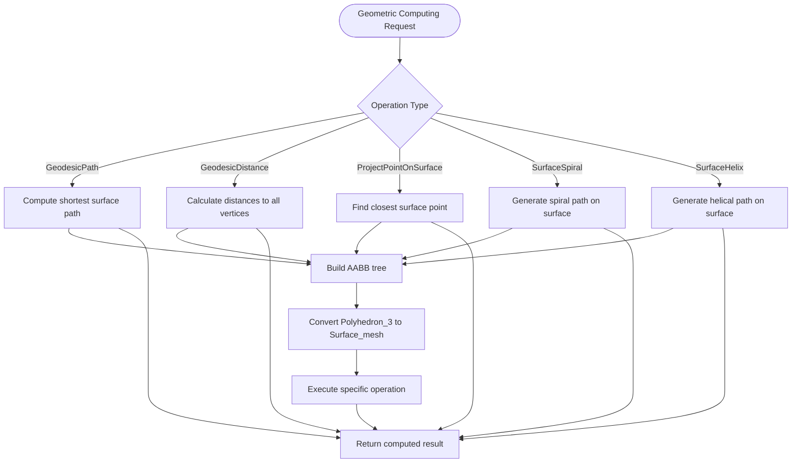
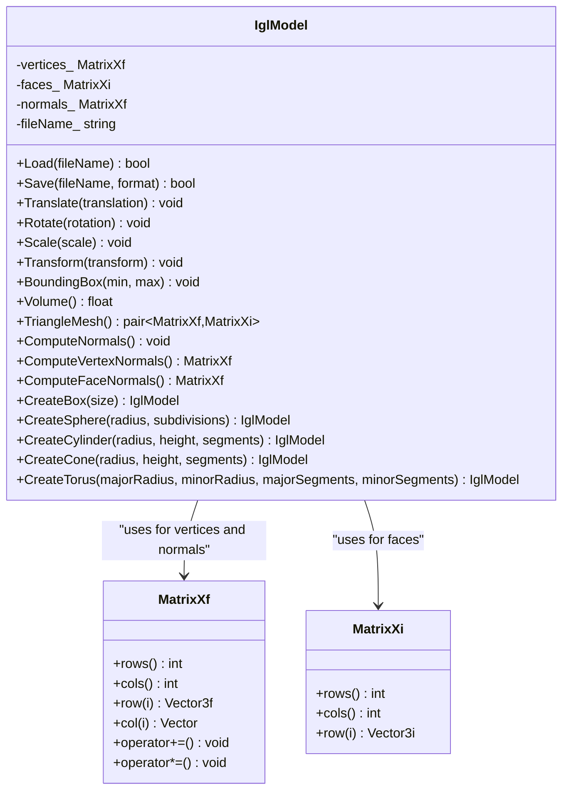
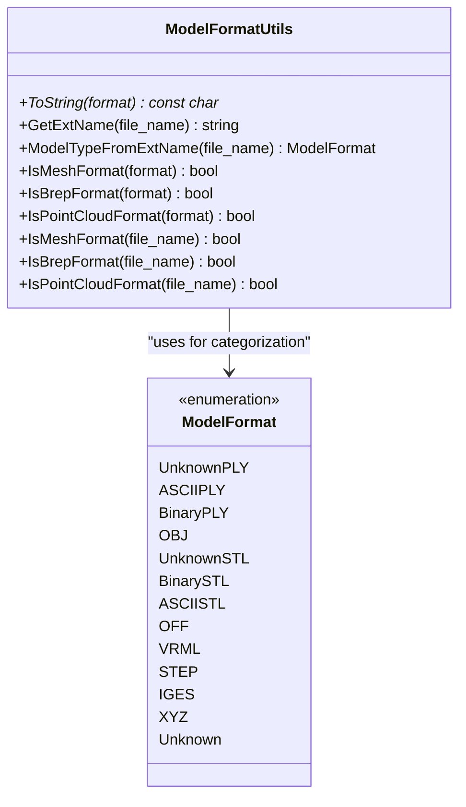
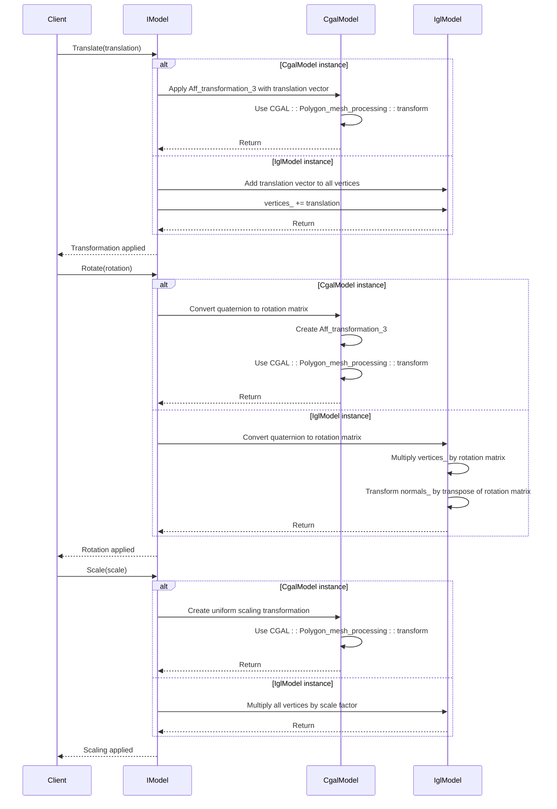
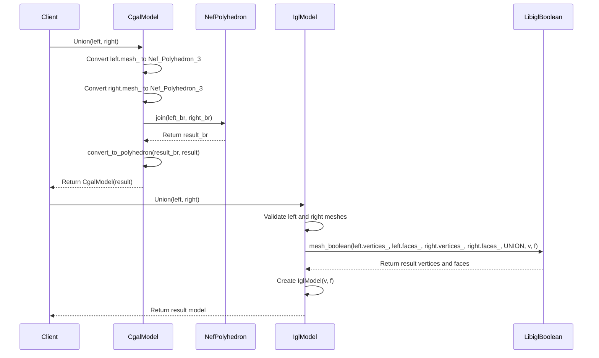
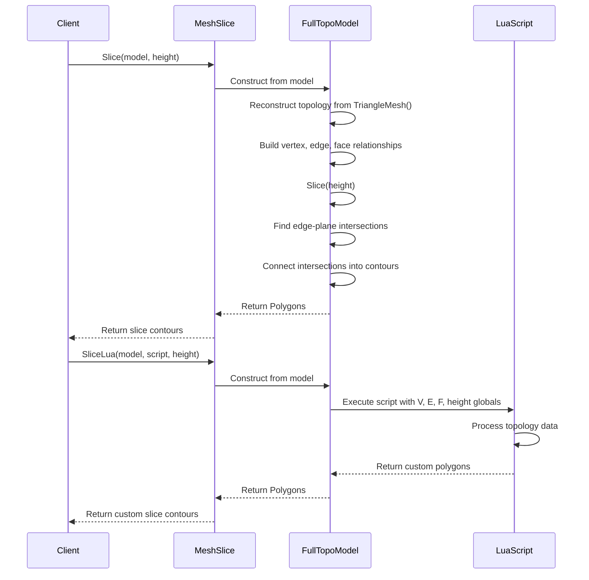

# Mesh Model Processing

<cite>
**Referenced Files in This Document**   
- [IModel.hpp](file://base/IModel.hpp)
- [CgalModel.hpp](file://meshmodel/CgalModel.hpp)
- [CgalModel.cpp](file://meshmodel/CgalModel.cpp)
- [IglModel.hpp](file://meshmodel/IglModel.hpp)
- [IglModel.cpp](file://meshmodel/IglModel.cpp)
- [ModelFormat.hpp](file://base/ModelFormat.hpp)
- [ModelFormat.cpp](file://base/ModelFormat.cpp)
- [mesh_slice.hpp](file://LibHsBaSlicer/Slice/mesh_slice.hpp)
- [mesh_slice.cpp](file://LibHsBaSlicer/Slice/mesh_slice.cpp)
- [FullTopoModel.hpp](file://meshmodel/FullTopoModel.hpp)
- [FullTopoModel.cpp](file://meshmodel/FullTopoModel.cpp)
</cite>

## Update Summary
**Changes Made**   
- Added comprehensive documentation for new geometric computing methods: GeodesicPath, GeodesicDistance, ProjectPointOnSurface, SurfaceSpiral, and SurfaceHelix
- Updated CgalModel implementation section to include advanced surface operations
- Enhanced boolean operations section with performance comparison details
- Added new section covering advanced geometric computing capabilities

## Table of Contents
1. [Introduction](#introduction)
2. [Core Architecture](#core-architecture)
3. [IModel Interface](#imodel-interface)
4. [CgalModel Implementation](#cgalmodel-implementation)
5. [Advanced Geometric Computing](#advanced-geometric-computing)
6. [IglModel Implementation](#iglmodel-implementation)
7. [Model Format Support](#model-format-support)
8. [Primitive Creation](#primitive-creation)
9. [Transformation Operations](#transformation-operations)
10. [Boolean Operations](#boolean-operations)
11. [Slicing Pipeline Integration](#slicing-pipeline-integration)
12. [Performance and Memory Considerations](#performance-and-memory-considerations)
13. [Thread Safety](#thread-safety)

## Introduction
The Mesh Model Processing sub-component provides a robust framework for handling polygonal meshes in the HsBaSlicer application. This system is designed to support both high-precision CAD operations and lightweight mesh processing through two distinct implementations: CgalModel and IglModel. These implementations adhere to the common IModel interface, enabling polymorphic behavior while maintaining specialized capabilities for different use cases. The architecture supports various file formats, geometric transformations, boolean operations, and integration with the slicing pipeline for 3D printing applications. **Updated**: The CgalModel implementation now includes advanced geometric computing capabilities including geodesic path computation, surface projection, and spiral/helix generation on mesh surfaces.

## Core Architecture
The mesh processing system follows a polymorphic design pattern centered around the IModel interface, with CgalModel and IglModel serving as concrete implementations. This architecture enables the application to select the appropriate backend based on precision requirements, performance constraints, and specific operations needed. The system integrates with the slicing pipeline through the FullTopoModel class, which reconstructs complete topological relationships from the mesh data for accurate cross-section generation.

**Diagram sources**
- [IModel.hpp:14-34](file://base/IModel.hpp#L14-L34)
- [CgalModel.hpp:20-120](file://meshmodel/CgalModel.hpp#L20-L120)
- [IglModel.hpp:12-63](file://meshmodel/IglModel.hpp#L12-L63)
- [ModelFormat.hpp:10-30](file://base/ModelFormat.hpp#L10-L30)
- [FullTopoModel.hpp:42-114](file://meshmodel/FullTopoModel.hpp#L42-L114)

**Section sources**
- [IModel.hpp:1-37](file://base/IModel.hpp#L1-L37)
- [CgalModel.hpp:1-136](file://meshmodel/CgalModel.hpp#L1-L136)
- [IglModel.hpp:1-66](file://meshmodel/IglModel.hpp#L1-L66)
- [FullTopoModel.hpp:1-119](file://meshmodel/FullTopoModel.hpp#L1-L119)

## IModel Interface
The IModel interface defines the contract for all mesh model implementations in the system. It provides a comprehensive set of operations for loading, saving, transforming, and querying mesh data. The interface uses Eigen types for mathematical operations and coordinates, ensuring consistency across the application. Key methods include geometric transformations (Translate, Rotate, Scale, Transform), spatial queries (BoundingBox, Volume), and data extraction (TriangleMesh). The interface is designed to be extensible while maintaining a clean separation between the abstract contract and concrete implementations.

**Section sources**
- [IModel.hpp:14-34](file://base/IModel.hpp#L14-L34)

## CgalModel Implementation
The CgalModel class provides high-precision mesh processing capabilities through the Computational Geometry Algorithms Library (CGAL). It uses CGAL's Polyhedron_3 data structure to represent meshes, which maintains explicit topological relationships between vertices, edges, and faces. This implementation excels in boolean operations and geometric accuracy, making it suitable for CAD applications where precision is critical. The internal representation uses exact predicates with inexact constructions (EpicKernel), balancing computational efficiency with geometric robustness.

### Data Structure
CgalModel's primary data structure is the Polyhedron_3 template instantiated with the Exact_predicates_inexact_constructions_kernel. This structure maintains a half-edge data structure that explicitly stores vertex, edge, and face records with bidirectional links, enabling efficient traversal of topological relationships. The representation ensures watertight meshes and supports advanced geometric operations like boolean combinations.

### File I/O
The CgalModel implementation leverages CGAL's native I/O capabilities to support multiple mesh formats. It can read and write STL, PLY, OBJ, and OFF files, with options for binary or ASCII encoding. During loading, the implementation automatically triangulates faces to ensure consistent downstream processing. The file path conversion handles UTF-8 to system-specific encoding, ensuring compatibility across different platforms.

### Precision and Accuracy
CgalModel prioritizes geometric precision over raw performance. The use of CGAL's robust geometric predicates ensures that boolean operations and other geometric algorithms produce topologically correct results even in degenerate cases. This makes CgalModel particularly suitable for applications requiring high-fidelity geometric operations, such as CAD modeling and engineering analysis.

**Diagram sources**
- [CgalModel.hpp:20-120](file://meshmodel/CgalModel.hpp#L20-L120)
- [CgalModel.cpp:1-1202](file://meshmodel/CgalModel.cpp#L1-L1202)

**Section sources**
- [CgalModel.hpp:1-136](file://meshmodel/CgalModel.hpp#L1-L136)
- [CgalModel.cpp:1-1202](file://meshmodel/CgalModel.cpp#L1-L1202)

## Advanced Geometric Computing
**New Section** - The CgalModel implementation now includes advanced geometric computing capabilities that extend beyond basic mesh operations. These functions leverage CGAL's sophisticated geometric algorithms to provide precise surface analysis and path generation on 3D meshes.

### Geodesic Path Computation
The `GeodesicPath` method computes the shortest path along the mesh surface between two points using CGAL's Surface_mesh_shortest_path algorithm. This function takes source and target points on the mesh surface and returns a sequence of 3D points forming the geodesic path. The implementation converts the Polyhedron_3 to a Surface_mesh, builds an AABB tree for efficient point queries, and uses the shortest path algorithm to compute the optimal route along the surface.

### Geodesic Distance Calculation
The `GeodesicDistance` method calculates geodesic distances from a source point to all mesh vertices. It returns a vector of distances corresponding to each vertex in the mesh, providing a comprehensive distance map across the entire surface. This is useful for applications like heat diffusion simulation, stress analysis, and path planning on complex geometries.

### Point Projection
The `ProjectPointOnSurface` method projects any 3D point onto the closest position on the mesh surface. Using CGAL's AABB tree acceleration, this operation efficiently finds the nearest point on the mesh surface, which is essential for collision detection, snapping operations, and surface-based interactions.

### Surface Spiral Generation
The `SurfaceSpiral` method generates a spiral path on the mesh surface around a given axis. It creates a parametric spiral trajectory and projects each point onto the mesh surface using the AABB tree. The method supports configurable parameters including axis origin and direction, number of turns, sampling density, and radius variation from start to end.

### Surface Helix Generation  
The `SurfaceHelix` method generates a helical path on the mesh surface around an axis with constant pitch. Similar to the spiral function, it creates candidate points along a helical trajectory and projects them onto the mesh surface. This is particularly useful for generating toolpaths for CNC machining or additive manufacturing processes.

**Diagram sources**
- [CgalModel.cpp:951-1186](file://meshmodel/CgalModel.cpp#L951-L1186)

**Section sources**
- [CgalModel.hpp:72-119](file://meshmodel/CgalModel.hpp#L72-L119)
- [CgalModel.cpp:951-1186](file://meshmodel/CgalModel.cpp#L951-L1186)

## IglModel Implementation
The IglModel class provides a lightweight, high-performance mesh processing implementation based on Eigen matrices. It represents meshes as vertex and face arrays, making it ideal for applications requiring fast operations and minimal memory overhead. This implementation leverages libigl for file I/O and geometric operations, providing efficient algorithms for mesh processing tasks. IglModel is optimized for scenarios where raw speed is more important than absolute geometric precision.

### Data Structure
IglModel uses two primary Eigen matrices to represent the mesh: vertices_ (MatrixXf) stores vertex coordinates as a V×3 matrix, and faces_ (MatrixXi) stores face connectivity as an F×3 matrix of vertex indices. An additional normals_ matrix can store face or vertex normals for rendering and lighting calculations. This array-based representation enables vectorized operations and efficient memory access patterns.

### Performance Characteristics
IglModel excels in transformation operations, which are implemented as matrix arithmetic. Translation is a simple addition to all vertices, rotation uses matrix multiplication, and scaling applies component-wise multiplication. These operations benefit from Eigen's optimized linear algebra routines and can process large meshes rapidly. The implementation also includes efficient algorithms for normal computation and volume calculation.

### Use Cases
IglModel is particularly well-suited for real-time applications, visualization, and preprocessing tasks where high precision is not critical. Its fast loading and transformation capabilities make it ideal for interactive modeling, animation, and applications with strict performance requirements. The implementation also serves as an efficient intermediate format for data exchange between different components of the system.

**Diagram sources**
- [IglModel.hpp:12-63](file://meshmodel/IglModel.hpp#L12-L63)
- [IglModel.cpp:1-473](file://meshmodel/IglModel.cpp#L1-L473)

**Section sources**
- [IglModel.hpp:1-66](file://meshmodel/IglModel.hpp#L1-L66)
- [IglModel.cpp:1-473](file://meshmodel/IglModel.cpp#L1-L473)

## Model Format Support
The system supports a comprehensive range of 3D model formats through the ModelFormat enumeration and associated utilities. The ModelFormat class categorizes formats into mesh, B-rep (boundary representation), and point cloud types, enabling appropriate processing based on the data characteristics. The implementation includes robust file extension detection and validation to ensure correct format handling.

### Supported Mesh Formats
The system supports the following mesh formats:
- **STL**: Both ASCII and binary variants for stereolithography data
- **OBJ**: Wavefront OBJ format for geometry and texture information
- **PLY**: Polygon File Format in both ASCII and binary encodings
- **OFF**: Object File Format for simple geometry representation

### Format Detection
Format detection is performed through case-insensitive regular expression matching on file extensions. The system uses a dedicated ExtRegexMatch class to validate extensions and map them to the appropriate ModelFormat enum value. This approach ensures reliable format identification regardless of case or leading dot in the extension.

### Format Validation
The implementation includes utility functions to check whether a format belongs to specific categories:
- IsMeshFormat(): Validates if a format is suitable for polygonal mesh processing
- IsBrepFormat(): Identifies boundary representation formats like STEP and IGES
- IsPointCloudFormat(): Detects point cloud formats like XYZ

These functions enable conditional processing based on the data type, ensuring that operations are only performed on compatible formats.

**Diagram sources**
- [ModelFormat.hpp:10-30](file://base/ModelFormat.hpp#L10-L30)
- [ModelFormat.cpp:1-166](file://base/ModelFormat.cpp#L1-L166)

**Section sources**
- [ModelFormat.hpp:1-66](file://base/ModelFormat.hpp#L1-L66)
- [ModelFormat.cpp:1-166](file://base/ModelFormat.cpp#L1-L166)

## Primitive Creation
Both CgalModel and IglModel provide static factory methods for creating common geometric primitives. These methods generate parameterized shapes with configurable dimensions and resolution, serving as building blocks for more complex models. The implementations ensure that generated primitives are valid, watertight meshes suitable for further processing.

### Box Creation
The CreateBox method generates a rectangular prism centered at the origin with specified dimensions. Both implementations create a hexahedron with eight vertices and twelve triangular faces, ensuring consistent topology. The CgalModel version uses CGAL's make_hexahedron function with an Iso_cuboid_3 descriptor, while IglModel constructs the vertices and faces directly.

### Sphere Creation
The CreateSphere method generates a spherical mesh using a latitude-longitude parameterization. The sphere is created with configurable radius and subdivision level, which determines the number of stacks (latitude lines) and slices (longitude lines). Higher subdivision values produce smoother spheres at the cost of increased vertex count.

### Cylinder and Cone Creation
The CreateCylinder and CreateCone methods generate cylindrical and conical shapes with configurable radius, height, and segment count. Cylinders include top and bottom caps, while cones have a single apex vertex. Both shapes use radial segmentation to approximate the circular cross-section, with more segments producing smoother curves.

### Torus Creation
The CreateTorus method generates a toroidal shape with configurable major (tube center to torus center) and minor (tube radius) radii. The torus is parameterized by two angles and discretized into quadrilateral faces that are triangulated for consistent mesh representation. Separate controls for major and minor segments allow independent control of longitudinal and latitudinal resolution.

```mermaid
flowchart TD
Start([Create Primitive]) --> ChooseShape["Choose Shape Type"]
ChooseShape --> |Box| CreateBox["CreateBox(size)"]
ChooseShape --> |Sphere| CreateSphere["CreateSphere(radius, subdivisions)"]
ChooseShape --> |Cylinder| CreateCylinder["CreateCylinder(radius, height, segments)"]
ChooseShape --> |Cone| CreateCone["CreateCone(radius, height, segments)"]
ChooseShape --> |Torus| CreateTorus["CreateTorus(majorRadius, minorRadius, majorSegments, minorSegments)"]
CreateBox --> GenerateVertices["Generate 8 corner vertices"]
CreateBox --> GenerateFaces["Generate 12 triangular faces"]
CreateBox --> EnsureWatertight["Ensure watertight mesh"]
CreateSphere --> CalculateParameters["Calculate stacks and slices"]
CreateSphere --> GenerateSphereVertices["Generate vertices using spherical coordinates"]
CreateSphere --> GenerateSphereFaces["Generate triangular faces"]
CreateSphere --> EnsureWatertight
CreateCylinder --> CalculateCylinderParams["Calculate segments and height"]
CreateCylinder --> GenerateCylinderVertices["Generate ring vertices and centers"]
CreateCylinder --> GenerateCylinderFaces["Generate side, top, and bottom faces"]
CreateCylinder --> EnsureWatertight
CreateCone --> CalculateConeParams["Calculate segments and height"]
CreateCone --> GenerateConeVertices["Generate base ring and apex"]
CreateCone --> GenerateConeFaces["Generate base and side faces"]
CreateCone --> EnsureWatertight
CreateTorus --> CalculateTorusParams["Calculate major and minor segments"]
CreateTorus --> GenerateTorusVertices["Generate vertices using toroidal coordinates"]
CreateTorus --> GenerateTorusFaces["Generate quadrilateral faces triangulated"]
CreateTorus --> EnsureWatertight
EnsureWatertight --> ReturnModel["Return configured model"]
ReturnModel --> End([Primitive Created])
```

**Diagram sources**
- [CgalModel.hpp:60-68](file://meshmodel/CgalModel.hpp#L60-L68)
- [CgalModel.cpp:274-441](file://meshmodel/CgalModel.cpp#L274-L441)
- [IglModel.hpp:50-54](file://meshmodel/IglModel.hpp#L50-L54)
- [IglModel.cpp:295-471](file://meshmodel/IglModel.cpp#L295-L471)

**Section sources**
- [CgalModel.hpp:60-68](file://meshmodel/CgalModel.hpp#L60-L68)
- [CgalModel.cpp:274-441](file://meshmodel/CgalModel.cpp#L274-L441)
- [IglModel.hpp:50-54](file://meshmodel/IglModel.hpp#L50-L54)
- [IglModel.cpp:295-471](file://meshmodel/IglModel.cpp#L295-L471)

## Transformation Operations
Both model implementations support a comprehensive set of geometric transformations through a consistent interface. These operations modify the mesh geometry in-place and are essential for positioning, orienting, and scaling models within the 3D space.

### Translation
The Translate method moves the mesh by a specified vector offset. CgalModel applies the translation using CGAL's Aff_transformation_3 with a translation vector, while IglModel performs element-wise addition of the translation vector to all vertices. Both implementations ensure that the transformation preserves the mesh topology and geometric relationships.

### Rotation
The Rotate method applies a rotation transformation defined by a quaternion. CgalModel converts the quaternion to a 3×3 rotation matrix and creates an Aff_transformation_3, while IglModel directly multiplies the vertex matrix by the rotation matrix. Normal vectors are also transformed appropriately to maintain correct lighting and rendering properties.

### Scaling
Both uniform and non-uniform scaling are supported. Uniform scaling applies the same factor to all axes, while non-uniform scaling allows different factors for each axis. CgalModel uses CGAL's scaling transformation, while IglModel implements scaling as element-wise multiplication of the vertex coordinates with the scale factors.

### General Transformations
The Transform methods support more complex affine transformations through various representations: Isometry3f (rigid transformation), Matrix4f (homogeneous transformation), and Transform<float, 3, Eigen::Affine> (affine transformation). These methods convert the input transformation to a compatible format and apply it to the mesh vertices, with appropriate handling of normal vectors to maintain geometric correctness.

**Diagram sources**
- [IModel.hpp:22-28](file://base/IModel.hpp#L22-L28)
- [CgalModel.cpp:154-200](file://meshmodel/CgalModel.cpp#L154-L200)
- [IglModel.cpp:91-135](file://meshmodel/IglModel.cpp#L91-L135)

**Section sources**
- [IModel.hpp:22-28](file://base/IModel.hpp#L22-L28)
- [CgalModel.cpp:154-200](file://meshmodel/CgalModel.cpp#L154-L200)
- [IglModel.cpp:91-135](file://meshmodel/IglModel.cpp#L91-L135)

## Boolean Operations
The system implements boolean operations (Union, Intersection, Difference, Xor) for both model types, but with different underlying algorithms and precision characteristics. These operations are essential for constructive solid geometry (CSG) workflows and complex model creation.

### CgalModel Boolean Operations
CgalModel uses CGAL's Nef_polyhedron_3 data structure for boolean operations, which provides exact geometric predicates and robust topological handling. The implementation converts the Polyhedron_3 mesh to a Nef_polyhedron_3, performs the boolean operation, and then converts the result back to a Polyhedron_3. This approach ensures topologically correct results even in degenerate cases, making it suitable for precision engineering applications.

The boolean operations are implemented as free functions that take two const references to CgalModel instances and return a new CgalModel:
- Union: Combines two meshes into a single volume
- Intersection: Creates a mesh representing the shared volume
- Difference: Subtracts the second mesh from the first
- Xor: Creates a mesh representing non-overlapping regions

### IglModel Boolean Operations
IglModel leverages libigl's mesh_boolean function, which uses CGAL's corefinement algorithm under the hood. The implementation first validates the input meshes for validity (non-empty, finite coordinates, valid indices) before performing the operation. The result is a new mesh that may require post-processing to ensure watertightness.

Due to numerical precision limitations, IglModel's boolean operations may produce less reliable results than CgalModel, particularly with complex or nearly degenerate geometries. However, they are generally faster and more suitable for interactive applications where approximate results are acceptable.

### Operation Comparison
| Operation | CgalModel Precision | CgalModel Performance | IglModel Precision | IglModel Performance |
|---------|-------------------|---------------------|------------------|--------------------|
| Union | High (exact predicates) | Moderate | Moderate | High |
| Intersection | High (exact predicates) | Moderate | Moderate | High |
| Difference | High (exact predicates) | Moderate | Moderate | High |
| Xor | High (exact predicates) | Moderate | Moderate | High |

The choice between implementations depends on the specific requirements: CgalModel for precision-critical applications and IglModel for performance-sensitive scenarios.

**Diagram sources**
- [CgalModel.cpp:234-272](file://meshmodel/CgalModel.cpp#L234-L272)
- [IglModel.cpp:179-293](file://meshmodel/IglModel.cpp#L179-L293)

**Section sources**
- [CgalModel.cpp:234-272](file://meshmodel/CgalModel.cpp#L234-L272)
- [IglModel.cpp:179-293](file://meshmodel/IglModel.cpp#L179-L293)

## Slicing Pipeline Integration
The mesh models integrate with the slicing pipeline through the FullTopoModel class, which reconstructs complete topological relationships from the mesh data. This integration enables accurate cross-section generation for 3D printing applications by providing the necessary topological information for contour extraction and path planning.

### FullTopoModel Construction
The FullTopoModel constructor takes an IModel reference and reconstructs the complete topology by analyzing the triangle mesh. It creates explicit representations of vertices, edges, and faces with bidirectional connectivity information. This reconstruction process identifies shared vertices and edges, establishing the topological relationships required for reliable slicing.

The reconstruction algorithm processes each face to:
1. Add vertices to the vertices_ collection
2. Create edges between face vertices, reusing existing edges when possible
3. Establish face-edge and vertex-face relationships
4. Optionally compute face normals

### Slicing Operations
The slicing functions generate 2D contours at specified heights by intersecting the 3D mesh with horizontal planes. The system provides both safe and unsafe slicing options:
- **Slice()**: Returns only closed contours, discarding open polylines
- **UnSafeSlice()**: Returns all contours, including open polylines with a closed flag

These operations leverage the reconstructed topology to efficiently identify edge-plane intersections and connect them into continuous contours.

### Lua Scripting Interface
The system supports custom slicing logic through Lua scripting. The SliceLua methods expose the mesh topology (vertices, edges, faces) and slice height to Lua scripts, enabling user-defined contour generation algorithms. This flexibility allows for specialized slicing strategies tailored to specific printing processes or material behaviors.

**Diagram sources**
- [mesh_slice.hpp:11-18](file://LibHsBaSlicer/Slice/mesh_slice.hpp#L11-L18)
- [mesh_slice.cpp:5-27](file://LibHsBaSlicer/Slice/mesh_slice.cpp#L5-L27)
- [FullTopoModel.hpp:93-108](file://meshmodel/FullTopoModel.hpp#L93-L108)
- [FullTopoModel.cpp:1-852](file://meshmodel/FullTopoModel.cpp#L1-L852)

**Section sources**
- [mesh_slice.hpp:1-22](file://LibHsBaSlicer/Slice/mesh_slice.hpp#L1-L22)
- [mesh_slice.cpp:1-28](file://LibHsBaSlicer/Slice/mesh_slice.cpp#L1-L28)
- [FullTopoModel.hpp:1-119](file://meshmodel/FullTopoModel.hpp#L1-L119)
- [FullTopoModel.cpp:1-852](file://meshmodel/FullTopoModel.cpp#L1-L852)

## Performance and Memory Considerations
The two model implementations exhibit different performance and memory characteristics, making them suitable for different use cases within the application.

### Memory Usage
CgalModel typically consumes more memory than IglModel due to its explicit topological data structure. The Polyhedron_3 representation stores not only vertex coordinates but also extensive connectivity information, including half-edges with pointers to adjacent elements. This overhead enables efficient topological queries but increases memory footprint. IglModel's array-based representation is more memory-efficient, storing only the essential vertex and face data.

### Performance Profile
CgalModel excels in boolean operations and geometric precision but has higher computational overhead for simple transformations. The use of exact geometric predicates ensures robustness but comes at a performance cost. IglModel provides superior performance for transformation operations due to Eigen's optimized linear algebra routines, making it ideal for interactive applications.

### Advanced Geometric Computing Performance
The new geometric computing methods in CgalModel introduce additional computational overhead:
- **GeodesicPath**: Uses CGAL's Surface_mesh_shortest_path algorithm with O(n log n) complexity
- **GeodesicDistance**: Computes distances to all vertices with similar complexity
- **ProjectPointOnSurface**: Leverages AABB tree for O(log n) point queries
- **SurfaceSpiral/Helix**: Generate parametric paths with surface projection overhead

### Use Case Recommendations
- **CgalModel**: Recommended for CAD operations, boolean combinations, precision engineering tasks, and advanced geometric analysis where geometric accuracy is paramount
- **IglModel**: Recommended for visualization, animation, and real-time applications where performance is critical and moderate precision is acceptable

The system allows developers to choose the appropriate implementation based on the specific requirements of their use case, balancing precision, performance, and memory constraints.

**Section sources**
- [CgalModel.hpp:20-120](file://meshmodel/CgalModel.hpp#L20-L120)
- [CgalModel.cpp:1-1202](file://meshmodel/CgalModel.cpp#L1-L1202)
- [IglModel.hpp:12-63](file://meshmodel/IglModel.hpp#L12-L63)
- [IglModel.cpp:1-473](file://meshmodel/IglModel.cpp#L1-L473)

## Thread Safety
The mesh model implementations have different thread safety characteristics that must be considered in multi-threaded applications.

### CgalModel Thread Safety
CgalModel is not thread-safe for concurrent modifications. The underlying CGAL data structures do not provide internal synchronization, and simultaneous writes from multiple threads could lead to data corruption. However, multiple threads can safely read from a CgalModel instance concurrently, provided no thread is modifying it. For multi-threaded applications, external synchronization mechanisms should be used when modifying CgalModel instances.

### IglModel Thread Safety
IglModel shares similar thread safety characteristics with CgalModel. The Eigen matrices used for storage are not inherently thread-safe for concurrent modifications. While Eigen provides some thread-safe operations for matrix arithmetic, the overall IglModel class does not include synchronization primitives. Concurrent reads are safe, but concurrent writes require external synchronization.

### General Recommendations
For multi-threaded applications, the following patterns are recommended:
1. Use thread-local instances when possible
2. Implement reader-writer locks for shared model access
3. Prefer immutable operations and create new instances rather than modifying shared state
4. Use the factory methods to create models in worker threads without sharing mutable state

The system does not provide built-in thread safety, placing the responsibility on the application developer to ensure proper synchronization when using these components in concurrent contexts.

**Section sources**
- [CgalModel.hpp:20-120](file://meshmodel/CgalModel.hpp#L20-L120)
- [CgalModel.cpp:1-1202](file://meshmodel/CgalModel.cpp#L1-L1202)
- [IglModel.hpp:12-63](file://meshmodel/IglModel.hpp#L12-L63)
- [IglModel.cpp:1-473](file://meshmodel/IglModel.cpp#L1-L473)