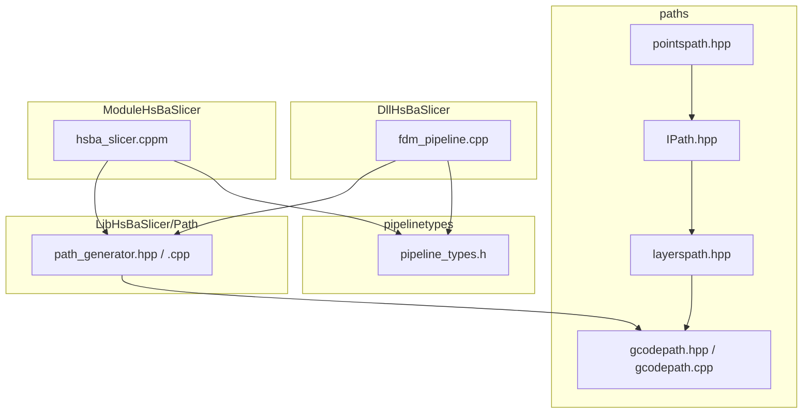
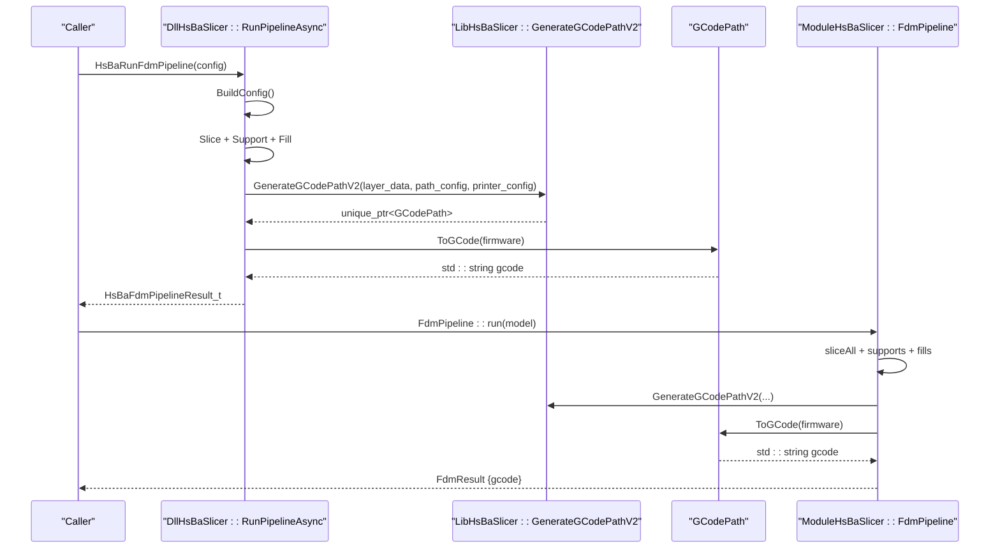
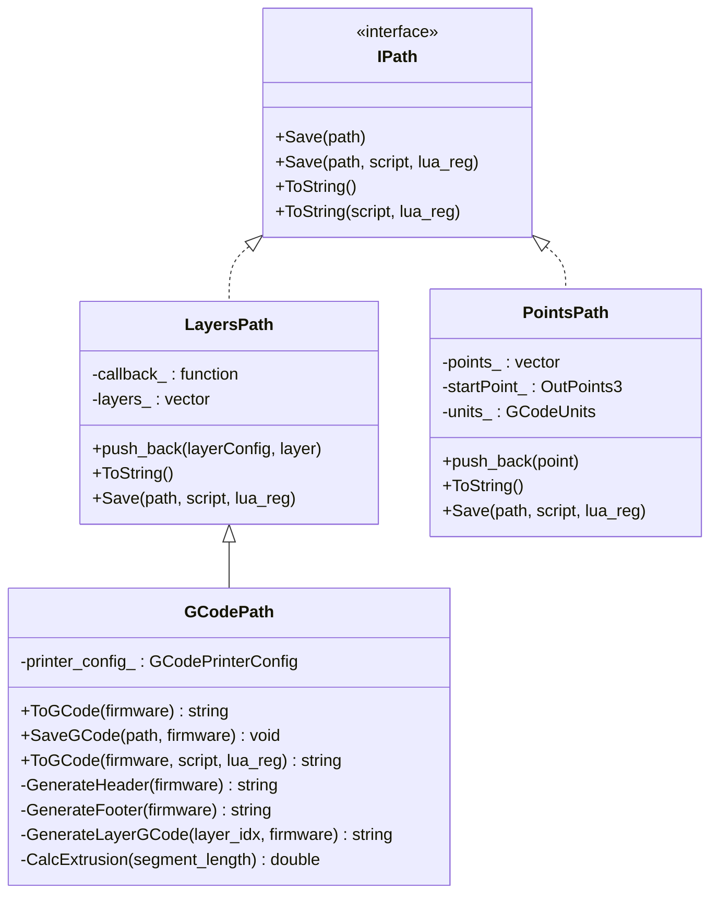
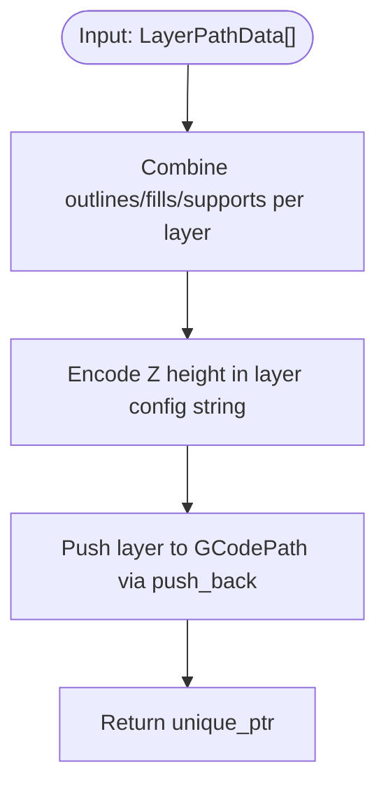
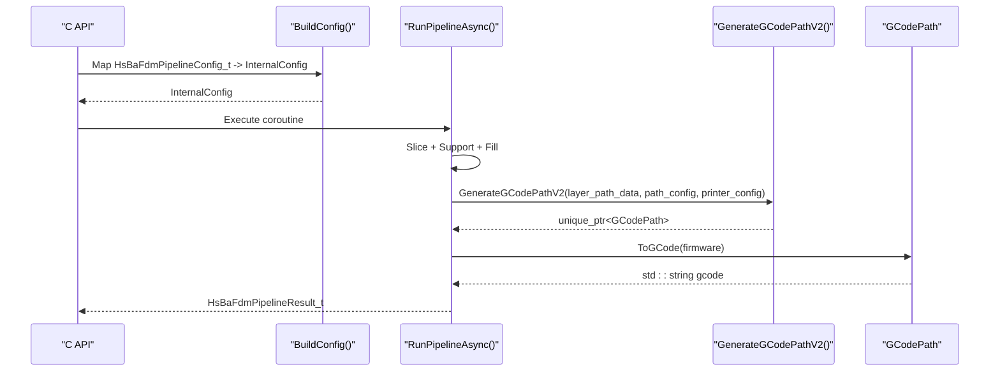
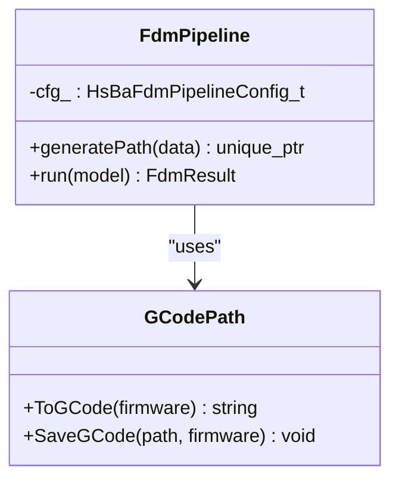
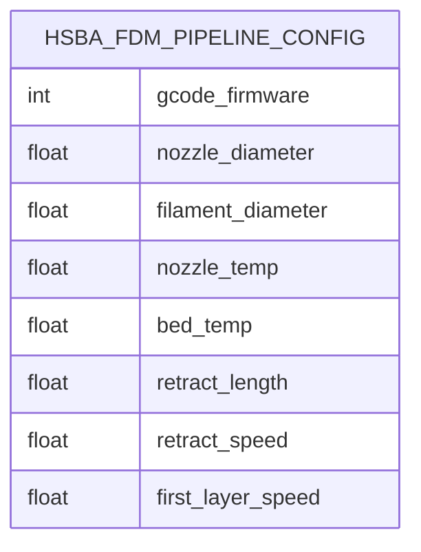
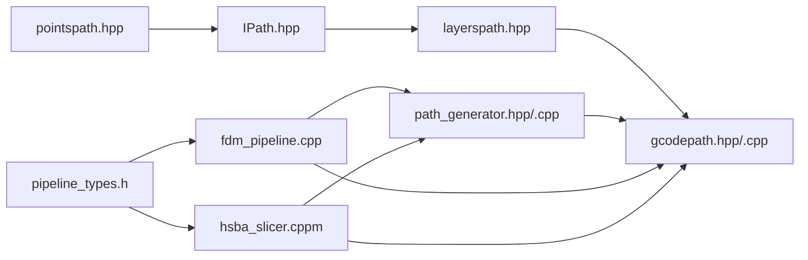

# Model Preprocessing System

<cite>
**Referenced Files in This Document**
- [gcodepath.hpp](file://paths/gcodepath.hpp)
- [gcodepath.cpp](file://paths/gcodepath.cpp)
- [layerspath.hpp](file://paths/layerspath.hpp)
- [pointspath.hpp](file://paths/pointspath.hpp)
- [IPath.hpp](file://paths/IPath.hpp)
- [CMakeLists.txt](file://paths/CMakeLists.txt)
- [pipeline_types.h](file://pipelinetypes/pipeline_types.h)
- [path_generator.hpp](file://LibHsBaSlicer/Path/path_generator.hpp)
- [path_generator.cpp](file://LibHsBaSlicer/Path/path_generator.cpp)
- [fdm_pipeline.cpp](file://DllHsBaSlicer/fdm_pipeline.cpp)
- [hsba_slicer.cppm](file://ModuleHsBaSlicer/hsba_slicer.cppm)
</cite>

## Table of Contents
1. [Introduction](#introduction)
2. [Project Structure](#project-structure)
3. [Core Components](#core-components)
4. [Architecture Overview](#architecture-overview)
5. [Detailed Component Analysis](#detailed-component-analysis)
6. [Dependency Analysis](#dependency-analysis)
7. [Performance Considerations](#performance-considerations)
8. [Troubleshooting Guide](#troubleshooting-guide)
9. [Conclusion](#conclusion)

## Introduction
This document explains the Model Preprocessing System with a focus on the new GCode path generation and multi-firmware output for FDM printing. The system introduces a dedicated GCodePath class that extends layer-based path storage to produce standard GCode strings tailored for Marlin, RepRap/RRF, and Klipper firmware targets. It integrates across LibHsBaSlicer (C++ API), DllHsBaSlicer (C ABI pipeline), and ModuleHsBaSlicer (C++20 module interface).

## Project Structure
The preprocessing and path generation components are organized into:
- paths: Core path abstractions and GCode output implementation
- pipelinetypes: C-compatible configuration types including GCode firmware selection and printer parameters
- LibHsBaSlicer/Path: Path generation utilities bridging layer data to GCodePath
- DllHsBaSlicer: Full FDM pipeline integrating slicing, support, fill, and GCode generation
- ModuleHsBaSlicer: High-level C++20 module exposing pipelines and GCodePath usage

**Diagram sources**
- [IPath.hpp](file://paths/IPath.hpp)
- [layerspath.hpp](file://paths/layerspath.hpp)
- [pointspath.hpp](file://paths/pointspath.hpp)
- [gcodepath.hpp](file://paths/gcodepath.hpp)
- [gcodepath.cpp](file://paths/gcodepath.cpp)
- [path_generator.hpp](file://LibHsBaSlicer/Path/path_generator.hpp)
- [path_generator.cpp](file://LibHsBaSlicer/Path/path_generator.cpp)
- [fdm_pipeline.cpp](file://DllHsBaSlicer/fdm_pipeline.cpp)
- [hsba_slicer.cppm](file://ModuleHsBaSlicer/hsba_slicer.cppm)
- [pipeline_types.h](file://pipelinetypes/pipeline_types.h)

**Section sources**
- [gcodepath.hpp](file://paths/gcodepath.hpp)
- [gcodepath.cpp](file://paths/gcodepath.cpp)
- [layerspath.hpp](file://paths/layerspath.hpp)
- [pointspath.hpp](file://paths/pointspath.hpp)
- [IPath.hpp](file://paths/IPath.hpp)
- [CMakeLists.txt](file://paths/CMakeLists.txt)
- [pipeline_types.h](file://pipelinetypes/pipeline_types.h)
- [path_generator.hpp](file://LibHsBaSlicer/Path/path_generator.hpp)
- [path_generator.cpp](file://LibHsBaSlicer/Path/path_generator.cpp)
- [fdm_pipeline.cpp](file://DllHsBaSlicer/fdm_pipeline.cpp)
- [hsba_slicer.cppm](file://ModuleHsBaSlicer/hsba_slicer.cppm)

## Core Components
- GCodePath: Extends LayersPath to generate firmware-specific GCode strings and files; supports Lua post-processing.
- LayersPath: Stores per-layer polygons and metadata; provides generic string conversion and Lua scripting hooks.
- PointsPath: Low-level G-point sequence representation used by legacy path generation.
- Path generator utilities: Convert layer polygon data into G-code points or directly into GCodePath instances.
- Pipeline integration: DllHsBaSlicer and ModuleHsBaSlicer use GenerateGCodePathV2 and ToGCode(firmware) for final output.

Key responsibilities:
- Firmware-specific header/footer generation
- Layer-by-layer G0/G1 moves with extrusion calculation
- Retraction handling and speed/feed rate management
- Lua-driven customization of GCode content

**Section sources**
- [gcodepath.hpp](file://paths/gcodepath.hpp)
- [gcodepath.cpp](file://paths/gcodepath.cpp)
- [layerspath.hpp](file://paths/layerspath.hpp)
- [pointspath.hpp](file://paths/pointspath.hpp)
- [path_generator.hpp](file://LibHsBaSlicer/Path/path_generator.hpp)
- [path_generator.cpp](file://LibHsBaSlicer/Path/path_generator.cpp)

## Architecture Overview
The preprocessing pipeline produces layered polygons which are converted into GCodePath objects. The DllHsBaSlicer orchestrates slicing, support, and fill stages, then delegates to path generation. The ModuleHsBaSlicer exposes a high-level API that uses the same path generation logic.

**Diagram sources**
- [fdm_pipeline.cpp](file://DllHsBaSlicer/fdm_pipeline.cpp)
- [path_generator.cpp](file://LibHsBaSlicer/Path/path_generator.cpp)
- [gcodepath.cpp](file://paths/gcodepath.cpp)
- [hsba_slicer.cppm](file://ModuleHsBaSlicer/hsba_slicer.cppm)

## Detailed Component Analysis

### GCodePath Class
GCodePath encapsulates firmware-aware GCode generation over layered polygon data. It computes extrusion amounts based on line width, layer height, filament diameter, and multiplier, and emits G0/G1 moves with appropriate feed rates and retraction behavior.

**Diagram sources**
- [IPath.hpp](file://paths/IPath.hpp)
- [layerspath.hpp](file://paths/layerspath.hpp)
- [gcodepath.hpp](file://paths/gcodepath.hpp)
- [pointspath.hpp](file://paths/pointspath.hpp)

Key behaviors:
- Header/Footer: Firmware-specific commands for temperature, homing, extruder mode, fan control, pressure advance, and motor disable.
- Layer processing: Z movement, optional retraction/unretraction, and sequential G1 moves with calculated E values.
- Lua post-processing: Optional script execution to transform base GCode; globals include firmware name and printer config table.

**Section sources**
- [gcodepath.hpp](file://paths/gcodepath.hpp)
- [gcodepath.cpp](file://paths/gcodepath.cpp)

### Path Generation Utilities
The path generator bridges layer polygon data to GCodePath instances while preserving backward compatibility with PointsPath generation.

**Diagram sources**
- [path_generator.cpp](file://LibHsBaSlicer/Path/path_generator.cpp)
- [path_generator.hpp](file://LibHsBaSlicer/Path/path_generator.hpp)

**Section sources**
- [path_generator.hpp](file://LibHsBaSlicer/Path/path_generator.hpp)
- [path_generator.cpp](file://LibHsBaSlicer/Path/path_generator.cpp)

### DllHsBaSlicer FDM Pipeline Integration
The Dll pipeline builds internal configuration from C structs, runs slicing/support/fill stages, constructs LayerPathData, generates GCodePath, and outputs firmware-specific GCode.

**Diagram sources**
- [fdm_pipeline.cpp](file://DllHsBaSlicer/fdm_pipeline.cpp)
- [path_generator.cpp](file://LibHsBaSlicer/Path/path_generator.cpp)
- [gcodepath.cpp](file://paths/gcodepath.cpp)

**Section sources**
- [fdm_pipeline.cpp](file://DllHsBaSlicer/fdm_pipeline.cpp)

### ModuleHsBaSlicer C++20 Interface
The module exposes FdmPipeline methods returning GCodePath and using ToGCode(firmware) for output. It also maps configuration fields to GCodePrinterConfig.

**Diagram sources**
- [hsba_slicer.cppm](file://ModuleHsBaSlicer/hsba_slicer.cppm)
- [gcodepath.hpp](file://paths/gcodepath.hpp)

**Section sources**
- [hsba_slicer.cppm](file://ModuleHsBaSlicer/hsba_slicer.cppm)

### Configuration Types (C ABI)
The C-compatible configuration includes firmware selection and printer parameters required for GCode generation. Defaults ensure backward compatibility.

**Diagram sources**
- [pipeline_types.h](file://pipelinetypes/pipeline_types.h)

**Section sources**
- [pipeline_types.h](file://pipelinetypes/pipeline_types.h)

## Dependency Analysis
- GCodePath depends on LayersPath for layer storage and IPath for common interfaces.
- Path generator depends on 2D polygon types and returns either PointsPath or GCodePath.
- DllHsBaSlicer depends on LibHsBaSlicer path generation and GCodePath for final output.
- ModuleHsBaSlicer depends on both LibHsBaSlicer and GCodePath for high-level APIs.
- CMake links Lua libraries and core modules to enable GCodePath functionality.

**Diagram sources**
- [IPath.hpp](file://paths/IPath.hpp)
- [layerspath.hpp](file://paths/layerspath.hpp)
- [gcodepath.hpp](file://paths/gcodepath.hpp)
- [gcodepath.cpp](file://paths/gcodepath.cpp)
- [pointspath.hpp](file://paths/pointspath.hpp)
- [path_generator.hpp](file://LibHsBaSlicer/Path/path_generator.hpp)
- [path_generator.cpp](file://LibHsBaSlicer/Path/path_generator.cpp)
- [fdm_pipeline.cpp](file://DllHsBaSlicer/fdm_pipeline.cpp)
- [hsba_slicer.cppm](file://ModuleHsBaSlicer/hsba_slicer.cppm)
- [pipeline_types.h](file://pipelinetypes/pipeline_types.h)

**Section sources**
- [CMakeLists.txt](file://paths/CMakeLists.txt)
- [pipeline_types.h](file://pipelinetypes/pipeline_types.h)
- [path_generator.hpp](file://LibHsBaSlicer/Path/path_generator.hpp)
- [path_generator.cpp](file://LibHsBaSlicer/Path/path_generator.cpp)
- [fdm_pipeline.cpp](file://DllHsBaSlicer/fdm_pipeline.cpp)
- [hsba_slicer.cppm](file://ModuleHsBaSlicer/hsba_slicer.cppm)

## Performance Considerations
- Extrusion calculation is O(1) per segment; overall complexity scales linearly with total segment count across layers.
- String building uses ostringstream; consider buffering strategies for very large models.
- Lua post-processing incurs interpreter overhead; use sparingly or cache results when possible.
- Retraction and travel moves add extra commands; tune speeds and retraction settings to balance print quality and time.

[No sources needed since this section provides general guidance]

## Troubleshooting Guide
Common issues and resolutions:
- File write failure during SaveGCode: Ensure output path is valid and writable; exceptions will be thrown with error messages.
- Lua runtime errors: Validate scripts and ensure required globals (gcode, firmware, printer_config) are provided; check error messages returned by Lua.
- Incorrect firmware output: Verify GCodeFirmware selection matches target printer; confirm printer configuration fields align with hardware capabilities.
- Extrusion anomalies: Check line_width, layer_height, filament_diameter, and extrusion_multiplier; validate relative vs absolute extrusion mode.

**Section sources**
- [gcodepath.cpp](file://paths/gcodepath.cpp)

## Conclusion
The Model Preprocessing System now supports robust, firmware-targeted GCode generation through GCodePath, integrated seamlessly across LibHsBaSlicer, DllHsBaSlicer, and ModuleHsBaSlicer. The design maintains backward compatibility while enabling extensibility via Lua post-processing and precise printer configuration. This enables consistent, high-quality GCode output for Marlin, RepRap/RRF, and Klipper platforms.

[No sources needed since this section summarizes without analyzing specific files]