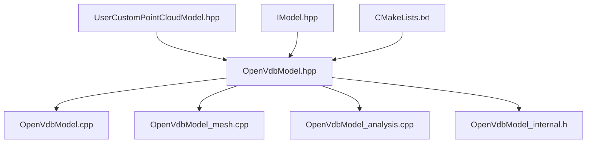
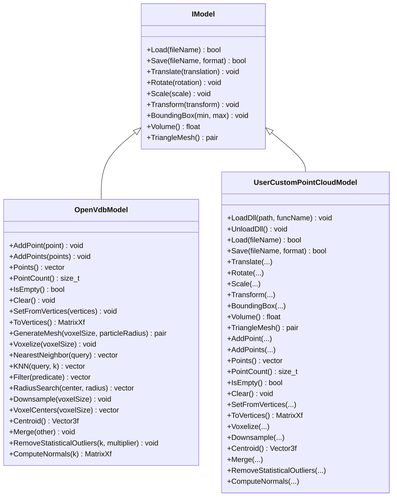
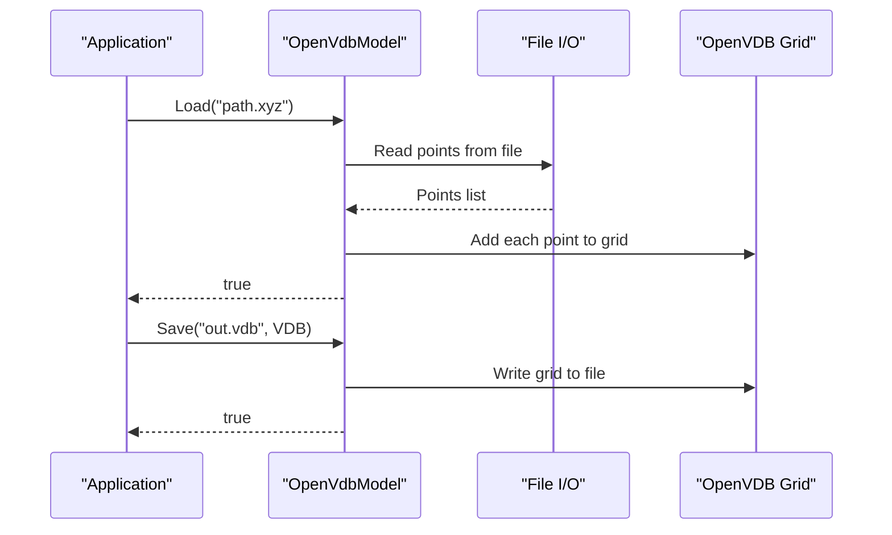
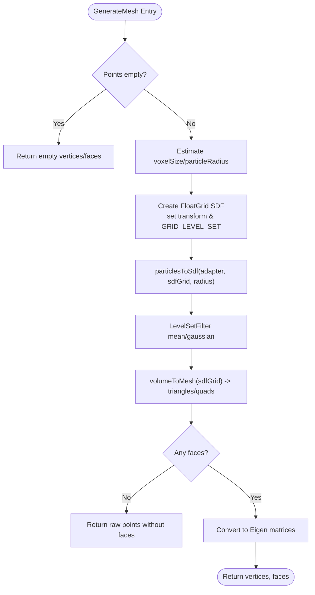
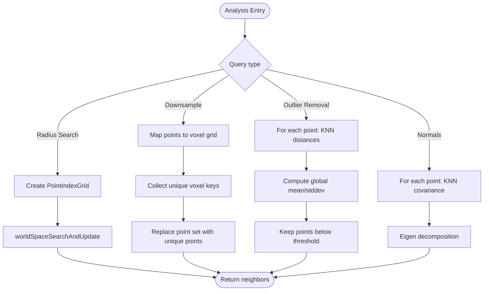
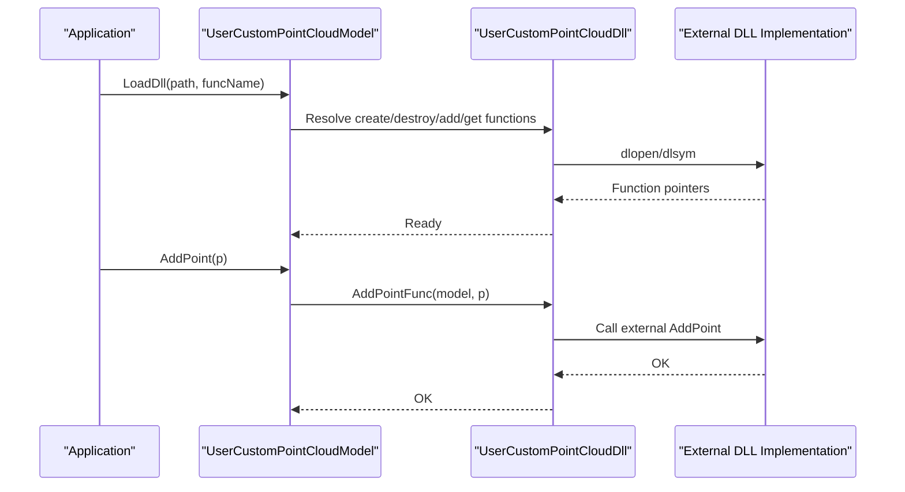
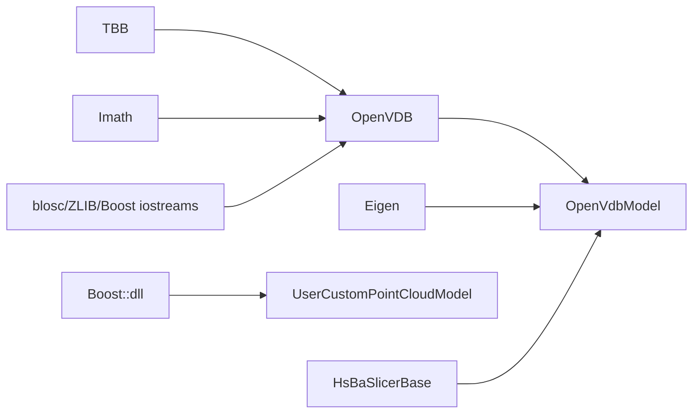

# Point Cloud Processing

<cite>
**Referenced Files in This Document**
- [OpenVdbModel.hpp](file://pointcloud/OpenVdbModel.hpp)
- [OpenVdbModel.cpp](file://pointcloud/OpenVdbModel.cpp)
- [OpenVdbModel_mesh.cpp](file://pointcloud/OpenVdbModel_mesh.cpp)
- [OpenVdbModel_analysis.cpp](file://pointcloud/OpenVdbModel_analysis.cpp)
- [OpenVdbModel_internal.h](file://pointcloud/OpenVdbModel_internal.h)
- [UserCustomPointCloudModel.hpp](file://pointcloud/UserCustomPointCloudModel.hpp)
- [IModel.hpp](file://base/IModel.hpp)
- [CMakeLists.txt](file://pointcloud/CMakeLists.txt)
- [openvdb_model_test.cpp](file://tests/Models/openvdb_model_test.cpp)
- [user_custom_point_cloud_model_test.cpp](file://tests/PointCloud/user_custom_point_cloud_model_test.cpp)
</cite>

## Table of Contents
1. [Introduction](#introduction)
2. [Project Structure](#project-structure)
3. [Core Components](#core-components)
4. [Architecture Overview](#architecture-overview)
5. [Detailed Component Analysis](#detailed-component-analysis)
6. [Dependency Analysis](#dependency-analysis)
7. [Performance Considerations](#performance-considerations)
8. [Troubleshooting Guide](#troubleshooting-guide)
9. [Conclusion](#conclusion)

## Introduction
This document explains the point cloud processing subsystem within the project. It focuses on how 3D points are stored, transformed, analyzed, and converted to triangle meshes using OpenVDB-based level set reconstruction. It also covers extensibility via a dynamically loaded custom point cloud model and provides guidance for usage, performance tuning, and troubleshooting.

## Project Structure
The point cloud module is implemented under the pointcloud directory with a clear separation between core functionality, mesh generation, and analysis utilities:
- Core storage and transformations: OpenVdbModel (header + implementation)
- Mesh generation from point clouds: OpenVdbModel_mesh.cpp
- Spatial queries and analysis: OpenVdbModel_analysis.cpp
- Internal helpers and adapters: OpenVdbModel_internal.h
- Extensible plugin interface: UserCustomPointCloudModel.hpp
- Build configuration and dependencies: CMakeLists.txt
- Tests validating behavior: openvdb_model_test.cpp, user_custom_point_cloud_model_test.cpp

**Diagram sources**
- [OpenVdbModel.hpp:1-92](file://pointcloud/OpenVdbModel.hpp#L1-L92)
- [OpenVdbModel.cpp:1-550](file://pointcloud/OpenVdbModel.cpp#L1-L550)
- [OpenVdbModel_mesh.cpp:1-120](file://pointcloud/OpenVdbModel_mesh.cpp#L1-L120)
- [OpenVdbModel_analysis.cpp:1-214](file://pointcloud/OpenVdbModel_analysis.cpp#L1-L214)
- [OpenVdbModel_internal.h:1-100](file://pointcloud/OpenVdbModel_internal.h#L1-L100)
- [UserCustomPointCloudModel.hpp:1-131](file://pointcloud/UserCustomPointCloudModel.hpp#L1-L131)
- [IModel.hpp:1-150](file://base/IModel.hpp#L1-L150)
- [CMakeLists.txt:1-58](file://pointcloud/CMakeLists.txt#L1-L58)

**Section sources**
- [OpenVdbModel.hpp:1-92](file://pointcloud/OpenVdbModel.hpp#L1-L92)
- [CMakeLists.txt:1-58](file://pointcloud/CMakeLists.txt#L1-L58)

## Core Components
- OpenVdbModel: Stores points in an OpenVDB grid, supports loading/saving (XYZ/VDB), transformations, spatial queries, downsampling, statistical outlier removal, normal estimation, and mesh generation via level sets.
- UserCustomPointCloudModel: Provides a dynamic plugin mechanism to load a custom DLL implementing a point cloud model compatible with IModel and the OpenVdbModel-like API surface.
- Internal helpers: Coordinate conversions, path normalization, and OpenVDB adapters for particles and point indexing.

Key capabilities:
- Add/iterate points, compute bounding box, centroid, and voxel centers
- Transformations: translate, rotate, scale, arbitrary transforms
- Queries: nearest neighbor, KNN, radius search, filtering
- Preprocessing: voxelize, downsample, remove outliers
- Reconstruction: generate triangle mesh from point cloud

**Section sources**
- [OpenVdbModel.hpp:16-85](file://pointcloud/OpenVdbModel.hpp#L16-L85)
- [OpenVdbModel.cpp:139-208](file://pointcloud/OpenVdbModel.cpp#L139-L208)
- [OpenVdbModel_mesh.cpp:21-117](file://pointcloud/OpenVdbModel_mesh.cpp#L21-L117)
- [OpenVdbModel_analysis.cpp:28-211](file://pointcloud/OpenVdbModel_analysis.cpp#L28-L211)
- [UserCustomPointCloudModel.hpp:73-125](file://pointcloud/UserCustomPointCloudModel.hpp#L73-L125)

## Architecture Overview
The system implements a unified IModel interface for 3D models and specializes it for point clouds using OpenVDB. The architecture separates concerns into:
- Storage and basic operations (OpenVdbModel)
- Advanced meshing pipeline (level set creation, smoothing, marching cubes)
- Spatial analysis and preprocessing (index grids, KNN, statistics)
- Plugin extensibility (dynamic loading of custom implementations)

**Diagram sources**
- [IModel.hpp:109-138](file://base/IModel.hpp#L109-L138)
- [OpenVdbModel.hpp:16-85](file://pointcloud/OpenVdbModel.hpp#L16-L85)
- [UserCustomPointCloudModel.hpp:73-125](file://pointcloud/UserCustomPointCloudModel.hpp#L73-L125)

## Detailed Component Analysis

### OpenVdbModel: Storage and Transformations
- Grid-backed storage: Uses an OpenVDB Vec3f grid to store active voxels as points.
- File I/O: Loads VDB files or XYZ/TXT ASCII point files; saves to VDB or XYZ.
- Transformations: Applies translation, rotation, scaling, and general transforms by iterating over active values.
- Bounding box and centroid: Efficiently computed by scanning active voxels.
- Mesh conversion: Exposes TriangleMesh() which delegates to GenerateMesh().

**Diagram sources**
- [OpenVdbModel.cpp:139-208](file://pointcloud/OpenVdbModel.cpp#L139-L208)

**Section sources**
- [OpenVdbModel.cpp:107-137](file://pointcloud/OpenVdbModel.cpp#L107-L137)
- [OpenVdbModel.cpp:210-283](file://pointcloud/OpenVdbModel.cpp#L210-L283)
- [OpenVdbModel.cpp:285-317](file://pointcloud/OpenVdbModel.cpp#L285-L317)
- [OpenVdbModel.cpp:319-389](file://pointcloud/OpenVdbModel.cpp#L319-L389)
- [OpenVdbModel.cpp:391-403](file://pointcloud/OpenVdbModel.cpp#L391-L403)

### Mesh Generation Pipeline
- Auto parameters: If voxel size or particle radius is not provided, they are estimated from bounding box extent and point density.
- Level set creation: Particles are rasterized into a signed distance field (SDF) grid using OpenVDB tools.
- Smoothing: Mean and Gaussian filters reduce noise in the SDF.
- Marching cubes: Extracts triangles and quads at zero level set; quads are triangulated.
- Fallback: If no faces are generated, returns vertices without faces.

**Diagram sources**
- [OpenVdbModel_mesh.cpp:21-117](file://pointcloud/OpenVdbModel_mesh.cpp#L21-L117)

**Section sources**
- [OpenVdbModel_mesh.cpp:21-117](file://pointcloud/OpenVdbModel_mesh.cpp#L21-L117)

### Spatial Queries and Analysis
- Nearest neighbor and KNN: Brute-force scan over active voxels; suitable for moderate sizes.
- Radius search: Uses OpenVDB PointIndexGrid for efficient spatial queries.
- Downsampling: Collapses points into unique voxels based on a given voxel size.
- Statistical outlier removal: Computes per-point mean distances to neighbors, then removes points exceeding global threshold.
- Normal estimation: Covariance-based PCA over K-nearest neighbors yields per-point normals.

**Diagram sources**
- [OpenVdbModel_analysis.cpp:28-211](file://pointcloud/OpenVdbModel_analysis.cpp#L28-L211)

**Section sources**
- [OpenVdbModel_analysis.cpp:28-64](file://pointcloud/OpenVdbModel_analysis.cpp#L28-L64)
- [OpenVdbModel_analysis.cpp:66-95](file://pointcloud/OpenVdbModel_analysis.cpp#L66-L95)
- [OpenVdbModel_analysis.cpp:97-159](file://pointcloud/OpenVdbModel_analysis.cpp#L97-L159)
- [OpenVdbModel_analysis.cpp:161-211](file://pointcloud/OpenVdbModel_analysis.cpp#L161-L211)

### Dynamic Plugin Interface
- IUserCustomPointCloud defines function pointers for creating/destroying models and exposing point cloud operations.
- UserCustomPointCloudDll loads a DLL and resolves required functions.
- UserCustomPointCloudModel wraps the DLL to provide an IModel-compatible API that mirrors OpenVdbModel’s point cloud methods.

**Diagram sources**
- [UserCustomPointCloudModel.hpp:15-71](file://pointcloud/UserCustomPointCloudModel.hpp#L15-L71)
- [UserCustomPointCloudModel.hpp:73-125](file://pointcloud/UserCustomPointCloudModel.hpp#L73-L125)

**Section sources**
- [UserCustomPointCloudModel.hpp:15-71](file://pointcloud/UserCustomPointCloudModel.hpp#L15-L71)
- [UserCustomPointCloudModel.hpp:73-125](file://pointcloud/UserCustomPointCloudModel.hpp#L73-L125)

### Internal Helpers and Adapters
- Path normalization: Converts UTF-8 paths to local encoding.
- Coordinate conversions: Between Eigen vectors and OpenVDB types.
- PointArrayAdapter: Adapts std::vector<Eigen::Vector3f> to OpenVDB’s PointIndexGrid interface.
- LevelSetParticleAdapter: Adapts points to OpenVDB’s particles-to-level-set interface with radius support.

**Section sources**
- [OpenVdbModel_internal.h:23-47](file://pointcloud/OpenVdbModel_internal.h#L23-L47)
- [OpenVdbModel_internal.h:49-94](file://pointcloud/OpenVdbModel_internal.h#L49-L94)

## Dependency Analysis
- External libraries:
  - OpenVDB: Core grid, level set tools, and mesh extraction.
  - Eigen: Linear algebra and geometry types.
  - TBB, Imath: Required by OpenVDB build.
  - Boost (optional): For DLL loading on desktop builds.
  - blosc, ZLIB, Boost iostreams: Linked when OpenVDB is available due to static archive linking constraints.
- Module coupling:
  - OpenVdbModel depends on base interfaces (IModel, error types).
  - Mesh generation and analysis are split across separate compilation units to avoid MSVC section limits.
  - UserCustomPointCloudModel depends on Boost::dll on desktop platforms.

**Diagram sources**
- [CMakeLists.txt:1-58](file://pointcloud/CMakeLists.txt#L1-L58)

**Section sources**
- [CMakeLists.txt:1-58](file://pointcloud/CMakeLists.txt#L1-L58)

## Performance Considerations
- Large datasets: Prefer radius search via PointIndexGrid for spatial queries; brute-force KNN scales linearly with point count.
- Mesh generation:
  - Choose appropriate voxel size; too small increases memory and computation, too large reduces fidelity.
  - Particle radius affects smoothness and connectivity; auto-estimation uses average spacing derived from point density.
- Downsampling and voxelize: Use these to reduce point counts before heavy operations like normal estimation or meshing.
- Outlier removal: Tune k and multiplier to balance noise removal vs. preserving detail.
- Platform notes: MSVC requires /bigobj for mesh generation due to template instantiation limits.

[No sources needed since this section provides general guidance]

## Troubleshooting Guide
Common issues and resolutions:
- Loading failures:
  - Ensure file extension matches supported formats (.xyz/.txt for ASCII points, .vdb for OpenVDB).
  - Verify file contains valid 3D coordinates; empty or malformed files will cause errors.
- Unsupported save format:
  - Saving to non-point-cloud formats throws an error; use XYZ or VDB.
- Invalid arguments:
  - Positive voxel size required for voxelize/downsampling/radius search.
  - Positive k required for outlier removal and normal estimation.
- Empty results:
  - Radius search or KNN may return empty if no points exist or query conditions are not met.
- Memory and object limits:
  - On MSVC, mesh generation is separated into its own compilation unit to avoid section limit issues.

**Section sources**
- [OpenVdbModel.cpp:188-208](file://pointcloud/OpenVdbModel.cpp#L188-L208)
- [OpenVdbModel_analysis.cpp:28-33](file://pointcloud/OpenVdbModel_analysis.cpp#L28-L33)
- [OpenVdbModel_analysis.cpp:66-71](file://pointcloud/OpenVdbModel_analysis.cpp#L66-L71)
- [OpenVdbModel_analysis.cpp:97-102](file://pointcloud/OpenVdbModel_analysis.cpp#L97-L102)
- [CMakeLists.txt:55-58](file://pointcloud/CMakeLists.txt#L55-L58)

## Conclusion
The point cloud processing subsystem provides a robust, extensible framework for storing, transforming, analyzing, and reconstructing triangle meshes from point data. Leveraging OpenVDB enables efficient spatial operations and high-quality mesh generation. The modular design allows integration into larger pipelines and supports dynamic plugins for custom backends. Proper parameter selection and preprocessing steps are key to achieving optimal performance and quality.