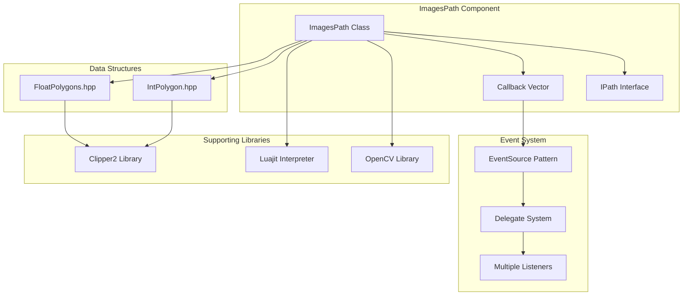
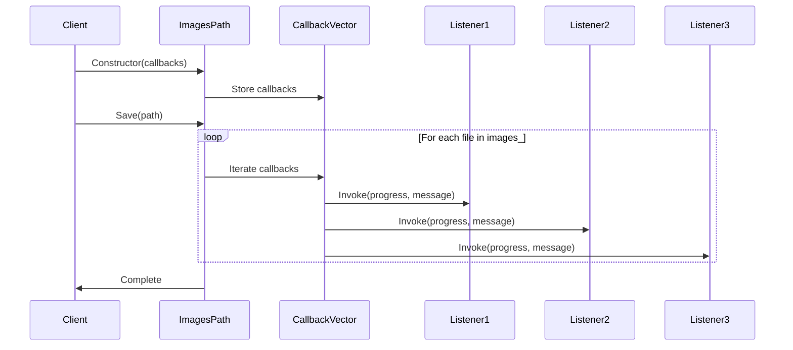
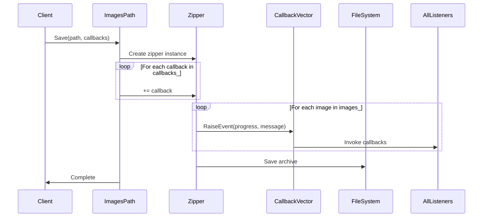
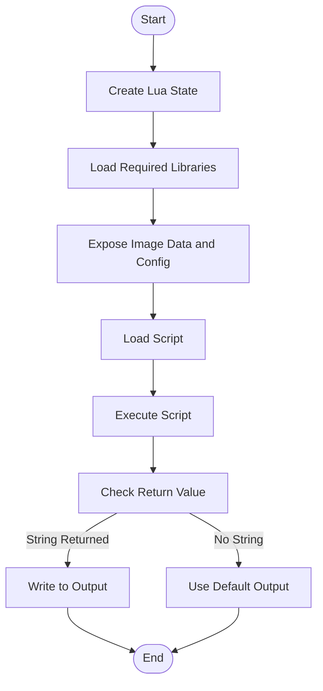

# Images Path

<cite>
**Referenced Files in This Document**   
- [imagespath.cpp](file://paths/imagespath.cpp)
- [imagespath.hpp](file://paths/imagespath.hpp)
- [IPath.hpp](file://paths/IPath.hpp)
- [EventSourceFunction.hpp](file://LibHsBaSlicer/Extends/EventSourceFunction.hpp)
- [EventSourceFunction.cpp](file://LibHsBaSlicer/Extends/EventSourceFunction.cpp)
- [zipper.hpp](file://fileoperator/zipper.hpp)
- [zipper.cpp](file://fileoperator/zipper.cpp)
- [delegate.hpp](file://base/delegate.hpp)
- [event_source_register.cpp](file://DllHsBaSlicer/event_source_register.cpp)
- [sla_floor.cpp](file://LibHsBaSlicer/Floor/sla_floor.cpp)
- [sls_export.cpp](file://LibHsBaSlicer/Path/sls_export.cpp)
- [images_path_test.cpp](file://tests/PathsOut/images_path_test.cpp)
- [PolygonFill.cpp](file://2D/PolygonFill.cpp)
- [PolygonFill.hpp](file://2D/PolygonFill.hpp)
- [ImageToPolygons.cpp](file://2D/ImageToPolygons.cpp)
- [ImageToPolygons.hpp](file://2D/ImageToPolygons.hpp)
- [IntPolygon.hpp](file://2D/IntPolygon.hpp)
- [FloatPolygons.hpp](file://2D/FloatPolygons.hpp)
- [LuaAdapter.cpp](file://2D/LuaAdapter.cpp)
- [LuaAdapter.hpp](file://2D/LuaAdapter.hpp)
- [image_from_polygons.lua](file://tests/PolygonFill/image_from_polygons.lua)
- [custom_fill.lua](file://tests/PolygonFill/custom_fill.lua)
</cite>

## Update Summary
**Changes Made**   
- Updated ImagesPath class constructor documentation to reflect vector of callback functions support
- Added comprehensive coverage of multi-listener callback system for progress reporting
- Enhanced callback architecture explanation with EventSource pattern details
- Updated usage examples to demonstrate multiple callback registration
- Expanded performance optimization section to cover callback management

## Table of Contents
1. [Introduction](#introduction)
2. [Core Components](#core-components)
3. [Architecture Overview](#architecture-overview)
4. [Detailed Component Analysis](#detailed-component-analysis)
5. [Image Generation Process](#image-generation-process)
6. [Script-Based Image Generation](#script-based-image-generation)
7. [Use Cases and Applications](#use-cases-and-applications)
8. [Performance Optimization](#performance-optimization)
9. [Conclusion](#conclusion)

## Introduction
The Images Path component is a specialized implementation within the HsBaSlicer system designed to generate raster image outputs from sliced polygon data. This component plays a crucial role in visualizing 3D model slices as 2D images for quality inspection, UI previews, and other visualization purposes. The ImagesPath class implements the IPath interface to provide a standardized way of handling image-based output generation, leveraging OpenCV and Lua scripting for flexible image processing and format conversion. **Updated**: The component now supports multiple callback listeners through a vector-based callback system, enabling simultaneous progress reporting to multiple observers during image generation operations. This document details the implementation, functionality, and usage patterns of the ImagesPath component, focusing on its role in converting polygon data to pixel-based representations and its enhanced event-driven architecture.

## Core Components
The ImagesPath component consists of several key files that work together to provide image generation capabilities. The core implementation is in imagespath.cpp and imagespath.hpp, which define the ImagesPath class that inherits from the IPath interface. This class manages image data and provides methods for saving and converting images. **Updated**: The constructor now accepts a vector of callback functions (`std::vector<std::function<void(double, std::string_view)>>`) instead of a single callback, enabling multiple listeners to receive progress updates simultaneously. The component relies on supporting libraries for polygon manipulation (PolygonFill.cpp), image-to-polygon conversion (ImageToPolygons.cpp), and Lua scripting integration (LuaAdapter.cpp). The IntPolygon.hpp and FloatPolygons.hpp files define the fundamental data structures used for representing polygonal data in both integer and floating-point formats, which are essential for precise geometric calculations during the image generation process.

**Section sources**
- [imagespath.cpp:19-23](file://paths/imagespath.cpp#L19-L23)
- [imagespath.hpp:15-17](file://paths/imagespath.hpp#L15-L17)
- [IPath.hpp:16-34](file://paths/IPath.hpp#L16-L34)

## Architecture Overview
The ImagesPath component follows a modular architecture that separates concerns between data management, image processing, and output generation. The component implements the IPath interface, ensuring compatibility with the broader HsBaSlicer system's path generation framework. At its core, the ImagesPath class maintains a collection of images as base64-encoded strings, along with configuration data and a vector of callback functions for progress reporting. **Updated**: The architecture leverages an EventSource pattern through the delegate system, allowing multiple callback listeners to be registered and invoked simultaneously during image processing operations. The component integrates with OpenCV for raster image operations and uses the Clipper2 library for polygon manipulation. This layered approach enables the system to handle complex polygon-to-image conversions while maintaining flexibility for different output requirements and providing comprehensive progress tracking through multiple observers.

**Diagram sources**
- [imagespath.hpp:12-44](file://paths/imagespath.hpp#L12-L44)
- [IPath.hpp:16-34](file://paths/IPath.hpp#L16-L34)
- [EventSourceFunction.hpp:14-15](file://LibHsBaSlicer/Extends/EventSourceFunction.hpp#L14-L15)
- [delegate.hpp:197-243](file://base/delegate.hpp#L197-L243)

## Detailed Component Analysis

### ImagesPath Class Implementation
The ImagesPath class implements the IPath interface to provide standardized methods for image output generation. **Updated**: The constructor now accepts three parameters: configuration file path, configuration string, and a vector of callback functions for progress reporting. Each callback function receives two parameters: a double value representing progress percentage and a string view containing status information. The AddImage method allows for the addition of image data to the collection, storing images as base64-encoded strings with associated file paths. This design enables efficient memory management and facilitates the creation of compressed output archives while supporting multiple concurrent progress observers.

**Updated** The callback system enables scenarios such as:
- UI progress bars updating in real-time
- Logging systems recording operation progress
- Analytics systems tracking performance metrics
- Multiple monitoring components receiving synchronized updates

**Section sources**
- [imagespath.cpp:19-23](file://paths/imagespath.cpp#L19-L23)
- [imagespath.hpp:15-17](file://paths/imagespath.hpp#L15-L17)

### Multi-Listener Callback Architecture
**New Section**: The ImagesPath component implements a sophisticated multi-listener callback system that allows multiple observers to receive progress updates simultaneously. The callback vector stores multiple `std::function<void(double, std::string_view)>` instances, each capable of handling progress events independently. During image generation operations, the component iterates through all registered callbacks and invokes them with current progress information.

The callback system is integrated throughout the image generation pipeline:
- **Save Method**: All callbacks are invoked during ZIP archive creation, providing granular progress updates for each file being added
- **ToString Method**: Callbacks are triggered when generating string representations, allowing observers to track processing stages
- **Error Handling**: Progress callbacks continue to fire even when errors occur, providing complete operation visibility

**Diagram sources**
- [imagespath.cpp:30-43](file://paths/imagespath.cpp#L30-L43)
- [imagespath.cpp:330-333](file://paths/imagespath.cpp#L330-L333)

### Image Data Management
The ImagesPath component manages image data through an unordered_map that associates file paths with base64-encoded image strings. This approach allows for efficient lookup and storage of multiple images within a single instance. The component provides methods to add images to this collection, with each image stored as a string representation of its binary data. This design choice enables the component to handle various image formats (PNG, JPEG, etc.) without requiring format-specific handling, as the encoded data can represent any binary image format. The use of base64 encoding also facilitates easy transmission and storage of image data within text-based systems.

**Section sources**
- [imagespath.cpp:25-28](file://paths/imagespath.cpp#L25-L28)
- [imagespath.hpp:42-43](file://paths/imagespath.hpp#L42-L43)

### Save Method Overloads
The ImagesPath class provides multiple overloads of the Save method to support different output scenarios. **Updated**: The basic Save method creates a ZIP archive containing the configuration data and all images in the collection, invoking all registered callbacks during the compression process. Additional overloads accept Lua scripts that can customize the output process, allowing for script-based image generation and processing. These script-based methods create a Lua execution environment, expose the image data and configuration to Lua scripts, and execute the provided script to generate the final output. The callback system ensures that all progress events are propagated to every registered listener throughout the entire save operation.

**Diagram sources**
- [imagespath.cpp:30-43](file://paths/imagespath.cpp#L30-L43)
- [zipper.cpp:114-115](file://fileoperator/zipper.cpp#L114-L115)

### ToString Method Overloads
The ToString method overloads provide alternative ways to generate string representations of the image data. **Updated**: The basic ToString method returns a formatted string containing the configuration data and base64-decoded image content, while invoking all registered callbacks to notify listeners of the string generation process. The script-based overloads execute Lua scripts in a similar manner to the Save methods, allowing for custom string generation based on the image data. These methods create a Lua environment, expose the image collection and configuration, execute the provided script, and return the resulting string. The callback system ensures comprehensive progress tracking throughout the string generation process, enabling multiple observers to monitor the operation.

**Section sources**
- [imagespath.cpp:328-343](file://paths/imagespath.cpp#L328-L343)
- [imagespath.hpp:22-28](file://paths/imagespath.hpp#L22-L28)

## Image Generation Process

### Polygon to Image Conversion
The process of converting 2D polygons to pixel-based representations involves several steps. First, polygon data is processed using the Clipper2 library to ensure geometric correctness and to perform any necessary operations such as offsetting or boolean operations. The processed polygons are then rasterized into a bitmap representation using OpenCV. This conversion process maps the continuous coordinate system of the polygons to the discrete pixel grid of the output image. The resolution of the output image determines the precision of this mapping, with higher resolutions providing more accurate representations of the original geometry.

**Section sources**
- [ImageToPolygons.cpp:144-195](file://2D/ImageToPolygons.cpp#L144-L195)
- [PolygonFill.cpp:25-800](file://2D/PolygonFill.cpp#L25-L800)

### Coordinate Mapping Strategy
The coordinate mapping strategy converts polygon coordinates from the model's coordinate system to pixel coordinates in the output image. This transformation involves scaling the coordinates based on the specified pixel size and image dimensions. The origin of the coordinate system is typically mapped to the top-left corner of the image, with positive X extending right and positive Y extending down, following standard image coordinate conventions. This mapping ensures that the spatial relationships between polygon elements are preserved in the final image output.

**Section sources**
- [ImageToPolygons.cpp:187-189](file://2D/ImageToPolygons.cpp#L187-L189)
- [FloatPolygons.hpp:51-55](file://2D/FloatPolygons.hpp#L51-L55)

### Color Encoding
Color encoding in the image generation process uses grayscale values to represent different elements of the output. By default, the background is encoded with a specified background color (typically white or black) while the polygon fills are rendered with a foreground color. The color values are specified as 8-bit integers, allowing for 256 shades of gray. This grayscale approach is efficient for storage and processing while still providing clear visual distinction between filled and unfilled areas. The color encoding can be customized through parameters to the image generation functions.

**Section sources**
- [ImageToPolygons.cpp:178-193](file://2D/ImageToPolygons.cpp#L178-L193)
- [ImageToPolygons.hpp:16-16](file://2D/ImageToPolygons.hpp#L16-L16)

## Script-Based Image Generation

### Lua Integration
The ImagesPath component integrates with Lua scripting to provide extensible image generation capabilities. When a script is provided to the Save or ToString methods, the component creates a Lua execution environment, loads the necessary libraries, and exposes the image data and configuration to the script. The Lua script can then process this data to generate custom output. This integration allows users to implement complex image processing workflows, apply custom filters, or generate specialized output formats without modifying the core component code.

**Section sources**
- [imagespath.cpp:45-115](file://paths/imagespath.cpp#L45-L115)
- [LuaAdapter.cpp:282-287](file://2D/LuaAdapter.cpp#L282-L287)

### Script Execution Flow
The script execution flow follows a consistent pattern across the Save and ToString methods. First, a new Lua state is created and initialized with the required libraries. Then, the image data and configuration are exposed as global variables in the Lua environment. The provided script is loaded and executed, with any returned string value used as the output data. This flow ensures that scripts have access to all necessary data while maintaining isolation between different script executions. The use of Lua's error handling mechanisms provides robust error reporting when scripts fail to execute correctly.

**Diagram sources**
- [imagespath.cpp:45-115](file://paths/imagespath.cpp#L45-L115)
- [imagespath.cpp:195-252](file://paths/imagespath.cpp#L195-L252)

### Example Script Usage
Example scripts demonstrate how to use the Lua integration for image generation. The image_from_polygons.lua script shows how to create a grayscale image from polygon data using Bresenham's line algorithm to draw polygon outlines. The script initializes a blank image, iterates through the polygon vertices, and draws lines between consecutive points. This example illustrates the basic pattern for accessing polygon data and generating pixel output. More complex scripts could implement fill algorithms, apply image filters, or generate vector output formats.

**Section sources**
- [image_from_polygons.lua:1-47](file://tests/PolygonFill/image_from_polygons.lua#L1-L47)
- [images_path_test.cpp:36-45](file://tests/PathsOut/images_path_test.cpp#L36-L45)

## Use Cases and Applications

### Quality Inspection
One primary use case for the ImagesPath component is quality inspection of 3D model slices. By generating high-resolution images of each slice layer, engineers and designers can visually inspect the geometry for defects, inconsistencies, or unexpected features. **Updated**: The multi-listener callback system enables comprehensive progress monitoring during quality inspection workflows, allowing multiple analysis tools to receive synchronized updates about the inspection process. The ability to generate PNG or JPEG outputs allows for easy integration with existing quality control workflows and documentation systems. The image previews can be used to verify that slicing parameters are producing the desired results before proceeding to physical manufacturing.

**Section sources**
- [ImageToPolygons.cpp:144-195](file://2D/ImageToPolygons.cpp#L144-L195)
- [imagespath.cpp:30-43](file://paths/imagespath.cpp#L30-L43)

### UI Previews
The component is also valuable for generating UI previews of 3D model slices. These previews can be displayed in user interfaces to provide immediate visual feedback during the slicing process. **Updated**: The callback system enables responsive UI updates by allowing multiple UI components to receive progress information simultaneously. This supports features like progress bars, status indicators, and real-time preview updates. The ability to quickly generate image representations of complex polygon data enables responsive user experiences, allowing users to adjust slicing parameters and immediately see the results. The script-based generation capabilities allow for customization of the preview appearance, such as adding grid lines, measurement indicators, or other UI elements.

**Section sources**
- [imagespath.cpp:328-343](file://paths/imagespath.cpp#L328-L343)
- [ImageToPolygons.cpp:144-195](file://2D/ImageToPolygons.cpp#L144-L195)

### Documentation and Reporting
The ImagesPath component supports documentation and reporting use cases by enabling the generation of image-based reports from slicing operations. **Updated**: The multi-listener callback system facilitates comprehensive audit trails and logging during report generation, allowing multiple logging systems to capture progress information. These reports can include visual representations of slice layers along with metadata and analysis results. The ToString method overloads with Lua scripts can generate custom report formats, combining image data with textual information in a single output. This capability is particularly useful for regulatory compliance, design reviews, or manufacturing documentation.

**Section sources**
- [imagespath.cpp:328-343](file://paths/imagespath.cpp#L328-L343)
- [images_path_test.cpp:36-45](file://tests/PathsOut/images_path_test.cpp#L36-L45)

## Performance Optimization

### High-Resolution Image Generation
Generating high-resolution images presents performance challenges due to the increased memory and processing requirements. **Updated**: The ImagesPath component addresses these challenges through several optimization strategies, including efficient callback management and batched progress updates. First, it uses efficient data structures and algorithms for polygon processing, leveraging the Clipper2 library's optimized implementations. Second, it employs streaming techniques where possible, processing image data in chunks rather than loading entire images into memory. Finally, it uses base64 encoding to compress image data during intermediate processing stages, reducing memory footprint. The callback system is designed to minimize overhead by avoiding unnecessary callback invocations during critical processing phases.

**Section sources**
- [ImageToPolygons.cpp:147-195](file://2D/ImageToPolygons.cpp#L147-L195)
- [imagespath.cpp:30-43](file://paths/imagespath.cpp#L30-L43)

### Memory Management
Memory management is critical when generating large images or processing multiple images simultaneously. **Updated**: The component uses std::unordered_map to store image data, providing efficient lookup and insertion operations. The use of string_view parameters in the interface methods allows for zero-copy data transfer when possible, reducing memory allocation overhead. Additionally, the component leverages RAII (Resource Acquisition Is Initialization) principles to ensure proper cleanup of resources, particularly when working with the Lua execution environment. The callback vector is managed efficiently, with callbacks being passed by const reference to avoid unnecessary copying.

**Section sources**
- [imagespath.hpp:42-43](file://paths/imagespath.hpp#L42-L43)
- [imagespath.cpp:25-28](file://paths/imagespath.cpp#L25-L28)

### Processing Efficiency
Processing efficiency is achieved through careful algorithm selection and implementation. **Updated**: The callback system is optimized to minimize performance impact while providing comprehensive progress tracking. The polygon fill algorithms in PolygonFill.cpp use optimized approaches such as scanline filling and efficient data structures for storing intermediate results. The integration with OpenCV leverages highly optimized image processing routines implemented in C++. The Lua scripting interface is designed to minimize overhead by reusing Lua states when possible and avoiding unnecessary data copying between C++ and Lua environments. The multi-listener callback system uses efficient iteration patterns to invoke all registered callbacks with minimal overhead.

**Section sources**
- [PolygonFill.cpp:25-800](file://2D/PolygonFill.cpp#L25-L800)
- [ImageToPolygons.cpp:144-195](file://2D/ImageToPolygons.cpp#L144-L195)

### Callback System Optimization
**New Section**: The multi-listener callback system is specifically optimized for performance in high-throughput scenarios. The callback vector is stored as a const reference parameter, avoiding unnecessary copies during object construction. During image generation operations, callbacks are invoked in tight loops with minimal overhead, ensuring that progress updates don't significantly impact processing speed. The callback signature `void(double, std::string_view)` is designed for optimal performance, using primitive types and views to avoid memory allocations.

The callback system supports various optimization strategies:
- **Batch Updates**: Multiple progress events can be coalesced to reduce callback frequency
- **Conditional Invocation**: Callbacks can check progress thresholds to avoid excessive updates
- **Thread Safety**: The underlying delegate system provides thread-safe callback invocation
- **Zero-Copy Design**: String views prevent unnecessary string copying during callback invocation

**Section sources**
- [EventSourceFunction.hpp:14-15](file://LibHsBaSlicer/Extends/EventSourceFunction.hpp#L14-L15)
- [delegate.hpp:197-243](file://base/delegate.hpp#L197-L243)

## Conclusion
The ImagesPath component provides a robust and flexible solution for generating raster image outputs from sliced polygon data in the HsBaSlicer system. **Updated**: By implementing the IPath interface and leveraging OpenCV and Lua scripting, the component offers a powerful combination of standardized functionality and extensibility. The recent enhancement to support multiple callback listeners through a vector-based callback system significantly improves the component's observability and integration capabilities. This enables sophisticated monitoring, logging, and UI update scenarios where multiple components need synchronized progress information. The ability to convert 2D polygons to pixel-based representations enables important use cases such as quality inspection, UI previews, and documentation. The component's design emphasizes performance optimization, particularly for high-resolution image generation, through efficient algorithms, memory management, and optimized callback invocation patterns. The integration with Lua scripting provides a powerful mechanism for customizing the image generation process, allowing users to implement specialized workflows without modifying the core component. Overall, the ImagesPath component serves as a critical bridge between geometric data and visual representation in the 3D slicing workflow, with enhanced event-driven architecture supporting modern application requirements for comprehensive progress tracking and multi-component coordination.