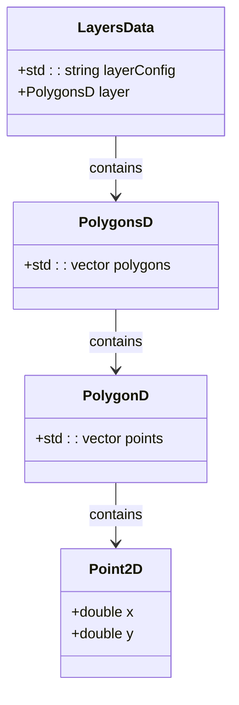
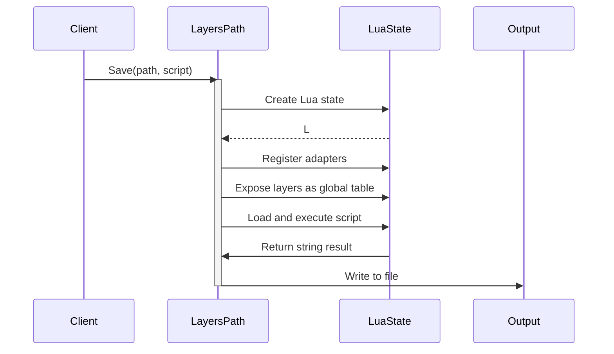
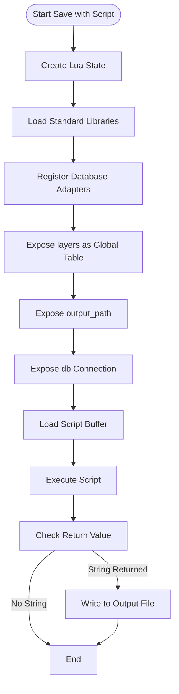

# Layers Path

<cite>
**Referenced Files in This Document**   
- [layerspath.hpp](file://paths/layerspath.hpp)
- [layerspath.cpp](file://paths/layerspath.cpp)
- [IPath.hpp](file://paths/IPath.hpp)
- [FloatPolygons.hpp](file://2D/FloatPolygons.hpp)
- [sql_adapter.hpp](file://fileoperator/sql_adapter.hpp)
- [LuaAdapter.hpp](file://fileoperator/LuaAdapter.hpp)
- [layers_path_test.cpp](file://tests/PathsOut/layers_path_test.cpp)
</cite>

## Table of Contents
1. [Introduction](#introduction)
2. [Core Architecture](#core-architecture)
3. [Internal Data Representation](#internal-data-representation)
4. [Serialization Mechanisms](#serialization-mechanisms)
5. [Lua Scripting Integration](#lua-scripting-integration)
6. [Format-Specific Output Examples](#format-specific-output-examples)
7. [3D Printing Workflow Integration](#3d-printing-workflow-integration)
8. [Precision and Unit Handling](#precision-and-unit-handling)
9. [Troubleshooting Guide](#troubleshooting-guide)
10. [Performance Optimization](#performance-optimization)

## Introduction

The LayersPath component serves as a specialized implementation of the IPath interface designed for serializing sliced layer data into structured output formats for 3D printing applications. This component provides a flexible framework for representing and exporting layer contours, infill paths, and support structures in various formats including G-code, JSON, and binary representations. The design emphasizes extensibility through Lua scripting capabilities, allowing users to customize output formats without modifying the core codebase. The component plays a critical role in the slicing pipeline by transforming geometric polygon data into machine-executable instructions while maintaining precision in Z-height calculations and path ordering.

**Section sources**
- [layerspath.hpp](file://paths/layerspath.hpp#L1-L39)
- [layerspath.cpp](file://paths/layerspath.cpp#L1-L454)

## Core Architecture

The LayersPath class implements the IPath interface to provide a standardized approach to path serialization. The architecture follows a composition pattern where layer data is stored as a collection of LayersData structures, each containing configuration metadata and geometric polygon data. The class exposes multiple Save and ToString method overloads that enable different serialization strategies based on the provided parameters. When no script is provided, the component defaults to SQLite database storage, creating a structured database with layers table containing layer configuration and serialized polygon data. The callback mechanism allows for event monitoring during database operations, providing feedback on SQL execution status.

```mermaid
classDiagram
class IPath {
<<interface>>
+virtual void Save(const std : : filesystem : : path&) const = 0
+virtual void Save(const std : : filesystem : : path&, std : : string_view script) const = 0
+virtual std : : string ToString() const = 0
}
class LayersPath {
-std : : function<void(std : : string_view, std : : string_view)> callback_
-std : : vector<LayersData> layers_
+LayersPath(const std : : function<void(std : : string_view, std : : string_view)>& callback)
+virtual void Save(const std : : filesystem : : path& path) const
+virtual void Save(const std : : filesystem : : path& path, std : : string_view script) const
+virtual std : : string ToString() const
+void push_back(const std : : string& layerConfig, const PolygonsD& layer)
}
class LayersData {
+std : : string layerConfig
+PolygonsD layer
}
LayersPath --|> IPath : implements
LayersPath --> LayersData : contains
```

**Diagram sources**
- [layerspath.hpp](file://paths/layerspath.hpp#L13-L35)
- [IPath.hpp](file://paths/IPath.hpp#L12-L24)

**Section sources**
- [layerspath.hpp](file://paths/layerspath.hpp#L13-L35)
- [layerspath.cpp](file://paths/layerspath.cpp#L17-L25)

## Internal Data Representation

The component represents layer data using the PolygonsD type, which is defined as Clipper2Lib::PathsD from the Clipper2 library. This representation consists of nested containers where each layer contains multiple polygons, and each polygon is represented as a sequence of 2D points with double precision coordinates. The LayersData structure combines this geometric data with configuration metadata in string format, allowing for flexible association of slicing parameters, material settings, or process variables with each layer. The internal storage uses a std::vector of LayersData structures, maintaining the sequential order of layers as they are added through the push_back method. This ordered collection preserves the vertical stacking sequence essential for proper 3D printing execution.



**Diagram sources**
- [FloatPolygons.hpp](file://2D/FloatPolygons.hpp#L13-L15)
- [layerspath.hpp](file://paths/layerspath.hpp#L28-L32)

**Section sources**
- [FloatPolygons.hpp](file://2D/FloatPolygons.hpp#L13-L15)
- [layerspath.hpp](file://paths/layerspath.hpp#L28-L32)

## Serialization Mechanisms

The LayersPath component provides multiple serialization mechanisms through its Save method overloads. The default Save operation without script parameters stores data in an SQLite database with a predefined schema containing id, layer_config, and layer_data columns. The layer_data is stored as a text representation of the polygon structure in a custom format that preserves the hierarchical relationship between layers, polygons, and points. When Lua scripting is enabled, the component creates a Lua execution environment and exposes the layer data as a global "layers" table with config and data properties for each layer. This structured representation allows Lua scripts to traverse and transform the data into various output formats. The serialization process maintains the original ordering of layers and polygons, ensuring that the spatial relationships are preserved in the output.



**Diagram sources**
- [layerspath.cpp](file://paths/layerspath.cpp#L67-L158)
- [sql_adapter.hpp](file://fileoperator/sql_adapter.hpp#L106-L135)

**Section sources**
- [layerspath.cpp](file://paths/layerspath.cpp#L27-L65)
- [layerspath.cpp](file://paths/layerspath.cpp#L67-L158)

## Lua Scripting Integration

The component integrates Lua scripting through the use of a dedicated Lua state that is created and managed during serialization operations. When a script is provided, the component initializes a Lua interpreter, loads standard libraries, and registers database adapters for SQLite, MySQL, and PostgreSQL (when enabled). The layer data is exposed to the Lua environment as a global "layers" table with each entry containing config and data fields, where data is a nested table structure representing polygons and points. The script can access the output path through the "output_path" global variable and can optionally use the provided database connection through the "db" global. Scripts can return a string result that will be written directly to the output file, or they can use the database connection to store data in structured format. This integration enables users to implement custom format converters, apply post-processing transformations, or generate specialized output for specific 3D printer models.



**Diagram sources**
- [layerspath.cpp](file://paths/layerspath.cpp#L69-L158)
- [LuaAdapter.hpp](file://fileoperator/LuaAdapter.hpp#L17-L29)

**Section sources**
- [layerspath.cpp](file://paths/layerspath.cpp#L69-L158)
- [LuaAdapter.hpp](file://fileoperator/LuaAdapter.hpp#L17-L29)

## Format-Specific Output Examples

The component supports various output formats through Lua scripting, as demonstrated in the test cases. For CSV output, a Lua script can iterate through the layers table and format the data as comma-separated values with headers. The script accesses each layer's configuration and polygon data, formatting the X and Y coordinates to four decimal places. For G-code generation, the component can be extended through similar scripting mechanisms to convert polygon paths into G-code commands with appropriate feed rates, extrusion values, and motion types. The test cases show how a simple Lua script can transform the hierarchical polygon data into a flat CSV structure, demonstrating the flexibility of the scripting interface. The component can also generate JSON output by using Lua's table serialization capabilities or by implementing custom formatting logic in the script.

```mermaid
flowchart TD
Input([Layer Data]) --> CSV["CSV Format"]
Input --> JSON["JSON Format"]
Input --> GCode["G-code Format"]
Input --> Binary["Binary Format"]
CSV --> Script1["Lua: table.concat with formatting"]
JSON --> Script2["Lua: JSON library or custom serialization"]
GCode --> Script3["Lua: G-code command generation"]
Binary --> Script4["Lua: Binary packing functions"]
Script1 --> Output1["config,x,y\\ncfg1,1.0000,2.0000"]
Script2 --> Output2["{layers:[{config:\"cfg1\",data:[[1,2]]}]}"]
Script3 --> Output3["G1 X1.0 Y2.0 E0.1\\nG1 X3.0 Y4.0 E0.2"]
Script4 --> Output4["Binary packed coordinates"]
```

**Diagram sources**
- [layers_path_test.cpp](file://tests/PathsOut/layers_path_test.cpp#L31-L40)
- [layerspath.cpp](file://paths/layerspath.cpp#L262-L284)

**Section sources**
- [layers_path_test.cpp](file://tests/PathsOut/layers_path_test.cpp#L31-L40)
- [layerspath.cpp](file://paths/layerspath.cpp#L262-L284)

## 3D Printing Workflow Integration

The LayersPath component integrates into 3D printing workflows by serving as the final stage in the slicing pipeline where geometric layer data is transformed into machine-executable instructions. In typical usage, the slicer engine generates polygon contours for each layer at specific Z heights, and these contours are passed to the LayersPath component along with configuration parameters. The component can then serialize this data directly to a printer-compatible format or store it in an intermediate database for further processing. The Lua scripting capability allows for workflow customization, such as generating support structures, optimizing path ordering for reduced print time, or applying machine-specific compensation algorithms. The component's ability to handle large layer sets makes it suitable for high-resolution prints with thousands of layers, where efficient serialization and format conversion are critical for workflow performance.

**Section sources**
- [layerspath.hpp](file://paths/layerspath.hpp#L16-L26)
- [layerspath.cpp](file://paths/layerspath.cpp#L22-L25)

## Precision and Unit Handling

The component maintains high precision in geometric calculations by using double-precision floating-point values for coordinate representation in the PolygonsD type. This ensures accurate representation of fine details in printed objects, particularly important for small features or high-resolution prints. The Z-height precision is preserved through the layer configuration metadata, which can include exact height values and layer thickness parameters. The component does not perform unit conversion internally but relies on consistent input units (typically millimeters) from the slicing engine. When generating output formats like G-code, unit consistency is maintained by ensuring that all coordinate values use the same unit system. The SQLite storage format preserves the full precision of the original data, preventing rounding errors during intermediate storage. For applications requiring specific precision levels, Lua scripts can implement custom rounding or quantization logic during the formatting process.

**Section sources**
- [FloatPolygons.hpp](file://2D/FloatPolygons.hpp#L13-L15)
- [layerspath.cpp](file://paths/layerspath.cpp#L46-L57)

## Troubleshooting Guide

Common serialization issues with the LayersPath component typically involve Lua script errors, file access problems, or database connection failures. Lua script errors manifest as load or runtime exceptions with descriptive error messages from the Lua interpreter, often due to syntax errors or attempts to access non-existent data fields. File access issues occur when the output path is invalid, the directory does not exist, or there are insufficient permissions to create or write to the file. Database connection failures may result from invalid file paths or disk space limitations. To troubleshoot these issues, verify that Lua scripts properly handle the expected data structure, ensure that output directories exist and are writable, and check that the SQLite database file can be created at the specified location. Performance issues with large layer sets can be addressed by optimizing Lua scripts to minimize memory usage and by ensuring efficient data access patterns.

**Section sources**
- [layerspath.cpp](file://paths/layerspath.cpp#L34-L35)
- [layerspath.cpp](file://paths/layerspath.cpp#L148-L151)
- [layerspath.cpp](file://paths/layerspath.cpp#L219-L222)

## Performance Optimization

For handling large layer sets, several performance optimization strategies can be employed. The component's use of efficient data structures like std::vector for storing layer data provides good cache locality and iteration performance. When processing large datasets, consider using binary formats instead of text-based serialization to reduce file size and I/O time. Lua scripts should be optimized to minimize memory allocations and avoid unnecessary data copying when transforming large polygon sets. For database storage, batch operations can improve performance compared to individual insert statements. The component's design allows for streaming output in some scenarios, where layers can be processed and written incrementally rather than holding all data in memory simultaneously. Additionally, using compiled Lua scripts or pre-processing steps can reduce execution time for complex formatting operations on large datasets.

**Section sources**
- [layerspath.cpp](file://paths/layerspath.cpp#L43-L64)
- [layerspath.cpp](file://paths/layerspath.cpp#L67-L158)