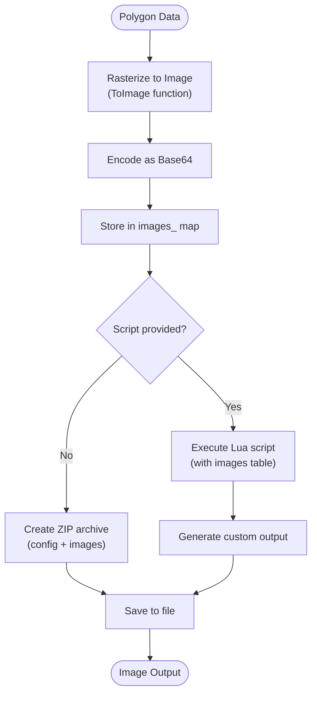
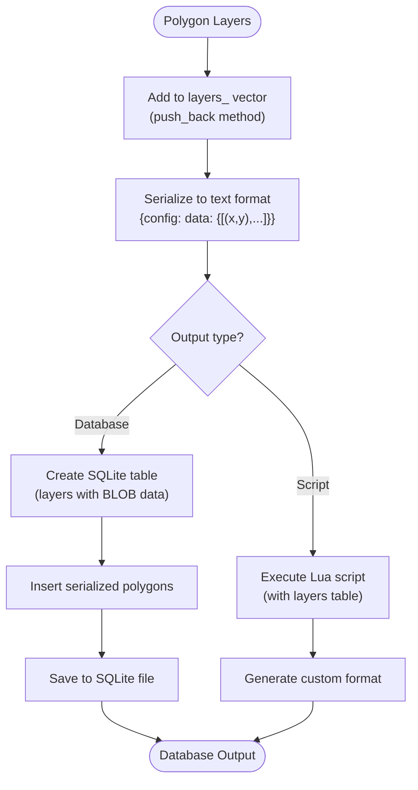
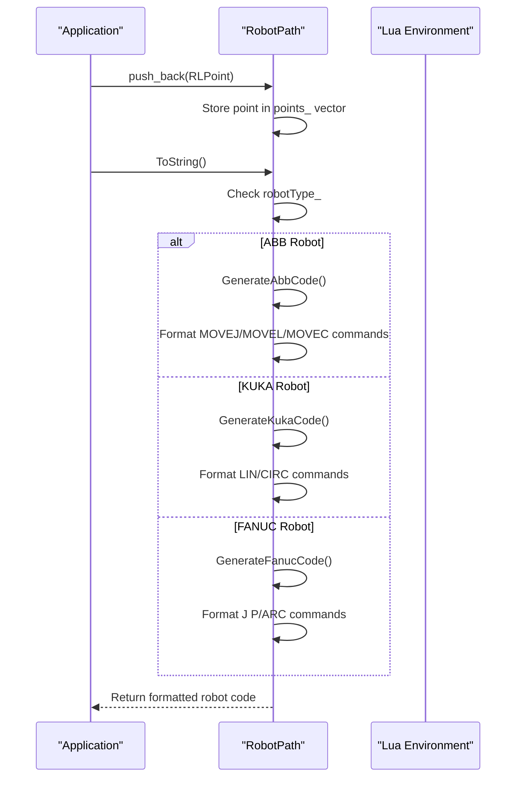

# Path Generation

<cite>
**Referenced Files in This Document**   
- [IPath.hpp](file://paths/IPath.hpp)
- [imagespath.hpp](file://paths/imagespath.hpp)
- [imagespath.cpp](file://paths/imagespath.cpp)
- [layerspath.hpp](file://paths/layerspath.hpp)
- [layerspath.cpp](file://paths/layerspath.cpp)
- [robotpath.hpp](file://paths/robotpath.hpp)
- [robotpath.cpp](file://paths/robotpath.cpp)
- [pointspath.hpp](file://paths/pointspath.hpp)
- [pointspath.cpp](file://paths/pointspath.cpp)
- [FloatPolygons.hpp](file://2D/FloatPolygons.hpp)
- [ImageToPolygons.hpp](file://2D/ImageToPolygons.hpp)
- [ImageToPolygons.cpp](file://2D/ImageToPolygons.cpp)
- [layers_path_test.cpp](file://tests/PathsOut/layers_path_test.cpp)
- [images_path_test.cpp](file://tests/PathsOut/images_path_test.cpp)
- [points_path_test.cpp](file://tests/PathsOut/points_path_test.cpp)
</cite>

## Table of Contents
1. [Introduction](#introduction)
2. [Core Path Generators Overview](#core-path-generators-overview)
3. [Interface Definition: IPath](#interface-definition-ipath)
4. [ImagesPath: Raster Output Generation](#imagespath-raster-output-generation)
5. [LayersPath: Sliced Layer Data Export](#layerspath-sliced-layer-data-export)
6. [RobotPath: Robotic Toolpath Generation](#robotpath-robotic-toolpath-generation)
7. [Coordinate System and Unit Handling](#coordinate-system-and-unit-handling)
8. [Extensibility via Lua Scripting](#extensibility-via-lua-scripting)
9. [Use Cases in Manufacturing Scenarios](#use-cases-in-manufacturing-scenarios)
10. [Conclusion](#conclusion)

## Introduction

The Path Generation component in HsBaSlicer is responsible for transforming sliced polygon data into domain-specific output formats suitable for various manufacturing processes. This system provides a flexible and extensible architecture through a common interface `IPath`, with concrete implementations tailored for different output requirements: `ImagesPath` for raster image output, `LayersPath` for storing sliced layer geometry, and `RobotPath` for generating robotic toolpaths. Each generator handles the conversion of `PolygonsD` (double-precision floating-point polygons) into specialized representations while supporting extensibility through Lua scripting for custom output formats.

**Section sources**
- [IPath.hpp](file://paths/IPath.hpp)
- [FloatPolygons.hpp](file://2D/FloatPolygons.hpp)

## Core Path Generators Overview

The path generation system consists of four primary implementations that inherit from the `IPath` interface:
- **ImagesPath**: Generates raster images (PNG/SVG) from polygon data, suitable for visual inspection or bitmap-based manufacturing
- **LayersPath**: Stores sliced layer geometry in structured formats (e.g., SQLite database), preserving both configuration and polygonal data
- **RobotPath**: Creates robot-specific toolpaths (ABB, KUKA, FANUC) with motion commands and velocity parameters
- **PointsPath**: Produces G-code-like point sequences with motion types, coordinates, and extrusion values

These generators share a common design pattern of collecting processed polygon data and providing multiple output methods, including direct file saving and string serialization, with support for custom Lua-based transformations.

```mermaid
classDiagram
class IPath {
<<interface>>
+~IPath()
+Save(path : filesystem : : path) const
+Save(path : filesystem : : path, script : string_view) const
+ToString() const
+ToString(script : string_view) const
}
class ImagesPath {
-config_ : ConfigFile
-images_ : unordered_map<string,string>
-callback_ : function<void(double,string_view)>
+AddImage(path : string_view, image_str : string_view)
}
class LayersPath {
-callback_ : function<void(string_view,string_view)>
-layers_ : vector<LayersData>
+push_back(layerConfig : string, layer : PolygonsD)
}
class RobotPath {
-robotType_ : RLType
-startPoint_ : OutPoints3
-points_ : vector<RLPoint>
-startProgramFunc_ : string
-endProgramFunc_ : string
+push_back(point : RLPoint)
+getRobotType() RLType
}
class PointsPath {
-points_ : vector<GPoint>
-startPoint_ : OutPoints3
-units_ : GCodeUnits
+push_back(point : GPoint)
}
IPath <|-- ImagesPath
IPath <|-- LayersPath
IPath <|-- RobotPath
IPath <|-- PointsPath
```

**Diagram sources**
- [IPath.hpp](file://paths/IPath.hpp)
- [imagespath.hpp](file://paths/imagespath.hpp)
- [layerspath.hpp](file://paths/layerspath.hpp)
- [robotpath.hpp](file://paths/robotpath.hpp)
- [pointspath.hpp](file://paths/pointspath.hpp)

## Interface Definition: IPath

The `IPath` interface serves as the foundation for all path generators, defining a consistent API for saving and serializing path data. It declares multiple overloads of `Save` and `ToString` methods that accept various combinations of output paths, Lua scripts, and function names. This design enables both direct output generation and script-driven customization. The interface uses `std::filesystem::path` for file operations and `std::string_view` for efficient string handling, ensuring compatibility with modern C++ practices.

The `IPath` interface does not define methods for adding data, as this responsibility is delegated to concrete implementations based on their specific data models. This separation allows each generator to maintain its own internal data structure while providing a uniform output interface.

**Section sources**
- [IPath.hpp](file://paths/IPath.hpp)

## ImagesPath: Raster Output Generation

The `ImagesPath` class converts polygon data into raster image formats such as PNG or SVG. It stores images as base64-encoded strings in an internal map, associating each image path with its encoded data. The generator accepts a configuration file and string during construction, which are preserved for output. Images are added via the `AddImage` method, which takes a file path and base64-encoded image data.

When saving, `ImagesPath` can either create a ZIP archive containing the configuration and all images, or execute a Lua script to generate custom output. The Lua integration allows for dynamic image processing, format conversion, or custom packaging. The `ToString` method provides a text representation that includes the configuration and decoded image data, facilitating debugging and inspection.

The implementation leverages OpenCV for rasterization, converting polygon coordinates to pixel positions based on a specified pixel size. This enables precise control over image resolution and scaling, making it suitable for applications requiring pixel-perfect correspondence between geometry and output.



**Diagram sources**
- [imagespath.hpp](file://paths/imagespath.hpp)
- [imagespath.cpp](file://paths/imagespath.cpp)
- [ImageToPolygons.cpp](file://2D/ImageToPolygons.cpp)

## LayersPath: Sliced Layer Data Export

The `LayersPath` class manages the export of sliced layer data, storing both configuration parameters and polygon geometry for each layer. It maintains a vector of `LayersData` structures, each containing a layer configuration string and corresponding `PolygonsD` data. Layers are added using the `push_back` method, which takes a configuration string and polygon set.

The primary output format is a SQLite database, where each layer is stored as a record with configuration metadata and serialized polygon data. The serialization format uses a custom text representation with coordinate tuples, enabling both human readability and efficient parsing. Alternatively, Lua scripts can be used to transform the layer data into other formats such as CSV, JSON, or custom binary formats.

The `LayersPath` implementation demonstrates a hybrid approach to data persistence, combining structured database storage with scriptable transformation capabilities. This flexibility allows the system to adapt to different workflow requirements, from direct database integration to custom file format generation.



**Diagram sources**
- [layerspath.hpp](file://paths/layerspath.hpp)
- [layerspath.cpp](file://paths/layerspath.cpp)

## RobotPath: Robotic Toolpath Generation

The `RobotPath` class generates toolpaths for industrial robots, supporting multiple robot types including ABB, KUKA, and FANUC. It stores a sequence of `RLPoint` structures, each representing a robot motion command with end coordinates, middle point (for arcs), velocity, and motion type (MoveJ, MoveL, MoveC). The generator maintains the robot type, start point, and program function names for proper code generation.

The `ToString` method produces robot-specific code by delegating to `GenerateAbbCode`, `GenerateKukaCode`, or `GenerateFanucCode` based on the robot type. Each generator creates syntactically correct robot programs with appropriate motion commands, speed parameters, and safety configurations. For example, ABB output uses `MOVEJ`, `MOVEL`, and `MOVEC` commands with zone and tool data specifications, while KUKA uses `LIN` and `CIRC` statements.

The implementation supports program segmentation through special point types like `ProgramLStart`, `ProgramCStart`, and their corresponding end types, allowing for modular program generation with custom start/end functions. This enables integration with existing robot programs and complex manufacturing sequences.



**Diagram sources**
- [robotpath.hpp](file://paths/robotpath.hpp)
- [robotpath.cpp](file://paths/robotpath.cpp)

## Coordinate System and Unit Handling

The path generation system maintains consistent coordinate handling across all generators, using double-precision floating-point values (`double`) for geometric calculations. The `OutPoints3` structure stores X, Y, and Z coordinates as `float` values, providing sufficient precision for manufacturing applications while maintaining memory efficiency.

Unit handling is implemented in the `PointsPath` class through the `GCodeUnits` enum, which supports both millimeter (`mm`) and inch units. The `ToString` method automatically includes the appropriate G-code unit command (`G21` for mm, `G20` for inches) in the output. This ensures that generated toolpaths are correctly interpreted by CNC controllers regardless of the unit system.

Coordinate transformations are handled during the slicing process, with the path generators receiving pre-transformed `PolygonsD` data. This separation of concerns allows the path generation system to focus on format conversion rather than geometric manipulation, improving both performance and reliability.

**Section sources**
- [IPath.hpp](file://paths/IPath.hpp)
- [pointspath.hpp](file://paths/pointspath.hpp)
- [FloatPolygons.hpp](file://2D/FloatPolygons.hpp)

## Extensibility via Lua Scripting

A key feature of the path generation system is its extensibility through Lua scripting. All generators support script-based output generation, allowing users to customize the output format without modifying the C++ code. When a Lua script is provided to `Save` or `ToString`, the system creates a Lua state, registers necessary libraries (SQLite, Zipper, Cipher), and exposes the path data as global variables.

For example, `ImagesPath` exposes a `config` table and `images` array, while `LayersPath` provides a `layers` table with configuration and polygon data. The script can then process this data and return a custom string, which is either saved to file or returned to the caller. This mechanism enables powerful customization scenarios, such as generating specialized file formats, applying post-processing filters, or integrating with external systems.

The Lua integration is secured through sandboxing and error handling, ensuring that script failures do not compromise the stability of the main application. Error messages are captured and reported through exceptions, providing clear feedback for script debugging.

**Section sources**
- [imagespath.cpp](file://paths/imagespath.cpp)
- [layerspath.cpp](file://paths/layerspath.cpp)
- [robotpath.cpp](file://paths/robotpath.cpp)

## Use Cases in Manufacturing Scenarios

The different path generators serve distinct manufacturing scenarios:

**ImagesPath** is ideal for:
- Visual inspection of sliced layers
- Bitmap-based manufacturing processes
- Quality control documentation
- Integration with image-processing pipelines

**LayersPath** is suited for:
- Archiving sliced geometry with metadata
- Database-backed manufacturing workflows
- Multi-material printing with layer-specific configurations
- Post-processing analysis of slice data

**RobotPath** enables:
- Robotic additive manufacturing (3D printing with robotic arms)
- Automated welding and coating applications
- CNC machining with articulated robots
- Complex multi-axis manufacturing sequences

**PointsPath** supports:
- Traditional 3D printing with Cartesian printers
- CNC milling and routing
- Laser cutting and engraving
- Any application requiring G-code-like point-to-point motion

Each generator can be selected based on the specific requirements of the manufacturing process, with the option to extend functionality through Lua scripting for specialized applications.

**Section sources**
- [imagespath.hpp](file://paths/imagespath.hpp)
- [layerspath.hpp](file://paths/layerspath.hpp)
- [robotpath.hpp](file://paths/robotpath.hpp)
- [pointspath.hpp](file://paths/pointspath.hpp)

## Conclusion

The Path Generation component in HsBaSlicer provides a robust and flexible framework for converting sliced polygon data into various manufacturing-ready formats. Through a well-defined interface and specialized implementations, it supports diverse output requirements while maintaining a consistent API. The integration of Lua scripting enables extensive customization without compromising the core system's stability. This architecture effectively bridges the gap between geometric processing and physical manufacturing, supporting a wide range of applications from traditional 3D printing to advanced robotic fabrication.