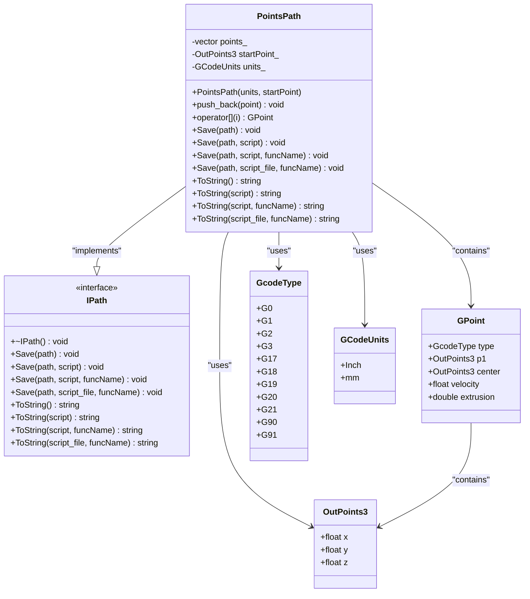
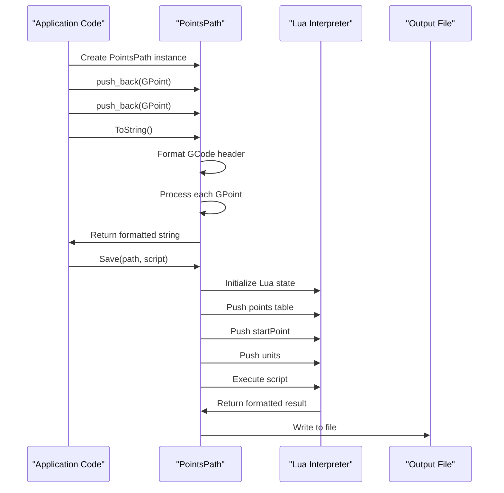
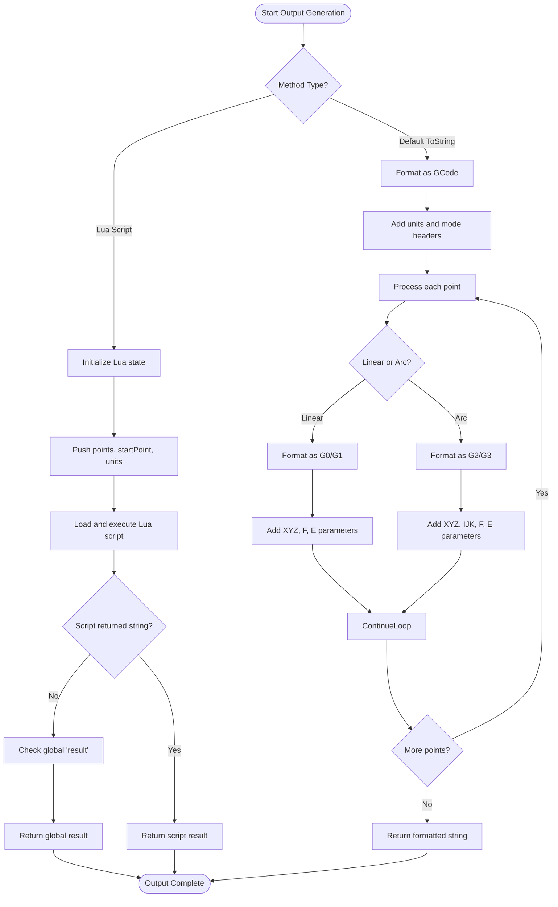

# Points Path

<cite>
**Referenced Files in This Document**   
- [IPath.hpp](file://paths/IPath.hpp)
- [pointspath.hpp](file://paths/pointspath.hpp)
- [pointspath.cpp](file://paths/pointspath.cpp)
- [points_path_test.cpp](file://tests/PathsOut/points_path_test.cpp)
</cite>

## Table of Contents
1. [Introduction](#introduction)
2. [Core Components](#core-components)
3. [Architecture Overview](#architecture-overview)
4. [Detailed Component Analysis](#detailed-component-analysis)
5. [Performance Considerations](#performance-considerations)
6. [Troubleshooting Guide](#troubleshooting-guide)

## Introduction
The Points Path component is a specialized implementation within the HsBaSlicer system designed to handle 3D point cloud data and discrete point sequences for manufacturing and robotics applications. This component provides a flexible interface for generating, processing, and exporting point-based path data that can be consumed by various downstream systems including robotic controllers, metrology equipment, and custom path planners. The design emphasizes precision, configurability, and interoperability through its integration with Lua scripting for custom output formatting.

**Section sources**
- [IPath.hpp](file://paths/IPath.hpp#L1-L34)
- [pointspath.hpp](file://paths/pointspath.hpp#L1-L68)

## Core Components

The Points Path component consists of the PointsPath class which implements the IPath interface to provide standardized methods for saving and converting path data. The component uses the OutPoints3 structure for 3D coordinate storage and the GPoint structure to represent individual path points with associated metadata such as movement type, velocity, and extrusion values. The implementation supports multiple output formats through direct string conversion and Lua-based templating, allowing for flexible integration with different target systems.

**Section sources**
- [pointspath.hpp](file://paths/pointspath.hpp#L1-L68)
- [pointspath.cpp](file://paths/pointspath.cpp#L1-L332)

## Architecture Overview

**Diagram sources**
- [IPath.hpp](file://paths/IPath.hpp#L12-L24)
- [pointspath.hpp](file://paths/pointspath.hpp#L42-L64)
- [pointspath.hpp](file://paths/pointspath.hpp#L26-L31)
- [pointspath.hpp](file://paths/pointspath.hpp#L12-L25)
- [pointspath.hpp](file://paths/pointspath.hpp#L33-L40)

## Detailed Component Analysis

### PointsPath Class Implementation
The PointsPath class implements the IPath interface to provide standardized methods for handling point-based path data. It stores a collection of GPoint objects in a vector container, with each GPoint representing a discrete point in the path with associated movement parameters. The class maintains internal state including the coordinate units (millimeters or inches), a start point for the path, and the collection of path points.

**Diagram sources**
- [pointspath.cpp](file://paths/pointspath.cpp#L39-L97)
- [pointspath.cpp](file://paths/pointspath.cpp#L99-L198)

#### Data Structure and Storage
The PointsPath component uses the OutPoints3 structure defined in IPath.hpp to store 3D coordinates as float values for x, y, and z axes. This structure serves as the fundamental building block for all point data in the system. The GPoint structure extends this basic point representation by adding movement type (GcodeType), velocity, extrusion amount, and arc center coordinates for circular movements. Points are stored internally in a std::vector<GPoint> container, providing efficient sequential access and dynamic sizing capabilities.

**Section sources**
- [IPath.hpp](file://paths/IPath.hpp#L26-L31)
- [pointspath.hpp](file://paths/pointspath.hpp#L33-L40)
- [pointspath.hpp](file://paths/pointspath.hpp#L61-L63)

#### Point Collection and Processing
The PointsPath class collects points through the push_back method, which adds GPoint objects to the internal vector. Each GPoint can represent different types of movements including rapid moves (G0), linear interpolation (G1), and circular interpolation (G2/G3). For linear moves, only the endpoint (p1) is used, while arc movements utilize both the endpoint and center point to define the circular path. The component processes these points sequentially when generating output, applying appropriate formatting based on the movement type.

**Section sources**
- [pointspath.cpp](file://paths/pointspath.cpp#L43-L46)
- [pointspath.cpp](file://paths/pointspath.cpp#L63-L94)

#### Output Generation and Export
The PointsPath component provides multiple methods for exporting data through the Save and ToString methods. The default ToString implementation generates GCode output with appropriate headers for units (G20/G21) and positioning mode (G90), followed by commands for each point in the path. The component also supports Lua-based templating through overloaded ToString and Save methods that accept script parameters, enabling custom output formats for different target systems.

**Diagram sources**
- [pointspath.cpp](file://paths/pointspath.cpp#L49-L97)
- [pointspath.cpp](file://paths/pointspath.cpp#L99-L198)
- [pointspath.cpp](file://paths/pointspath.cpp#L200-L205)

#### Use Cases and Applications
The PointsPath component is designed for various manufacturing and robotics applications. It can generate point data for robotic controllers by formatting output in robot-specific languages (ABB, KUKA, FANUC) through Lua scripts. For metrology systems, it can export point clouds in CSV or other text-based formats for inspection and measurement. The component also supports custom path planners by providing raw point sequence data that can be further processed or optimized. The precision of coordinate transformations and point density can be controlled through the input data, ensuring accuracy for high-precision applications.

**Section sources**
- [points_path_test.cpp](file://tests/PathsOut/points_path_test.cpp#L40-L79)
- [pointspath.cpp](file://paths/pointspath.cpp#L99-L198)

## Performance Considerations
When handling large point datasets, the PointsPath component's performance is primarily affected by the vector container's memory allocation patterns and the string formatting operations during output generation. The std::vector container provides amortized constant time insertion at the end, making point collection efficient. However, memory usage scales linearly with the number of points, requiring appropriate system resources for large datasets. The Lua integration adds overhead for script initialization and execution, particularly for complex formatting operations. For optimal performance, batch processing of points and minimizing redundant Save/ToString calls is recommended. The component does not implement specialized memory management techniques, relying on standard C++ memory allocation, so applications should monitor memory usage when processing extensive point clouds.

**Section sources**
- [pointspath.hpp](file://paths/pointspath.hpp#L61)
- [pointspath.cpp](file://paths/pointspath.cpp#L99-L198)

## Troubleshooting Guide
Common issues with the PointsPath component typically involve Lua script errors during custom output generation. When using the script-based ToString and Save methods, ensure that the Lua script properly handles the global 'points', 'startPoint', and 'units' variables. Script syntax errors will result in Lua runtime exceptions with descriptive error messages. For GCode output issues, verify that the GPoint objects have valid coordinates and appropriate GcodeType values. When encountering file output problems, check that the target directory exists and has appropriate write permissions. The component throws RuntimeError exceptions for critical failures such as Lua initialization failures or inability to open script files, which should be handled by the calling application.

**Section sources**
- [pointspath.cpp](file://paths/pointspath.cpp#L103-L104)
- [pointspath.cpp](file://paths/pointspath.cpp#L161-L164)
- [pointspath.cpp](file://paths/pointspath.cpp#L168-L172)
- [pointspath.cpp](file://paths/pointspath.cpp#L316-L317)