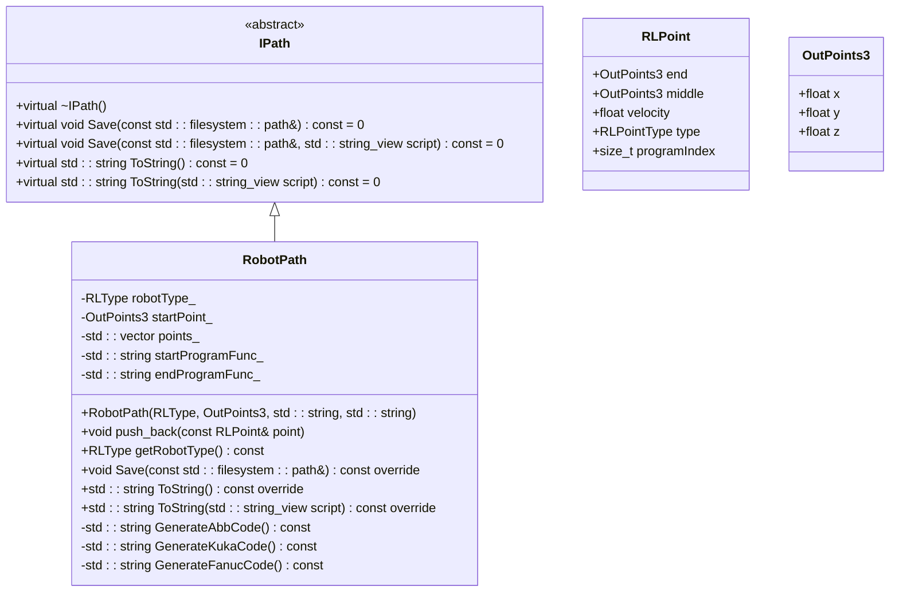
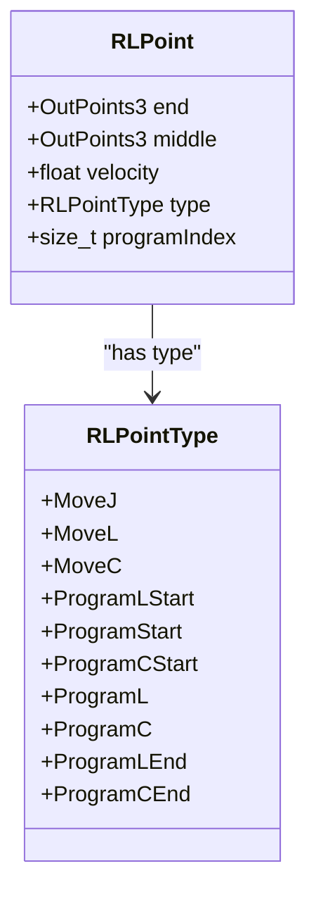
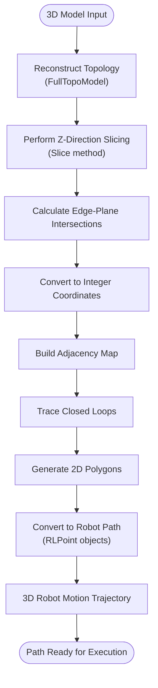
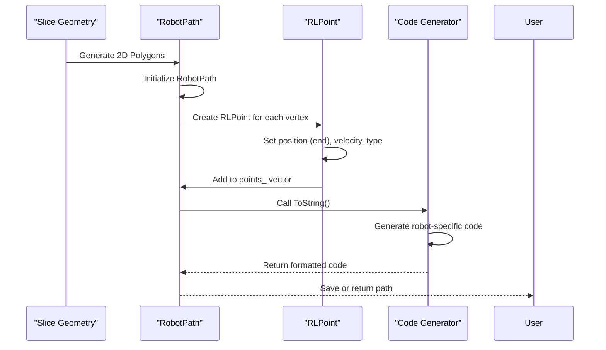

# Robot Path

<cite>
**Referenced Files in This Document**   
- [robotpath.hpp](file://paths/robotpath.hpp)
- [robotpath.cpp](file://paths/robotpath.cpp)
- [IPath.hpp](file://paths/IPath.hpp)
- [FullTopoModel.hpp](file://meshmodel/FullTopoModel.hpp)
- [FullTopoModel.cpp](file://meshmodel/FullTopoModel.cpp)
- [mesh_slice.hpp](file://LibHsBaSlicer/Slice/mesh_slice.hpp)
- [mesh_slice.cpp](file://LibHsBaSlicer/Slice/mesh_slice.cpp)
- [FloatPolygons.hpp](file://2D/FloatPolygons.hpp)
- [FloatPolygons.cpp](file://2D/FloatPolygons.cpp)
- [points_path_test.cpp](file://tests/PathsOut/points_path_test.cpp)
</cite>

## Table of Contents
1. [Introduction](#introduction)
2. [Core Components](#core-components)
3. [Architecture Overview](#architecture-overview)
4. [Detailed Component Analysis](#detailed-component-analysis)
5. [Path Generation from Sliced Geometry](#path-generation-from-sliced-geometry)
6. [Robot Motion Trajectory Implementation](#robot-motion-trajectory-implementation)
7. [External Script Integration](#external-script-integration)
8. [Use Cases and Applications](#use-cases-and-applications)
9. [Safety and Optimization Considerations](#safety-and-optimization-considerations)
10. [Conclusion](#conclusion)

## Introduction
The Robot Path component in HsBaSlicer is responsible for generating robotic toolpaths from sliced geometry for various industrial applications including robotic additive manufacturing, CNC machining, and welding. This component implements the IPath interface to transform 2D slice polygons into 3D robot motion trajectories with proper coordinate system alignment and kinematic constraints. The system supports multiple robot brands including ABB, KUKA, and FANUC, providing specialized code generation for each platform while maintaining a consistent interface through the RobotPath class.

**Section sources**
- [robotpath.hpp](file://paths/robotpath.hpp#L1-L74)
- [IPath.hpp](file://paths/IPath.hpp#L1-L34)

## Core Components
The Robot Path component consists of several key classes and structures that work together to generate robot toolpaths. The core is the RobotPath class which implements the IPath interface, providing a standardized way to save and generate robot-specific code. The RLPoint structure represents individual robot motion points with position, velocity, and motion type information. The component supports three major robot types through the RLType enum: ABB, KUKA, and FANUC, each with their own specialized code generation methods.

**Section sources**
- [robotpath.hpp](file://paths/robotpath.hpp#L11-L71)
- [IPath.hpp](file://paths/IPath.hpp#L26-L31)

## Architecture Overview
The Robot Path component follows a modular architecture where the RobotPath class serves as the main interface for generating robot toolpaths. It inherits from the IPath abstract base class, ensuring a consistent interface across different path types. The component receives sliced 2D geometry from the mesh slicing process and converts these polygons into a series of robot motion commands. The architecture supports both direct code generation for supported robot types and flexible Lua-based script integration for custom robot controllers.

**Diagram sources**
- [robotpath.hpp](file://paths/robotpath.hpp#L43-L71)
- [IPath.hpp](file://paths/IPath.hpp#L12-L24)

## Detailed Component Analysis

### RobotPath Class Implementation
The RobotPath class implements the IPath interface to generate robotic toolpaths from sliced geometry. It stores a collection of RLPoint objects that represent individual robot motion commands. The class provides methods to add points to the path and generate robot-specific code through the Save and ToString methods. The constructor accepts parameters for the robot type, start point, and program function names for custom program segments.

**Section sources**
- [robotpath.hpp](file://paths/robotpath.hpp#L43-L71)
- [robotpath.cpp](file://paths/robotpath.cpp#L39-L47)

### RLPoint Structure and Motion Types
The RLPoint structure defines the fundamental building block of robot paths, containing position data (end and middle points), velocity, motion type, and program indexing. The RLPointType enum defines various motion commands including MoveJ (joint movement), MoveL (linear movement), and MoveC (circular movement). Special program point types like ProgramLStart, ProgramLEnd, ProgramCStart, and ProgramCEnd are used to mark the beginning and end of program segments with custom function calls.

**Diagram sources**
- [robotpath.hpp](file://paths/robotpath.hpp#L11-L41)

### Robot Type Support and Code Generation
The RobotPath class supports multiple robot brands through the RLType enum (ABB, KUKA, FANUC) and corresponding code generation methods. When ToString() is called, the method dispatches to the appropriate code generator based on the robot type. Each code generator (GenerateAbbCode, GenerateKukaCode, GenerateFanucCode) produces robot-specific syntax while maintaining the same underlying path data.

**Section sources**
- [robotpath.hpp](file://paths/robotpath.hpp#L25-L32)
- [robotpath.cpp](file://paths/robotpath.cpp#L68-L351)

## Path Generation from Sliced Geometry
The process of generating robot paths begins with 3D model slicing using the FullTopoModel class, which reconstructs complete topological relationships from the input mesh. The Slice method performs Z-direction plane slicing, intersecting mesh edges with the slicing plane at a specific height to generate 2D polygon contours. These polygons are then processed and converted into robot motion trajectories by mapping the 2D slice geometry to 3D robot coordinates with proper layer height alignment.

The slicing process uses integerization for precision, converting floating-point coordinates to integer grid points to avoid floating-point errors during polygon operations. The resulting polygons are then transformed into robot paths by adding the appropriate Z-coordinate for the current layer and applying any necessary coordinate system transformations.

**Diagram sources**
- [FullTopoModel.hpp](file://meshmodel/FullTopoModel.hpp#L93-L95)
- [FullTopoModel.cpp](file://meshmodel/FullTopoModel.cpp#L256-L341)
- [FloatPolygons.hpp](file://2D/FloatPolygons.hpp#L51-L55)

## Robot Motion Trajectory Implementation

### Coordinate System Alignment
The RobotPath component handles coordinate system alignment by transforming the 2D slice polygons into the robot's coordinate system. The Z-coordinate is set based on the layer height, while X and Y coordinates are mapped directly from the slice plane. The startPoint_ member variable defines the initial position for the robot, ensuring proper alignment with the workpiece coordinate system. This transformation allows the 2D slice geometry to be accurately represented as 3D robot motion trajectories.

**Section sources**
- [robotpath.hpp](file://paths/robotpath.hpp#L64-L65)
- [FullTopoModel.cpp](file://meshmodel/FullTopoModel.cpp#L259-L264)

### Kinematic Constraints and Motion Planning
The component implements kinematic constraints through the velocity parameter in the RLPoint structure, allowing control over robot speed during path execution. Different motion types (MoveJ, MoveL, MoveC) correspond to different kinematic behaviors, with joint movements allowing faster travel between points and linear/circular movements ensuring precise path following. The system supports program segmentation through special point types that can trigger custom functions at the start and end of program segments.

**Section sources**
- [robotpath.hpp](file://paths/robotpath.hpp#L38-L39)
- [robotpath.cpp](file://paths/robotpath.cpp#L196-L254)

### Path Smoothing and Velocity Planning
Path smoothing is achieved through the use of circular (MoveC) and linear (MoveL) motion commands that create continuous trajectories between points. Velocity planning is implemented by setting the velocity parameter in RLPoint objects, allowing different speeds for different segments of the path. The system also supports fine positioning (z10 in ABB code, C_DIS in KUKA code) for precise positioning at critical points in the path.

**Diagram sources**
- [robotpath.cpp](file://paths/robotpath.cpp#L185-L351)
- [points_path_test.cpp](file://tests/PathsOut/points_path_test.cpp#L87-L125)

## External Script Integration
The RobotPath component provides extensive support for external script integration through Lua scripting, allowing customization for robot controllers not directly supported by the built-in code generators. The Save and ToString methods accept Lua script parameters that can transform the path data into custom formats. The system exposes path data to Lua scripts as global variables (points, startPoint) and executes the script in a sandboxed environment, returning the generated output.

The Lua integration supports both inline scripts and external script files, with optional function name specification for modular script organization. This flexibility enables users to generate code for virtually any robot controller by writing appropriate Lua scripts that format the path data according to the target controller's requirements.

**Section sources**
- [robotpath.cpp](file://paths/robotpath.cpp#L92-L183)
- [robotpath.cpp](file://paths/robotpath.cpp#L353-L450)

## Use Cases and Applications

### Robotic Additive Manufacturing
In robotic additive manufacturing applications, the RobotPath component generates toolpaths for material deposition processes. The system can control deposition parameters through velocity planning and program segmentation, allowing precise control over material flow and deposition rate. The support for circular and linear movements enables smooth deposition paths that minimize start-stop artifacts.

### CNC Machining
For CNC machining applications, the component generates precise cutting paths with controlled feed rates. The ability to specify different velocities for different path segments allows optimization of cutting parameters based on material and tool characteristics. Program segmentation features enable integration with tool changers and other CNC accessories through custom function calls.

### Welding Applications
In welding applications, the path continuity and synchronization features are critical for maintaining consistent weld quality. The system ensures path continuity through appropriate motion commands and supports synchronization with external actuators (wire feeders, shielding gas) through program start/end functions. The velocity control allows matching travel speed to welding parameters for optimal results.

**Section sources**
- [robotpath.cpp](file://paths/robotpath.cpp#L196-L254)
- [robotpath.cpp](file://paths/robotpath.cpp#L266-L306)

## Safety and Optimization Considerations

### Safety Considerations
The RobotPath component includes several safety features for industrial applications. The system validates robot type support and throws exceptions for unsupported configurations. The Lua script execution is sandboxed to prevent malicious code execution. The component also includes program segmentation markers that can be used to insert safety checks and verification steps in the generated code.

### Path Continuity and Synchronization
Path continuity is maintained through the use of appropriate motion commands (MoveL, MoveC) that ensure smooth transitions between path segments. Synchronization with external actuators is achieved through the program start/end functions that can trigger auxiliary equipment at specific points in the path. This ensures proper coordination between robot motion and process parameters.

### Optimization for Path Efficiency
The component provides several features for optimizing path efficiency. Velocity planning allows minimizing cycle times by using appropriate speeds for different path segments. The support for joint movements (MoveJ) enables rapid positioning between work areas. The system also minimizes robotic motion artifacts through smooth path generation and continuous motion commands.

**Section sources**
- [robotpath.cpp](file://paths/robotpath.cpp#L204-L213)
- [robotpath.cpp](file://paths/robotpath.cpp#L273-L282)

## Conclusion
The Robot Path component in HsBaSlicer provides a comprehensive solution for generating robotic toolpaths from sliced geometry. By implementing the IPath interface, it offers a consistent API for path generation while supporting multiple robot brands through specialized code generators. The component effectively transforms 2D slice polygons into 3D robot motion trajectories with proper coordinate system alignment and kinematic constraints. With features for path smoothing, velocity planning, and joint interpolation, it addresses the core requirements for industrial robotic applications. The extensive Lua script integration enables customization for virtually any robot controller, making it a flexible and powerful tool for robotic manufacturing processes.