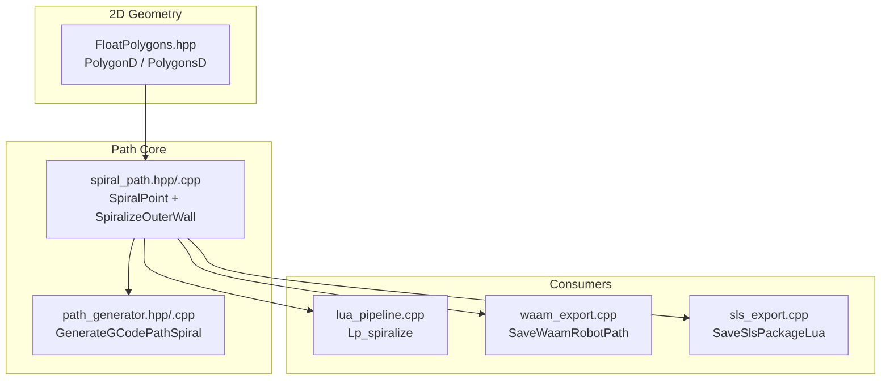
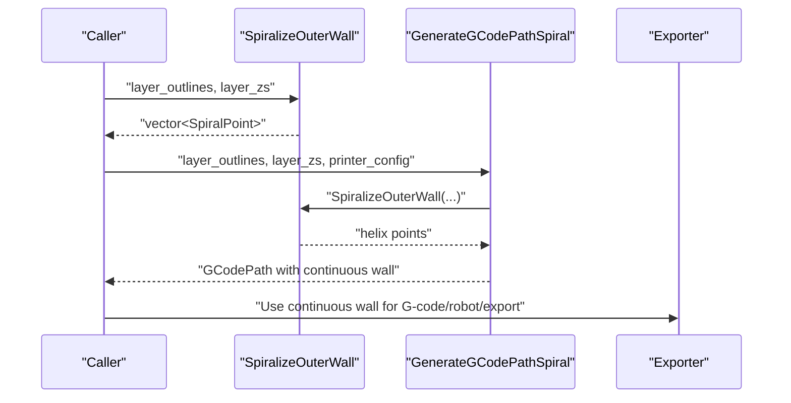
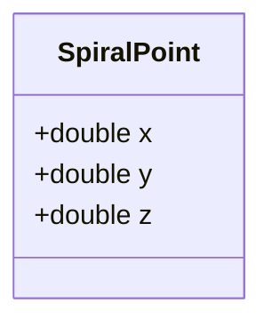
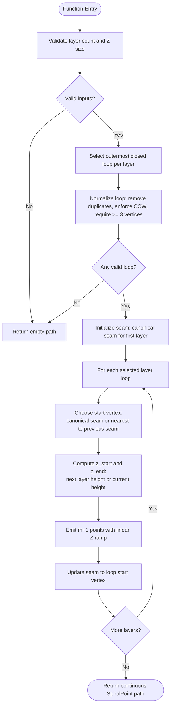
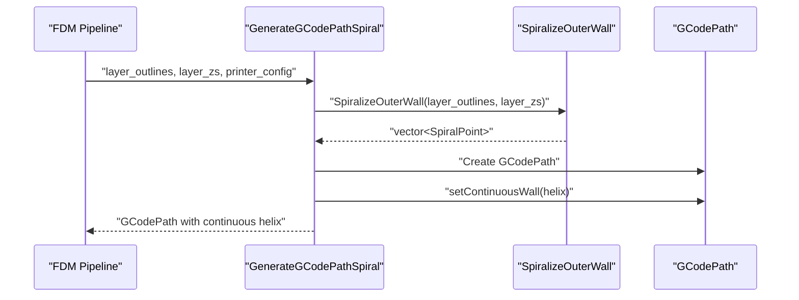
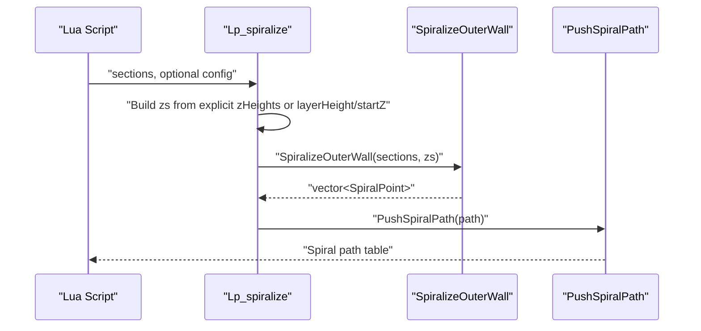
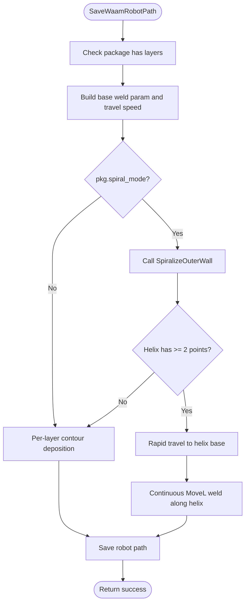
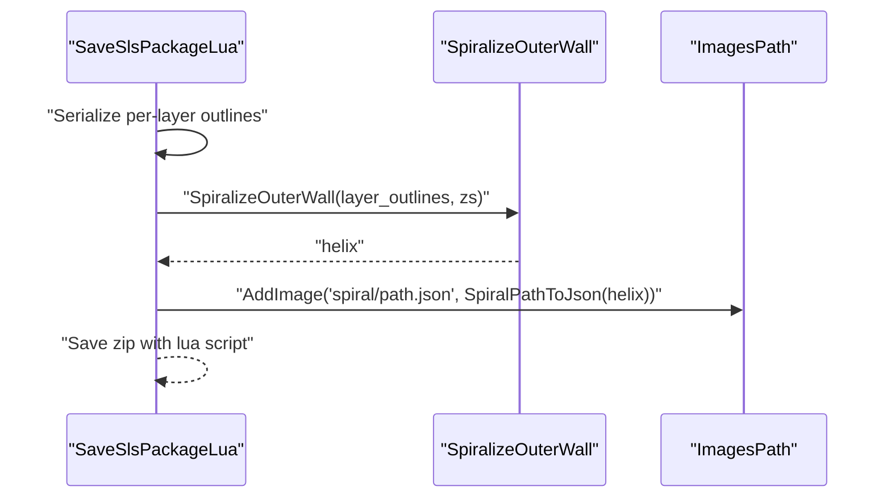
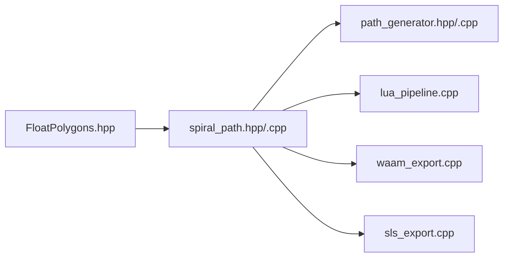

# Spiral Path Generation

<cite>
**Referenced Files in This Document**
- [spiral_path.hpp](file://LibHsBaSlicer/Path/spiral_path.hpp)
- [spiral_path.cpp](file://LibHsBaSlicer/Path/spiral_path.cpp)
- [path_generator.hpp](file://LibHsBaSlicer/Path/path_generator.hpp)
- [path_generator.cpp](file://LibHsBaSlicer/Path/path_generator.cpp)
- [FloatPolygons.hpp](file://2D/FloatPolygons.hpp)
- [spiral_path_test.cpp](file://tests/SpiralPath/spiral_path_test.cpp)
- [lua_pipeline.cpp](file://LibHsBaSlicer/Extends/lua_pipeline.cpp)
- [waam_export.cpp](file://LibHsBaSlicer/Path/waam_export.cpp)
- [sls_export.cpp](file://LibHsBaSlicer/Path/sls_export.cpp)
</cite>

## Table of Contents
1. [Introduction](#introduction)
2. [Project Structure](#project-structure)
3. [Core Components](#core-components)
4. [Architecture Overview](#architecture-overview)
5. [Detailed Component Analysis](#detailed-component-analysis)
6. [Dependency Analysis](#dependency-analysis)
7. [Performance Considerations](#performance-considerations)
8. [Troubleshooting Guide](#troubleshooting-guide)
9. [Conclusion](#conclusion)

## Introduction
This document explains the spiral path generation subsystem used by HsBaSlicer to produce a continuous helical outer-wall deposition path. Instead of emitting one closed per-layer wall with retractions and travel moves, the spiralizer selects each layer’s outermost contour, aligns seams across layers, and emits one uninterrupted 3D polyline whose Z rises by one layer height per revolution. The result is intended for extrusion-style processes such as FDM vase mode, WAAM continuous welding, and export formats that can consume a single rising wall.

The implementation is intentionally geometric and deterministic: it does not depend on printer kinematics or firmware-specific G-code details inside the core algorithm. Those concerns are handled by higher-level exporters and generators that consume `SpiralPoint` sequences.

## Project Structure
The spiral path feature lives under the Lib layer and integrates with both C++ consumers and Lua-based pipelines.

**Diagram sources**
- [FloatPolygons.hpp:18-25](file://2D/FloatPolygons.hpp#L18-L25)
- [spiral_path.hpp:14-58](file://LibHsBaSlicer/Path/spiral_path.hpp#L14-L58)
- [path_generator.hpp:64-80](file://LibHsBaSlicer/Path/path_generator.hpp#L64-L80)
- [lua_pipeline.cpp:547-585](file://LibHsBaSlicer/Extends/lua_pipeline.cpp#L547-L585)
- [waam_export.cpp:80-122](file://LibHsBaSlicer/Path/waam_export.cpp#L80-L122)
- [sls_export.cpp:95-103](file://LibHsBaSlicer/Path/sls_export.cpp#L95-L103)

**Section sources**
- [spiral_path.hpp:1-63](file://LibHsBaSlicer/Path/spiral_path.hpp#L1-L63)
- [spiral_path.cpp:1-167](file://LibHsBaSlicer/Path/spiral_path.cpp#L1-L167)
- [path_generator.hpp:1-96](file://LibHsBaSlicer/Path/path_generator.hpp#L1-L96)
- [FloatPolygons.hpp:1-271](file://2D/FloatPolygons.hpp#L1-L271)

## Core Components
The spiral path subsystem exposes two main concepts:

| Concept | Purpose | Key Behavior |
|---|---|---|
| `SpiralPoint` | A point on the continuous 3D helix | Holds planar X/Y coordinates plus an absolute build-height Z; unlike per-layer paths, Z varies continuously along the path. |
| `SpiralizeOuterWall` | Core algorithm | Converts per-layer polygon sets into one ordered vector of `SpiralPoint`. It picks the outermost closed loop per layer, normalizes orientation, aligns seams, and ramps Z between layers. |

The public API surface is small and focused: callers supply per-layer contours and per-layer Z heights, and receive a continuous polyline suitable for extrusion or welding without per-layer retractions.

**Section sources**
- [spiral_path.hpp:16-58](file://LibHsBaSlicer/Path/spiral_path.hpp#L16-L58)
- [spiral_path.cpp:88-164](file://LibHsBaSlicer/Path/spiral_path.cpp#L88-L164)

## Architecture Overview
At a high level, the spiral path generator is a geometry-only transformation. Higher layers decide how to turn the resulting points into G-code, robot motion, or exported data.

**Diagram sources**
- [spiral_path.cpp:88-164](file://LibHsBaSlicer/Path/spiral_path.cpp#L88-L164)
- [path_generator.cpp:118-136](file://LibHsBaSlicer/Path/path_generator.cpp#L118-L136)

## Detailed Component Analysis

### Spiral Point Data Model
`SpiralPoint` is a minimal 3D coordinate type designed specifically for the continuous helix. Its documentation emphasizes that Z is absolute build height rather than a constant per-layer value. This distinction matters because downstream consumers must treat the output as one long extrusion line instead of many independent loops.

**Diagram sources**
- [spiral_path.hpp:24-29](file://LibHsBaSlicer/Path/spiral_path.hpp#L24-L29)

**Section sources**
- [spiral_path.hpp:16-29](file://LibHsBaSlicer/Path/spiral_path.hpp#L16-L29)

### SpiralizeOuterWall Algorithm
`SpiralizeOuterWall` implements the classic spiralized outer-wall strategy. The algorithm proceeds through several well-defined stages:

1. **Input validation**: If there are no layers or the number of Z values differs from the number of layer polygons, return an empty path.
2. **Outer-loop selection**: For each layer, compute twice the signed area using the shoelace formula and pick the polygon with the largest absolute area. Layers without a valid closed contour are skipped.
3. **Loop normalization**: Remove duplicate closing vertices, reject loops with fewer than three distinct vertices, and reverse orientation if needed so the loop becomes counter-clockwise.
4. **Seam alignment**: The first layer uses a canonical seam (lowest Y, then lowest X). Subsequent layers choose the vertex closest in XY to the previous seam.
5. **Z ramping**: Each full loop emits `m+1` points where `m` is the number of vertices in the normalized loop. The final point closes the loop at the next layer’s Z. The top layer is traversed flat because there is no next layer to connect to.
6. **Output**: Return the accumulated sequence of `SpiralPoint`.

**Diagram sources**
- [spiral_path.cpp:16-85](file://LibHsBaSlicer/Path/spiral_path.cpp#L16-L85)
- [spiral_path.cpp:88-164](file://LibHsBaSlicer/Path/spiral_path.cpp#L88-L164)

#### Complexity Notes
- Outer-loop selection scans all polygons in every layer once, giving roughly O(total polygon count) work before emission.
- Seam matching uses a linear scan over each normalized loop, contributing another O(total vertex count).
- Point emission is proportional to the total number of vertices across selected loops.
- Space usage is dominated by the output path and the intermediate list of selected loops.

**Section sources**
- [spiral_path.cpp:16-85](file://LibHsBaSlicer/Path/spiral_path.cpp#L16-L85)
- [spiral_path.cpp:88-164](file://LibHsBaSlicer/Path/spiral_path.cpp#L88-L164)

### Integration with FDM G-code Generation
The FDM path generator provides `GenerateGCodePathSpiral`, which wraps `SpiralizeOuterWall` and produces a `GCodePath` containing only the continuous wall. This is the typical entry point for vase-mode printing: the generator converts `SpiralPoint` objects into 3D path points and marks them as a single unbroken wall.

**Diagram sources**
- [path_generator.hpp:64-80](file://LibHsBaSlicer/Path/path_generator.hpp#L64-L80)
- [path_generator.cpp:118-136](file://LibHsBaSlicer/Path/path_generator.cpp#L118-L136)

**Section sources**
- [path_generator.hpp:64-80](file://LibHsBaSlicer/Path/path_generator.hpp#L64-L80)
- [path_generator.cpp:118-136](file://LibHsBaSlicer/Path/path_generator.cpp#L118-L136)

### Lua Pipeline Integration
The Lua pipeline exposes a `spiralize` function that reads layer sections, builds per-layer Z heights either explicitly or from `layerHeight` and `startZ`, and returns a spiral path through the same `SpiralizeOuterWall` implementation. This keeps Lua scripts able to generate vase-mode walls without reimplementing the geometry.

**Diagram sources**
- [lua_pipeline.cpp:547-585](file://LibHsBaSlicer/Extends/lua_pipeline.cpp#L547-L585)
- [spiral_path.cpp:88-164](file://LibHsBaSlicer/Path/spiral_path.cpp#L88-L164)

**Section sources**
- [lua_pipeline.cpp:547-585](file://LibHsBaSlicer/Extends/lua_pipeline.cpp#L547-L585)

### WAAM Export Integration
WAAM export supports a spiral/vase mode where the torch does not lift or retract between layers. When enabled, it calls `SpiralizeOuterWall`, performs a rapid travel move to the base of the helix, and then emits a continuous weld path. If the helix degenerates, it falls back to per-layer deposition.

**Diagram sources**
- [waam_export.cpp:61-176](file://LibHsBaSlicer/Path/waam_export.cpp#L61-L176)
- [spiral_path.cpp:88-164](file://LibHsBaSlicer/Path/spiral_path.cpp#L88-L164)

**Section sources**
- [waam_export.cpp:61-176](file://LibHsBaSlicer/Path/waam_export.cpp#L61-L176)

### SLS Export Integration
SLS export also supports spiral mode. When enabled, it computes the continuous helix and adds it as an extra data stream (`spiral/path.json`) that downstream Lua export scripts can consume.

**Diagram sources**
- [sls_export.cpp:72-130](file://LibHsBaSlicer/Path/sls_export.cpp#L72-L130)
- [spiral_path.cpp:88-164](file://LibHsBaSlicer/Path/spiral_path.cpp#L88-L164)

**Section sources**
- [sls_export.cpp:72-130](file://LibHsBaSlicer/Path/sls_export.cpp#L72-L130)

## Dependency Analysis
The spiral path module has a narrow dependency footprint:

| Dependency | Role | Direction |
|---|---|---|
| `FloatPolygons.hpp` | Provides `Point2D`, `PolygonD`, `PolygonsD` | Consumed by spiral path |
| `path_generator.hpp` | Defines FDM path configuration and spiral G-code wrapper | Consumes spiral path |
| `lua_pipeline.cpp` | Exposes spiralization to Lua scripts | Consumes spiral path |
| `waam_export.cpp` | Uses spiral path for continuous WAAM welding | Consumes spiral path |
| `sls_export.cpp` | Exposes spiral path JSON for export scripts | Consumes spiral path |

**Diagram sources**
- [FloatPolygons.hpp:18-25](file://2D/FloatPolygons.hpp#L18-L25)
- [spiral_path.hpp:9-12](file://LibHsBaSlicer/Path/spiral_path.hpp#L9-L12)
- [path_generator.hpp:9-16](file://LibHsBaSlicer/Path/path_generator.hpp#L9-L16)
- [lua_pipeline.cpp:547-585](file://LibHsBaSlicer/Extends/lua_pipeline.cpp#L547-L585)
- [waam_export.cpp:80-122](file://LibHsBaSlicer/Path/waam_export.cpp#L80-L122)
- [sls_export.cpp:95-103](file://LibHsBaSlicer/Path/sls_export.cpp#L95-L103)

**Section sources**
- [spiral_path.hpp:9-12](file://LibHsBaSlicer/Path/spiral_path.hpp#L9-L12)
- [path_generator.hpp:9-16](file://LibHsBaSlicer/Path/path_generator.hpp#L9-L16)
- [FloatPolygons.hpp:18-25](file://2D/FloatPolygons.hpp#L18-L25)

## Performance Considerations
- **Single-pass geometry**: The algorithm avoids expensive mesh operations and works directly on 2D polygons. This makes it suitable for repeated use in slicing pipelines.
- **Deterministic seam choice**: Using a canonical seam for the first layer and nearest-seam matching for subsequent layers avoids random or unstable seam placement, which helps reproducibility.
- **Memory layout**: The output is a contiguous vector of `SpiralPoint`, which is efficient for downstream serialization and rendering.
- **Degenerate input handling**: Empty layers, invalid loops, and mismatched Z arrays are rejected early, preventing wasted computation.
- **Scalability**: For models with many layers or very dense outer contours, the dominant cost is vertex traversal. Pre-simplifying contours or reducing unnecessary inner polygons can reduce work before calling the spiralizer.

[No sources needed since this section provides general guidance]

## Troubleshooting Guide

| Symptom | Likely Cause | Recommended Action |
|---|---|---|
| Empty spiral path | No layers, mismatched layer count and Z array, or all layers lack valid closed contours | Verify that `layer_sections.size()` equals `layer_zs.size()`, and that each layer contains at least one closed polygon with positive area. |
| CW vs CCW input produces different results | Input polygons are not consistently oriented | Ensure outer contours are counter-clockwise; the implementation normalizes orientation, but degenerate or self-intersected polygons may still behave unexpectedly. |
| Inner hole is spiraled instead of outer wall | Inner polygon has larger absolute area than expected outer boundary | Confirm that the outermost contour has the largest absolute signed area; holes should be smaller than the outer boundary. |
| Last layer appears flat | Expected behavior: the top layer has no next layer to connect to | Treat the last loop as a flat cap; do not assume Z continues rising beyond the final layer. |
| Spiral path jumps in XY | Seam misalignment due to unusual geometry | Inspect the seam vertex selection; shapes with multiple nearly identical vertices or floating-point noise may need preprocessing. |
| WAAM export falls back to per-layer mode | Helix has fewer than two points | Check whether any layer produced a valid closed contour; otherwise spiral mode cannot form a continuous path. |

**Section sources**
- [spiral_path.cpp:91-134](file://LibHsBaSlicer/Path/spiral_path.cpp#L91-L134)
- [spiral_path.cpp:136-164](file://LibHsBaSlicer/Path/spiral_path.cpp#L136-L164)
- [waam_export.cpp:80-122](file://LibHsBaSlicer/Path/waam_export.cpp#L80-L122)

## Conclusion
The spiral path generation component provides a focused, deterministic transformation from per-layer 2D contours to a continuous 3D deposition path. Its design separates geometry from machine-specific concerns: `SpiralizeOuterWall` handles seam alignment, outer-loop selection, and Z ramping, while FDM G-code generation, Lua scripting, WAAM export, and SLS export decide how to use the result. For uniform-cross-section models, the output closely approximates a true helix; for varying cross-sections, it still produces a connected wall with consistent seam alignment.