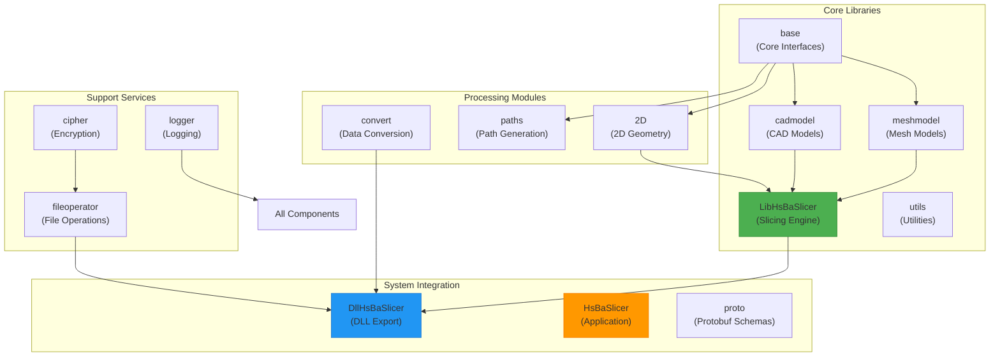
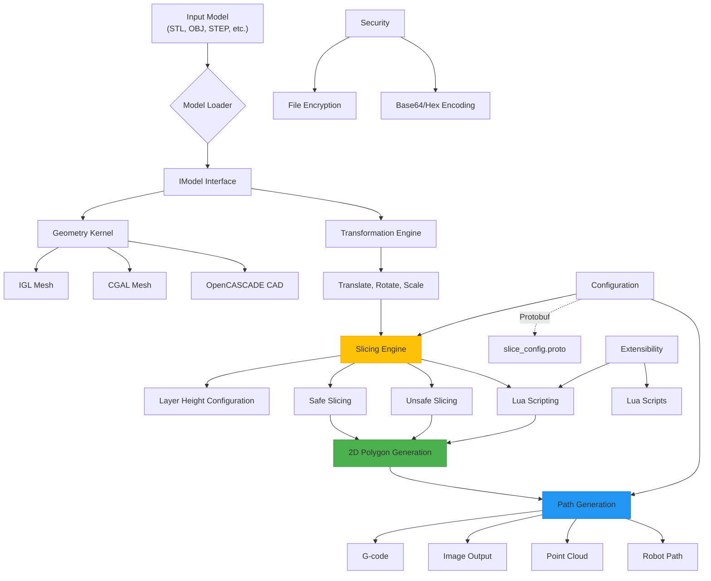
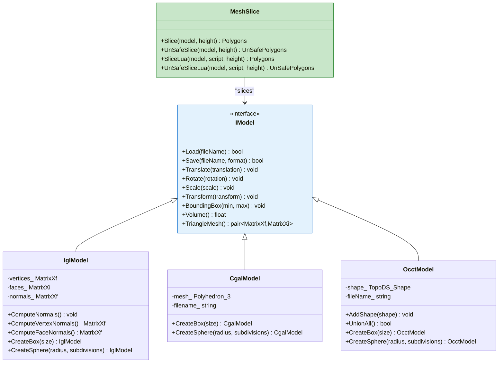
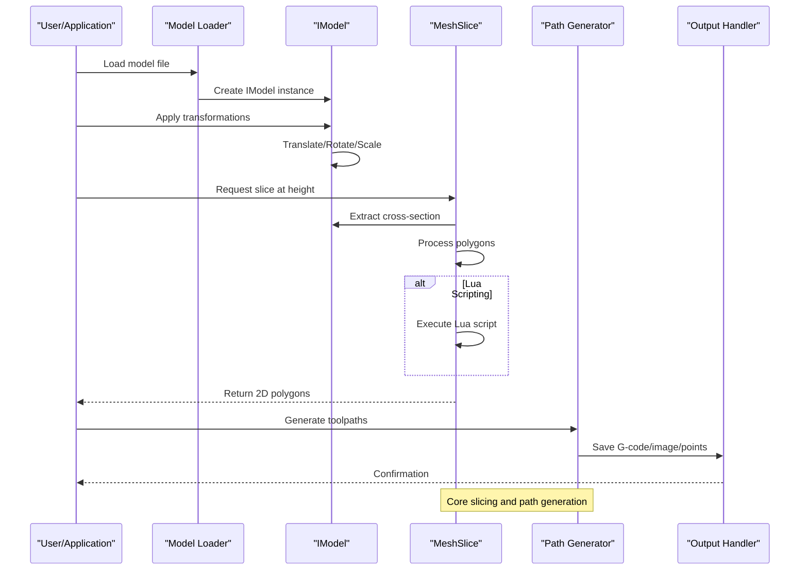
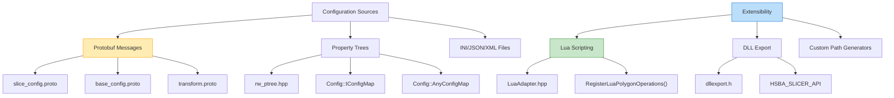
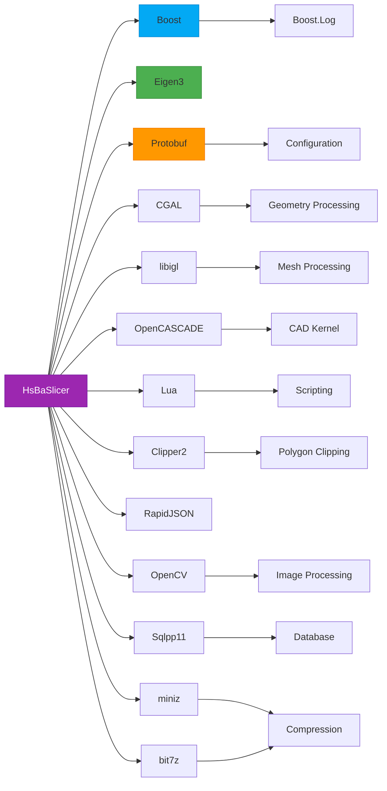

# Project Overview

<cite>
**Referenced Files in This Document**   
- [README.md](file://README.md)
- [CMakeLists.txt](file://CMakeLists.txt)
- [LibHsBaSlicer/CMakeLists.txt](file://LibHsBaSlicer/CMakeLists.txt)
- [LibHsBaSlicer/Slice/mesh_slice.hpp](file://LibHsBaSlicer/Slice/mesh_slice.hpp)
- [meshmodel/IglModel.hpp](file://meshmodel/IglModel.hpp)
- [meshmodel/CgalModel.hpp](file://meshmodel/CgalModel.hpp)
- [cadmodel/OcctModel.hpp](file://cadmodel/OcctModel.hpp)
- [2D/LuaAdapter.hpp](file://2D/LuaAdapter.hpp)
- [base/IModel.hpp](file://base/IModel.hpp)
- [paths/IPath.hpp](file://paths/IPath.hpp)
- [fileoperator/rw_ptree.hpp](file://fileoperator/rw_ptree.hpp)
- [cipher/encoder.hpp](file://cipher/encoder.hpp)
- [utils/app_config.hpp](file://utils/app_config.hpp)
- [DllHsBaSlicer/dllexport.h](file://DllHsBaSlicer/dllexport.h)
</cite>

## Table of Contents
1. [Introduction](#introduction)
2. [Project Structure](#project-structure)
3. [Core Components](#core-components)
4. [Architecture Overview](#architecture-overview)
5. [Detailed Component Analysis](#detailed-component-analysis)
6. [Dependency Analysis](#dependency-analysis)
7. [Performance Considerations](#performance-considerations)
8. [Troubleshooting Guide](#troubleshooting-guide)
9. [Conclusion](#conclusion)

## Introduction
HsBaSlicer is a C++20-based slicing engine designed for 3D printing and additive manufacturing applications. The project provides a modular, extensible framework for processing 3D models through slicing and 2D path generation. It supports both mesh-based and CAD-based models, leveraging multiple geometry kernels including IGL, CGAL, and OpenCASCADE. The engine features Lua-based extensibility for custom slicing logic, secure file operations with encryption support, and cross-platform compatibility. Integration is facilitated through DLL exports and Protobuf-based configuration. The system follows a workflow from model loading, transformation, slicing, path generation, to final output, making it suitable for various additive manufacturing processes.

**Section sources**
- [README.md](file://README.md#L1-L156)

## Project Structure

The HsBaSlicer project follows a modular directory structure that separates concerns and enables independent development of components. The architecture is organized around core functional areas including model processing, geometry operations, file handling, and application integration.

**Diagram sources**
- [CMakeLists.txt](file://CMakeLists.txt#L1-L157)
- [README.md](file://README.md#L7-L40)

**Section sources**
- [CMakeLists.txt](file://CMakeLists.txt#L1-L157)
- [README.md](file://README.md#L7-L40)

## Core Components

HsBaSlicer's core functionality is built around several key components that provide the foundation for 3D model processing and slicing. The system is designed with a clear separation between interface definitions, implementation, and integration layers. The base component defines the IModel interface that serves as the contract for all 3D models, while specialized modules handle mesh and CAD models using different geometry kernels. The 2D module provides polygon operations and path generation capabilities, and the LibHsBaSlicer component implements the core slicing algorithms. The architecture supports both safe and unsafe slicing operations, with the ability to extend functionality through Lua scripting.

**Section sources**
- [base/IModel.hpp](file://base/IModel.hpp#L1-L37)
- [LibHsBaSlicer/Slice/mesh_slice.hpp](file://LibHsBaSlicer/Slice/mesh_slice.hpp#L1-L22)
- [2D/LuaAdapter.hpp](file://2D/LuaAdapter.hpp#L1-L25)

## Architecture Overview

The HsBaSlicer architecture follows a layered approach with clear separation between the core slicing engine, model representations, and external interfaces. The system is designed to be extensible while maintaining high performance for 3D printing workflows.

**Diagram sources**
- [LibHsBaSlicer/Slice/mesh_slice.hpp](file://LibHsBaSlicer/Slice/mesh_slice.hpp#L1-L22)
- [meshmodel/IglModel.hpp](file://meshmodel/IglModel.hpp#L1-L66)
- [meshmodel/CgalModel.hpp](file://meshmodel/CgalModel.hpp#L1-L82)
- [cadmodel/OcctModel.hpp](file://cadmodel/OcctModel.hpp#L1-L80)
- [paths/IPath.hpp](file://paths/IPath.hpp#L1-L34)

## Detailed Component Analysis

### Slicing Engine Analysis

The core slicing functionality is implemented in the LibHsBaSlicer module, which provides both safe and unsafe slicing operations. Safe slicing ignores non-closed contours, making it suitable for most 3D printing applications, while unsafe slicing preserves all contours and is intended for specialized processes like wire feeding. The engine supports Lua-based scripting through dedicated interfaces that allow custom slicing logic to be injected at runtime.

**Diagram sources**
- [base/IModel.hpp](file://base/IModel.hpp#L1-L37)
- [meshmodel/IglModel.hpp](file://meshmodel/IglModel.hpp#L1-L66)
- [meshmodel/CgalModel.hpp](file://meshmodel/CgalModel.hpp#L1-L82)
- [cadmodel/OcctModel.hpp](file://cadmodel/OcctModel.hpp#L1-L80)
- [LibHsBaSlicer/Slice/mesh_slice.hpp](file://LibHsBaSlicer/Slice/mesh_slice.hpp#L1-L22)

**Section sources**
- [base/IModel.hpp](file://base/IModel.hpp#L1-L37)
- [meshmodel/IglModel.hpp](file://meshmodel/IglModel.hpp#L1-L66)
- [meshmodel/CgalModel.hpp](file://meshmodel/CgalModel.hpp#L1-L82)
- [cadmodel/OcctModel.hpp](file://cadmodel/OcctModel.hpp#L1-L80)
- [LibHsBaSlicer/Slice/mesh_slice.hpp](file://LibHsBaSlicer/Slice/mesh_slice.hpp#L1-L22)

### Data Flow Analysis

The typical workflow in HsBaSlicer follows a sequential process from model input to sliced output, with multiple extension points for customization and integration.

**Diagram sources**
- [LibHsBaSlicer/Slice/mesh_slice.hpp](file://LibHsBaSlicer/Slice/mesh_slice.hpp#L1-L22)
- [paths/IPath.hpp](file://paths/IPath.hpp#L1-L34)

### Configuration and Extensibility

HsBaSlicer provides multiple mechanisms for configuration and extensibility, including Protobuf-based configuration, Lua scripting, and secure file operations.

**Diagram sources**
- [proto/slice_config.proto](file://proto/slice_config.proto)
- [fileoperator/rw_ptree.hpp](file://fileoperator/rw_ptree.hpp#L1-L218)
- [2D/LuaAdapter.hpp](file://2D/LuaAdapter.hpp#L1-L25)
- [DllHsBaSlicer/dllexport.h](file://DllHsBaSlicer/dllexport.h#L1-L16)

## Dependency Analysis

HsBaSlicer relies on a comprehensive set of third-party libraries to provide its functionality, managed through vcpkg for consistent cross-platform builds.

**Diagram sources**
- [CMakeLists.txt](file://CMakeLists.txt#L36-L120)
- [vcpkg.json](file://vcpkg.json)

**Section sources**
- [CMakeLists.txt](file://CMakeLists.txt#L36-L120)
- [vcpkg.json](file://vcpkg.json)

## Performance Considerations

The HsBaSlicer project incorporates several performance optimizations and considerations for efficient 3D model processing. The use of C++20 features enables modern programming patterns while maintaining high performance. The architecture separates debug and release configurations, with boolean operations disabled in debug mode to prevent excessive memory usage and slow processing. The system leverages pre-compiled headers (pch_headers.hpp) to reduce compilation times. For production use, the build system supports shared libraries to minimize memory footprint when multiple applications use the slicer engine. The choice of geometry kernels allows users to select between performance (IGL) and precision (CGAL, OpenCASCADE) based on their requirements.

**Section sources**
- [CMakeLists.txt](file://CMakeLists.txt#L91-L95)
- [LibHsBaSlicer/CMakeLists.txt](file://LibHsBaSlicer/CMakeLists.txt#L1-L36)

## Troubleshooting Guide

When encountering issues with HsBaSlicer, consider the following common problems and solutions:

1. **Build failures on Windows**: Ensure Visual Studio 2022 or later is installed with the "Desktop development with C++" workload. MingW/MSYS2 are not supported.

2. **Missing dependencies on Linux**: Install the required system packages including X11 development libraries, libfontconfig, and build tools as specified in the README.

3. **Boolean operations performance**: These are disabled in Debug configuration due to high memory usage and slow processing. Use Release builds for production slicing.

4. **OpenCASCADE support**: This is disabled on Android, iOS, and SWITCH platforms. Check platform-specific build configurations.

5. **Lua scripting issues**: Ensure the Lua runtime is properly linked and scripts follow the expected interface for polygon operations.

6. **File operation errors**: Verify file paths and permissions, especially when using compression (bit7z) or database operations.

**Section sources**
- [README.md](file://README.md#L47-L156)
- [CMakeLists.txt](file://CMakeLists.txt#L57-L60)
- [utils/app_config.hpp](file://utils/app_config.hpp#L1-L24)

## Conclusion

HsBaSlicer provides a comprehensive, modular slicing engine for 3D printing and additive manufacturing applications. Built with C++20, the system offers a robust foundation for processing both mesh and CAD models through its support for multiple geometry kernels (IGL, CGAL, OpenCASCADE). The architecture emphasizes extensibility through Lua scripting and provides secure file operations with encryption capabilities. The modular design separates concerns between model representation, slicing algorithms, path generation, and system integration, enabling both standalone use and integration into larger manufacturing systems via DLL exports and Protobuf configuration. With cross-platform support and a comprehensive set of third-party library integrations, HsBaSlicer is positioned as a flexible solution for various additive manufacturing workflows.