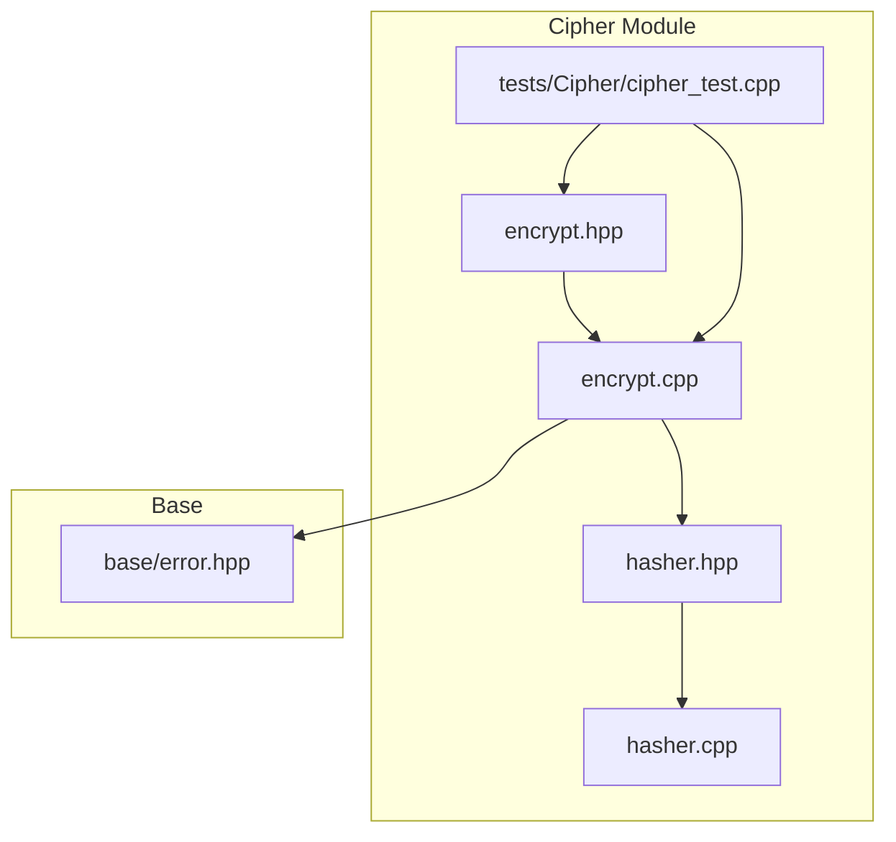
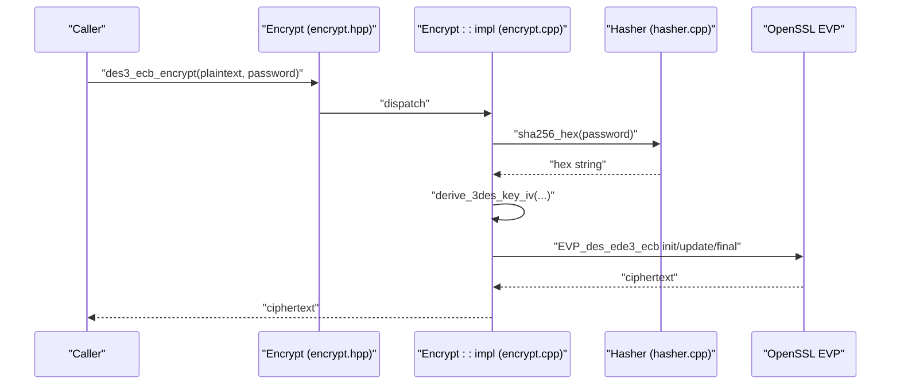
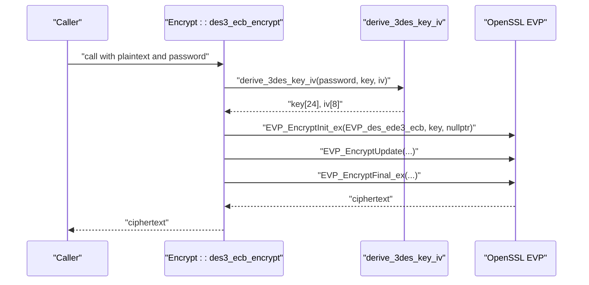
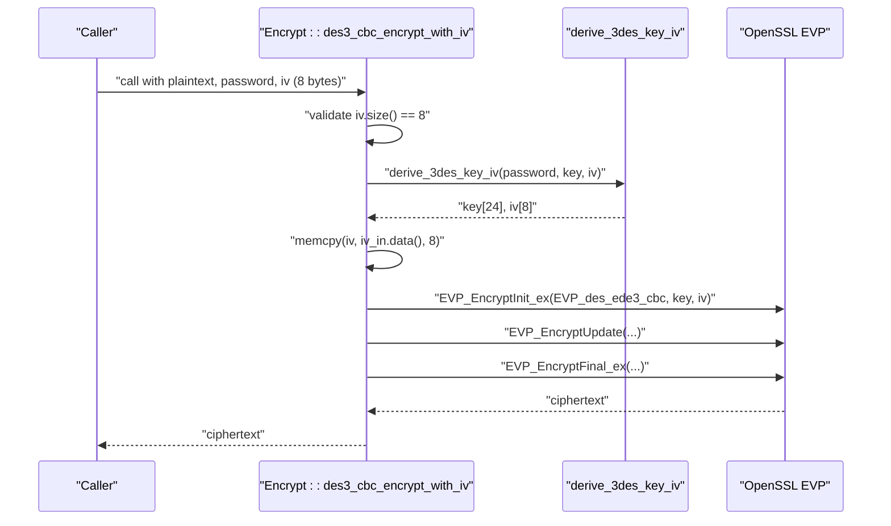
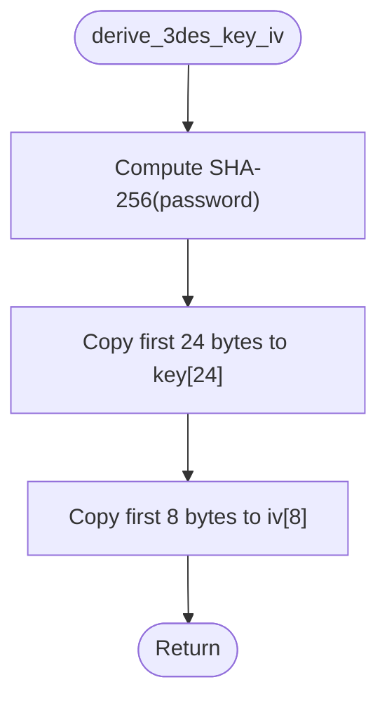
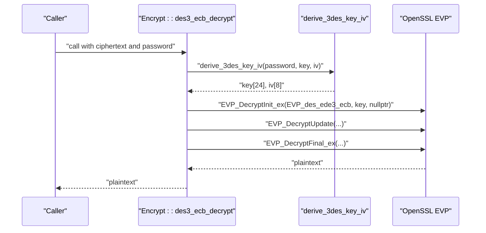
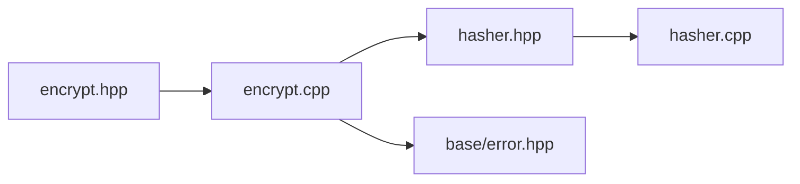

# 3DES Encryption

<cite>
**Referenced Files in This Document**
- [encrypt.hpp](file://cipher/encrypt.hpp)
- [encrypt.cpp](file://cipher/encrypt.cpp)
- [hasher.hpp](file://cipher/hasher.hpp)
- [hasher.cpp](file://cipher/hasher.cpp)
- [cipher_test.cpp](file://tests/Cipher/cipher_test.cpp)
- [error.hpp](file://base/error.hpp)
</cite>

## Table of Contents
1. [Introduction](#introduction)
2. [Project Structure](#project-structure)
3. [Core Components](#core-components)
4. [Architecture Overview](#architecture-overview)
5. [Detailed Component Analysis](#detailed-component-analysis)
6. [Dependency Analysis](#dependency-analysis)
7. [Performance Considerations](#performance-considerations)
8. [Troubleshooting Guide](#troubleshooting-guide)
9. [Security Considerations](#security-considerations)
10. [Integration and Backward Compatibility](#integration-and-backward-compatibility)
11. [Conclusion](#conclusion)

## Introduction
This document explains the 3DES encryption component implemented in the project, focusing on Triple DES in Electronic Codebook (ECB) and Cipher Block Chaining (CBC) modes using OpenSSL’s EVP_des_ede3_ecb and EVP_des_ede3_cbc ciphers. It details the key derivation process via derive_3des_key_iv, which produces a 24-byte key from a password using SHA-256 hashing. It also documents the 8-byte Initialization Vector (IV) requirement for CBC mode and secure handling in des3_cbc_encrypt_with_iv and des3_cbc_decrypt_with_iv. Practical workflows for encryption and decryption are provided, along with security implications, error handling strategies, and integration points for legacy systems.

## Project Structure
The 3DES functionality resides in the cipher module, alongside AES and RSA utilities. The relevant files are:
- cipher/encrypt.hpp: Public interface for symmetric encryption functions, including 3DES ECB/CBC variants.
- cipher/encrypt.cpp: Implementation of 3DES and other symmetric ciphers using OpenSSL EVP APIs.
- cipher/hasher.hpp and cipher/hasher.cpp: Utility for cryptographic hashing (used by key derivation).
- tests/Cipher/cipher_test.cpp: Unit tests demonstrating round-trip encryption/decryption for 3DES.
- base/error.hpp: Shared error types used by the cipher module.

**Diagram sources**
- [encrypt.hpp](file://cipher/encrypt.hpp#L1-L40)
- [encrypt.cpp](file://cipher/encrypt.cpp#L1-L120)
- [hasher.hpp](file://cipher/hasher.hpp#L1-L27)
- [hasher.cpp](file://cipher/hasher.cpp#L1-L71)
- [cipher_test.cpp](file://tests/Cipher/cipher_test.cpp#L1-L150)
- [error.hpp](file://base/error.hpp#L1-L139)

**Section sources**
- [encrypt.hpp](file://cipher/encrypt.hpp#L1-L40)
- [encrypt.cpp](file://cipher/encrypt.cpp#L1-L120)
- [hasher.hpp](file://cipher/hasher.hpp#L1-L27)
- [hasher.cpp](file://cipher/hasher.cpp#L1-L71)
- [cipher_test.cpp](file://tests/Cipher/cipher_test.cpp#L1-L150)
- [error.hpp](file://base/error.hpp#L1-L139)

## Core Components
- 3DES ECB encrypt/decrypt: Uses EVP_des_ede3_ecb with a 24-byte key derived from a password via SHA-256. No IV is required.
- 3DES CBC encrypt/decrypt with explicit IV: Uses EVP_des_ede3_cbc with a 24-byte key and an 8-byte IV supplied by the caller.
- Key derivation: derive_3des_key_iv extracts a 24-byte key and 8-byte IV from the SHA-256 hash of the password.
- Error handling: Throws RuntimeError on OpenSSL initialization failures and invalid argument errors for incorrect IV sizes.

Practical usage patterns are validated by unit tests that demonstrate round-trip encryption and decryption for both ECB and CBC modes.

**Section sources**
- [encrypt.hpp](file://cipher/encrypt.hpp#L25-L37)
- [encrypt.cpp](file://cipher/encrypt.cpp#L278-L428)
- [hasher.hpp](file://cipher/hasher.hpp#L9-L24)
- [hasher.cpp](file://cipher/hasher.cpp#L62-L71)
- [cipher_test.cpp](file://tests/Cipher/cipher_test.cpp#L96-L110)

## Architecture Overview
The 3DES component integrates with OpenSSL EVP APIs and relies on a shared hashing utility for deterministic key derivation. The design separates concerns:
- Public API: cipher/encrypt.hpp exposes static methods for encryption/decryption.
- Implementation: cipher/encrypt.cpp performs EVP operations and manages OpenSSL contexts.
- Key derivation: cipher/hasher.cpp provides SHA-256 hashing used by derive_3des_key_iv.
- Tests: tests/Cipher/cipher_test.cpp validates correctness and error conditions.

**Diagram sources**
- [encrypt.hpp](file://cipher/encrypt.hpp#L25-L37)
- [encrypt.cpp](file://cipher/encrypt.cpp#L278-L313)
- [hasher.cpp](file://cipher/hasher.cpp#L62-L71)

## Detailed Component Analysis

### 3DES ECB Mode
- Purpose: Provides deterministic encryption suitable for small fixed-size data or legacy compatibility.
- Key derivation: derive_3des_key_iv uses the first 24 bytes of SHA-256(password) for the 3DES key.
- IV handling: ECB mode ignores IV; the implementation passes a null IV to EVP.
- Workflow:
  1. Derive key from password.
  2. Initialize EVP_des_ede3_ecb with the key.
  3. Process plaintext with EncryptUpdate/EncryptFinal.
  4. Return ciphertext.

**Diagram sources**
- [encrypt.cpp](file://cipher/encrypt.cpp#L278-L313)
- [hasher.cpp](file://cipher/hasher.cpp#L62-L71)

**Section sources**
- [encrypt.cpp](file://cipher/encrypt.cpp#L278-L313)
- [encrypt.hpp](file://cipher/encrypt.hpp#L25-L31)

### 3DES CBC Mode with Explicit IV
- Purpose: Provides confidentiality with chaining and IV-based randomness.
- Key derivation: Same as ECB; derive_3des_key_iv produces a 24-byte key and 8-byte IV from SHA-256(password).
- IV requirement: The caller must supply an 8-byte IV; the implementation validates size and copies it into the local buffer.
- Workflow:
  1. Validate IV length (must be 8 bytes).
  2. Derive key and IV from password.
  3. Copy caller-provided IV into local buffer.
  4. Initialize EVP_des_ede3_cbc with key and IV.
  5. Process plaintext with EncryptUpdate/EncryptFinal.
  6. Return ciphertext.

**Diagram sources**
- [encrypt.cpp](file://cipher/encrypt.cpp#L352-L389)
- [hasher.cpp](file://cipher/hasher.cpp#L62-L71)

**Section sources**
- [encrypt.cpp](file://cipher/encrypt.cpp#L352-L389)
- [encrypt.hpp](file://cipher/encrypt.hpp#L25-L37)

### Key Derivation: derive_3des_key_iv
- Input: Password (string_view).
- Output: 24-byte key and 8-byte IV.
- Mechanism: Computes SHA-256(password) and copies the first 24 bytes to the key and the first 8 bytes to the IV. This ensures deterministic, reproducible keys for a given password.

**Diagram sources**
- [encrypt.cpp](file://cipher/encrypt.cpp#L31-L40)
- [hasher.cpp](file://cipher/hasher.cpp#L62-L71)

**Section sources**
- [encrypt.cpp](file://cipher/encrypt.cpp#L31-L40)
- [hasher.cpp](file://cipher/hasher.cpp#L62-L71)

### Decryption Workflows
- 3DES ECB decrypt mirrors the encrypt path, using EVP_DecryptInit_ex/EVP_DecryptUpdate/EVP_DecryptFinal_ex with the same derived key.
- 3DES CBC decrypt mirrors the encrypt path, using the same derived key and the caller-supplied 8-byte IV.

**Diagram sources**
- [encrypt.cpp](file://cipher/encrypt.cpp#L315-L349)
- [hasher.cpp](file://cipher/hasher.cpp#L62-L71)

**Section sources**
- [encrypt.cpp](file://cipher/encrypt.cpp#L315-L349)
- [encrypt.hpp](file://cipher/encrypt.hpp#L25-L37)

### Practical Examples
- ECB round-trip: The test demonstrates encrypting and decrypting arbitrary plaintext with a password, verifying equality of original and recovered data.
- CBC round-trip: The test demonstrates encrypting and decrypting with a fixed 8-byte IV, verifying equality of original and recovered data.

These examples illustrate the intended usage patterns for both modes.

**Section sources**
- [cipher_test.cpp](file://tests/Cipher/cipher_test.cpp#L96-L110)

## Dependency Analysis
- encrypt.cpp depends on:
  - OpenSSL EVP APIs for cipher operations.
  - Hasher::sha256_hex for deterministic key derivation.
  - base/error.hpp for consistent error reporting.
- encrypt.hpp defines the public API surface for symmetric encryption, including 3DES variants.
- hasher.hpp and hasher.cpp provide SHA-256 hashing used by derive_3des_key_iv.

**Diagram sources**
- [encrypt.hpp](file://cipher/encrypt.hpp#L1-L40)
- [encrypt.cpp](file://cipher/encrypt.cpp#L1-L120)
- [hasher.hpp](file://cipher/hasher.hpp#L1-L27)
- [hasher.cpp](file://cipher/hasher.cpp#L1-L71)
- [error.hpp](file://base/error.hpp#L1-L139)

**Section sources**
- [encrypt.hpp](file://cipher/encrypt.hpp#L1-L40)
- [encrypt.cpp](file://cipher/encrypt.cpp#L1-L120)
- [hasher.hpp](file://cipher/hasher.hpp#L1-L27)
- [hasher.cpp](file://cipher/hasher.cpp#L1-L71)
- [error.hpp](file://base/error.hpp#L1-L139)

## Performance Considerations
- 3DES is computationally heavier than AES due to triple encryption rounds. Expect lower throughput compared to AES-256 variants.
- ECB mode avoids IV overhead but is deterministic and vulnerable to pattern analysis; CBC adds IV handling cost but improves confidentiality.
- Key derivation uses SHA-256, which is fast and deterministic, enabling repeatable key generation for a given password.

[No sources needed since this section provides general guidance]

## Troubleshooting Guide
Common issues and resolutions:
- Invalid IV size for CBC:
  - Symptom: std::invalid_argument thrown when IV length is not 8 bytes.
  - Resolution: Ensure the IV passed to des3_cbc_encrypt_with_iv and des3_cbc_decrypt_with_iv is exactly 8 bytes.
- OpenSSL initialization failures:
  - Symptom: RuntimeError thrown during EVP_EncryptInit_ex/EVP_DecryptInit_ex.
  - Resolution: Verify OpenSSL installation and availability; ensure the process has sufficient resources.
- Decryption failure:
  - Symptom: RuntimeError from EVP_DecryptFinal_ex indicating likely bad password or corrupted data.
  - Resolution: Confirm the correct password and IV were used; ensure ciphertext integrity.

**Section sources**
- [encrypt.cpp](file://cipher/encrypt.cpp#L352-L389)
- [encrypt.cpp](file://cipher/encrypt.cpp#L390-L428)
- [error.hpp](file://base/error.hpp#L1-L139)

## Security Considerations
- Deprecation status: 3DES is considered weak by modern standards and is deprecated for new deployments.
- Meet-in-the-middle attacks: Triple DES remains susceptible to meet-in-the-middle attacks despite EDE3, especially with short keys or poor entropy passwords.
- Limited block size: 64-bit blocks increase risk of pattern leakage and enable certain statistical attacks.
- Backward compatibility: 3DES may still be required for legacy file formats or interoperability with older systems that do not support AES.
- Alternatives: Prefer AES-256 in CBC or GCM mode for new designs. If AES-256 is unavailable, consider ChaCha20-Poly1305 or RSA hybrid encryption for sensitive data.

[No sources needed since this section provides general guidance]

## Integration and Backward Compatibility
- Legacy file format support: If existing data was encrypted with 3DES-CBC, use des3_cbc_encrypt_with_iv/des3_cbc_decrypt_with_iv to preserve compatibility.
- Interoperability: When integrating with older systems, ensure the password and IV handling align with the external system’s expectations.
- Migration path: Gradually migrate to AES-256 while maintaining 3DES support behind feature flags or compatibility layers.

[No sources needed since this section provides general guidance]

## Conclusion
The 3DES component provides robust, deterministic encryption for ECB mode and secure CBC mode with explicit IV handling. Key derivation via SHA-256 ensures deterministic keys from passwords, while OpenSSL EVP APIs deliver portable, efficient implementations. Use 3DES primarily for backward compatibility and legacy integrations. For new development, prefer AES-256 variants and modern authenticated encryption modes.