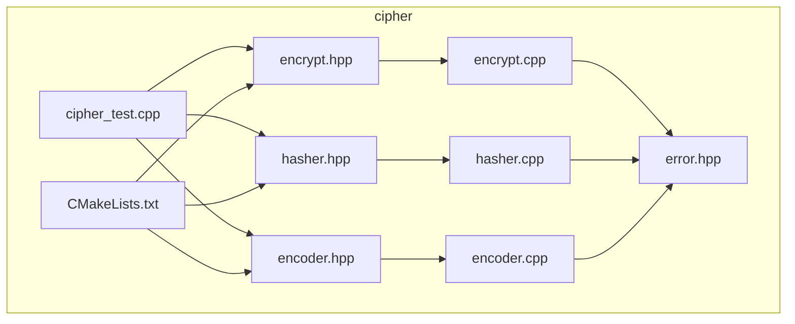
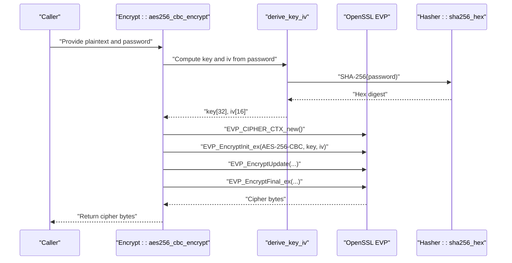
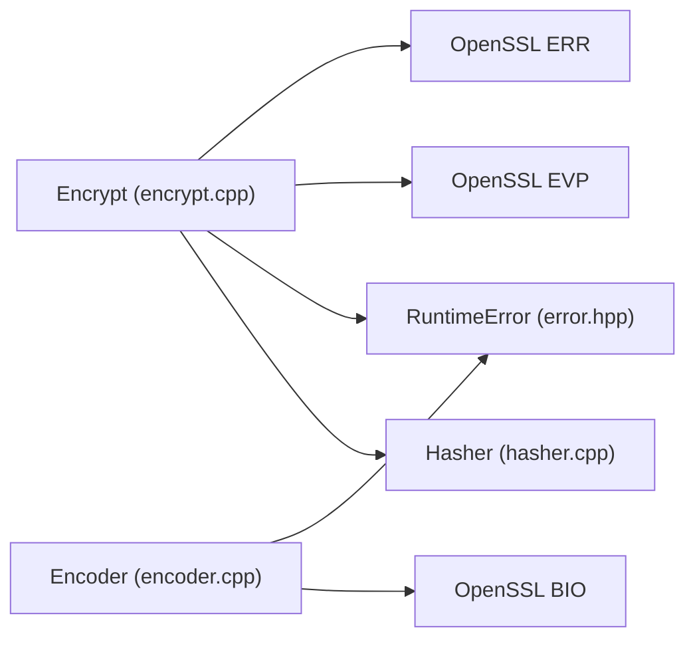

# AES Encryption

<cite>
**Referenced Files in This Document**
- [encrypt.hpp](file://cipher/encrypt.hpp)
- [encrypt.cpp](file://cipher/encrypt.cpp)
- [hasher.hpp](file://cipher/hasher.hpp)
- [hasher.cpp](file://cipher/hasher.cpp)
- [encoder.hpp](file://cipher/encoder.hpp)
- [encoder.cpp](file://cipher/encoder.cpp)
- [error.hpp](file://base/error.hpp)
- [cipher_test.cpp](file://tests/Cipher/cipher_test.cpp)
- [CMakeLists.txt](file://cipher/CMakeLists.txt)
</cite>

## Table of Contents
1. [Introduction](#introduction)
2. [Project Structure](#project-structure)
3. [Core Components](#core-components)
4. [Architecture Overview](#architecture-overview)
5. [Detailed Component Analysis](#detailed-component-analysis)
6. [Dependency Analysis](#dependency-analysis)
7. [Performance Considerations](#performance-considerations)
8. [Troubleshooting Guide](#troubleshooting-guide)
9. [Conclusion](#conclusion)
10. [Appendices](#appendices)

## Introduction
This document explains the AES encryption component in the HsBaSlicer project, focusing on the Encrypt class implementation for AES-256-CBC and AES-256-ECB modes. It covers password-based key derivation using SHA-256 via the derive_key_iv function, OpenSSL’s EVP interface usage for encryption and decryption, IV handling, and padding behavior. It also provides practical usage guidance for CBC and ECB modes with and without explicit IVs, highlights security considerations, error handling mechanisms, and performance characteristics within the HsBaSlicer ecosystem.

## Project Structure
The cipher module provides cryptographic primitives used across the project:
- AES-256-CBC and AES-256-ECB symmetric encryption/decryption
- Password-based key derivation using SHA-256
- Base64 and hex encoding/decoding utilities
- RSA public/private key operations (OAEP padding)
- OpenSSL integration and error reporting

**Diagram sources**
- [encrypt.hpp](file://cipher/encrypt.hpp#L1-L40)
- [encrypt.cpp](file://cipher/encrypt.cpp#L1-L60)
- [hasher.hpp](file://cipher/hasher.hpp#L1-L27)
- [hasher.cpp](file://cipher/hasher.cpp#L1-L30)
- [encoder.hpp](file://cipher/encoder.hpp#L1-L35)
- [encoder.cpp](file://cipher/encoder.cpp#L1-L30)
- [error.hpp](file://base/error.hpp#L1-L40)
- [cipher_test.cpp](file://tests/Cipher/cipher_test.cpp#L1-L40)
- [CMakeLists.txt](file://cipher/CMakeLists.txt#L1-L20)

**Section sources**
- [encrypt.hpp](file://cipher/encrypt.hpp#L1-L40)
- [encrypt.cpp](file://cipher/encrypt.cpp#L1-L60)
- [hasher.hpp](file://cipher/hasher.hpp#L1-L27)
- [hasher.cpp](file://cipher/hasher.cpp#L1-L30)
- [encoder.hpp](file://cipher/encoder.hpp#L1-L35)
- [encoder.cpp](file://cipher/encoder.cpp#L1-L30)
- [error.hpp](file://base/error.hpp#L1-L40)
- [cipher_test.cpp](file://tests/Cipher/cipher_test.cpp#L1-L40)
- [CMakeLists.txt](file://cipher/CMakeLists.txt#L1-L20)

## Core Components
- Encrypt class: Provides AES-256-CBC, AES-256-ECB, and 3DES variants, plus RSA OAEP operations. It uses OpenSSL EVP for block cipher operations and integrates with the project’s RuntimeError system for error propagation.
- Hasher class: Implements SHA-256 hashing used by derive_key_iv for password-based key derivation.
- Encoder class: Provides Base64 and hex encoding/decoding utilities for interoperability with external systems.

Key responsibilities:
- AES-256-CBC: Requires a 16-byte IV; uses OpenSSL EVP with padding handled automatically by the EVP interface.
- AES-256-ECB: No IV; uses the same key derivation scheme but lacks diffusion.
- 3DES variants: DES-EDE3 (DES-EDE3) with ECB/CBC; CBC requires an 8-byte IV.
- RSA: Public encrypt and private decrypt using OAEP padding; keypair generation returns PEM-formatted keys.

**Section sources**
- [encrypt.hpp](file://cipher/encrypt.hpp#L1-L40)
- [encrypt.cpp](file://cipher/encrypt.cpp#L52-L123)
- [encrypt.cpp](file://cipher/encrypt.cpp#L125-L197)
- [encrypt.cpp](file://cipher/encrypt.cpp#L199-L276)
- [encrypt.cpp](file://cipher/encrypt.cpp#L278-L350)
- [encrypt.cpp](file://cipher/encrypt.cpp#L352-L428)
- [encrypt.cpp](file://cipher/encrypt.cpp#L430-L557)
- [hasher.hpp](file://cipher/hasher.hpp#L1-L27)
- [hasher.cpp](file://cipher/hasher.cpp#L56-L71)
- [encoder.hpp](file://cipher/encoder.hpp#L1-L35)
- [encoder.cpp](file://cipher/encoder.cpp#L25-L82)

## Architecture Overview
The AES encryption pipeline relies on OpenSSL’s EVP interface. Password-based key derivation uses SHA-256 to produce a 32-byte key and a 16-byte IV for AES-256. The Encrypt class wraps OpenSSL calls, manages buffers sized to accommodate padding, and throws RuntimeError exceptions on failure.

**Diagram sources**
- [encrypt.cpp](file://cipher/encrypt.cpp#L52-L86)
- [encrypt.cpp](file://cipher/encrypt.cpp#L19-L30)
- [hasher.cpp](file://cipher/hasher.cpp#L66-L71)

**Section sources**
- [encrypt.cpp](file://cipher/encrypt.cpp#L52-L86)
- [encrypt.cpp](file://cipher/encrypt.cpp#L19-L30)
- [hasher.cpp](file://cipher/hasher.cpp#L66-L71)

## Detailed Component Analysis

### AES-256-CBC Implementation
- Key derivation: derive_key_iv computes a 32-byte key and a 16-byte IV from the password using SHA-256. The IV is taken from the first 16 bytes of the hash.
- OpenSSL EVP usage: The implementation creates an EVP_CIPHER_CTX, initializes AES-256-CBC with the derived key and IV, performs update and final operations, and resizes the output buffer to the actual length.
- Padding: EVP handles PKCS#7 padding automatically during encryption and verification.
- Error handling: On any EVP operation failure, the function frees the context and throws RuntimeError with a descriptive message.

Security note: The IV is derived from the password. For production-grade security, a random IV per encryption is strongly recommended. The current implementation reuses the same IV derived from the password, which reduces security compared to random IVs.

**Section sources**
- [encrypt.cpp](file://cipher/encrypt.cpp#L52-L86)
- [encrypt.cpp](file://cipher/encrypt.cpp#L88-L123)
- [encrypt.cpp](file://cipher/encrypt.cpp#L19-L30)

### AES-256-ECB Implementation
- Key derivation: Same as CBC; the IV is unused for ECB.
- OpenSSL EVP usage: Initializes AES-256-ECB with the derived key and no IV.
- Padding: EVP handles PKCS#7 padding automatically.
- Security note: ECB mode lacks diffusion; identical plaintext blocks produce identical ciphertext blocks, making it vulnerable to pattern analysis. It is suitable only for very short, unique messages or when combined with other protections.

**Section sources**
- [encrypt.cpp](file://cipher/encrypt.cpp#L125-L197)
- [encrypt.cpp](file://cipher/encrypt.cpp#L125-L197)

### AES-256-CBC with Explicit IV
- Input validation: Requires a 16-byte IV; otherwise throws invalid_argument.
- Key derivation: Uses the password-derived key and replaces the IV with the caller-provided 16-byte IV.
- OpenSSL EVP usage: Same as CBC without explicit IV, but with a caller-supplied IV.
- Use case: Allows deterministic encryption when the IV is stored alongside the ciphertext, enabling reproducible encryptions for the same password and plaintext.

**Section sources**
- [encrypt.cpp](file://cipher/encrypt.cpp#L199-L276)

### 3DES (DES-EDE3) Variants
- Key derivation: derive_3des_key_iv produces a 24-byte key and 8-byte IV from the password.
- Modes: ECB and CBC variants; CBC requires an 8-byte IV.
- OpenSSL EVP usage: Uses EVP_des_ede3_ecb and EVP_des_ede3_cbc respectively.

**Section sources**
- [encrypt.cpp](file://cipher/encrypt.cpp#L278-L350)
- [encrypt.cpp](file://cipher/encrypt.cpp#L352-L428)
- [encrypt.cpp](file://cipher/encrypt.cpp#L31-L40)

### Password-Based Key Derivation (SHA-256)
- derive_key_iv: Computes a 32-byte key and 16-byte IV from the password by taking the first 32 and 16 bytes of the SHA-256 hash of the password.
- derive_3des_key_iv: Computes a 24-byte key and 8-byte IV similarly.

Security considerations:
- Using a fixed IV derived from the password reduces security compared to random IVs.
- For stronger security, consider a modern KDF (e.g., PBKDF2, scrypt, or Argon2) with a salt and iteration count.

**Section sources**
- [encrypt.cpp](file://cipher/encrypt.cpp#L19-L30)
- [encrypt.cpp](file://cipher/encrypt.cpp#L31-L40)
- [hasher.cpp](file://cipher/hasher.cpp#L66-L71)

### OpenSSL Error Handling and Integration with RuntimeError
- OpenSSL error reporting: The internal openssl_err helper reads the OpenSSL error stack and returns a human-readable string.
- Exception propagation: On EVP initialization/update/final failures, the code frees the EVP context and throws RuntimeError with a descriptive message. The error message includes hints about likely causes (e.g., bad password or corrupted data).

**Section sources**
- [encrypt.cpp](file://cipher/encrypt.cpp#L42-L49)
- [encrypt.cpp](file://cipher/encrypt.cpp#L58-L86)
- [encrypt.cpp](file://cipher/encrypt.cpp#L88-L123)
- [encrypt.cpp](file://cipher/encrypt.cpp#L125-L197)
- [encrypt.cpp](file://cipher/encrypt.cpp#L199-L276)
- [encrypt.cpp](file://cipher/encrypt.cpp#L278-L350)
- [encrypt.cpp](file://cipher/encrypt.cpp#L352-L428)
- [error.hpp](file://base/error.hpp#L1-L40)

### Usage Examples and Patterns
Below are the recommended usage patterns for AES-256-CBC and AES-256-ECB, with and without explicit IVs. Replace the placeholder paths with actual file paths in your project.

- AES-256-CBC with password-derived IV:
  - Encryption: [encrypt.cpp](file://cipher/encrypt.cpp#L52-L86)
  - Decryption: [encrypt.cpp](file://cipher/encrypt.cpp#L88-L123)

- AES-256-ECB with password-derived IV:
  - Encryption: [encrypt.cpp](file://cipher/encrypt.cpp#L125-L160)
  - Decryption: [encrypt.cpp](file://cipher/encrypt.cpp#L162-L197)

- AES-256-CBC with explicit IV:
  - Encryption: [encrypt.cpp](file://cipher/encrypt.cpp#L199-L236)
  - Decryption: [encrypt.cpp](file://cipher/encrypt.cpp#L238-L276)

- 3DES variants:
  - 3DES-ECB: [encrypt.cpp](file://cipher/encrypt.cpp#L278-L313), [encrypt.cpp](file://cipher/encrypt.cpp#L315-L350)
  - 3DES-CBC with IV: [encrypt.cpp](file://cipher/encrypt.cpp#L352-L389), [encrypt.cpp](file://cipher/encrypt.cpp#L391-L428)

- RSA OAEP:
  - Generate keypair: [encrypt.cpp](file://cipher/encrypt.cpp#L479-L507)
  - Public encrypt: [encrypt.cpp](file://cipher/encrypt.cpp#L430-L477)
  - Private decrypt: [encrypt.cpp](file://cipher/encrypt.cpp#L509-L556)

- Encoding helpers:
  - Base64 encode/decode: [encoder.cpp](file://cipher/encoder.cpp#L25-L57), [encoder.cpp](file://cipher/encoder.cpp#L59-L82)
  - Hex encode/decode: [encoder.cpp](file://cipher/encoder.cpp#L84-L108)

- Test coverage:
  - AES round-trip (ECB and CBC with IV): [cipher_test.cpp](file://tests/Cipher/cipher_test.cpp#L80-L94)
  - 3DES round-trip: [cipher_test.cpp](file://tests/Cipher/cipher_test.cpp#L96-L110)
  - RSA round-trip and generation: [cipher_test.cpp](file://tests/Cipher/cipher_test.cpp#L112-L139)

**Section sources**
- [encrypt.cpp](file://cipher/encrypt.cpp#L52-L86)
- [encrypt.cpp](file://cipher/encrypt.cpp#L88-L123)
- [encrypt.cpp](file://cipher/encrypt.cpp#L125-L197)
- [encrypt.cpp](file://cipher/encrypt.cpp#L199-L276)
- [encrypt.cpp](file://cipher/encrypt.cpp#L278-L350)
- [encrypt.cpp](file://cipher/encrypt.cpp#L352-L428)
- [encrypt.cpp](file://cipher/encrypt.cpp#L430-L556)
- [encoder.cpp](file://cipher/encoder.cpp#L25-L108)
- [cipher_test.cpp](file://tests/Cipher/cipher_test.cpp#L80-L139)

## Dependency Analysis
- Internal dependencies:
  - Encrypt depends on Hasher for SHA-256-based key derivation.
  - Encrypt and Encoder depend on the project’s RuntimeError for error propagation.
- External dependencies:
  - OpenSSL: EVP, ERR, SHA, PEM, RSA.
  - Lua (optional): Used by LuaAdapter for encoding utilities.

**Diagram sources**
- [encrypt.cpp](file://cipher/encrypt.cpp#L1-L20)
- [hasher.cpp](file://cipher/hasher.cpp#L1-L20)
- [encoder.cpp](file://cipher/encoder.cpp#L1-L20)
- [error.hpp](file://base/error.hpp#L1-L40)

**Section sources**
- [encrypt.cpp](file://cipher/encrypt.cpp#L1-L20)
- [hasher.cpp](file://cipher/hasher.cpp#L1-L20)
- [encoder.cpp](file://cipher/encoder.cpp#L1-L20)
- [error.hpp](file://base/error.hpp#L1-L40)

## Performance Considerations
- Block size and padding: EVP automatically handles PKCS#7 padding. Output buffer sizes are computed as input size plus one block size to accommodate padding.
- Memory allocation: Buffers are resized to the actual output length after finalization.
- CPU cost: AES-256-CBC and AES-256-ECB are fast and suitable for bulk data. 3DES is slower and generally unnecessary for new designs.
- RSA overhead: RSA operations are significantly more expensive than symmetric ciphers; use them for key transport or signatures, not bulk encryption.

[No sources needed since this section provides general guidance]

## Troubleshooting Guide
Common issues and remedies:
- Bad password or corrupted data (CBC/ECB decryption):
  - Symptom: Decryption finalization fails with a RuntimeError indicating likely bad password or corrupted data.
  - Action: Verify the password and ensure the ciphertext has not been altered.
  - Reference: [encrypt.cpp](file://cipher/encrypt.cpp#L114-L118), [encrypt.cpp](file://cipher/encrypt.cpp#L188-L192), [encrypt.cpp](file://cipher/encrypt.cpp#L266-L271), [encrypt.cpp](file://cipher/encrypt.cpp#L418-L423)

- IV size mismatch:
  - Symptom: Invalid argument thrown when IV length is incorrect (AES-256-CBC requires 16 bytes; 3DES-CBC requires 8 bytes).
  - Action: Ensure IV length matches the cipher mode.
  - Reference: [encrypt.cpp](file://cipher/encrypt.cpp#L200-L201), [encrypt.cpp](file://cipher/encrypt.cpp#L240-L241), [encrypt.cpp](file://cipher/encrypt.cpp#L354-L355), [encrypt.cpp](file://cipher/encrypt.cpp#L393-L394)

- OpenSSL errors:
  - Symptom: RuntimeError with an OpenSSL error message.
  - Action: Inspect the OpenSSL error stack via openssl_err and adjust parameters (e.g., key/IV lengths, padding).
  - Reference: [encrypt.cpp](file://cipher/encrypt.cpp#L42-L49), [encrypt.cpp](file://cipher/encrypt.cpp#L58-L86), [encrypt.cpp](file://cipher/encrypt.cpp#L88-L123), [encrypt.cpp](file://cipher/encrypt.cpp#L125-L197), [encrypt.cpp](file://cipher/encrypt.cpp#L199-L276), [encrypt.cpp](file://cipher/encrypt.cpp#L278-L350), [encrypt.cpp](file://cipher/encrypt.cpp#L352-L428), [encrypt.cpp](file://cipher/encrypt.cpp#L430-L556)

- RSA PEM issues:
  - Symptom: Failure to read PEM or perform encrypt/decrypt.
  - Action: Validate PEM format and ensure OAEP padding is used consistently.
  - Reference: [encrypt.cpp](file://cipher/encrypt.cpp#L430-L477), [encrypt.cpp](file://cipher/encrypt.cpp#L509-L556)

**Section sources**
- [encrypt.cpp](file://cipher/encrypt.cpp#L42-L49)
- [encrypt.cpp](file://cipher/encrypt.cpp#L58-L86)
- [encrypt.cpp](file://cipher/encrypt.cpp#L88-L123)
- [encrypt.cpp](file://cipher/encrypt.cpp#L125-L197)
- [encrypt.cpp](file://cipher/encrypt.cpp#L199-L276)
- [encrypt.cpp](file://cipher/encrypt.cpp#L278-L350)
- [encrypt.cpp](file://cipher/encrypt.cpp#L352-L428)
- [encrypt.cpp](file://cipher/encrypt.cpp#L430-L556)

## Conclusion
The AES encryption component provides robust, OpenSSL-backed implementations for AES-256-CBC and AES-256-ECB, along with 3DES variants and RSA OAEP operations. Password-based key derivation uses SHA-256 to produce a key and IV, simplifying usage but reducing security compared to random IVs. The code integrates tightly with the project’s RuntimeError system and includes comprehensive error handling. For secure configurations and model data, prefer AES-256-CBC with random IVs and consider modern KDFs for password-based key derivation.

[No sources needed since this section summarizes without analyzing specific files]

## Appendices

### Security Considerations
- CBC mode:
  - Use a random, unpredictable IV per encryption. The current implementation derives the IV from the password, which reduces security.
  - Store the IV alongside the ciphertext; it does not need to be secret.
- ECB mode:
  - Avoid ECB for most use cases due to lack of diffusion. It is unsuitable for typical data protection scenarios.
- Password-based key derivation:
  - SHA-256 alone is not a KDF. Consider PBKDF2, scrypt, or Argon2 with a salt and iteration count for improved security.
- Padding:
  - EVP handles PKCS#7 padding automatically; do not manually pad or unpad data.

[No sources needed since this section provides general guidance]

### Best Practices for Use Cases in HsBaSlicer
- Securing configuration files:
  - Prefer AES-256-CBC with a random IV. Store the IV with the ciphertext.
- Protecting model data:
  - Use AES-256-CBC with a random IV. Consider a strong password or key management system.
- Interoperability:
  - Use Base64 or hex encoding for storing binary ciphertext in text-based formats. See [encoder.cpp](file://cipher/encoder.cpp#L25-L108).

[No sources needed since this section provides general guidance]