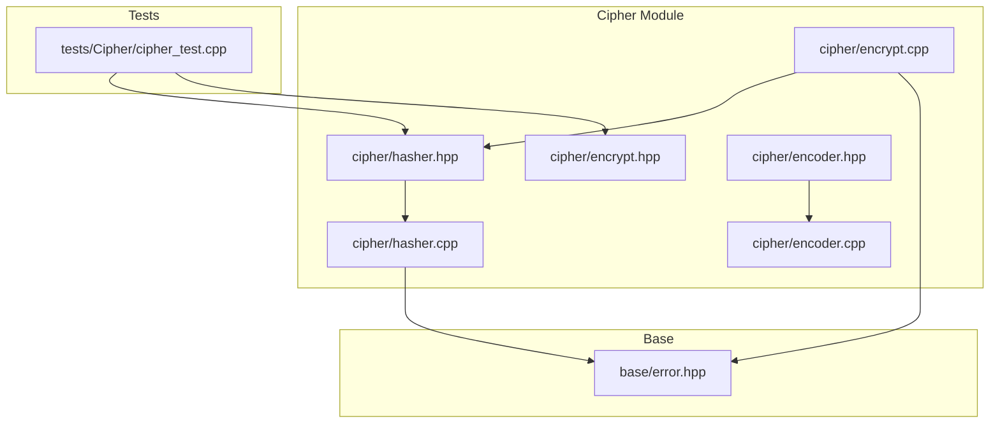
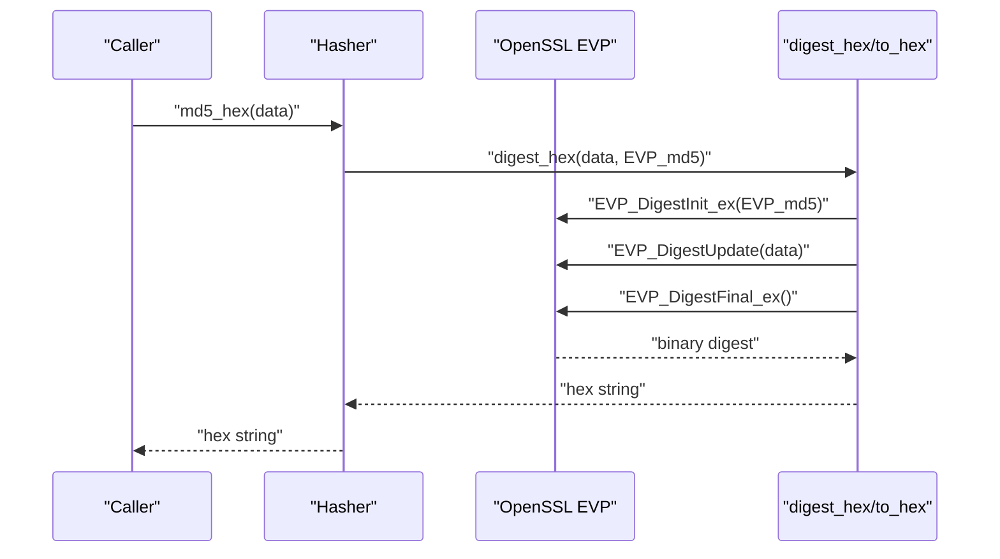
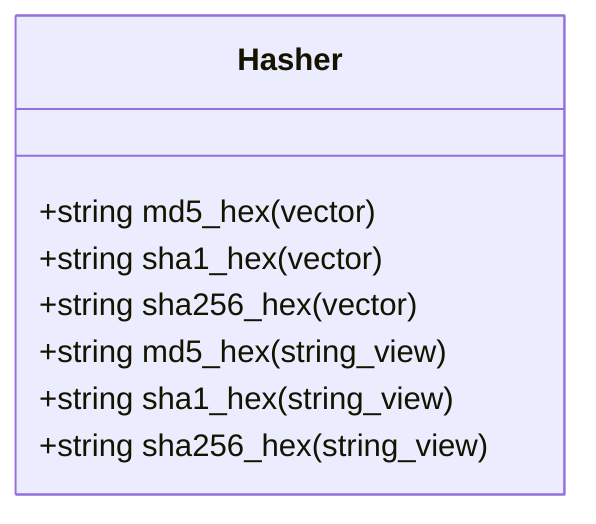
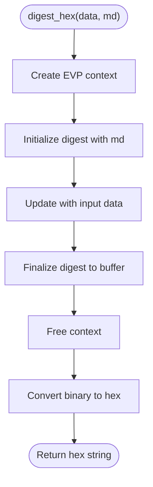
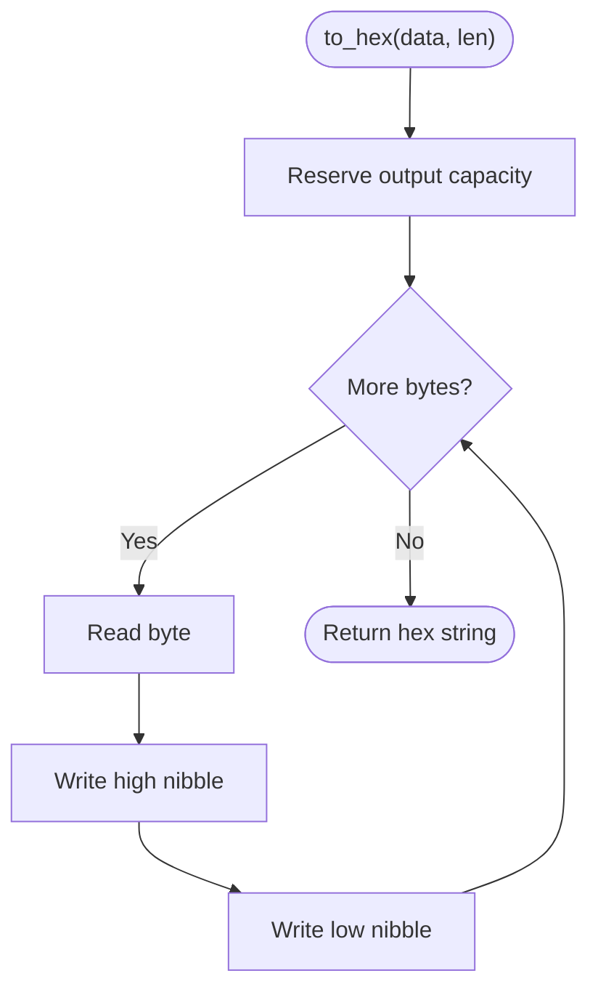
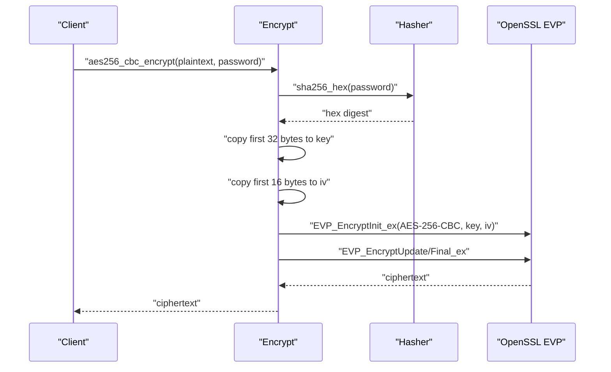
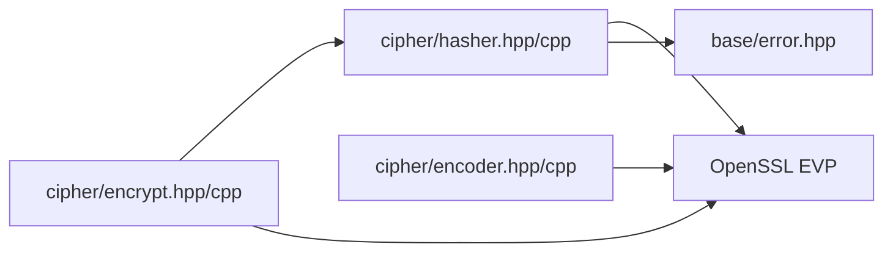

# Hashing Module

<cite>
**Referenced Files in This Document**
- [hasher.hpp](file://cipher/hasher.hpp)
- [hasher.cpp](file://cipher/hasher.cpp)
- [encrypt.hpp](file://cipher/encrypt.hpp)
- [encrypt.cpp](file://cipher/encrypt.cpp)
- [cipher_test.cpp](file://tests/Cipher/cipher_test.cpp)
- [encoder.hpp](file://cipher/encoder.hpp)
- [encoder.cpp](file://cipher/encoder.cpp)
- [error.hpp](file://base/error.hpp)
</cite>

## Table of Contents
1. [Introduction](#introduction)
2. [Project Structure](#project-structure)
3. [Core Components](#core-components)
4. [Architecture Overview](#architecture-overview)
5. [Detailed Component Analysis](#detailed-component-analysis)
6. [Dependency Analysis](#dependency-analysis)
7. [Performance Considerations](#performance-considerations)
8. [Troubleshooting Guide](#troubleshooting-guide)
9. [Conclusion](#conclusion)
10. [Appendices](#appendices)

## Introduction
This document describes the Hashing Module within the HsBaSlicer framework. It focuses on the Hasher class that provides MD5, SHA-1, and SHA-256 hashing using OpenSSL’s EVP interface. It explains the internal digest_hex abstraction, the to_hex utility for binary-to-hex conversion, and demonstrates both vector<unsigned char> and string_view overloads for convenient usage. Practical examples show how to compute hashes for strings and binary data, including use cases like file integrity verification, password hashing (combined with encryption), and data fingerprinting. Security considerations highlight the deprecation of MD5 and SHA-1 due to collision vulnerabilities and the recommendation to use SHA-256 for secure applications. Finally, it covers integration with the encryption module, particularly how SHA-256 is used for password-based key derivation in AES and 3DES operations, along with best practices for selecting appropriate hash functions within the HsBaSlicer framework.

## Project Structure
The Hashing Module resides under the cipher directory and integrates with the encryption module. The primary files are:
- Hasher interface and implementation for MD5, SHA-1, and SHA-256
- Encryption module that uses SHA-256 for password-based key derivation
- Tests demonstrating hashing usage and integration with encryption
- Encoder utilities for hex conversions (complementary to hashing)

**Diagram sources**
- [hasher.hpp](file://cipher/hasher.hpp#L1-L26)
- [hasher.cpp](file://cipher/hasher.cpp#L1-L71)
- [encrypt.hpp](file://cipher/encrypt.hpp#L1-L40)
- [encrypt.cpp](file://cipher/encrypt.cpp#L1-L120)
- [encoder.hpp](file://cipher/encoder.hpp#L1-L35)
- [encoder.cpp](file://cipher/encoder.cpp#L1-L108)
- [cipher_test.cpp](file://tests/Cipher/cipher_test.cpp#L1-L149)
- [error.hpp](file://base/error.hpp#L1-L139)

**Section sources**
- [hasher.hpp](file://cipher/hasher.hpp#L1-L26)
- [hasher.cpp](file://cipher/hasher.cpp#L1-L71)
- [encrypt.hpp](file://cipher/encrypt.hpp#L1-L40)
- [encrypt.cpp](file://cipher/encrypt.cpp#L1-L120)
- [cipher_test.cpp](file://tests/Cipher/cipher_test.cpp#L1-L149)
- [encoder.hpp](file://cipher/encoder.hpp#L1-L35)
- [encoder.cpp](file://cipher/encoder.cpp#L1-L108)
- [error.hpp](file://base/error.hpp#L1-L139)

## Core Components
- Hasher class
  - Provides static methods to compute MD5, SHA-1, and SHA-256 digests and return hexadecimal strings.
  - Overloads accept either vector<unsigned char> or string_view for convenience.
- Internal helpers
  - digest_hex: Shared logic for computing digests via OpenSSL EVP interface.
  - to_hex: Utility to convert binary digest output to a lowercase hexadecimal string.
- Integration with encryption
  - The encryption module derives keys and IVs from passwords using SHA-256, enabling AES and 3DES operations.

Key responsibilities:
- Expose a simple, consistent API for hashing across multiple algorithms.
- Provide efficient binary-to-hex conversion.
- Support both string and byte inputs seamlessly.

**Section sources**
- [hasher.hpp](file://cipher/hasher.hpp#L9-L24)
- [hasher.cpp](file://cipher/hasher.cpp#L16-L54)
- [hasher.cpp](file://cipher/hasher.cpp#L57-L70)
- [encrypt.cpp](file://cipher/encrypt.cpp#L18-L40)

## Architecture Overview
The Hasher class delegates algorithm selection to OpenSSL’s EVP interface. Internally, digest_hex initializes an EVP context, updates it with input data, finalizes the digest, and converts the result to a hex string using to_hex. The encryption module consumes SHA-256 to derive cryptographic keys and IVs from passwords, integrating hashing into the broader security pipeline.

**Diagram sources**
- [hasher.cpp](file://cipher/hasher.cpp#L30-L54)
- [hasher.cpp](file://cipher/hasher.cpp#L57-L70)

## Detailed Component Analysis

### Hasher Class
The Hasher class encapsulates hashing for MD5, SHA-1, and SHA-256. It exposes:
- Static methods returning hexadecimal strings for vectors of bytes.
- Overloads accepting string_view that internally convert to vector<unsigned char>.

Implementation highlights:
- Algorithm selection via EVP_md5, EVP_sha1, EVP_sha256.
- Robust error handling using RuntimeError exceptions for EVP failures.
- Efficient hex conversion using a compact lookup table and pre-reserved output capacity.

**Diagram sources**
- [hasher.hpp](file://cipher/hasher.hpp#L9-L24)

**Section sources**
- [hasher.hpp](file://cipher/hasher.hpp#L9-L24)
- [hasher.cpp](file://cipher/hasher.cpp#L57-L70)

### digest_hex Internal Logic
digest_hex performs the core hashing workflow:
- Creates and initializes an EVP context with the selected digest.
- Updates the context with the input data.
- Finalizes the digest into a buffer sized for the maximum digest length.
- Frees the context and returns the hex-encoded result.

**Diagram sources**
- [hasher.cpp](file://cipher/hasher.cpp#L30-L54)

**Section sources**
- [hasher.cpp](file://cipher/hasher.cpp#L30-L54)

### to_hex Utility
to_hex converts a binary digest to a lowercase hexadecimal string:
- Uses a fixed character table for hex digits.
- Pre-reserves output capacity to minimize reallocations.
- Iterates over each byte and writes two hex characters.

**Diagram sources**
- [hasher.cpp](file://cipher/hasher.cpp#L16-L28)

**Section sources**
- [hasher.cpp](file://cipher/hasher.cpp#L16-L28)

### Integration with Encryption Module
The encryption module uses SHA-256 to derive cryptographic keys and IVs from passwords:
- For AES-256, a 32-byte key and 16-byte IV are derived from the SHA-256 digest of the password.
- For 3DES, a 24-byte key and 8-byte IV are derived similarly.
- These derived values are used to configure EVP cipher contexts for encryption and decryption.

**Diagram sources**
- [encrypt.cpp](file://cipher/encrypt.cpp#L18-L40)
- [hasher.cpp](file://cipher/hasher.cpp#L57-L70)

**Section sources**
- [encrypt.cpp](file://cipher/encrypt.cpp#L18-L40)
- [encrypt.cpp](file://cipher/encrypt.cpp#L52-L86)
- [encrypt.cpp](file://cipher/encrypt.cpp#L88-L123)

### Practical Examples

- Hashing strings and binary data
  - Compute MD5/SHA-1/SHA-256 hex digests from string_view or vector<unsigned char>.
  - Example usage appears in tests for MD5 verification.

- File integrity verification
  - Hash file contents with SHA-256 and compare against known values to detect tampering.

- Password hashing and key derivation
  - Use SHA-256 to derive keys for AES-256-CBC and 3DES operations.
  - The encryption module demonstrates deriving a 32-byte key and 16-byte IV from a password.

- Data fingerprinting
  - Use SHA-256 to produce stable fingerprints for datasets or configurations.

**Section sources**
- [cipher_test.cpp](file://tests/Cipher/cipher_test.cpp#L141-L147)
- [encrypt.cpp](file://cipher/encrypt.cpp#L18-L40)

## Dependency Analysis
- Hasher depends on OpenSSL EVP for algorithm support and base/error.hpp for exception types.
- Encryption module depends on Hasher for SHA-256-based key derivation and on OpenSSL EVP for cipher operations.
- Encoder utilities complement hashing by providing hex encode/decode for interoperability.

**Diagram sources**
- [hasher.cpp](file://cipher/hasher.cpp#L1-L12)
- [encrypt.cpp](file://cipher/encrypt.cpp#L1-L16)
- [encoder.cpp](file://cipher/encoder.cpp#L1-L11)
- [error.hpp](file://base/error.hpp#L1-L139)

**Section sources**
- [hasher.cpp](file://cipher/hasher.cpp#L1-L12)
- [encrypt.cpp](file://cipher/encrypt.cpp#L1-L16)
- [encoder.cpp](file://cipher/encoder.cpp#L1-L11)
- [error.hpp](file://base/error.hpp#L1-L139)

## Performance Considerations
- Algorithm choice
  - MD5 and SHA-1 are fast but insecure for cryptographic integrity or collision resistance. Prefer SHA-256 for secure applications.
- Digest computation
  - digest_hex uses a single-pass EVP update and finalization, minimizing overhead.
  - to_hex performs a linear scan with constant-time hex lookup, yielding O(n) conversion cost.
- Memory allocation
  - Output capacity is pre-reserved to reduce reallocations during hex conversion.
- Integration note
  - The encryption module avoids repeated hashing by deriving keys once per password and reusing them across operations.

[No sources needed since this section provides general guidance]

## Troubleshooting Guide
Common issues and remedies:
- EVP initialization/update/finalization failures
  - Thrown as RuntimeError exceptions. Inspect error messages to diagnose provider or memory issues.
- Invalid argument errors
  - Occur when inputs are malformed (e.g., hex decode with odd-length strings).
- Decryption failures
  - May indicate incorrect password or corrupted ciphertext; the encryption module surfaces descriptive error messages for decrypt finalization failures.

**Section sources**
- [hasher.cpp](file://cipher/hasher.cpp#L30-L54)
- [encrypt.cpp](file://cipher/encrypt.cpp#L70-L86)
- [encrypt.cpp](file://cipher/encrypt.cpp#L104-L123)
- [encoder.cpp](file://cipher/encoder.cpp#L96-L107)
- [error.hpp](file://base/error.hpp#L1-L139)

## Conclusion
The Hashing Module provides a clean, efficient interface for MD5, SHA-1, and SHA-256 hashing using OpenSSL’s EVP. Its digest_hex abstraction centralizes digest computation, while to_hex ensures fast and predictable hex conversion. The encryption module integrates SHA-256 to derive keys and IVs from passwords, enabling secure AES and 3DES operations. For security-sensitive scenarios, prefer SHA-256 over MD5 and SHA-1. Adopt best practices such as reserving output buffers, handling exceptions, and reusing derived keys to achieve robust and performant hashing and encryption workflows.

[No sources needed since this section summarizes without analyzing specific files]

## Appendices

### API Reference: Hasher
- Methods
  - md5_hex(vector<unsigned char>) -> string
  - sha1_hex(vector<unsigned char>) -> string
  - sha256_hex(vector<unsigned char>) -> string
  - md5_hex(string_view) -> string
  - sha1_hex(string_view) -> string
  - sha256_hex(string_view) -> string

- Notes
  - All methods return lowercase hexadecimal strings.
  - Overloads accept string_view for convenience; they internally convert to vector<unsigned char>.

**Section sources**
- [hasher.hpp](file://cipher/hasher.hpp#L9-L24)

### API Reference: Encryption Key Derivation
- Functions
  - AES-256-CBC and ECB variants with password-based key derivation using SHA-256.
  - 3DES-ECB and 3DES-CBC variants with password-based key derivation using SHA-256.
- Behavior
  - Derives a 32-byte key and 16-byte IV for AES-256.
  - Derives a 24-byte key and 8-byte IV for 3DES.
  - Uses the SHA-256 digest of the password as the basis for derived values.

**Section sources**
- [encrypt.cpp](file://cipher/encrypt.cpp#L18-L40)
- [encrypt.cpp](file://cipher/encrypt.cpp#L278-L350)
- [encrypt.cpp](file://cipher/encrypt.cpp#L352-L428)