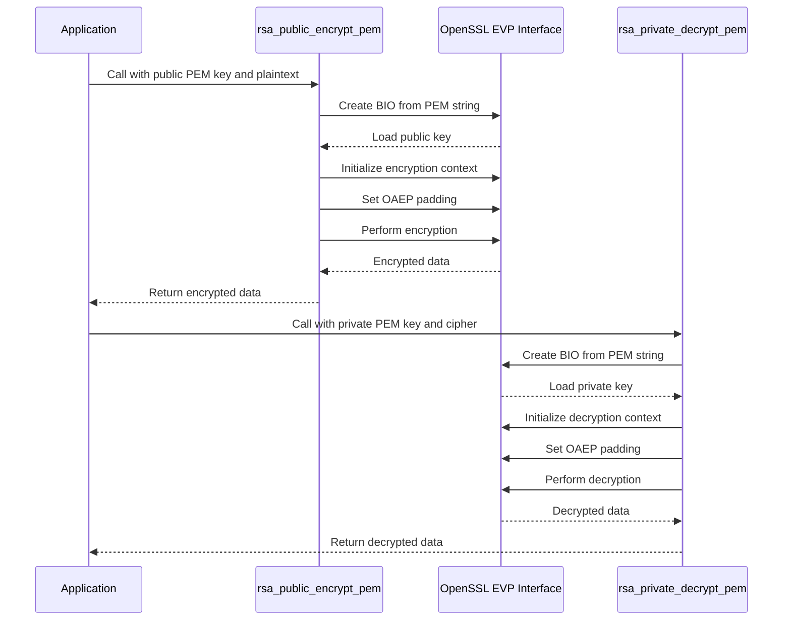
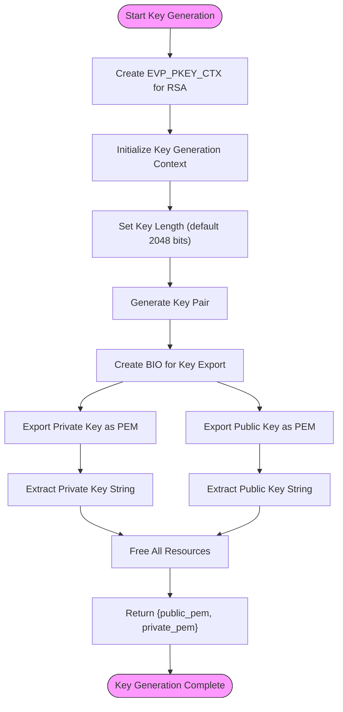
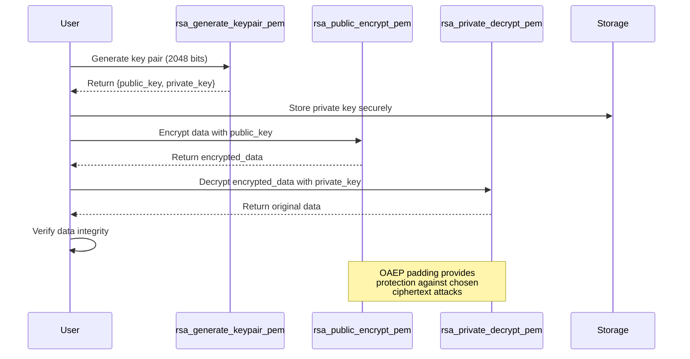
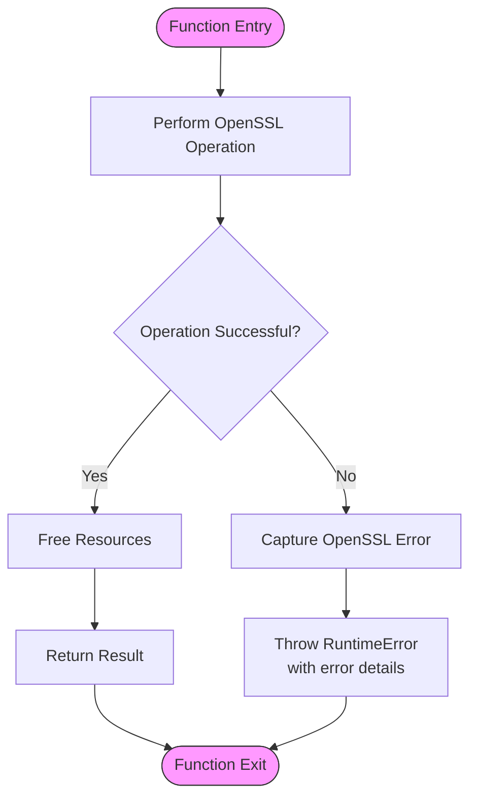

# RSA Public-Key Encryption

<cite>
**Referenced Files in This Document**   
- [encrypt.hpp](file://cipher/encrypt.hpp)
- [encrypt.cpp](file://cipher/encrypt.cpp)
- [error.hpp](file://base/error.hpp)
- [cipher_test.cpp](file://tests/Cipher/cipher_test.cpp)
</cite>

## Table of Contents
1. [Introduction](#introduction)
2. [Core RSA Implementation](#core-rsa-implementation)
3. [Key Generation Process](#key-generation-process)
4. [Encryption and Decryption Workflow](#encryption-and-decryption-workflow)
5. [Security Considerations](#security-considerations)
6. [Performance and Limitations](#performance-and-limitations)
7. [Integration and Usage](#integration-and-usage)
8. [Error Handling](#error-handling)
9. [Testing and Validation](#testing-and-validation)
10. [Conclusion](#conclusion)

## Introduction

The RSA public-key encryption component in HsBaSlicer provides a secure implementation of asymmetric cryptography using the RSA-OAEP (PKCS#1 v2.0) standard. This implementation leverages OpenSSL's EVP_PKEY interface to offer robust encryption and decryption capabilities with PEM-formatted keys. The component is designed to support secure data exchange within the HsBaSlicer application, particularly for sensitive operations such as configuration management and digital signatures.

The RSA functionality is encapsulated within the `Encrypt` class in the `HsBa::Slicer::Cipher` namespace, providing three primary operations: key pair generation, public key encryption, and private key decryption. The implementation follows modern cryptographic best practices, including the use of OAEP padding to protect against chosen ciphertext attacks and proper memory management of sensitive data.

**Section sources**
- [encrypt.hpp](file://cipher/encrypt.hpp#L31-L36)
- [encrypt.cpp](file://cipher/encrypt.cpp#L429-L556)

## Core RSA Implementation

The RSA implementation in HsBaSlicer utilizes OpenSSL's high-level EVP_PKEY interface for cryptographic operations, ensuring compatibility with industry standards and providing a robust security foundation. The implementation specifically uses RSA-OAEP (Optimal Asymmetric Encryption Padding) as defined in PKCS#1 v2.0, which provides enhanced security compared to older padding schemes like PKCS#1 v1.5.

The core encryption and decryption functions, `rsa_public_encrypt_pem` and `rsa_private_decrypt_pem`, accept PEM-formatted keys as string input and process binary data represented as `std::vector<unsigned char>`. This design choice simplifies key management and enables easy integration with various storage and transmission mechanisms.

The implementation follows a strict resource management pattern, ensuring that all OpenSSL resources (BIO, EVP_PKEY, and EVP_PKEY_CTX objects) are properly freed even in error conditions. This prevents memory leaks and ensures the application maintains a clean state during cryptographic operations.



**Diagram sources**
- [encrypt.cpp](file://cipher/encrypt.cpp#L429-L477)
- [encrypt.cpp](file://cipher/encrypt.cpp#L509-L556)

**Section sources**
- [encrypt.hpp](file://cipher/encrypt.hpp#L31-L33)
- [encrypt.cpp](file://cipher/encrypt.cpp#L429-L556)

## Key Generation Process

The `rsa_generate_keypair_pem` function implements a secure key pair generation process that creates both public and private RSA keys in PEM format. The function supports configurable key lengths, with a default of 2048 bits, which represents a good balance between security and performance for most applications.

The key generation process follows these steps:
1. Create an EVP_PKEY_CTX for RSA key generation
2. Initialize the key generation context
3. Set the desired key length (in bits)
4. Generate the key pair
5. Export both public and private keys in PEM format
6. Clean up all temporary resources

The function returns a `std::pair<std::string, std::string>` containing the public key PEM string as the first element and the private key PEM string as the second element. This design simplifies key management and distribution within the application.

The implementation ensures that all OpenSSL resources are properly managed, with appropriate error checking at each step. If any operation fails, the function throws a `RuntimeError` with a descriptive message, and all allocated resources are cleaned up to prevent memory leaks.



**Diagram sources**
- [encrypt.cpp](file://cipher/encrypt.cpp#L479-L507)

**Section sources**
- [encrypt.hpp](file://cipher/encrypt.hpp#L35-L36)
- [encrypt.cpp](file://cipher/encrypt.cpp#L479-L507)

## Encryption and Decryption Workflow

The RSA encryption and decryption workflow in HsBaSlicer follows a standardized process that ensures security and reliability. The workflow begins with key generation, followed by encryption using the public key, and concludes with decryption using the private key.

For encryption, the `rsa_public_encrypt_pem` function takes a PEM-formatted public key and plaintext data, then performs the following steps:
1. Create a BIO (Basic Input/Output) structure from the public key string
2. Parse the public key using PEM_read_bio_PUBKEY
3. Create an EVP_PKEY_CTX context for encryption
4. Initialize the encryption operation
5. Set RSA_PKCS1_OAEP_PADDING for enhanced security
6. Determine the output buffer size
7. Perform the encryption operation
8. Clean up all resources and return the encrypted data

The decryption process in `rsa_private_decrypt_pem` follows a similar pattern but uses the private key and decryption functions. Both functions implement comprehensive error handling and resource management to ensure the system remains stable even when invalid inputs are provided.

The maximum message size that can be encrypted is determined by the key length and the OAEP padding scheme. For a 2048-bit key, the maximum plaintext size is approximately 190 bytes, which is sufficient for encrypting symmetric keys or small configuration data.



**Diagram sources**
- [encrypt.cpp](file://cipher/encrypt.cpp#L429-L556)
- [cipher_test.cpp](file://tests/Cipher/cipher_test.cpp#L112-L122)

**Section sources**
- [encrypt.hpp](file://cipher/encrypt.hpp#L31-L33)
- [encrypt.cpp](file://cipher/encrypt.cpp#L429-L556)

## Security Considerations

The RSA implementation in HsBaSlicer incorporates several security best practices to protect against common cryptographic vulnerabilities. The most significant security feature is the use of OAEP (Optimal Asymmetric Encryption Padding) instead of the older PKCS#1 v1.5 padding. OAEP provides semantic security against adaptive chosen ciphertext attacks, making it the recommended padding scheme for new applications.

Private key protection is a critical aspect of the implementation. The private keys are handled as string data in memory and should be protected from unauthorized access. Developers should ensure that private keys are stored securely, preferably using platform-specific secure storage mechanisms, and never exposed in logs or error messages.

The implementation includes proper error handling that avoids leaking sensitive information. While OpenSSL error messages are captured and included in exceptions, care should be taken in production environments to ensure that these messages do not reveal information about the cryptographic operations to potential attackers.

Memory management of sensitive data follows secure practices, with all OpenSSL resources being explicitly freed after use. However, the implementation does not include explicit memory wiping of sensitive buffers, which could be a consideration for highly sensitive applications where data might remain in memory after use.

Additional security considerations include:
- Using sufficiently long key lengths (2048 bits or higher)
- Protecting private keys with appropriate access controls
- Regularly rotating keys in long-running applications
- Validating key formats before use
- Implementing proper exception handling to prevent information leakage

**Section sources**
- [encrypt.cpp](file://cipher/encrypt.cpp#L452-L457)
- [encrypt.cpp](file://cipher/encrypt.cpp#L531-L536)
- [error.hpp](file://base/error.hpp#L12-L19)

## Performance and Limitations

RSA encryption has inherent performance characteristics and limitations that must be considered when designing systems that use this cryptographic algorithm. The primary limitation is the message size constraint, which is determined by the key length and padding scheme. For a 2048-bit RSA key with OAEP padding, the maximum plaintext size is approximately 190 bytes. This limitation means that RSA is typically used to encrypt symmetric keys or small amounts of data rather than large messages.

Performance-wise, RSA operations are computationally intensive compared to symmetric encryption algorithms. Public key encryption is generally faster than private key decryption, but both operations are significantly slower than symmetric encryption. The performance impact increases with larger key sizes, as larger keys provide better security but require more computational resources.

In HsBaSlicer, the RSA implementation is optimized for correctness and security rather than maximum performance. The use of OpenSSL's EVP interface provides a good balance between performance and flexibility. However, applications that require high-throughput cryptographic operations should consider using RSA only for key exchange and then switching to symmetric encryption (such as AES) for bulk data encryption.

The key generation process is particularly resource-intensive and should be performed only when necessary. Generating a 2048-bit RSA key pair can take a noticeable amount of time, especially on systems with limited entropy. Applications should avoid generating new key pairs frequently and should cache key pairs when possible.

Typical use cases within HsBaSlicer include:
- Secure configuration exchange between components
- Digital signatures for data integrity verification
- Secure key exchange for symmetric encryption
- Authentication token encryption

**Section sources**
- [encrypt.cpp](file://cipher/encrypt.cpp#L459-L468)
- [encrypt.cpp](file://cipher/encrypt.cpp#L538-L545)

## Integration and Usage

The RSA encryption component is designed for easy integration into the HsBaSlicer application and can be used in various scenarios requiring secure data protection. The component is part of the HsBaCipher library, which is linked with OpenSSL and Lua dependencies, enabling both C++ and Lua-based applications to utilize the cryptographic functions.

To use the RSA functionality, developers should include the `encrypt.hpp` header and call the static methods of the `Encrypt` class. The API is designed to be straightforward and intuitive, with clear function names and well-defined parameters.

For C++ integration:
```cpp
#include "cipher/encrypt.hpp"
using namespace HsBa::Slicer::Cipher;

// Generate a key pair
auto keys = Encrypt::rsa_generate_keypair_pem(2048);
std::string public_key = keys.first;
std::string private_key = keys.second;

// Encrypt data with public key
std::vector<unsigned char> plaintext = { /* data to encrypt */ };
auto ciphertext = Encrypt::rsa_public_encrypt_pem(public_key, plaintext);

// Decrypt data with private key
auto decrypted = Encrypt::rsa_private_decrypt_pem(private_key, ciphertext);
```

The component is also accessible from Lua scripts through the Cipher module, which is registered by the LuaAdapter. This allows configuration scripts and plugins to perform cryptographic operations without requiring C++ development.

The CMakeLists.txt configuration shows that the cipher library depends on OpenSSL::SSL, OpenSSL::Crypto, and Lua, ensuring that all necessary cryptographic functions are available at runtime.

**Section sources**
- [encrypt.hpp](file://cipher/encrypt.hpp#L31-L36)
- [LuaAdapter.cpp](file://cipher/LuaAdapter.cpp#L90-L94)
- [CMakeLists.txt](file://cipher/CMakeLists.txt#L17-L20)

## Error Handling

The RSA implementation in HsBaSlicer features comprehensive error handling that ensures the application can gracefully handle cryptographic failures. All functions that can fail throw exceptions derived from the `RuntimeError` class defined in `base/error.hpp`. This consistent error handling approach allows developers to catch and handle cryptographic errors in a uniform manner.

The implementation checks for errors at each step of the cryptographic operations and provides descriptive error messages. When OpenSSL functions fail, the implementation captures the OpenSSL error string using the `openssl_err()` helper function and includes it in the exception message. This detailed error information is invaluable for debugging cryptographic issues.

Resource management is carefully handled to prevent memory leaks even when errors occur. The implementation follows the RAII (Resource Acquisition Is Initialization) principle, where each OpenSSL resource allocation is immediately followed by error checking, and all resources are freed before throwing an exception.

Common error conditions that are handled include:
- Invalid PEM key formats
- OpenSSL library initialization failures
- Insufficient memory for cryptographic operations
- Incorrect padding configurations
- Data size exceeding encryption limits

Developers should wrap cryptographic operations in try-catch blocks to handle potential exceptions and provide appropriate user feedback or fallback mechanisms.



**Diagram sources**
- [encrypt.cpp](file://cipher/encrypt.cpp#L430-L438)
- [encrypt.cpp](file://cipher/encrypt.cpp#L510-L517)
- [error.hpp](file://base/error.hpp#L12-L19)

**Section sources**
- [encrypt.cpp](file://cipher/encrypt.cpp#L42-L49)
- [error.hpp](file://base/error.hpp#L12-L19)

## Testing and Validation

The RSA functionality is validated through comprehensive unit tests in the `cipher_test.cpp` file. These tests verify the correctness of the cryptographic operations and ensure that the implementation meets the expected security requirements.

The test suite includes several key test cases:
- `rsa_roundtrip`: Verifies that data encrypted with a public key can be successfully decrypted with the corresponding private key
- `rsa_gen_and_use`: Tests the complete workflow from key generation to encryption and decryption
- Various symmetric encryption roundtrip tests that validate the overall cipher library functionality

The `rsa_roundtrip` test uses a helper function `generate_rsa_pem_pair()` to create test keys and verifies that the encryption and decryption process preserves the original data. The `rsa_gen_and_use` test specifically validates the library's `rsa_generate_keypair_pem` function and confirms that the generated keys are in the correct PEM format by checking for the standard PEM headers.

These tests use the BOOST test framework and validate both the functional correctness and the format compliance of the cryptographic operations. The tests check not only that the operations succeed but also that the output data matches the expected results byte-for-byte.

The testing approach follows best practices by using randomly generated test data and verifying the integrity of the cryptographic operations through round-trip testing. This ensures that both encryption and decryption functions work correctly together.

**Section sources**
- [cipher_test.cpp](file://tests/Cipher/cipher_test.cpp#L112-L139)
- [cipher_test.cpp](file://tests/Cipher/cipher_test.cpp#L30-L61)

## Conclusion

The RSA public-key encryption component in HsBaSlicer provides a secure and reliable implementation of asymmetric cryptography using the RSA-OAEP standard. By leveraging OpenSSL's EVP_PKEY interface, the implementation offers robust security features while maintaining a clean and intuitive API for developers.

The component supports the complete RSA workflow, from key generation to encryption and decryption, with all keys handled in the widely supported PEM format. The use of OAEP padding provides protection against chosen ciphertext attacks, making it suitable for securing sensitive data within the application.

Key strengths of the implementation include:
- Compliance with PKCS#1 v2.0 standards
- Proper resource management and memory safety
- Comprehensive error handling with descriptive messages
- Easy integration through a simple API
- Support for configurable key lengths
- Validation through comprehensive unit tests

For optimal security, developers should follow best practices such as protecting private keys, using appropriate key lengths, and considering the performance implications of RSA encryption for their specific use cases. The component is well-suited for securing configuration data, enabling secure communication between components, and implementing digital signature functionality within the HsBaSlicer application.