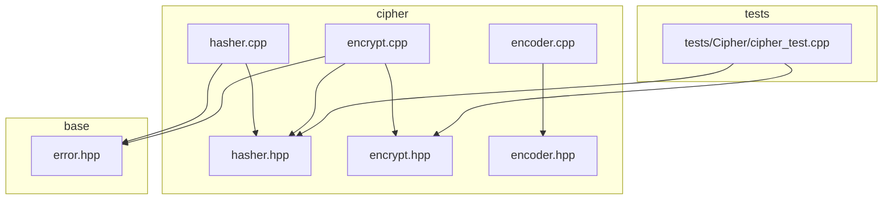
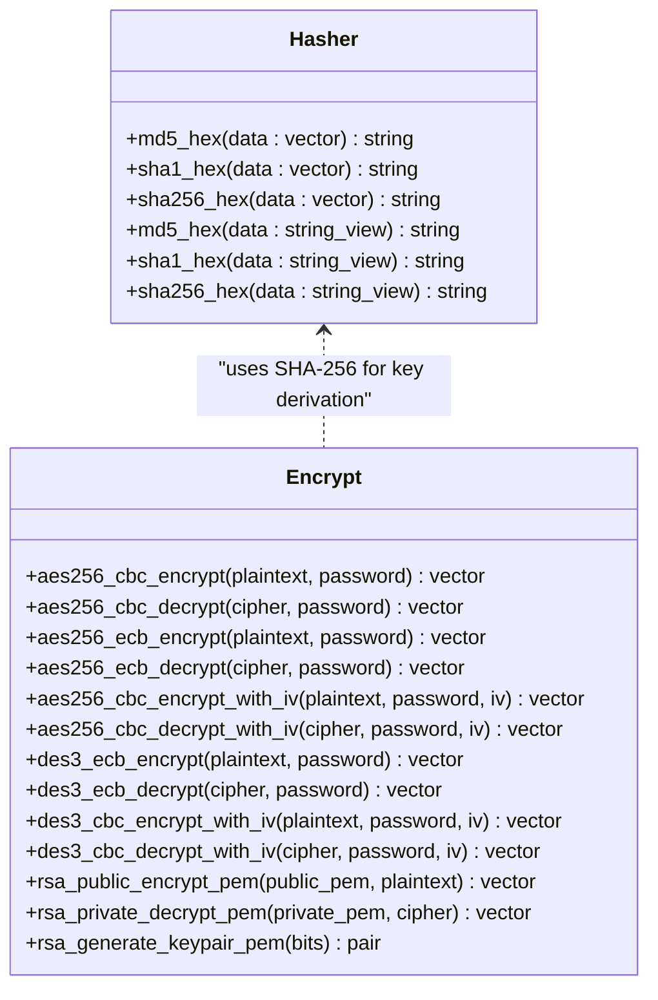
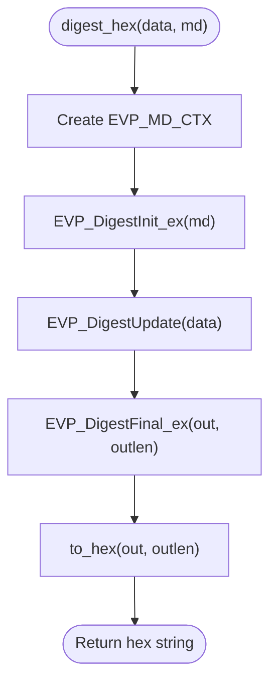
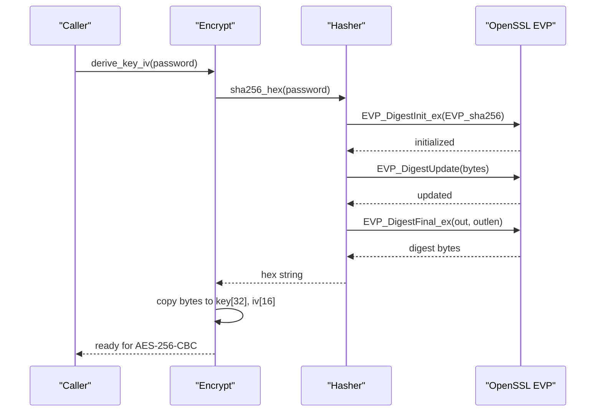
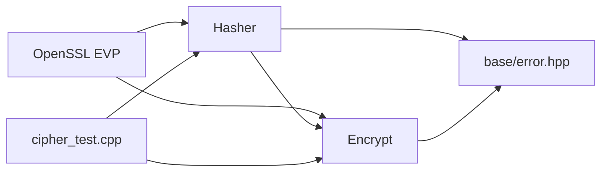

# Hashing Module

<cite>
**Referenced Files in This Document**
- [hasher.hpp](file://cipher/hasher.hpp)
- [hasher.cpp](file://cipher/hasher.cpp)
- [encrypt.hpp](file://cipher/encrypt.hpp)
- [encrypt.cpp](file://cipher/encrypt.cpp)
- [cipher_test.cpp](file://tests/Cipher/cipher_test.cpp)
- [encoder.hpp](file://cipher/encoder.hpp)
- [encoder.cpp](file://cipher/encoder.cpp)
- [error.hpp](file://base/error.hpp)
</cite>

## Table of Contents
1. [Introduction](#introduction)
2. [Project Structure](#project-structure)
3. [Core Components](#core-components)
4. [Architecture Overview](#architecture-overview)
5. [Detailed Component Analysis](#detailed-component-analysis)
6. [Dependency Analysis](#dependency-analysis)
7. [Performance Considerations](#performance-considerations)
8. [Security Considerations](#security-considerations)
9. [Usage Patterns and Examples](#usage-patterns-and-examples)
10. [Troubleshooting Guide](#troubleshooting-guide)
11. [Conclusion](#conclusion)

## Introduction
This document describes the Hashing Module responsible for computing cryptographic hashes (MD5, SHA-1, SHA-256) using OpenSSL’s EVP interface. It explains the digest abstraction, the hex conversion utility, and how these capabilities integrate with the Encrypt module for key derivation. It also covers security considerations around deprecated algorithms, performance characteristics, and practical usage patterns within the codebase.

## Project Structure
The Hashing Module resides under the cipher directory and collaborates with the Encrypt module and tests:

**Diagram sources**
- [hasher.hpp](file://cipher/hasher.hpp#L1-L27)
- [hasher.cpp](file://cipher/hasher.cpp#L1-L71)
- [encrypt.hpp](file://cipher/encrypt.hpp#L1-L40)
- [encrypt.cpp](file://cipher/encrypt.cpp#L1-L557)
- [encoder.hpp](file://cipher/encoder.hpp#L1-L35)
- [encoder.cpp](file://cipher/encoder.cpp#L1-L108)
- [error.hpp](file://base/error.hpp#L1-L139)
- [cipher_test.cpp](file://tests/Cipher/cipher_test.cpp#L1-L150)

**Section sources**
- [hasher.hpp](file://cipher/hasher.hpp#L1-L27)
- [hasher.cpp](file://cipher/hasher.cpp#L1-L71)
- [encrypt.hpp](file://cipher/encrypt.hpp#L1-L40)
- [encrypt.cpp](file://cipher/encrypt.cpp#L1-L557)
- [cipher_test.cpp](file://tests/Cipher/cipher_test.cpp#L1-L150)

## Core Components
- Hasher class: Provides static methods to compute MD5, SHA-1, and SHA-256 digests and return hexadecimal strings. Overloads accept either std::vector<unsigned char> or std::string_view.
- digest_hex helper: Encapsulates the OpenSSL EVP digest lifecycle (init, update, final) and returns a hex string.
- to_hex utility: Converts raw binary digest output to a lowercase hexadecimal string.
- Integration with Encrypt: Uses SHA-256 to derive keys and IVs from passwords for symmetric encryption.

**Section sources**
- [hasher.hpp](file://cipher/hasher.hpp#L9-L24)
- [hasher.cpp](file://cipher/hasher.cpp#L16-L54)
- [hasher.cpp](file://cipher/hasher.cpp#L56-L71)
- [encrypt.cpp](file://cipher/encrypt.cpp#L19-L40)

## Architecture Overview
The Hashing Module is a thin wrapper around OpenSSL’s EVP interface. It exposes a simple API for hashing and integrates with the Encrypt module to derive cryptographic material from user-provided passwords.

**Diagram sources**
- [hasher.hpp](file://cipher/hasher.hpp#L9-L24)
- [encrypt.hpp](file://cipher/encrypt.hpp#L8-L37)

## Detailed Component Analysis

### Hasher Implementation
- Public API:
  - md5_hex, sha1_hex, sha256_hex accept either vector<unsigned char> or string_view and return a lowercase hex string.
- Internal helpers:
  - digest_hex: Creates an EVP context, initializes the digest, updates with input data, finalizes, and converts the raw digest to hex.
  - to_hex: Efficiently converts raw bytes to a hex string using a lookup table and pre-reserving capacity.

**Diagram sources**
- [hasher.cpp](file://cipher/hasher.cpp#L30-L54)
- [hasher.cpp](file://cipher/hasher.cpp#L16-L28)

**Section sources**
- [hasher.hpp](file://cipher/hasher.hpp#L9-L24)
- [hasher.cpp](file://cipher/hasher.cpp#L16-L54)
- [hasher.cpp](file://cipher/hasher.cpp#L56-L71)

### Integration with Encrypt (Key Derivation)
The Encrypt module derives cryptographic keys and IVs from a password using SHA-256:
- derive_key_iv: Computes SHA-256 of the password and copies the first 32 bytes for the key and first 16 bytes for the IV.
- derive_3des_key_iv: Computes SHA-256 and uses the first 24 bytes for the 3DES key and first 8 bytes for the IV.
- These functions rely on Hasher::sha256_hex to produce a deterministic byte sequence suitable for symmetric ciphers.

**Diagram sources**
- [encrypt.cpp](file://cipher/encrypt.cpp#L19-L40)
- [hasher.cpp](file://cipher/hasher.cpp#L30-L54)

**Section sources**
- [encrypt.cpp](file://cipher/encrypt.cpp#L19-L40)

### Test Coverage
The tests exercise MD5 hashing and confirm expected output for a known input, demonstrating the Hasher API usage.

**Section sources**
- [cipher_test.cpp](file://tests/Cipher/cipher_test.cpp#L141-L147)

## Dependency Analysis
- Hasher depends on OpenSSL EVP for cryptographic primitives and on the project’s error types for robust failure reporting.
- Encrypt depends on Hasher for SHA-256-based key derivation and on OpenSSL EVP for symmetric encryption/decryption.
- Tests depend on Hasher and Encrypt to validate round-trip encryption and hashing behavior.

**Diagram sources**
- [hasher.cpp](file://cipher/hasher.cpp#L1-L12)
- [encrypt.cpp](file://cipher/encrypt.cpp#L1-L16)
- [hasher.hpp](file://cipher/hasher.hpp#L1-L8)
- [encrypt.hpp](file://cipher/encrypt.hpp#L1-L8)
- [error.hpp](file://base/error.hpp#L1-L139)
- [cipher_test.cpp](file://tests/Cipher/cipher_test.cpp#L1-L20)

**Section sources**
- [hasher.cpp](file://cipher/hasher.cpp#L1-L12)
- [encrypt.cpp](file://cipher/encrypt.cpp#L1-L16)
- [hasher.hpp](file://cipher/hasher.hpp#L1-L8)
- [encrypt.hpp](file://cipher/encrypt.hpp#L1-L8)
- [error.hpp](file://base/error.hpp#L1-L139)
- [cipher_test.cpp](file://tests/Cipher/cipher_test.cpp#L1-L20)

## Performance Considerations
- digest_hex allocates a temporary buffer sized to the maximum digest size and writes only the actual output length, minimizing reallocations.
- to_hex reserves capacity equal to twice the input length, avoiding intermediate allocations during character assembly.
- Using EVP interface ensures efficient implementation backed by optimized OpenSSL routines.
- For large datasets, consider streaming updates to reduce memory pressure and improve throughput.

[No sources needed since this section provides general guidance]

## Security Considerations
- MD5 and SHA-1 are cryptographically broken and unsuitable for security-sensitive contexts. They remain exposed via Hasher for legacy compatibility and non-security use cases.
- SHA-256 is recommended for secure applications, including integrity verification and key derivation.
- The Encrypt module uses SHA-256 for key derivation, aligning with modern security practices.
- For integrity verification scenarios (e.g., validating model files or configuration checksums), prefer SHA-256 to mitigate collision and preimage attacks.

[No sources needed since this section provides general guidance]

## Usage Patterns and Examples
- Computing hashes:
  - Use Hasher::md5_hex, Hasher::sha1_hex, or Hasher::sha256_hex with either a vector of bytes or a string_view.
  - Example reference: [cipher_test.cpp](file://tests/Cipher/cipher_test.cpp#L141-L147)
- Integrity verification:
  - Compute the hash of a file or configuration payload and compare it to a stored checksum.
  - Example reference: [cipher_test.cpp](file://tests/Cipher/cipher_test.cpp#L141-L147)
- Key derivation:
  - Use Encrypt::aes256_cbc_encrypt/decrypt with a password; internally, SHA-256 is used to derive the key and IV.
  - Example reference: [encrypt.cpp](file://cipher/encrypt.cpp#L19-L40)
- Hex conversion:
  - The to_hex utility converts raw digest bytes to a lowercase hex string for display or storage.
  - Example reference: [hasher.cpp](file://cipher/hasher.cpp#L16-L28)

**Section sources**
- [cipher_test.cpp](file://tests/Cipher/cipher_test.cpp#L141-L147)
- [encrypt.cpp](file://cipher/encrypt.cpp#L19-L40)
- [hasher.cpp](file://cipher/hasher.cpp#L16-L28)

## Troubleshooting Guide
- OpenSSL initialization failures:
  - digest_hex throws a runtime error if EVP context creation or digest initialization fails.
  - Example reference: [hasher.cpp](file://cipher/hasher.cpp#L32-L44)
- Digest update or finalization errors:
  - Exceptions are thrown if EVP_DigestUpdate or EVP_DigestFinal_ex fail.
  - Example reference: [hasher.cpp](file://cipher/hasher.cpp#L40-L51)
- Error types:
  - The project defines a RuntimeError type used for reporting failures consistently.
  - Example reference: [error.hpp](file://base/error.hpp#L12-L19)

**Section sources**
- [hasher.cpp](file://cipher/hasher.cpp#L32-L51)
- [error.hpp](file://base/error.hpp#L12-L19)

## Conclusion
The Hashing Module provides a clean, OpenSSL-backed interface for MD5, SHA-1, and SHA-256 hashing with a focus on usability and safety. While MD5 and SHA-1 remain available for backward compatibility, SHA-256 is recommended for security-sensitive tasks. The module integrates seamlessly with the Encrypt module for key derivation and is validated by unit tests. For integrity verification, prefer SHA-256 and ensure robust error handling and secure storage of checksums.