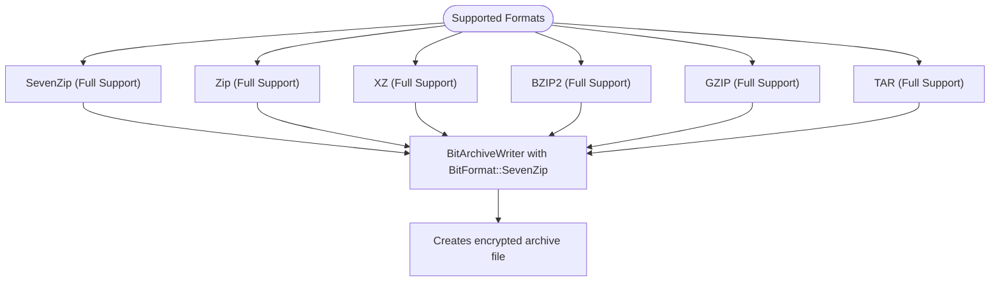
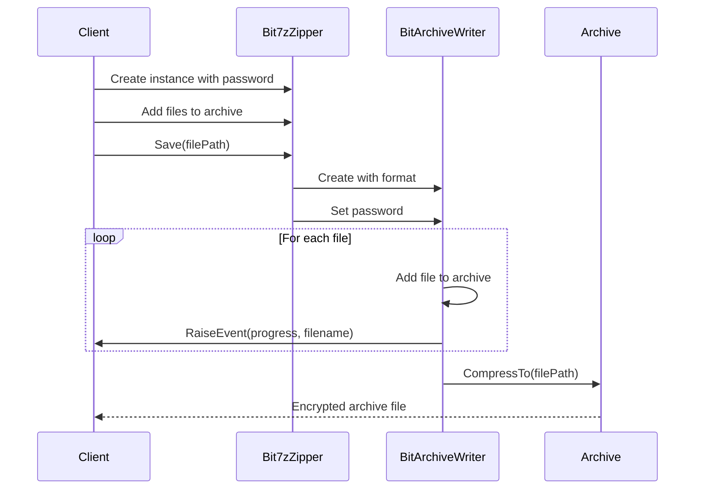
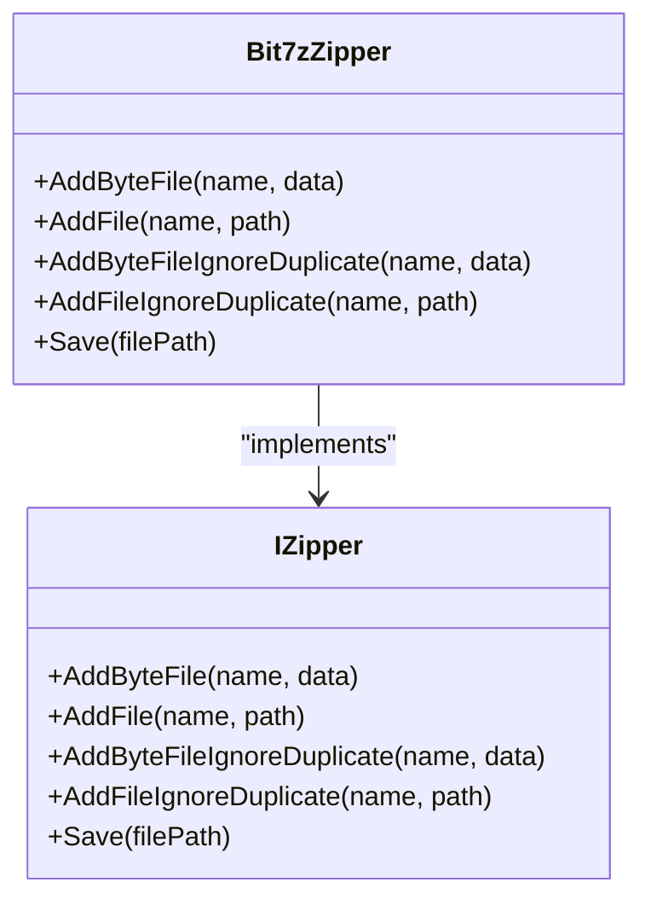
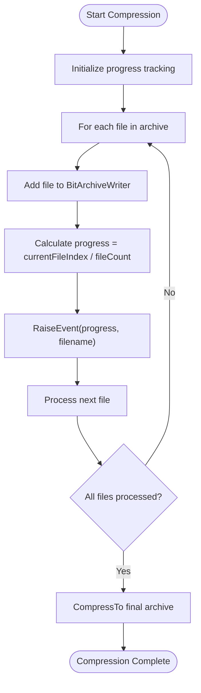
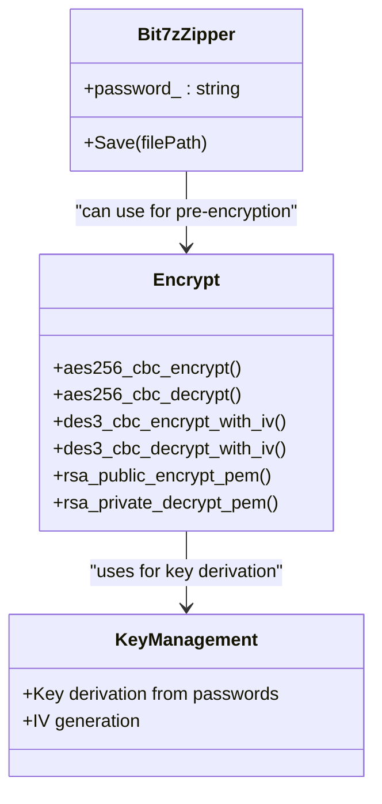
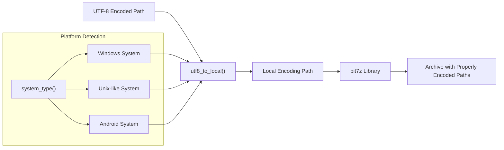
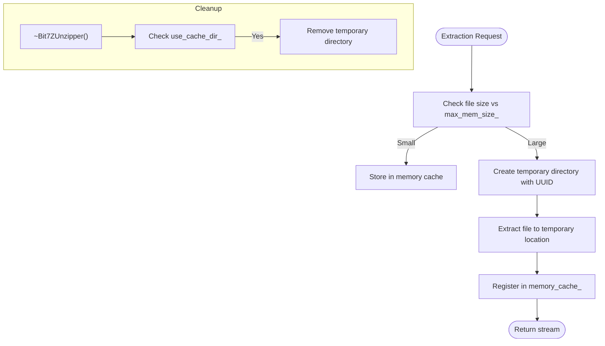

# Secure File Operations

<cite>
**Referenced Files in This Document**   
- [bit7z_zipper.hpp](file://fileoperator/bit7z_zipper.hpp)
- [bit7z_zipper.cpp](file://fileoperator/bit7z_zipper.cpp)
- [bit7z_unzipper.hpp](file://fileoperator/bit7z_unzipper.hpp)
- [bit7z_unzipper.cpp](file://fileoperator/bit7z_unzipper.cpp)
- [encrypt.hpp](file://cipher/encrypt.hpp)
- [encrypt.cpp](file://cipher/encrypt.cpp)
- [encoding_convert.hpp](file://base/encoding_convert.hpp)
- [encoding_convert.cpp](file://base/encoding_convert.cpp)
- [error.hpp](file://base/error.hpp)
- [IZipper.hpp](file://fileoperator/IZipper.hpp)
- [IUnzipper.hpp](file://fileoperator/IUnzipper.hpp)
- [bit7z_def.hpp](file://fileoperator/bit7z_def.hpp)
</cite>

## Table of Contents
1. [Introduction](#introduction)
2. [Bit7zZipper Class Overview](#bit7zzipper-class-overview)
3. [Supported Archive Formats](#supported-archive-formats)
4. [Password-Protected Compression and Extraction](#password-protected-compression-and-extraction)
5. [API for File Operations](#api-for-file-operations)
6. [Progress Reporting Mechanism](#progress-reporting-mechanism)
7. [Integration with Cipher Module](#integration-with-cipher-module)
8. [Cross-Platform Encoding Conversion](#cross-platform-encoding-conversion)
9. [Error Handling](#error-handling)
10. [Secure Temporary File Handling](#secure-temporary-file-handling)
11. [Code Examples](#code-examples)
12. [Conclusion](#conclusion)

## Introduction
The Bit7zZipper class provides a robust solution for secure file operations within the HsBaSlicer application. This documentation details how the class enables password-protected compression and extraction of files using the bit7z library, supporting various archive formats including 7z, ZIP, XZ, BZIP2, GZIP, and TAR. The implementation integrates OpenSSL-based encryption for enhanced security and includes comprehensive error handling through bit7z::BitException. The system also addresses cross-platform compatibility through UTF-8 to local encoding conversion and provides secure temporary file handling practices.

**Section sources**
- [bit7z_zipper.hpp](file://fileoperator/bit7z_zipper.hpp#L1-L74)
- [bit7z_zipper.cpp](file://fileoperator/bit7z_zipper.cpp#L1-L187)

## Bit7zZipper Class Overview
The Bit7zZipper class serves as the primary interface for secure file compression operations in the HsBaSlicer application. As a concrete implementation of the IZipper interface, it provides methods for adding files from memory or disk to an archive, setting passwords for encryption, and saving the compressed archive with progress reporting.

The class is designed with security and flexibility in mind, inheriting from Utils::EventSource to enable progress reporting during compression operations. It maintains a collection of files to be compressed in memory using a map structure that can store either raw byte data or file paths. The class supports multiple archive formats through the ZipperFormat enum and allows configuration of the bit7z DLL path for platform-specific operations.

```mermaid
classDiagram
class Bit7zZipper {
+dll_path_ : string
+format_ : ZipperFormat
+password_ : string
+AddByteFile(name, data)
+AddFile(name, path)
+AddByteFileIgnoreDuplicate(name, data)
+AddFileIgnoreDuplicate(name, path)
+Save(filePath)
}
class IZipper {
+AddByteFile(name, data)
+AddFile(name, path)
+AddByteFileIgnoreDuplicate(name, data)
+AddFileIgnoreDuplicate(name, path)
+Save(filePath)
}
class Utils : : EventSource {
+RaiseEvent(progress, filename)
}
Bit7zZipper --> IZipper : "implements"
Bit7zZipper --> Utils : : EventSource : "inherits"
```

**Diagram sources**
- [bit7z_zipper.hpp](file://fileoperator/bit7z_zipper.hpp#L46-L71)
- [IZipper.hpp](file://fileoperator/IZipper.hpp#L10-L27)

**Section sources**
- [bit7z_zipper.hpp](file://fileoperator/bit7z_zipper.hpp#L46-L71)
- [bit7z_zipper.cpp](file://fileoperator/bit7z_zipper.cpp#L41-L187)

## Supported Archive Formats
The Bit7zZipper class supports a comprehensive range of archive formats through the ZipperFormat enum. The supported formats include:

- **SevenZip**: Full support for compression and extraction
- **Zip**: Full support for compression and extraction
- **XZ**: Full support for compression and extraction
- **BZIP2**: Full support for compression and extraction
- **GZIP**: Full support for compression and extraction
- **TAR**: Full support for compression and extraction

The implementation also recognizes formats that are only supported for extraction (RAR, ISO, Z) but focuses on the core formats that support both compression and extraction operations. The format selection is handled through a switch statement in the Save method, which creates the appropriate BitArchiveWriter instance based on the selected format.



**Diagram sources**
- [bit7z_zipper.hpp](file://fileoperator/bit7z_zipper.hpp#L28-L44)
- [bit7z_zipper.cpp](file://fileoperator/bit7z_zipper.cpp#L110-L151)

**Section sources**
- [bit7z_zipper.hpp](file://fileoperator/bit7z_zipper.hpp#L28-L44)
- [bit7z_zipper.cpp](file://fileoperator/bit7z_zipper.cpp#L110-L151)

## Password-Protected Compression and Extraction
The Bit7zZipper class implements password-based encryption for archive creation, leveraging the bit7z library's built-in encryption capabilities. When a password is provided during the creation of a Bit7zZipper instance or through the password parameter in the constructor, it is used to encrypt the archive contents.

During the compression process, the password is set on the BitArchiveWriter instance before adding files to the archive. This ensures that all files within the archive are encrypted using the specified password. The encryption is applied at the archive level, protecting the entire contents rather than individual files.

For extraction operations, the Bit7zExtract free functions provide the capability to extract password-protected archives. These functions accept a password parameter that is used to decrypt the archive contents during extraction. The implementation handles both file-based extraction to a directory and in-memory extraction to a map of byte buffers.



**Diagram sources**
- [bit7z_zipper.cpp](file://fileoperator/bit7z_zipper.cpp#L163-L183)
- [bit7z_zipper.cpp](file://fileoperator/bit7z_zipper.cpp#L17-L39)

**Section sources**
- [bit7z_zipper.hpp](file://fileoperator/bit7z_zipper.hpp#L49-L51)
- [bit7z_zipper.cpp](file://fileoperator/bit7z_zipper.cpp#L163-L183)
- [bit7z_zipper.cpp](file://fileoperator/bit7z_zipper.cpp#L17-L39)

## API for File Operations
The Bit7zZipper class provides a comprehensive API for adding files to archives from both memory and disk sources. The API is designed to be intuitive and flexible, supporting various use cases for secure file packaging.

The primary methods for adding files include:
- **AddByteFile**: Adds file data from memory as a string or byte vector
- **AddFile**: Adds a file from disk using its path
- **AddByteFileIgnoreDuplicate**: Adds file data with automatic duplicate handling
- **AddFileIgnoreDuplicate**: Adds file from disk with automatic duplicate handling

The class also provides the Save method to write the compressed archive to a specified file path. When adding files, the implementation checks for duplicate names and throws an InvalidArgumentError exception if duplicates are detected, unless using the IgnoreDuplicate variants which automatically append a suffix to duplicate filenames.



**Diagram sources**
- [bit7z_zipper.hpp](file://fileoperator/bit7z_zipper.hpp#L52-L59)
- [IZipper.hpp](file://fileoperator/IZipper.hpp#L14-L18)

**Section sources**
- [bit7z_zipper.hpp](file://fileoperator/bit7z_zipper.hpp#L52-L59)
- [bit7z_zipper.cpp](file://fileoperator/bit7z_zipper.cpp#L41-L103)

## Progress Reporting Mechanism
The Bit7zZipper class implements a progress reporting mechanism through its inheritance from Utils::EventSource. This allows clients to receive real-time updates on the compression progress, including the current file being processed and the overall completion percentage.

During the compression process, the SaveAllFile method iterates through all files to be compressed, calculating the progress as a ratio of the current file index to the total number of files. After adding each file to the archive, the class raises an event with the current progress value and the name of the file just processed. This enables applications to provide user feedback during potentially long-running compression operations.

The event source pattern allows multiple listeners to subscribe to progress updates, making it suitable for both GUI applications that need to update progress bars and logging systems that need to record compression progress.



**Diagram sources**
- [bit7z_zipper.cpp](file://fileoperator/bit7z_zipper.cpp#L160-L183)

**Section sources**
- [bit7z_zipper.hpp](file://fileoperator/bit7z_zipper.hpp#L46)
- [bit7z_zipper.cpp](file://fileoperator/bit7z_zipper.cpp#L160-L183)

## Integration with Cipher Module
The secure file operations in HsBaSlicer are enhanced through integration with the cipher module, which provides cryptographic functions for key management and additional encryption capabilities. While the Bit7zZipper class uses the bit7z library's built-in password-based encryption, the cipher module offers more advanced cryptographic operations that can be used in conjunction with archive operations.

The cipher module's Encrypt class provides various encryption methods including AES-256-CBC, AES-256-ECB, 3DES, and RSA encryption. These can be used to encrypt sensitive data before adding it to an archive, providing an additional layer of security beyond the archive-level password protection.

The integration allows for sophisticated security scenarios, such as encrypting individual files with different keys before packaging them into a password-protected archive, or using RSA encryption to protect encryption keys that are then stored within the archive.



**Diagram sources**
- [bit7z_zipper.hpp](file://fileoperator/bit7z_zipper.hpp#L68)
- [encrypt.hpp](file://cipher/encrypt.hpp#L8-L37)

**Section sources**
- [bit7z_zipper.hpp](file://fileoperator/bit7z_zipper.hpp#L68)
- [encrypt.hpp](file://cipher/encrypt.hpp#L8-L37)
- [encrypt.cpp](file://cipher/encrypt.cpp#L52-L557)

## Cross-Platform Encoding Conversion
The secure file operations system addresses cross-platform compatibility through the use of UTF-8 to local encoding conversion. This is particularly important for file paths and names that may contain non-ASCII characters, ensuring that archives can be created and extracted correctly across different operating systems with varying default encodings.

The encoding_convert module provides functions to convert between UTF-8 and the system's local encoding. The Bit7zZipper class uses the utf8_to_local function to convert file paths from UTF-8 to the local encoding before passing them to the bit7z library. This ensures that file paths are correctly interpreted by the underlying operating system, especially on Windows where the default code page may not support all Unicode characters.

The implementation includes platform-specific handling, with special considerations for Windows systems where the console code page can be set to UTF-8 for improved compatibility. The system also detects the current platform and applies appropriate encoding conversion strategies based on the operating system.



**Diagram sources**
- [bit7z_zipper.cpp](file://fileoperator/bit7z_zipper.cpp#L106)
- [encoding_convert.hpp](file://base/encoding_convert.hpp#L12-L13)
- [encoding_convert.cpp](file://base/encoding_convert.cpp#L35-L53)

**Section sources**
- [bit7z_zipper.cpp](file://fileoperator/bit7z_zipper.cpp#L106)
- [encoding_convert.hpp](file://base/encoding_convert.hpp#L12-L161)
- [encoding_convert.cpp](file://base/encoding_convert.cpp#L1-L130)

## Error Handling
The secure file operations system implements comprehensive error handling through a combination of the bit7z::BitException class and custom exception types defined in the error module. This provides a robust mechanism for handling errors that may occur during compression and extraction operations.

The Bit7zZipper class catches bit7z::BitException exceptions that may be thrown by the underlying bit7z library and converts them to IOError exceptions with descriptive messages. This abstraction layer provides consistent error handling across the application while preserving the detailed error information from the bit7z library.

The error module defines a hierarchy of exception types that inherit from RuntimeError, including specific types for different error conditions such as InvalidArgumentError, IOError, and NotSupportedError. This allows for precise error handling and appropriate user feedback.

```mermaid
classDiagram
class std : : runtime_error
class RuntimeError {
+RuntimeError(msg)
}
class IOError {
+IOError(msg)
}
class InvalidArgumentError {
+InvalidArgumentError(msg)
}
class NotSupportedError {
+NotSupportedError(msg)
}
class bit7z : : BitException
std : : runtime_error <|-- RuntimeError
RuntimeError <|-- IOError
RuntimeError <|-- InvalidArgumentError
RuntimeError <|-- NotSupportedError
bit7z : : BitException --> IOError : "converted to"
```

**Diagram sources**
- [bit7z_zipper.cpp](file://fileoperator/bit7z_zipper.cpp#L153-L157)
- [error.hpp](file://base/error.hpp#L12-L137)

**Section sources**
- [bit7z_zipper.cpp](file://fileoperator/bit7z_zipper.cpp#L153-L157)
- [error.hpp](file://base/error.hpp#L12-L137)

## Secure Temporary File Handling
The secure file operations system includes mechanisms for secure temporary file handling, particularly in the Bit7ZUnzipper class which manages temporary files during archive extraction. When extracting large files that exceed the memory threshold, the system creates temporary files in a uniquely named directory to avoid conflicts and ensure security.

The temporary directory is created using a UUID generated from the archive path, ensuring a unique name that is difficult to predict. The directory is created in the current working directory and is automatically cleaned up when the Bit7ZUnzipper instance is destroyed. This prevents temporary files from remaining on the system after extraction is complete.

The system also includes a memory cache for smaller files, with a configurable maximum memory size (default 1GB) to prevent excessive memory usage. Files smaller than this threshold are kept in memory, while larger files are extracted to temporary files on disk.



**Diagram sources**
- [bit7z_unzipper.cpp](file://fileoperator/bit7z_unzipper.cpp#L47-L64)
- [bit7z_unzipper.cpp](file://fileoperator/bit7z_unzipper.cpp#L8-L21)

**Section sources**
- [bit7z_unzipper.hpp](file://fileoperator/bit7z_unzipper.hpp#L54-L63)
- [bit7z_unzipper.cpp](file://fileoperator/bit7z_unzipper.cpp#L47-L132)

## Code Examples
The following code examples demonstrate how to use the Bit7zZipper class for secure file operations, including packaging sliced model outputs with password protection.

Example 1: Basic archive creation with password protection
```cpp
Bit7zZipper zipper("C:/Program Files/7-Zip/7z.dll", ZipperFormat::SevenZip, "secure_password");
zipper.AddFile("model_slice_1.bin", "output/slice_1.bin");
zipper.AddFile("model_slice_2.bin", "output/slice_2.bin");
zipper.Save("secure_model_package.7z");
```

Example 2: In-memory data compression
```cpp
std::string modelData = getSliceOutputData();
Bit7zZipper zipper(HSBA_7Z_DLL, ZipperFormat::Zip, "password123");
zipper.AddByteFile("processed_model.dat", modelData);
zipper.Save("encrypted_model.zip");
```

Example 3: Progress reporting during compression
```cpp
Bit7zZipper zipper;
zipper += [](double progress, std::string_view filename) {
    std::cout << "Compressing: " << filename << " - " << (progress * 100) << "%\n";
};
// Add files and save...
```

Example 4: Integration with cipher module for additional security
```cpp
// First encrypt sensitive data
auto encryptedData = Encrypt::aes256_cbc_encrypt(rawData, "strong_password");
// Then package in password-protected archive
Bit7zZipper zipper;
zipper.AddByteFile("encrypted_payload.bin", std::string(encryptedData.begin(), encryptedData.end()));
zipper.Save("double_protected.7z");
```

**Section sources**
- [bit7z_zipper.hpp](file://fileoperator/bit7z_zipper.hpp#L49-L51)
- [bit7z_zipper.cpp](file://fileoperator/bit7z_zipper.cpp#L41-L103)
- [encrypt.hpp](file://cipher/encrypt.hpp#L12-L23)

## Conclusion
The Bit7zZipper class provides a comprehensive solution for secure file operations in the HsBaSlicer application, enabling password-protected compression and extraction of files using the bit7z library. The implementation supports multiple archive formats including 7z, ZIP, XZ, BZIP2, GZIP, and TAR, with OpenSSL-based encryption for enhanced security.

The API allows for flexible file operations, supporting both memory and disk-based file sources, with progress reporting for long-running operations. Integration with the cipher module enables advanced security scenarios, while UTF-8 to local encoding conversion ensures cross-platform compatibility.

The system implements robust error handling through bit7z::BitException and provides secure temporary file handling to prevent data leakage. These features make the Bit7zZipper class a reliable component for securely packaging sliced model outputs and other sensitive data within the application.