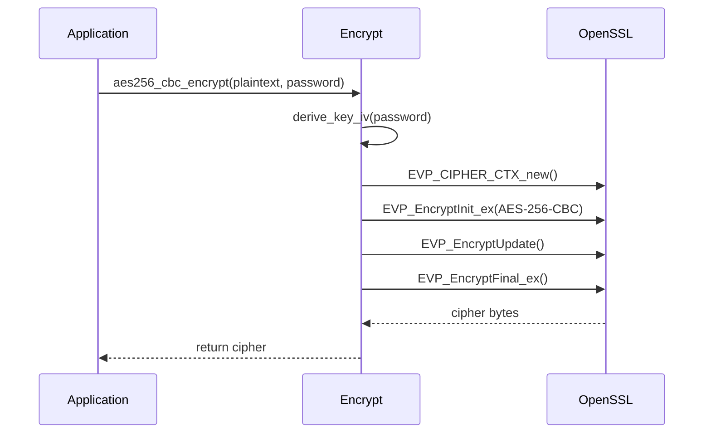
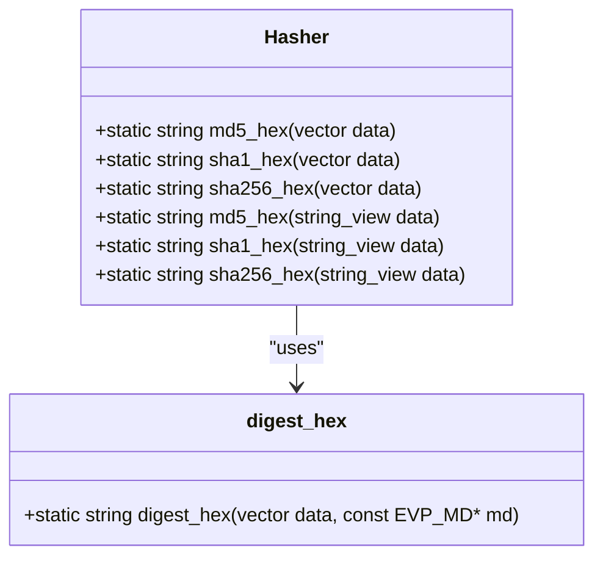
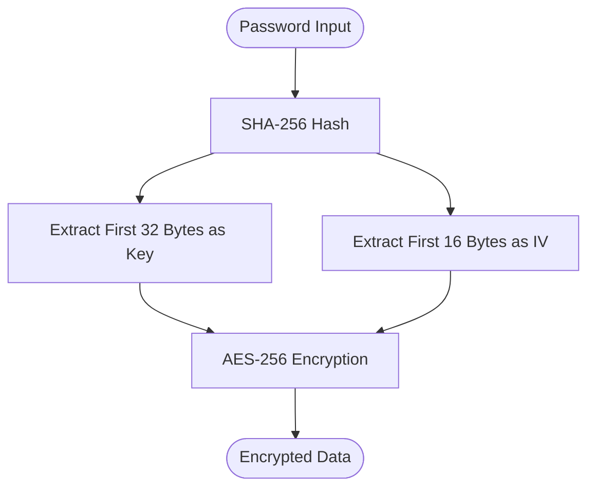
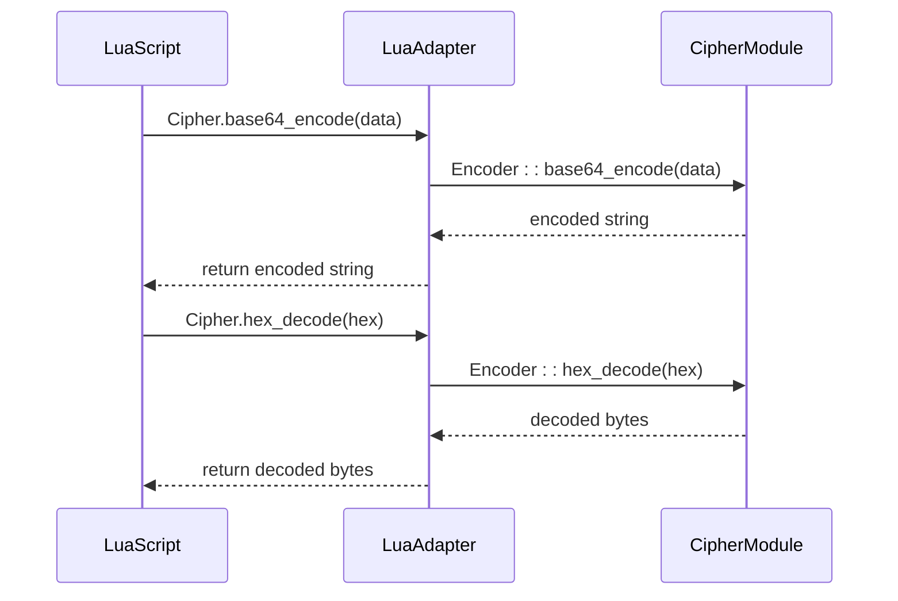
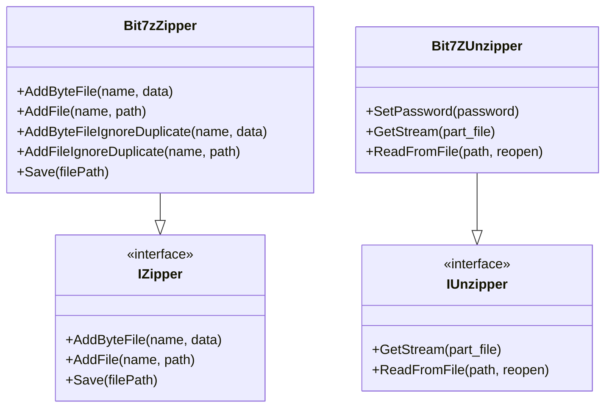

# Security Features

<cite>
**Referenced Files in This Document**   
- [encrypt.cpp](file://cipher/encrypt.cpp)
- [encrypt.hpp](file://cipher/encrypt.hpp)
- [hasher.cpp](file://cipher/hasher.cpp)
- [hasher.hpp](file://cipher/hasher.hpp)
- [encoder.cpp](file://cipher/encoder.cpp)
- [encoder.hpp](file://cipher/encoder.hpp)
- [LuaAdapter.cpp](file://cipher/LuaAdapter.cpp)
- [LuaAdapter.hpp](file://cipher/LuaAdapter.hpp)
- [bit7z_zipper.cpp](file://fileoperator/bit7z_zipper.cpp)
- [bit7z_zipper.hpp](file://fileoperator/bit7z_zipper.hpp)
- [bit7z_unzipper.cpp](file://fileoperator/bit7z_unzipper.cpp)
- [bit7z_unzipper.hpp](file://fileoperator/bit7z_unzipper.hpp)
- [cipher_test.cpp](file://tests/Cipher/cipher_test.cpp)
- [error.hpp](file://base/error.hpp)
</cite>

## Table of Contents
1. [Introduction](#introduction)
2. [Encryption Implementation](#encryption-implementation)
3. [Hashing Implementation](#hashing-implementation)
4. [Key Management and Derivation](#key-management-and-derivation)
5. [Lua Scripting Integration](#lua-scripting-integration)
6. [Secure File Operations](#secure-file-operations)
7. [Security Best Practices](#security-best-practices)
8. [Potential Vulnerabilities](#potential-vulnerabilities)
9. [Intellectual Property Protection](#intellectual-property-protection)
10. [Conclusion](#conclusion)

## Introduction
The HsBaSlicer application implements a comprehensive security framework centered around the cipher module, which provides robust encryption, hashing, and secure data handling capabilities. This security infrastructure is designed to protect proprietary model data and intellectual property through multiple layers of cryptographic protection, secure file operations, and integration with scripting capabilities. The system leverages OpenSSL for cryptographic operations and bit7z for secure compression, creating a complete solution for protecting sensitive data throughout its lifecycle.

**Section sources**
- [encrypt.cpp](file://cipher/encrypt.cpp#L1-L557)
- [hasher.cpp](file://cipher/hasher.cpp#L1-L71)
- [bit7z_zipper.cpp](file://fileoperator/bit7z_zipper.cpp#L1-L187)

## Encryption Implementation

The cipher module implements a comprehensive encryption framework using OpenSSL, supporting multiple symmetric and asymmetric encryption algorithms. The implementation provides both high-level interfaces and low-level cryptographic operations for maximum flexibility in securing data.

### Symmetric Encryption Algorithms
The system supports multiple symmetric encryption algorithms with different modes of operation:

**AES-256 Encryption**
- CBC (Cipher Block Chaining) mode with password-based key derivation
- ECB (Electronic Codebook) mode for password-based encryption
- Support for explicit IV (Initialization Vector) specification
- 256-bit key size providing strong security

**3DES Encryption**
- Triple DES (DES-EDE3) algorithm for legacy compatibility
- ECB and CBC modes available
- 192-bit effective key strength
- 8-byte IV requirement for CBC mode

**Asymmetric RSA Encryption**
- RSA public key encryption using OAEP padding
- PEM format for key representation
- Key pair generation with configurable bit length (default 2048 bits)
- Secure key exchange capabilities

**Diagram sources**
- [encrypt.cpp](file://cipher/encrypt.cpp#L52-L85)
- [encrypt.hpp](file://cipher/encrypt.hpp#L12-L13)

**Section sources**
- [encrypt.cpp](file://cipher/encrypt.cpp#L52-L557)
- [encrypt.hpp](file://cipher/encrypt.hpp#L8-L40)

## Hashing Implementation

The hashing functionality provides secure one-way hash functions for data integrity verification, password storage, and digital signatures. The implementation uses OpenSSL's cryptographic hash functions with a clean, easy-to-use interface.

### Supported Hash Algorithms
The system implements three widely-used cryptographic hash functions:

**MD5**
- 128-bit hash output
- Hexadecimal string representation
- Primarily used for checksums and data integrity

**SHA-1**
- 160-bit hash output
- Hexadecimal string representation
- Transitional algorithm for legacy compatibility

**SHA-256**
- 256-bit hash output
- Hexadecimal string representation
- Recommended for security-critical applications

The Hasher class provides both vector-based and string-based interfaces, with inline methods that automatically convert string views to byte vectors for hashing operations.

**Diagram sources**
- [hasher.cpp](file://cipher/hasher.cpp#L57-L71)
- [hasher.hpp](file://cipher/hasher.hpp#L9-L24)

**Section sources**
- [hasher.cpp](file://cipher/hasher.cpp#L1-L71)
- [hasher.hpp](file://cipher/hasher.hpp#L1-L27)

## Key Management and Derivation

The security framework implements a systematic approach to key management and derivation, ensuring that cryptographic keys are generated and handled securely.

### Password-Based Key Derivation
The system uses a simple but effective key derivation scheme based on SHA-256 hashing:

**AES Key Derivation**
- Password input processed through SHA-256
- First 32 bytes used as encryption key
- First 16 bytes used as initialization vector
- Deterministic derivation for consistent results

**3DES Key Derivation**
- Password input processed through SHA-256
- First 24 bytes used as encryption key (3DES requires 192 bits)
- First 8 bytes used as initialization vector
- Compatible with 3DES block size requirements

The key derivation process is implemented in private helper functions within the Encrypt class, ensuring that the same password always produces the same key and IV combination, which is essential for successful decryption.

**Diagram sources**
- [encrypt.cpp](file://cipher/encrypt.cpp#L19-L29)
- [encrypt.cpp](file://cipher/encrypt.cpp#L31-L40)

**Section sources**
- [encrypt.cpp](file://cipher/encrypt.cpp#L19-L49)
- [encrypt.hpp](file://cipher/encrypt.hpp#L31-L36)

## Lua Scripting Integration

The security features are integrated with Lua scripting capabilities, allowing secure operations to be performed from within Lua scripts. This integration enables automation of security-sensitive operations while maintaining the same level of protection as the native C++ implementation.

### Lua Security API
The Lua adapter exposes the following cryptographic functions:

**Base64 Encoding/Decoding**
- `base64_encode(data)`: Convert binary data to Base64 string
- `base64_decode(data)`: Convert Base64 string to binary data

**Hexadecimal Encoding/Decoding**
- `hex_encode(data)`: Convert binary data to hex string
- `hex_decode(data)`: Convert hex string to binary data

The integration is implemented through the RegisterLuaCipher function, which creates a Lua library table named "Cipher" containing all available security functions. Error handling is properly implemented to propagate C++ exceptions to Lua as error messages.

**Diagram sources**
- [LuaAdapter.cpp](file://cipher/LuaAdapter.cpp#L9-L87)
- [encoder.cpp](file://cipher/encoder.cpp#L25-L82)

**Section sources**
- [LuaAdapter.cpp](file://cipher/LuaAdapter.cpp#L1-L96)
- [LuaAdapter.hpp](file://cipher/LuaAdapter.hpp#L1-L12)
- [encoder.cpp](file://cipher/encoder.cpp#L1-L108)
- [encoder.hpp](file://cipher/encoder.hpp#L1-L35)

## Secure File Operations

The file operator module implements secure file operations with password-protected compression and encryption, providing an additional layer of protection for sensitive data at rest.

### ZIP Compression with bit7z
The system uses the bit7z library to provide comprehensive compression and archiving capabilities:

**Supported Formats**
- 7-Zip (SevenZip)
- ZIP
- XZ
- BZIP2
- GZIP
- TAR

**Security Features**
- Password protection for archives
- Multiple compression algorithms
- Memory-efficient streaming operations
- Progress reporting during operations

**Implementation Details**
- Bit7zZipper class implements the IZipper interface
- Bit7zUnzipper class implements the IUnzipper interface
- Support for both file-based and memory-based operations
- Automatic temporary directory management
- Memory caching for frequently accessed files

**Diagram sources**
- [bit7z_zipper.hpp](file://fileoperator/bit7z_zipper.hpp#L46-L74)
- [bit7z_unzipper.hpp](file://fileoperator/bit7z_unzipper.hpp#L20-L72)

**Section sources**
- [bit7z_zipper.cpp](file://fileoperator/bit7z_zipper.cpp#L1-L187)
- [bit7z_zipper.hpp](file://fileoperator/bit7z_zipper.hpp#L1-L74)
- [bit7z_unzipper.cpp](file://fileoperator/bit7z_unzipper.cpp#L1-L132)
- [bit7z_unzipper.hpp](file://fileoperator/bit7z_unzipper.hpp#L1-L72)

## Security Best Practices

The implementation follows several security best practices to ensure the robustness and reliability of the cryptographic operations.

### Error Handling
The system implements comprehensive error handling using a custom exception hierarchy:

**Exception Types**
- RuntimeError: General runtime errors
- InvalidArgumentError: Invalid input parameters
- IOError: Input/output operations failures
- NotSupportedError: Unsupported operations or formats

All OpenSSL operations are wrapped in try-catch blocks that convert low-level OpenSSL errors into meaningful exception messages, making debugging and troubleshooting easier.

### Memory Management
The implementation follows secure memory management practices:

**Automatic Resource Management**
- RAII (Resource Acquisition Is Initialization) principles
- Smart pointers for dynamic memory
- Automatic cleanup of OpenSSL contexts
- Proper deallocation of cryptographic objects

**Secure Data Handling**
- Use of std::vector<unsigned char> for binary data
- Minimization of raw pointer usage
- Proper cleanup of sensitive data
- Prevention of memory leaks

### Cryptographic Standards
The system adheres to established cryptographic standards:

**Algorithm Selection**
- AES-256 for symmetric encryption (industry standard)
- RSA with OAEP padding for asymmetric encryption
- SHA-256 for hashing (preferred over MD5 and SHA-1)
- PKCS#1 OAEP padding for RSA operations

**Mode of Operations**
- CBC mode for AES (with proper IV handling)
- OAEP padding for RSA (resistant to chosen ciphertext attacks)
- Explicit IV support for deterministic operations

**Section sources**
- [encrypt.cpp](file://cipher/encrypt.cpp#L42-L49)
- [error.hpp](file://base/error.hpp#L1-L139)
- [cipher_test.cpp](file://tests/Cipher/cipher_test.cpp#L66-L149)

## Potential Vulnerabilities

While the implementation follows many security best practices, there are potential vulnerabilities that should be considered:

### Key Derivation Weakness
The current key derivation scheme uses a simple SHA-256 hash of the password without:
- Salt to prevent rainbow table attacks
- Iterations to slow down brute force attacks
- Memory-hard functions to resist GPU-based attacks

This makes the system potentially vulnerable to password cracking attacks, especially if weak passwords are used.

### Algorithm Deprecation
The implementation includes:
- MD5 hashing (considered cryptographically broken)
- SHA-1 hashing (deprecated for security applications)
- ECB mode encryption (vulnerable to pattern analysis)

These algorithms should be used only for backward compatibility and not for new security-critical applications.

### Memory Security
Potential issues include:
- Sensitive data (keys, passwords) stored in memory without explicit zeroization
- Lack of memory locking to prevent swapping to disk
- No protection against memory dump attacks

### Dependency Risks
The system relies on:
- OpenSSL (potential for undiscovered vulnerabilities)
- bit7z (third-party compression library)
- Lua (scripting engine with potential injection risks)

**Section sources**
- [encrypt.cpp](file://cipher/encrypt.cpp#L19-L40)
- [hasher.cpp](file://cipher/hasher.cpp#L57-L71)
- [encrypt.cpp](file://cipher/encrypt.cpp#L126-L160)

## Intellectual Property Protection

The security features are specifically designed to protect proprietary model data and intellectual property in the HsBaSlicer application.

### Data Protection Strategy
The system implements a multi-layered approach to IP protection:

**Encryption of Model Data**
- 3D model files encrypted with AES-256
- Password protection for design files
- Secure storage of proprietary algorithms

**Access Control**
- Password-protected archives
- Script-based access to sensitive operations
- Controlled decryption capabilities

**Distribution Security**
- Encrypted file formats for sharing
- Digital rights management through encryption
- Prevention of unauthorized modification

### Workflow Integration
The security features are integrated into the core workflow:

**Design Phase**
- Secure storage of design parameters
- Protection of custom algorithms
- Encryption of configuration files

**Production Phase**
- Secure transmission of model data
- Protection of manufacturing instructions
- Controlled access to production files

**Collaboration**
- Secure sharing of design files
- Password-protected collaboration packages
- Audit trail through cryptographic hashing

**Section sources**
- [encrypt.cpp](file://cipher/encrypt.cpp#L52-L557)
- [bit7z_zipper.cpp](file://fileoperator/bit7z_zipper.cpp#L1-L187)
- [cipher_test.cpp](file://tests/Cipher/cipher_test.cpp#L80-L139)

## Conclusion
The HsBaSlicer security framework provides a comprehensive set of cryptographic tools for protecting intellectual property and sensitive data. The implementation leverages OpenSSL for robust encryption and hashing capabilities, with a clean, well-documented API that can be used from both C++ and Lua. The integration with bit7z provides secure compression and archiving with password protection, creating a complete solution for data security.

While the system follows many security best practices, there are opportunities for improvement, particularly in the areas of key derivation and the use of deprecated cryptographic algorithms. Future enhancements could include:
- Implementation of PBKDF2 or Argon2 for key derivation
- Deprecation of MD5 and SHA-1 in favor of SHA-256
- Addition of salt and iteration count to password-based key derivation
- Implementation of secure memory handling for sensitive data

The current implementation provides a solid foundation for protecting proprietary model data and intellectual property, with extensible architecture that can accommodate future security enhancements.

**Section sources**
- [encrypt.cpp](file://cipher/encrypt.cpp#L1-L557)
- [hasher.cpp](file://cipher/hasher.cpp#L1-L71)
- [bit7z_zipper.cpp](file://fileoperator/bit7z_zipper.cpp#L1-L187)
- [cipher_test.cpp](file://tests/Cipher/cipher_test.cpp#L1-L150)