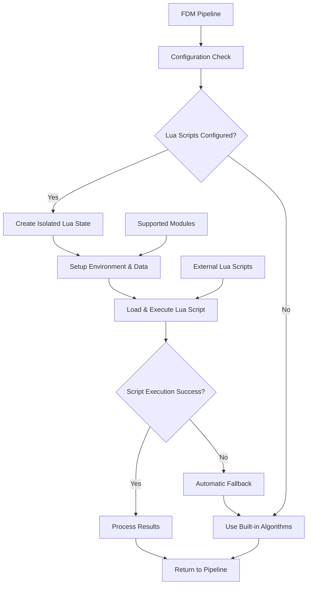
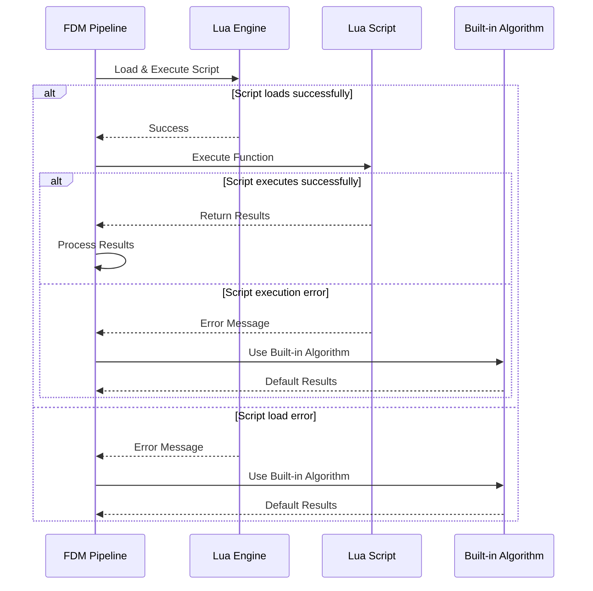

# Lua Scripted Slicing

<cite>
**Referenced Files in This Document**   
- [fdm_pipeline.h](file://DllHsBaSlicer/fdm_pipeline.h)
- [fdm_pipeline.cpp](file://DllHsBaSlicer/fdm_pipeline.cpp)
- [LuaSupport.hpp](file://support/LuaSupport.hpp)
- [LuaSupport.cpp](file://support/LuaSupport.cpp)
- [LuaAdapter.hpp](file://support/LuaAdapter.hpp)
- [LuaAdapter.cpp](file://support/LuaAdapter.cpp)
- [PolygonFill.hpp](file://2D/PolygonFill.hpp)
- [PolygonFill.cpp](file://2D/PolygonFill.cpp)
- [my_support.lua](file://samples/FDM/scripts/my_support.lua)
- [my_infill.lua](file://samples/FDM/scripts/my_infill.lua)
- [custom_fill.lua](file://tests/PolygonFill/custom_fill.lua)
- [main.cpp](file://samples/FDM/main.cpp)
- [base/error.hpp](file://base/error.hpp)
</cite>

## Update Summary
**Changes Made**   
- Updated Core Components section to include new FDM pipeline Lua scripting integration
- Added comprehensive coverage of custom support generation with `support_lua_script` and `support_lua_func`
- Added detailed documentation for custom infill patterns with `infill_lua_script` and `infill_lua_func`
- Enhanced Architecture Overview to show complete FDM pipeline integration
- Updated Lua Scripting Integration section with new support and infill modules
- Added robust error handling and automatic fallback mechanisms
- Included complete examples from sample scripts showing advanced features

## Table of Contents
1. [Introduction](#introduction)
2. [Core Components](#core-components)
3. [Architecture Overview](#architecture-overview)
4. [Detailed Component Analysis](#detailed-component-analysis)
5. [Lua Scripting Integration](#lua-scripting-integration)
6. [Error Handling and Fallback Mechanisms](#error-handling-and-fallback-mechanisms)
7. [Security Considerations](#security-considerations)
8. [Example: Custom Support Generation](#example-custom-support-generation)
9. [Example: Custom Infill Pattern](#example-custom-infill-pattern)
10. [Conclusion](#conclusion)

## Introduction
Lua Scripted Slicing enables users to customize slicing behavior in HsBaSlicer through Lua scripts, providing comprehensive support for both custom support generation and infill patterns within the FDM pipeline. This system allows for dynamic modification of slicing operations by leveraging the flexibility of the Lua scripting language. The core functionality is integrated directly into the FDM pipeline, supporting two primary customization points: custom support structures (`support_lua_script`, `support_lua_func`) and custom infill patterns (`infill_lua_script`, `infill_lua_func`). The integration between C++ and Lua is facilitated by robust adapter systems that handle data type marshaling, function registration, and comprehensive error handling with automatic fallback to built-in algorithms.

## Core Components
The Lua Scripted Slicing system consists of several key components that work together to enable comprehensive customization within the FDM pipeline. The `FDM Pipeline` serves as the primary orchestrator, providing configuration options for Lua script execution during support generation and infill pattern creation. The `LuaSupport` class handles custom support generation with full access to polygon operations and built-in support generators. The `PolygonFill` module provides utility functions for custom infill patterns through `LuaCustomFill` and `LuaCustomFillString` methods. The `LuaAdapter` classes handle the conversion between C++ data structures and Lua tables, ensuring seamless data exchange. Together, these components form a cohesive system that allows for extensive customization while maintaining robust error handling and automatic fallback capabilities.

**Section sources**
- [fdm_pipeline.h:70-74](file://DllHsBaSlicer/fdm_pipeline.h#L70-L74)
- [LuaSupport.hpp:40-69](file://support/LuaSupport.hpp#L40-L69)
- [PolygonFill.hpp:102-126](file://2D/PolygonFill.hpp#L102-L126)
- [LuaAdapter.hpp:9-26](file://support/LuaAdapter.hpp#L9-L26)

## Architecture Overview
The Lua Scripted Slicing architecture follows a clear separation of concerns between the C++ FDM pipeline core and the Lua scripting environment. When a slicing operation is initiated with Lua scripts, the system creates isolated Lua states for each script execution, populating them with necessary mesh data and available functions. The scripts are executed within their own contexts, and results are returned to the C++ code for further processing. This architecture ensures that each script execution is isolated and does not interfere with other operations, while providing comprehensive error handling with automatic fallback to built-in algorithms when scripts fail.



**Diagram sources**
- [fdm_pipeline.cpp:253-327](file://DllHsBaSlicer/fdm_pipeline.cpp#L253-L327)
- [LuaSupport.cpp:103-160](file://support/LuaSupport.cpp#L103-L160)
- [PolygonFill.cpp:1272-1359](file://2D/PolygonFill.cpp#L1272-L1359)

## Detailed Component Analysis

### FDM Pipeline Lua Configuration
The FDM pipeline provides four key configuration fields for Lua scripting integration: `support_lua_script`, `support_lua_func`, `infill_lua_script`, and `infill_lua_func`. These fields allow users to specify custom Lua scripts for support generation and infill patterns, along with the function names to execute within those scripts. When configured, the pipeline automatically integrates these custom behaviors into the standard slicing workflow.

**Section sources**
- [fdm_pipeline.h:70-74](file://DllHsBaSlicer/fdm_pipeline.h#L70-L74)
- [fdm_pipeline.cpp:258-327](file://DllHsBaSlicer/fdm_pipeline.cpp#L258-L327)

### LuaSupport Class for Custom Support Generation
The `LuaSupport` class provides comprehensive support for custom support generation through Lua scripts. It supports three construction methods: inline script strings, script files, and function name specification. The class manages the complete lifecycle of Lua script execution, including environment setup, data marshaling, and result retrieval. It exposes a rich API including polygon operations, built-in support generators (plane, tree, honeycomb, SLA), overhang detection, and configuration management.

**Section sources**
- [LuaSupport.hpp:40-69](file://support/LuaSupport.hpp#L40-L69)
- [LuaSupport.cpp:88-160](file://support/LuaSupport.cpp#L88-L160)

### PolygonFill Lua Integration for Custom Infill Patterns
The `PolygonFill` module provides two main functions for custom infill pattern generation: `LuaCustomFill` for file-based scripts and `LuaCustomFillString` for inline scripts. These functions create isolated Lua environments with access to polygon operations, fill algorithms, and geometric utilities. They handle the complete process of script loading, execution, and result conversion back to C++ polygon data structures.

**Section sources**
- [PolygonFill.hpp:102-126](file://2D/PolygonFill.hpp#L102-L126)
- [PolygonFill.cpp:1272-1375](file://2D/PolygonFill.cpp#L1272-L1375)

### Data Type Marshaling and Module Registration
The `LuaAdapter` classes handle bidirectional conversion between C++ data structures and Lua tables. For support generation, they convert `PolygonsD` objects to/from Lua tables, while also registering the comprehensive `Support` module with all its functions. For infill patterns, they register polygon operations and fill functions accessible from Lua scripts. The adapters ensure type safety and provide meaningful error messages when conversions fail.

**Section sources**
- [LuaAdapter.cpp:38-85](file://support/LuaAdapter.cpp#L38-L85)
- [LuaAdapter.cpp:238-249](file://support/LuaAdapter.cpp#L238-L249)

## Lua Scripting Integration

### Support Generation Integration
The FDM pipeline integrates custom support generation at stage 3 of the slicing process. When `support_lua_script` is configured, the pipeline reads the script file content and creates a `LuaSupport` instance with the specified function name. The script receives global variables including `current_layer`, `prev_layer`, `layer_height`, and `config`, along with access to the complete `Support` module for using built-in generators and polygon operations.

**Section sources**
- [fdm_pipeline.cpp:258-272](file://DllHsBaSlicer/fdm_pipeline.cpp#L258-L272)
- [LuaSupport.cpp:62-85](file://support/LuaSupport.cpp#L62-L85)

### Infill Pattern Integration
Custom infill patterns are integrated at stage 4 of the pipeline, specifically for middle layers (non-solid layers). When `infill_lua_script` is configured, the pipeline calls `LuaCustomFill` for each layer's outline polygons. The script receives `current_layer`, `layer_index`, `layer_height`, and `config` as global variables, with access to polygon operations and fill functions through the `PolygonOperations` and `PolygonFill` modules.

**Section sources**
- [fdm_pipeline.cpp:287-327](file://DllHsBaSlicer/fdm_pipeline.cpp#L287-L327)
- [PolygonFill.cpp:1272-1295](file://2D/PolygonFill.cpp#L1272-L1295)

### Available Global Variables and Functions
Both support and infill scripts have access to comprehensive global variables and functions:

**Support Scripts:**
- `current_layer`: Current layer polygons `{ { {x=..,y=..}, ... }, ... }`
- `prev_layer`: Previous layer polygons (empty for first layer)
- `layer_height`: Layer height in mm
- `config`: Support configuration table with all parameters
- `Support` module: Complete support generation API

**Infill Scripts:**
- `current_layer`: Current layer polygons (wall area already excluded)
- `layer_index`: Current layer index (starting from 0)
- `layer_height`: Layer height in mm
- `config`: Fill configuration table with spacing, mode, angle, etc.
- `PolygonOperations`: Boolean operations and geometric functions
- `PolygonFill`: Fill algorithm functions

**Section sources**
- [my_support.lua:4-27](file://samples/FDM/scripts/my_support.lua#L4-L27)
- [my_infill.lua:4-16](file://samples/FDM/scripts/my_infill.lua#L4-L16)

## Error Handling and Fallback Mechanisms
The Lua Scripted Slicing system implements comprehensive error handling with automatic fallback to built-in algorithms. When a Lua script fails to compile or execute, the system throws a `RuntimeError` with detailed error messages. For support generation, if the Lua script fails, the pipeline automatically falls back to the built-in `GenerateAllFdmSupport` algorithm. Similarly, for infill patterns, if the Lua script fails, the pipeline uses the standard `FillWithBorder` algorithm instead.



**Diagram sources**
- [LuaSupport.cpp:123-157](file://support/LuaSupport.cpp#L123-L157)
- [fdm_pipeline.cpp:357-361](file://DllHsBaSlicer/fdm_pipeline.cpp#L357-L361)

**Section sources**
- [LuaSupport.cpp:123-157](file://support/LuaSupport.cpp#L123-L157)
- [fdm_pipeline.cpp:357-361](file://DllHsBaSlicer/fdm_pipeline.cpp#L357-L361)
- [base/error.hpp:12-19](file://base/error.hpp#L12-L19)

## Security Considerations
When loading external Lua scripts, security considerations are paramount. Each script execution occurs in an isolated Lua state created by `MakeUniqueLuaState`, preventing one script from affecting another. The system restricts available Lua libraries to only essential ones loaded via `luaL_openlibs`, limiting access to system resources. Scripts should be validated before execution, and sandboxing can be achieved by restricting the available Lua libraries and functions. The use of separate Lua states provides natural isolation, preventing malicious code from accessing sensitive system resources or interfering with other operations.

**Section sources**
- [LuaSupport.cpp:106-110](file://support/LuaSupport.cpp#L106-L110)
- [PolygonFill.cpp:1280-1289](file://2D/PolygonFill.cpp#L1280-L1289)

## Example: Custom Support Generation
The following example demonstrates how to create a custom support generation script using the comprehensive `Support` module. This script uses built-in overhang detection and multiple support generator types to create intelligent support structures.

```lua
-- my_support.lua - Advanced custom support generation
local PO = PolygonOperations

function generate_support()
    -- First layer doesn't need support
    if #prev_layer == 0 then
        return {}
    end

    -- Detect overhang regions using built-in detector
    local overhang_angle = config.overhang_angle_threshold or 45.0
    local overhang_regions = Support.detect_overhang(
        current_layer, prev_layer, layer_height, overhang_angle)

    if #overhang_regions == 0 then
        return {}
    end

    -- Select support generator based on configuration
    local generator
    local pattern = config.support_pattern or 0
    if pattern == 0 then
        generator = Support.new_plane()
    elseif pattern == 1 then
        generator = Support.new_tree()
    elseif pattern == 2 then
        generator = Support.new_honeycomb()
    else
        generator = Support.new_plane()
    end

    -- Generate support with custom configuration
    local support_cfg = Support.default_config()
    support_cfg.overhang_angle_threshold = overhang_angle
    support_cfg.layer_height = layer_height
    support_cfg.support_gap = config.support_gap or 0.5
    support_cfg.support_diameter = config.support_diameter or 2.0
    support_cfg.support_density = config.support_density or 0.5

    local result = Support.generate(
        generator, current_layer, prev_layer, layer_height, support_cfg)

    -- Optional refinement: shrink support contact points
    local refined = PO.offsetOperation(result, -0.1)
    return refined
end

return generate_support()
```

This script demonstrates advanced features including overhang detection, multiple support generator selection, configuration management, and post-processing operations.

**Section sources**
- [my_support.lua:1-83](file://samples/FDM/scripts/my_support.lua#L1-L83)
- [LuaAdapter.cpp:226-235](file://support/LuaAdapter.cpp#L226-L235)

## Example: Custom Infill Pattern
The following example shows a sophisticated custom infill pattern that generates rotating parallel lines with adaptive density based on layer geometry. This script demonstrates complex geometric calculations and efficient polygon operations.

```lua
-- my_infill.lua - Advanced rotating infill pattern
local PO = PolygonOperations

function generate_fill()
    if #current_layer == 0 then
        return {}
    end

    local spacing = config.fill_spacing or 0.4
    local angle = config.fill_angle or 45.0

    -- Calculate layer-specific rotation for uniform mechanical properties
    local layer_angle = angle + (layer_index % 6) * 60.0
    local rad = layer_angle * math.pi / 180.0

    -- Compute bounding box of current layer
    local min_x, min_y = math.huge, math.huge
    local max_x, max_y = -math.huge, -math.huge

    for _, poly in ipairs(current_layer) do
        for _, pt in ipairs(poly) do
            if pt.x < min_x then min_x = pt.x end
            if pt.y < min_y then min_y = pt.y end
            if pt.x > max_x then max_x = pt.x end
            if pt.y > max_y then max_y = pt.y end
        end
    end

    -- Create expanded scan area for complete coverage
    local margin = math.max(max_x - min_x, max_y - min_y) * 0.5
    local center_x = (min_x + max_x) / 2
    local center_y = (min_y + max_y) / 2
    local extent = math.max(max_x - min_x, max_y - min_y) / 2 + margin

    -- Generate parallel lines at calculated angle
    local fill_lines = {}
    local cos_a = math.cos(rad)
    local sin_a = math.sin(rad)
    local line_count = math.ceil(extent * 2 / spacing)
    local half_count = math.floor(line_count / 2)

    for i = -half_count, half_count do
        local offset = i * spacing
        local perp_x = -sin_a * offset
        local perp_y = cos_a * offset

        local x1 = center_x + perp_x - cos_a * extent
        local y1 = center_y + perp_y - sin_a * extent
        local x2 = center_x + perp_x + cos_a * extent
        local y2 = center_y + perp_y + sin_a * extent

        -- Create thin rectangle representing each line
        local half_w = spacing * 0.15
        local nx = -sin_a * half_w
        local ny = cos_a * half_w

        local line = {
            { x = x1 + nx, y = y1 + ny },
            { x = x2 + nx, y = y2 + ny },
            { x = x2 - nx, y = y2 - ny },
            { x = x1 - nx, y = y1 - ny },
        }
        table.insert(fill_lines, line)
    end

    -- Intersect with current layer boundary for precise filling
    local result = PO.intersection(fill_lines, current_layer)
    return result
end

return generate_fill()
```

This script showcases advanced geometric calculations, efficient line generation, and precise boundary intersection for optimal infill patterns.

**Section sources**
- [my_infill.lua:1-92](file://samples/FDM/scripts/my_infill.lua#L1-L92)
- [PolygonFill.cpp:1272-1359](file://2D/PolygonFill.cpp#L1272-L1359)

## Conclusion
Lua Scripted Slicing provides a powerful and comprehensive mechanism for customizing the FDM slicing process in HsBaSlicer. With integrated support for both custom support generation and infill patterns, users can create sophisticated slicing behaviors that would be difficult or impossible to achieve with static configuration. The system's robust error handling with automatic fallback mechanisms ensures reliable operation, while the modular architecture provides extensive customization possibilities. Through the `support_lua_script`, `support_lua_func`, `infill_lua_script`, and `infill_lua_func` configuration options, combined with comprehensive Lua APIs for polygon operations and built-in algorithms, Lua Scripted Slicing opens up new possibilities for advanced 3D printing applications with intelligent, adaptive slicing strategies.