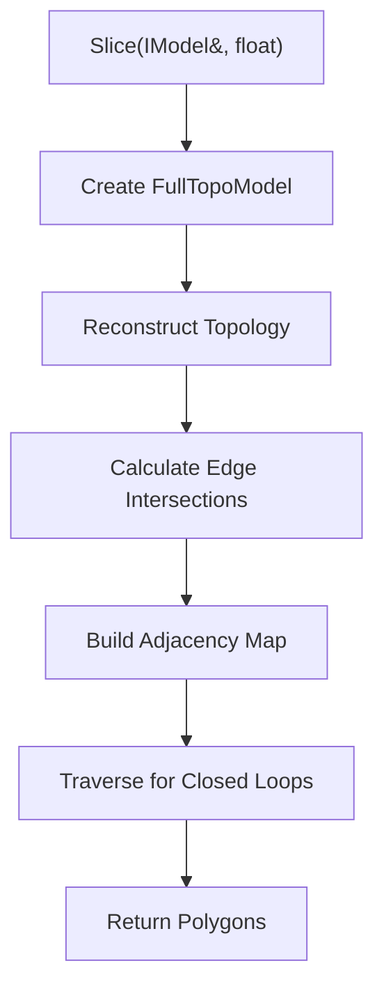
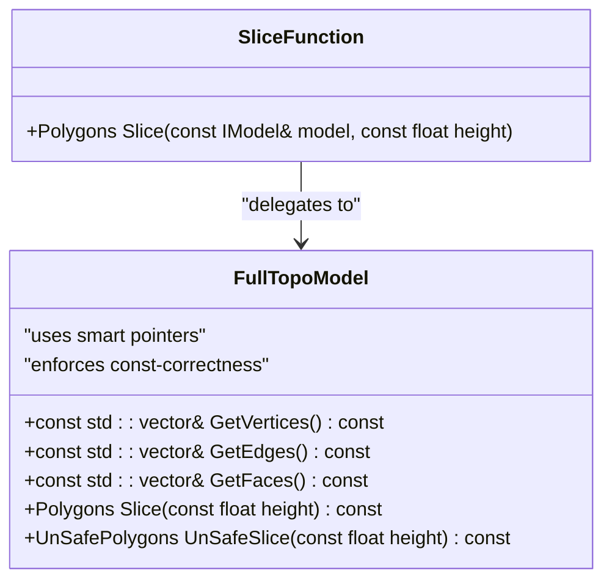
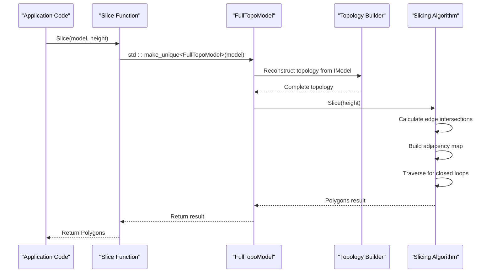

# Safe Slicing

<cite>
**Referenced Files in This Document**   
- [mesh_slice.cpp](file://LibHsBaSlicer/Slice/mesh_slice.cpp)
- [mesh_slice.hpp](file://LibHsBaSlicer/Slice/mesh_slice.hpp)
- [FullTopoModel.hpp](file://meshmodel/FullTopoModel.hpp)
- [FullTopoModel.cpp](file://meshmodel/FullTopoModel.cpp)
- [IModel.hpp](file://base/IModel.hpp)
- [IntPolygon.hpp](file://2D/IntPolygon.hpp)
- [FloatPolygons.hpp](file://2D/FloatPolygons.hpp)
- [full_topo_model_test.cpp](file://tests/Models/full_topo_model_test.cpp)
</cite>

## Table of Contents
1. [Introduction](#introduction)
2. [Core Implementation](#core-implementation)
3. [Memory Safety Mechanisms](#memory-safety-mechanisms)
4. [Polygons Return Type and Thread Safety](#polygons-return-type-and-thread-safety)
5. [Call Flow Example](#call-flow-example)
6. [Use Cases in Production Environments](#use-cases-in-production-environments)
7. [Performance Considerations](#performance-considerations)
8. [Safe vs Unsafe Slicing Comparison](#safe-vs-unsafe-slicing-comparison)
9. [Conclusion](#conclusion)

## Introduction
The Safe Slicing feature provides a robust and memory-safe approach to 3D model slicing operations in the HsBaSlicer system. This documentation details the implementation of the Slice function that operates on 3D models, ensuring data integrity through smart pointers and const-correctness. The feature is designed for production environments where reliability and data integrity are paramount, particularly in manufacturing and industrial applications where slicing errors could lead to significant material waste or safety issues.

**Section sources**
- [mesh_slice.cpp](file://LibHsBaSlicer/Slice/mesh_slice.cpp#L1-L28)
- [FullTopoModel.hpp](file://meshmodel/FullTopoModel.hpp#L1-L119)

## Core Implementation
The Safe Slicing implementation follows a clear architectural pattern where the slicing operation is delegated from a high-level interface to a specialized model class. The `Slice` function in `mesh_slice.cpp` serves as the entry point, taking an `IModel` reference and a slicing height as parameters. This function creates a `FullTopoModel` instance through a smart pointer and delegates the actual slicing operation to this model.

The implementation constructs a `FullTopoModel` by passing the input `IModel` to its constructor, which performs complete topological reconstruction of the mesh. This reconstruction process establishes vertex, edge, and face relationships that are essential for accurate slicing operations. The `FullTopoModel` class maintains these relationships in its private data structures, ensuring that subsequent slicing operations can efficiently traverse the mesh topology.

The slicing algorithm itself operates by intersecting the Z-direction plane at the specified height with the triangular faces of the mesh. For each face, it calculates intersection points with its edges and builds an adjacency map of these intersection points. The algorithm then traverses this adjacency structure to form closed loops, which represent the final polygonal slices. Only closed contours are included in the result, as open or incomplete contours are discarded to maintain geometric integrity.

**Diagram sources**
- [mesh_slice.cpp](file://LibHsBaSlicer/Slice/mesh_slice.cpp#L5-L9)
- [FullTopoModel.cpp](file://meshmodel/FullTopoModel.cpp#L256-L342)

**Section sources**
- [mesh_slice.cpp](file://LibHsBaSlicer/Slice/mesh_slice.cpp#L1-L28)
- [FullTopoModel.cpp](file://meshmodel/FullTopoModel.cpp#L19-L143)
- [FullTopoModel.cpp](file://meshmodel/FullTopoModel.cpp#L256-L342)

## Memory Safety Mechanisms
The Safe Slicing implementation employs multiple memory safety mechanisms to prevent common programming errors and ensure reliable operation. The primary mechanism is the use of smart pointers, specifically `std::unique_ptr`, which manages the lifetime of the `FullTopoModel` instance. This ensures automatic cleanup of resources when the slicing operation completes, preventing memory leaks even in the presence of exceptions.

Const-correctness is rigorously enforced throughout the implementation. The `Slice` method in `FullTopoModel` is declared as `const`, indicating that it does not modify the internal state of the model. This allows the method to be safely called on const instances and enables compiler optimizations. The input `IModel` parameter is also passed as a const reference, preventing accidental modifications to the source model during the slicing process.

The implementation avoids raw pointer arithmetic and instead uses standard container types with bounds checking. The `FullTopoModel` constructor performs validation on vertex indices to ensure they are within valid ranges before establishing topological relationships. This prevents out-of-bounds access that could lead to undefined behavior.

Additionally, the code uses RAII (Resource Acquisition Is Initialization) principles for managing external resources. When Lua scripting is involved in custom slicing operations, the `MakeUniqueLuaState` function returns a smart pointer that automatically cleans up the Lua state, ensuring that resources are properly released regardless of how the function exits.

**Diagram sources**
- [mesh_slice.cpp](file://LibHsBaSlicer/Slice/mesh_slice.cpp#L7-L8)
- [FullTopoModel.hpp](file://meshmodel/FullTopoModel.hpp#L93-L95)
- [FullTopoModel.cpp](file://meshmodel/FullTopoModel.cpp#L19-L20)

**Section sources**
- [mesh_slice.cpp](file://LibHsBaSlicer/Slice/mesh_slice.cpp#L7-L8)
- [FullTopoModel.hpp](file://meshmodel/FullTopoModel.hpp#L63-L65)
- [FullTopoModel.cpp](file://meshmodel/FullTopoModel.cpp#L19-L143)

## Polygons Return Type and Thread Safety
The `Polygons` return type is defined as `Clipper2Lib::Paths64`, a container of 64-bit integer coordinate paths from the Clipper2 library. This type represents a collection of closed polygonal contours resulting from the slicing operation. Each polygon is represented as a sequence of integerized 2D points, where coordinates are scaled by a factor of 1e6 to maintain precision while using integer arithmetic.

The thread safety guarantees of the Safe Slicing feature are derived from its functional design. Since the `Slice` function takes a const reference to the input model and returns a completely independent data structure, it can be safely called from multiple threads simultaneously as long as each thread has its own input model or the input model is not modified during slicing operations. The function does not rely on any shared mutable state, making it inherently thread-safe for concurrent read operations.

The integerization process ensures consistent and deterministic results across different execution contexts. By converting floating-point coordinates to fixed-point integers, the algorithm eliminates floating-point precision issues that could lead to inconsistent results in multi-threaded environments. This is particularly important in production settings where reproducible slicing results are critical for quality control.

The `Polygons` type itself is a standard container that follows value semantics, meaning that copies are independent and modifications to one instance do not affect others. This design supports safe data sharing between threads when combined with appropriate synchronization mechanisms if the same polygon data needs to be accessed concurrently.

**Section sources**
- [IntPolygon.hpp](file://2D/IntPolygon.hpp#L10-L14)
- [FloatPolygons.hpp](file://2D/FloatPolygons.hpp#L13-L15)
- [FullTopoModel.cpp](file://meshmodel/FullTopoModel.cpp#L260-L264)
- [FullTopoModel.cpp](file://meshmodel/FullTopoModel.cpp#L327-L332)

## Call Flow Example
A typical call flow for the Safe Slicing feature begins with application code invoking the `Slice` function with a model and height parameter. The following example demonstrates this call flow:

The application first obtains a model that implements the `IModel` interface, typically by loading a 3D model file. It then calls the `Slice` function, passing the model and desired slicing height. The `Slice` function creates a `FullTopoModel` instance, which immediately begins reconstructing the complete topological structure of the mesh. Once the topology is established, the function delegates to the `Slice` method of the `FullTopoModel`, which performs the actual slicing operation and returns the resulting polygons to the application.

This call flow ensures that each slicing operation is self-contained and isolated, with the temporary `FullTopoModel` being automatically destroyed at the end of the function call. The application receives a clean `Polygons` object that can be further processed or analyzed without concerns about resource management.

**Diagram sources**
- [mesh_slice.cpp](file://LibHsBaSlicer/Slice/mesh_slice.cpp#L5-L9)
- [FullTopoModel.cpp](file://meshmodel/FullTopoModel.cpp#L19-L143)
- [FullTopoModel.cpp](file://meshmodel/FullTopoModel.cpp#L256-L342)

**Section sources**
- [mesh_slice.cpp](file://LibHsBaSlicer/Slice/mesh_slice.cpp#L5-L9)
- [FullTopoModel.cpp](file://meshmodel/FullTopoModel.cpp#L19-L143)
- [FullTopoModel.cpp](file://meshmodel/FullTopoModel.cpp#L256-L342)

## Use Cases in Production Environments
The Safe Slicing feature is particularly valuable in production environments where data integrity is critical. In industrial manufacturing settings, such as additive manufacturing or CNC machining, the reliability of slicing operations directly impacts product quality and material usage. The safety guarantees provided by this implementation prevent geometric errors that could lead to failed prints, wasted materials, or even safety hazards in automated production lines.

One key use case is in medical device manufacturing, where precision and reliability are paramount. The const-correctness and memory safety features ensure that slicing operations on medical models (such as implants or prosthetics) produce consistent, verifiable results that meet regulatory requirements. The ability to guarantee closed contours is essential for creating watertight models that can be reliably manufactured.

Another important use case is in aerospace and automotive industries, where complex geometries must be sliced with high precision. The topological reconstruction performed by `FullTopoModel` helps identify and handle potential mesh defects before they can cause issues in the manufacturing process. The validation of vertex indices and face relationships prevents slicing operations on corrupted or malformed meshes that could otherwise produce unpredictable results.

The feature is also valuable in automated production pipelines where slicing operations run unattended for extended periods. The automatic resource management and exception safety ensure that the system remains stable even when processing large batches of models with varying quality and complexity. This reliability reduces the need for manual intervention and monitoring, improving overall production efficiency.

**Section sources**
- [mesh_slice.hpp](file://LibHsBaSlicer/Slice/mesh_slice.hpp#L11-L14)
- [FullTopoModel.hpp](file://meshmodel/FullTopoModel.hpp#L92-L93)
- [FullTopoModel.cpp](file://meshmodel/FullTopoModel.cpp#L256-L342)

## Performance Considerations
While the Safe Slicing implementation prioritizes reliability and data integrity, it does introduce some performance overhead compared to more direct slicing approaches. The primary source of overhead is the complete topological reconstruction performed by the `FullTopoModel` constructor, which establishes vertex, edge, and face relationships that are not present in the original `IModel` interface.

The reconstruction process has O(f) complexity where f is the number of faces, as it must iterate through all faces to establish edge relationships. For large models with millions of triangles, this can represent a significant processing cost. However, this cost is amortized when multiple slicing operations are performed on the same model, as the topological structure can be reused.

The use of smart pointers adds minimal overhead, as `std::unique_ptr` has zero-cost abstractions in most cases. The const-correctness enforcement also has no runtime cost, as it is enforced at compile time. The integerization of coordinates for the `Polygons` output does introduce some computational overhead, but this is necessary to ensure precision and consistency in subsequent geometric operations.

In scenarios where maximum performance is required and the input models are known to be well-formed, the unsafe slicing alternative (`UnSafeSlice`) may be preferred. This function has similar computational complexity but skips some validation steps and includes open contours in the result, which can be processed more quickly in certain applications.

**Section sources**
- [FullTopoModel.cpp](file://meshmodel/FullTopoModel.cpp#L21-L143)
- [FullTopoModel.cpp](file://meshmodel/FullTopoModel.cpp#L256-L342)
- [mesh_slice.hpp](file://LibHsBaSlicer/Slice/mesh_slice.hpp#L13-L14)

## Safe vs Unsafe Slicing Comparison
The Safe Slicing feature provides several advantages over the unsafe alternative, but also has specific trade-offs that should be considered when choosing between them. The following table summarizes the key differences:

| Feature | Safe Slicing | Unsafe Slicing |
|--------|-------------|---------------|
| **Contour Integrity** | Only returns closed contours | Includes both closed and open contours |
| **Memory Safety** | Uses smart pointers and RAII | Uses smart pointers and RAII |
| **Const-Correctness** | Fully const-correct | Fully const-correct |
| **Input Validation** | Validates vertex indices and topology | Minimal validation |
| **Performance** | Moderate overhead due to topology reconstruction | Slightly faster due to reduced validation |
| **Use Case** | Production environments, quality-critical applications | Prototyping, non-critical applications |
| **Error Handling** | Discards invalid or open contours | Preserves all intersection segments |
| **Data Integrity** | High - ensures watertight results | Medium - may include incomplete geometry |

The choice between safe and unsafe slicing depends on the specific requirements of the application. For production environments where data integrity is critical, such as in medical, aerospace, or industrial manufacturing applications, the safe slicing approach is strongly recommended. The guarantee of closed, valid contours ensures that the resulting geometry is suitable for manufacturing processes that require watertight models.

For applications like prototyping, visualization, or analysis where the presence of open contours is acceptable or even desired, the unsafe slicing option may be more appropriate. This is particularly true in scenarios involving damaged or incomplete 3D scans where preserving all geometric information, even if incomplete, is more valuable than ensuring contour closure.

**Section sources**
- [mesh_slice.hpp](file://LibHsBaSlicer/Slice/mesh_slice.hpp#L11-L14)
- [FullTopoModel.hpp](file://meshmodel/FullTopoModel.hpp#L92-L95)
- [FullTopoModel.cpp](file://meshmodel/FullTopoModel.cpp#L256-L432)

## Conclusion
The Safe Slicing feature provides a robust, memory-safe solution for 3D model slicing operations in the HsBaSlicer system. By leveraging smart pointers, const-correctness, and comprehensive topological validation, it ensures reliable and predictable results that are essential for production environments where data integrity is critical. The implementation's focus on safety does introduce some performance overhead, but this is a reasonable trade-off for applications where reliability takes precedence over speed.

The clear separation of concerns between the high-level `Slice` function and the detailed `FullTopoModel` implementation allows for maintainable and extensible code. The use of established libraries like Clipper2 for polygon operations ensures that geometric calculations are both accurate and efficient. The thread-safe design enables concurrent slicing operations, making the feature suitable for high-throughput production pipelines.

For developers and engineers working with this system, understanding the trade-offs between safe and unsafe slicing options is crucial for selecting the appropriate approach for their specific use case. While safe slicing should be the default choice for production applications, the availability of unsafe slicing provides flexibility for scenarios where performance or preservation of incomplete geometry is more important than contour integrity.

**Section sources**
- [mesh_slice.cpp](file://LibHsBaSlicer/Slice/mesh_slice.cpp#L1-L28)
- [FullTopoModel.hpp](file://meshmodel/FullTopoModel.hpp#L1-L119)
- [mesh_slice.hpp](file://LibHsBaSlicer/Slice/mesh_slice.hpp#L1-L22)