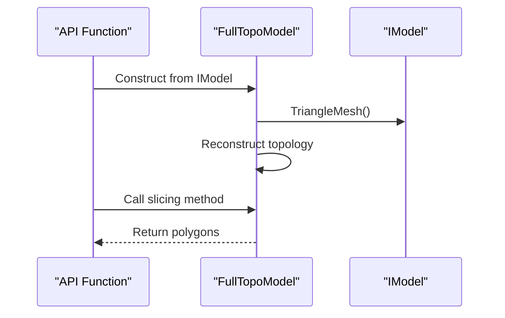
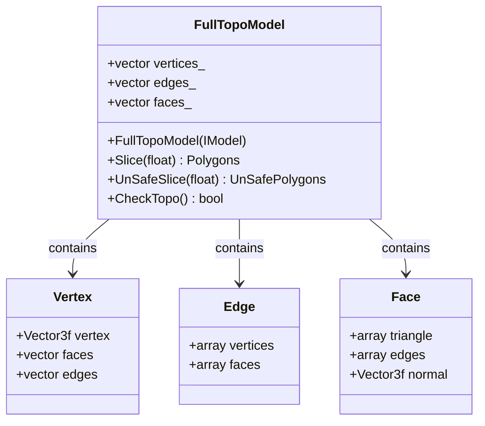
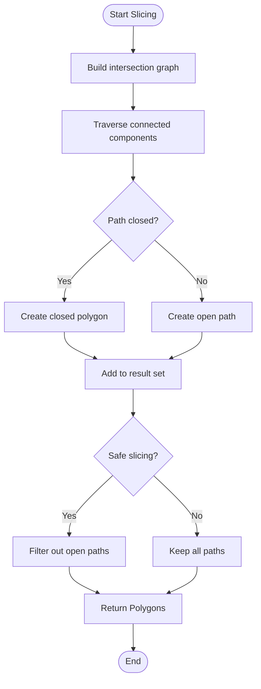
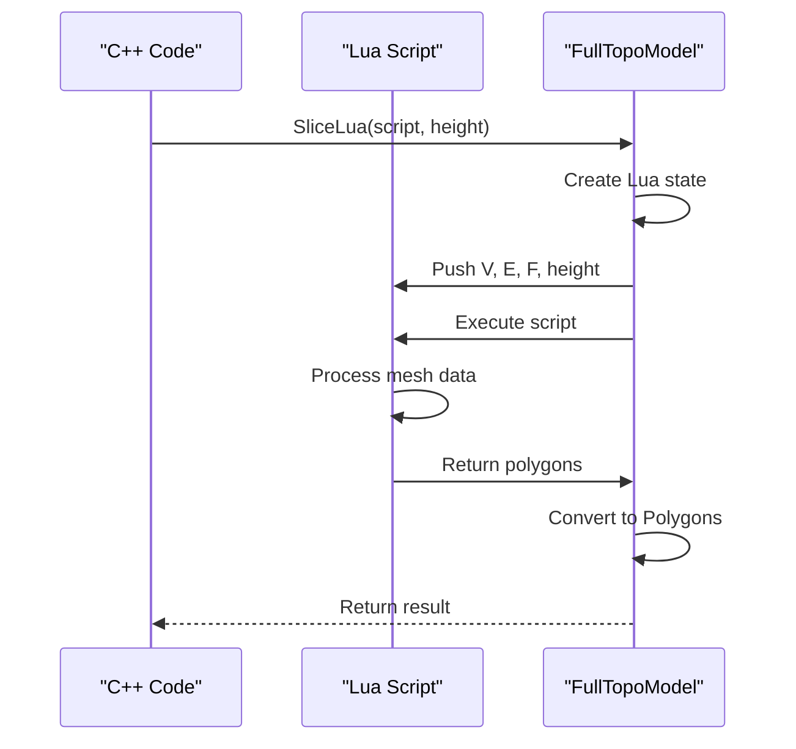
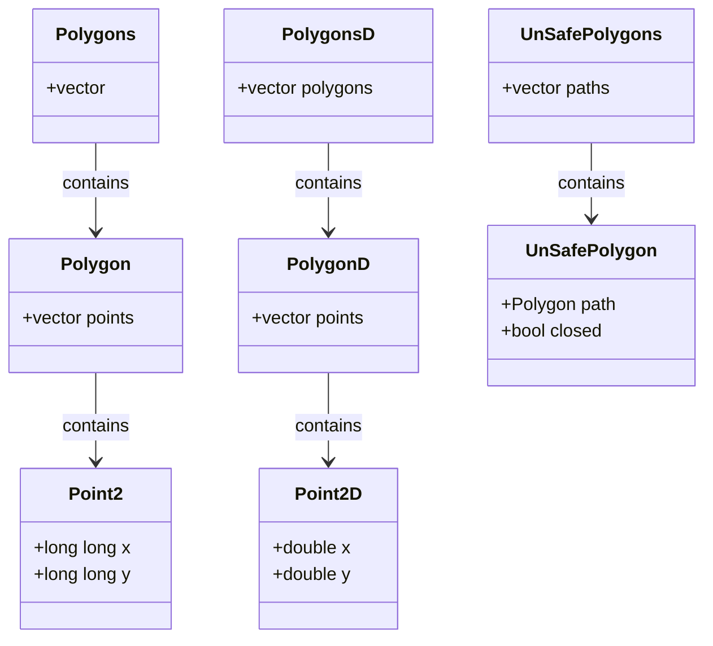
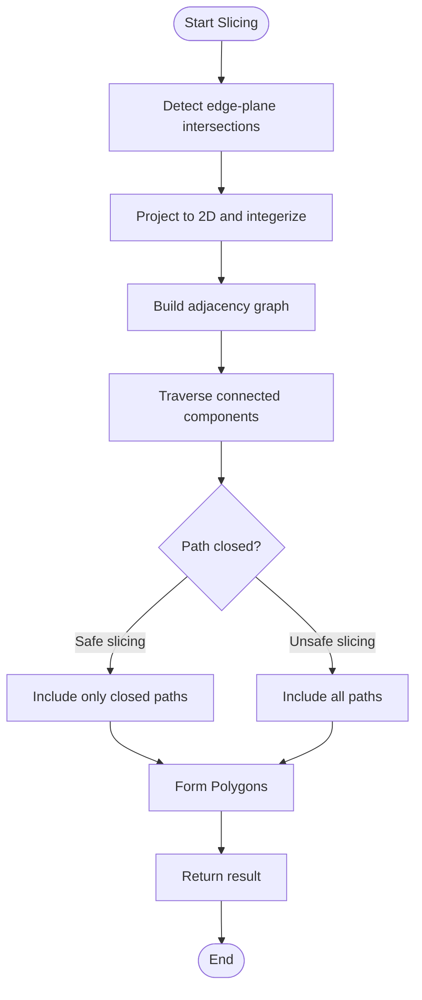

# Slicing Engine

<cite>
**Referenced Files in This Document**   
- [mesh_slice.cpp](file://LibHsBaSlicer/Slice/mesh_slice.cpp)
- [mesh_slice.hpp](file://LibHsBaSlicer/Slice/mesh_slice.hpp)
- [FullTopoModel.cpp](file://meshmodel/FullTopoModel.cpp)
- [FullTopoModel.hpp](file://meshmodel/FullTopoModel.hpp)
- [IModel.hpp](file://base/IModel.hpp)
- [IntPolygon.hpp](file://2D/IntPolygon.hpp)
- [FloatPolygons.hpp](file://2D/FloatPolygons.hpp)
- [layerspath.cpp](file://paths/layerspath.cpp)
- [layerspath.hpp](file://paths/layerspath.hpp)
- [export.h](file://LibHsBaSlicer/export.h)
</cite>

## Table of Contents
1. [Introduction](#introduction)
2. [Core Slicing Functions](#core-slicing-functions)
3. [Topological Mesh Construction](#topological-mesh-construction)
4. [Safe vs Unsafe Slicing Operations](#safe-vs-unsafe-slicing-operations)
5. [Lua-Based Slicing](#lua-based-slicing)
6. [Data Structures and Type Definitions](#data-structures-and-type-definitions)
7. [Slicing Algorithm Implementation](#slicing-algorithm-implementation)
8. [Layer Generation and Path Planning](#layer-generation-and-path-planning)
9. [Performance Considerations](#performance-considerations)
10. [Error Handling and Validation](#error-handling-and-validation)

## Introduction

The Slicing Engine component is responsible for converting 3D mesh models into 2D polygonal representations at specified heights, which are essential for additive manufacturing processes. This document provides a comprehensive analysis of the slicing functionality implemented in the HsBaSlicer software, focusing on the core slicing functions, their implementation details, and the underlying architectural patterns.

The slicing operations are primarily implemented through four key functions: Slice, UnSafeSlice, SliceLua, and UnSafeSliceLua, all defined in the mesh_slice.cpp file. These functions serve as entry points to the slicing engine, delegating the actual slicing work to the FullTopoModel class after constructing a complete topological representation of the input mesh. The engine supports both standard slicing operations and Lua-scriptable slicing, providing flexibility for custom slicing algorithms.

The slicing process begins with an IModel interface, which provides access to the triangle mesh data of a 3D model. The FullTopoModel class reconstructs the complete topological relationships between vertices, edges, and faces, enabling efficient slicing operations. This topological reconstruction is a critical preprocessing step that allows for accurate intersection calculations between the mesh and slicing planes.

**Section sources**
- [mesh_slice.cpp](file://LibHsBaSlicer/Slice/mesh_slice.cpp#L1-L27)
- [FullTopoModel.hpp](file://meshmodel/FullTopoModel.hpp#L1-L119)

## Core Slicing Functions

The slicing engine exposes four primary functions through its public API, each serving a specific purpose in the slicing workflow. These functions are declared in mesh_slice.hpp and implemented in mesh_slice.cpp, with the HSBA_SLICER_LIB_API macro providing the appropriate linkage for library export.

The Slice function performs safe slicing operations, returning only closed polygonal contours. It takes an IModel reference and a float height parameter, constructing a FullTopoModel from the input model and delegating to its Slice method. This function is designed for applications where only valid, closed contours are required, such as in stereolithography (SLA) printing processes.

The UnSafeSlice function provides access to all intersection segments, including open contours that may result from incomplete or non-manifold geometry. This function is particularly useful in fused filament fabrication (FFF) processes where open paths may be acceptable for certain toolpath strategies. The return type UnSafePolygons includes a boolean flag indicating whether each polygonal path is closed.

The SliceLua and UnSafeSliceLua functions extend the slicing capabilities by allowing custom slicing algorithms to be implemented in Lua scripts. These functions pass the mesh topology data to Lua scripts, which can then compute custom polygonal outputs. This scripting capability enables advanced slicing strategies without requiring changes to the core C++ codebase.

All four functions follow a consistent pattern: they create a FullTopoModel instance from the input IModel, then delegate to the corresponding method on the FullTopoModel instance. This design separates the concerns of topological reconstruction and slicing computation, promoting code reuse and maintainability.



**Diagram sources**
- [mesh_slice.cpp](file://LibHsBaSlicer/Slice/mesh_slice.cpp#L5-L26)
- [FullTopoModel.hpp](file://meshmodel/FullTopoModel.hpp#L63-L65)

**Section sources**
- [mesh_slice.cpp](file://LibHsBaSlicer/Slice/mesh_slice.cpp#L5-L26)
- [mesh_slice.hpp](file://LibHsBaSlicer/Slice/mesh_slice.hpp#L11-L18)

## Topological Mesh Construction

The FullTopoModel class is responsible for constructing a complete topological representation of a 3D mesh from the basic triangle mesh data provided by the IModel interface. This topological reconstruction is a critical preprocessing step that enables efficient and accurate slicing operations.

When a FullTopoModel is constructed from an IModel, it extracts the vertex and face data through the TriangleMesh method. The constructor then iterates through all faces to build a comprehensive topological structure that includes vertices, edges, and faces with their interrelationships. Each vertex stores references to the faces it belongs to, each edge maintains references to its two vertices and adjacent faces, and each face contains references to its three vertices and three edges.

The edge construction process is particularly important, as it establishes the connectivity between faces. For each edge of a triangle, the constructor checks if an equivalent edge already exists in the edges_ collection. If found, it updates the face adjacency information; otherwise, it creates a new edge. This process ensures that shared edges between adjacent faces are properly identified and represented as single entities in the topological structure.

The topological reconstruction also includes optional normal calculation using the IGL library's per_face_normals function. When requested, face normals are computed and stored, which can be useful for various geometric operations and validations. The constructor includes validation logic to skip faces that reference non-existent vertices, ensuring the integrity of the topological structure.

This complete topological representation enables efficient slicing operations by providing direct access to the mesh connectivity. Instead of recomputing intersections and adjacencies for each slicing operation, the precomputed topology allows for rapid traversal of the mesh structure during the slicing process.



**Diagram sources**
- [FullTopoModel.cpp](file://meshmodel/FullTopoModel.cpp#L19-L142)
- [FullTopoModel.hpp](file://meshmodel/FullTopoModel.hpp#L43-L114)

**Section sources**
- [FullTopoModel.cpp](file://meshmodel/FullTopoModel.cpp#L19-L142)
- [FullTopoModel.hpp](file://meshmodel/FullTopoModel.hpp#L43-L114)

## Safe vs Unsafe Slicing Operations

The slicing engine provides both safe and unsafe slicing operations to accommodate different manufacturing requirements and geometric conditions. The distinction between these operations lies in how they handle incomplete or non-manifold geometry and the types of contours they return.

Safe slicing operations, implemented by the Slice and SliceLua functions, return only closed polygonal contours. These functions filter out open paths and incomplete intersections, ensuring that the resulting polygons represent valid, enclosed areas. This behavior is essential for manufacturing processes like SLA printing, where continuous, closed contours are required for proper curing of the photopolymer resin.

The safe slicing algorithm works by traversing the adjacency graph of intersection points and only forming polygons when a closed loop is detected. When following a path of connected segments, the algorithm checks if the current point connects back to the starting point. Only when this condition is met is a polygon created and added to the result set. This ensures that all returned polygons have at least three vertices and form closed shapes.

Unsafe slicing operations, implemented by the UnSafeSlice and UnSafeSliceLua functions, preserve all intersection segments, including open paths and incomplete contours. These functions return UnSafePolygons, which include a boolean flag indicating whether each path is closed. This capability is valuable for processes like fused filament fabrication (FFF), where open paths may be acceptable for certain toolpath strategies, such as infill patterns or support structures.

The unsafe slicing algorithm follows the same path traversal logic but creates output polygons regardless of whether the path is closed. For each connected component in the intersection graph, it generates an UnSafePolygon with the closed flag set to true only if the path forms a complete loop. This preserves the geometric information about partial intersections that might be meaningful in certain manufacturing contexts.

The choice between safe and unsafe slicing depends on the specific manufacturing process and the quality of the input geometry. For high-precision applications with well-formed meshes, safe slicing is typically preferred. For more flexible processes or when working with imperfect models, unsafe slicing provides greater flexibility at the cost of requiring additional validation in downstream processing.



**Diagram sources**
- [FullTopoModel.cpp](file://meshmodel/FullTopoModel.cpp#L256-L432)
- [FullTopoModel.hpp](file://meshmodel/FullTopoModel.hpp#L93-L95)

**Section sources**
- [FullTopoModel.cpp](file://meshmodel/FullTopoModel.cpp#L256-L432)
- [FullTopoModel.hpp](file://meshmodel/FullTopoModel.hpp#L19-L25)

## Lua-Based Slicing

The slicing engine provides Lua-based slicing capabilities through the SliceLua and UnSafeSliceLua functions, allowing users to implement custom slicing algorithms without modifying the core C++ codebase. This extensibility is achieved by exposing the mesh topology data to Lua scripts and executing them in a sandboxed environment.

When a Lua-based slicing operation is invoked, the FullTopoModel class creates a Lua state and populates it with the mesh data. The vertices are exposed as a table V, where each entry contains x, y, and z coordinates. The edges are provided as a table E, with each entry containing references to two vertices. The faces are available as a table F, with each entry referencing three vertices. Additionally, the slicing height is passed as a global variable.

The Lua script has complete access to this topological data and can implement any algorithm to compute the desired polygonal output. The script is expected to return a table of polygons, where each polygon is represented as a sequence of points with x and y coordinates. The engine handles the conversion of these floating-point coordinates to the integerized format used internally.

The Lua execution environment includes error handling to catch both compilation and runtime errors. If the script fails to load or execute, appropriate exceptions are thrown with descriptive error messages. This ensures that script errors do not crash the application and provide useful feedback for debugging.

The engine supports multiple variants of Lua-based slicing, including direct script execution, function calls within scripts, and file-based scripts. This flexibility allows users to organize their custom slicing algorithms in various ways, from inline scripts to modular script files.

The Lua-based slicing capability enables advanced features such as adaptive slicing, where the slicing algorithm can vary based on local geometric properties, or hybrid slicing, where different regions of the model are sliced using different algorithms. This extensibility makes the slicing engine highly adaptable to specialized manufacturing requirements.



**Diagram sources**
- [FullTopoModel.cpp](file://meshmodel/FullTopoModel.cpp#L434-L642)
- [FullTopoModel.hpp](file://meshmodel/FullTopoModel.hpp#L97-L108)

**Section sources**
- [FullTopoModel.cpp](file://meshmodel/FullTopoModel.cpp#L434-L642)
- [FullTopoModel.hpp](file://meshmodel/FullTopoModel.hpp#L97-L108)

## Data Structures and Type Definitions

The slicing engine relies on a well-defined set of data structures and type definitions to represent geometric entities and their relationships. These structures are designed for efficiency and compatibility with the Clipper2 library, which is used for polygon operations.

The core geometric types are defined in IntPolygon.hpp and FloatPolygons.hpp. The Point2 type represents a 2D point with 64-bit integer coordinates, while Polygon is a sequence of Point2 objects forming a closed path. Polygons is a collection of Polygon objects, representing multiple disconnected contours. These integer-based types provide exact arithmetic for geometric operations, avoiding floating-point precision issues.

For floating-point operations, the engine defines Point2D, PolygonD, and PolygonsD using double-precision coordinates. These types are used when interfacing with external systems or when higher precision is required. The engine provides conversion functions between integer and floating-point representations, using a scaling factor defined by the integerization constant (1e6).

The FullTopoModel class defines additional structures to represent the 3D mesh topology. The Vertex structure contains the 3D coordinates and references to adjacent faces and edges. The Edge structure maintains references to its two vertices and two adjacent faces, capturing the connectivity between faces. The Face structure stores references to its three vertices and three edges, along with the face normal.

For unsafe slicing operations, the engine defines UnSafePolygon and UnSafePolygons types. An UnSafePolygon consists of a Polygon path and a boolean flag indicating whether the path is closed. This structure allows the engine to preserve information about open paths while maintaining compatibility with the standard polygon processing pipeline.

The use of strongly-typed collections and well-defined interfaces ensures type safety and clarity in the codebase. The separation between integer and floating-point representations allows the engine to optimize for both precision and performance in different contexts.



**Diagram sources**
- [IntPolygon.hpp](file://2D/IntPolygon.hpp#L10-L14)
- [FloatPolygons.hpp](file://2D/FloatPolygons.hpp#L13-L15)
- [FullTopoModel.hpp](file://meshmodel/FullTopoModel.hpp#L19-L25)

**Section sources**
- [IntPolygon.hpp](file://2D/IntPolygon.hpp#L10-L75)
- [FloatPolygons.hpp](file://2D/FloatPolygons.hpp#L13-L72)

## Slicing Algorithm Implementation

The slicing algorithm implemented in the FullTopoModel class follows a systematic approach to compute the intersection between a 3D mesh and a horizontal slicing plane at a specified height. The algorithm consists of several key phases: intersection detection, graph construction, path traversal, and polygon formation.

The intersection detection phase iterates through all faces of the mesh, computing intersections between each face's edges and the slicing plane. For each triangular face, the algorithm checks all three edges for intersection with the plane at the specified height. The Intersetion function handles the geometric calculations, accounting for various edge cases such as edges lying entirely above or below the plane, edges parallel to the plane, and edges intersecting the plane.

When an intersection is detected, the 3D intersection point is projected to 2D by discarding the z-coordinate and integerizing the x and y coordinates. The integerization process multiplies the coordinates by a scaling factor (1e6) and rounds to the nearest integer, ensuring precise representation of geometric positions. These 2D points are stored with a unique key based on their integer coordinates.

The graph construction phase builds an adjacency map where each intersection point is associated with its connected neighbors. For each face that produces exactly two intersection points, an edge is added between these points in the adjacency map. This creates a graph representation of the intersection network, where connected components correspond to potential polygonal contours.

The path traversal phase processes each connected component in the graph to form polygonal paths. Starting from an unvisited point, the algorithm follows the adjacency relationships to trace the complete path. For safe slicing, the algorithm only forms a polygon when the path closes back on itself. For unsafe slicing, all paths are preserved regardless of whether they are closed.

The final polygon formation phase converts the traced paths into the appropriate output format. For safe slicing, only closed paths with at least three vertices are included in the result. For unsafe slicing, all paths with at least two vertices are included, with the closed flag indicating whether the path forms a complete loop.

This algorithm efficiently handles complex mesh geometries and produces accurate slicing results while maintaining performance through the use of hash maps for point lookup and adjacency storage.



**Diagram sources**
- [FullTopoModel.cpp](file://meshmodel/FullTopoModel.cpp#L229-L432)
- [FullTopoModel.hpp](file://meshmodel/FullTopoModel.hpp#L86-L95)

**Section sources**
- [FullTopoModel.cpp](file://meshmodel/FullTopoModel.cpp#L229-L432)
- [FullTopoModel.hpp](file://meshmodel/FullTopoModel.hpp#L86-L95)

## Layer Generation and Path Planning

The slicing engine integrates with the path planning system through the LayersPath class, which manages the collection and storage of sliced layers for subsequent processing. This integration enables the creation of complete toolpaths for additive manufacturing processes.

The LayersPath class serves as a container for multiple sliced layers, each associated with a configuration string and a set of polygons. The push_back method allows adding layers to the collection, storing both the layer configuration and the polygonal data. This design supports variable layer heights and different processing parameters for each layer.

When saving the layer data, the engine provides multiple output options. The basic Save method stores the layers in an SQLite database, creating a structured format that can be efficiently queried and processed. Each layer is stored as a record with its configuration and serialized polygon data, enabling random access to specific layers.

For more complex processing requirements, the engine supports Lua-scripted output through overloaded Save methods. These methods expose the layer data to Lua scripts, allowing custom serialization formats, post-processing operations, or direct machine code generation. The Lua environment includes access to the SQLite database and the layer data, enabling sophisticated processing workflows.

The integration between slicing and path planning follows a pipeline architecture, where the output of the slicing operations becomes the input for path planning algorithms. This separation of concerns allows each component to be optimized independently while maintaining a clean interface between them.

The layer generation process also supports error handling and validation, ensuring that only valid layers are added to the collection. The configuration string associated with each layer can include metadata such as layer height, processing parameters, and material settings, providing context for downstream processing.

This architecture enables flexible manufacturing workflows, where different slicing strategies can be combined with various path planning algorithms to optimize for specific materials, geometries, or performance requirements.

```mermaid
classDiagram
class LayersPath {
+function<void(string_view, string_view)> callback_
+vector<LayersData> layers_
+push_back(config, layer)
+Save(path)
+Save(path, script)
+Save(path, script, funcName)
}
class LayersData {
+string layerConfig
+PolygonsD layer
}
LayersPath --> LayersData : contains
```

**Diagram sources**
- [layerspath.hpp](file://paths/layerspath.hpp#L26-L35)
- [layerspath.cpp](file://paths/layerspath.cpp#L22-L65)

**Section sources**
- [layerspath.hpp](file://paths/layerspath.hpp#L26-L39)
- [layerspath.cpp](file://paths/layerspath.cpp#L1-L200)

## Performance Considerations

The slicing engine incorporates several performance optimizations to handle large and complex 3D models efficiently. These optimizations address both algorithmic complexity and memory usage, ensuring responsive performance even with high-resolution meshes.

One key optimization is the precomputation of topological relationships in the FullTopoModel constructor. By building a complete topological representation of the mesh upfront, subsequent slicing operations can leverage this structure without recomputing connectivity information. This amortizes the cost of topological reconstruction across multiple slicing operations, making it particularly efficient when slicing at multiple heights.

The use of hash maps for point storage and adjacency lookup provides O(1) average-case complexity for point operations. The adjacency map in the slicing algorithm uses a custom hash function for integer coordinate pairs, enabling fast insertion and lookup of intersection points. This is crucial for handling meshes with thousands of faces and intersection points.

Memory efficiency is achieved through the use of integerized coordinates and compact data structures. The integerization process not only improves precision but also reduces memory footprint compared to floating-point representations. The vertex, edge, and face structures are designed to minimize padding and maximize cache locality, improving performance on modern CPU architectures.

The algorithm minimizes redundant calculations by processing each face exactly once during the intersection detection phase. The intersection calculations are optimized to handle common cases efficiently, such as edges entirely above or below the slicing plane, which can be quickly rejected without detailed computation.

For Lua-based slicing, the engine manages the Lua state lifecycle carefully to minimize overhead. The MakeUniqueLuaState function ensures proper cleanup of Lua resources, preventing memory leaks while allowing efficient reuse of Lua states across multiple operations.

The separation between safe and unsafe slicing operations also contributes to performance optimization. Safe slicing can terminate path traversal early when an open path is detected, avoiding unnecessary processing of incomplete contours. This optimization is particularly beneficial for well-formed meshes where most intersections form closed loops.

These performance considerations enable the slicing engine to handle industrial-scale models with millions of polygons while maintaining interactive response times, making it suitable for production environments.

**Section sources**
- [FullTopoModel.cpp](file://meshmodel/FullTopoModel.cpp#L266-L267)
- [FullTopoModel.cpp](file://meshmodel/FullTopoModel.cpp#L300-L301)
- [FullTopoModel.cpp](file://meshmodel/FullTopoModel.cpp#L353-L354)

## Error Handling and Validation

The slicing engine implements comprehensive error handling and validation mechanisms to ensure robust operation and provide meaningful feedback when issues occur. These mechanisms protect against invalid inputs, geometric degeneracies, and runtime errors.

The FullTopoModel class includes a CheckTopo method that validates the integrity of the constructed topological structure. This method verifies that all faces reference valid vertices and edges, and that all edges reference valid vertices and faces. It also ensures that the vertex and edge sets are complete, containing exactly the elements referenced by the faces.

During mesh construction, the engine includes validation logic to handle degenerate cases. Faces that reference non-existent vertices are skipped, preventing the creation of invalid topological structures. The intersection detection algorithm handles edge cases such as edges lying exactly on the slicing plane or parallel to it, ensuring consistent behavior across different geometric configurations.

For Lua-based operations, the engine implements robust error handling for both script loading and execution. Compilation errors are caught and reported with descriptive messages, including the specific Lua error text. Runtime errors in Lua scripts are similarly captured and converted to C++ exceptions, preventing crashes and providing debugging information.

The engine also validates output data to ensure correctness. For safe slicing operations, only polygons with at least three vertices are included in the result, preventing degenerate two-point "polygons" from being returned. The integerization process includes rounding to the nearest integer, avoiding truncation errors that could affect geometric precision.

These validation and error handling mechanisms ensure that the slicing engine produces reliable results even with imperfect input data, making it robust for real-world manufacturing applications where model quality can vary significantly.

**Section sources**
- [FullTopoModel.cpp](file://meshmodel/FullTopoModel.cpp#L144-L202)
- [FullTopoModel.cpp](file://meshmodel/FullTopoModel.cpp#L230-L254)
- [FullTopoModel.cpp](file://meshmodel/FullTopoModel.cpp#L479-L494)