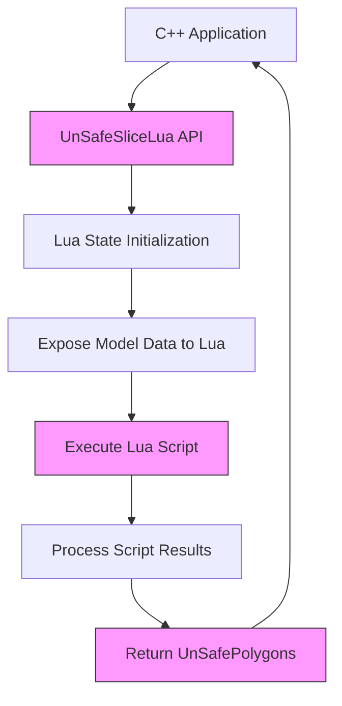
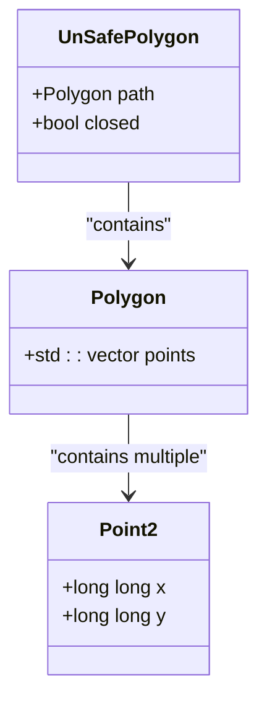
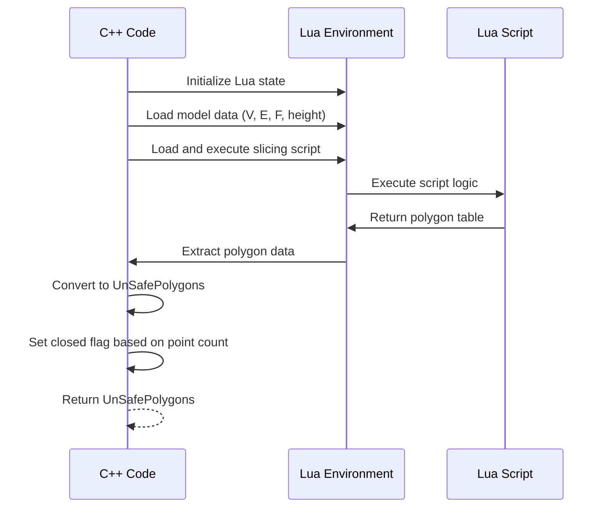
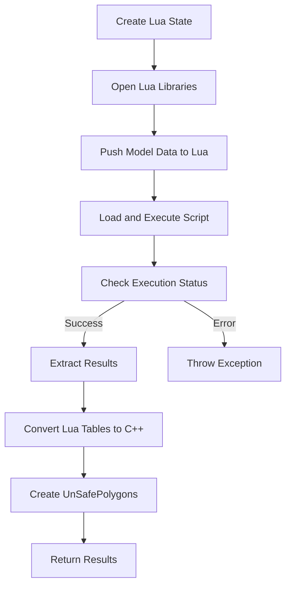

# Unsafe Lua Slicing

<cite>
**Referenced Files in This Document**   
- [FullTopoModel.hpp](file://meshmodel/FullTopoModel.hpp)
- [FullTopoModel.cpp](file://meshmodel/FullTopoModel.cpp)
- [mesh_slice.cpp](file://LibHsBaSlicer/Slice/mesh_slice.cpp)
- [LuaAdapter.cpp](file://2D/LuaAdapter.cpp)
- [LuaAdapter.hpp](file://2D/LuaAdapter.hpp)
- [full_topo_model_test.cpp](file://tests/Models/full_topo_model_test.cpp)
</cite>

## Table of Contents
1. [Introduction](#introduction)
2. [Core Components](#core-components)
3. [Architecture Overview](#architecture-overview)
4. [Detailed Component Analysis](#detailed-component-analysis)
5. [Performance Considerations](#performance-considerations)
6. [Security and Safety Warnings](#security-and-safety-warnings)
7. [Use Cases and Recommendations](#use-cases-and-recommendations)
8. [Conclusion](#conclusion)

## Introduction
The Unsafe Lua Slicing functionality in HsBaSlicer provides a high-performance slicing mechanism that combines the flexibility of Lua scripting with direct memory access for maximum efficiency. This feature enables users to define custom slicing logic through Lua scripts while bypassing certain safety checks, resulting in significant performance improvements over traditional safe slicing methods. The UnSafeSliceLua function returns UnSafePolygons, which can represent both closed polygons and open polylines, providing greater flexibility for downstream processing. This documentation details the implementation, use cases, performance benefits, and critical safety considerations for this advanced slicing capability.

## Core Components
The Unsafe Lua Slicing system consists of several key components that work together to provide high-performance, scriptable slicing capabilities. The core functionality is implemented in the FullTopoModel class, which provides both safe and unsafe slicing interfaces. The UnSafeSliceLua method allows for custom Lua scripting of the slicing process while returning UnSafePolygons that preserve open polylines. The system leverages Lua integration through the LuaAdapter components, which facilitate data exchange between C++ and Lua environments. The implementation maintains compatibility with the standard SliceLua interface while removing certain safety constraints to improve performance.

**Section sources**
- [FullTopoModel.hpp](file://meshmodel/FullTopoModel.hpp#L18-L25)
- [FullTopoModel.cpp](file://meshmodel/FullTopoModel.cpp#L536-L641)
- [mesh_slice.cpp](file://LibHsBaSlicer/Slice/mesh_slice.cpp#L21-L25)

## Architecture Overview
The Unsafe Lua Slicing architecture follows a layered approach where the slicing logic is separated from the data processing and memory management components. The system exposes a C++ API that can be called from external components, which in turn invokes Lua scripts to perform the actual slicing computation. The Lua environment is initialized with access to the model's vertex, edge, and face data, allowing scripts to implement custom slicing algorithms. The results are then converted back to C++ data structures without enforcing closure constraints, enabling the return of open polylines when appropriate.

**Diagram sources**
- [FullTopoModel.cpp](file://meshmodel/FullTopoModel.cpp#L536-L641)
- [mesh_slice.cpp](file://LibHsBaSlicer/Slice/mesh_slice.cpp#L21-L25)

## Detailed Component Analysis

### UnSafePolygons Data Structure
The UnSafePolygons structure is designed to represent polygonal data without enforcing closure constraints, allowing for greater flexibility in representing slicing results. Unlike traditional polygon representations that require closed loops, UnSafePolygons can represent open polylines, which is particularly useful for certain manufacturing processes and visualization applications.

**Diagram sources**
- [FullTopoModel.hpp](file://meshmodel/FullTopoModel.hpp#L18-L22)

### UnSafeSliceLua Implementation
The UnSafeSliceLua function implements the core unsafe slicing functionality by executing Lua scripts in a controlled environment while bypassing certain safety checks. The implementation follows the same initialization pattern as the safe SliceLua function but differs in how it processes and returns results, specifically by accepting polylines with fewer than three points.

**Diagram sources**
- [FullTopoModel.cpp](file://meshmodel/FullTopoModel.cpp#L536-L641)

### Lua Integration Mechanism
The Lua integration mechanism provides a bridge between the C++ application and Lua scripting environment, enabling data exchange and function calls between the two systems. The implementation uses the Lua C API to create and manage Lua states, register C++ functions, and convert data between C++ and Lua representations.

**Diagram sources**
- [FullTopoModel.cpp](file://meshmodel/FullTopoModel.cpp#L536-L641)
- [LuaAdapter.cpp](file://2D/LuaAdapter.cpp#L149-L280)

## Performance Considerations
The Unsafe Lua Slicing implementation provides significant performance advantages over the safe slicing approach by eliminating certain validation steps and memory safety checks. While specific benchmark data is not available in the codebase, the performance gains can be attributed to several factors:

1. **Reduced Validation Overhead**: The unsafe implementation skips closure validation and minimum point count checks that are performed in the safe slicing path.

2. **Direct Memory Access**: By operating in an unsafe mode, the implementation can use direct memory access patterns that are more efficient than bounds-checked alternatives.

3. **Optimized Data Conversion**: The conversion from Lua tables to C++ data structures is streamlined, with fewer intermediate validation steps.

4. **Reduced Function Call Overhead**: The unsafe path consolidates several validation functions into a single processing step, reducing function call overhead.

The performance benefits are most pronounced in scenarios involving complex models with many small features or when processing large numbers of slices, where the cumulative effect of skipped validation steps becomes significant.

**Section sources**
- [FullTopoModel.cpp](file://meshmodel/FullTopoModel.cpp#L536-L641)
- [FullTopoModel.cpp](file://meshmodel/FullTopoModel.cpp#L434-L535)

## Security and Safety Warnings
The Unsafe Lua Slicing functionality combines two potentially dangerous features—unsafe memory access and dynamic scripting—which creates significant security and stability risks. The following warnings and considerations should be carefully evaluated before using this feature:

1. **Memory Safety Risks**: The "unsafe" designation indicates that memory safety guarantees are not enforced, which could lead to buffer overflows, use-after-free errors, or other memory corruption issues if the Lua script produces malformed output.

2. **Script Injection Vulnerabilities**: Since Lua scripts are executed in the application context, malicious or poorly written scripts could potentially access sensitive data or execute unauthorized operations.

3. **System Stability Impact**: Errors in the Lua script or invalid data returned by the script could crash the application or corrupt internal data structures.

4. **Limited Error Recovery**: The unsafe nature of the implementation means that error recovery mechanisms may be limited, potentially leading to unrecoverable application states.

To mitigate these risks, strict validation procedures should be implemented for any Lua scripts used with the UnSafeSliceLua function, including:
- Input validation for all script parameters
- Output validation for all returned polygon data
- Resource limits on script execution time and memory usage
- Sandboxing of the Lua environment to restrict access to system resources

**Section sources**
- [FullTopoModel.cpp](file://meshmodel/FullTopoModel.cpp#L536-L641)
- [LuaAdapter.cpp](file://2D/LuaAdapter.cpp#L1-L280)

## Use Cases and Recommendations
The Unsafe Lua Slicing functionality is designed for high-performance, scriptable slicing in controlled environments where the performance benefits outweigh the safety risks. Recommended use cases include:

1. **High-Volume Production Environments**: Where slicing performance is critical and scripts are thoroughly tested and validated.

2. **Controlled Manufacturing Systems**: Where the entire workflow is managed within a secure environment with strict access controls.

3. **Research and Development**: Where experimental slicing algorithms need to be tested without the overhead of safety checks.

4. **Specialized Applications**: That require open polylines in their output, such as certain types of toolpath generation.

When using this functionality, the following recommendations should be followed:
- Always validate Lua scripts before deployment
- Implement comprehensive error handling and recovery mechanisms
- Use in environments with limited user access to scripting capabilities
- Monitor system stability and performance when introducing new scripts
- Maintain thorough documentation of all custom slicing scripts and their expected behavior

The UnSafeSliceLua function should be considered a specialized tool for expert users in controlled environments, rather than a general-purpose slicing solution.

**Section sources**
- [FullTopoModel.hpp](file://meshmodel/FullTopoModel.hpp#L107)
- [FullTopoModel.cpp](file://meshmodel/FullTopoModel.cpp#L536-L641)
- [full_topo_model_test.cpp](file://tests/Models/full_topo_model_test.cpp#L159-L164)

## Conclusion
The Unsafe Lua Slicing functionality in HsBaSlicer provides a powerful combination of high-performance slicing and scriptable flexibility through the UnSafeSliceLua function. By returning UnSafePolygons and bypassing certain safety checks, this implementation achieves significant performance gains over the safe slicing approach. However, this comes with increased risks due to the combination of unsafe memory access and dynamic scripting capabilities. The feature is best suited for controlled environments where performance is critical and strict validation procedures can be implemented. Users should carefully weigh the performance benefits against the potential security and stability risks when deciding whether to use this functionality in their applications.