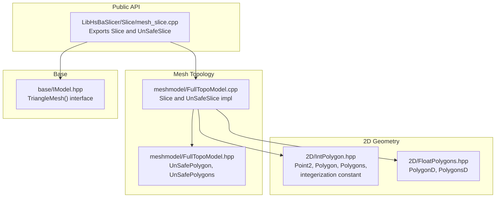
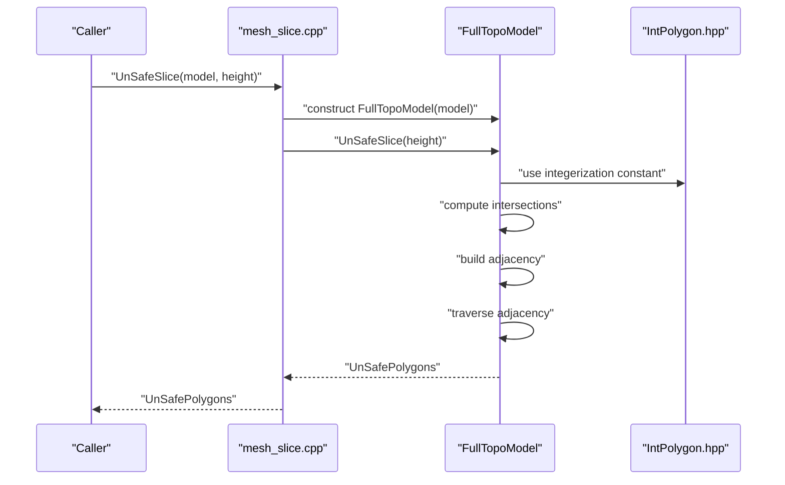
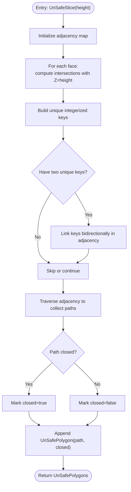
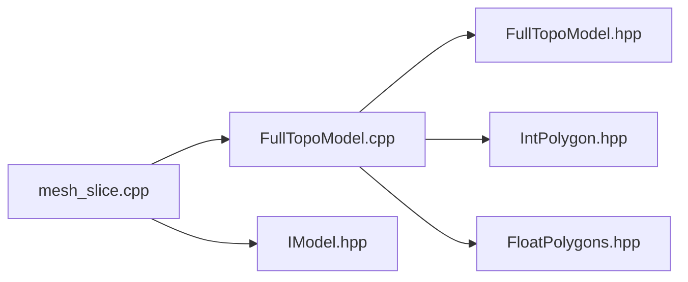

# Unsafe Slicing

<cite>
**Referenced Files in This Document**
- [mesh_slice.cpp](file://LibHsBaSlicer/Slice/mesh_slice.cpp)
- [mesh_slice.hpp](file://LibHsBaSlicer/Slice/mesh_slice.hpp)
- [FullTopoModel.cpp](file://meshmodel/FullTopoModel.cpp)
- [FullTopoModel.hpp](file://meshmodel/FullTopoModel.hpp)
- [IntPolygon.hpp](file://2D/IntPolygon.hpp)
- [FloatPolygons.hpp](file://2D/FloatPolygons.hpp)
- [IModel.hpp](file://base/IModel.hpp)
- [full_topo_model_test.cpp](file://tests/Models/full_topo_model_test.cpp)
</cite>

## Table of Contents
1. [Introduction](#introduction)
2. [Project Structure](#project-structure)
3. [Core Components](#core-components)
4. [Architecture Overview](#architecture-overview)
5. [Detailed Component Analysis](#detailed-component-analysis)
6. [Dependency Analysis](#dependency-analysis)
7. [Performance Considerations](#performance-considerations)
8. [Troubleshooting Guide](#troubleshooting-guide)
9. [Conclusion](#conclusion)
10. [Appendices](#appendices)

## Introduction
This document explains the Unsafe Slicing feature that enables high-performance slicing by bypassing certain safety checks. It focuses on the UnSafeSlice implementation in FullTopoModel and its associated API surface, clarifies the UnSafePolygons return type and its implications for memory management and concurrency, and provides guidance on when to use unsafe slicing versus safe slicing. It also outlines potential risks and debugging strategies.

## Project Structure
Unsafe slicing spans several modules:
- Public API surface for slicing in LibHsBaSlicer/Slice
- Mesh topology reconstruction and slicing logic in meshmodel
- Polygon types and integerization constants in 2D
- Base model interface in base

**Diagram sources**
- [mesh_slice.cpp](file://LibHsBaSlicer/Slice/mesh_slice.cpp#L1-L28)
- [FullTopoModel.cpp](file://meshmodel/FullTopoModel.cpp#L256-L432)
- [FullTopoModel.hpp](file://meshmodel/FullTopoModel.hpp#L18-L35)
- [IntPolygon.hpp](file://2D/IntPolygon.hpp#L10-L14)
- [FloatPolygons.hpp](file://2D/FloatPolygons.hpp#L13-L16)
- [IModel.hpp](file://base/IModel.hpp#L33-L33)

**Section sources**
- [mesh_slice.cpp](file://LibHsBaSlicer/Slice/mesh_slice.cpp#L1-L28)
- [mesh_slice.hpp](file://LibHsBaSlicer/Slice/mesh_slice.hpp#L1-L21)
- [FullTopoModel.cpp](file://meshmodel/FullTopoModel.cpp#L256-L432)
- [FullTopoModel.hpp](file://meshmodel/FullTopoModel.hpp#L18-L35)
- [IntPolygon.hpp](file://2D/IntPolygon.hpp#L10-L14)
- [FloatPolygons.hpp](file://2D/FloatPolygons.hpp#L13-L16)
- [IModel.hpp](file://base/IModel.hpp#L33-L33)

## Core Components
- UnSafeSlice public API: Exposes UnSafeSlice and UnSafeSliceLua functions that return UnSafePolygons.
- FullTopoModel::UnSafeSlice: Performs Z-plane slicing without discarding open paths, returning both closed and open paths with a closed flag.
- UnSafePolygons and UnSafePolygon: Container and element type for potentially open paths.
- Integerization constant: integerization defines fixed-point scaling used for robustness and performance.

Key responsibilities:
- mesh_slice.cpp: Thin wrappers around FullTopoModel::UnSafeSlice and UnSafeSliceLua.
- FullTopoModel.cpp: Implements the slicing algorithm, builds adjacency from intersections, and produces UnSafePolygons.
- FullTopoModel.hpp: Declares UnSafePolygon and UnSafePolygons and exposes the slicing methods.
- IntPolygon.hpp: Defines integerized geometry types and the integerization constant used by slicing.

**Section sources**
- [mesh_slice.hpp](file://LibHsBaSlicer/Slice/mesh_slice.hpp#L11-L18)
- [mesh_slice.cpp](file://LibHsBaSlicer/Slice/mesh_slice.cpp#L10-L14)
- [FullTopoModel.hpp](file://meshmodel/FullTopoModel.hpp#L18-L35)
- [FullTopoModel.cpp](file://meshmodel/FullTopoModel.cpp#L344-L432)
- [IntPolygon.hpp](file://2D/IntPolygon.hpp#L10-L14)

## Architecture Overview
Unsafe slicing follows a deterministic pipeline:
- Build a FullTopoModel from an IModel’s triangle mesh.
- Compute intersections of triangle edges with the Z-plane at the given height.
- Construct adjacency from unique intersection points.
- Traverse adjacency to collect closed loops and open paths, marking closed status.
- Return UnSafePolygons containing both closed and open paths.

**Diagram sources**
- [mesh_slice.cpp](file://LibHsBaSlicer/Slice/mesh_slice.cpp#L10-L14)
- [FullTopoModel.cpp](file://meshmodel/FullTopoModel.cpp#L344-L432)
- [IntPolygon.hpp](file://2D/IntPolygon.hpp#L10-L14)

## Detailed Component Analysis

### UnSafeSlice Implementation in FullTopoModel
FullTopoModel::UnSafeSlice performs the following steps:
- Iterates triangles, computes intersections with the Z-plane, and collects unique intersection points keyed by integerized coordinates.
- Builds an adjacency map keyed by integerized points.
- Traverses adjacency to collect closed loops and open paths, recording whether a path forms a closed loop.
- Produces UnSafePolygons with each element carrying the path and a closed flag.

**Diagram sources**
- [FullTopoModel.cpp](file://meshmodel/FullTopoModel.cpp#L344-L432)

**Section sources**
- [FullTopoModel.cpp](file://meshmodel/FullTopoModel.cpp#L344-L432)

### UnSafePolygons Return Type and Implications
UnSafePolygons is a vector of UnSafePolygon, where each element contains:
- path: a Polygon (integerized path)
- closed: a boolean indicating whether the path formed a closed loop during traversal

Implications:
- Memory management: UnSafePolygons is a standard vector of structs. The caller owns the returned collection and is responsible for copying or moving as needed.
- Concurrency: FullTopoModel::UnSafeSlice is a const method operating on internal member vectors. There is no mutable shared state accessed concurrently by the method itself. However, the caller must ensure thread-safety if multiple threads access the same FullTopoModel instance concurrently. The class stores internal mutable containers (vertices_, edges_, faces_) that are populated during construction and remain immutable thereafter; subsequent slicing operations are read-only. Still, concurrent access to the same FullTopoModel instance across threads is not guaranteed to be safe by design and should be avoided.
- Safety: Unlike the safe Slice method, UnSafeSlice may include open paths. Consumers must handle open paths appropriately downstream (e.g., path closure strategies or acceptance of open paths).

**Section sources**
- [FullTopoModel.hpp](file://meshmodel/FullTopoModel.hpp#L18-L35)
- [FullTopoModel.cpp](file://meshmodel/FullTopoModel.cpp#L344-L432)

### Safe vs Unsafe Slicing Comparison
- Safe slicing (Slice): Only closed polygons are returned; open paths are discarded.
- Unsafe slicing (UnSafeSlice): Returns both closed and open paths, with closed flag set accordingly.

Use cases:
- Safe slicing: When downstream path planning requires only closed loops (e.g., perimeter outlines).
- Unsafe slicing: When open paths are acceptable or desired (e.g., certain filament-based processes where open segments are meaningful), or when performance benefits outweigh safety checks.

Performance characteristics:
- Both methods iterate faces and compute intersections. UnSafeSlice avoids filtering out open paths, which can reduce post-processing overhead in scenarios where open paths are retained.

**Section sources**
- [mesh_slice.hpp](file://LibHsBaSlicer/Slice/mesh_slice.hpp#L11-L18)
- [FullTopoModel.cpp](file://meshmodel/FullTopoModel.cpp#L256-L342)
- [FullTopoModel.cpp](file://meshmodel/FullTopoModel.cpp#L344-L432)

### Public API Surface for Unsafe Slicing
- UnSafeSlice(model, height): Returns UnSafePolygons.
- UnSafeSliceLua(model, script, height): Executes a Lua script to produce polygons and returns UnSafePolygons, accepting both closed and open paths.

These functions construct a FullTopoModel from the IModel and delegate to the corresponding FullTopoModel methods.

**Section sources**
- [mesh_slice.cpp](file://LibHsBaSlicer/Slice/mesh_slice.cpp#L10-L14)
- [mesh_slice.cpp](file://LibHsBaSlicer/Slice/mesh_slice.cpp#L22-L26)
- [IModel.hpp](file://base/IModel.hpp#L33-L33)

## Dependency Analysis
- mesh_slice.cpp depends on FullTopoModel and IModel to perform slicing.
- FullTopoModel.cpp depends on:
  - IntPolygon.hpp for integerized geometry and integerization constant
  - FloatPolygons.hpp indirectly via integerization conversions
  - IModel.hpp for TriangleMesh()
- FullTopoModel.hpp declares UnSafePolygon and UnSafePolygons and exposes slicing methods.

**Diagram sources**
- [mesh_slice.cpp](file://LibHsBaSlicer/Slice/mesh_slice.cpp#L1-L28)
- [FullTopoModel.cpp](file://meshmodel/FullTopoModel.cpp#L256-L432)
- [FullTopoModel.hpp](file://meshmodel/FullTopoModel.hpp#L18-L35)
- [IntPolygon.hpp](file://2D/IntPolygon.hpp#L10-L14)
- [FloatPolygons.hpp](file://2D/FloatPolygons.hpp#L13-L16)
- [IModel.hpp](file://base/IModel.hpp#L33-L33)

**Section sources**
- [mesh_slice.cpp](file://LibHsBaSlicer/Slice/mesh_slice.cpp#L1-L28)
- [FullTopoModel.cpp](file://meshmodel/FullTopoModel.cpp#L256-L432)
- [FullTopoModel.hpp](file://meshmodel/FullTopoModel.hpp#L18-L35)
- [IntPolygon.hpp](file://2D/IntPolygon.hpp#L10-L14)
- [FloatPolygons.hpp](file://2D/FloatPolygons.hpp#L13-L16)
- [IModel.hpp](file://base/IModel.hpp#L33-L33)

## Performance Considerations
- Unsafe slicing avoids discarding open paths, reducing downstream filtering work when open paths are retained.
- Integerization reduces floating-point comparisons and improves cache locality for adjacency operations.
- Adjacency map construction and traversal are linear in the number of intersection pairs; memory usage scales with the number of unique intersection points.

Practical tips:
- Prefer UnSafeSlice when downstream consumers can handle open paths efficiently.
- Reuse a FullTopoModel across multiple slices to amortize topology reconstruction costs.
- Avoid concurrent access to the same FullTopoModel instance from multiple threads.

[No sources needed since this section provides general guidance]

## Troubleshooting Guide
Common issues and strategies:
- Unexpected open paths: Verify that downstream logic expects open paths or applies closure strategies.
- Incorrect closed flag: Ensure downstream logic respects the closed field in UnSafePolygon.
- Memory ownership: Copy or move UnSafePolygons as needed; avoid retaining references to temporary collections.
- Thread safety: Do not access the same FullTopoModel instance concurrently from multiple threads.

Validation via tests:
- Tests demonstrate that UnSafeSlice returns closed polygons for simple shapes and that UnSafeSliceLua also returns closed polygons when applicable.

**Section sources**
- [full_topo_model_test.cpp](file://tests/Models/full_topo_model_test.cpp#L80-L95)
- [full_topo_model_test.cpp](file://tests/Models/full_topo_model_test.cpp#L150-L165)

## Conclusion
Unsafe slicing trades safety for performance by returning both closed and open paths without discarding open segments. It is ideal for offline batch processing or scenarios where open paths are acceptable. Use safe slicing when closed loops are mandatory. Be mindful of memory ownership and thread-safety when integrating unsafe slicing into multi-threaded environments.

[No sources needed since this section summarizes without analyzing specific files]

## Appendices

### Example: Comparing Safe vs Unsafe Slicing in a High-Frequency Scenario
- Construct a FullTopoModel from an IModel once.
- For each layer height:
  - Call UnSafeSlice to obtain both closed and open paths in one pass.
  - Apply downstream logic that tolerates open paths.
- Compare with Slice to observe the difference in output size and post-processing cost.

Guidelines:
- Measure throughput with and without open-path filtering.
- Validate correctness by asserting closed polygon presence when required.

[No sources needed since this section provides general guidance]