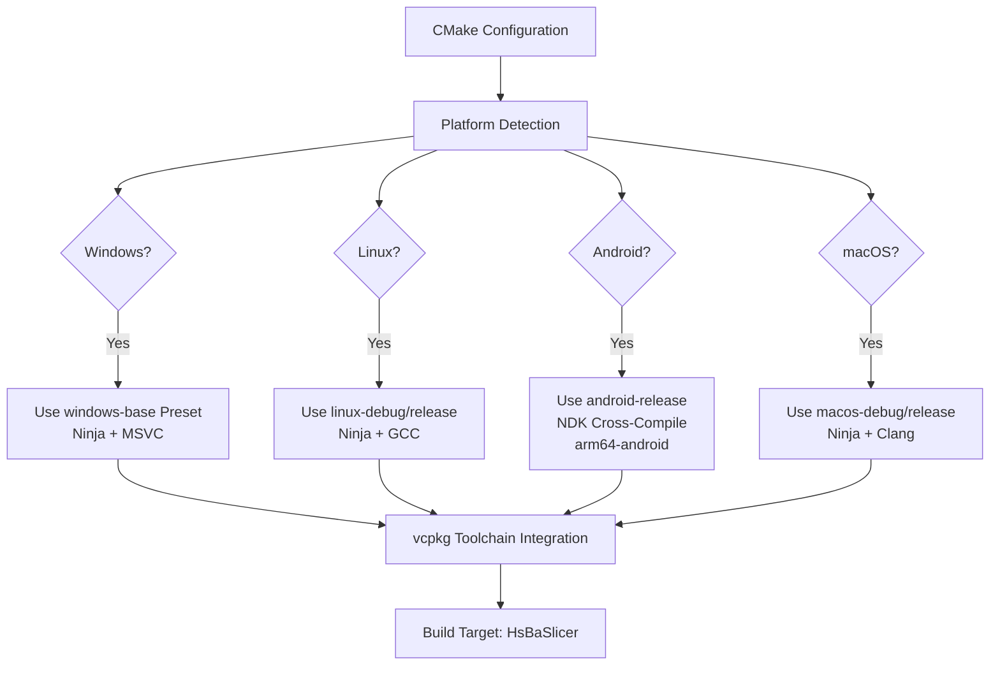
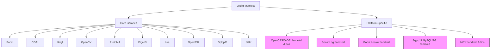

# Technology Stack & Dependencies

<cite>
**Referenced Files in This Document**   
- [CMakeLists.txt](file://CMakeLists.txt)
- [CMakePresets.json](file://CMakePresets.json)
- [vcpkg.json](file://vcpkg.json)
- [vcpkg-configuration.json](file://vcpkg-configuration.json)
- [README.md](file://README.md)
- [base/CMakeLists.txt](file://base/CMakeLists.txt)
- [cipher/CMakeLists.txt](file://cipher/CMakeLists.txt)
- [meshmodel/CMakeLists.txt](file://meshmodel/CMakeLists.txt)
- [fileoperator/CMakeLists.txt](file://fileoperator/CMakeLists.txt)
- [utils/app_config.cpp](file://utils/app_config.cpp)
- [base/eigen_translator.hpp](file://base/eigen_translator.hpp)
- [cipher/encrypt.hpp](file://cipher/encrypt.hpp)
- [meshmodel/IglModel.hpp](file://meshmodel/IglModel.hpp)
- [fileoperator/sql_adapter.hpp](file://fileoperator/sql_adapter.hpp)
- [proto/base_config.proto](file://proto/base_config.proto)
</cite>

## Table of Contents
1. [Introduction](#introduction)
2. [Core Technology Stack](#core-technology-stack)
3. [Build System & Configuration](#build-system--configuration)
4. [Platform Support & Compatibility](#platform-support--compatibility)
5. [Dependency Management with vcpkg](#dependency-management-with-vcpkg)
6. [CMake Integration & Presets](#cmake-integration--presets)
7. [Component-Level Integration](#component-level-integration)
8. [Conclusion](#conclusion)

## Introduction
HsBaSlicer is a cross-platform 3D slicing application built on modern C++20 standards, designed for high-performance geometric processing and manufacturing workflows. The technology stack integrates a comprehensive set of third-party libraries to support advanced functionality in geometry processing, image analysis, configuration serialization, encryption, and database access. This document details the architectural foundation, external dependencies, build system configuration, and platform-specific considerations that define the HsBaSlicer development and deployment environment.

**Section sources**
- [README.md](file://README.md#L1-L156)

## Core Technology Stack

### C++20 Foundation
The HsBaSlicer codebase is built on C++20, leveraging modern language features such as concepts, coroutines, modules (planned), and improved template metaprogramming. The `CMakeLists.txt` enforces C++20 compliance with `set(CMAKE_CXX_STANDARD 20)` and includes utility headers like `concepts.hpp`, `coroutine.hpp`, and `static_reflect.hpp` in the base module, indicating extensive use of generic programming and compile-time introspection.

### Boost for Logging and Utilities
Boost is a critical dependency used across multiple domains:
- **Boost.Log**: Used for logging via `find_package(Boost REQUIRED log)` on Windows and non-Android platforms.
- **Boost.Locale/Nowide**: Enabled on non-Android platforms for Unicode and locale-aware string handling.
- **Boost.Graph/Polygon/Multiprecision**: Used for computational geometry and arbitrary precision arithmetic.
- **Boost.PropertyTree**: Integrated with Eigen via `eigen_translator.hpp` for structured data serialization.

The base library links against Boost components conditionally based on platform availability.

### Protobuf for Configuration Serialization
Protocol Buffers (Protobuf) are used for efficient, schema-based serialization of configuration data. The `proto/` directory contains `.proto` files like `base_config.proto` that define message structures for technology types, output formats, and slicing parameters. These are compiled into C++ classes during the build process and used throughout the application for persistent configuration storage and inter-component communication.

### Eigen3 for Linear Algebra
Eigen3 is the primary linear algebra library, deeply integrated into the codebase:
- Used in `IglModel.hpp` for mesh vertices, faces, normals, and transformations.
- Extended via custom translators in `eigen_translator.hpp` to interface with Boost.PropertyTree.
- Supports vector and matrix operations for 3D geometry processing, including translation, rotation, scaling, and bounding box calculations.

### OpenCV/libjpeg-turbo for Image Processing
Image processing capabilities are provided by:
- **OpenCV**: Used for advanced image analysis and manipulation.
- **libjpeg-turbo**: Optimized JPEG compression/decompression.
- **libpng/miniz**: PNG and general compression support.

These libraries enable conversion between raster images and polygonal representations in the 2D processing modules.

### CGAL/libigl/OpenCASCADE for Geometry Processing
A multi-layered geometry processing stack is employed:
- **CGAL**: Used directly and through **libigl** for robust computational geometry operations including boolean operations (union, intersection, difference).
- **libigl**: Provides high-level mesh processing APIs with CGAL integration for operations like slicing (`mesh_slice.cpp`).
- **OpenCASCADE (OCCT)**: Used as the CAD kernel on desktop platforms (non-Android/iOS) for advanced CAD model handling via `OcctModel.cpp`.

Boolean operations are disabled in Debug builds due to performance and memory constraints.

### Lua for Scripting
Lua is integrated as the scripting engine, allowing extensibility and user-defined logic:
- Used in test cases like `polygon_fill_test.cpp` with Lua scripts (`custom_fill.lua`).
- Exposed via `LuaAdapter` classes in multiple modules (cipher, fileoperator, 2D).
- Enables runtime customization of slicing algorithms and path generation.

### Sqlpp11 for Database Access
Sqlpp11 provides type-safe SQL query construction and database interaction:
- Supports SQLite3, MySQL, and PostgreSQL on desktop platforms.
- Limited to SQLite3 on Android.
- Implemented via `sql_adapter.hpp` with adapter classes for each database backend.
- Uses fluent interface patterns with operator overloading for SQL composition.

### OpenSSL for Encryption
OpenSSL is used for cryptographic operations in the `cipher` module:
- Implements AES-256 (CBC/ECB), 3DES, and RSA encryption/decryption.
- Supports PEM-formatted RSA key pairs and OAEP padding.
- Used for securing sensitive configuration and output data.

**Section sources**
- [CMakeLists.txt](file://CMakeLists.txt#L36-L119)
- [vcpkg.json](file://vcpkg.json#L8-L58)
- [base/eigen_translator.hpp](file://base/eigen_translator.hpp#L1-L106)
- [cipher/encrypt.hpp](file://cipher/encrypt.hpp#L1-L40)
- [meshmodel/IglModel.hpp](file://meshmodel/IglModel.hpp#L1-L66)
- [fileoperator/sql_adapter.hpp](file://fileoperator/sql_adapter.hpp#L1-L336)
- [proto/base_config.proto](file://proto/base_config.proto#L1-L42)

## Build System & Configuration

### CMake for Cross-Platform Builds
CMake is the build system of record, with version 3.21 as the minimum requirement (`cmake_minimum_required(VERSION 3.21)`). Key features include:
- **C++20 enforcement**: Standard version set conditionally.
- **UTF-8 encoding**: Enforced on MSVC with `/utf-8` flag.
- **Debug postfix**: Libraries use "d" suffix in Debug builds.
- **Conditional compilation**: Platform-specific features enabled via `ANDROID`, `IOS`, `SWITCH` flags.

### CMake Presets for Multi-Platform Development
`CMakePresets.json` defines a comprehensive set of build configurations:
- **Windows**: Uses Ninja generator with MSVC (`cl.exe`).
- **Linux**: Ninja-based builds with appropriate toolchain.
- **Android**: Cross-compilation using Android NDK with `arm64-v8a` ABI and API level 28.
- **macOS**: Separate debug/release configurations.

All presets use vcpkg for dependency resolution via `toolchainFile` pointing to vcpkg's CMake integration.



**Diagram sources**
- [CMakePresets.json](file://CMakePresets.json#L1-L154)
- [CMakeLists.txt](file://CMakeLists.txt#L1-L157)

**Section sources**
- [CMakeLists.txt](file://CMakeLists.txt#L1-L157)
- [CMakePresets.json](file://CMakePresets.json#L1-L154)

## Platform Support & Compatibility

### Supported Platforms
HsBaSlicer supports three primary platforms with conditional feature sets:

| Platform | Compiler | Key Features | Limitations |
|---------|----------|-------------|------------|
| Windows | Visual Studio 2022+ (MSVC) | Full feature set, DLL export, debugging | No MinGW/MSYS2 support |
| Linux | GCC (via Ninja) | Full desktop features, X11 dependencies | Requires specific dev packages |
| Android | Clang (NDK) | ARM64 release builds | No logging, limited SQL, no OCCT |

### Version Requirements
- **CMake**: Minimum version 3.21 (enforced in `CMakeLists.txt`)
- **C++ Standard**: C++20 (required for concepts, coroutines, etc.)
- **vcpkg**: Git-based registry with baseline commit specified
- **Compiler**: MSVC on Windows, GCC on Linux, Clang via NDK on Android

### Platform-Specific Conditional Compilation
The build system uses preprocessor definitions to enable/disable features:
- `USE_OCCT`: Enabled only on non-mobile platforms
- `USE_MYSQL`/`USE_PGSQL`: Desktop-only database connectors
- `USE_BIT7Z`: Excluded on Android
- `BOOST_LOG_DYN_LINK`: Windows-specific Boost.Log linking

**Section sources**
- [CMakeLists.txt](file://CMakeLists.txt#L37-L106)
- [README.md](file://README.md#L47-L156)

## Dependency Management with vcpkg

### vcpkg Manifest Configuration
The project uses vcpkg manifest mode with `vcpkg.json` and `vcpkg-configuration.json`:
- **vcpkg.json**: Declares all dependencies with platform constraints and feature flags.
- **vcpkg-configuration.json**: Specifies the vcpkg registry (Microsoft GitHub) and baseline.

Platform-specific dependencies are expressed using `platform` constraints:
- `!android & !ios`: OCCT, bit7z, full Sqlpp11
- `android`: SQLite3-only Sqlpp11
- `!android`: Boost.Log, Boost.Locale

### Key Dependencies in vcpkg Manifest
- **Geometry**: CGAL, libigl[cgal], OpenCASCADE
- **Image**: OpenCV, libjpeg-turbo, libpng
- **Serialization**: Protobuf, RapidJSON, Boost.PropertyTree
- **Compression**: bit7z, miniz
- **Database**: Sqlpp11[sqlite3,mysql,postgresql]
- **Scripting**: Lua
- **Cryptography**: OpenSSL
- **Utilities**: Boost (multiple components)



**Diagram sources**
- [vcpkg.json](file://vcpkg.json#L1-L72)
- [vcpkg-configuration.json](file://vcpkg-configuration.json#L1-L15)

**Section sources**
- [vcpkg.json](file://vcpkg.json#L1-L72)
- [vcpkg-configuration.json](file://vcpkg-configuration.json#L1-L15)

## Component-Level Integration

### Base Library Integration
The `HsBaSlicerBase` library provides foundational utilities and integrates:
- **Eigen3**: Core linear algebra
- **Boost**: System utilities and locale support
- **Custom Translators**: Bridge between Eigen and Boost.PropertyTree

```mermaid
classDiagram
class ITranslator~T~ {
<<interface>>
+put_value(T) string
+get_value(string) T
}
class EigenVector3fTranslator {
+put_value(Eigen : : Vector3f) string
+get_value(string) Eigen : : Vector3f
}
class EigenVector3dTranslator {
+put_value(Eigen : : Vector3d) string
+get_value(string) Eigen : : Vector3d
}
ITranslator~T~ <|-- EigenVector3fTranslator
ITranslator~T~ <|-- EigenVector3dTranslator
EigenVector3fTranslator --> "uses" Eigen : : Vector3f
EigenVector3dTranslator --> "uses" Eigen : : Vector3d
```

**Diagram sources**
- [base/eigen_translator.hpp](file://base/eigen_translator.hpp#L1-L106)
- [base/CMakeLists.txt](file://base/CMakeLists.txt#L1-L36)

### Cipher Module with OpenSSL
The `HsBaCipher` library integrates OpenSSL for encryption and Lua for scripting:
- Links against `OpenSSL::SSL` and `OpenSSL::Crypto`
- Uses Lua for cryptographic script execution
- Implements AES, 3DES, and RSA algorithms

**Section sources**
- [cipher/CMakeLists.txt](file://cipher/CMakeLists.txt#L1-L20)
- [cipher/encrypt.hpp](file://cipher/encrypt.hpp#L1-L40)

### Mesh Model with CGAL/libigl
The `HsBaSlicerMesh` library combines multiple geometry libraries:
- **CGAL::CGAL**: Computational geometry algorithms
- **igl::igl_core**: Mesh processing via libigl
- **Eigen3::Eigen**: Underlying data structures
- **Lua**: Scripting interface

**Section sources**
- [meshmodel/CMakeLists.txt](file://meshmodel/CMakeLists.txt#L1-L17)
- [meshmodel/IglModel.hpp](file://meshmodel/IglModel.hpp#L1-L66)

### File Operator with Sqlpp11
The `HsBaSlicerFileOperator` library provides database access:
- **SQLiteAdapter**: Default on all platforms
- **MySQLAdapter**: Desktop-only (`USE_MYSQL`)
- **PostgreSQLAdapter**: Desktop-only (`USE_PGSQL`)
- Uses fluent interface with operator overloading for SQL composition

**Section sources**
- [fileoperator/CMakeLists.txt](file://fileoperator/CMakeLists.txt#L1-L50)
- [fileoperator/sql_adapter.hpp](file://fileoperator/sql_adapter.hpp#L1-L336)

## Conclusion
HsBaSlicer employs a sophisticated, modern C++20-based technology stack with comprehensive support for 3D slicing and manufacturing workflows. The architecture leverages vcpkg for robust, cross-platform dependency management and CMake with presets for consistent builds across Windows, Linux, and Android. Key libraries like Boost, Protobuf, Eigen3, CGAL, libigl, OpenCASCADE, OpenCV, Lua, Sqlpp11, and OpenSSL are integrated through a modular component structure with conditional compilation for platform-specific capabilities. This design enables high performance, extensibility, and maintainability while supporting a wide range of geometric processing, image analysis, and manufacturing applications.