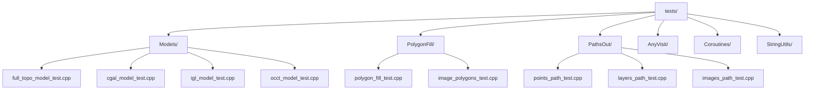

# Testing and Debugging

<cite>
**Referenced Files in This Document**   
- [full_topo_model_test.cpp](file://tests/Models/full_topo_model_test.cpp)
- [cpp_analyzer.py](file://static_check/cpp_analyzer.py)
- [cgal_model_test.cpp](file://tests/Models/cgal_model_test.cpp)
- [igl_model_test.cpp](file://tests/Models/igl_model_test.cpp)
- [occt_model_test.cpp](file://tests/Models/occt_model_test.cpp)
- [polygon_fill_test.cpp](file://tests/PolygonFill/polygon_fill_test.cpp)
- [points_path_test.cpp](file://tests/PathsOut/points_path_test.cpp)
- [anyvisit_test.cpp](file://tests/AnyVisit/anyvisit_test.cpp)
- [CMakeLists.txt](file://tests/CMakeLists.txt)
</cite>

## Table of Contents
1. [Unit Testing Framework](#unit-testing-framework)
2. [Test Organization and Structure](#test-organization-and-structure)
3. [Running Tests and Interpreting Results](#running-tests-and-interpreting-results)
4. [Static Analysis with cpp_analyzer.py](#static-analysis-with-cpp_analyzerpy)
5. [Debugging Strategies](#debugging-strategies)
6. [Test Coverage and Continuous Integration](#test-coverage-and-continuous-integration)
7. [Writing New Tests](#writing-new-tests)

## Unit Testing Framework

The HsBaSlicer project utilizes Boost.Test as its primary unit testing framework for validating core functionality across geometry processing, mesh operations, and path generation. The framework is integrated via the header-only variant `boost/test/included/unit_test.hpp`, which avoids linking complications while providing comprehensive assertion capabilities.

Key features of the Boost.Test implementation include:
- **Test suites** using `BOOST_AUTO_TEST_SUITE` to group related test cases
- **Test cases** defined with `BOOST_AUTO_TEST_CASE` for isolated functionality verification
- **Assertions** such as `BOOST_CHECK`, `BOOST_REQUIRE`, and `BOOST_CHECK_GT` for condition validation
- **Test messages** via `BOOST_TEST_MESSAGE` for debugging and traceability

The framework is configured with dynamic linking through the `BOOST_TEST_DYN_LINK` preprocessor definition, as specified in the CMakeLists.txt file. This approach ensures compatibility across different build configurations and platforms.

**Section sources**
- [full_topo_model_test.cpp](file://tests/Models/full_topo_model_test.cpp#L1-L167)
- [cgal_model_test.cpp](file://tests/Models/cgal_model_test.cpp#L1-L49)
- [anyvisit_test.cpp](file://tests/AnyVisit/anyvisit_test.cpp#L1-L134)

## Test Organization and Structure

Tests are organized in a modular hierarchy within the `tests/` directory, with subdirectories corresponding to functional components of the system. This organization enables focused testing and simplifies maintenance.

The primary test modules include:
- **Models**: Tests for mesh model implementations (CGAL, IGL, OCCT, FullTopoModel)
- **PolygonFill**: Validation of 2D polygon filling algorithms
- **PathsOut**: Verification of path generation and output formatting
- **AnyVisit**: Testing of type-agnostic visitation patterns
- **Coroutines**: Validation of asynchronous processing capabilities

Each test file typically includes:
1. A `BOOST_TEST_MODULE` definition specifying the test module name
2. Necessary header inclusions for the component under test
3. Test suite declarations using `BOOST_AUTO_TEST_SUITE`
4. Individual test cases that validate specific behaviors
5. Appropriate assertions to verify expected outcomes

Test fixtures are implemented through helper classes and functions within test files. For example, the `full_topo_model_test.cpp` file defines a `SimpleCubeModel` class that implements the `IModel` interface to provide a consistent test subject for slicing operations.



**Diagram sources**
- [CMakeLists.txt](file://tests/CMakeLists.txt#L1-L522)

**Section sources**
- [full_topo_model_test.cpp](file://tests/Models/full_topo_model_test.cpp#L1-L167)
- [polygon_fill_test.cpp](file://tests/PolygonFill/polygon_fill_test.cpp#L1-L117)
- [points_path_test.cpp](file://tests/PathsOut/points_path_test.cpp#L1-L188)

## Running Tests and Interpreting Results

Tests are integrated into the CMake build system and can be executed through multiple methods. The CMakeLists.txt file in the tests directory configures each test executable and registers it with CTest.

To run tests:
1. **Build the test targets**: Compile the project with the test configuration
2. **Execute via CTest**: Use `ctest` command in the build directory
3. **Run individual executables**: Execute test binaries directly

The CMake configuration includes custom commands that automatically run tests after build completion:
```cmake
add_custom_command(TARGET full_topo_model_test POST_BUILD
  COMMAND ${CMAKE_CTEST_COMMAND} -V -R full_topo_model_test
)
```

Test results are interpreted through Boost.Test's assertion system:
- **BOOST_CHECK**: Non-fatal assertion; continues execution after failure
- **BOOST_REQUIRE**: Fatal assertion; stops test execution on failure
- **BOOST_CHECK_GT/BOOST_CHECK_NE**: Specific condition checks (greater than, not equal)

When tests fail, detailed output indicates the failing assertion, file location, and line number. The verbose output mode (`-V` flag) provides comprehensive information about test execution flow and results.

**Section sources**
- [CMakeLists.txt](file://tests/CMakeLists.txt#L1-L522)
- [full_topo_model_test.cpp](file://tests/Models/full_topo_model_test.cpp#L1-L167)

## Static Analysis with cpp_analyzer.py

The project includes a comprehensive static analysis script `cpp_analyzer.py` that enforces code quality standards and detects potential issues before compilation. This Python-based analyzer performs multiple types of checks on C++ source files.

Key analysis features include:
- **Memory leak detection**: Identifies `new`/`malloc` allocations without corresponding `delete`/`free` within 20 lines
- **Unsafe function detection**: Flags use of deprecated functions like `gets`, `strcpy`, `sprintf`
- **Code complexity measurement**: Calculates cyclomatic complexity based on control flow statements
- **Namespace usage enforcement**: Prohibits `using namespace` directives (except for namespaces containing "Literals")
- **Exception handling validation**: Forbids `catch(...)` all-exception handlers
- **Magic number detection**: Identifies hard-coded numeric literals without context

The analyzer intelligently skips certain files and directories:
- Files in `tests/` and `examples/` directories are excluded
- Files matching patterns in `.gitignore` are ignored
- Only C/C++ source files (`.cpp`, `.h`, etc.) are analyzed

Configuration options allow customization:
- **Complexity threshold**: Default is 10, configurable via command line
- **Output format**: Console output or file-based reports
- **Path specification**: Can analyze individual files or entire directories

The script produces a detailed report with emoji indicators for different issue types:
- 💧 `potential_memory_leak`: Unreleased memory allocations
- 🚫 `unsafe_function`: Use of deprecated or unsafe functions
- 🔢 `magic_number`: Hard-coded numeric values
- ⚠️ `using_namespace`: Prohibited namespace directives
- 🌀 `high_complexity`: Functions exceeding complexity threshold

```mermaid
graph TD
Analyzer[cpp_analyzer.py] --> Gitignore[GitignoreMatcher]
Analyzer --> Memory[SmartMemoryLeakDetector]
Analyzer --> Main[CppStaticAnalyzer]
Gitignore --> ignored[ignored()]
Gitignore --> _load_patterns[_load_patterns()]
Memory --> check[check()]
Memory --> _find_allocs[_find_allocs()]
Memory --> _whole_word[_whole_word()]
Main --> analyze_file[analyze_file()]
Main --> run[run()]
Main --> complex[complex()]
Main --> _extract_braces[_extract_braces()]
Main --> Memory
Main --> Gitignore
```

**Diagram sources**
- [cpp_analyzer.py](file://static_check/cpp_analyzer.py#L1-L377)

**Section sources**
- [cpp_analyzer.py](file://static_check/cpp_analyzer.py#L1-L377)

## Debugging Strategies

Effective debugging in HsBaSlicer requires understanding both the geometric algorithms and the underlying data structures. The following strategies address common issues in slicing algorithms and geometry processing.

### Slicing Algorithm Debugging
For issues in mesh slicing operations:
1. **Validate input geometry**: Ensure the source mesh is manifold and properly oriented
2. **Check plane intersection**: Verify the slicing plane intersects the mesh bounds
3. **Inspect polygon generation**: Use visualization to confirm polygon connectivity and orientation

The `full_topo_model_test.cpp` demonstrates proper slicing validation:
```cpp
auto polys = topo.Slice(0.0f);
BOOST_CHECK(!polys.empty());
```

### Geometry Processing Debugging
For polygon and mesh processing issues:
1. **Verify coordinate systems**: Ensure consistent units and coordinate conventions
2. **Check algorithm boundaries**: Test edge cases like degenerate polygons
3. **Validate transformations**: Confirm matrix operations preserve geometric properties

The `polygon_fill_test.cpp` includes robust validation for fill algorithms:
```cpp
for (const auto &pt : pz) {
    Clipper2Lib::Point64 pv{ pt.x, pt.y };
    auto res = PointInPolygons(pv, poly);
    BOOST_CHECK(res != Clipper2Lib::PointInPolygonResult::IsOutside);
}
```

### General Debugging Techniques
- **Use BOOST_TEST_MESSAGE**: Insert diagnostic messages to trace execution flow
- **Compare with reference implementations**: Validate against known correct results
- **Test incremental complexity**: Start with simple cases before advancing to complex geometries
- **Leverage visualization**: Convert test outputs to visual formats when possible

**Section sources**
- [full_topo_model_test.cpp](file://tests/Models/full_topo_model_test.cpp#L1-L167)
- [polygon_fill_test.cpp](file://tests/PolygonFill/polygon_fill_test.cpp#L1-L117)
- [2D/2Dhull.cpp](file://2D/2Dhull.cpp#L128-L187)

## Test Coverage and Continuous Integration

The testing strategy emphasizes comprehensive coverage of core geometric operations and critical path algorithms. While formal coverage metrics are not explicitly configured, the test suite structure ensures validation across multiple dimensions.

### Coverage Goals
- **Core algorithms**: Slicing, polygon filling, boolean operations
- **Data transformations**: Coordinate conversions, unit handling
- **Edge cases**: Degenerate geometries, zero-thickness fills
- **Integration points**: Model loading, path generation, output formatting

The test organization by module ensures that each major component has dedicated test coverage:
- **Mesh models**: CGAL, IGL, OCCT implementations
- **2D operations**: Polygon filling, convex hull generation
- **Path generation**: G-code, robot-specific formats
- **Utility functions**: Type conversion, memory management

### Continuous Integration
Although GitHub Actions configuration was not found in the repository, the build system is designed for CI/CD integration:
- **CMake integration**: Tests are registered with CTest for automated execution
- **Cross-platform support**: CMakePresets.json includes configurations for Windows, Linux, macOS, and Android
- **Build automation**: Custom commands trigger test execution post-build

The static analysis script `cpp_analyzer.py` serves as a gatekeeper for code quality, preventing common issues from entering the codebase. This script can be integrated into CI pipelines to enforce coding standards.

**Section sources**
- [CMakeLists.txt](file://tests/CMakeLists.txt#L1-L522)
- [CMakePresets.json](file://CMakePresets.json#L1-L153)
- [cpp_analyzer.py](file://static_check/cpp_analyzer.py#L1-L377)

## Writing New Tests

Creating effective tests for extensions and bug fixes follows established patterns within the codebase. The following guidelines ensure consistency and effectiveness.

### Test Structure
New test files should follow the established template:
1. Define the test module: `#define BOOST_TEST_MODULE [ModuleName]Tests`
2. Include the Boost.Test header: `#include <boost/test/included/unit_test.hpp>`
3. Include component headers and dependencies
4. Define test suite: `BOOST_AUTO_TEST_SUITE([suite_name])`
5. Implement test cases: `BOOST_AUTO_TEST_CASE([test_name])`

### Test Case Design
Each test case should:
- **Focus on a single responsibility**: Test one specific behavior
- **Use descriptive names**: Clearly indicate what is being tested
- **Include proper assertions**: Use appropriate BOOST_CHECK variants
- **Clean up resources**: Ensure no side effects on subsequent tests

Example from `cgal_model_test.cpp`:
```cpp
BOOST_AUTO_TEST_CASE(create_box_and_trianglemesh)
{
    auto box = CgalModel::CreateBox(Eigen::Vector3f{1.0f,1.0f,1.0f});
    auto [v,f] = box.TriangleMesh();
    BOOST_CHECK(v.rows() > 0);
    BOOST_CHECK(f.rows() > 0);
    float vol = box.Volume();
    BOOST_CHECK(vol > 0.0f);
}
```

### Special Considerations
- **Boolean operations**: Guard with `#ifndef DISABLE_BOOLEAN_OPERATIONS_TESTS` in debug builds
- **External dependencies**: Conditionally compile tests based on available libraries
- **Performance**: Avoid excessive computation in test cases
- **Determinism**: Ensure tests produce consistent results across runs

When fixing bugs, create regression tests that reproduce the issue before implementing the fix. This ensures the problem is properly understood and prevents future recurrence.

**Section sources**
- [cgal_model_test.cpp](file://tests/Models/cgal_model_test.cpp#L1-L49)
- [igl_model_test.cpp](file://tests/Models/igl_model_test.cpp#L1-L67)
- [occt_model_test.cpp](file://tests/Models/occt_model_test.cpp#L1-L47)
- [CMakeLists.txt](file://tests/CMakeLists.txt#L1-L522)