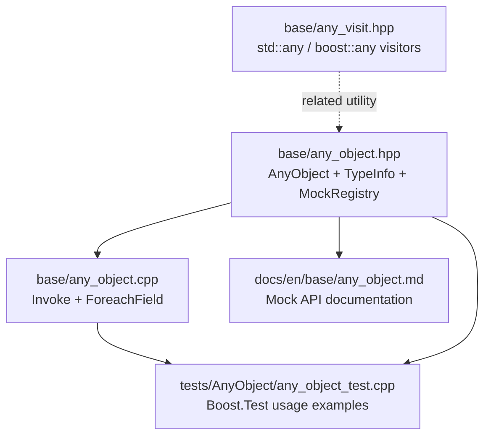
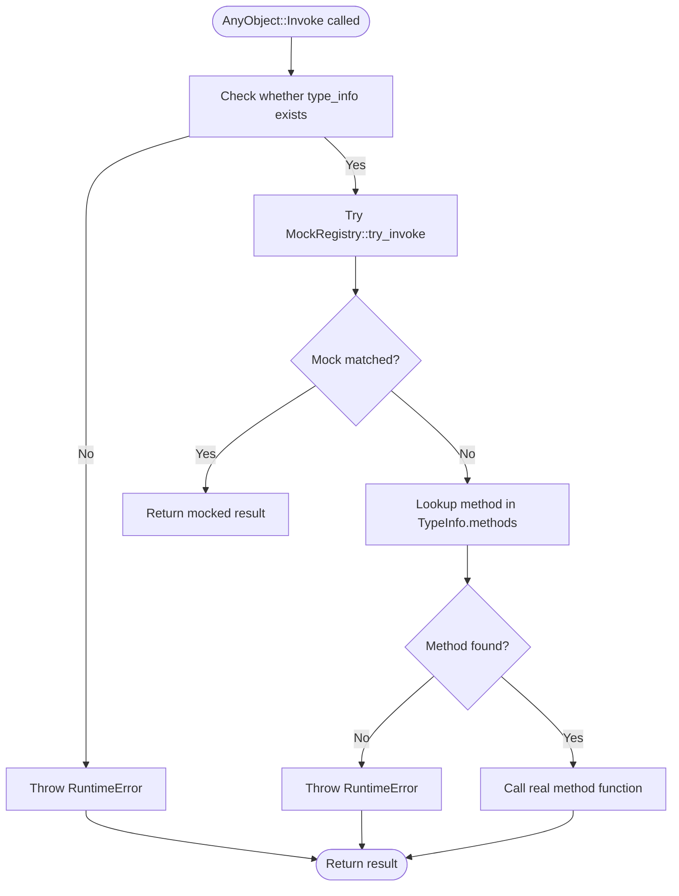
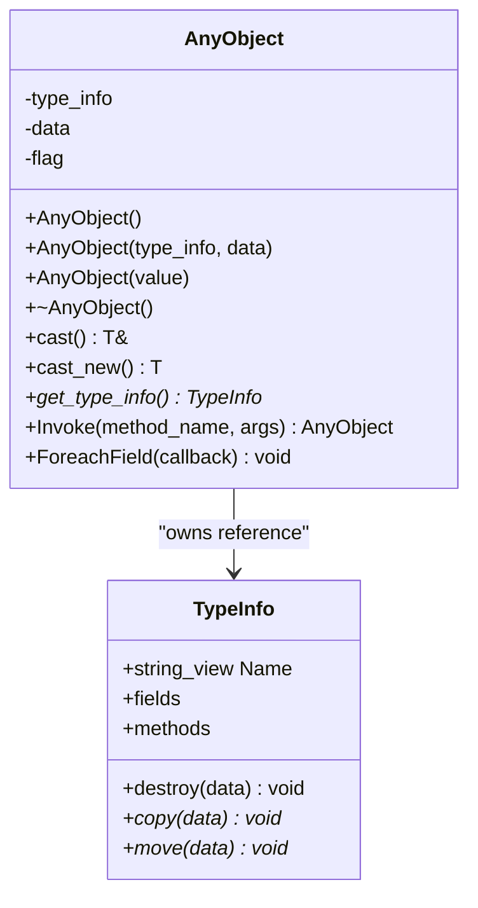
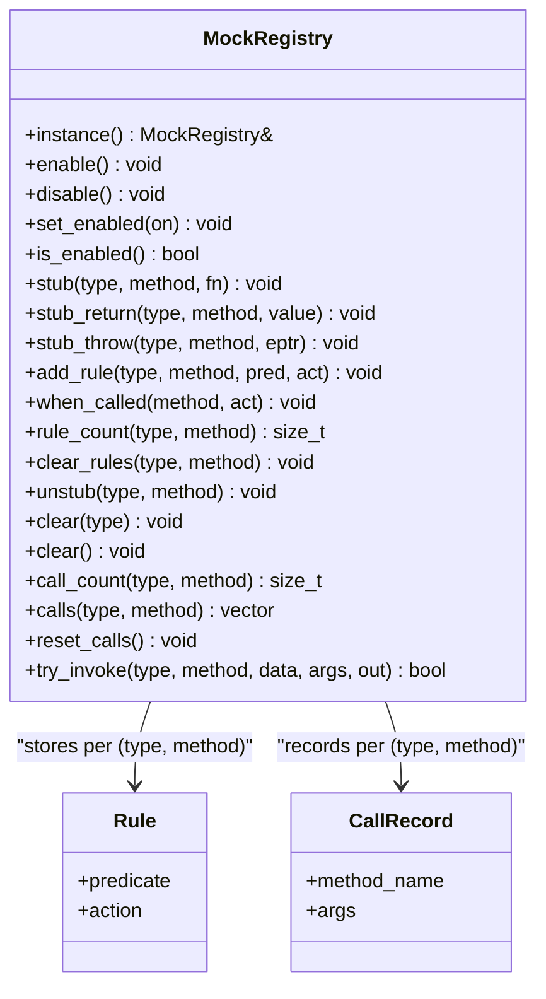
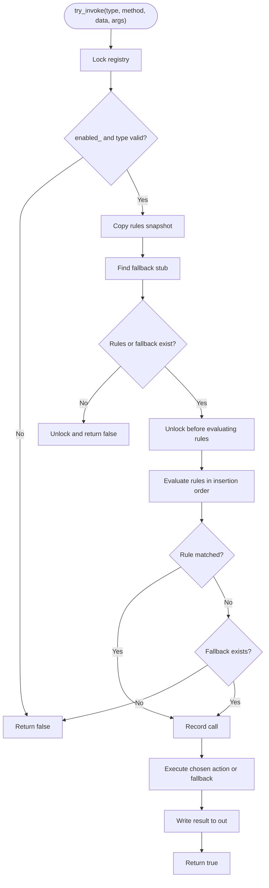
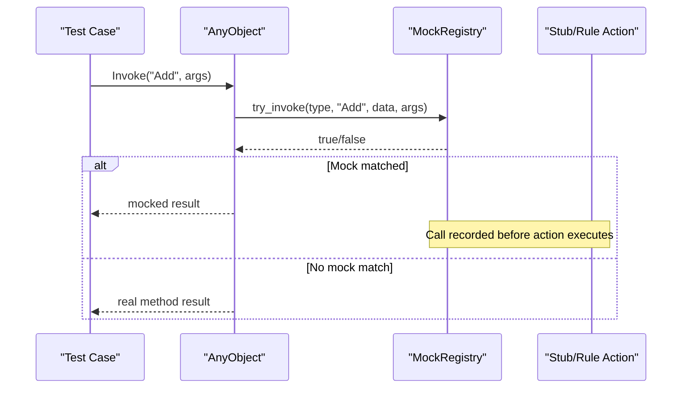
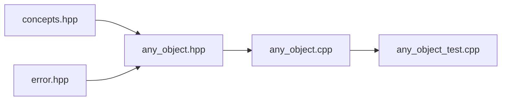

# AnyObject Mock Testing Framework

<cite>
**Referenced Files in This Document**
- [any_object.hpp](file://base/any_object.hpp)
- [any_object.cpp](file://base/any_object.cpp)
- [any_visit.hpp](file://base/any_visit.hpp)
- [any_object_test.cpp](file://tests/AnyObject/any_object_test.cpp)
</cite>

## Table of Contents
1. [Introduction](#introduction)
2. [Project Structure](#project-structure)
3. [Core Components](#core-components)
4. [Architecture Overview](#architecture-overview)
5. [Detailed Component Analysis](#detailed-component-analysis)
6. [Dependency Analysis](#dependency-analysis)
7. [Performance Considerations](#performance-considerations)
8. [Troubleshooting Guide](#troubleshooting-guide)
9. [Conclusion](#conclusion)

## Introduction
This document explains the **AnyObject Mock Testing Framework** implemented around the `HsBa::Slicer::Utils::AnyObject` runtime reflection and dynamic invocation system. It focuses on how tests can intercept method calls, install stubs, define argument-based rules, record invocations, and safely isolate test state without affecting production code.

The framework is intentionally lightweight:
- It integrates with existing `AnyObject` type registration and method dispatch.
- Mocking code is compiled only when a test-framework macro or an explicit flag is present.
- Even when compiled in, mocking is disabled by default at runtime.
- The global mock registry is thread-safe and supports RAII helpers for test isolation.

## Project Structure
The relevant implementation lives under the base library and its tests:

**Diagram sources**
- [any_object.hpp:43-109](file://base/any_object.hpp#L43-L109)
- [any_object.cpp:72-103](file://base/any_object.cpp#L72-L103)
- [any_object_test.cpp:1-10](file://tests/AnyObject/any_object_test.cpp#L1-L10)

**Section sources**
- [any_object.hpp:1-45](file://base/any_object.hpp#L1-L45)
- [any_object.cpp:1-10](file://base/any_object.cpp#L1-L10)
- [any_object_test.cpp:1-10](file://tests/AnyObject/any_object_test.cpp#L1-L10)

## Core Components
The mock testing capability is built on top of three main ideas:

1. **Type information and dynamic dispatch**
   - `TypeInfo` describes a registered C++ type: name, destroy/copy/move callbacks, fields, and methods.
   - `AnyObject` stores a typed pointer and exposes `cast`, `cast_new`, `ForeachField`, and `Invoke`.

2. **Mock registry**
   - `MockRegistry` is a global singleton that stores:
     - Plain stubs keyed by `(TypeInfo*, method_name)`.
     - Argument-dependent rules with predicates and actions.
     - Recorded call history.
   - It provides enable/disable APIs, RAII scopes, and inspection helpers.

3. **Action and predicate factories**
   - Actions return `AnyObject`, throw exceptions, or execute user logic.
   - Predicates describe matching conditions on the argument list passed to `Invoke`.

**Section sources**
- [any_object.hpp:46-109](file://base/any_object.hpp#L46-L109)
- [any_object.hpp:111-650](file://base/any_object.hpp#L111-L650)
- [any_object.cpp:72-103](file://base/any_object.cpp#L72-L103)

## Architecture Overview
At runtime, `AnyObject::Invoke` follows this flow:

**Diagram sources**
- [any_object.cpp:82-103](file://base/any_object.cpp#L82-L103)
- [any_object.hpp:495-559](file://base/any_object.hpp#L495-L559)

### Mock Activation Rules
Mock support is gated by a compile-time macro:

- If `HSBA_ANY_OBJECT_ENABLE_MOCK` is defined, the `Mock` namespace and registry are included.
- If not defined, but one of several common test-framework macros is visible, it is auto-enabled.
- When enabled, mocking is still **disabled by default** at runtime.

This means:
- Production builds without test macros have no mock overhead.
- Test builds can opt into automatic detection or explicitly define the macro.
- Tests can manually toggle mocking even if it was compiled in.

**Section sources**
- [any_object.hpp:25-41](file://base/any_object.hpp#L25-L41)
- [any_object.hpp:111-111](file://base/any_object.hpp#L111-L111)

## Detailed Component Analysis

### AnyObject and TypeInfo
`AnyObject` is a small value-like wrapper around a `TypeInfo*` and a raw `void*`:

- Construction from arbitrary types registers or reuses `TypeInfo`.
- Copy/move semantics use the type’s destroy/copy/move callbacks.
- `cast<T>()` and `cast_new<T>()` perform type-checked access.
- `ForeachField` iterates over registered fields.
- `Invoke` performs dynamic method dispatch and optional mock interception.

**Diagram sources**
- [any_object.hpp:46-109](file://base/any_object.hpp#L46-L109)
- [any_object.cpp:5-70](file://base/any_object.cpp#L5-L70)

**Section sources**
- [any_object.hpp:46-109](file://base/any_object.hpp#L46-L109)
- [any_object.cpp:5-70](file://base/any_object.cpp#L5-L70)

### Mock Registry and Dispatch
`MockRegistry` is the core of the mock testing framework. Its responsibilities include:

- Enabling/disabling mocking globally.
- Installing plain stubs for `(TypeInfo*, method_name)`.
- Registering argument-dependent rules.
- Recording calls when a mock handles them.
- Providing inspection APIs such as `call_count`, `calls`, and `reset_calls`.
- Offering RAII helpers `ScopedEnable` and `ScopedStubs`.

**Diagram sources**
- [any_object.hpp:111-145](file://base/any_object.hpp#L111-L145)
- [any_object.hpp:270-609](file://base/any_object.hpp#L270-L609)

#### try_invoke Flow
`try_invoke` implements the mock decision logic:

**Diagram sources**
- [any_object.hpp:495-559](file://base/any_object.hpp#L495-L559)

**Section sources**
- [any_object.hpp:270-609](file://base/any_object.hpp#L270-L609)
- [any_object.cpp:82-103](file://base/any_object.cpp#L82-L103)

### Action and Predicate Factories
Actions and predicates make mock behavior expressive:

- **Actions**:
  - `Return(value)` returns a fixed value wrapped in `AnyObject`.
  - `Throw(std::exception_ptr)` rethrows an exception.
  - `ThrowOf<E, Args...>(args...)` constructs and throws an exception every time.
  - `Do(callable)` wraps custom logic that receives `self` and arguments.

- **Predicates**:
  - `AnyArgs()` always matches.
  - `ArgCountIs(n)` checks argument count.
  - `ArgAtIs<V>(index, expected)` compares a casted argument.
  - `ArgAtMatches<V>(index, unary_pred)` applies a user predicate.
  - `AllOf`, `AnyOf`, `Not` compose predicates.

These are used through `add_rule`, `when_called`, and free-function shortcuts like `StubMethod`, `StubReturn`, `StubThrow`, and `WhenCalled`.

**Section sources**
- [any_object.hpp:147-253](file://base/any_object.hpp#L147-L253)
- [any_object.hpp:611-650](file://base/any_object.hpp#L611-L650)

### Test Usage Patterns
The Boost.Test file demonstrates realistic mock scenarios:

1. **Manual toggle**
   - Disables mocking by default.
   - Installs a stub but keeps mocking off so the real method runs.
   - Enables mocking so the stub takes over.
   - Uses `ScopedEnable` to restore previous state.

2. **Scoped isolation**
   - `ScopedStubs` clears all mocks, enables mocking, and restores state after the scope.
   - Verifies call counts and recorded arguments.

3. **Throwing stubs**
   - Uses `stub_throw` with `std::exception_ptr`.
   - Uses `stub_throw<T, E, Args...>` to construct exceptions.
   - Confirms that thrown exceptions are still recorded.

4. **Argument-dependent rules**
   - Registers multiple rules with different predicates.
   - Falls back to a plain stub when no rule matches.
   - Demonstrates rule precedence and helper predicates.

5. **Predicate composition**
   - Uses `AllOf`, `AnyOf`, and `Not`.
   - Uses `Do` to mutate the underlying object via `self`.

**Diagram sources**
- [any_object.cpp:82-103](file://base/any_object.cpp#L82-L103)
- [any_object.hpp:495-559](file://base/any_object.hpp#L495-L559)
- [any_object_test.cpp:188-372](file://tests/AnyObject/any_object_test.cpp#L188-L372)

**Section sources**
- [any_object_test.cpp:188-372](file://tests/AnyObject/any_object_test.cpp#L188-L372)

### Related Utilities
`any_visit.hpp` provides visitor utilities for `std::any` and `boost::any`. While not part of the mock system itself, it belongs to the same runtime-type-handling ecosystem and shows how the project handles heterogeneous values elsewhere.

**Section sources**
- [any_visit.hpp:1-118](file://base/any_visit.hpp#L1-L118)

## Dependency Analysis
The mock framework depends on:

- `TypeInfo` and `AnyObject` for type identity and method dispatch.
- `error.hpp` for `RuntimeError`.
- Standard library containers and synchronization primitives.
- Optional test-framework macros for automatic activation.

**Diagram sources**
- [any_object.hpp:22-24](file://base/any_object.hpp#L22-L24)
- [any_object.cpp:1-1](file://base/any_object.cpp#L1-L1)
- [any_object_test.cpp:1-6](file://tests/AnyObject/any_object_test.cpp#L1-L6)

**Section sources**
- [any_object.hpp:22-24](file://base/any_object.hpp#L22-L24)
- [any_object.cpp:1-1](file://base/any_object.cpp#L1-L1)

## Performance Considerations
- **Production builds without mock support**: zero additional overhead because the `Mock` namespace and registry are not compiled.
- **Builds with mock support but mocking disabled**: `AnyObject::Invoke` still performs a small registry check; however, the design avoids heavy work when disabled.
- **Thread safety**: the registry uses a mutex around shared state. Predicates and actions are evaluated outside the lock to avoid deadlocks with user callbacks.
- **Call recording**: only calls handled by a mock are recorded, reducing unnecessary allocation when falling through to real methods.
- **Rule evaluation**: rules are copied into a snapshot while holding the lock, then evaluated without the lock. This improves concurrency but increases memory use proportional to the number of rules.

Recommendations:
- Prefer `ScopedStubs` in tests to keep mock state isolated and minimal.
- Avoid registering very large numbers of rules for the same method unless necessary.
- Keep predicate lambdas cheap and exception-free where possible.
- Do not rely on mock state across unrelated test cases; always clear or scope mocks.

[No sources needed since this section provides general guidance]

## Troubleshooting Guide

### Mocking Does Not Take Effect
Possible causes:
- Mocking is disabled at runtime.
- The stub was installed for the wrong type or method name.
- A more specific rule did not match, so the fallback stub or real method ran instead.

Checks:
- Verify `Mock::IsMockEnabled()` or `MockRegistry::is_enabled()`.
- Confirm the type used in `stub<T>` matches the `AnyObject`’s registered type.
- Inspect `rule_count<T>(method_name)` and `call_count<T>(method_name)`.

**Section sources**
- [any_object.hpp:279-300](file://base/any_object.hpp#L279-L300)
- [any_object.hpp:380-411](file://base/any_object.hpp#L380-L411)
- [any_object.hpp:446-478](file://base/any_object.hpp#L446-L478)

### Exception Thrown from Mocked Call Is Not Recorded
This should not happen under normal circumstances:
- Calls are recorded before the chosen action executes.
- Even if the action throws, the call record exists.

If assertions fail:
- Ensure the call actually matched a rule or stub.
- Check that mocking was enabled during the call.
- Verify that `reset_calls()` was not called between the call and the assertion.

**Section sources**
- [any_object.hpp:540-548](file://base/any_object.hpp#L540-L548)
- [any_object_test.cpp:272-273](file://tests/AnyObject/any_object_test.cpp#L272-L273)

### Test State Leaks Between Cases
Symptoms:
- A later test sees unexpected stubs or call counts.
- Mocking appears enabled unexpectedly.

Fixes:
- Wrap each test case in `Mock::MockRegistry::ScopedStubs`.
- Or explicitly call `ClearMocks()` in setup/teardown.
- Avoid sharing mutable state through the global registry across unrelated tests.

**Section sources**
- [any_object.hpp:578-600](file://base/any_object.hpp#L578-L600)
- [any_object_test.cpp:229-250](file://tests/AnyObject/any_object_test.cpp#L229-L250)

### Rule Does Not Match Expected Arguments
Common issues:
- Wrong argument index.
- Stored type does not match the predicate’s template type.
- Argument count mismatch.

Behavior:
- `ArgAtIs` and `ArgAtMatches` return `false` instead of throwing when the stored type mismatches or the index is out of range.
- Use `ArgCountIs` first when argument count varies.

**Section sources**
- [any_object.hpp:194-233](file://base/any_object.hpp#L147-L253)
- [any_object_test.cpp:294-330](file://tests/AnyObject/any_object_test.cpp#L294-L330)

## Conclusion
The AnyObject Mock Testing Framework extends `AnyObject` with a flexible, test-focused stubbing layer. It preserves production performance by gating mock code behind compile-time flags, defaults to disabling mocking at runtime, and provides a rich set of actions, predicates, and RAII helpers for safe, isolated unit tests.

For most test scenarios:
- Use `ScopedStubs` for automatic cleanup.
- Prefer argument-dependent rules for precise behavior.
- Fall back to plain stubs for simple constant-return or throw behavior.
- Inspect call records to verify interactions.

[No sources needed since this section summarizes without analyzing specific files]