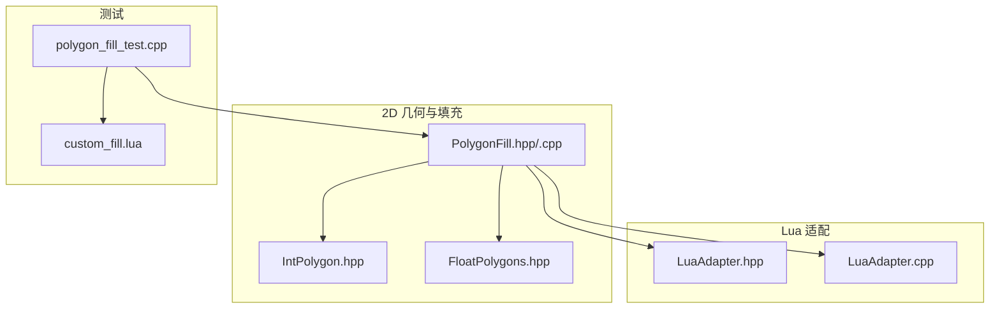
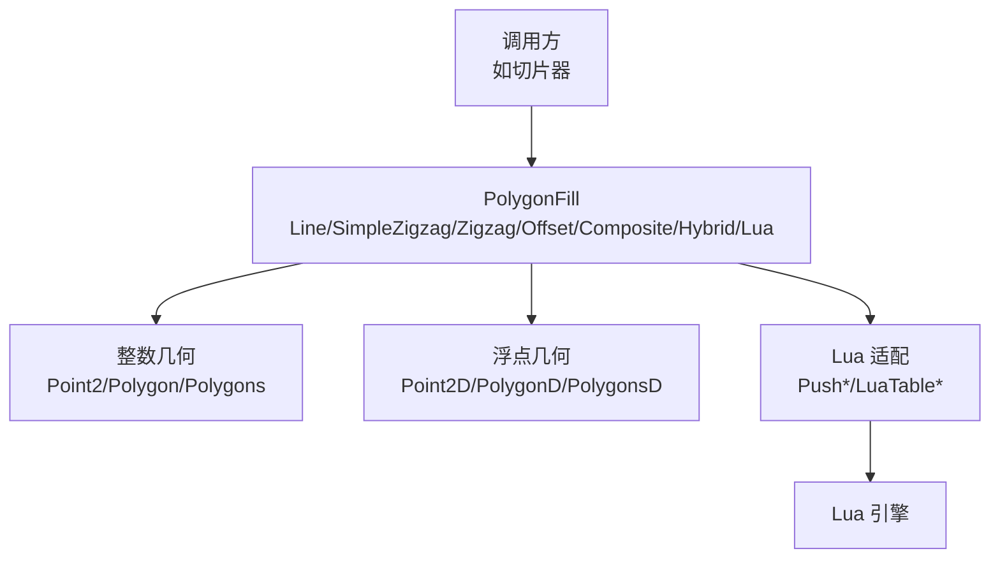
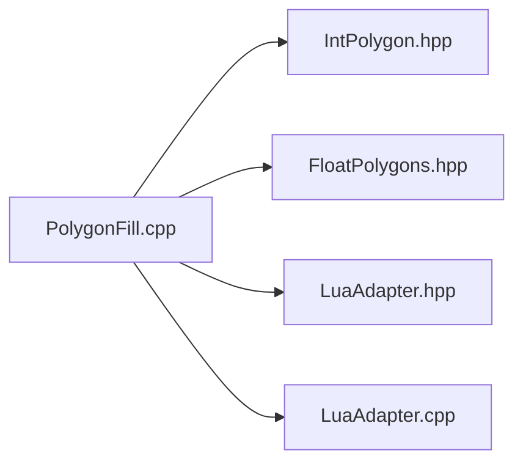
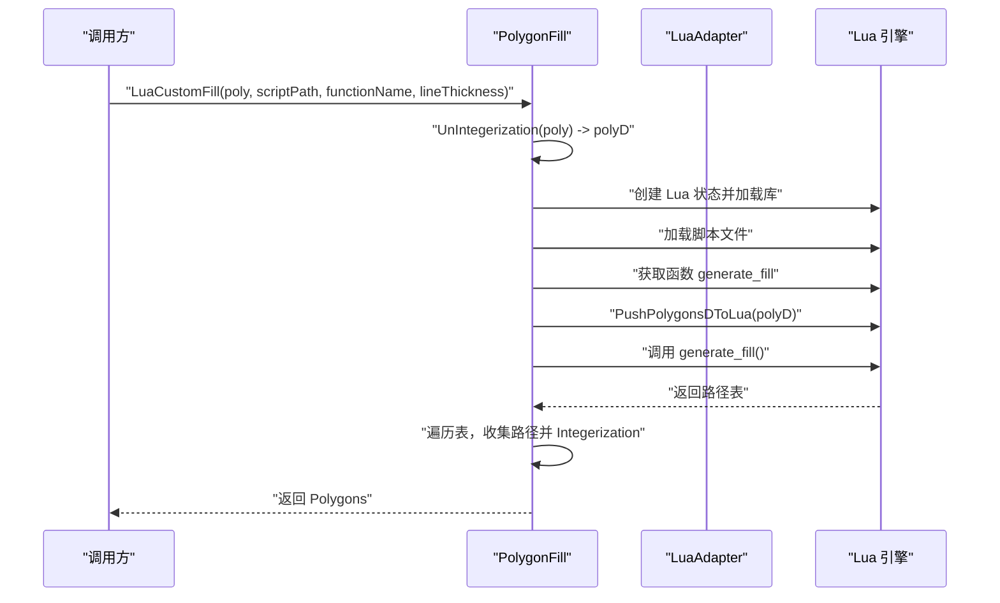
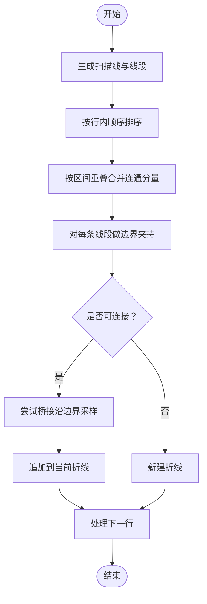

# 多边形填充算法

<cite>
**本文引用的文件列表**
- [PolygonFill.hpp](file://2D/PolygonFill.hpp)
- [PolygonFill.cpp](file://2D/PolygonFill.cpp)
- [IntPolygon.hpp](file://2D/IntPolygon.hpp)
- [FloatPolygons.hpp](file://2D/FloatPolygons.hpp)
- [LuaAdapter.hpp](file://2D/LuaAdapter.hpp)
- [LuaAdapter.cpp](file://2D/LuaAdapter.cpp)
- [polygon_fill_test.cpp](file://tests/PolygonFill/polygon_fill_test.cpp)
- [custom_fill.lua](file://tests/PolygonFill/custom_fill.lua)
</cite>

## 目录
1. [简介](#简介)
2. [项目结构](#项目结构)
3. [核心组件](#核心组件)
4. [架构总览](#架构总览)
5. [详细组件分析](#详细组件分析)
6. [依赖关系分析](#依赖关系分析)
7. [性能考量](#性能考量)
8. [故障排查指南](#故障排查指南)
9. [结论](#结论)
10. [附录](#附录)

## 简介
本文件为 HsBaSlicer 的 2D 路径填充模块（PolygonFill）提供完整 API 参考与实现解析。重点覆盖以下算法族：
- 扫描线填充：LineFill（直线扫描）
- 之字形填充：SimpleZigzagFill（简单之字形）、ZigzagFill（优化之字形）
- 偏移填充：OffsetFill（按间距向外/内偏移）
- 复合与混合策略：CompositeOffsetFill（偏移后对各岛填充）、HybridFill（先偏移再对最内层填充）
- 自定义扩展：LuaCustomFill 与 LuaCustomFillString（通过 Lua 脚本生成填充路径）

文档同时说明参数作用、路径连续性差异、连接处形状控制、线程安全注意事项，并给出典型调用示例与在切片流程中的位置说明。

## 项目结构
- 2D/PolygonFill.hpp：声明所有填充算法的公共 API
- 2D/PolygonFill.cpp：包含算法实现、Lua 包装、内部工具函数
- 2D/IntPolygon.hpp 与 2D/FloatPolygons.hpp：整数/浮点几何类型与布尔运算、偏移、面积等基础能力
- 2D/LuaAdapter.hpp 与 2D/LuaAdapter.cpp：Lua 与 C++ 的数据互操作（表到几何对象的转换、注册全局库）
- tests/PolygonFill/*：单元测试与示例脚本，验证行为与用法

图表来源
- [PolygonFill.hpp](file://2D/PolygonFill.hpp#L1-L46)
- [PolygonFill.cpp](file://2D/PolygonFill.cpp#L1-L120)
- [IntPolygon.hpp](file://2D/IntPolygon.hpp#L1-L75)
- [FloatPolygons.hpp](file://2D/FloatPolygons.hpp#L1-L72)
- [LuaAdapter.hpp](file://2D/LuaAdapter.hpp#L1-L25)
- [LuaAdapter.cpp](file://2D/LuaAdapter.cpp#L1-L120)
- [polygon_fill_test.cpp](file://tests/PolygonFill/polygon_fill_test.cpp#L1-L117)
- [custom_fill.lua](file://tests/PolygonFill/custom_fill.lua#L1-L16)

章节来源
- [PolygonFill.hpp](file://2D/PolygonFill.hpp#L1-L46)
- [PolygonFill.cpp](file://2D/PolygonFill.cpp#L1-L120)
- [IntPolygon.hpp](file://2D/IntPolygon.hpp#L1-L75)
- [FloatPolygons.hpp](file://2D/FloatPolygons.hpp#L1-L72)
- [LuaAdapter.hpp](file://2D/LuaAdapter.hpp#L1-L25)
- [LuaAdapter.cpp](file://2D/LuaAdapter.cpp#L1-L120)
- [polygon_fill_test.cpp](file://tests/PolygonFill/polygon_fill_test.cpp#L1-L117)
- [custom_fill.lua](file://tests/PolygonFill/custom_fill.lua#L1-L16)

## 核心组件
- 数据结构
  - 整数几何：Point2、Polygon（Path64）、Polygons（Paths64）
  - 浮点几何：Point2D、PolygonD（PathD）、PolygonsD（PathsD）
  - 偏移与布尔运算：Offset、Union、Intersection、Difference、Xor
- 填充算法族
  - LineFill：扫描线直段填充
  - SimpleZigzagFill：按行连接中心的简单之字形路径
  - ZigzagFill：基于连通分量与桥接的优化之字形路径
  - OffsetFill：按间距进行内外偏移，返回闭合路径
  - CompositeOffsetFill：先对原多边形填充，再对外/内偏移层逐层填充
  - HybridFill：先偏移外层，再对最内层有效区域进行填充
  - LuaCustomFill/LuaCustomFillString：通过 Lua 脚本生成自定义路径集合

章节来源
- [IntPolygon.hpp](file://2D/IntPolygon.hpp#L1-L75)
- [FloatPolygons.hpp](file://2D/FloatPolygons.hpp#L1-L72)
- [PolygonFill.hpp](file://2D/PolygonFill.hpp#L12-L42)

## 架构总览
下图展示了填充算法在几何与 Lua 适配之间的交互关系，以及测试如何驱动这些 API：

图表来源
- [PolygonFill.cpp](file://2D/PolygonFill.cpp#L1-L120)
- [IntPolygon.hpp](file://2D/IntPolygon.hpp#L1-L75)
- [FloatPolygons.hpp](file://2D/FloatPolygons.hpp#L1-L72)
- [LuaAdapter.hpp](file://2D/LuaAdapter.hpp#L1-L25)
- [LuaAdapter.cpp](file://2D/LuaAdapter.cpp#L1-L120)

## 详细组件分析

### LineFill（直线扫描式填充）
- 功能概述
  - 沿指定角度生成一系列平行线，计算与目标多边形的交集，得到一组线段（每条线段由两个端点组成），作为填充路径。
- 关键参数
  - spacing：扫描线间距
  - angle_deg：扫描方向角度（度）
  - lineThickness：线宽（用于扫描矩形宽度，但 LineFill 实际上不使用该值进行路径连接）
- 输出
  - 返回 Polygons，每个 Polygon 含两个点，表示一条线段
- 典型调用示例（路径）
  - [polygon_fill_test.cpp](file://tests/PolygonFill/polygon_fill_test.cpp#L22-L30)
- 在切片流程中的位置
  - 通常用于快速填充或作为复合策略的基础填充模式之一

章节来源
- [PolygonFill.hpp](file://2D/PolygonFill.hpp#L16-L18)
- [PolygonFill.cpp](file://2D/PolygonFill.cpp#L420-L439)
- [polygon_fill_test.cpp](file://tests/PolygonFill/polygon_fill_test.cpp#L22-L30)

### SimpleZigzagFill（简单之字形填充）
- 功能概述
  - 使用扫描线方法生成线段，然后在同一行或相邻行之间连接这些线段，形成连续的折线路径（polyline），路径由多个点组成。
- 关键参数
  - spacing：扫描线间距
  - angle_deg：扫描方向角度（度）
  - lineThickness：线宽（影响扫描矩形厚度）
- 连续性
  - 同一行或相邻行之间连接，避免跨多行的环路，保证路径连续且无交叉回路
- 输出
  - 返回 Polygons，每个 Polygon 是一条连续折线（多点序列）
- 典型调用示例（路径）
  - [polygon_fill_test.cpp](file://tests/PolygonFill/polygon_fill_test.cpp#L31-L56)
- 在切片流程中的位置
  - 适合需要连续路径的打印场景，减少回程移动

章节来源
- [PolygonFill.hpp](file://2D/PolygonFill.hpp#L19-L21)
- [PolygonFill.cpp](file://2D/PolygonFill.cpp#L441-L609)
- [polygon_fill_test.cpp](file://tests/PolygonFill/polygon_fill_test.cpp#L31-L56)

### ZigzagFill（优化之字形填充）
- 功能概述
  - 基于扫描线生成线段后，按行内排序，利用连通分量合并（同一连通域内的线段视为可连接），并通过桥接（bridge）在相邻行间建立连接，最终生成多条连续路径。
- 关键参数
  - spacing：扫描线间距
  - angle_deg：扫描方向角度（度）
  - lineThickness：线宽（影响扫描矩形厚度）
- 连续性
  - 通过连通域与桥接策略，尽可能保持路径连续，避免不必要的断开
- 输出
  - 返回 Polygons，每条路径为连续折线或多段折线
- 典型调用示例（路径）
  - [polygon_fill_test.cpp](file://tests/PolygonFill/polygon_fill_test.cpp#L45-L56)
- 在切片流程中的位置
  - 更优的路径连续性，适合高精度打印

章节来源
- [PolygonFill.hpp](file://2D/PolygonFill.hpp#L22-L24)
- [PolygonFill.cpp](file://2D/PolygonFill.cpp#L611-L970)
- [polygon_fill_test.cpp](file://tests/PolygonFill/polygon_fill_test.cpp#L45-L56)

### OffsetFill（偏移填充）
- 功能概述
  - 按指定间距反复向外/内偏移原多边形，每次偏移结果作为独立路径返回；连接处采用 JoinType 控制（Square/Bevel/Round/Miter）。
- 关键参数
  - spacing：偏移步长
  - join_type：连接类型（Square/Bevel/Round/Miter）
- 输出
  - 返回 Polygons，每条路径为闭合环（起点等于终点）
- 典型调用示例（路径）
  - [polygon_fill_test.cpp](file://tests/PolygonFill/polygon_fill_test.cpp#L70-L77)
- 在切片流程中的位置
  - 作为基础填充手段，常与其他策略组合使用

章节来源
- [PolygonFill.hpp](file://2D/PolygonFill.hpp#L12-L14)
- [PolygonFill.cpp](file://2D/PolygonFill.cpp#L395-L418)
- [polygon_fill_test.cpp](file://tests/PolygonFill/polygon_fill_test.cpp#L70-L77)

### CompositeOffsetFill（复合偏移填充）
- 功能概述
  - 先对原始多边形进行一次填充（由 FillMode 指定：Line/SimpleZigzag/Zigzag），随后对外/内偏移若干层，每层都应用同样的填充策略，最后合并所有路径。
- 关键参数
  - spacing：扫描/之字形填充的间距
  - offsetStep：偏移步长
  - outwardCount/inwardCount：向外/向内偏移层数
  - mode：填充模式（Line/SimpleZigzag/Zigzag）
  - angle_deg：扫描方向角度（度）
  - lineThickness：线宽
  - join_type：连接类型（Square/Bevel/Round/Miter）
- 适用场景
  - 需要“先填充主体，再围绕轮廓逐层填充”的复合效果
- 典型调用示例（路径）
  - [polygon_fill_test.cpp](file://tests/PolygonFill/polygon_fill_test.cpp#L70-L77)
- 在切片流程中的位置
  - 适合需要多层路径覆盖的打印任务

章节来源
- [PolygonFill.hpp](file://2D/PolygonFill.hpp#L27-L31)
- [PolygonFill.cpp](file://2D/PolygonFill.cpp#L972-L1021)
- [polygon_fill_test.cpp](file://tests/PolygonFill/polygon_fill_test.cpp#L70-L77)

### HybridFill（混合填充）
- 功能概述
  - 先按 outwardCount 逐步向外偏移，收集外层闭合路径；随后按 inwardCount 从外向内检查有效内层区域，对最后一个有效内层进行填充；中间层可能仅用于路径收集。
- 关键参数
  - spacing：扫描/之字形填充的间距
  - offsetStep：偏移步长
  - outwardCount/inwardCount：向外/向内偏移层数
  - mode：填充模式（Line/SimpleZigzag/Zigzag）
  - angle_deg：扫描方向角度（度）
  - lineThickness：线宽
  - join_type：连接类型（Square/Bevel/Round/Miter）
- 适用场景
  - 先生成外轮廓路径，再对最内层有效区域进行精细填充
- 典型调用示例（路径）
  - [polygon_fill_test.cpp](file://tests/PolygonFill/polygon_fill_test.cpp#L78-L90)
- 在切片流程中的位置
  - 适合需要外轮廓路径与内层填充结合的打印任务

章节来源
- [PolygonFill.hpp](file://2D/PolygonFill.hpp#L33-L36)
- [PolygonFill.cpp](file://2D/PolygonFill.cpp#L1023-L1080)
- [polygon_fill_test.cpp](file://tests/PolygonFill/polygon_fill_test.cpp#L78-L90)

### LuaCustomFill 与 LuaCustomFillString（Lua 自定义填充）
- 功能概述
  - 通过 Lua 脚本生成自定义填充路径集合。支持从文件加载脚本（LuaCustomFill）或直接传入脚本字符串（LuaCustomFillString）。脚本需导出一个名为 generate_fill 的函数，接收多边形与线宽参数，返回路径数组。
- 关键参数
  - scriptPath：脚本文件路径（LuaCustomFill）
  - script：脚本字符串（LuaCustomFillString）
  - functionName：函数名，默认 generate_fill
  - lineThickness：线宽（传递给脚本）
- Lua 适配
  - 提供 PolygonOperations 与 PolygonFill 两组全局库，便于在脚本中进行几何运算与填充调用
- 线程安全
  - Lua 状态机在函数内部创建与销毁，避免跨线程共享状态；但若在多线程环境中重复创建/销毁 Lua 状态，请注意资源管理成本
- 典型调用示例（路径）
  - [polygon_fill_test.cpp](file://tests/PolygonFill/polygon_fill_test.cpp#L92-L116)
  - [custom_fill.lua](file://tests/PolygonFill/custom_fill.lua#L1-L16)
- 在切片流程中的位置
  - 作为可插拔的填充策略，适合复杂或定制化的填充需求

章节来源
- [PolygonFill.hpp](file://2D/PolygonFill.hpp#L38-L42)
- [PolygonFill.cpp](file://2D/PolygonFill.cpp#L1082-L1240)
- [LuaAdapter.hpp](file://2D/LuaAdapter.hpp#L1-L25)
- [LuaAdapter.cpp](file://2D/LuaAdapter.cpp#L1-L120)
- [polygon_fill_test.cpp](file://tests/PolygonFill/polygon_fill_test.cpp#L92-L116)
- [custom_fill.lua](file://tests/PolygonFill/custom_fill.lua#L1-L16)

## 依赖关系分析

图表来源
- [PolygonFill.cpp](file://2D/PolygonFill.cpp#L1-L120)
- [IntPolygon.hpp](file://2D/IntPolygon.hpp#L1-L75)
- [FloatPolygons.hpp](file://2D/FloatPolygons.hpp#L1-L72)
- [LuaAdapter.hpp](file://2D/LuaAdapter.hpp#L1-L25)
- [LuaAdapter.cpp](file://2D/LuaAdapter.cpp#L1-L120)

章节来源
- [PolygonFill.cpp](file://2D/PolygonFill.cpp#L1-L120)
- [IntPolygon.hpp](file://2D/IntPolygon.hpp#L1-L75)
- [FloatPolygons.hpp](file://2D/FloatPolygons.hpp#L1-L72)
- [LuaAdapter.hpp](file://2D/LuaAdapter.hpp#L1-L25)
- [LuaAdapter.cpp](file://2D/LuaAdapter.cpp#L1-L120)

## 性能考量
- 扫描线与之字形填充
  - 时间复杂度与多边形顶点数、扫描线数量成正比；之字形优化通过连通域与桥接减少断开，提高路径连续性，但会增加额外的区间重叠判断与桥接计算
- 偏移填充
  - 外/内偏移层数越多，计算量越大；JoinType（Square/Bevel/Round/Miter）会影响连接处几何形状与计算复杂度
- Lua 自定义填充
  - 脚本执行开销取决于脚本复杂度；建议在脚本中尽量使用 PolygonOperations 与 PolygonFill 内置函数，避免重复计算
- 数值精度
  - 整数几何与浮点几何之间的转换（Integerization/UnIntegerization）存在精度损失风险，应确保输入多边形的坐标范围合理

[本节为通用性能讨论，无需列出具体文件来源]

## 故障排查指南
- Lua 脚本未找到或返回非表
  - 现象：抛出运行时错误，提示函数不存在或未返回表
  - 排查：确认 functionName 存在且返回数组；检查脚本加载与执行是否成功
  - 参考路径
    - [PolygonFill.cpp](file://2D/PolygonFill.cpp#L1100-L1166)
    - [PolygonFill.cpp](file://2D/PolygonFill.cpp#L1183-L1240)
- 偏移步长无效或层数过多
  - 现象：偏移结果为空或提前终止
  - 排查：检查 spacing 与 offsetStep 是否为正值；适当减少 outwardCount/inwardCount
  - 参考路径
    - [PolygonFill.cpp](file://2D/PolygonFill.cpp#L395-L418)
    - [PolygonFill.cpp](file://2D/PolygonFill.cpp#L972-L1021)
    - [PolygonFill.cpp](file://2D/PolygonFill.cpp#L1023-L1080)
- 之字形路径断开或路径不在多边形内
  - 现象：路径越界或断开
  - 排查：检查 lineThickness 与 spacing 的比例；确认角度与多边形尺寸匹配
  - 参考路径
    - [PolygonFill.cpp](file://2D/PolygonFill.cpp#L611-L970)
- Lua 状态创建失败
  - 现象：初始化 Lua 状态失败
  - 排查：检查 Lua 库初始化与内存分配
  - 参考路径
    - [PolygonFill.cpp](file://2D/PolygonFill.cpp#L1090-L1103)
    - [PolygonFill.cpp](file://2D/PolygonFill.cpp#L1175-L1178)

章节来源
- [PolygonFill.cpp](file://2D/PolygonFill.cpp#L1090-L1103)
- [PolygonFill.cpp](file://2D/PolygonFill.cpp#L1175-L1178)
- [PolygonFill.cpp](file://2D/PolygonFill.cpp#L1100-L1166)
- [PolygonFill.cpp](file://2D/PolygonFill.cpp#L1183-L1240)
- [PolygonFill.cpp](file://2D/PolygonFill.cpp#L395-L418)
- [PolygonFill.cpp](file://2D/PolygonFill.cpp#L972-L1021)
- [PolygonFill.cpp](file://2D/PolygonFill.cpp#L1023-L1080)
- [PolygonFill.cpp](file://2D/PolygonFill.cpp#L611-L970)

## 结论
- LineFill 提供最简单的扫描线直段路径，适合快速填充
- SimpleZigzagFill 与 ZigzagFill 在路径连续性上有显著差异，ZigzagFill 通过连通域与桥接进一步优化
- OffsetFill、CompositeOffsetFill 与 HybridFill 将偏移与填充策略结合，适用于多层路径覆盖与外轮廓+内层填充的场景
- LuaCustomFill/LuaCustomFillString 提供强大的可扩展性，满足复杂定制需求，但需关注脚本质量与线程安全

[本节为总结性内容，无需列出具体文件来源]

## 附录

### 参数与数据结构速查
- 输入数据结构
  - Polygons：整数多边形集合（Path64 列表）
  - PolygonsD：浮点多边形集合（PathD 列表）
- 关键参数
  - spacing：扫描/偏移间距
  - angle_deg：扫描方向角度（度）
  - lineThickness：线宽（影响扫描矩形厚度）
  - join_type：连接类型（Square/Bevel/Round/Miter）
  - mode：填充模式（Line/SimpleZigzag/Zigzag）
  - outwardCount/inwardCount：偏移层数
  - offsetStep：偏移步长
- 输出数据结构
  - Polygons：每条路径为点序列（LineFill 为两点线段；之字形与偏移为闭合环或多点折线）

章节来源
- [IntPolygon.hpp](file://2D/IntPolygon.hpp#L1-L75)
- [FloatPolygons.hpp](file://2D/FloatPolygons.hpp#L1-L72)
- [PolygonFill.hpp](file://2D/PolygonFill.hpp#L12-L42)

### 典型调用流程（序列图）
以下序列图展示了从调用到返回路径的整体流程（以 LuaCustomFill 为例）：

图表来源
- [PolygonFill.cpp](file://2D/PolygonFill.cpp#L1082-L1166)
- [LuaAdapter.hpp](file://2D/LuaAdapter.hpp#L1-L25)
- [LuaAdapter.cpp](file://2D/LuaAdapter.cpp#L150-L200)

章节来源
- [PolygonFill.cpp](file://2D/PolygonFill.cpp#L1082-L1166)
- [LuaAdapter.hpp](file://2D/LuaAdapter.hpp#L1-L25)
- [LuaAdapter.cpp](file://2D/LuaAdapter.cpp#L150-L200)

### 之字形路径连接策略（流程图）
以下流程图展示 ZigzagFill 中的桥接与连接策略：

图表来源
- [PolygonFill.cpp](file://2D/PolygonFill.cpp#L611-L970)

章节来源
- [PolygonFill.cpp](file://2D/PolygonFill.cpp#L611-L970)