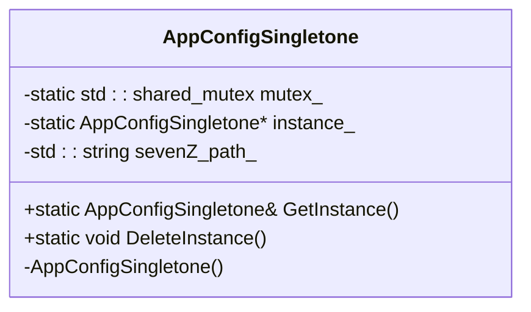
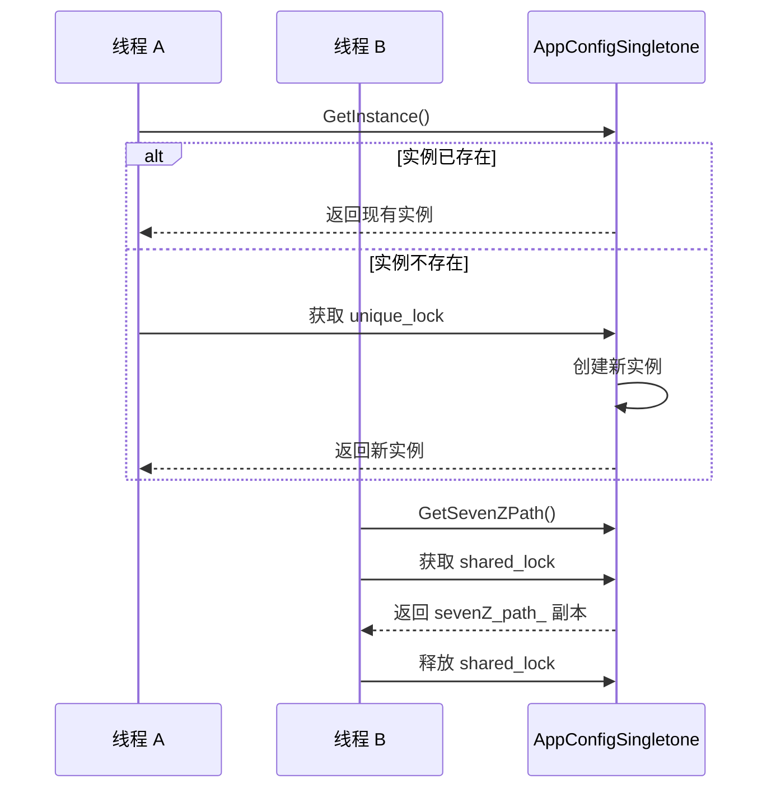
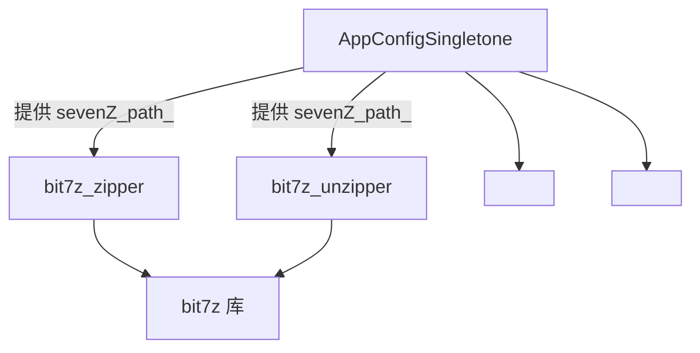

# 应用配置

<cite>
**本文档中引用的文件**  
- [app_config.hpp](file://utils/app_config.hpp)
- [app_config.cpp](file://utils/app_config.cpp)
- [bit7z_def.hpp](file://fileoperator/bit7z_def.hpp)
- [bit7z_zipper.hpp](file://fileoperator/bit7z_zipper.hpp)
- [bit7z_unzipper.hpp](file://fileoperator/bit7z_unzipper.hpp)
</cite>

## 目录
1. [简介](#简介)
2. [核心组件](#核心组件)
3. [单例设计模式实现](#单例设计模式实现)
4. [线程安全机制](#线程安全机制)
5. [7-Zip路径管理](#7-zip路径管理)
6. [初始化与销毁](#初始化与销毁)
7. [使用示例](#使用示例)
8. [依赖关系分析](#依赖关系分析)

## 简介
`AppConfigSingletone` 是 HsBaSlicer 项目中的全局配置管理组件，采用单例模式实现，为应用程序提供统一的运行时配置访问接口。该类作为系统级配置枢纽，在文件压缩、解压、加密等关键模块中被广泛依赖，特别是为基于 bit7z 的高级压缩功能提供 7-Zip 可执行文件路径支持。本文档详细说明其设计模式、线程安全机制、核心功能及使用方法。

## 核心组件

`AppConfigSingletone` 类是 HsBaSlicer 应用程序的全局配置中心，负责集中管理运行时配置参数。其主要职责包括提供对 7-Zip 可执行文件路径的访问，确保在多线程环境下配置数据的一致性和安全性。该类的设计遵循单例模式，保证在整个应用程序生命周期中仅存在一个实例，从而避免配置状态的不一致。

**Section sources**
- [app_config.hpp](file://utils/app_config.hpp#L9-L20)
- [app_config.cpp](file://utils/app_config.cpp#L8-L37)

## 单例设计模式实现

`AppConfigSingletone` 类严格实现了单例设计模式，确保全局唯一实例。该模式通过私有化构造函数、提供静态获取实例方法和静态实例指针来实现。

类提供了两个核心静态方法：
- `GetInstance()`：用于获取单例实例的引用。该方法采用双重检查锁定（Double-Checked Locking）模式，在返回实例前进行空检查，并在必要时进行线程安全的初始化。
- `DeleteInstance()`：用于显式销毁单例实例，释放其占用的资源。此方法在应用程序关闭或需要重置配置状态时调用。

通过将构造函数设为私有，阻止了外部代码直接创建类的实例，从而强制所有访问都必须通过 `GetInstance()` 方法，保证了实例的唯一性。



**Diagram sources**
- [app_config.hpp](file://utils/app_config.hpp#L9-L20)
- [app_config.cpp](file://utils/app_config.cpp#L8-L30)

**Section sources**
- [app_config.hpp](file://utils/app_config.hpp#L9-L20)
- [app_config.cpp](file://utils/app_config.cpp#L8-L30)

## 线程安全机制

`AppConfigSingletone` 类在多线程环境下提供了完整的线程安全保证，这主要通过静态的 `std::shared_mutex` 成员 `mutex_` 来实现。

- **实例创建的线程安全**：`GetInstance()` 方法在创建新实例时，使用 `std::unique_lock` 对 `mutex_` 进行独占式加锁。这种锁机制确保了即使在多个线程同时调用 `GetInstance()` 的情况下，也只有一个线程能够执行实例的创建过程，防止了竞态条件。
- **配置读取的线程安全**：`GetSevenZPath()` 方法在读取 `sevenZ_path_` 成员变量时，使用 `std::shared_lock` 对 `mutex_` 进行共享式加锁。这种锁允许多个线程同时读取配置，提高了并发读取的性能，同时阻止了写操作（实例销毁）期间的读取，保证了数据一致性。

这种读写锁（shared_mutex）的策略在保证线程安全的同时，最大限度地优化了多线程环境下的性能。

**Section sources**
- [app_config.hpp](file://utils/app_config.hpp#L15)
- [app_config.cpp](file://utils/app_config.cpp#L5-L6)

## 7-Zip路径管理

`GetSevenZPath()` 方法是 `AppConfigSingletone` 类的核心功能之一，它返回 7-Zip 可执行文件或动态链接库的系统路径，为 `bit7z` 后端提供必要的运行时依赖。

虽然当前代码中 `sevenZ_path_` 成员变量的初始化逻辑未在提供的源码中直接体现，但根据其设计目的和 `bit7z_def.hpp` 文件中的默认路径定义，可以推断其初始化逻辑可能在单例构造函数 `AppConfigSingletone()` 中完成。初始化过程可能遵循以下优先级：
1.  检查特定的环境变量（如 `HSBA_7Z_PATH`）。
2.  读取配置文件（如 `config.json` 或 `app.ini`）中的路径设置。
3.  使用平台相关的默认安装路径作为后备方案（如 `bit7z_def.hpp` 中定义的 `HSBA_7Z_DLL`）。

`GetSevenZPath()` 方法本身是 `const` 方法，表明它不修改对象状态，仅用于查询。它通过 `std::shared_lock` 获取读锁，安全地返回 `sevenZ_path_` 的副本。



**Diagram sources**
- [app_config.hpp](file://utils/app_config.hpp#L13)
- [app_config.cpp](file://utils/app_config.cpp#L32-L36)
- [bit7z_def.hpp](file://fileoperator/bit7z_def.hpp#L8-L14)

**Section sources**
- [app_config.hpp](file://utils/app_config.hpp#L13)
- [app_config.cpp](file://utils/app_config.cpp#L32-L36)

## 初始化与销毁

`AppConfigSingletone` 的生命周期由应用程序显式管理。

- **初始化**：实例的初始化是惰性的（lazy initialization）。当首次调用 `GetInstance()` 时，如果静态指针 `instance_` 为 `nullptr`，则会创建一个新实例。这个过程是线程安全的，由 `mutex_` 保护。
- **销毁**：通过调用静态方法 `DeleteInstance()` 来销毁单例实例。该方法同样使用 `std::unique_lock` 进行加锁，检查实例指针是否非空，然后执行 `delete` 操作并将其置为 `nullptr`。此操作通常在应用程序退出前执行，以确保资源的正确释放。

这种显式的销毁机制为应用程序提供了对配置资源生命周期的完全控制。

**Section sources**
- [app_config.cpp](file://utils/app_config.cpp#L22-L30)

## 使用示例

以下是在 C++ 代码中使用 `AppConfigSingletone` 的典型示例：

```cpp
// 在应用程序初始化阶段，通常在 main() 函数或初始化模块中
// 获取单例实例的引用
auto& config = AppConfigSingletone::GetInstance();

// 查询 7-Zip 的路径
std::string sevenZPath = config.GetSevenZPath();
if (!sevenZPath.empty()) {
    // 使用获取到的路径初始化 bit7z 压缩器或解压器
    // 例如：Bit7zZipper zipper(sevenZPath);
} else {
    // 处理 7-Zip 路径未找到的情况
}

// 在应用程序关闭阶段
// 显式销毁单例实例以释放资源
AppConfigSingletone::DeleteInstance();
```

**Section sources**
- [app_config.hpp](file://utils/app_config.hpp#L11-L12)
- [app_config.cpp](file://utils/app_config.cpp#L8-L37)

## 依赖关系分析

`AppConfigSingletone` 类虽然实现简单，但作为全局配置枢纽，在系统中扮演着关键角色。其主要依赖关系如下：

- **被依赖方**：`fileoperator` 模块中的 `bit7z_zipper` 和 `bit7z_unzipper` 类直接或间接依赖于 `AppConfigSingletone` 提供的 7-Zip 路径。`bit7z_unzipper` 的构造函数接受一个 DLL 路径参数，该参数的来源很可能就是通过 `AppConfigSingletone` 获取的。
- **依赖方**：`AppConfigSingletone` 本身依赖于 C++ 标准库的 `<mutex>` 和 `<shared_mutex>` 头文件来实现线程同步。

这种设计将配置的获取与使用解耦，使得 `bit7z` 相关组件无需关心路径的具体来源，只需从全局配置中读取即可。



**Diagram sources**
- [app_config.hpp](file://utils/app_config.hpp)
- [bit7z_zipper.hpp](file://fileoperator/bit7z_zipper.hpp)
- [bit7z_unzipper.hpp](file://fileoperator/bit7z_unzipper.hpp)

**Section sources**
- [app_config.hpp](file://utils/app_config.hpp)
- [bit7z_zipper.hpp](file://fileoperator/bit7z_zipper.hpp)
- [bit7z_unzipper.hpp](file://fileoperator/bit7z_unzipper.hpp)