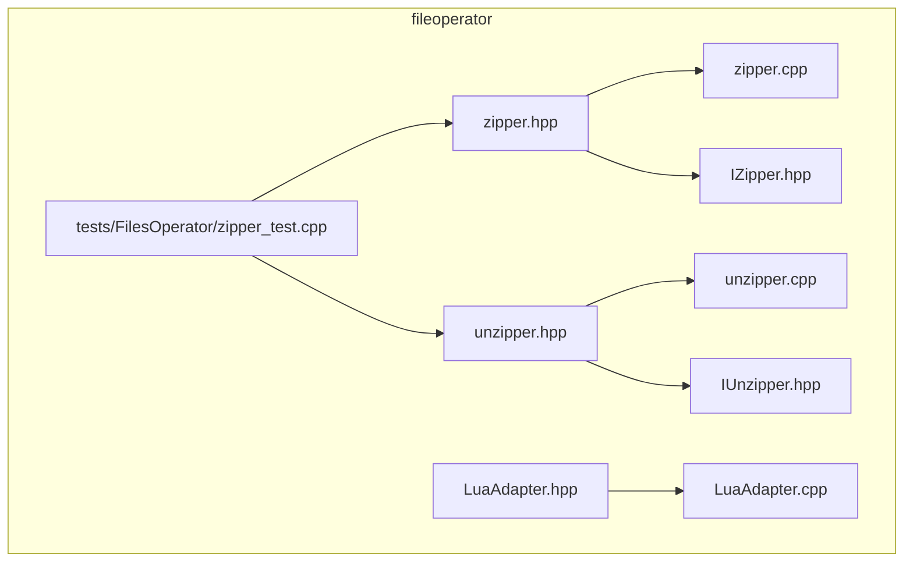
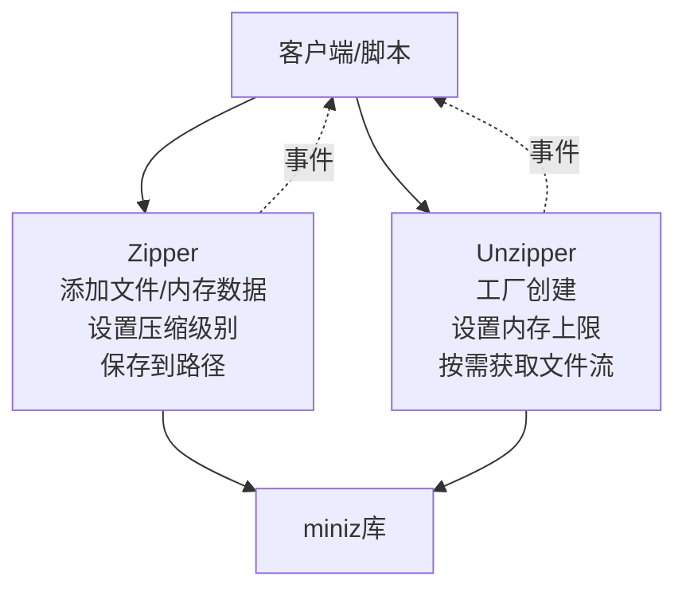
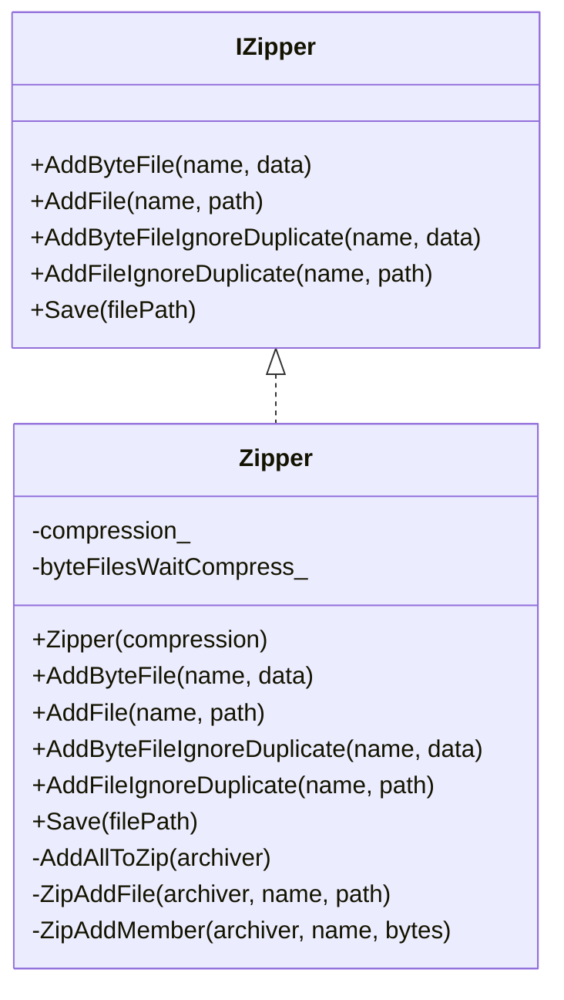
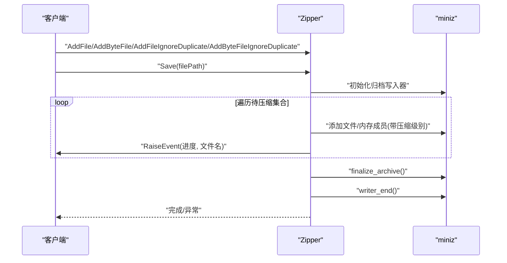
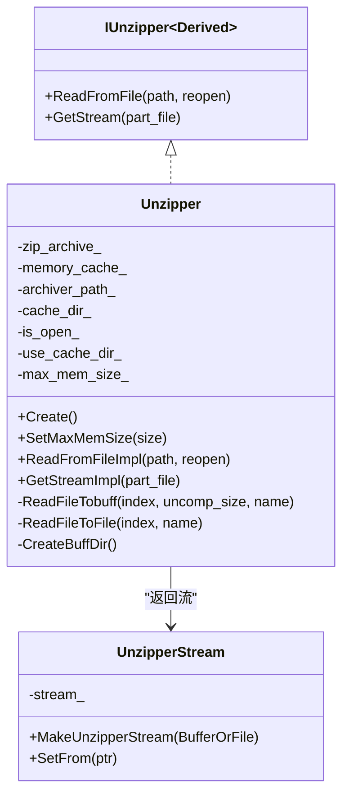
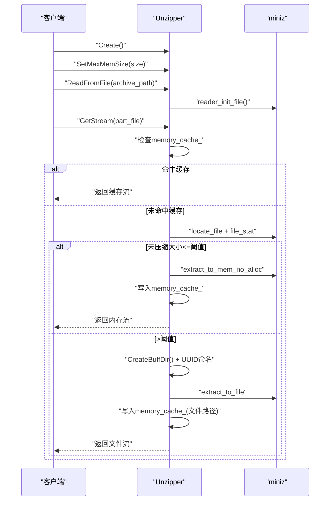
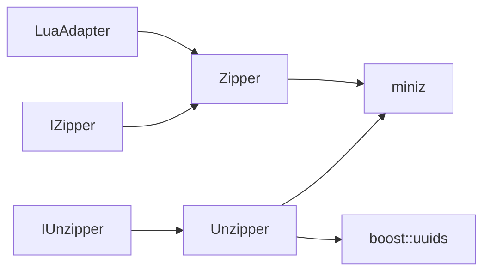

# 文件压缩与解压

<cite>
**本文引用的文件**
- [fileoperator/zipper.hpp](file://fileoperator/zipper.hpp)
- [fileoperator/zipper.cpp](file://fileoperator/zipper.cpp)
- [fileoperator/unzipper.hpp](file://fileoperator/unzipper.hpp)
- [fileoperator/unzipper.cpp](file://fileoperator/unzipper.cpp)
- [fileoperator/IZipper.hpp](file://fileoperator/IZipper.hpp)
- [fileoperator/IUnzipper.hpp](file://fileoperator/IUnzipper.hpp)
- [fileoperator/LuaAdapter.hpp](file://fileoperator/LuaAdapter.hpp)
- [fileoperator/LuaAdapter.cpp](file://fileoperator/LuaAdapter.cpp)
- [tests/FilesOperator/zipper_test.cpp](file://tests/FilesOperator/zipper_test.cpp)
</cite>

## 目录
1. [简介](#简介)
2. [项目结构](#项目结构)
3. [核心组件](#核心组件)
4. [架构总览](#架构总览)
5. [组件详解](#组件详解)
6. [依赖关系分析](#依赖关系分析)
7. [性能考量](#性能考量)
8. [故障排查指南](#故障排查指南)
9. [结论](#结论)
10. [附录：使用示例与应用场景](#附录使用示例与应用场景)

## 简介
本文件面向HsBaSlicer工程中的ZIP文件操作组件，系统性地生成API文档。重点覆盖以下内容：
- Zipper类：基于miniz库的压缩器，支持通过MinizCompression枚举控制压缩级别；提供将磁盘文件与内存数据添加到压缩包的方法，以及重复文件处理变体；支持保存到指定路径；继承自事件源，可监听压缩进度事件。
- Unzipper类：采用shared_ptr工厂模式创建实例，支持设置解压内存上限；提供从压缩包读取、按需获取文件流的能力；内部维护内存缓存策略，兼顾小文件内存直读与大文件落盘缓存。
- 辅助函数：MiniZExtractFile与MiniZExtractFileToBuffer用于快速解压到文件或内存映射。
- 应用场景：项目配置打包、切片结果归档等。

## 项目结构
与ZIP操作相关的核心代码集中在fileoperator目录，包含接口定义、具体实现、Lua绑定以及测试用例。

图表来源
- [fileoperator/zipper.hpp](file://fileoperator/zipper.hpp#L1-L65)
- [fileoperator/zipper.cpp](file://fileoperator/zipper.cpp#L1-L219)
- [fileoperator/unzipper.hpp](file://fileoperator/unzipper.hpp#L1-L53)
- [fileoperator/unzipper.cpp](file://fileoperator/unzipper.cpp#L1-L146)
- [fileoperator/IZipper.hpp](file://fileoperator/IZipper.hpp#L1-L27)
- [fileoperator/IUnzipper.hpp](file://fileoperator/IUnzipper.hpp#L1-L134)
- [fileoperator/LuaAdapter.hpp](file://fileoperator/LuaAdapter.hpp#L1-L30)
- [fileoperator/LuaAdapter.cpp](file://fileoperator/LuaAdapter.cpp#L1-L1142)
- [tests/FilesOperator/zipper_test.cpp](file://tests/FilesOperator/zipper_test.cpp#L1-L143)

章节来源
- [fileoperator/zipper.hpp](file://fileoperator/zipper.hpp#L1-L65)
- [fileoperator/unzipper.hpp](file://fileoperator/unzipper.hpp#L1-L53)
- [fileoperator/IZipper.hpp](file://fileoperator/IZipper.hpp#L1-L27)
- [fileoperator/IUnzipper.hpp](file://fileoperator/IUnzipper.hpp#L1-L134)
- [fileoperator/LuaAdapter.hpp](file://fileoperator/LuaAdapter.hpp#L1-L30)
- [fileoperator/LuaAdapter.cpp](file://fileoperator/LuaAdapter.cpp#L1000-L1023)
- [tests/FilesOperator/zipper_test.cpp](file://tests/FilesOperator/zipper_test.cpp#L1-L143)

## 核心组件
- IZipper接口：定义压缩器的标准能力，包括添加内存文件、添加磁盘文件、忽略重复名的添加变体、保存到路径等。
- Zipper类：实现IZipper接口，基于miniz进行压缩；支持MinizCompression枚举控制压缩级别；继承事件源，可发布压缩进度事件。
- IUnzipper模板与Unzipper类：Unzipper继承IUnzipper模板，提供工厂方法Create；支持设置最大内存大小；实现从压缩包读取与按需获取文件流；内部维护内存缓存策略。
- UnzipperStream：封装std::istream，支持内存缓冲与文件两种来源，作为Unzipper的统一输出抽象。
- Lua绑定：提供Zipper对象在Lua侧的注册与调用接口，便于脚本化集成。

章节来源
- [fileoperator/IZipper.hpp](file://fileoperator/IZipper.hpp#L1-L27)
- [fileoperator/zipper.hpp](file://fileoperator/zipper.hpp#L18-L63)
- [fileoperator/IUnzipper.hpp](file://fileoperator/IUnzipper.hpp#L1-L134)
- [fileoperator/unzipper.hpp](file://fileoperator/unzipper.hpp#L1-L53)
- [fileoperator/LuaAdapter.hpp](file://fileoperator/LuaAdapter.hpp#L1-L30)
- [fileoperator/LuaAdapter.cpp](file://fileoperator/LuaAdapter.cpp#L1000-L1023)

## 架构总览
Zipper与Unzipper分别负责“压缩”和“解压”的两端，二者通过标准接口与事件机制协同工作。Zipper在构建阶段将内存数据或磁盘文件加入待压缩集合，最终写入目标路径；Unzipper在运行时按需从压缩包中提取文件，优先内存直读，超过阈值则落盘缓存，提升IO效率。

图表来源
- [fileoperator/zipper.hpp](file://fileoperator/zipper.hpp#L18-L63)
- [fileoperator/unzipper.hpp](file://fileoperator/unzipper.hpp#L1-L53)
- [fileoperator/zipper.cpp](file://fileoperator/zipper.cpp#L1-L219)
- [fileoperator/unzipper.cpp](file://fileoperator/unzipper.cpp#L1-L146)

## 组件详解

### Zipper类（压缩器）
- 压缩级别控制
  - 支持MinizCompression枚举：No、Fast、Tight，分别映射到不同压缩等级；Undefine与Unknown会抛出不支持错误。
- 添加文件与内存数据
  - AddFile(name, diskPath)：将磁盘文件加入压缩集合；若同名文件已存在则抛出参数错误。
  - AddByteFile(name, data)：将内存字符串加入压缩集合；同名冲突同样抛错。
  - AddFileIgnoreDuplicate/ AddByteFileIgnoreDuplicate：若同名存在，则自动追加后缀以避免冲突。
- 保存到路径
  - Save(filePath)：初始化miniz归档写入器，批量添加所有待压缩项，完成后finalize并关闭；异常时抛出IO错误。
- 进度事件
  - 继承事件源，每完成一个文件的添加即RaiseEvent(progress, filename)，客户端可通过+=订阅日志或UI更新。

图表来源
- [fileoperator/IZipper.hpp](file://fileoperator/IZipper.hpp#L1-L27)
- [fileoperator/zipper.hpp](file://fileoperator/zipper.hpp#L18-L63)
- [fileoperator/zipper.cpp](file://fileoperator/zipper.cpp#L1-L219)

章节来源
- [fileoperator/zipper.hpp](file://fileoperator/zipper.hpp#L18-L63)
- [fileoperator/zipper.cpp](file://fileoperator/zipper.cpp#L1-L219)

#### 压缩流程序列图

图表来源
- [fileoperator/zipper.cpp](file://fileoperator/zipper.cpp#L76-L122)

### Unzipper类（解压器）
- 工厂模式
  - Create()：返回shared_ptr<Unzipper>实例，确保生命周期管理与跨模块共享。
- 内存上限控制
  - SetMaxMemSize(size=1GB)：设置单个文件解压的最大内存阈值；超过阈值采用临时文件缓存。
- 读取与获取流
  - ReadFromFile(path, reopen=false)：打开压缩包，内部清理旧状态；若同一路径且非强制重开则复用。
  - GetStream(part_file)：先检查内存缓存，命中则直接返回；否则定位文件索引，查询未压缩大小，按阈值选择内存直读或落盘缓存，最后将结果加入缓存。
- 缓存策略
  - memory_cache_：键为文件名，值为BufferOrFile（内存缓冲或文件路径），支持多次读取。
  - 当选择落盘缓存时，使用UUID命名的临时目录存放每个文件，避免命名冲突。
- 事件与资源管理
  - 继承事件源，在GetStream前RaiseEvent(archive_path, part_file)；析构时确保reader结束并清理临时目录。

图表来源
- [fileoperator/IUnzipper.hpp](file://fileoperator/IUnzipper.hpp#L1-L134)
- [fileoperator/unzipper.hpp](file://fileoperator/unzipper.hpp#L1-L53)
- [fileoperator/unzipper.cpp](file://fileoperator/unzipper.cpp#L1-L146)

章节来源
- [fileoperator/unzipper.hpp](file://fileoperator/unzipper.hpp#L1-L53)
- [fileoperator/unzipper.cpp](file://fileoperator/unzipper.cpp#L1-L146)
- [fileoperator/IUnzipper.hpp](file://fileoperator/IUnzipper.hpp#L1-L134)

#### 解压流程序列图

图表来源
- [fileoperator/unzipper.cpp](file://fileoperator/unzipper.cpp#L25-L146)

### 辅助函数
- MiniZExtractFile(archive_path, output_path)：打开压缩包，遍历所有条目，对目录创建目录，对文件逐个提取到目标输出目录。
- MiniZExtractFileToBuffer(archive_path)：打开压缩包，遍历所有条目，将每个文件解压到内存字符串并以文件名为键返回。

章节来源
- [fileoperator/zipper.cpp](file://fileoperator/zipper.cpp#L134-L216)

## 依赖关系分析
- 外部库
  - miniz：压缩/解压核心库，Zipper与Unzipper均通过miniz接口进行文件添加、归档写入、文件统计与提取。
  - boost.uuid：用于生成唯一临时目录与文件名，避免冲突。
- 内部依赖
  - IZipper/IZipper.hpp：定义Zipper的对外接口。
  - IUnzipper.hpp：定义Unzipper的对外接口与UnzipperStream类型。
  - LuaAdapter：提供Zipper在Lua侧的注册与调用桥接，便于脚本化使用。
- 事件机制
  - EventSource：Zipper与Unzipper均继承事件源，用于发布进度或访问事件，便于日志与UI联动。

图表来源
- [fileoperator/zipper.hpp](file://fileoperator/zipper.hpp#L18-L63)
- [fileoperator/unzipper.hpp](file://fileoperator/unzipper.hpp#L1-L53)
- [fileoperator/LuaAdapter.cpp](file://fileoperator/LuaAdapter.cpp#L1000-L1023)

章节来源
- [fileoperator/zipper.hpp](file://fileoperator/zipper.hpp#L18-L63)
- [fileoperator/unzipper.hpp](file://fileoperator/unzipper.hpp#L1-L53)
- [fileoperator/LuaAdapter.cpp](file://fileoperator/LuaAdapter.cpp#L1000-L1023)

## 性能考量
- 压缩级别
  - No：无压缩，速度最快但体积最大。
  - Fast：最佳速度，适合快速打包。
  - Tight：最佳压缩比，体积最小但耗时较长。
- 内存与IO平衡
  - Unzipper通过SetMaxMemSize控制阈值，小文件内存直读减少IO；大文件落盘缓存避免内存峰值过高。
  - memory_cache_提升重复读取效率，避免重复解压。
- 路径编码
  - Zipper在添加与保存时对UTF-8与本地编码进行转换，确保跨平台兼容性。

[本节为通用建议，无需列出章节来源]

## 故障排查指南
- 压缩阶段
  - 同名文件冲突：AddFile/AddByteFile遇到重复名会抛出参数错误；应使用IgnoreDuplicate变体或调整文件名。
  - 未知/未定义压缩级别：构造Zipper时传入Undefine或Unknown会抛出不支持错误；请使用No/Fast/Tight之一。
  - 保存失败：Save过程中finalize或writer_end返回异常会抛出IO错误；检查磁盘空间与权限。
- 解压阶段
  - 未打开压缩包：GetStream前必须调用ReadFromFile；否则抛出未打开错误。
  - 文件不存在：locate_file返回负值时抛出“文件未找到”错误；确认文件名与路径。
  - 提取失败：extract_to_mem_no_alloc或extract_to_file失败时抛出IO错误；检查压缩包完整性与磁盘空间。
  - 临时目录清理：析构时会删除临时缓存目录；如需保留调试信息，可在使用后手动清理。

章节来源
- [fileoperator/zipper.cpp](file://fileoperator/zipper.cpp#L1-L219)
- [fileoperator/unzipper.cpp](file://fileoperator/unzipper.cpp#L1-L146)

## 结论
Zipper与Unzipper以miniz为核心，提供了简洁稳定的压缩与解压能力。Zipper通过事件机制与多级压缩策略满足不同性能需求；Unzipper通过内存/文件双通道缓存与阈值控制，兼顾吞吐与内存占用。结合Lua绑定，可在脚本层快速完成配置打包与结果归档等任务。

[本节为总结，无需列出章节来源]

## 附录：使用示例与应用场景
- 压缩多个文件（C++）
  - 步骤要点：构造Zipper并设置压缩级别；循环AddByteFile/AddFile添加文件；Save到目标路径；可订阅进度事件。
  - 参考路径：[tests/FilesOperator/zipper_test.cpp](file://tests/FilesOperator/zipper_test.cpp#L24-L56)
- 逐个解压文件（C++）
  - 步骤要点：Create()创建实例；SetMaxMemSize设置阈值；ReadFromFile打开压缩包；GetStream按需获取文件流；可订阅事件观察访问过程。
  - 参考路径：[tests/FilesOperator/zipper_test.cpp](file://tests/FilesOperator/zipper_test.cpp#L58-L101)
- Lua集成（压缩）
  - 步骤要点：注册Zipper到Lua；在脚本中new Zipper，AddByteFile两次，Save到zip文件；随后可用MiniZExtractFileToBuffer验证。
  - 参考路径：[fileoperator/LuaAdapter.cpp](file://fileoperator/LuaAdapter.cpp#L1000-L1023), [tests/FilesOperator/zipper_test.cpp](file://tests/FilesOperator/zipper_test.cpp#L103-L141)
- 应用场景
  - 项目配置打包：将配置文件与资源打包为zip，便于分发与版本管理。
  - 切片结果归档：将切片产生的中间文件与结果文件归档，支持后续检索与回放。

[本节为示例与应用说明，无需列出章节来源]