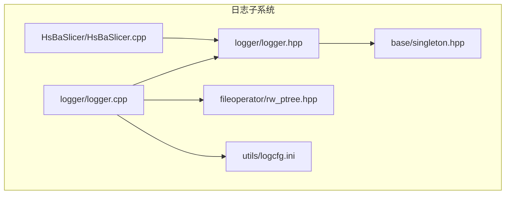
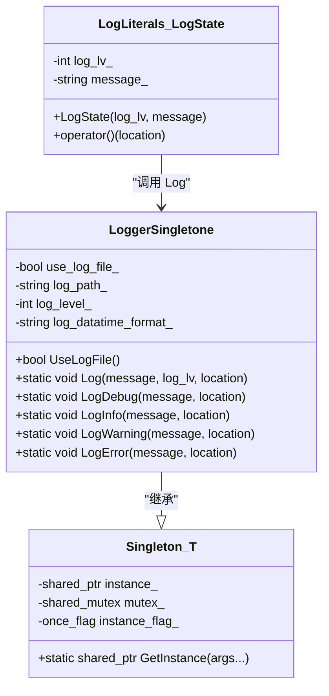
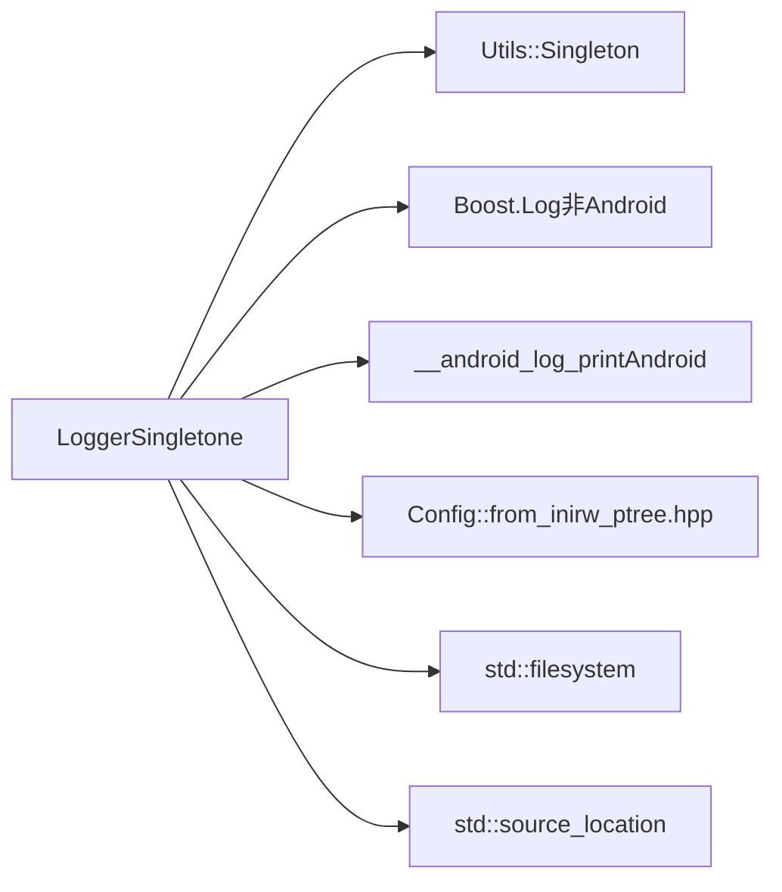
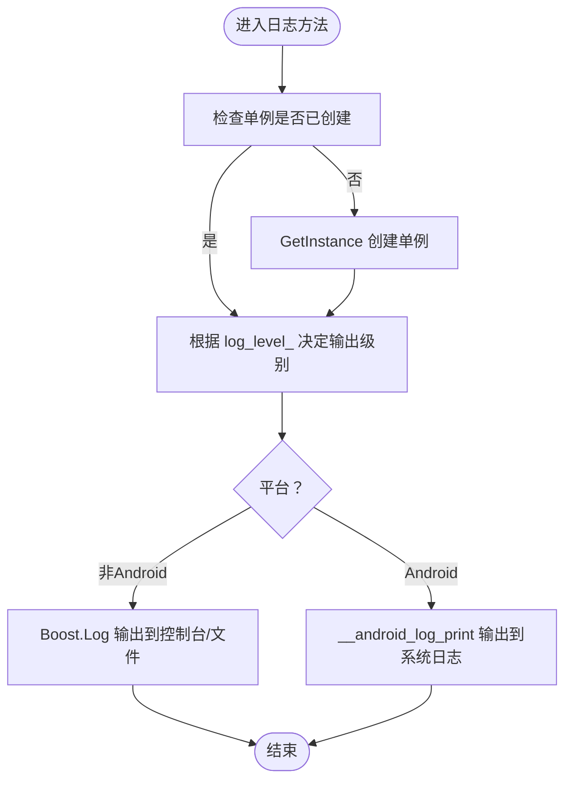

# 日志系统

<cite>
**本文引用的文件列表**
- [logger.hpp](file://logger/logger.hpp)
- [logger.cpp](file://logger/logger.cpp)
- [singleton.hpp](file://base/singleton.hpp)
- [logcfg.ini](file://utils/logcfg.ini)
- [rw_ptree.hpp](file://fileoperator/rw_ptree.hpp)
- [HsBaSlicer.cpp](file://HsBaSlicer/HsBaSlicer.cpp)
</cite>

## 目录
1. [简介](#简介)
2. [项目结构](#项目结构)
3. [核心组件](#核心组件)
4. [架构总览](#架构总览)
5. [详细组件分析](#详细组件分析)
6. [依赖关系分析](#依赖关系分析)
7. [性能与行为特性](#性能与行为特性)
8. [故障排查指南](#故障排查指南)
9. [结论](#结论)
10. [附录：API参考与示例](#附录api参考与示例)

## 简介
本文件为 HsBaSlicer 项目中 LoggerSingletone 日志系统的权威API文档。该系统基于 Utils::Singleton 实现全局唯一的日志单例，提供统一的日志输出接口；支持标准控制台输出与可选文件输出，并在 Android 平台通过系统内核日志输出。所有日志方法均接受 std::source_location 参数，自动记录调用文件、行号与函数名，显著提升调试效率。系统还提供用户自定义字面量（UDL）形式的日志接口，便于以更简洁的语法生成日志。日志级别与默认配置由 logcfg.ini 提供，支持按构建模式（Debug/Release）差异化启用策略。

## 项目结构
日志系统位于 logger 子模块，核心文件包括：
- 头文件：logger/logger.hpp
- 实现：logger/logger.cpp
- 单例基类：base/singleton.hpp
- 配置文件：utils/logcfg.ini
- 配置读取工具：fileoperator/rw_ptree.hpp
- 使用示例：HsBaSlicer/HsBaSlicer.cpp

图表来源
- [logger.hpp](file://logger/logger.hpp#L1-L61)
- [logger.cpp](file://logger/logger.cpp#L1-L293)
- [singleton.hpp](file://base/singleton.hpp#L1-L46)
- [logcfg.ini](file://utils/logcfg.ini#L1-L8)
- [rw_ptree.hpp](file://fileoperator/rw_ptree.hpp#L1-L218)
- [HsBaSlicer.cpp](file://HsBaSlicer/HsBaSlicer.cpp#L1-L25)

章节来源
- [logger.hpp](file://logger/logger.hpp#L1-L61)
- [logger.cpp](file://logger/logger.cpp#L1-L293)
- [singleton.hpp](file://base/singleton.hpp#L1-L46)
- [logcfg.ini](file://utils/logcfg.ini#L1-L8)
- [rw_ptree.hpp](file://fileoperator/rw_ptree.hpp#L1-L218)
- [HsBaSlicer.cpp](file://HsBaSlicer/HsBaSlicer.cpp#L1-L25)

## 核心组件
- LoggerSingletone：基于 Utils::Singleton 的全局唯一日志单例，负责初始化、过滤、格式化与输出。
- 日志级别：整数级别从低到高为 trace/debug/info/warning/error/fatal，分别对应 0/1/2/3/4/5。
- 静态日志方法：LogError、LogWarning、LogInfo、LogDebug、Log（底层通用接口）。
- 文件输出开关：UseLogFile 返回当前是否启用文件日志输出。
- 用户自定义字面量（LogLiterals）：提供 "_log_debug"、"_log_info"、"_log_warning"、"_log_error" 四个 UDL，简化日志调用。
- 配置项来源：logcfg.ini 中的 [log] 与 [log_format] 段，运行时通过 Config::from_ini 读取。

章节来源
- [logger.hpp](file://logger/logger.hpp#L14-L61)
- [logger.cpp](file://logger/logger.cpp#L154-L262)
- [logcfg.ini](file://utils/logcfg.ini#L1-L8)

## 架构总览
LoggerSingletone 通过 Utils::Singleton 确保全局唯一实例；构造函数读取配置并初始化输出通道（控制台与可选文件），设置时间戳属性与过滤器；对外暴露静态日志方法与 UseLogFile 查询接口；在 Android 平台使用 __android_log_print 输出。

图表来源
- [logger.hpp](file://logger/logger.hpp#L14-L61)
- [singleton.hpp](file://base/singleton.hpp#L11-L46)
- [logger.cpp](file://logger/logger.cpp#L263-L293)

## 详细组件分析

### LoggerSingletone 类与单例模式
- 继承关系：LoggerSingletone 继承自 Utils::Singleton<LoggerSingletone>，通过模板参数约束构造函数可见性，保证外部仅能通过 GetInstance 获取实例。
- 初始化流程：构造函数中优先尝试读取当前工作目录下的 logcfg.ini；若存在则解析 [log] 与 [log_format] 段，否则采用默认配置；根据构建模式设置默认日志级别；随后配置 Boost.Log 控制台输出与可选文件输出，设置过滤器与时间戳属性；在 Android 平台输出提示信息。
- 线程安全：内部使用共享互斥锁保护成员访问；单例创建使用一次性标志，避免重复初始化。
- 成员变量：
  - use_log_file_：是否启用文件日志输出
  - log_path_：文件日志路径
  - log_level_：当前日志级别（整数）
  - log_datatime_format_：时间戳格式字符串

章节来源
- [logger.hpp](file://logger/logger.hpp#L14-L37)
- [logger.cpp](file://logger/logger.cpp#L72-L142)
- [singleton.hpp](file://base/singleton.hpp#L11-L46)

### 日志级别与启用策略
- 级别映射（非 Android）：0(trace)、1(debug)、2(info)、3(warning)、4(error)、5(fatal)。
- 启用策略（非 Android）：根据 log_level_ 设置过滤器，仅输出不低于当前级别的日志。
- 构建模式差异：
  - Debug：默认日志级别较低（更细粒度），便于开发调试。
  - Release：默认日志级别较高（减少冗余输出），提高运行效率。
- Android 平台：使用 Android Log 优先级映射，且默认启用文件输出（UseLogFile 在 Android 下恒返回 true）。

章节来源
- [logger.cpp](file://logger/logger.cpp#L31-L69)
- [logger.cpp](file://logger/logger.cpp#L72-L142)
- [logger.cpp](file://logger/logger.cpp#L144-L152)

### 静态日志方法
- Log(message, log_lv, location)：底层通用接口，接受整型日志级别与消息字符串，自动拼接 source_location 信息后输出。
- LogDebug/LogInfo/LogWarning/LogError：便捷静态方法，分别对应固定级别（1/2/3/4），内部委托至 Log。
- source_location：所有方法均包含默认参数 std::source_location::current()，自动记录文件名、行号与函数名，便于快速定位问题。

章节来源
- [logger.hpp](file://logger/logger.hpp#L18-L26)
- [logger.cpp](file://logger/logger.cpp#L154-L262)

### 文件输出与控制台输出
- 控制台输出：始终启用，使用 Boost.Log 控制台 sink，设置统一格式与时间戳属性。
- 文件输出：当 UseLogFile 返回 true 且配置了文件路径时启用；文件轮转策略为按天旋转与大小限制；默认输出目录为当前工作目录下的 log 子目录。
- Android 输出：不使用 Boost.Log，直接通过 __android_log_print 输出到系统内核日志。

章节来源
- [logger.cpp](file://logger/logger.cpp#L112-L142)
- [logger.cpp](file://logger/logger.cpp#L144-L152)

### 配置文件与读取
- 配置文件：utils/logcfg.ini，包含 [log] 与 [log_format] 段。
- 读取方式：logger.cpp 在构造函数中通过 Config::from_ini 读取配置；若键缺失或解析失败，回退到默认值。
- 关键键名：
  - log.log_level：Release 默认级别
  - log.log_level_debug：Debug 默认级别
  - log.use_log_file：是否启用文件输出
  - log.log_file：文件输出路径（相对当前工作目录）
  - log_format.log_datatime_format：时间戳格式字符串

章节来源
- [logcfg.ini](file://utils/logcfg.ini#L1-L8)
- [logger.cpp](file://logger/logger.cpp#L72-L111)
- [rw_ptree.hpp](file://fileoperator/rw_ptree.hpp#L1-L30)

### 用户自定义字面量（LogLiterals）
- 提供四种 UDL：_log_debug、_log_info、_log_warning、_log_error，分别对应级别 1/2/3/4。
- 调用方式：先 using 命名空间 HsBa::Slicer::Log::LogLiterals，再以 "message"_log_level() 形式调用。
- 实现机制：LogState 对象在析构或显式调用 operator() 时，将消息与级别传递给 LoggerSingletone::Log。

章节来源
- [logger.hpp](file://logger/logger.hpp#L38-L59)
- [logger.cpp](file://logger/logger.cpp#L263-L293)
- [HsBaSlicer.cpp](file://HsBaSlicer/HsBaSlicer.cpp#L10-L20)

### 跨平台输出细节
- 非 Android：使用 Boost.Log 输出到控制台与可选文件；文件输出启用时，UseLogFile 返回 true。
- Android：不使用 Boost.Log；通过 __android_log_print 输出；UseLogFile 在 Android 下恒返回 true；初始化时会打印一条提示信息。

章节来源
- [logger.cpp](file://logger/logger.cpp#L1-L17)
- [logger.cpp](file://logger/logger.cpp#L138-L141)
- [logger.cpp](file://logger/logger.cpp#L144-L152)

## 依赖关系分析
- LoggerSingletone 依赖：
  - Utils::Singleton：提供线程安全的单例创建与生命周期管理。
  - Boost.Log（非 Android）：提供控制台与文件输出、格式化、过滤与时间戳属性。
  - Android NDK（Android）：提供 __android_log_print 接口。
  - Config::from_ini（来自 fileoperator/rw_ptree.hpp）：用于读取 ini 配置。
  - std::filesystem：用于检测配置文件是否存在与拼接路径。
  - std::source_location：用于自动记录调用位置信息。

图表来源
- [logger.cpp](file://logger/logger.cpp#L1-L17)
- [logger.cpp](file://logger/logger.cpp#L72-L142)
- [rw_ptree.hpp](file://fileoperator/rw_ptree.hpp#L1-L30)
- [logger.hpp](file://logger/logger.hpp#L1-L13)

章节来源
- [logger.cpp](file://logger/logger.cpp#L1-L17)
- [logger.cpp](file://logger/logger.cpp#L72-L142)
- [rw_ptree.hpp](file://fileoperator/rw_ptree.hpp#L1-L30)
- [logger.hpp](file://logger/logger.hpp#L1-L13)

## 性能与行为特性
- 线程安全：单例创建与成员访问使用共享互斥锁，避免竞态条件；日志输出在 Android 下为同步调用，可能阻塞调用线程。
- 过滤策略：非 Android 平台通过设置过滤器降低无效日志的开销；Android 平台按优先级映射输出。
- 文件输出：启用文件输出时，建议合理设置 log_file 与 rotation 策略，避免磁盘占用过大。
- 构建模式差异：Debug 默认更低级别，便于开发调试；Release 默认更高级别，减少运行时日志开销。

[本节为通用性能讨论，不直接分析具体文件]

## 故障排查指南
- 配置文件未生效：
  - 检查当前工作目录下是否存在 logcfg.ini；确认键名与类型正确（log.log_level、log.log_level_debug、log.use_log_file、log.log_file、log_format.log_datatime_format）。
  - 若键缺失或类型不匹配，将回退到默认配置。
- 文件输出未开启：
  - 确认 log.use_log_file 为 true；确认 log.log_file 为有效路径；确认目标目录可写。
  - 在 Android 平台，UseLogFile 恒返回 true，但不会写入普通文件。
- 日志级别过高导致看不到日志：
  - 检查构建模式对应的默认级别；必要时在配置文件中调整 log.log_level 或 log.log_level_debug。
- 调用位置信息缺失：
  - 确保使用带默认参数的静态方法，或手动传入 std::source_location::current()。
- Android 平台日志不可见：
  - 使用系统日志查看工具（如 adb logcat）查看输出；注意 Android 平台使用系统内核日志而非文件。

章节来源
- [logger.cpp](file://logger/logger.cpp#L72-L111)
- [logger.cpp](file://logger/logger.cpp#L112-L142)
- [logger.cpp](file://logger/logger.cpp#L144-L152)
- [logcfg.ini](file://utils/logcfg.ini#L1-L8)

## 结论
LoggerSingletone 通过单例模式确保全局唯一日志实例，结合配置文件与构建模式差异，提供灵活可控的日志能力。其静态方法与 UDL 接口兼顾易用性与可读性，配合 source_location 自动记录调用位置，显著提升调试效率。在 Android 平台通过系统内核日志输出，满足跨平台一致性需求。

[本节为总结性内容，不直接分析具体文件]

## 附录：API参考与示例

### API 参考
- 类型与命名空间
  - 命名空间：HsBa::Slicer::Log
  - 类型：LoggerSingletone
  - 内联命名空间：LogLiterals
- 类 LoggerSingletone
  - 方法
    - UseLogFile()：查询是否启用文件日志输出
    - Log(message, log_lv, location)：底层通用接口，接受整型日志级别与消息字符串
    - LogDebug(message, location)：级别 1 的便捷方法
    - LogInfo(message, location)：级别 2 的便捷方法
    - LogWarning(message, location)：级别 3 的便捷方法
    - LogError(message, location)：级别 4 的便捷方法
  - 成员
    - use_log_file_：是否启用文件日志
    - log_path_：文件日志路径
    - log_level_：当前日志级别（整数）
    - log_datatime_format_：时间戳格式字符串
- 内联命名空间 LogLiterals
  - 类 LogState：保存级别与消息，在析构或显式调用时触发日志输出
  - 字面量
    - operator""_log_debug：对应级别 1
    - operator""_log_info：对应级别 2
    - operator""_log_warning：对应级别 3
    - operator""_log_error：对应级别 4

章节来源
- [logger.hpp](file://logger/logger.hpp#L14-L61)
- [logger.cpp](file://logger/logger.cpp#L154-L262)
- [logger.cpp](file://logger/logger.cpp#L263-L293)

### 配置项参考
- 文件：utils/logcfg.ini
- 段落：[log]、[log_format]
- 键名与含义
  - log.log_level：Release 默认级别
  - log.log_level_debug：Debug 默认级别
  - log.use_log_file：是否启用文件输出
  - log.log_file：文件输出路径（相对当前工作目录）
  - log_format.log_datatime_format：时间戳格式字符串

章节来源
- [logcfg.ini](file://utils/logcfg.ini#L1-L8)

### 跨平台调用示例
- Windows/Linux/macOS（非 Android）
  - 使用静态方法：例如 LogInfo、LogWarning、LogError、LogDebug。
  - 使用 UDL：先 using LogLiterals，再以 "message"_log_info() 等形式调用。
  - 文件输出：当 UseLogFile 返回 true 时，日志同时输出到控制台与文件。
- Android
  - 使用静态方法或 UDL；日志通过系统内核日志输出。
  - UseLogFile 在 Android 下恒返回 true；可通过系统日志工具查看。

章节来源
- [logger.cpp](file://logger/logger.cpp#L144-L152)
- [logger.cpp](file://logger/logger.cpp#L154-L262)
- [logger.cpp](file://logger/logger.cpp#L263-L293)
- [HsBaSlicer.cpp](file://HsBaSlicer/HsBaSlicer.cpp#L10-L20)

### 日志级别与启用策略流程图

图表来源
- [logger.cpp](file://logger/logger.cpp#L72-L142)
- [logger.cpp](file://logger/logger.cpp#L154-L262)