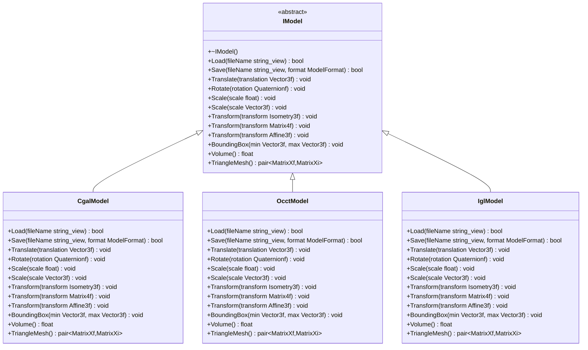
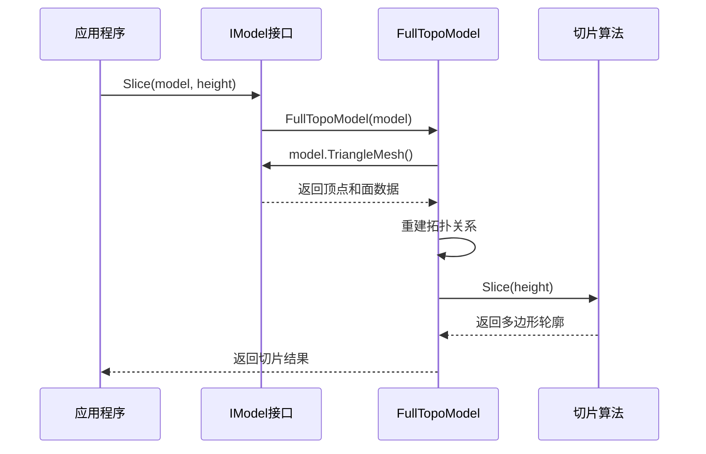

# 模型接口 (IModel)

<cite>
**本文档引用的文件**
- [IModel.hpp](file://base/IModel.hpp#L1-L37)
- [ModelFormat.hpp](file://base/ModelFormat.hpp#L1-L66)
- [ModelFormat.cpp](file://base/ModelFormat.cpp#L1-L166)
- [CgalModel.hpp](file://meshmodel/CgalModel.hpp#L1-L82)
- [CgalModel.cpp](file://meshmodel/CgalModel.cpp#L1-L366)
- [OcctModel.hpp](file://cadmodel/OcctModel.hpp#L1-L80)
- [IglModel.hpp](file://meshmodel/IglModel.hpp#L1-L66)
- [FullTopoModel.hpp](file://meshmodel/FullTopoModel.hpp#L1-L119)
- [FullTopoModel.cpp](file://meshmodel/FullTopoModel.cpp#L1-L852)
- [mesh_slice.cpp](file://LibHsBaSlicer/Slice/mesh_slice.cpp#L1-L28)
- [cgal_model_test.cpp](file://tests/Models/cgal_model_test.cpp#L1-L49)
- [occt_model_test.cpp](file://tests/Models/occt_model_test.cpp#L1-L47)
- [igl_model_test.cpp](file://tests/Models/igl_model_test.cpp#L1-L67)
</cite>

## 目录
1. [简介](#简介)
2. [核心接口定义](#核心接口定义)
3. [文件加载与保存](#文件加载与保存)
4. [几何变换方法](#几何变换方法)
5. [模型属性查询](#模型属性查询)
6. [三角网格数据获取](#三角网格数据获取)
7. [具体实现类](#具体实现类)
8. [切片流程中的调用](#切片流程中的调用)
9. [工厂模式与多态支持](#工厂模式与多态支持)
10. [C++代码示例](#c代码示例)

## 简介
`IModel` 是 HsBaSlicer 3D 打印切片软件中的核心抽象接口，为所有3D模型后端实现（如 CgalModel、OcctModel、IglModel）提供了统一的基类。该接口采用纯虚函数设计，强制所有派生类实现一套标准的3D模型操作功能，包括文件加载/保存、几何变换、属性查询和网格数据访问。通过此接口，上层应用可以以多态方式操作不同类型的3D模型，而无需关心底层实现细节，极大地提高了代码的可维护性和可扩展性。

**本节来源**
- [IModel.hpp](file://base/IModel.hpp#L1-L37)

## 核心接口定义
`IModel` 接口定义在 `base/IModel.hpp` 文件中，是一个典型的抽象基类，包含一系列纯虚函数。该接口的设计遵循了面向对象的开闭原则，对扩展开放，对修改关闭。所有具体模型类（如 `CgalModel`、`OcctModel`）都必须继承并实现这些接口，从而保证了API的一致性。



**图示来源**
- [IModel.hpp](file://base/IModel.hpp#L14-L34)
- [CgalModel.hpp](file://meshmodel/CgalModel.hpp#L20-L70)
- [OcctModel.hpp](file://cadmodel/OcctModel.hpp#L16-L73)
- [IglModel.hpp](file://meshmodel/IglModel.hpp#L12-L63)

## 文件加载与保存
### Load方法
`Load` 方法用于从指定文件路径加载3D模型数据。该方法接受一个 `std::string_view` 类型的文件名参数，并返回一个布尔值表示加载是否成功。

- **支持的格式**：根据 `ModelFormat` 枚举，支持多种网格文件格式，包括 STL、OBJ、PLY、OFF 等。
- **返回值**：`true` 表示模型成功加载，`false` 表示加载失败（如文件不存在、格式不支持或数据损坏）。
- **实现细节**：在 `CgalModel` 中，该方法使用 CGAL 库的 `read_polygon_mesh` 函数读取文件，并在加载后自动将所有面三角化以保证数据一致性。

**本节来源**
- [IModel.hpp](file://base/IModel.hpp#L19)
- [CgalModel.cpp](file://meshmodel/CgalModel.cpp#L31-L42)

### Save方法
`Save` 方法用于将当前模型保存到指定文件中。该方法接受文件名和 `ModelFormat` 格式枚举两个参数。

- **ModelFormat参数**：`ModelFormat` 枚举定义了所有支持的文件格式，如 `BinarySTL`、`ASCIISTL`、`BinaryPLY`、`ASCIIPLY`、`OBJ` 等。选择不同的格式会影响文件的编码方式（二进制或ASCII）和兼容性。
- **文件格式对应关系**：
  - `BinarySTL` / `ASCIISTL`：对应 .stl 文件
  - `BinaryPLY` / `ASCIIPLY`：对应 .ply 文件
  - `OBJ`：对应 .obj 文件
  - `STEP` / `IGES`：对应 CAD 专用格式
- **实现细节**：在 `CgalModel` 中，该方法根据 `ModelFormat` 的类型调用相应的 CGAL 写入函数（如 `write_STL`、`write_PLY`、`write_OBJ`）。

**本节来源**
- [IModel.hpp](file://base/IModel.hpp#L20)
- [ModelFormat.hpp](file://base/ModelFormat.hpp#L10-L30)
- [CgalModel.cpp](file://meshmodel/CgalModel.cpp#L43-L67)

## 几何变换方法
`IModel` 接口提供了一系列用于对3D模型进行几何变换的方法，这些方法直接修改模型的内部几何数据。

### Translate (平移)
`Translate` 方法接受一个 `Eigen::Vector3f` 类型的三维向量，表示在X、Y、Z三个轴上的平移距离。该方法将模型整体移动指定的向量距离。

**本节来源**
- [IModel.hpp](file://base/IModel.hpp#L22)

### Rotate (旋转)
`Rotate` 方法接受一个 `Eigen::Quaternionf` 类型的四元数，用于表示三维空间中的旋转。四元数是一种避免万向节锁问题的高效旋转表示方法。

**本节来源**
- [IModel.hpp](file://base/IModel.hpp#L23)

### Scale (缩放)
`Scale` 方法有两种重载：
- `Scale(float scale)`：接受一个浮点数，对模型进行均匀缩放（各向同性缩放）。
- `Scale(Eigen::Vector3f& scale)`：接受一个三维向量，对模型进行非均匀缩放（各向异性缩放），允许在X、Y、Z三个方向上使用不同的缩放因子。

**本节来源**
- [IModel.hpp](file://base/IModel.hpp#L24-L25)

### Transform (通用变换)
`Transform` 方法提供了更高级的几何变换能力，支持三种不同的变换表示：
- `Eigen::Isometry3f`：等距变换（包含旋转和平移，保持距离不变）。
- `Eigen::Matrix4f`：4x4齐次变换矩阵，可用于表示仿射变换。
- `Eigen::Transform<float, 3, Eigen::Affine>`：Eigen库的仿射变换对象，提供了更丰富的变换操作。

**本节来源**
- [IModel.hpp](file://base/IModel.hpp#L26-L28)

## 模型属性查询
### BoundingBox (包围盒)
`BoundingBox` 方法用于获取模型的轴对齐包围盒（Axis-Aligned Bounding Box, AABB）。该方法接受两个 `Eigen::Vector3f` 引用参数 `min` 和 `max`，分别用于返回包围盒的最小角点和最大角点坐标。此信息常用于场景布局、碰撞检测和视图缩放。

**本节来源**
- [IModel.hpp](file://base/IModel.hpp#L30)

### Volume (体积)
`Volume` 方法返回模型的体积（单位为立方单位）。该值对于3D打印材料估算至关重要，可以精确计算打印一个模型所需的材料量。在 `CgalModel` 实现中，该方法调用 CGAL 的 `polygon_mesh_processing::volume` 函数进行计算。

**本节来源**
- [IModel.hpp](file://base/IModel.hpp#L31)
- [CgalModel.cpp](file://meshmodel/CgalModel.cpp#L140-L143)

## 三角网格数据获取
`TriangleMesh` 方法返回模型的三角网格表示，以 `std::pair<Eigen::MatrixXf, Eigen::MatrixXi>` 的形式提供。这种数据结构是 `libigl` 库的标准格式：
- `Eigen::MatrixXf`：一个 N×3 的浮点矩阵，存储所有顶点的坐标（N为顶点数量）。
- `Eigen::MatrixXi`：一个 M×3 的整数矩阵，存储所有三角形面的顶点索引（M为面数量）。

此方法使得 `IModel` 可以无缝集成到基于 `libigl` 的算法中，如网格处理、物理模拟和可视化。

**本节来源**
- [IModel.hpp](file://base/IModel.hpp#L33)
- [CgalModel.cpp](file://meshmodel/CgalModel.cpp#L145-L154)

## 具体实现类
`IModel` 接口有多个具体实现，每个实现针对不同的几何内核和应用场景。

### CgalModel
位于 `meshmodel/CgalModel.hpp`，基于 CGAL（Computational Geometry Algorithms Library）库实现。它使用 `CGAL::Polyhedron_3` 作为内部数据结构，适合进行精确的布尔运算和几何处理。

### OcctModel
位于 `cadmodel/OcctModel.hpp`，基于 OpenCASCADE Technology (OCCT) 库实现。它使用 `TopoDS_Shape` 作为内部数据结构，专为处理CAD B-Rep（边界表示）模型而设计，支持STEP、IGES等专业CAD格式。

### IglModel
位于 `meshmodel/IglModel.hpp`，基于 `libigl` 库的理念实现。它直接使用 `Eigen::MatrixXf` 和 `Eigen::MatrixXi` 存储顶点和面数据，轻量高效，适合快速的网格操作和可视化。

**本节来源**
- [CgalModel.hpp](file://meshmodel/CgalModel.hpp#L20-L70)
- [OcctModel.hpp](file://cadmodel/OcctModel.hpp#L16-L73)
- [IglModel.hpp](file://meshmodel/IglModel.hpp#L12-L63)

## 切片流程中的调用
`IModel` 接口在切片流程中扮演着关键角色。当需要对一个3D模型进行切片时，系统会通过 `IModel` 接口获取其三角网格数据，并将其传递给 `FullTopoModel` 类进行拓扑重建。



如 `LibHsBaSlicer/Slice/mesh_slice.cpp` 中所示，`Slice` 函数接收一个 `const IModel&` 引用，通过多态调用 `TriangleMesh()` 方法获取网格数据，然后构造 `FullTopoModel` 对象进行实际的切片计算。这使得切片算法完全独立于具体的模型后端。

**图示来源**
- [mesh_slice.cpp](file://LibHsBaSlicer/Slice/mesh_slice.cpp#L5-L9)
- [FullTopoModel.cpp](file://meshmodel/FullTopoModel.cpp#L19-L143)

**本节来源**
- [mesh_slice.cpp](file://LibHsBaSlicer/Slice/mesh_slice.cpp#L5-L9)
- [FullTopoModel.cpp](file://meshmodel/FullTopoModel.cpp#L19-L143)

## 工厂模式与运行时多态
`IModel` 接口的设计天然支持工厂模式和运行时多态，这是其核心优势之一。

- **运行时多态**：应用程序可以持有 `IModel*` 或 `std::unique_ptr<IModel>` 的指针，根据文件扩展名或用户选择，在运行时动态创建 `CgalModel`、`OcctModel` 或 `IglModel` 的实例。所有后续操作都通过 `IModel` 接口进行，代码无需修改。
- **易于扩展**：要支持新的模型后端（如基于VTK或Assimp的实现），只需创建一个新的类继承 `IModel` 并实现所有纯虚函数，然后在工厂函数中添加相应的创建逻辑即可。现有代码完全不受影响。

这种设计模式确保了系统的灵活性和可扩展性，是现代C++软件架构的典范。

**本节来源**
- [IModel.hpp](file://base/IModel.hpp#L14-L34)
- [ModelFormat.cpp](file://base/ModelFormat.cpp#L104-L108)

## C++代码示例
以下代码展示了如何使用 `IModel` 接口进行多态操作：

```cpp
// 工厂函数：根据文件名创建合适的模型实例
std::unique_ptr<IModel> CreateModel(const std::string& filename) {
    auto format = ModelTypeFromExtName(filename);
    if (IsMeshFormat(format)) {
        return std::make_unique<CgalModel>();
    } else if (IsBrepFormat(format)) {
        return std::make_unique<OcctModel>();
    }
    return nullptr;
}

// 多态使用示例
void ProcessModel(const std::string& filename) {
    auto model = CreateModel(filename);
    if (model && model->Load(filename)) {
        // 多态调用：无论实际类型是CgalModel还是OcctModel，接口一致
        model->Translate(Eigen::Vector3f(10.0f, 0.0f, 0.0f));
        model->Rotate(Eigen::Quaternionf::FromTwoVectors(
            Eigen::Vector3f::UnitZ(), Eigen::Vector3f(1.0f, 1.0f, 1.0f).normalized()
        ));
        
        Eigen::Vector3f min, max;
        model->BoundingBox(min, max);
        float volume = model->Volume();
        
        auto [vertices, faces] = model->TriangleMesh();
        
        // 将模型传递给切片器
        Polygons slices = Slice(*model, 0.2f);
    }
}
```

**本节来源**
- [cgal_model_test.cpp](file://tests/Models/cgal_model_test.cpp#L8-L16)
- [occt_model_test.cpp](file://tests/Models/occt_model_test.cpp#L8-L17)
- [igl_model_test.cpp](file://tests/Models/igl_model_test.cpp#L8-L16)